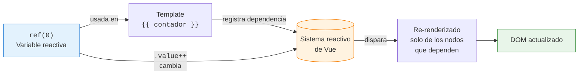
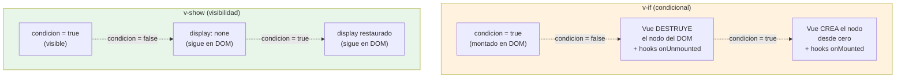
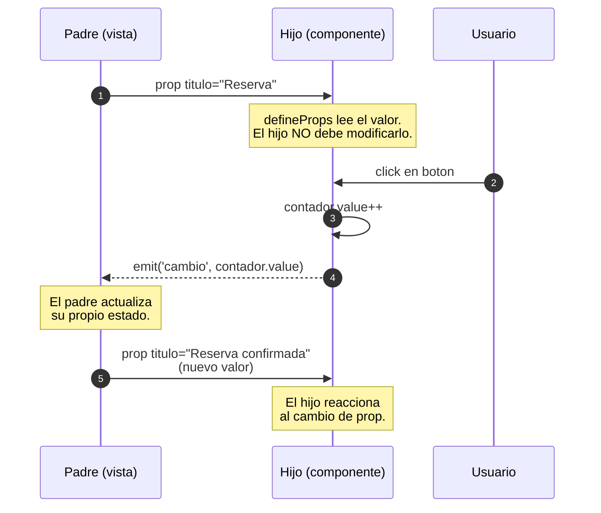
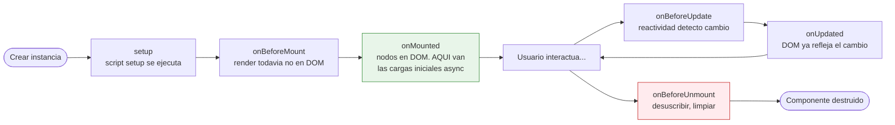
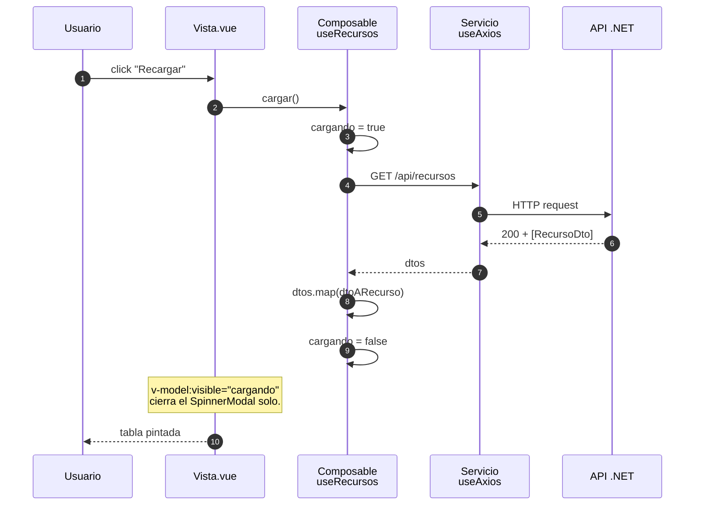
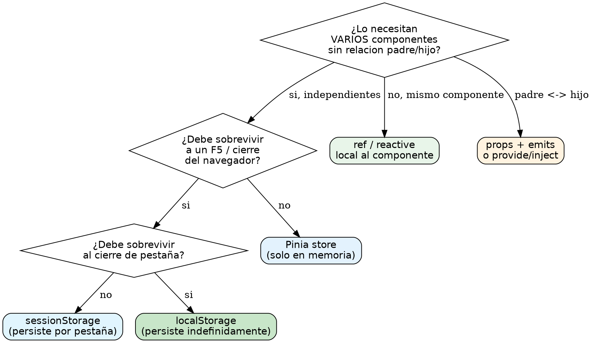
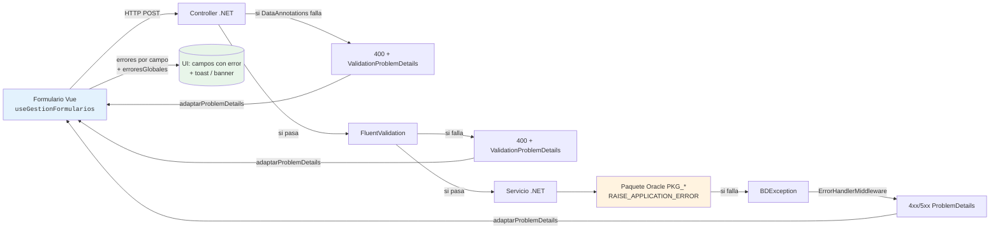
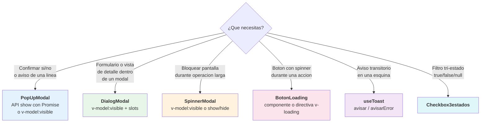

# Revisión didáctica · Sesiones Vue (S6–S10)

> Auditoría de las cinco sesiones del bloque Vue y propuestas concretas de mejora visual: diagramas (Mermaid + Kroki), admoniciones y pequeñas reorganizaciones. Cada propuesta incluye el **código listo para pegar** en el `.md` correspondiente.

::: info ALCANCE
- Sesiones revisadas: 6, 7, 8 y 9 (cuerpo casi cerrado) + 10 (estructura por escribir).
- Plugin de diagramas: `vitepress-plugin-diagrams` ya configurado en `.vitepress/config.mts` (Kroki en `https://kroki.io`, mermaid renderizado por el plugin nativo `vitepress-mermaid`).
- Disponibles: Mermaid (nativo) + 27 tipos Kroki (DBML, ERD, C4-PlantUML, D2, BPMN, GraphViz, Excalidraw, Svgbob, …).
:::

## 1. Resumen ejecutivo

### Estado actual del texto

Las cuatro sesiones cerradas (S6–S9) tienen un nivel didáctico **alto de base**: cada una abre con `::: info CONTEXTO`, tiene "Plan de sesión", tablas comparativas, ejemplos con código, ejercicios y test de autoevaluación con respuestas plegadas en `::: details`. Las admoniciones se usan, pero **no de forma sistemática**: hay `::: tip` y `::: warning` sueltos donde un patrón regular ayudaría.

**Lo que no usan hoy y aportaría valor real:**

| Recurso | Estado | Dónde brilla |
|---|---|---|
| **Diagramas Mermaid** | 0 en bloque Vue | Lifecycle, props/emits, watch, validación |
| **Diagramas Kroki** | 0 en bloque Vue | Arquitectura tres capas (C4-PlantUML / D2), decisiones de estado (GraphViz) |
| `::: details` para código avanzado | usado solo en soluciones | Variantes de la misma API |
| Anchors estables `{#id}` | usado parcialmente | Para enlazar desde demos y otras sesiones |
| Code-groups `::: code-group` | rarísimo | Comparativas "modo A vs modo B" |

### Resumen de propuestas por sesión

| Sesión | Diagramas propuestos | Admoniciones a sistematizar | Esfuerzo |
|---|---|---|---|
| **S6 Fundamentos** | 1 mermaid (reactividad), 1 svgbob (anatomía .vue) | reordenar 2 warnings sueltos | Bajo |
| **S7 Directivas** | 1 mermaid (v-if vs v-show), 1 graphviz (penalización de :key=index) | code-group en §2.4 | Bajo |
| **S8 Componentes** | 3 mermaid (props/emits sequence, defineModel, lifecycle timeline) | code-group en defineModel | Medio |
| **S9 Arquitectura** | **1 C4-PlantUML (3 capas) — joya**, 2 mermaid (sequence + flowchart validación), 1 graphviz (decisión de estado) | TODO el §4.2 se beneficia | **Alto valor** |
| **S10 Componentes UA** | 1 mermaid (árbol decisión modales), reescribir desde 0 | crear estructura | Crear |

---

## 2. Sesión 6 — Fundamentos

### Propuesta 6.1 · Diagrama de reactividad (§1.4) {#s6-reactividad}

**Problema didáctico:** la prosa explica "Vue actualiza automáticamente el DOM cuando cambian los datos" pero el alumno no ve **el ciclo** (dep tracking → trigger → re-render). Un diagrama compacto fija la idea para toda la sesión.

**Dónde insertarlo:** justo después de la frase de apertura de §1.4 ("La reactividad es la capacidad de Vue de **actualizar automáticamente** el DOM cuando cambian los datos.").

````markdown


<!-- diagram id="s6-ciclo-reactividad" caption: "Ciclo de reactividad de Vue: dependencias, cambio y re-render selectivo" -->
````

### Propuesta 6.2 · Anatomía de un `.vue` (§1.2) {#s6-anatomia}

**Problema didáctico:** el bloque de código actual explica las 3 secciones pero un *boceto visual* refuerza el modelo mental. Excalidraw o Svgbob son ideales para algo "tipo pizarra".

**Dónde insertarlo:** debajo del primer bloque de código en §1.2 (después del HTML con `<script>`/`<template>`/`<style>`).

````markdown
```svgbob
+---------------------------+
| <script setup lang="ts">  |   <- LOGICA TypeScript
|   imports                 |      (lo que el componente sabe hacer)
|   ref / reactive          |
|   funciones               |
| </script>                 |
+---------------------------+
| <template>                |   <- VISTA (HTML + directivas)
|   {{ interpolacion }}     |      (lo que el componente pinta)
|   v-if / v-for / @click   |
| </template>               |
+---------------------------+
| <style scoped lang="scss">|   <- ESTILO local
|   .clase { ... }          |      (CSS encapsulado al componente)
| </style>                  |
+---------------------------+
```

<!-- diagram id="s6-anatomia-vue" caption: "Las tres secciones de un componente .vue" -->
````

### Propuesta 6.3 · Reordenar admoniciones

- §1.4: el bloque "IMPORTANTE: en script usa `.value`, en template no" merece ser **lo primero** del subapartado de `ref` (no al final). Es la regla que más errores genera.
- §1.5: el `::: warning` sobre "interpolación solo acepta expresiones" funcionaría mejor como `::: tip REGLA DE ORO`.

---

## 3. Sesión 7 — Directivas, eventos y datos

### Propuesta 7.1 · `v-if` vs `v-show` con diagrama de estado (§2.4) {#s7-vif-vshow}

**Problema didáctico:** la tabla actual es buena pero plana. El alumno se confunde porque "los dos hacen lo mismo a la vista". Un diagrama del DOM antes/después aclara la diferencia material.

**Dónde insertarlo:** entre la sección "`v-show`" y "¿Cuándo usar cada uno?".

````markdown


<!-- diagram id="s7-vif-vshow-ciclo" caption: "v-if destruye/recrea el nodo; v-show solo cambia su display" -->

::: tip CONSECUENCIA PRACTICA
Si un componente hijo dentro de `v-if` tiene `onMounted` con una llamada a la API, esa llamada se repetira CADA vez que `condicion` pase de false a true. Con `v-show` solo ocurre una vez (cuando se monta el padre).
:::
````

### Propuesta 7.2 · Por qué `:key` no debe ser el índice (§2.5) {#s7-key-indice}

**Problema didáctico:** la documentación lo prohibe pero no explica visualmente lo que pasa. Un diagrama con dos columnas (antes/después de borrar el 2º elemento) es muy didáctico.

**Sugerencia:** mantener como un `::: details Ver por que pasa esto` para no romper el flujo principal.

````markdown
::: details Por que :key="index" rompe v-for con elementos con estado

```svgbob
ANTES                          DESPUES de borrar B
                               (con :key="index")

+----+---+                     +----+---+
| 0  | A |  estado: foco       | 0  | A |  estado: foco
+----+---+                     +----+---+
| 1  | B |  estado: editando   | 1  | C |  estado: editando ?!
+----+---+                     +----+---+      (era de B)
| 2  | C |  estado: -          
+----+---+                     

Vue ve la misma clave 1, decide REUTILIZAR el <input>,
y conserva el estado interno de B en lo que ahora es C.
```

<!-- diagram id="s7-key-index-bug" caption: "Reutilizacion erronea de nodos cuando la key cambia de significado" -->

Con `:key="item.id"` esto no ocurre: Vue ve que la id 1 (B) ya no está y monta uno nuevo para C.
:::
````

### Propuesta 7.3 · Code-group en `v-if` vs `v-show`

Convertir los dos bloques de código de §2.4 en un único `::: code-group` para que el alumno los compare lado a lado.

---

## 4. Sesión 8 — Componentes y comunicación

### Propuesta 8.1 · Props/Emits como sequence diagram (§3.2/3.3) {#s8-props-emits}

**Problema didáctico:** Padre↓Hijo, Hijo↑Padre es la regla más importante del bloque. Un secuencial fija el contrato.

**Dónde insertarlo:** al principio de §3.2 (justo después del "Para qué sirven las props").

````markdown


<!-- diagram id="s8-props-emits" caption: "Datos bajan via props, eventos suben via emits" -->
````

### Propuesta 8.2 · `defineModel` como atajo de props+emit (§3.4) {#s8-define-model}

**Dónde:** sustituir la tabla "Comparación" por una visualización lado a lado.

````markdown
```mermaid
flowchart LR
    subgraph manual["Sin defineModel (manual)"]
        P1[Padre<br/>v-model='nombre'] -->|prop modelValue| H1[Hijo]
        H1 -->|emit update:modelValue| P1
    end
    subgraph automatico["Con defineModel"]
        P2[Padre<br/>v-model='nombre'] <-->|defineModel| H2[Hijo<br/><code>const v = defineModel()</code>]
    end
    style manual stroke-dasharray: 5 5
```

<!-- diagram id="s8-define-model" caption: "defineModel compacta prop + emit en una sola declaracion bidireccional" -->
````

### Propuesta 8.3 · Lifecycle como timeline (§3.6) {#s8-lifecycle}

````markdown


<!-- diagram id="s8-lifecycle" caption: "Hooks de ciclo de vida de un componente Vue 3" -->

::: tip CUANDO USAR CADA UNO
- `onMounted`: cargas iniciales que necesitan el DOM montado (peticiones, focus, integraciones con librerias DOM).
- `onUpdated`: rarisimo en codigo de la UA. Si crees que lo necesitas, casi seguro hay un `computed` o `watch` mejor.
- `onBeforeUnmount`: limpiar suscripciones, intervalos, listeners globales. Si no lo haces, hay leak.
:::
````

---

## 5. Sesión 9 — Arquitectura *(la sesión con mayor potencial)*

### Propuesta 9.1 · Arquitectura tres capas con **C4-PlantUML** (§4.2) {#s9-arquitectura}

**Problema didáctico:** §4.2 es el corazón de la sesión y hoy se explica solo con un diagrama ASCII básico (`Vista → Composable → Servicio`). El esquema C4 nivel componente es el lenguaje estándar para arquitectura y aquí encaja perfecto.

**Dónde insertarlo:** sustituir el ASCII actual al inicio de §4.2.

````markdown
```c4plantuml
@startuml
!include <C4/C4_Component>

title Arquitectura de una pantalla en uaReservas

Person(usuario, "Usuario", "PDI / PTGAS / Alumno")

Container_Boundary(spa, "SPA Vue 3") {
    Component(vista, "Vista (.vue)", "Vue 3 + TypeScript", "Template + eventos UI.<br/>NO sabe de HTTP ni DTOs.")
    Component(comp, "Composable<br/><i>useRecursos.ts</i>", "TypeScript", "Estado reactivo.<br/>Convierte DTOs (PascalCase) a<br/>interfaces de cliente (camelCase).")
    Component(serv, "Servicio<br/><i>recursosServicio.ts</i>", "TypeScript + useAxios", "Llamadas HTTP.<br/>Conoce las URLs del backend.")
}

System_Ext(api, "API REST", ".NET 10")

Rel(usuario, vista, "Interactua", "click/teclado")
Rel(vista, comp, "Lee estado y llama acciones", "import")
Rel(comp, serv, "Pide datos", "import")
Rel(serv, api, "GET/POST/PUT/DELETE", "JSON/HTTPS")

@enduml
```

<!-- diagram id="s9-arquitectura-c4" caption: "Tres capas de la SPA: vista, composable y servicio. Cada una tiene una responsabilidad clara." -->
````

### Propuesta 9.2 · Flujo de una petición (§4.3) {#s9-flujo-peticion}

````markdown


<!-- diagram id="s9-flujo-peticion" caption: "Flujo completo Vista -> Composable -> Servicio -> API" -->
````

### Propuesta 9.3 · Decidir tipo de estado (§4.5) {#s9-decision-estado}

**Problema didáctico:** la tabla `localStorage` vs `sessionStorage` vs `Pinia` se queda corta como guía. Un árbol de decisión es más útil cuando el alumno está delante del código real.

````markdown


<!-- diagram id="s9-decision-estado" caption: "Decidir donde vive el estado segun alcance y persistencia" -->
````

### Propuesta 9.4 · Validación cross-capa (§4.4)

**Sugerencia:** mover la sección a un flowchart que cierre el círculo Oracle → .NET → Vue. Encaja con `ua-validacion` skill.

````markdown


<!-- diagram id="s9-validacion-cross-capa" caption: "Pipeline de validacion: Vue -> .NET (DataAnnotations + FluentValidation) -> Oracle, y vuelta con ProblemDetails" -->
````

---

## 6. Sesión 10 — Componentes UA *(escribir desde cero)*

S10 está vacía (50 líneas con "Pendiente de publicación"). Propongo construirla **directamente** con la pedagogía revisada.

### Propuesta 10.1 · Árbol de decisión de modales

**Dónde:** al inicio absoluto de la sesión, como guía mental antes de ver cada componente.

````markdown


<!-- diagram id="s10-decision-modales" caption: "Elegir el componente UA correcto segun la necesidad" -->
````

### Propuesta 10.2 · Estructura completa de S10 (esqueleto)

```
## 10.1 PopUpModal
    - Cuando usarlo (árbol decisión arriba)
    - Modo declarativo (v-model:visible) + ejemplo demo
    - Modo imperativo (show() con Promise) + ejemplo demo
    - Tabla comparativa: cuándo cada modo

## 10.2 DialogModal
    - Slots #header / #body / #buttons (referencia a slots S8)
    - v-model:visible
    - Caso: editar Recurso

## 10.3 SpinnerModal
    - Patrón "cargando" (referencia al ejemplo S8 lifecycle)
    - v-model:visible con una sola variable booleana

## 10.4 BotonLoading
    - Componente vs directiva v-loading
    - Antipatrón: doble click sin proteger

## 10.5 useToast
    - avisar / avisarError / avisarPersonalizado
    - Grupos (cerrar varios a la vez)
    - ToastContainer + Teleport (referencia conceptual a Teleport más adelante)

## 10.6 Checkbox3estados
    - boolean | null como contrato útil
    - Caso: filtro activo / inactivo / todos

## 10.7 Teleport (Vue nativo)
    - Para qué sirve y por qué los modales UA lo usan internamente

## 10.8 Integración CRUD completa
    - Demo Sesion10CrudRecursos.vue (mock)
    - Combina los 6 componentes anteriores
```

---

## 7. Mejoras transversales (todas las sesiones)

1. **Anchors estables** en todos los `##` (`{#id-kebab}`) para enlazar desde las demos.
2. **`::: code-group`** en cada lugar donde el texto hoy presenta "Modo A:" + bloque, "Modo B:" + bloque consecutivos.
3. **`::: details Ver solucion`** para los enunciados de ejercicios (ya se hace en S6, normalizar en el resto).
4. **`::: warning ANTIPATRON`** como nueva categoría: usar específicamente para los errores frecuentes que mencionan los `### Errores frecuentes` que ya tienen S7 y S8.

---

## 8. Orden de ejecución sugerido

Por **valor pedagógico / esfuerzo**:

| Orden | Sesión | Cambio | Por qué primero |
|---|---|---|---|
| 1 | **S9 §4.2** | C4-PlantUML tres capas | Es el concepto más importante del bloque y hoy se explica con ASCII. Salto cualitativo enorme. |
| 2 | **S8 §3.2/3.3** | Sequence diagram props/emits | Regla más importante del bloque, base para todo lo que viene. |
| 3 | **S10 completa** | Crear desde 0 con árbol decisión + cuerpo | Hoy es un placeholder; bloquea la entrega del bloque Vue. |
| 4 | **S8 §3.6** | Diagrama lifecycle | Fija una idea que el alumno olvida cada semana. |
| 5 | **S9 §4.5** | Árbol decisión de estado | Sustituye una tabla por algo accionable. |
| 6 | **S7 §2.4** | Diagrama v-if vs v-show | Aclara una confusión clásica. |
| 7 | **S6 §1.4** | Diagrama ciclo reactividad | Mejora estética, no rompe nada. |
| 8 | Resto | Code-groups, anchors, antipatrones | Cosméticos. |

¿Quieres que arranque por las propuestas 1–3 (las de mayor valor) o prefieres una pasada completa (1–8)?
