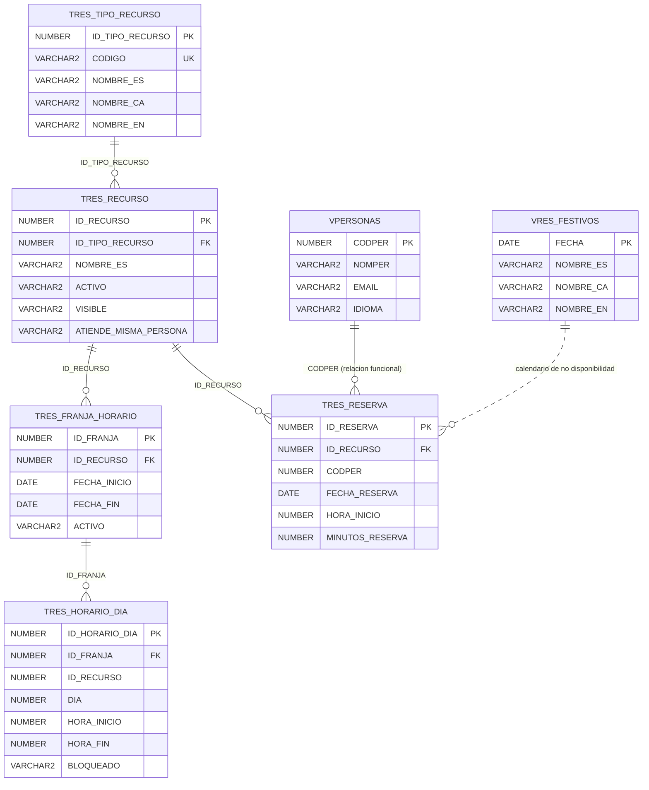

# Diccionario del schema CURSONORMADM

::: info CONTEXTO
Esta pagina es material de profesor. Resume el contenido de `parte-oracle/SQL/CURSONORMADM/TABLAS` y lo convierte en una guia de explicacion: que representa cada tabla, como se relaciona con las demas, que restricciones tiene, que indices existen por PK/UK y que indices conviene comentar como mejora.
:::

[[toc]]

## Vista global del modelo {#vista-global}

El nucleo funcional es ReserUA: tipos de recurso, recursos reservables, franjas de disponibilidad, tramos diarios y reservas realizadas por personas.



<!-- diagram id="cursonormadm-er-global" caption: "Relaciones principales del schema CURSONORMADM" -->

::: warning IMPORTANTE
El export no incluye scripts `CREATE INDEX` independientes. Los indices documentados como "existentes" son los que Oracle crea por `PRIMARY KEY` o `UNIQUE`. Los indices sobre FK y columnas de consulta se indican como **recomendados para comentar en clase** cuando no aparecen en el DDL.
:::

## Resumen rapido {#resumen-rapido}

| Tabla | Papel | Relaciones principales |
|-------|-------|------------------------|
| `TRES_TIPO_RECURSO` | Catalogo de tipos de recurso | Padre de `TRES_RECURSO` |
| `TRES_RECURSO` | Recurso reservable | Hija de tipo; padre de franjas y reservas |
| `TRES_FRANJA_HORARIO` | Periodo de calendario por recurso | Hija de recurso; padre de horarios diarios |
| `TRES_HORARIO_DIA` | Tramos horarios de una franja | Hija de franja; contiene `ID_RECURSO` sin FK declarada |
| `TRES_RESERVA` | Reserva de una persona sobre un recurso | Hija de recurso; usa `CODPER` como relacion funcional con personas |
| `VPERSONAS` | Tabla de apoyo de personas | Referencia funcional desde reservas, sin FK declarada |
| `VRES_FESTIVOS` | Calendario de festivos | Apoyo funcional para validar disponibilidad |

## `TRES_TIPO_RECURSO` {#tres-tipo-recurso}

### Para que sirve

Clasifica los recursos reservables. Permite distinguir, por ejemplo, si un recurso es una sala, un aula, un vehiculo o cualquier otro tipo funcional que la aplicacion necesite. Es un catalogo maestro: `TRES_RECURSO` apunta a esta tabla mediante `ID_TIPO_RECURSO`.

### DDL

```sql
CREATE TABLE "CURSONORMADM"."TRES_TIPO_RECURSO" 
   (    "ID_TIPO_RECURSO" NUMBER GENERATED BY DEFAULT ON NULL AS IDENTITY MINVALUE 1 MAXVALUE 9999999999999999999999999999 INCREMENT BY 1 START WITH 1 CACHE 20 NOORDER  NOCYCLE  NOKEEP  NOSCALE  NOT NULL ENABLE, 
    "CODIGO" VARCHAR2(100) COLLATE "USING_NLS_COMP", 
    "NOMBRE_ES" VARCHAR2(150) COLLATE "USING_NLS_COMP", 
    "NOMBRE_CA" VARCHAR2(150) COLLATE "USING_NLS_COMP", 
    "NOMBRE_EN" VARCHAR2(150) COLLATE "USING_NLS_COMP", 
     CONSTRAINT "SYS_CK_TTR_ID_NN" CHECK ( "ID_TIPO_RECURSO" is not null ) ENABLE, 
     CONSTRAINT "SYS_CK_TTR_CODIGO_NN" CHECK ( "CODIGO" is not null ) ENABLE, 
     CONSTRAINT "SYS_CK_TTR_NOMBRE_ES_NN" CHECK ( "NOMBRE_ES" is not null ) ENABLE, 
     CONSTRAINT "SYS_CK_TTR_NOMBRE_CA_NN" CHECK ( "NOMBRE_CA" is not null ) ENABLE, 
     CONSTRAINT "SYS_CK_TTR_NOMBRE_EN_NN" CHECK ( "NOMBRE_EN" is not null ) ENABLE, 
     CONSTRAINT "PK_TRES_TIPO_RECURSO" PRIMARY KEY ("ID_TIPO_RECURSO")
  USING INDEX  ENABLE, 
     CONSTRAINT "UK_TRES_TIPO_RECURSO_CODIGO" UNIQUE ("CODIGO")
  USING INDEX  ENABLE
   )  DEFAULT COLLATION "USING_NLS_COMP";
```

### Campos importantes

| Campo | Explicacion docente |
|-------|---------------------|
| `ID_TIPO_RECURSO` | Identificador tecnico generado por `IDENTITY`. Es la PK y la FK usada desde `TRES_RECURSO`. |
| `CODIGO` | Codigo funcional unico. Debe ser estable y entendible por desarrollo, no un texto libre. |
| `NOMBRE_ES`, `NOMBRE_CA`, `NOMBRE_EN` | Nombres multidioma. Enseña el patron `_ES`, `_CA`, `_EN` que despues aprovecha el automapeo de idioma. |

### Restricciones e indices

| Objeto | Tipo | Para que sirve |
|--------|------|----------------|
| `PK_TRES_TIPO_RECURSO` | PK + indice automatico | Localiza un tipo por `ID_TIPO_RECURSO` y soporta las FK de tablas hijas. |
| `UK_TRES_TIPO_RECURSO_CODIGO` | UK + indice automatico | Evita dos tipos con el mismo codigo funcional. |
| `SYS_CK_TTR_*_NN` | Checks de no nulo | El export expresa los obligatorios como checks nombrados. |

### Uso en la aplicacion

La aplicacion lo usa para construir filtros, formularios y listados de recursos por tipo. La vista `VRES_TIPO_RECURSO` expone el catalogo a `CURSONORMWEB`, y el package `PKG_RES_TIPO_RECURSO` centraliza altas, actualizaciones y borrado protegido.

## `TRES_RECURSO` {#tres-recurso}

### Para que sirve

Representa el recurso reservable: sala, aula, vehiculo, puesto o cualquier elemento que pueda recibir reservas. Es la tabla central del dominio. Las reservas, franjas y horarios tienen sentido porque existe un recurso al que aplicarse.

### DDL

```sql
CREATE TABLE "CURSONORMADM"."TRES_RECURSO" 
   (    "ID_RECURSO" NUMBER GENERATED BY DEFAULT ON NULL AS IDENTITY MINVALUE 1 MAXVALUE 9999999999999999999999999999 INCREMENT BY 1 START WITH 1 CACHE 20 NOORDER  NOCYCLE  NOKEEP  NOSCALE  NOT NULL ENABLE, 
    "NOMBRE_ES" VARCHAR2(200) COLLATE "USING_NLS_COMP", 
    "NOMBRE_CA" VARCHAR2(200) COLLATE "USING_NLS_COMP", 
    "NOMBRE_EN" VARCHAR2(200) COLLATE "USING_NLS_COMP", 
    "DESCRIPCION_ES" CLOB COLLATE "USING_NLS_COMP", 
    "DESCRIPCION_CA" CLOB COLLATE "USING_NLS_COMP", 
    "DESCRIPCION_EN" CLOB COLLATE "USING_NLS_COMP", 
    "FECHA_MODIFICACION" DATE DEFAULT sysdate, 
    "GRANULIDAD" NUMBER, 
    "DURACION" NUMBER, 
    "ID_TIPO_RECURSO" NUMBER, 
    "ACTIVO" VARCHAR2(1) COLLATE "USING_NLS_COMP" DEFAULT 'S' NOT NULL ENABLE, 
    "VISIBLE" VARCHAR2(1) COLLATE "USING_NLS_COMP" DEFAULT 'S' NOT NULL ENABLE, 
    "ATIENDE_MISMA_PERSONA" VARCHAR2(1) COLLATE "USING_NLS_COMP" DEFAULT 'N' NOT NULL ENABLE, 
     CONSTRAINT "CK_TRES_RECURSO_ACTIVO" CHECK ( activo in ( 'S',
                                                         'N' ) ) ENABLE, 
     CONSTRAINT "CK_TRES_RECURSO_VISIBLE" CHECK ( visible in ( 'S',
                                                           'N' ) ) ENABLE, 
     CONSTRAINT "SYS_C008716" CHECK ( "ID_RECURSO" is not null ) ENABLE, 
     CONSTRAINT "SYS_C008717" CHECK ( "NOMBRE_ES" is not null ) ENABLE, 
     CONSTRAINT "SYS_C008718" CHECK ( "NOMBRE_CA" is not null ) ENABLE, 
     CONSTRAINT "SYS_C008719" CHECK ( "NOMBRE_EN" is not null ) ENABLE, 
     CONSTRAINT "SYS_C008723" CHECK ( "FECHA_MODIFICACION" is not null ) ENABLE, 
     CONSTRAINT "PK_TRES_RECURSO" PRIMARY KEY ("ID_RECURSO")
  USING INDEX  ENABLE, 
     CONSTRAINT "FK_TRES_RECURSO_TIPO_RECURSO" FOREIGN KEY ("ID_TIPO_RECURSO")
      REFERENCES "CURSONORMADM"."TRES_TIPO_RECURSO" ("ID_TIPO_RECURSO") ENABLE
   )  DEFAULT COLLATION "USING_NLS_COMP";
```

### Campos importantes

| Campo | Explicacion docente |
|-------|---------------------|
| `ID_RECURSO` | PK tecnica del recurso. La usan `TRES_RESERVA` y `TRES_FRANJA_HORARIO`. |
| `ID_TIPO_RECURSO` | Clasificacion funcional. FK hacia `TRES_TIPO_RECURSO`. |
| `NOMBRE_*` y `DESCRIPCION_*` | Texto multidioma para UI. Los nombres son obligatorios; las descripciones son opcionales y CLOB. |
| `GRANULIDAD` | Unidad minima de reserva o salto horario esperable. Debe explicarse con ejemplos: 15, 30, 60 minutos. |
| `DURACION` | Duracion estandar o maxima que puede orientar el alta de reservas. |
| `ACTIVO` | Controla si el recurso sigue operativo. |
| `VISIBLE` | Controla si aparece en listados publicos. Puede existir un recurso activo pero no visible. |
| `ATIENDE_MISMA_PERSONA` | Regla funcional para recursos que requieren continuidad de atencion por la misma persona. |

### Restricciones e indices

| Objeto | Tipo | Para que sirve |
|--------|------|----------------|
| `PK_TRES_RECURSO` | PK + indice automatico | Recuperar un recurso por ID y soportar FK hijas. |
| `FK_TRES_RECURSO_TIPO_RECURSO` | FK | Impide asignar a un recurso un tipo inexistente. |
| `CK_TRES_RECURSO_ACTIVO` | CHECK | Garantiza dominio `S/N` en `ACTIVO`. |
| `CK_TRES_RECURSO_VISIBLE` | CHECK | Garantiza dominio `S/N` en `VISIBLE`. |
| `SYS_C008716`-`SYS_C008723` | Checks de no nulo | Protegen ID, nombres y fecha de modificacion. |

::: warning INDICES A COMENTAR
El DDL exportado no incluye un indice explicito sobre `ID_TIPO_RECURSO`. En una tabla hija con FK conviene revisar si existe un indice real en base de datos o añadirlo en el script de mejora, porque las consultas por tipo y los borrados/actualizaciones del padre lo agradecen.
:::

### Uso en la aplicacion

`TRES_RECURSO` alimenta el listado de recursos reservables, el detalle de cada recurso y las reglas de reserva. La vista `VRES_RECURSO` añade los nombres del tipo de recurso mediante JOIN y es la que debe consumir `CURSONORMWEB`.

## `TRES_FRANJA_HORARIO` {#tres-franja-horario}

### Para que sirve

Define periodos de calendario aplicables a un recurso. Una franja puede representar una temporada, una excepcion de disponibilidad, un periodo bloqueado o una configuracion temporal concreta.

### DDL

```sql
CREATE TABLE "CURSONORMADM"."TRES_FRANJA_HORARIO" 
   (    "ID_FRANJA" NUMBER GENERATED BY DEFAULT ON NULL AS IDENTITY MINVALUE 1 MAXVALUE 9999999999999999999999999999 INCREMENT BY 1 START WITH 1 CACHE 20 NOORDER  NOCYCLE  NOKEEP  NOSCALE  NOT NULL ENABLE, 
    "ID_RECURSO" NUMBER NOT NULL ENABLE, 
    "FECHA_INICIO" DATE NOT NULL ENABLE, 
    "FECHA_FIN" DATE NOT NULL ENABLE, 
    "ACTIVO" VARCHAR2(1) COLLATE "USING_NLS_COMP" DEFAULT 'S' NOT NULL ENABLE, 
     CONSTRAINT "CK_TRES_FRANJA_HORARIO_ACTIVO" CHECK ( activo in ( 'S',
                                                                'N' ) ) ENABLE, 
     CONSTRAINT "CK_TFRANJA_HORARIO_FECHAS" CHECK ( fecha_fin >= fecha_inicio ) ENABLE, 
     CONSTRAINT "PK_TFRANJA_HORARIO" PRIMARY KEY ("ID_FRANJA")
  USING INDEX  ENABLE, 
     CONSTRAINT "FK_TRES_FRANJA_RECURSO" FOREIGN KEY ("ID_RECURSO")
      REFERENCES "CURSONORMADM"."TRES_RECURSO" ("ID_RECURSO") ENABLE
   )  DEFAULT COLLATION "USING_NLS_COMP";
```

### Campos importantes

| Campo | Explicacion docente |
|-------|---------------------|
| `ID_FRANJA` | PK tecnica. Agrupa los horarios diarios que se aplican en un periodo. |
| `ID_RECURSO` | Recurso afectado por la franja. FK hacia `TRES_RECURSO`. |
| `FECHA_INICIO`, `FECHA_FIN` | Rango de fechas donde la franja aplica. |
| `ACTIVO` | Permite desactivar una franja sin borrarla. |

### Restricciones e indices

| Objeto | Tipo | Para que sirve |
|--------|------|----------------|
| `PK_TFRANJA_HORARIO` | PK + indice automatico | Recuperar la franja por ID. |
| `FK_TRES_FRANJA_RECURSO` | FK | Evita franjas asociadas a recursos inexistentes. |
| `CK_TFRANJA_HORARIO_FECHAS` | CHECK | Impide que `FECHA_FIN` sea anterior a `FECHA_INICIO`. |
| `CK_TRES_FRANJA_HORARIO_ACTIVO` | CHECK | Limita `ACTIVO` a `S/N`. |

::: warning INDICES A COMENTAR
Para buscar franjas por recurso y rango de fechas convendria un indice sobre `(ID_RECURSO, FECHA_INICIO, FECHA_FIN)` o al menos sobre `ID_RECURSO`. El export no lo trae como `CREATE INDEX`.
:::

### Uso en la aplicacion

La aplicacion la usara para saber que calendario aplica a un recurso en una fecha concreta. Es una tabla clave para explicar que algunas reglas se pueden proteger con constraints (`FECHA_FIN >= FECHA_INICIO`) y otras, como solapes entre franjas, suelen necesitar package.

## `TRES_HORARIO_DIA` {#tres-horario-dia}

### Para que sirve

Define tramos horarios diarios dentro de una franja. Permite expresar que dias y horas estan disponibles o bloqueados.

### DDL

```sql
CREATE TABLE "CURSONORMADM"."TRES_HORARIO_DIA" 
   (    "ID_HORARIO_DIA" NUMBER GENERATED BY DEFAULT ON NULL AS IDENTITY MINVALUE 1 MAXVALUE 9999999999999999999999999999 INCREMENT BY 1 START WITH 1 CACHE 20 NOORDER  NOCYCLE  NOKEEP  NOSCALE  NOT NULL ENABLE, 
    "ID_FRANJA" NUMBER, 
    "ID_RECURSO" NUMBER, 
    "DIA" NUMBER, 
    "HORA_INICIO" NUMBER NOT NULL ENABLE, 
    "MINUTO_INICIO" NUMBER NOT NULL ENABLE, 
    "HORA_FIN" NUMBER NOT NULL ENABLE, 
    "MINUTO_FIN" NUMBER NOT NULL ENABLE, 
    "ORDEN" NUMBER, 
    "BLOQUEADO" VARCHAR2(1) COLLATE "USING_NLS_COMP" DEFAULT 'S' NOT NULL ENABLE, 
     CONSTRAINT "CK_TRES_HORARIO_DIA_BLOQUEADO" CHECK ( bloqueado in ( 'S',
                                                                   'N' ) ) ENABLE, 
     CONSTRAINT "CK_TRES_HORARIO_DIA_DIA" CHECK ( dia is null
          or dia between 1 and 7 ) ENABLE, 
     CONSTRAINT "CK_TRES_HORARIO_DIA_HORA_FIN" CHECK ( hora_fin between 0 and 23 ) ENABLE, 
     CONSTRAINT "CK_TRES_HORARIO_DIA_HORA_INICIO" CHECK ( hora_inicio between 0 and 23 ) ENABLE, 
     CONSTRAINT "CK_TRES_HORARIO_DIA_MIN_FIN" CHECK ( minuto_fin between 0 and 59 ) ENABLE, 
     CONSTRAINT "CK_TRES_HORARIO_DIA_MIN_INICIO" CHECK ( minuto_inicio between 0 and 59 ) ENABLE, 
     CONSTRAINT "PK_TRES_HORARIO_DIA" PRIMARY KEY ("ID_HORARIO_DIA")
  USING INDEX  ENABLE, 
     CONSTRAINT "FK_TRES_HOR_DIA_FRANJA" FOREIGN KEY ("ID_FRANJA")
      REFERENCES "CURSONORMADM"."TRES_FRANJA_HORARIO" ("ID_FRANJA") ENABLE
   )  DEFAULT COLLATION "USING_NLS_COMP";
```

### Campos importantes

| Campo | Explicacion docente |
|-------|---------------------|
| `ID_HORARIO_DIA` | PK tecnica del tramo. |
| `ID_FRANJA` | Relacion formal con la franja. Es la unica FK declarada. |
| `ID_RECURSO` | Campo presente para relacion directa con recurso, pero sin FK declarada en el DDL. |
| `DIA` | Dia de semana, con rango 1-7 o nulo. |
| `HORA_INICIO`, `MINUTO_INICIO` | Inicio del tramo. |
| `HORA_FIN`, `MINUTO_FIN` | Fin del tramo. |
| `ORDEN` | Orden de presentacion o procesamiento. |
| `BLOQUEADO` | `S/N` para distinguir tramos bloqueados de tramos disponibles. |

### Restricciones e indices

| Objeto | Tipo | Para que sirve |
|--------|------|----------------|
| `PK_TRES_HORARIO_DIA` | PK + indice automatico | Recuperar el tramo por ID. |
| `FK_TRES_HOR_DIA_FRANJA` | FK | Vincula el tramo a una franja existente. |
| `CK_TRES_HORARIO_DIA_DIA` | CHECK | Limita el dia a 1-7 o nulo. |
| Checks de hora/minuto | CHECK | Garantizan horas 0-23 y minutos 0-59. |
| `CK_TRES_HORARIO_DIA_BLOQUEADO` | CHECK | Limita `BLOQUEADO` a `S/N`. |

::: warning PUNTOS DE REVISION
El DDL no declara FK de `ID_RECURSO` hacia `TRES_RECURSO` y tampoco valida que la hora fin sea posterior a la hora inicio. Son dos puntos utiles para debatir en clase: que protege el DDL actual y que reforzariamos en una solucion revisada.
:::

### Uso en la aplicacion

La aplicacion lo usara para calcular disponibilidad diaria: que tramos se ofrecen o se bloquean en funcion de una franja, un recurso y un dia de semana. Es la tabla mas interesante para explicar limites de los `CHECK`: validan rangos simples, pero los solapes entre tramos requieren logica de package.

## `TRES_RESERVA` {#tres-reserva}

### Para que sirve

Registra una reserva concreta de una persona (`CODPER`) sobre un recurso (`ID_RECURSO`) en una fecha, hora y duracion determinadas.

### DDL

```sql
CREATE TABLE "CURSONORMADM"."TRES_RESERVA" 
   (    "ID_RESERVA" NUMBER GENERATED BY DEFAULT ON NULL AS IDENTITY MINVALUE 1 MAXVALUE 9999999999999999999999999999 INCREMENT BY 1 START WITH 1 CACHE 20 NOORDER  NOCYCLE  NOKEEP  NOSCALE  NOT NULL ENABLE, 
    "ID_RECURSO" NUMBER, 
    "HORA_INICIO" NUMBER, 
    "MINUTO_INICIO" NUMBER, 
    "MINUTOS_RESERVA" NUMBER, 
    "FECHA_RESERVA" DATE, 
    "FECHA_ALTA" DATE DEFAULT sysdate, 
    "FECHA_CONFIRMACION" DATE, 
    "OBSERVACIONES" VARCHAR2(1000) COLLATE "USING_NLS_COMP", 
    "CODPER" NUMBER, 
     CONSTRAINT "CK_TRES_RESERVA_HORA_INICIO" CHECK ( hora_inicio between 0 and 23 ) ENABLE, 
     CONSTRAINT "CK_TRES_RESERVA_MINUTOS" CHECK ( minutos_reserva > 0 ) ENABLE, 
     CONSTRAINT "CK_TRES_RESERVA_MINUTO_INICIO" CHECK ( minuto_inicio between 0 and 59 ) ENABLE, 
     CONSTRAINT "SYS_C008761" CHECK ( "ID_RESERVA" is not null ) ENABLE, 
     CONSTRAINT "SYS_C008762" CHECK ( "ID_RECURSO" is not null ) ENABLE, 
     CONSTRAINT "SYS_C008763" CHECK ( "HORA_INICIO" is not null ) ENABLE, 
     CONSTRAINT "SYS_C008764" CHECK ( "MINUTO_INICIO" is not null ) ENABLE, 
     CONSTRAINT "SYS_C008765" CHECK ( "MINUTOS_RESERVA" is not null ) ENABLE, 
     CONSTRAINT "SYS_C008766" CHECK ( "FECHA_RESERVA" is not null ) ENABLE, 
     CONSTRAINT "SYS_C008767" CHECK ( "FECHA_ALTA" is not null ) ENABLE, 
     CONSTRAINT "PK_TRES_RESERVA" PRIMARY KEY ("ID_RESERVA")
  USING INDEX  ENABLE, 
     CONSTRAINT "FK_TRES_RESERVA_RECURSO" FOREIGN KEY ("ID_RECURSO")
      REFERENCES "CURSONORMADM"."TRES_RECURSO" ("ID_RECURSO") ENABLE
   )  DEFAULT COLLATION "USING_NLS_COMP";
```

### Campos importantes

| Campo | Explicacion docente |
|-------|---------------------|
| `ID_RESERVA` | PK de la reserva. |
| `ID_RECURSO` | Recurso reservado. FK hacia `TRES_RECURSO`. |
| `CODPER` | Persona que realiza o posee la reserva. Relacion funcional con `VPERSONAS`, aunque no hay FK declarada. |
| `FECHA_RESERVA` | Dia reservado. |
| `HORA_INICIO`, `MINUTO_INICIO` | Hora de inicio normalizada en dos columnas numericas. |
| `MINUTOS_RESERVA` | Duracion. Debe ser mayor que cero. |
| `FECHA_ALTA` | Fecha de alta, por defecto `SYSDATE`. |
| `FECHA_CONFIRMACION` | Fecha opcional para confirmar la reserva. |
| `OBSERVACIONES` | Texto libre de apoyo. |

### Restricciones e indices

| Objeto | Tipo | Para que sirve |
|--------|------|----------------|
| `PK_TRES_RESERVA` | PK + indice automatico | Recuperar y modificar una reserva por ID. |
| `FK_TRES_RESERVA_RECURSO` | FK | Evita reservas sobre recursos inexistentes. |
| `CK_TRES_RESERVA_HORA_INICIO` | CHECK | Limita la hora a 0-23. |
| `CK_TRES_RESERVA_MINUTO_INICIO` | CHECK | Limita el minuto a 0-59. |
| `CK_TRES_RESERVA_MINUTOS` | CHECK | Impide reservas de duracion cero o negativa. |
| `SYS_C008761`-`SYS_C008767` | Checks de no nulo | Protegen ID, recurso, hora, minuto, duracion, fecha de reserva y fecha de alta. |

::: warning INDICES A COMENTAR
Para explotacion real conviene revisar indices por `(ID_RECURSO, FECHA_RESERVA)`, por `CODPER` y por fecha. El package `PKG_RES_RESERVA` comprueba solapes consultando recurso, fecha y rangos horarios; sin indice puede escalar mal.
:::

### Uso en la aplicacion

Es la tabla que materializa la operacion principal: reservar. `PKG_RES_RESERVA` la usa para validar solapes y capacidad antes de insertar o actualizar. Es perfecta para explicar que una FK y varios checks no bastan: la regla "no solapar reservas" compara contra otras filas y vive en PL/SQL.

## `VPERSONAS` {#vpersonas}

### Para que sirve

Aunque el nombre empieza por `V`, el export lo trae como tabla. En este curso actua como tabla local de apoyo para personas. Permite asociar `CODPER` a nombre, email, NIF e idioma.

### DDL

```sql
CREATE TABLE "CURSONORMADM"."VPERSONAS" 
   (    "CODPER" NUMBER GENERATED BY DEFAULT ON NULL AS IDENTITY MINVALUE 1 MAXVALUE 9999999999999999999999999999 INCREMENT BY 1 START WITH 1 CACHE 20 NOORDER  NOCYCLE  NOKEEP  NOSCALE  NOT NULL ENABLE, 
    "NOMPER" VARCHAR2(200) COLLATE "USING_NLS_COMP", 
    "EMAIL" VARCHAR2(320) COLLATE "USING_NLS_COMP", 
    "NIF" VARCHAR2(20) COLLATE "USING_NLS_COMP", 
    "IDIOMA" VARCHAR2(2) COLLATE "USING_NLS_COMP", 
     CONSTRAINT "SYS_C008661" CHECK ( "CODPER" is not null ) ENABLE, 
     CONSTRAINT "SYS_C008662" CHECK ( "NOMPER" is not null ) ENABLE, 
     CONSTRAINT "PK_VPERSONAS" PRIMARY KEY ("CODPER")
  USING INDEX  ENABLE
   )  DEFAULT COLLATION "USING_NLS_COMP";
```

### Campos importantes

| Campo | Explicacion docente |
|-------|---------------------|
| `CODPER` | Identificador de persona. En proyectos UA suele venir de sistemas corporativos. |
| `NOMPER` | Nombre visible de la persona. |
| `EMAIL` | Correo de contacto. |
| `NIF` | Identificador fiscal/documental. |
| `IDIOMA` | Preferencia de idioma, util para seleccionar textos `_ES`, `_CA`, `_EN`. |

### Restricciones e indices

| Objeto | Tipo | Para que sirve |
|--------|------|----------------|
| `PK_VPERSONAS` | PK + indice automatico | Buscar personas por `CODPER`. |
| `SYS_C008661`, `SYS_C008662` | Checks de no nulo | Protegen `CODPER` y `NOMPER`. |

::: warning PUNTO DOCENTE
`TRES_RESERVA.CODPER` no declara FK hacia `VPERSONAS(CODPER)`. Conviene explicarlo: en muchos sistemas UA la persona vive en una fuente corporativa externa o vista de integracion, y no siempre se puede declarar una FK fisica.
:::

### Uso en la aplicacion

Sirve para mostrar quien ha realizado una reserva y para resolver datos personales basicos sin duplicarlos en `TRES_RESERVA`. En una aplicacion real, esta tabla podria sustituirse por una vista corporativa.

## `VRES_FESTIVOS` {#vres-festivos}

### Para que sirve

Tabla de calendario con dias festivos. Aunque empieza por `VRES_`, el export lo trae como tabla. Se usa como fuente de verdad para no ofertar reservas en dias no laborables o para etiquetar dias especiales.

### DDL

```sql
CREATE TABLE "CURSONORMADM"."VRES_FESTIVOS" 
   (    "FECHA" DATE NOT NULL ENABLE, 
    "NOMBRE_ES" VARCHAR2(200) COLLATE "USING_NLS_COMP" NOT NULL ENABLE, 
    "NOMBRE_CA" VARCHAR2(200) COLLATE "USING_NLS_COMP" NOT NULL ENABLE, 
    "NOMBRE_EN" VARCHAR2(200) COLLATE "USING_NLS_COMP" NOT NULL ENABLE, 
     CONSTRAINT "PK_VRES_FESTIVOS" PRIMARY KEY ("FECHA")
  USING INDEX  ENABLE
   )  DEFAULT COLLATION "USING_NLS_COMP";
```

### Campos importantes

| Campo | Explicacion docente |
|-------|---------------------|
| `FECHA` | Dia festivo. Es la PK. |
| `NOMBRE_ES`, `NOMBRE_CA`, `NOMBRE_EN` | Nombre multidioma del festivo. |

### Restricciones e indices

| Objeto | Tipo | Para que sirve |
|--------|------|----------------|
| `PK_VRES_FESTIVOS` | PK + indice automatico | Consulta rapida por fecha concreta. |
| `NOT NULL` en nombres | Restriccion de columna | Obliga a tener etiqueta multidioma para cada festivo. |

### Uso en la aplicacion

Se consulta al calcular disponibilidad. No necesita FK desde reservas: una reserva no "pertenece" a un festivo; simplemente se valida si `FECHA_RESERVA` cae en un dia bloqueado por calendario.

## Indices que conviene revisar antes de produccion {#indices-revisar}

El DDL actual cubre identificacion por PK y unicidad por UK. Para una aplicacion de reservas, el profesor puede remarcar estos indices como candidatos:

| Tabla | Indice recomendado | Motivo |
|-------|--------------------|--------|
| `TRES_RECURSO` | `(ID_TIPO_RECURSO)` | Busquedas por tipo y soporte de FK hija. |
| `TRES_FRANJA_HORARIO` | `(ID_RECURSO)` | Soporte de FK y busqueda de franjas de un recurso. |
| `TRES_FRANJA_HORARIO` | `(ID_RECURSO, FECHA_INICIO, FECHA_FIN)` | Resolver que franjas aplican a una fecha. |
| `TRES_HORARIO_DIA` | `(ID_FRANJA, DIA, ORDEN)` | Listar tramos de una franja en orden funcional. |
| `TRES_HORARIO_DIA` | `(ID_RECURSO, DIA, ORDEN)` | Si se usa `ID_RECURSO` para horarios genericos por recurso. |
| `TRES_RESERVA` | `(ID_RECURSO, FECHA_RESERVA)` | Validar solapes y consultar agenda de un recurso. |
| `TRES_RESERVA` | `(CODPER, FECHA_RESERVA)` | Consultar reservas de una persona. |

::: tip BUENA PRACTICA
No basta con "crear indices". Hay que justificar cada indice con una consulta real: FK, pantalla de listado, validacion de solape, agenda por recurso o historico por persona.
:::

## Preguntas utiles para clase {#preguntas-clase}

- Que reglas estan protegidas por constraints y cuales dependen del package?
- Donde falta una FK fisica y por que podria estar justificado?
- Que indice necesita la validacion de solapes de `PKG_RES_RESERVA`?
- Por que `TRES_TIPO_RECURSO` no tiene `ACTIVO` y `TRES_RECURSO` si?
- Que problemas aparecen si permitimos franjas u horarios solapados?
- Que diferencia hay entre tabla real, vista de lectura y tabla de apoyo con nombre historico que empieza por `V`?

