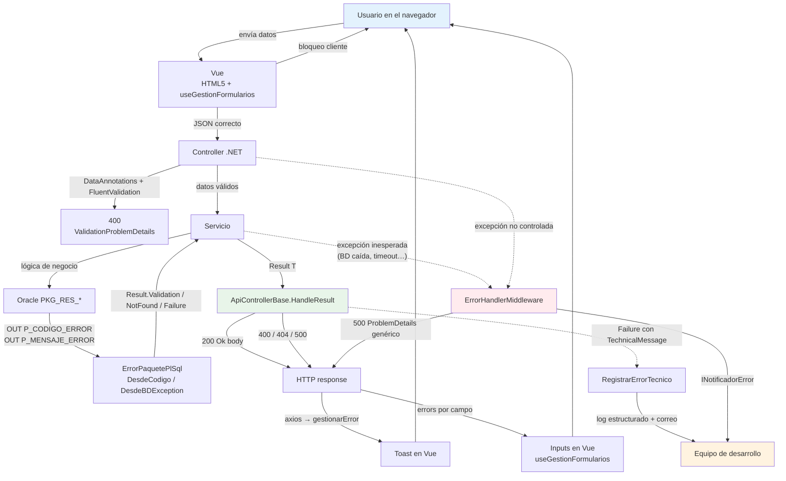
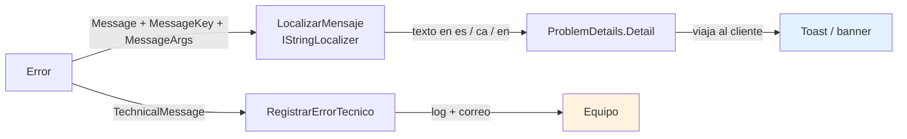
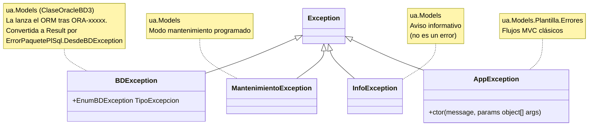
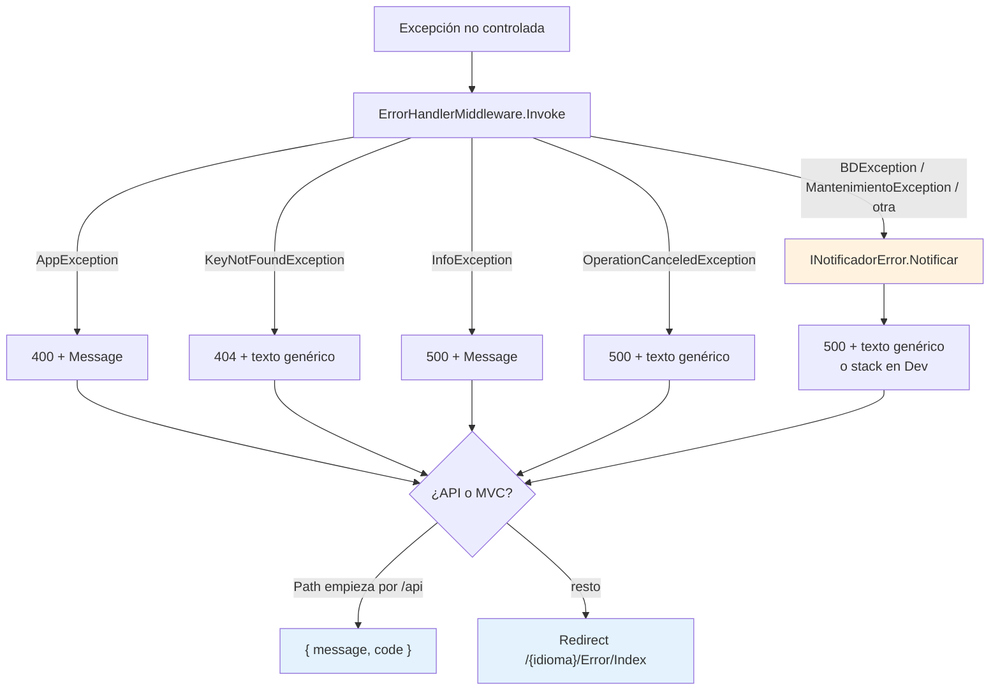
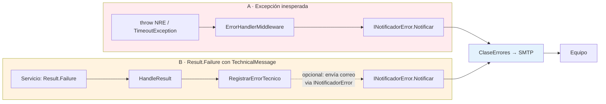
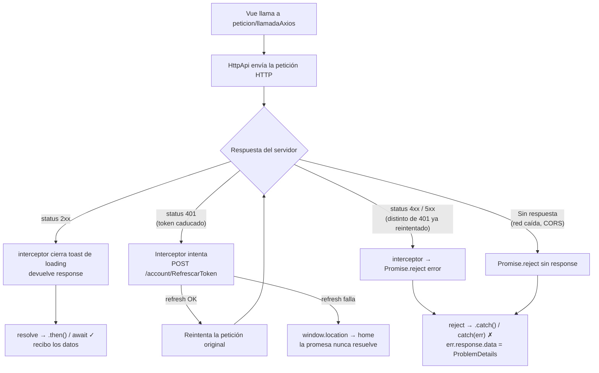
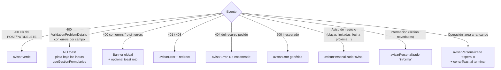
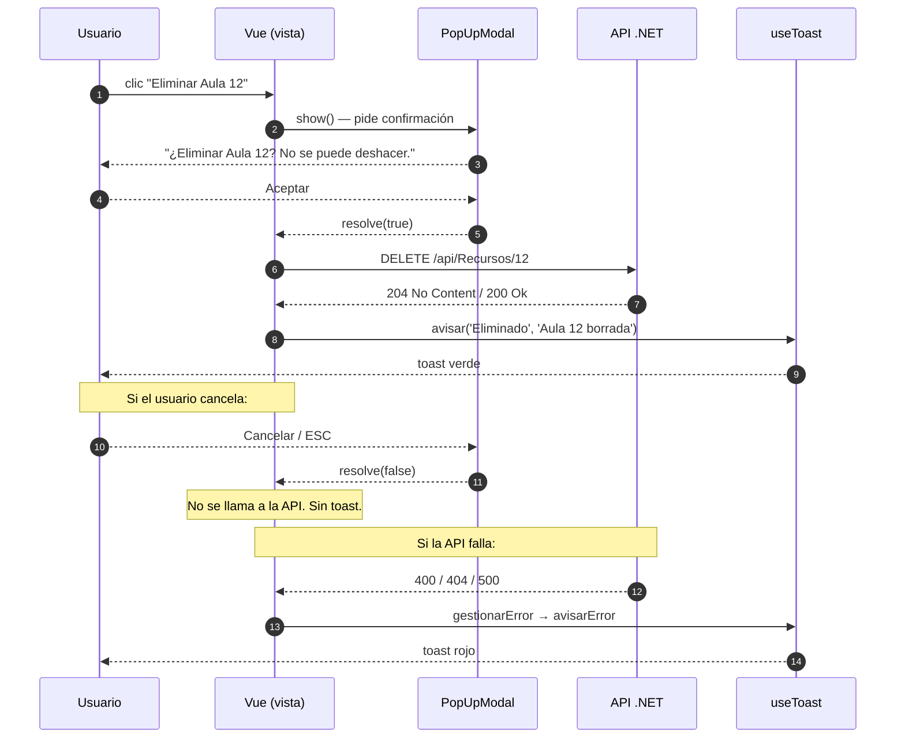

# Sesión 13: Gestión de errores de extremo a extremo

\[\[toc]]

::: info CONTEXTO
La sesión 12 enseñó **qué formato** usa el servidor para hablar de errores (`ValidationProblemDetails` y `ProblemDetails`) y **dónde** se vuelcan en el formulario (`useGestionFormularios`). Esta sesión cubre el resto del viaje: cómo se origina un error en cada capa, qué excepciones UA siguen teniendo sentido en el modelo nuevo, qué hace el `ErrorHandlerMiddleware` cuando uno **escapa** y cómo se enchufa el correo al equipo.

La clave: en el modelo `Result<T>` la mayoría de los errores **no son excepciones**. Las que sí lo son tienen un tratamiento muy concreto y se notifican siempre. Saber distinguir uno de otro es lo que esta sesión pretende dejar claro.
:::

## Objetivos

Al finalizar esta sesión, el alumno será capaz de:

* Trazar el viaje de un error desde Oracle hasta el toast del usuario, identificando qué pieza interviene en cada tramo.
* Leer e interpretar la anatomía del record `Error` y entender por qué transporta **dos mensajes** (técnico y de usuario).
* Reconocer los **cuatro formatos de mensaje Oracle** soportados por `ErrorPaquetePlSql`: texto plano, literal `# … #`, `# Resources.X.Y|args #` y formato externo UXXI `PKG_X#CODE#FALLBACK#args`.
* Distinguir cuándo usar `BDException`, `AppException`, `InfoException` y `MantenimientoException` en el modelo nuevo.
* Configurar `AddClaseErrores` con sus enriquecedores y enganchar la notificación por correo desde dos puntos complementarios: middleware y `RegistrarErrorTecnico`.
* Notificar al usuario con la familia `useToast` y proteger operaciones destructivas con `PopUpModal`.

## 13.0 Las dos formas JSON del error: `ProblemDetails` y `ValidationProblemDetails` {#formas-json}

Antes de entrar en el viaje del error y en quién genera qué, conviene **ver con los ojos** el JSON que llega al cliente. .NET 10 estandariza los errores siguiendo la RFC 9457, y solo hay **dos formas**:

**`ProblemDetails`** — errores de negocio o estado (`404`, `409`, `500`):

```http
HTTP/1.1 404 Not Found
Content-Type: application/problem+json

{
  "type":   "https://tools.ietf.org/html/rfc9110#section-15.5.5",
  "title":  "TIPO_RECURSO_NO_ENCONTRADO",
  "status": 404,
  "detail": "No existe un tipo de recurso con id 999."
}
```

**`ValidationProblemDetails`** — errores de validación del modelo (`400`). Lleva el campo extra **`errors`** con los fallos agrupados por propiedad:

```http
HTTP/1.1 400 Bad Request
Content-Type: application/problem+json

{
  "type":   "https://tools.ietf.org/html/rfc9110#section-15.5.1",
  "title":  "Uno o más errores de validación.",
  "status": 400,
  "errors": {
    "NombreEs": [ "El campo NombreEs es obligatorio." ],
    "Codigo":   [ "La longitud máxima de Código es 100.", "El código no puede contener espacios." ]
  }
}
```

::: tip BUENA PRÁCTICA — Scalar como banco de pruebas de errores
Los dos formatos se reproducen desde Scalar sin tocar Vue:

* **`ValidationProblemDetails` 400** — `POST /api/TipoRecursos` con `{ "codigo": "  con espacios  ", "nombreEs": "", "nombreCa": "Sala", "nombreEn": "Room" }`. Verás `errors.NombreEs` y `errors.Codigo` rellenados. El idioma de los mensajes lo decide la cabecera `X-Idioma`.
* **`ProblemDetails` 404** — `GET /api/TipoRecursos/999999`. Verás `title: "TIPO_RECURSO_NO_ENCONTRADO"` y `detail` ya localizado.

Si tu cliente Vue espera `error.response.data.errors.NombreEs`, ese contrato lo fija `ValidationProblemDetails`, no tu código. Verifícalo en Scalar antes de tocar Vue.
:::

El resto de la sesión cubre **cómo** se construyen estas dos formas (§13.1 a §13.6) y **cómo** las recoge el cliente (§13.7 a §13.8).

## 13.1 El viaje de un error de extremo a extremo {#viaje-error}

Antes del detalle de cada pieza, conviene tener el **mapa entero** delante. Un error que arranca en Oracle puede acabar en tres sitios distintos según de qué tipo sea:



### 13.1.1 Las tres trayectorias

| Trayectoria | Cuándo | Qué ve el usuario | Quién avisa al equipo |
|-------------|--------|-------------------|------------------------|
| **Bloqueo en cliente** | El propio formulario detecta el error (campo vacío, formato inválido). | Mensaje bajo el input. | Nadie. Es un error normal de UX. |
| **Error esperable** | El servicio devuelve `Result.Failure(...)` con `Validation` / `NotFound` / `Failure`. | Toast rojo o banner global, con texto localizado. | Solo si lleva `TechnicalMessage` — vía `RegistrarErrorTecnico`. |
| **Excepción inesperada** | Algo se rompe de verdad: BD caída, fichero corrupto, NRE. | Mensaje genérico (`Ha ocurrido un error técnico`). | **Siempre** — vía `ErrorHandlerMiddleware`. |

::: tip LA REGLA DE DECISIÓN PARA EL DESARROLLADOR
Cuando escribas un servicio o un controlador, pregúntate por cada `try/catch`:

* ¿Sé qué responder a esto? → **No es excepción**. Devuelve `Result.Failure(Error)` con el `ErrorType` que corresponda.
* ¿Esto no debería estar ocurriendo nunca? → **Sí es excepción**. Déjala escapar para que la pille el middleware.

Si dudas, casi seguro es la primera opción. Las excepciones reales son **raras**: la BD caída, una configuración faltante, un bug.
:::

### 13.1.2 Lo que se mantiene del modelo histórico UA

Aunque el grueso del flujo es `Result<T>` + `HandleResult`, ciertas piezas del stack histórico UA siguen presentes y **siguen teniendo sentido**:

| Pieza UA | Sigue siendo necesaria | Por qué |
|----------|------------------------|---------|
| `BDException` (Usuario / Sistema) | Sí | La sigue lanzando `ClaseOracleBD3`. `ErrorPaquetePlSql.DesdeBDException` la **convierte** a `Result<T>` antes de que el controlador la vea. |
| `AppException`, `InfoException`, `MantenimientoException` | Solo si se necesitan | Para flujos MVC clásicos (vistas Razor) y para modo mantenimiento. La API casi nunca las tira. |
| `ErrorHandlerMiddleware` | Sí | Captura **lo que escape**. En el modelo nuevo escapa muy poco, pero cuando escapa hay que notificarlo. |
| `AddClaseErrores` + enriquecedores | Sí | El envío del correo y la composición del mensaje. Se enchufa **a dos sitios**: middleware (para excepciones) y `RegistrarErrorTecnico` (para `Result.Failure` con `TechnicalMessage`). |
| `ClaseErroresWebAPI.Generar(ModelState)` | **No** | Reemplazada por `ValidationProblemDetails` estándar que devuelve `[ApiController]` automáticamente. |

## 13.2 Anatomía del `Error` UA {#anatomia-error}

Todo `Result<T>.Failure(...)` lleva dentro un `Error` con esta forma (ver `Models/Errors/Error.cs`):

```csharp
public record Error(
    string  Code,
    string  Message,
    ErrorType Type,
    IDictionary<string, string[]>? ValidationErrors = null,
    string? MessageKey       = null,
    object?[]? MessageArgs   = null,
    string? TechnicalMessage = null);
```

Y los tres `ErrorType` posibles (`Models/Errors/ErrorType.cs`):

```csharp
public enum ErrorType
{
    Failure    = 0,   // → HTTP 500
    Validation = 1,   // → HTTP 400
    NotFound   = 2    // → HTTP 404
}
```

### 13.2.1 Para qué sirve cada campo

| Campo | Quién lo lee | Para qué |
|-------|--------------|----------|
| `Code` | El equipo (logs) y opcionalmente el cliente | Identificador estable del error (`"ORA-20702"`, `"TIPO_RECURSO_NO_EXISTE"`). |
| `Message` | El cliente — si no se localiza por `MessageKey` | Mensaje legible "por defecto" en el idioma del literal. |
| `Type` | `HandleResult` / `HandleCreated` / `HandleNoContent` | Decide el código HTTP (400 / 404 / 500). |
| `ValidationErrors` | El cliente — `useGestionFormularios` | Diccionario `campo → mensajes[]`. La clave `""` se usa para errores globales y **siempre llega rellena** en un 400 (la siembra `ErrorPaquetePlSql` o, defensivamente, `HandleResult`). |
| `MessageKey` | `LocalizarMensaje` en `ApiControllerBase` | Clave de `Resources/SharedResource.resx` para traducir según `Content-Language`. |
| `MessageArgs` | `LocalizarMensaje` | Argumentos `{0}`, `{1}` para el `string.Format` de la traducción. |
| `TechnicalMessage` | `RegistrarErrorTecnico` y, en el futuro, Serilog y el correo | Detalle técnico (stack trace, código `ORA`, parámetros) que **no** viaja al cliente. |

### 13.2.2 Por qué dos mensajes distintos

`Message` y `TechnicalMessage` cumplen funciones complementarias y nunca se mezclan:



::: tip POR QUÉ ESTA SEPARACIÓN ES IMPORTANTE
Mezclar las dos cosas tiene **dos consecuencias malas**:

* **De seguridad:** filtrar `ORA-12545` o nombres de paquetes en pantalla revela arquitectura a un atacante.
* **De UX:** un usuario que ve "ORA-00942: la tabla o vista no existe" no sabe qué hacer.

Mantener `Message` (lo que ve el usuario) separado de `TechnicalMessage` (lo que ve el equipo) resuelve los dos a la vez.
:::

### 13.2.3 Cómo construir un `Error` desde un servicio

Los factories del propio `Result<T>` evitan instanciar `Error` a mano. Tres llamadas — `Validation`, `NotFound`, `Success` — cubren el 95 % de los casos:

```csharp
// Servicio: nunca lanza excepciones para flujos esperables; devuelve Result<T>.
public async Task<Result<RecursoLectura>> ObtenerPorIdAsync(int idRecurso)
{
    // ── ErrorType.Validation → HTTP 400 ───────────────────────────────────────
    //   "code"    → identificador estable (el cliente puede reaccionar a él)
    //   "message" → texto legible; si existe en SharedResource.resx se traduce
    if (idRecurso <= 0)
        return Result<RecursoLectura>.Validation(
            "RECURSO_ID_INVALIDO",
            "El identificador del recurso no es válido.");

    var recurso = await _bd.ObtenerPrimeroMapAsync<RecursoLectura>(/* ... */);

    // ── ErrorType.NotFound → HTTP 404 ─────────────────────────────────────────
    //   Los argumentos extra ("idRecurso") rellenan los {0}, {1}... del message
    //   vía string.Format al localizar.
    if (recurso is null)
        return Result<RecursoLectura>.NotFound(
            "RECURSO_NO_ENCONTRADO",
            "El recurso {0} no existe.",
            idRecurso);

    // ── Camino feliz → HTTP 200 ───────────────────────────────────────────────
    //   El valor viaja DENTRO del Result. HandleResult lo desempaquetará como Ok.
    return Result<RecursoLectura>.Success(recurso);
}
```

::: tip BUENA PRÁCTICA — nunca `throw` en flujos esperables
Si la regla de negocio prevé que "el recurso puede no existir" o "el id puede llegar inválido", **no son excepciones**: son resultados posibles. Devuélvelos con `Result<T>.NotFound` / `Result<T>.Validation`. Las excepciones se reservan para lo imprevisto (BD caída, NRE, timeout) y las atrapa el middleware (§13.5).
:::

Los `params object?[] messageArgs` se guardan en `MessageArgs` y se aplican como `string.Format` cuando se localice el mensaje. Lo verás en §13.3 con los formatos Oracle.

::: info LA `T` DE `Result<T>` — genéricos en 1 minuto
La `T` es un **tipo que se decide al usar la clase**, no al escribirla. Así, una sola clase `Result<T>` vale para cualquier valor de retorno:

| Método del servicio             | Tipo de retorno                    | Qué hay en el `Value` si es `Success` |
| ------------------------------- | ---------------------------------- | ------------------------------------- |
| `ObtenerTodosAsync(idioma)`     | `Result<List<TipoRecursoLectura>>` | La lista (puede estar vacía).         |
| `ObtenerPorIdAsync(id, idioma)` | `Result<TipoRecursoLectura>`       | El DTO encontrado.                    |
| `CrearAsync(dto)`               | `Result<int>`                      | El id del registro recién creado.     |
| `ActualizarAsync(id, dto)`      | `Result<bool>`                     | `true` si se actualizó.               |

Si no es `Success`, `Value` es `null` y hay un `Error`. `HandleResult` (§13.2.4) se encarga del resto — tú no tienes que mirar el `Error` a mano.
:::

### 13.2.4 `HandleResult` / `HandleCreated` / `HandleNoContent`: los traductores únicos `Result<T>` → HTTP {#handleresult}

El controlador **no decide** el código HTTP ni el formato del cuerpo de error: lo decide `ApiControllerBase`, con un método por familia de verbo:

| Método | Cuándo | HTTP en `Success` |
|---|---|---|
| `HandleResult<T>(Result<T>)` | `GET` | `200 OK` con `result.Value` |
| `HandleCreated<T>(Result<T>, nombreAccion, valoresRuta)` | `POST` | `201 Created` + `Location` |
| `HandleNoContent<T>(Result<T>)` | `PUT`, `PATCH`, `DELETE` | `204 No Content` |

Los tres delegan en el mismo `HandleError(error)` privado cuando el `Result` es `Failure`, así que la traducción de errores está centralizada **en un único punto**. Si quieres cambiar el formato de los errores, ese es el único sitio donde tocar.

```csharp
// Controllers/Apis/ApiControllerBase.cs (esbozo)
protected ActionResult HandleResult<T>(Result<T> result) =>
    result.IsSuccess ? Ok(result.Value) : HandleError(result.Error!);

protected ActionResult HandleCreated<T>(
    Result<T> result, string nombreAccion, Func<T, object> valoresRuta) =>
    result.IsSuccess
        ? CreatedAtAction(nombreAccion, valoresRuta(result.Value!), result.Value)
        : HandleError(result.Error!);

protected ActionResult HandleNoContent<T>(Result<T> result) =>
    result.IsSuccess ? NoContent() : HandleError(result.Error!);

private ActionResult HandleError(Error error)
{
    // 1) Localizamos al idioma del usuario.
    var mensaje = LocalizarMensaje(error);                    // §13.3

    // 2) Log estructurado (LogError si Failure, LogInformation si Validation/NotFound con
    //    TechnicalMessage). El cliente NO ve el TechnicalMessage en ningún caso.
    RegistrarErrorTecnico(error, mensaje);                    // §13.6 ruta B

    // 3) Traduce el ErrorType a uno de los tres ProblemDetails estándar.
    return error.Type switch
    {
        // 400 Bad Request — el diccionario errors por campo viaja al cliente.
        // Si Oracle devolvió un Validation global (-20703), NormalizarValidationErrors
        // garantiza que llegue errors[""] para que useGestionFormularios lo pinte
        // en el banner de erroresGlobales.
        ErrorType.Validation => ValidationProblem(
            new ValidationProblemDetails(
                NormalizarValidationErrors(error.ValidationErrors, mensaje))
            {
                Title  = error.Code,        // código estable: "ORA-20703"
                Detail = mensaje,           // texto ya localizado (es/ca/en)
                Status = StatusCodes.Status400BadRequest
            }),

        // 404 Not Found — recurso pedido no existe.
        ErrorType.NotFound => NotFound(new ProblemDetails
        {
            Title  = error.Code,
            Detail = mensaje,
            Status = StatusCodes.Status404NotFound
        }),

        // 500 Internal Server Error — cualquier Failure: bugs, BD caída, paquete roto.
        // detail llega como mensaje localizado (ERROR_TECNICO), nunca como SQLERRM crudo.
        _ => Problem(detail: mensaje,
                     title:  error.Code,
                     statusCode: StatusCodes.Status500InternalServerError)
    };
}

// Garantiza que un Validation siempre lleve al menos errors[""] con el mensaje.
private static IDictionary<string, string[]> NormalizarValidationErrors(
    IDictionary<string, string[]>? validationErrors, string mensajeFallback)
{
    if (validationErrors is { Count: > 0 })
        return new Dictionary<string, string[]>(validationErrors);

    return new Dictionary<string, string[]> { [""] = new[] { mensajeFallback } };
}
```

Mapeo en una tabla:

| `Result<T>`                     | `ErrorType` | HTTP                          | Cuerpo JSON                                                                    |
| ------------------------------- | ----------- | ----------------------------- | ------------------------------------------------------------------------------ |
| `Success(v)` (GET)              | —           | **200 OK**                    | El valor `v` serializado.                                                      |
| `Success(v)` (POST)             | —           | **201 Created**               | El id en el body + cabecera `Location`.                                        |
| `Success(_)` (PUT/DELETE)       | —           | **204 No Content**            | Sin body.                                                                       |
| `Validation(code, msg, errors)` | Validation  | **400 Bad Request**           | `ValidationProblemDetails { title=code, detail=msg-localizado, errors={...} }` — si no había `errors`, llega siempre `errors[""]` con el mensaje. |
| `NotFound(code, msg, args)`     | NotFound    | **404 Not Found**             | `ProblemDetails { title=code, detail=msg-localizado }`                         |
| `Fail(code, msg, args)`         | Failure     | **500 Internal Server Error** | `ProblemDetails { title=code, detail=msg-localizado }` + `LogError` con TraceId/TechnicalMessage |

::: info POR QUÉ `errors[""]` SIEMPRE EXISTE EN UN 400
`useGestionFormularios.adaptarProblemDetails` busca `errors[""]` para alimentar `erroresGlobales` (el banner encima del formulario). Si un paquete PL/SQL rechaza con `-20703` ("Tipo con recursos asociados"), el error no es por campo: es global. `NormalizarValidationErrors` siembra ese `errors[""]` con el mensaje localizado para que el cliente lo pinte sin tener que mirar `detail` ni `title`. Así el contrato Oracle → .NET → Vue queda cerrado: **todo Validation tiene al menos una clave en `errors`**.
:::

### 13.2.5 Cómo se escribe un endpoint del curso {#endpoint-canonico}

::: info QUÉ QUEREMOS ENSEÑAR
El **patrón único** para escribir controladores: el servicio devuelve `Result<T>`, el controlador se reduce a **una sola línea**. Hay tres helpers (`HandleResult`, `HandleCreated`, `HandleNoContent`); el verbo HTTP elige cuál usar.
:::

::: tip POR QUÉ ES IMPORTANTE
Sin este patrón, cada acción acabaría con su propio `if (recurso is null) return NotFound(...); if (...) return BadRequest(...); else return Ok(...);`. Tres consecuencias malas:

1. **La forma del JSON de error se desvía** entre acciones — el cliente Vue no puede confiar en `useGestionFormularios`.
2. **La localización** (`SharedResource.resx`) se duplica en cada `return BadRequest(...)`.
3. **Cambiar el formato** de errores obliga a tocar decenas de controladores.

Centralizando en `HandleResult` / `HandleCreated` / `HandleNoContent`, todos los endpoints hablan el mismo idioma HTTP y el mantenimiento se reduce a una sola función.
:::

#### Qué implica a nivel de código

Tres formas, una por familia de verbo:

##### Caso 1 — Lectura (`GET`): `HandleResult`

```csharp
[HttpGet("{id:int}")]
[ProducesResponseType<TipoRecursoLectura>(StatusCodes.Status200OK)]
[ProducesResponseType<ProblemDetails>(StatusCodes.Status404NotFound)]
public async Task<ActionResult> ObtenerPorId([FromRoute] int id) =>
    // El servicio devuelve Result<T>. HandleResult decide 200/404/500 y el cuerpo.
    HandleResult(await _tiposRecurso.ObtenerPorIdAsync(id, Idioma));
```

El servicio que respalda esa acción:

```csharp
public async Task<Result<TipoRecursoLectura>> ObtenerPorIdAsync(int id, string idioma)
{
    var fila = await _bd.ObtenerPrimeroMapAsync<TipoRecursoLectura>(/* ... */);

    return fila is null
        ? Result<TipoRecursoLectura>.NotFound(
              "TIPO_RECURSO_NO_ENCONTRADO",
              "No existe un tipo de recurso con id {0}.",
              id)
        : Result<TipoRecursoLectura>.Success(fila);
}
```

##### Caso 2 — Creación (`POST`): `HandleCreated`

```csharp
[HttpPost]
[ProducesResponseType<int>(StatusCodes.Status201Created)]
[ProducesResponseType<ValidationProblemDetails>(StatusCodes.Status400BadRequest)]
public async Task<ActionResult> Crear([FromBody] TipoRecursoCrearDto dto) =>
    // HandleCreated centraliza el doble retorno del 201:
    //   - body: el id devuelto por el paquete (Result.Value)
    //   - cabecera Location: /api/TipoRecursos/{id} construida con nameof + valoresRuta
    // Si el Result es Failure, delega en HandleError igual que los otros dos.
    HandleCreated(
        await _tiposRecurso.CrearAsync(dto),
        nameof(ObtenerPorId), id => new { id });
```

##### Caso 3 — Actualización y borrado (`PUT` / `PATCH` / `DELETE`): `HandleNoContent`

```csharp
[HttpDelete("{id:int}")]
[ProducesResponseType(StatusCodes.Status204NoContent)]
[ProducesResponseType<ProblemDetails>(StatusCodes.Status404NotFound)]
public async Task<ActionResult> Eliminar([FromRoute] int id) =>
    // 204 NoContent si Success; el error vuelve a HandleError.
    HandleNoContent(await _tiposRecurso.EliminarAsync(id));
```

::: info ¿Y `Task<ActionResult>` en vez de `TypedResults`?
.NET 10 ofrece varios estilos (`IActionResult`, `ActionResult<T>`, `Results<...>` con `TypedResults`). El curso usa **siempre `Task<ActionResult>` + los tres helpers** por dos motivos prácticos:

1. **Una sola línea por acción** y los códigos los declara `[ProducesResponseType<T>(...)]` — Scalar los lee igual.
2. **Compatibilidad** con `Ok`, `NoContent`, `CreatedAtAction` etc. — los helpers usan estos internamente.

`TypedResults` es válido, pero al hacerlo conviven dos estilos en el mismo proyecto y el JSON de error deja de salir de un solo sitio.
:::

## 13.3 Los cuatro formatos de mensaje desde Oracle {#formatos-oracle}

`ClaseOracleBD3` no conoce el idioma del usuario; lo conoce .NET. Por eso Oracle nunca devuelve un mensaje "ya traducido" — devuelve **una clave** (o un texto literal) en un formato que `ErrorPaquetePlSql.ExtraerMensajeUsuarioOracle` sabe interpretar.

Hay **cuatro formatos** soportados:

| Caso | Formato Oracle | Visible al usuario | Localizado |
|------|----------------|--------------------|------------|
| 1. Error técnico | `Texto plano sin # … #` | **No** | No |
| 2. Literal de usuario | `# Mensaje #` | Sí | No |
| 3. Resource con/sin args | `# Resources.Fichero.Clave[\|arg1\|arg2…] #` | Sí | Sí |
| 4. Externo UXXI | `PKG_X#COD_ERROR#FALLBACK#arg1\|arg2…` | Sí | Sí (si el `.resx` existe) |

::: tip RESUMEN GRÁFICO

* Sin `#` → es **técnico**. Va a `ErrorType.Failure` y el usuario solo ve un genérico.
* Con `#` → es **para el usuario**. Si el contenido empieza por `Resources.` o sigue el patrón UXXI, se traduce contra `SharedResource.{es,ca,en}.resx`.
  :::

### 13.3.1 Caso 1 — Error técnico (no visible)

```sql
PROCEDURE EXCEPCION_TECNICA AS
BEGIN
  RAISE_APPLICATION_ERROR(
    -20703,
    'Error interno en UPDATE_TIPO_RECURSO, id=' || p_id);
END;
```

`ErrorPaquetePlSql` lo recibe sin delimitadores `#`. Resultado:

* `BDException.TipoExcepcion = Sistema` (lo marca `ClaseOracleBD3`).
* `ErrorPaquetePlSql.DesdeBDException` devuelve un `Error` con:
  * `Code = "ERROR_TECNICO_ORACLE"` (o `"ORA-20703"` si lo logra extraer)
  * `Message = "Ha ocurrido un error técnico al procesar la operación."` (genérico)
  * `Type = Failure`
  * `TechnicalMessage = "ORA-20703: Error interno en UPDATE_TIPO_RECURSO, id=42"` (el original)

El usuario verá el mensaje genérico. El equipo verá el detalle en `RegistrarErrorTecnico` (log + correo).

### 13.3.2 Caso 2 — Literal visible al usuario

```sql
PROCEDURE OPERACION_NO_PERMITIDA AS
BEGIN
  RAISE_APPLICATION_ERROR(
    -20703,
    '# Operación no permitida en este momento. #');
END;
```

Hay `#` delimitando un literal, sin `Resources.` ni `PKG_`. Resultado:

* `Error.Message = "Operación no permitida en este momento."`
* `Error.MessageKey = null` (no se intenta traducir).
* `Error.Type = Validation` (rango `-20703`).
* HTTP 400 → toast / banner en Vue con ese texto **tal cual**.

::: tip CUÁNDO USARLO
Cuando el texto **no necesita traducción** ni argumentos. Por ejemplo, mensajes para una aplicación interna en un solo idioma o cuando aún no has creado el `.resx`.
:::

### 13.3.3 Caso 3 — Localizado con `Resources.X.Y` (con o sin parámetros)

```sql
PROCEDURE TIPO_RECURSO_CON_ASOCIADOS(p_codigo IN VARCHAR2) AS
BEGIN
  RAISE_APPLICATION_ERROR(
    -20703,
    '# Resources.SharedResource.TIPO_RECURSO_CON_ASOCIADOS|' || p_codigo || ' #');
END;
```

Contenido entre `#`: `Resources.SharedResource.TIPO_RECURSO_CON_ASOCIADOS|SALA`.

`ErrorPaquetePlSql.ResolverMensajeUsuario` separa por `|`:

| Parte | Valor |
|-------|-------|
| Clave de recurso | `Resources.SharedResource.TIPO_RECURSO_CON_ASOCIADOS` |
| `MessageArgs[0]` | `"SALA"` |

`ApiControllerBase.LocalizarMensaje` luego pide a `IStringLocalizer<SharedResource>` la clave normalizada (`TIPO_RECURSO_CON_ASOCIADOS`) con el idioma del usuario. Si el `.resx` contiene:

```text
TIPO_RECURSO_CON_ASOCIADOS = El tipo de recurso "{0}" tiene recursos asociados y no puede eliminarse.
```

El cliente recibe:

```json
{
  "title": "ORA-20703",
  "detail": "El tipo de recurso \"SALA\" tiene recursos asociados y no puede eliminarse.",
  "status": 400,
  "errors": { "": ["El tipo de recurso \"SALA\" tiene recursos asociados y no puede eliminarse."] }
}
```

::: warning USO CORRECTO DEL SEPARADOR `|`

* El separador entre clave y argumentos es `|` (pipe).
* Los argumentos **pueden contener puntos** (`Juan.Pérez|Asignatura.2025` es válido).
* Los argumentos **no deben contener `|`** (no hay escape). Si un parámetro lo necesitara, habría que cambiar el separador en el servicio antes de mandarlo.
* Los placeholders en el `.resx` siguen el patrón `string.Format`: `{0}`, `{1}`, etc.
  :::

### 13.3.4 Caso 4 — Externo UXXI (`PKG_X#COD#FALLBACK#args`)

Algunas integraciones UA generan errores en el formato histórico de UXXI:

```sql
PROCEDURE ALUMNO_DUPLICADO(p_nombre IN VARCHAR2, p_apellido IN VARCHAR2) AS
BEGIN
  RAISE_APPLICATION_ERROR(
    -20703,
    'PKG_ALUMNOS#ERR_DUPLICADO#El alumno {0} {1} ya existe#' || p_nombre || '|' || p_apellido);
END;
```

`ErrorPaquetePlSql.ResolverMensajeExterno` reconoce el prefijo `PKG_` y separa por `#`:

| Parte | Valor |
|-------|-------|
| Package | `PKG_ALUMNOS` |
| Código error | `ERR_DUPLICADO` |
| Fallback | `El alumno {0} {1} ya existe` |
| Argumentos | `["Súper", "Crispín"]` |

Intenta resolver `Resources.PKG_ALUMNOS.ERR_DUPLICADO` (clave normalizada). Si existe en el `.resx`:

```text
PKG_ALUMNOS.ERR_DUPLICADO = El alumno {0} {1} ya está registrado en la aplicación.
```

→ resultado localizado.

Si **no** existe, usa el `fallback` formateado con los argumentos:

```text
El alumno Súper Crispín ya existe
```

::: tip POR QUÉ ES ÚTIL EL FALLBACK
Las integraciones con sistemas externos (UXXI, Sigma…) generan códigos de error que están fuera del control del proyecto. El fallback dentro del propio mensaje garantiza que **siempre** verás algo razonable, incluso si nadie ha creado el `.resx`.
:::

### 13.3.5 Reglas de fallback resumidas

| Entrada Oracle | Recurso encontrado | Salida al usuario |
|----------------|---------------------|--------------------|
| `# Mensaje literal #` | — | `Mensaje literal` |
| `# Resources.X.Y #` | Sí | Texto traducido |
| `# Resources.X.Y #` | No | `Resources.X.Y` (clave bruta) |
| `# Resources.X.Y\|a\|b #` | Sí, con `{0}{1}` | Texto traducido con args |
| `# Resources.X.Y\|a\|b #` | No | `Resources.X.Y` (sin formatear) |
| `PKG_X#COD#fallback {0}#arg` | Sí | Texto traducido con args |
| `PKG_X#COD#fallback {0}#arg` | No | `fallback arg` (fallback formateado) |
| Texto plano (sin `#`) | — | Genérico técnico, mensaje real en `TechnicalMessage` |

### 13.3.6 Buenas prácticas de PL/SQL

* **Para errores técnicos:** `RAISE_APPLICATION_ERROR(-20703, 'Detalle técnico…')`. Sin `#`.
* **Para mensajes simples visibles:** `RAISE_APPLICATION_ERROR(-20703, '# Mensaje al usuario. #')`.
* **Para mensajes traducibles:** `RAISE_APPLICATION_ERROR(-20703, '# Resources.SharedResource.CLAVE #')`.
* **Con parámetros:** `RAISE_APPLICATION_ERROR(-20703, '# Resources.SharedResource.CLAVE|' || p_arg1 || '|' || p_arg2 || ' #')`.
* **Crea las claves en los `.resx` de `Resources/SharedResource.{es,ca,en}.resx`.**
* **Evita el carácter `|` dentro de parámetros.** No hay escape.
* **Usa el rango de códigos** que ya conoce `ErrorPaquetePlSql.DesdeCodigo` (`-20702` → 404, `-20703` → 400, etc.) para que el HTTP sea el esperado.

::: info DÓNDE MIRAR EL CÓDIGO

* `Models/Errors/ErrorPaquetePlSql.cs` — los métodos `ExtraerMensajeUsuarioOracle`, `ResolverMensajeUsuario`, `ResolverMensajeExterno`, `LimpiarPrefijoOracle`.
* `Resources/SharedResource.{es,ca,en}.resx` — claves que ya existen (`TIPO_RECURSO_NO_EXISTE`, `TIPO_RECURSO_CON_ASOCIADOS`, `ERROR_TECNICO`).
* `uaReservas.Tests/ErrorPaquetePlSqlTests.cs` — tests del parser para cada formato.
  :::

## 13.4 Las cuatro excepciones UA y cuándo siguen teniendo sentido {#excepciones-ua}

Aunque la mayoría de errores ahora viajan en `Result<T>`, las **cuatro excepciones UA históricas** siguen existiendo en los nugets de la plantilla. La pregunta correcta no es "¿las uso?" sino "¿en qué casos concretos tienen aún sentido en el modelo nuevo?".

### 13.4.1 La jerarquía completa



### 13.4.2 Cuándo usar cada una

| Excepción | Lanzada por | En el modelo nuevo se usa para… | Lo que **no** se hace ya |
|-----------|-------------|---------------------------------|---------------------------|
| **`BDException`** (Usuario / Sistema) | `ClaseOracleBD3` automáticamente al recibir `ORA-`. | **No se lanza a mano**. Se atrapa en el servicio con `catch (BDException ex)` y se pasa a `ErrorPaquetePlSql.AResultFailure<T>(ex)` que la convierte en `Result.Failure(Error)`. | Devolver un `BadRequest` con `bdex.Message` directo desde el controlador (patrón antiguo). |
| **`AppException`** | El propio código del proyecto. | Solo si quedan vistas MVC clásicas (Razor) que no han migrado a `Result<T>`. En la API moderna **no se lanza**. | Convertirla en `400` desde controladores que ya devuelven `Result<T>`. |
| **`InfoException`** | El propio código. | Mostrar al usuario un **aviso** que no es realmente un error (`500` con un texto informativo). En la API, en su lugar devuelve un `Result.Success(...)` con metainfo o un `200 + body`. | Usarla como sustituto de validación. |
| **`MantenimientoException`** | El propio código durante una ventana programada. | Cortar requests cuando la app está en modo mantenimiento. Pasa al middleware con notificación. | Confundirla con error: es un corte deliberado. |

::: tip REGLA DE PULGAR PARA ESCRIBIR CÓDIGO NUEVO

* **Servicio:** captura `BDException` y devuelve `Result<T>.Failure(...)`. **No** propagues `BDException`.
* **Controlador:** **no** lances excepciones — devuelve `HandleResult(result)`.
* **`MantenimientoException`** solo si tu proyecto necesita un modo mantenimiento real. Mírate el patrón en `PlantillaMVCCore.Errores` si lo activas.
* **`AppException` / `InfoException`:** evita lanzarlas en código nuevo. Si lo haces, hazlo a sabiendas de que pasarán por el middleware.
  :::

### 13.4.3 El patrón `try { } catch (BDException ex) { … }` vive en `EjecutarPaqueteAsync`

Antes los servicios escribían a mano:

```csharp
try
{
    await _bd.EjecutarParamsAsync(procedimiento, p);
}
catch (BDException ex)
{
    return ErrorPaquetePlSql.AResultFailure<bool>(ex);   // BDException → Result.Failure(Error)
}
```

Hoy ese `try`/`catch` vive **dentro** del helper `EjecutarPaqueteAsync` (sesión 5, §5.4.2). El servicio queda así:

```csharp
public Task<Result<bool>> EliminarAsync(int idTipoRecurso)
{
    var p = new DynamicParameters();
    p.Add("P_ID_TIPO_RECURSO", idTipoRecurso);
    return _bd.EjecutarPaqueteAsync("CURSONORMADM.PKG_RES_TIPO_RECURSO.ELIMINAR", p);
}
```

El helper hace el `catch (BDException ex)`, lo convierte a `Result.Failure(Error)` y, si la excepción es de otra naturaleza (no Oracle), la deja escapar. A partir de ese punto el flujo es el mismo que cualquier otro error: `HandleResult` / `HandleCreated` / `HandleNoContent` decide el HTTP y `RegistrarErrorTecnico` decide si avisar al equipo.

::: tip CUÁNDO TODAVÍA TIENE SENTIDO EL `try`/`catch` EXPLÍCITO
Solo si necesitas hacer algo **antes** o **además** de convertir la `BDException` a `Result` (medir tiempos, registrar contexto extra, intentar un fallback). En ese caso, captura, haz lo tuyo y llama a `ErrorPaquetePlSql.AResultFailure<T>(ex)` manualmente para devolver. En el 99 % de los servicios no hace falta — pasa por `EjecutarPaqueteAsync`.
:::

## 13.5 `ErrorHandlerMiddleware`: el último cortafuegos {#middleware}

Cuando una excepción **no** se atrapa en el servicio y **no** la convierte ningún helper, escapa hacia arriba. El `ErrorHandlerMiddleware` de `PlantillaMVCCore.Errores` la captura en el último momento y decide qué hacer.

### 13.5.1 Qué hace y cómo decide



### 13.5.2 Lo que decide la notificación

Solo se invoca a `INotificadorError.Notificar` para errores **que no son** de las cuatro excepciones "controladas":

* `AppException`, `KeyNotFoundException`, `InfoException`, `OperationCanceledException` → **no** notifican.
* Cualquier otra (`BDException`, `MantenimientoException`, `NullReferenceException`…) → **sí** notifica.

::: tip POR QUÉ ALGUNAS NO NOTIFICAN

* `AppException` se diseñó como "error de aplicación esperable" — equivalente a una validación. Era el `Result.Validation` de antes.
* `KeyNotFoundException` es el "no encontrado" en el patrón MVC clásico.
* `InfoException` no es un error: es un aviso al usuario.
* `OperationCanceledException` suele venir de que el cliente cerró la pestaña.

Llenar el correo con estos eventos era ruido. Por eso quedaron fuera.
:::

### 13.5.3 Decisión JSON vs MVC

El middleware mira la ruta:

* Si **empieza por `/api`** → responde con JSON: `{ "message": "…", "code": 500 }`.
* Si no → redirige a `/{idioma}/Error/Index` (vista Razor genérica).

::: warning EL CONTRATO JSON DEL MIDDLEWARE NO ES `ProblemDetails`
El cuerpo `{ message, code }` es el formato histórico del middleware UA. **Coexiste** con el `ProblemDetails` que devuelve `HandleResult`. En el cliente, `gestionarError` reconoce los dos (`responseData?.message` para el primero, `problemDetails?.detail` para el segundo).

Cuando la app esté completamente migrada, lo natural es que el middleware emita también `ProblemDetails`. Hasta entonces, conviven sin problema.
:::

### 13.5.4 `UseExceptionHandler("/Error")` que ya tiene el proyecto

`uaReservas/Program.cs` registra hoy el manejador estándar de ASP.NET:

```csharp
if (!app.Environment.IsDevelopment())
{
    app.UseExceptionHandler("/Error");   // redirige a HomeController.Error()
    app.UseHsts();
}
```

Esto **no** sustituye al `ErrorHandlerMiddleware` de la UA: solo da una vista de respaldo para entornos sin él. Si activas `UseErrorHandlerMiddleware()` se enchufa **antes** del routing y se ocupa de todas las excepciones; `UseExceptionHandler("/Error")` queda como red de seguridad por si el middleware UA estuviera deshabilitado.

Para activarlo cuando esté listo, basta con añadir antes de `app.UseRouting()`:

```csharp
app.UseErrorHandlerMiddleware();   // o app.UseMiddleware<ErrorHandlerMiddleware>()
```

::: tip EN ESTE PROYECTO HOY
`uaReservas` no llama a `UseErrorHandlerMiddleware()`. Los errores controlados (`Result.Failure`) generan respuestas correctas con `HandleResult` y no llegan al middleware. Las excepciones **inesperadas** caen al `UseExceptionHandler("/Error")` estándar, que devuelve la vista `Home/Error` y **no notifica** por correo.

La sesión 13 te enseña los dos modelos para que sepas cuándo merece la pena cablear el middleware UA (lo veremos en §13.6).
:::

## 13.6 `AddClaseErrores`: notificación por correo {#add-clase-errores}

`ClaseErrores` es el servicio UA que **compone y envía** el correo de error al equipo. Se registra en `Program.cs` con los enriquecedores que aportan datos útiles al mensaje.

### 13.6.1 Configuración mínima en `appsettings.json`

`uaReservas` ya tiene un esqueleto en `appsettings.json`:

```json
"GestionErrores": {
  "Activo": true,
  "EnvioA": "xx@ua.es",
  "Titulo": "[Error aplicación Plantilla UACloud]"
}
```

Las claves recomendadas para producción son las del patrón UA:

| Clave | Para qué | Sugerencia |
|-------|----------|------------|
| `GestionErrores:Activo` | Permite apagar el envío sin tocar código | `true` en preproducción y producción |
| `GestionErrores:EnvioA` | Destinatarios separados por coma | `equipo@ua.es,oncall@ua.es` |
| `GestionErrores:Remitente` | From del correo | `wwwadm@ua.es` |
| `GestionErrores:ResponderA` | Reply-To | `noresponder@ua.es` |
| `GestionErrores:Titulo` | Prefijo del asunto | `[uaReservas] Error detectado` |
| `GestionErrores:ThrottlingMinutos` | Cooldown entre dos correos del **mismo** error | `5` |
| `GestionErrores:EnvioEnDesarrollo` | Si `false`, NO envía desde `localhost` / `.campus.ua.es` | `false` |
| `App:MensajeErrorxDefecto` | Texto que verá el usuario en errores 500 | `Se ha producido un error. Inténtelo más tarde.` |

::: tip THROTTLING — POR QUÉ ES IMPORTANTE
Si un servicio se cae y mil requests reciben el mismo error en 10 segundos, el throttling evita 1000 correos idénticos al equipo. Con `ThrottlingMinutos = 5`, el segundo correo del **mismo** error tarda al menos 5 minutos en salir. La clave de igualdad es el tipo de excepción + stack trace, no el mensaje literal.
:::

### 13.6.2 Enriquecedores

`AddClaseErrores` devuelve un builder al que se le encadenan **enriquecedores** que añaden secciones al correo:

| Enriquecedor | Sección que añade al correo |
|--------------|-----------------------------|
| `ConEnriquecedorAplicacion()` | `App:NombreApp`, versión, entorno (`Development`/`Staging`/`Production`), servidor, fecha. |
| `ConEnriquecedorPeticionHttp()` | URL completa, método HTTP, IP del cliente, User-Agent, query string, cuerpo del POST (con secretos filtrados). |
| `ConEnriquecedorUsuarioCAS()` | `CodPer`, correo, nombre, roles del usuario autenticado. |
| `ExcluyendoTipos(...)` | Lista de tipos de excepción que **nunca** disparan correo (típicamente `OperationCanceledException`). |

### 13.6.3 `Program.cs` recomendado

```csharp
using ua;
using ua.Models.Plantilla.Errores;
using ua.Models.Plantilla.Errores.Enriquecedores;

var builder = WebApplication.CreateBuilder(args);

// Notificación de errores por correo
builder.Services.AddClaseErrores(builder.Configuration)
    .ConEnriquecedorAplicacion()         // App:NombreApp, versión, entorno
    .ConEnriquecedorPeticionHttp()       // URL, IP, UserAgent, body
    .ConEnriquecedorUsuarioCAS()         // CodPer, correo, roles
    .ExcluyendoTipos(typeof(OperationCanceledException));

builder.Services.AddControllersWithViews();
// … resto

var app = builder.Build();

// Middleware UA antes del routing
app.UseErrorHandlerMiddleware();

app.UseRouting();
app.UseAuthentication();
app.UseAuthorization();
app.MapControllers();
app.Run();
```

### 13.6.4 Los dos puntos de enganche del correo

Aquí está la idea clave del modelo nuevo: el correo se dispara **desde dos sitios diferentes**, y cada uno cubre la mitad de los casos.



#### Ruta A — Middleware (sin tocar código)

Lo que **ya está** activado al llamar a `UseErrorHandlerMiddleware()`. Cualquier excepción que no esté en la lista exenta dispara el correo. No requiere cambios en los servicios.

#### Ruta B — `RegistrarErrorTecnico` (opt-in por endpoint)

`ApiControllerBase.RegistrarErrorTecnico` se llama **siempre** que un handler (`HandleResult` / `HandleCreated` / `HandleNoContent`) recibe un `Failure`. Su implementación actual distingue por `ErrorType`:

```csharp
// ApiControllerBase.cs (vigente)
private void RegistrarErrorTecnico(Error error, string mensajeUsuario)
{
    var logger = HttpContext.RequestServices.GetService<ILogger<ApiControllerBase>>();
    if (logger is null) return;

    if (error.Type == ErrorType.Failure)
    {
        // 500 controlado: log de error con contexto buscable (TraceId, ruta, usuario)
        // y el TechnicalMessage completo. El cliente NO ve este texto.
        logger.LogError(
            "Error 500 controlado {Code} en {Method} {Path} (usuario {Usuario}, traceId {TraceId}). " +
            "Cliente recibe: {Mensaje}. Detalle tecnico: {TechnicalMessage}",
            error.Code, HttpContext.Request.Method, HttpContext.Request.Path,
            User?.Identity?.Name ?? "(anonimo)", HttpContext.TraceIdentifier,
            mensajeUsuario, error.TechnicalMessage ?? "(sin detalle tecnico)");
        return;
    }

    // Validation / NotFound: solo log informativo si el paquete adjuntó algo tecnico.
    if (!string.IsNullOrWhiteSpace(error.TechnicalMessage))
    {
        logger.LogInformation(
            "Error funcional {Code} ({Type}) en {Path}: {Mensaje}. TechnicalMessage: {TechnicalMessage}",
            error.Code, error.Type, HttpContext.Request.Path,
            mensajeUsuario, error.TechnicalMessage);
    }
}
```

Tres claves del comportamiento:

1. **`LogError` para `Failure`, `LogInformation` para el resto**. Validation/NotFound son errores del cliente y no deben ensuciar las alertas del equipo.
2. **El cliente NUNCA ve `TechnicalMessage`**. Para un 500, `detail` lleva el mensaje localizado (`ERROR_TECNICO` del `.resx`); el `SQLERRM` crudo solo va al log.
3. **`TraceId` y `Path`** quedan en cada línea de log, así que el equipo correlaciona el `traceId` que vio el cliente con la entrada del log sin búsqueda fuzzy.

Para activar el correo en `Failure`, inyecta `INotificadorError` por constructor y llámalo dentro de la rama `Failure`:

```csharp
// Hook opcional para correo en Failure
if (error.Type == ErrorType.Failure)
{
    var notificador = HttpContext.RequestServices.GetService<INotificadorError>();
    notificador?.Notificar(
        $"Error técnico {error.Code}",
        new ErrorTecnicoControlado(error),       // wrapper que expone TechnicalMessage
        ctx => ctx.Operacion = error.Code);
}
```

::: tip POR QUÉ ENVIAR CORREO TAMBIÉN DESDE `RegistrarErrorTecnico`
Sin esto, un `error-tecnico` del paquete Oracle que se reproduce 100 veces al día se quedaría **solo en logs**. Con la notificación, llega al equipo igual que un `NullReferenceException`. El throttling de `ClaseErrores` evita que los 100 correos lleguen — solo llega el primero y luego se rearma cada `ThrottlingMinutos`.

A cambio, **no** notifiques `Validation` ni `NotFound` desde aquí: son errores **del cliente**, no del servidor. La regla queda en el `if (error.Type != ErrorType.Failure) return;`.
:::

### 13.6.5 Modo simple (v1.x) y compatibilidad

Si tu proyecto aún no tiene el `INotificadorError` enriquecido (versión 1.x del nuget), `ClaseErrores` se registra a mano:

```csharp
builder.Services.AddHttpContextAccessor();
builder.Services.AddScoped<ClaseCorreo>();
builder.Services.AddScoped<ClaseErrores>();
```

Y se usa directamente desde el middleware:

```csharp
context.RequestServices.GetService<ClaseErrores>()?
    .GenerarError(error?.Message + " - " + error?.StackTrace, false);
```

`AddClaseErrores(builder.Configuration)` envuelve los dos modelos: si está disponible `INotificadorError`, lo usa; si no, cae al patrón v1.x. **Migrar no requiere tocar el código de los servicios**.

## 13.7 Notificación al usuario en Vue: la familia `useToast` {#toasts}

En el lado del cliente, los errores y avisos se presentan con la familia `useToast` de `@vueua/components`. Ya la viste en la sesión 9; aquí la repasamos como **vocabulario común** del bloque de integración.

### 13.7.0 El interceptor de `useAxios`: quién decide `.then` vs `.catch` {#interceptor-useaxios}

Tanto `peticion<T>` como `llamadaAxios` usan la **misma instancia de Axios** (`HttpApi`) con **el mismo interceptor de respuesta** (`vueua-lib/src/composables/use-axios/useAxios.ts`). Ese interceptor es quien decide qué llega al `.then()` y qué llega al `.catch()`:



::: warning LA REGLA EN UNA FRASE
**`.then` (o `await`) se ejecuta SOLO si el status es 2xx. CUALQUIER otra cosa — 4xx, 5xx, "el servidor no respondió" — entra en el `.catch`.**

En Vue **no se escribe** `if (status === 200) ... else if (status === 404) ...`. Ese reparto lo hace Axios por ti. Tu código tiene **dos ramas**: la buena (`.then`/`await`) y todo lo demás (`.catch`).
:::

Por lo tanto **tu código no necesita mirar el `status`**. El interceptor de la UA solo añade dos cosas al comportamiento por defecto de Axios:

1. **Refresh automático del JWT** en `401` (un solo intento, con `_retry`).
2. **Cierre del toast** de "cargando" que abre `llamadaAxios` cuando se le pasa `mensajes.loading`.

Para ti, el flujo se reduce a:

* **`await peticion(...)`** o `then(...)` → entra solo con **2xx**.
* **`catch (err)`** → entra con **todo lo demás**. En `err.response?.data` vive el `ProblemDetails` que devolvió .NET (si lo había).

Mapa de qué hace Vue con cada status (lo aplicará el código de §13.7.5):

| Caso desde .NET                               | Status | Qué hace Vue                                                                |
| --------------------------------------------- | ------ | --------------------------------------------------------------------------- |
| `return Ok(datos)`                            | 200    | `.then`/`await` → pinta los datos.                                          |
| `return CreatedAtAction(...)`                 | 201    | `.then`/`await` → confirma y navega.                                        |
| `return NoContent()`                          | 204    | `.then`/`await` → confirma sin pintar nada.                                 |
| `return BadRequest(ValidationProblemDetails)` | 400    | `.catch` → `adaptarProblemDetails(...)` pinta errores campo a campo.        |
| `return Unauthorized()`                       | 401    | Lo gestiona el interceptor (refresh + reintento; si falla, vuelta a inicio).|
| `return Forbid()`                             | 403    | `.catch` → `gestionarError` saca un toast de "no tienes permiso".           |
| `return NotFound(ProblemDetails)`             | 404    | `.catch` → toast / banner con `detail`.                                     |
| Excepción no controlada                       | 500    | `.catch` → toast genérico "vuelva a intentarlo".                            |

#### `peticion<T>` vs `llamadaAxios`, ¿cuál usar?

Las dos pasan por **el mismo interceptor**: la diferencia es solo de **estilo**.

| Modo                | Devuelve                                     | Cuándo se usa                                                                                       |
| ------------------- | -------------------------------------------- | --------------------------------------------------------------------------------------------------- |
| `peticion<T>(...)`  | `Promise<T>` (dato directo)                  | Caso general con `async/await + try/catch`. Acciones puntuales (guardar, eliminar, confirmar).      |
| `llamadaAxios(...)` | `{ data, isLoading, error, execute }` reactivo | Cuando quieres bindear `isLoading` / `error` directamente al template sin escribir `ref(false)`.   |
| `HttpApi`           | `Promise<AxiosResponse<T>>`                  | Solo cuando necesitas cabeceras, status exacto o config avanzada.                                   |

Para formularios de creación/edición con un único spinner local, **`peticion` es más directo**. Usa `llamadaAxios` cuando ya estés bindeando varios de esos estados a la vista.

### 13.7.1 Las cuatro variantes

```ts
import {
  avisar,                 // toast verde (éxito)
  avisarError,            // toast rojo (error)
  avisarPersonalizado,    // toast custom: 'aviso' (amarillo), 'informa' (azul), 'espera' (con spinner)
  cerrarToast,
  cerrarToastsPorGrupo,
} from '@vueua/components/composables/use-toast';
```

| Función | Color / icono | Cuándo usarla |
|---------|---------------|---------------|
| `avisar(titulo, contenido)` | Verde · check | Confirmación de operación correcta (`Guardado`, `Eliminado`, `Enviado`). |
| `avisarError(titulo, contenido)` | Rojo · cruz | El servidor devolvió error y queremos que el usuario lo vea explícitamente. |
| `avisarPersonalizado(t, c, 'aviso')` | Amarillo · ⚠ | Advertencia: la operación se completó pero hay algo a revisar. |
| `avisarPersonalizado(t, c, 'informa')` | Azul · ℹ | Información sin gravedad (`Tu sesión expira en 5 minutos`). |
| `avisarPersonalizado(t, c, 'espera', 0)` | Toast con spinner, persistente | Operación larga en curso. **Hay que cerrarlo a mano** cuando termine. |

### 13.7.2 Matriz de decisión: ¿qué toast para qué situación?



::: tip QUIÉN INVOCA QUÉ

* **Éxitos:** los llamas tú desde el código (`avisar('Guardado', ...)`).
* **Errores HTTP:** `gestionarError` (sesión 1 §1.8.5 y sesión 11 §11.4) los dispara automáticamente según `status`.
* **Validación de campos:** **no uses toast**. Va en el formulario con `useGestionFormularios`.

La regla de oro: **un toast por evento del usuario**. Si rellenó cinco campos mal, no muestres cinco toasts — pinta los cinco errores en el formulario y, opcionalmente, un único banner global.
:::

### 13.7.3 Toast de operación larga (patrón canónico)

Cuando arranca un trabajo de fondo (importar fichero, recalcular, etc.) que dura varios segundos, abre un toast persistente con `'espera'` y `tiempo = 0`, captura su id y ciérralo al terminar:

```ts
import { avisar, avisarError, avisarPersonalizado, cerrarToast }
  from '@vueua/components/composables/use-toast';

async function exportar() {
  const idEspera = avisarPersonalizado(
    'Procesando',
    'Estamos generando el informe. Esto puede tardar…',
    'espera',
    0   // 0 = no se cierra solo
  );

  try {
    const blob = await peticion<Blob>('Informes/exportar', verbosAxios.GET, null, null,
      { responseType: 'blob' });
    avisar('Listo', 'El informe se ha generado correctamente.');
    descargar(blob, 'informe.pdf');
  } catch (e) {
    avisarError('No se pudo exportar', 'Inténtalo de nuevo más tarde.');
  } finally {
    cerrarToast(idEspera);   // SIEMPRE: éxito o fallo
  }
}
```

::: warning EL `finally` NO ES OPCIONAL
Si el `cerrarToast` solo se llamara en el `try`, un fallo dejaría el toast "Procesando…" en pantalla para siempre. `finally` cierra el toast **siempre**, hayamos terminado bien o mal.
:::

### 13.7.4 Grupos: cerrar varios toasts a la vez

Si una pantalla dispara varios toasts relacionados con la misma operación, agrúpalos:

```ts
avisar('Recurso 1 guardado', 'Aula 12',          'es', 'reservas');
avisar('Recurso 2 guardado', 'Sala A',           'es', 'reservas');
avisar('Recurso 3 guardado', 'Proyector',        'es', 'reservas');

// En cualquier momento:
cerrarToastsPorGrupo('reservas');
```

Útil cuando una operación batch termina y queremos limpiar el "ruido" antes de mostrar el resumen final.

### 13.7.5 Patrón canónico de formulario: `useGestionFormularios` + `peticion<T>` {#patron-formulario}

Junta todo lo visto en esta sesión: un formulario `TipoRecurso` que envía `POST /api/TipoRecursos`, pinta cada error de campo bajo su `<input>` (desde `ValidationProblemDetails.errors`) y cae a un banner global / toast cuando la respuesta no tiene esa forma.

#### Qué hace `adaptarProblemDetails` (firma real)

```ts
adaptarProblemDetails(problema: ProblemDetails, refForm, prefijo?)
```

**Recibe el `ProblemDetails` ya extraído** (no el `AxiosError` entero). Para extraerlo de forma segura usa `obtenerProblemDetails(err)` que exporta el módulo `use-axios`: devuelve el `ProblemDetails` si la respuesta tiene esa forma, o `undefined` si no la tiene (red caída, respuesta sin `errors`/`title`/`detail`).

Estado que expone `useGestionFormularios()`:

| Pieza                                                  | Para qué                                                                                            |
| ------------------------------------------------------ | --------------------------------------------------------------------------------------------------- |
| `modelState` (Ref<{ \[campo]: string\[] }>)        | Errores por campo (`{ NombreEs: ["..."], … }`) tal como llegan de `ValidationProblemDetails.errors`.|
| `hayErrores` (Ref\<boolean>)                      | `true` si la validación HTML5 del `<form>` ha fallado.                                              |
| `hayErroresServidor` (Computed\<boolean>)         | `true` si hay errores devueltos por la API.                                                         |
| `erroresGlobales` (Ref\<string\[]>)                | Mensajes no asociados a un campo (clave vacía o `model`/`global`).                                  |
| `errorDeCampo(c)` / `erroresDeCampo(c)`                | Primer error / todos los errores de un campo.                                                       |
| `adaptarProblemDetails(problema, refForm, prefijo?)`   | Rellena `modelState` y `erroresGlobales` desde un `ProblemDetails`.                                 |
| `validarFormulario(refForm)`                           | Lanza la validación HTML5 nativa del `<form>` (añade `was-validated`).                              |
| `inicializarMensajeError()`                            | Limpia el estado antes de reintentar.                                                               |

#### Ejemplo completo

```vue
<!-- ClientApp/src/views/CrearTipoRecurso.vue -->
<script setup lang="ts">
import { ref } from "vue";
import {
  peticion,
  verbosAxios,
  obtenerProblemDetails,
  gestionarError,
} from "@vueua/components/composables/use-axios";
import { useGestionFormularios } from "@vueua/components/composables/use-gestion-formularios";

// DTO espejo del TipoRecursoCrearDto del servidor (sin IdTipoRecurso: lo pone Oracle).
interface TipoRecursoCrearDto {
  codigo: string;
  nombreEs: string;
  nombreCa: string;
  nombreEn: string;
}

const formulario = ref<TipoRecursoCrearDto>({
  codigo: "",
  nombreEs: "",
  nombreCa: "",
  nombreEn: "",
});

// Referencia al <form> para que el composable pueda añadir/quitar was-validated.
const refForm = ref<HTMLFormElement | null>(null);

const {
  erroresGlobales,
  errorDeCampo,
  validarFormulario,
  adaptarProblemDetails,
  inicializarMensajeError,
} = useGestionFormularios();

const guardando = ref(false);

async function guardar() {
  // 1) Validación cliente (HTML5: required, maxlength...).
  if (!validarFormulario(refForm)) return;

  // 2) Limpia estado previo antes de reintentar.
  inicializarMensajeError();
  guardando.value = true;

  try {
    // 3) POST /api/TipoRecursos — devuelve el id creado (201 + Location).
    const idNuevo = await peticion<number>(
      "TipoRecursos",
      verbosAxios.POST,
      formulario.value,
    );
    // 4) Éxito → navegar, emitir evento, etc.
    console.log("Creado con id", idNuevo);
  } catch (err) {
    // 5) El interceptor ha rechazado: 400 / 404 / 500 viven aquí.
    const problema = obtenerProblemDetails(err);

    if (problema) {
      // 400 ValidationProblemDetails → rellena modelState["NombreEs"], ["Codigo"]...
      // 404 / 500 ProblemDetails       → cae en erroresGlobales con title/detail.
      adaptarProblemDetails(problema, refForm);
    } else {
      // Sin response (red caída) o respuesta sin forma ProblemDetails:
      // helper genérico que ya saca un toast rojo.
      gestionarError(err, "No se pudo guardar", "Inténtelo más tarde.");
    }
  } finally {
    guardando.value = false;
  }
}
</script>

<template>
  <form ref="refForm" novalidate @submit.prevent="guardar">
    <!-- Errores globales: 404, 500, o errores sin campo asociado. -->
    <div v-if="erroresGlobales.length" class="alert alert-danger">
      <ul class="mb-0">
        <li v-for="(m, i) in erroresGlobales" :key="i">{{ m }}</li>
      </ul>
    </div>

    <div class="mb-3">
      <label class="form-label" for="codigo">Código</label>
      <input
        id="codigo"
        v-model="formulario.codigo"
        required
        maxlength="100"
        class="form-control"
        :class="{ 'is-invalid': errorDeCampo('Codigo') }"
      />
      <!-- modelState['Codigo'] viene de ValidationProblemDetails.errors.Codigo -->
      <div v-if="errorDeCampo('Codigo')" class="invalid-feedback">
        {{ errorDeCampo('Codigo') }}
      </div>
    </div>

    <div class="mb-3">
      <label class="form-label" for="nombreEs">Nombre (es)</label>
      <input
        id="nombreEs"
        v-model="formulario.nombreEs"
        required
        maxlength="150"
        class="form-control"
        :class="{ 'is-invalid': errorDeCampo('NombreEs') }"
      />
      <div v-if="errorDeCampo('NombreEs')" class="invalid-feedback">
        {{ errorDeCampo('NombreEs') }}
      </div>
    </div>

    <!-- Repite para nombreCa, nombreEn... -->

    <button class="btn btn-primary" :disabled="guardando">Guardar</button>
  </form>
</template>
```

::: tip BUENA PRÁCTICA — la clave de campo es la del servidor
El binding es `errorDeCampo('NombreEs')` (PascalCase, **como lo envía .NET en `ValidationProblemDetails.errors`**) y no `nombreEs`. El JSON de datos se serializa en camelCase, pero las **claves de errores** mantienen el nombre de la propiedad C#. Si necesitas otra convención, `useGestionFormularios({ normalizarClaveCampo })` te deja transformarlas.
:::

::: info COMBINACIÓN CANÓNICA
En el ejemplo se ve el patrón completo:

1. **Si el error tiene forma `ProblemDetails`** (lo normal cuando viene de .NET) → `adaptarProblemDetails(...)` pinta los errores por campo dentro del formulario.
2. **Si no la tiene** (red caída, timeout, respuesta inesperada) → `gestionarError(...)` saca un toast rojo con `avisarError` por debajo.

El usuario siempre tiene feedback: o junto al campo problemático, o en un toast.
:::

## 13.8 Confirmar antes de operaciones destructivas {#confirmar}

Borrar, archivar, enviar definitivo: cualquier acción que el usuario no pueda deshacer **debe** pedir confirmación. `PopUpModal` de la sesión 10 ofrece las dos APIs (declarativa e imperativa) que ya conoces; aquí las repasamos en el contexto de errores.

### 13.8.1 Patrón canónico: confirmar → operar → toast



### 13.8.2 Implementación con la API imperativa

La forma más limpia cuando la confirmación está **en mitad** de una función async:

```vue
<script setup lang="ts">
import { ref } from 'vue';
import { PopUpModal } from '@vueua/components/ui/popup-modal';
import { peticion, verbosAxios, gestionarError } from '@vueua/components/composables/use-axios';
import { avisar } from '@vueua/components/composables/use-toast';

interface IRecurso { id: number; nombre: string }
const recursos = ref<IRecurso[]>([]);

// Ref imperativo al modal
const confirmEliminar = ref<InstanceType<typeof PopUpModal>>();
const aEliminar = ref<IRecurso | null>(null);

async function eliminar(recurso: IRecurso) {
  aEliminar.value = recurso;

  const confirmado = await confirmEliminar.value?.show();
  if (!confirmado) return;                              // cancelado: salir limpio

  try {
    await peticion<void>(`Recursos/${recurso.id}`, verbosAxios.DELETE);
    recursos.value = recursos.value.filter(r => r.id !== recurso.id);
    avisar('Eliminado', `${recurso.nombre} se ha eliminado.`);
  } catch (e: any) {
    gestionarError(e, 'No se pudo eliminar', `Error al borrar ${recurso.nombre}.`);
  }
}
</script>

<template>
  <ul>
    <li v-for="r in recursos" :key="r.id" class="d-flex">
      <span class="flex-grow-1">{{ r.nombre }}</span>
      <button class="btn btn-sm btn-danger" @click="eliminar(r)">Eliminar</button>
    </li>
  </ul>

  <PopUpModal ref="confirmEliminar">
    <template #header>¿Eliminar {{ aEliminar?.nombre }}?</template>
    <template #body>Esta acción no se puede deshacer.</template>
  </PopUpModal>
</template>
```

::: tip POR QUÉ LA API IMPERATIVA AQUÍ
La confirmación es un **único paso** dentro de la función `eliminar`. Con `await modal.show()` el código se lee de arriba abajo. Si usaras la API declarativa (`v-model:visible`), tendrías que partir la lógica en dos funciones (`onClickEliminar` y `onConfirmarEliminar`) y mantener un `pendienteId` en una `ref` aparte. Más código y más estado.
:::

### 13.8.3 Cuándo usar la API declarativa

Cuando el modal **no** vive solo dentro de una función async, sino que su visibilidad es **estado** de la vista (porque otros bloques también lo consultan o cambian):

```vue
<button class="btn btn-danger" @click="abrirConfirmacion = true">Eliminar</button>

<PopUpModal v-model:visible="abrirConfirmacion"
            @confirmar="onConfirmar"
            @cancelar="onCancelar">
  <template #header>¿Eliminar el recurso?</template>
  <template #body>Esta acción no se puede deshacer.</template>
</PopUpModal>
```

Si dudas, empieza por la **imperativa**. La declarativa solo gana si más de un elemento de la UI necesita saber si el modal está abierto.

### 13.8.4 Buenas prácticas de UX en confirmaciones

* **Sé específico en el `#header`.** "¿Eliminar?" obliga al usuario a leer el cuerpo; "¿Eliminar **Aula 12**?" ya se entiende.
* **Resalta lo irreversible en `#body`.** "Esta acción no se puede deshacer." o "Se perderán las reservas asociadas."
* **Etiqueta el botón principal con el verbo concreto.** `PopUpModal` lo permite vía slot `#buttons` si no quieres el "Aceptar" por defecto. "Eliminar" rojo es mejor que "Aceptar" genérico.
* **El cancelar no necesita toast.** Si el usuario cancela, no ha pasado nada; un toast sobre algo que no ocurrió es ruido.
* **No abuses.** Pedir confirmación para cada clic acaba en "Aceptar automático". Reserva la confirmación para **acciones destructivas**.

## 13.9 Sandbox y resumen final {#sandbox}

### 13.9.1 Casos que puedes disparar hoy

| Caso | Cómo dispararlo | Qué cubre de esta sesión |
|------|-----------------|---------------------------|
| Error 404 controlado | Probador → botón `recurso-no-existe` (ORA-20702) | §13.1, §13.2, §13.3 (caso 3 con args), `Result.NotFound` |
| Error 400 controlado | Probador → botón `recurso-con-asociados` (ORA-20703) | §13.1, §13.3 (caso 3), banner global en `useGestionFormularios` |
| Error 500 controlado con `TechnicalMessage` | Probador → botón `error-tecnico` | §13.1, §13.6 (la ruta B del correo desde `RegistrarErrorTecnico`) |
| Error 400 automático por DataAnnotation | Scalar → POST `/api/TipoRecursos` con `Codigo=""` | §12.3 (DataAnnotations) y §13.1 (validación bloqueada) |
| Toast de éxito | Cualquier guardado correcto desde el CRUD de la sesión 10 | §13.7 — `avisar` |
| Confirmación + borrado | "Eliminar" del CRUD integrador (`Sesion10CrudRecursos.vue`) | §13.8 — `PopUpModal` |

### 13.9.2 De Oracle a Vue, todo junto

| Dónde nace | Cómo viaja | HTTP | Qué ve el usuario | Qué ve el equipo |
|------------|-----------|------|---------------------|--------------------|
| DataAnnotation `[Required]` | `[ApiController]` → `ValidationProblemDetails` | 400 | Mensaje bajo el input (`useGestionFormularios.errorDeCampo`) | Nada (no es bug) |
| FluentValidation regla global | `[ApiController]` → `errors[""]` | 400 | Banner global (`erroresGlobales`) | Nada |
| Servicio: `Result.NotFound` | `HandleResult` → `ProblemDetails` | 404 | Toast rojo (`gestionarError`) | Nada |
| Servicio: `Result.Validation` | `HandleResult` → `ValidationProblemDetails` | 400 | Banner global o campo según `errors` | Nada |
| Servicio: `Result.Failure` con `TechnicalMessage` | `HandleResult` → `ProblemDetails` | 500 | Toast genérico | `RegistrarErrorTecnico` → log + correo (si se notifica) |
| Oracle `BDException` (Usuario, `#…#`) | `ErrorPaquetePlSql.DesdeBDException` → `Result.Validation`/`Failure` según rango | 400 / 500 | Banner global (mensaje localizado) | `RegistrarErrorTecnico` (solo si `Failure`) |
| Oracle `BDException` (Sistema, sin `#…#`) | `ErrorPaquetePlSql.DesdeBDException` → `Result.Failure` | 500 | Toast genérico | Log + correo via `RegistrarErrorTecnico` |
| Excepción inesperada (NRE, timeout) | `ErrorHandlerMiddleware` → `{ message, code }` | 500 | Toast genérico | `INotificadorError.Notificar` → correo |

### 13.9.3 Checklist para una funcionalidad lista para producción

* \[ ] El servicio devuelve `Result<T>` y **no lanza excepciones** para flujos esperables.
* \[ ] El controlador hereda de `ApiControllerBase` y termina con `HandleResult(result)`.
* \[ ] Los mensajes Oracle visibles usan formato `# Resources.SharedResource.CLAVE|args #` (caso 3) cuando sea posible.
* \[ ] Los errores técnicos Oracle (sin `#`) llegan al `TechnicalMessage` y disparan `RegistrarErrorTecnico`.
* \[ ] El formulario Vue usa `useGestionFormularios({ aislado: true })` con `errorDeCampo` / `erroresDeCampo` / banner global.
* \[ ] El `catch` de la llamada axios distingue `400 con errors` (a `adaptarProblemDetails`) del resto (a `gestionarError`).
* \[ ] Las operaciones destructivas piden confirmación con `PopUpModal`.
* \[ ] El éxito muestra un `avisar(...)`; el error muestra `avisarError(...)`; los avisos en curso usan `'espera'` con `tiempo = 0` y `cerrarToast` en `finally`.
* \[ ] `Program.cs` activa `AddClaseErrores().ConEnriquecedor*()` y `UseErrorHandlerMiddleware()`.
* \[ ] `appsettings.{Production,Preproduccion}.json` define `EnvioA`, `Titulo` y `ThrottlingMinutos`.
* \[ ] Los `.resx` (`SharedResource.{es,ca,en}.resx`) contienen las claves referenciadas desde PL/SQL.

## 13.10 Tarea progresiva del proyecto final {#tarea-pf}

::: tip MÓDULO 1 · CIERRE ROBUSTO + MÓDULO 2 · ERRORES POR FILA
**Módulo 1 (`tiporecurso-<nombre>`):**

* Añade `PopUpModal` de confirmación antes de eliminar.
* Reemplaza los `alert(...)` que puedas tener por `avisar / avisarError`.
* Dispara los tres errores PL/SQL desde Scalar para verificar que llegan a tu UI con el formato correcto (`ORA-20702` → toast rojo, `ORA-20703` → banner global con mensaje localizado, `error-tecnico` → toast genérico + el detalle queda en logs).
* Crea las claves en `Resources/SharedResource.{es,ca,en}.resx` (al menos `TIPO_RECURSO_NO_EXISTE` y `TIPO_RECURSO_CON_ASOCIADOS`).

**Módulo 2 (`recurso-<nombre>`):**

* En el DataTable, captura errores por acción (activar / desactivar / mantener) y reflejalos con toasts.
* Si la acción falla porque el usuario no es el propietario, muestra un banner global con el mensaje localizado.

Mapa completo: [Proyecto final del curso](../../../06-proyecto-final/).
:::

## 13.11 Próxima sesión {#siguiente}

En la **sesión 14 — DataTable + ClaseCrud** aplicamos todo lo visto a un listado con paginación servidor, filtros, ordenación y acciones por fila (incluyendo eliminación con confirmación). Los errores que ahora dominas vuelven a aparecer en cada acción: añadir, editar, borrar, exportar. Ya tienes los reflejos: `Result<T>` en servidor, `useGestionFormularios` y `useToast` en cliente, `PopUpModal` para lo irreversible.

En la **sesión 20 — Serilog** sustituimos el `ILogger` que aparece en `RegistrarErrorTecnico` por un pipeline estructurado con sinks Console, Oracle, File y Email. El `TechnicalMessage` deja de ser una cadena pegada y se convierte en propiedades estructuradas (`Code`, `UserCodPer`, `RequestPath`, `Operation`). El correo del equipo se compone también ahí, con plantillas y reglas de routing por severidad.

***

| Anterior | Inicio | Siguiente |
|---|---|---|
| [← Sesión 15: Validación en todas las capas](../../../04-integracion/sesiones/sesion-15-validacion/) | [Índice del curso](../../../) | [Sesión 17: DataTable de extremo a extremo →](../../../04-integracion/sesiones/sesion-17-datatable/) |
