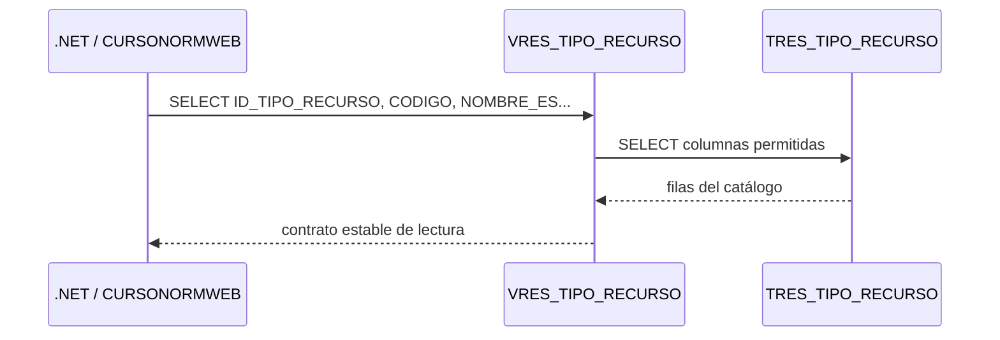
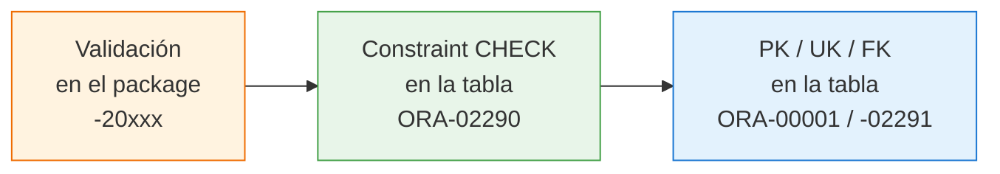

# Sesión 1 — Fundamentos Oracle

::: info CONTEXTO
**Duración:** 1 hora — 30 min teoría + 30 min práctica

Esta sesión consolida la arquitectura ADM/WEB que viste en el Curso de Bienvenida y la amplía con las decisiones de diseño que debes tomar al arrancar un proyecto real: qué convenciones seguir, cómo nombrar cada objeto, qué restricciones poner en las tablas y qué permisos otorgar.

Usamos como aplicación de referencia **ReserUA**, el sistema de reservas de recursos de la UA. En las sesiones de .NET y Vue trabajarás directamente sobre su código.

Si no asististe al Curso de Bienvenida, puedes consultar [Cómo trabajamos con Oracle](/cursos/curso-bienvenida/sesion-03-como-trabajamos-con-oracle/) como lectura previa.
:::

## Qué es Oracle y para qué lo usamos {#que-es-oracle}

**Oracle Database** es el sistema gestor de bases de datos relacional (RDBMS) que la Universidad de Alicante usa como almacén central de datos de las aplicaciones corporativas. Es un producto comercial mantenido por Oracle Corporation; en la UA usamos la versión **Oracle 19c**.

Una base de datos relacional guarda la información en **tablas** (filas y columnas con tipos definidos), garantiza la **integridad** mediante restricciones (`PRIMARY KEY`, `FOREIGN KEY`, `CHECK`...) y se consulta con **SQL**. Oracle añade además:

- **PL/SQL**, un lenguaje procedimental embebido para escribir lógica dentro de la base de datos (procedimientos, funciones, paquetes, triggers).
- **Vistas**, que actúan como consultas guardadas y como contrato estable hacia las aplicaciones.
- **Packages**, agrupaciones de procedimientos PL/SQL relacionados con su propia interfaz pública.
- Un sistema de **usuarios y privilegios** muy granular que permite separar quién posee los datos de quién los consume.

| Para qué lo usamos en la UA                                          | Cómo                                                                                              |
| -------------------------------------------------------------------- | ------------------------------------------------------------------------------------------------- |
| Persistir los datos de negocio (alumnos, recursos, reservas, fotos…) | Tablas en esquemas como `CURSONORMADM`, `FOTOSADM`, etc.                                          |
| Exponer un contrato de lectura estable a las aplicaciones            | Vistas `V<ACRO>_*`                                                                                |
| Centralizar la lógica de escritura y validación                      | Packages `PKG_<ACRO>_*` con procedimientos `CREAR`, `ACTUALIZAR`, `ELIMINAR`…                     |
| Limitar qué puede hacer cada aplicación                              | Usuario distinto (`...WEB`) con `GRANT SELECT` solo sobre vistas y `GRANT EXECUTE` sobre packages |

::: info CONTEXTO
A lo largo del curso usarás **dos usuarios** sobre la misma base de datos: `CURSONORMADM` (propietario) y `CURSONORMWEB` (aplicación). El propósito de esta separación es justamente lo que verás en la siguiente sección.
:::

## Objetivos

::: info CONTEXTO
Al terminar esta sesión serás capaz de:

- Explicar por qué la UA separa siempre los esquemas ADM y WEB y qué gana con ello.
- Aplicar las convenciones de nombres y los sufijos multiidioma sin consultar la referencia.
- Aplicar `IDENTITY` correctamente en una tabla nueva y reconocer las secuencias legacy.
- Diseñar restricciones `CHECK` en Oracle 19 para `NOT NULL`, dominios cerrados, rangos y comparaciones entre columnas.
- Entender la vista como contrato estable de lectura y cuándo desnormalizar con `JOIN`.
- Redactar el script de grants mínimo para una entidad nueva.
- Distinguir los errores funcionales del package (`-20xxx`) de los errores de integridad lanzados por Oracle (`ORA-xxxxx`).
- Reconocer cómo `ClaseOracleBD3` traduce tipos de Oracle a .NET y cuándo el automapeo no basta.
  :::

## La arquitectura ADM/WEB en contexto {#arquitectura-adm-web}

Todos los proyectos Oracle de la UA siguen el mismo patrón de dos esquemas. No es burocracia: es la primera línea de defensa del sistema.

```mermaid
graph TD
    ADM["ADM<br/>(propietario)"]
    T["📋 Tablas<br/>"]
    V["👁️ Vistas<br/>"]
    P["📦 Packages<br/>PKG_RES_..."]
    WEB["👤 Esquema WEB<br/>(aplicación)]
    NET[".NET Service<br/>ClaseOracleBD3"]

    ADM --> T
    ADM --> V
    ADM --> P
    T -->|"SELECT (interno)"| V
    V -->|"GRANT SELECT"| WEB
    P -->|"GRANT EXECUTE"| WEB
    WEB --> NET

    style ADM fill:#f4f0ff,stroke:#7c4dff
    style WEB fill:#e8f5e9,stroke:#43a047
    style NET fill:#e3f2fd,stroke:#1976d2
```

<!-- diagram id="arquitectura-adm-web" caption: "Arquitectura de dos esquemas Oracle en la UA" -->

| Esquema | Rol                        | Qué posee                                  | ReserUA        |
| ------- | -------------------------- | ------------------------------------------ | -------------- |
| **ADM** | Propietario de los datos   | Tablas, vistas, packages                   | `CURSONORMADM` |
| **WEB** | Consumidor (la aplicación) | Nada propio; usa objetos de ADM via grants | `CURSONORMWEB` |

::: warning IMPORTANTE
`CURSONORMWEB` **nunca** accede a las tablas directamente. Solo puede:

- `SELECT` sobre **vistas** (`GRANT SELECT`)
- `EXECUTE` sobre **packages** (`GRANT EXECUTE`)

Si alguien compromete las credenciales del usuario WEB, no puede hacer `DELETE` directo sobre las tablas ni conocer su estructura real.
:::

### Por qué esta separación importa {#por-que-separar}

La separación ADM/WEB no es solo seguridad: también es **estabilidad de contrato**.

Imagina que necesitas añadir una columna de auditoría (`FECHA_MODIFICACION`) a una tabla. Si la aplicación accediese directamente a la tabla, cualquier cambio en ella rompería el código .NET. Con la separación:

1. Añades la columna en la **tabla** (esquema ADM).
2. Decides si la **vista** la expone o no.
3. El **código .NET** no se entera de nada mientras la vista no cambie.

La vista actúa como **interfaz estable** entre la base de datos y la aplicación.

## Convenciones de nombres en Oracle {#convenciones-oracle}

Cada objeto del esquema lleva un prefijo que identifica qué es y a qué proyecto pertenece. Esto evita colisiones cuando un mismo esquema alberga varios proyectos y facilita las búsquedas en el diccionario de datos.

### Prefijos de objetos

| Prefijo    | Objeto            | Ejemplo en ReserUA                                  |
| ---------- | ----------------- | --------------------------------------------------- |
| `TRES_`    | Tabla             | `TRES_TIPO_RECURSO`, `TRES_RECURSO`, `TRES_RESERVA` |
| `VRES_`    | Vista             | `VRES_TIPO_RECURSO`, `VRES_RECURSO`                 |
| `PKG_RES_` | Package           | `PKG_RES_TIPO_RECURSO`, `PKG_RES_RECURSO`           |
| `PK_`      | Clave primaria    | `PK_TRES_TIPO_RECURSO`                              |
| `FK_`      | Clave ajena       | `FK_TRES_RECURSO_TIPO_RECURSO`                      |
| `UK_`      | Restricción única | `UK_TRES_TIPO_RECURSO_CODIGO`                       |
| `IDX_`     | Índice no único   | `IDX_TRES_RESERVA_RECURSO_FECHA`                    |
| `CK_`      | Restricción CHECK | `CK_TRES_RECURSO_ACTIVO`                            |

::: tip BUENA PRÁCTICA
El prefijo `TRES_` (tablas) y `VRES_` (vistas) identifica todos los objetos del proyecto de reservas dentro del esquema `CURSONORMADM`. Si el mismo esquema albergara otro proyecto, usaría prefijos distintos (por ejemplo, `TSAL_` para salas) para evitar colisiones de nombres.
:::

### Qué es y para qué sirve cada restricción {#que-es-cada-restriccion}

Los prefijos de la tabla anterior no son decorativos: cada uno corresponde a un **tipo de restricción** distinto que Oracle aplica al insertar, actualizar o consultar. Conviene entender qué garantiza cada uno antes de diseñar tablas.

#### `PK_` — clave primaria (PRIMARY KEY)

Identifica de forma **única** cada fila de la tabla. Una tabla tiene **exactamente una** PK. Oracle:

- No admite valores `NULL` en la columna PK.
- Crea automáticamente un índice único sobre ella, así que las búsquedas por PK son inmediatas.
- Permite que otras tablas la referencien con una FK.

```sql
CREATE TABLE CURSONORMADM.TRES_TIPO_RECURSO (
    ID_TIPO_RECURSO NUMBER GENERATED BY DEFAULT ON NULL AS IDENTITY,
    ...
    CONSTRAINT PK_TRES_TIPO_RECURSO PRIMARY KEY (ID_TIPO_RECURSO)
);
```

::: tip BUENA PRÁCTICA
Usa siempre un identificador técnico (`ID_<ENTIDAD>`) como PK, no un código funcional. Si mañana el `CODIGO` cambia (por una decisión de negocio), las FK seguirán apuntando al `ID` y no se rompe nada.
:::

#### `FK_` — clave ajena (FOREIGN KEY)

Garantiza que el valor de una columna **existe** en otra tabla. Es la herramienta que mantiene la **integridad referencial** entre entidades relacionadas.

```sql
CREATE TABLE CURSONORMADM.TRES_RECURSO (
    ID_RECURSO       NUMBER GENERATED BY DEFAULT ON NULL AS IDENTITY,
    ID_TIPO_RECURSO  NUMBER,
    ...
    CONSTRAINT PK_TRES_RECURSO PRIMARY KEY (ID_RECURSO),
    CONSTRAINT FK_TRES_RECURSO_TIPO_RECURSO
        FOREIGN KEY (ID_TIPO_RECURSO)
        REFERENCES CURSONORMADM.TRES_TIPO_RECURSO (ID_TIPO_RECURSO)
);
```

Qué hace Oracle si violas la FK:

- `INSERT` con un `ID_TIPO_RECURSO` que no existe → `ORA-02291: parent key not found`.
- `DELETE` de un padre con hijos → `ORA-02292: child record found`.

#### `UK_` — restricción única (UNIQUE)

Garantiza que un valor (o combinación) **no se repite** en la tabla, aunque no sea la PK. Sirve para reglas de negocio del tipo "el código no puede repetirse" o "no puede haber dos usuarios con el mismo email".

```sql
CONSTRAINT UK_TRES_TIPO_RECURSO_CODIGO UNIQUE (CODIGO)
```

Si intentas insertar un `CODIGO` que ya existe, Oracle rechaza la fila con `ORA-00001: unique constraint violated`.

::: tip BUENA PRÁCTICA
La PK es **una** por tabla; las UK pueden ser **varias**. Usa UK para identidades funcionales (códigos, emails, NIF) y reserva la PK para el ID técnico interno.
:::

#### `IDX_` — índice no único (INDEX)

Un índice acelera las búsquedas y los `JOIN` sobre columnas que no son PK ni UK, pero **no impone ninguna regla** de unicidad: solo es una estructura auxiliar para que Oracle no tenga que recorrer toda la tabla.

```sql
-- Acelera búsquedas como:
--   SELECT * FROM TRES_RESERVA WHERE ID_RECURSO = :id AND FECHA_RESERVA = :f
CREATE INDEX IDX_TRES_RESERVA_RECURSO_FECHA
    ON CURSONORMADM.TRES_RESERVA (ID_RECURSO, FECHA_RESERVA);
```

::: tip BUENA PRÁCTICA
Crea un índice **siempre** sobre las columnas FK (las que terminan en `_ID` y referencian otra tabla). Sin él, los `DELETE` de la tabla padre y los `JOIN` desde el hijo recorren la tabla entera. Crea índices adicionales solo para columnas que aparezcan habitualmente en `WHERE` u `ORDER BY`.
:::

#### `CK_` — restricción CHECK

Una expresión booleana que **cada fila** debe cumplir. Cierra el dominio de un campo a un conjunto de valores válidos. Es la última línea de defensa cuando ni la aplicación ni el package validan algo.

```sql
CONSTRAINT CK_TRES_RECURSO_ACTIVO CHECK (ACTIVO IN ('S', 'N')),
CONSTRAINT CK_TRES_RESERVA_HORA   CHECK (HORA_INICIO BETWEEN 0 AND 23)
```

Las verás en detalle en la sección [Restricciones CHECK en Oracle 19](#checks).

::: tip BUENA PRÁCTICA
Nombra siempre las constraints (`CONSTRAINT PK_TABLA PRIMARY KEY (...)`). Si dejas que Oracle las nombre por su cuenta (`SYS_C00xxx`), los mensajes de error y los scripts de mantenimiento se vuelven ilegibles.
:::

### Sufijos multiidioma {#sufijos-idioma}

Los campos de texto traducible llevan siempre uno de estos tres sufijos. **No hay otros**.

| Idioma             | Sufijo | Ejemplo                       |
| ------------------ | ------ | ----------------------------- |
| Castellano         | `_ES`  | `NOMBRE_ES`, `DESCRIPCION_ES` |
| Valenciano/Catalán | `_CA`  | `NOMBRE_CA`, `DESCRIPCION_CA` |
| Inglés             | `_EN`  | `NOMBRE_EN`                   |

::: danger ZONA PELIGROSA
El sufijo para valenciano es `_CA`, **nunca** `_VAL`. Usar `_VAL` viola la convención y rompe el patrón de todos los proyectos de la UA.
:::

## IDs automáticos: IDENTITY en Oracle 12+ {#identity}

Casi todas las tablas tienen una columna numérica que actúa como **identificador único** y que la base de datos debe generar sola al insertar una nueva fila. Resolver esto bien es importante porque el ID es lo que las FK referencian: si la asignación falla o se duplica, todo lo demás se rompe.

### Cómo se hacía antes de Oracle 12c (patrón legacy)

Hasta Oracle 11g, no existía la cláusula `IDENTITY`. La forma estándar requería **dos objetos** independientes y un **trigger** que los uniese:

```sql
-- 1) Una secuencia: generador de números autoincrementales que arranca en 1
CREATE SEQUENCE CURSONORMADM.SEQ_TRES_RECURSO
    START WITH 1     -- el primer valor servido será 1
    INCREMENT BY 1   -- cada llamada a NEXTVAL aumenta en 1
    NOCACHE          -- no precalcula bloques de IDs (más lento, pero sin huecos al reiniciar)
    NOCYCLE;         -- no vuelve a empezar al llegar al máximo

-- 2) Un trigger BEFORE INSERT que se dispara antes de cada INSERT en TRES_RECURSO
CREATE OR REPLACE TRIGGER CURSONORMADM.TRG_TRES_RECURSO_BI
BEFORE INSERT ON CURSONORMADM.TRES_RECURSO
FOR EACH ROW                                    -- una vez por cada fila insertada
WHEN (NEW.ID_RECURSO IS NULL)                   -- solo si el cliente no ha forzado un ID
BEGIN
    -- Asigna a la nueva fila el siguiente valor de la secuencia.
    -- :NEW.ID_RECURSO es la columna ID_RECURSO de la fila que está a punto de insertarse.
    :NEW.ID_RECURSO := CURSONORMADM.SEQ_TRES_RECURSO.NEXTVAL;
END;
/
```

Inconvenientes:

- Tres objetos por tabla (tabla + secuencia + trigger) que hay que mantener sincronizados.
- Si alguien renombra la secuencia o desactiva el trigger, los `INSERT` empiezan a fallar con `ORA-01400` y nadie sabe por qué.
- En migraciones, hay que `ALTER SEQUENCE ... RESTART WITH N` a mano para alinear la secuencia con los datos importados.

### Cómo se hace desde Oracle 12c con `IDENTITY`

Oracle 12c (y por tanto Oracle 19, que es nuestra versión) introduce la cláusula `IDENTITY`. Internamente Oracle sigue usando una secuencia, pero la **gestiona él mismo**: tú solo declaras la columna y olvidas el trigger.

```sql
-- Una sola línea, sin secuencia ni trigger explícitos
ID_RECURSO NUMBER GENERATED BY DEFAULT ON NULL AS IDENTITY
    CONSTRAINT PK_TRES_RECURSO PRIMARY KEY
```

Tienes tres modalidades:

| Modalidad                                  | Comportamiento                                           | Cuándo usarla                                   |
| ------------------------------------------ | -------------------------------------------------------- | ----------------------------------------------- |
| `GENERATED BY DEFAULT ON NULL AS IDENTITY` | Genera ID si la columna no se informa **o** llega `NULL` | **La recomendada** en proyectos nuevos          |
| `GENERATED ALWAYS AS IDENTITY`             | Oracle genera siempre el ID; no admite forzarlo          | Cuando nunca se deba insertar un ID manualmente |
| `GENERATED BY DEFAULT AS IDENTITY`         | Genera si la columna no aparece en el `INSERT`           | Menos cómoda con `NULL`                         |

::: tip BUENA PRÁCTICA
Usamos `GENERATED BY DEFAULT ON NULL AS IDENTITY` porque permite trabajar con normalidad y, si hace falta en una migración, admite forzar un ID manual sin tocar la definición de la tabla.
:::

### Para qué sirve realmente `IDENTITY`

| Problema                                                                          | Solución que aporta `IDENTITY`                                      |
| --------------------------------------------------------------------------------- | ------------------------------------------------------------------- |
| Necesito un identificador único por fila sin que el cliente lo invente            | Oracle asigna un número incremental garantizado                     |
| Quiero saber qué ID acaba de asignarse después del `INSERT`                       | `INSERT ... RETURNING ID_RECURSO INTO :id` lo devuelve directamente |
| No quiero arrastrar secuencias y triggers extra por cada tabla                    | Toda la mecánica está en la propia definición de la columna         |
| Quiero que en una migración pueda forzar IDs concretos para preservar referencias | `BY DEFAULT ON NULL` lo permite; `ALWAYS` no                        |

### Comparativa rápida

```sql
-- Antes (Oracle 11): tres objetos
CREATE SEQUENCE  SEQ_TRES_RECURSO ...;
CREATE TABLE     TRES_RECURSO (ID_RECURSO NUMBER PRIMARY KEY, ...);
CREATE TRIGGER   TRG_TRES_RECURSO_BI BEFORE INSERT ... ;

-- Ahora (Oracle 12+): un solo CREATE TABLE
CREATE TABLE TRES_RECURSO (
    ID_RECURSO NUMBER GENERATED BY DEFAULT ON NULL AS IDENTITY
        CONSTRAINT PK_TRES_RECURSO PRIMARY KEY,
    ...
);
```

::: warning IMPORTANTE
No crear secuencias nuevas en desarrollos actuales. Si encuentras código legacy con `SEQ_...` + trigger, respétalo pero no lo repliques. La sección [Patrones legacy](#legacy) muestra cómo distinguir las tablas antiguas y por qué no se reescriben.
:::

## Booleanos S/N: el patrón flag en Oracle {#booleanos-sn}

Oracle sí tiene un tipo lógico `BOOLEAN`, pero con dos matices importantes:

- En **PL/SQL** existe desde siempre (puedes declarar `v_activo BOOLEAN := TRUE` dentro de un procedimiento).
- En **SQL** (el lenguaje DDL/DML que se usa para definir y modificar columnas) `BOOLEAN` solo está disponible desde **Oracle 23ai**.

Como la mayor parte del código y de las tablas de la UA viven en **Oracle 19c**, y todas las tablas legadas usan `CHAR(1)` o `VARCHAR2(1)` con `'S'`/`'N'`, mantenemos esa convención también en proyectos nuevos para no mezclar dos formas distintas dentro del mismo esquema.

Patrón estándar:

- Columna `VARCHAR2(1)` con valores `'S'` o `'N'`.
- `DEFAULT 'S'` o `'N'` según el caso.
- `NOT NULL`.
- `CHECK (campo IN ('S', 'N'))` que cierra el dominio.

```sql
ACTIVO  VARCHAR2(1) DEFAULT 'S' NOT NULL,
VISIBLE VARCHAR2(1) DEFAULT 'S' NOT NULL,
CONSTRAINT CK_TRES_RECURSO_ACTIVO  CHECK (ACTIVO  IN ('S', 'N')),
CONSTRAINT CK_TRES_RECURSO_VISIBLE CHECK (VISIBLE IN ('S', 'N'))
```

Una entidad puede tener varios flags independientes. `TRES_RECURSO` tiene tres:

| Campo                   | Significado                                                           |
| ----------------------- | --------------------------------------------------------------------- |
| `ACTIVO`                | El recurso existe y es utilizable                                     |
| `VISIBLE`               | El recurso aparece en el listado público                              |
| `ATIENDE_MISMA_PERSONA` | Requiere mantener la misma persona en la atención asociada al recurso |

## Restricciones CHECK en Oracle 19 {#checks}

Las restricciones `CHECK` son la **última línea de defensa** de la base de datos. Aunque el package olvide una validación o alguien inserte datos desde otra herramienta, la BD rechaza la fila si no cumple la regla.

En Oracle 19 hay seis variantes que verás constantemente en el schema del curso. Conviene reconocerlas antes de afrontar el ejercicio.

### CHECK como NOT NULL nombrado

Cuando exportas el schema desde Oracle, cada `NOT NULL` aparece como una restricción `CHECK` con nombre. Es la forma canónica del schema real:

```sql
ID_TIPO_RECURSO NUMBER GENERATED BY DEFAULT ON NULL AS IDENTITY
    CONSTRAINT SYS_CK_TTR_ID_NN NOT NULL,
CODIGO VARCHAR2(100)
    CONSTRAINT SYS_CK_TTR_CODIGO_NN NOT NULL
```

En proyectos nuevos puedes escribir directamente `NOT NULL` sin nombrarlo: Oracle lo registra como `CHECK (col IS NOT NULL)`.

### CHECK con dominio cerrado (IN)

Para flags `S/N` o cualquier campo con valores fijos:

```sql
CONSTRAINT CK_TRES_RECURSO_ACTIVO
    CHECK (ACTIVO IN ('S', 'N'))
```

::: tip BUENA PRÁCTICA
Cierra siempre el dominio de un flag con `CHECK ... IN (...)`. Sin él, una migración incorrecta puede meter `'X'` o `'1'` y romper la lógica de la aplicación.
:::

### CHECK con rangos (BETWEEN)

Para horas, minutos, días de la semana, importes positivos:

```sql
CONSTRAINT CK_TRES_RESERVA_HORA_INICIO
    CHECK (HORA_INICIO BETWEEN 0 AND 23),

CONSTRAINT CK_TRES_RESERVA_MINUTO_INICIO
    CHECK (MINUTO_INICIO BETWEEN 0 AND 59),

CONSTRAINT CK_TRES_RESERVA_MINUTOS
    CHECK (MINUTOS_RESERVA > 0)
```

### CHECK con campo opcional (IS NULL OR ...)

Cuando una columna admite `NULL` pero, si tiene valor, debe estar en un rango:

```sql
CONSTRAINT CK_TRES_HORARIO_DIA_DIA
    CHECK (DIA IS NULL OR DIA BETWEEN 1 AND 7)
```

::: warning IMPORTANTE
Sin `DIA IS NULL OR ...`, Oracle rechazaría cualquier fila con `DIA` nulo aunque el rango se cumpla. La cláusula `IS NULL OR` es el patrón estándar para CHECKs sobre columnas opcionales.
:::

### CHECK con comparación entre columnas

Para garantizar coherencia entre dos campos de la misma fila:

```sql
CONSTRAINT CK_TFRANJA_HORARIO_FECHAS
    CHECK (FECHA_FIN >= FECHA_INICIO)
```

Oracle evalúa el `CHECK` en cada `INSERT` y `UPDATE`, así que la fila no puede quedar incoherente nunca.

### CHECK con REGEXP_LIKE

Para validar formato de texto (códigos, colores, identificadores):

```sql
ALTER TABLE CURSONORMADM.TRES_CONDUCTOR
    ADD CONSTRAINT CK_TRES_CONDUCTOR_COLOR
    CHECK (REGEXP_LIKE(COLOR, '^#[0-9A-Fa-f]{6}$'));
```

El campo `COLOR` solo admite valores hexadecimales tipo `#A1B2C3`. Cualquier otro formato es rechazado.

### Resumen de variantes CHECK

| Variante                      | Para qué sirve             | Ejemplo del schema            |
| ----------------------------- | -------------------------- | ----------------------------- |
| `CHECK (col IS NOT NULL)`     | Obligatoriedad nombrada    | `SYS_CK_TTR_CODIGO_NN`        |
| `CHECK (col IN (...))`        | Dominio cerrado            | `CK_TRES_RECURSO_ACTIVO`      |
| `CHECK (col BETWEEN a AND b)` | Rango numérico             | `CK_TRES_RESERVA_HORA_INICIO` |
| `CHECK (col IS NULL OR ...)`  | Rango sobre campo opcional | `CK_TRES_HORARIO_DIA_DIA`     |
| `CHECK (col1 op col2)`        | Coherencia entre columnas  | `CK_TFRANJA_HORARIO_FECHAS`   |
| `CHECK (REGEXP_LIKE(...))`    | Formato de texto           | `CK_TRES_CONDUCTOR_COLOR`     |

::: tip BUENA PRÁCTICA
Invierte tiempo en CHECKs expresivos en los campos críticos: dominios `S/N`, rangos horarios, formatos. La constraint protege los datos aunque la aplicación falle.
:::

## Vistas: el contrato estable de lectura {#vistas}

La vista es la única puerta por la que la aplicación lee datos. Tiene tres responsabilidades:

1. **Aislar** a la aplicación de los cambios físicos en la tabla.
2. **Filtrar** lo que la aplicación no debe ver (registros marcados como inactivos, columnas internas).
3. **Desnormalizar** los datos que la aplicación usa juntos para evitar consultas N+1.

### Por qué la vista, no la tabla



<!-- diagram id="flujo-vista-tipo-recurso" caption: "CURSONORMWEB lee tipos de recurso a través de la vista" -->

::: warning IMPORTANTE
La vista no usa `SELECT *`. Aunque exponga todas las columnas de la tabla, se listan una a una para que cualquier cambio futuro en la tabla sea una decisión explícita.
:::

### Vistas con JOIN: cuando la vista desnormaliza

Hasta ahora hemos presentado la vista como una proyección de **una** tabla. En la práctica, la vista es también el lugar natural para resolver los JOINs que la aplicación necesitaría hacer repetidamente.

```sql
CREATE OR REPLACE VIEW CURSONORMADM.VRES_RECURSO AS
SELECT
    R.ID_RECURSO,
    R.ID_TIPO_RECURSO,
    TR.NOMBRE_ES AS NOMBRE_TIPO_RECURSO_ES,
    TR.NOMBRE_CA AS NOMBRE_TIPO_RECURSO_CA,
    TR.NOMBRE_EN AS NOMBRE_TIPO_RECURSO_EN,
    R.NOMBRE_ES,
    R.NOMBRE_CA,
    R.NOMBRE_EN,
    NVL(R.ACTIVO,  'N') AS ACTIVO,
    NVL(R.VISIBLE, 'N') AS VISIBLE
  FROM CURSONORMADM.TRES_RECURSO R
  LEFT JOIN CURSONORMADM.TRES_TIPO_RECURSO TR
    ON TR.ID_TIPO_RECURSO = R.ID_TIPO_RECURSO;
```

## Control de acceso: grants mínimos {#grants}

El script de grants es breve y resume toda la arquitectura en tres líneas:

```sql
-- 1. REVOKE cualquier acceso directo a la tabla (si existiera)
REVOKE SELECT, INSERT, UPDATE, DELETE
    ON CURSONORMADM.TRES_TIPO_RECURSO
  FROM CURSONORMWEB;

-- 2. Solo lectura sobre la vista
GRANT SELECT ON CURSONORMADM.VRES_TIPO_RECURSO TO CURSONORMWEB;

-- 3. Solo ejecución sobre el package
GRANT EXECUTE ON CURSONORMADM.PKG_RES_TIPO_RECURSO TO CURSONORMWEB;
```

::: tip BUENA PRÁCTICA
Este es el grant completo para una entidad. No hay más. No hay `INSERT` directo, no hay `UPDATE` directo, no hay `SELECT` sobre la tabla. Si necesitas más operaciones, las añades al **package**.
:::

### Verificar los permisos desde SQL {#verificar-permisos}

Oracle expone su propia configuración como tablas consultables. Estas se llaman **vistas del diccionario de datos** y todas empiezan por `USER_`, `ALL_` o `DBA_`. Para los grants nos interesa `ALL_TAB_PRIVS`:

| Vista del diccionario | Qué muestra                                                                                                       |
| --------------------- | ----------------------------------------------------------------------------------------------------------------- |
| `USER_TAB_PRIVS`      | Privilegios concedidos a, o por, **el usuario actual** sobre tablas/vistas/packages                               |
| `ALL_TAB_PRIVS`       | Privilegios sobre objetos **a los que el usuario actual tiene acceso** (incluye los concedidos a roles que tiene) |
| `DBA_TAB_PRIVS`       | **Todos** los privilegios de la base de datos (solo accesible por el DBA)                                         |

Las columnas relevantes de `ALL_TAB_PRIVS`:

| Columna      | Significado                                                                           |
| ------------ | ------------------------------------------------------------------------------------- |
| `GRANTEE`    | Usuario o rol que **recibe** el privilegio (en nuestro caso `CURSONORMWEB`)           |
| `OWNER`      | Esquema que **posee** el objeto (en nuestro caso `CURSONORMADM`)                      |
| `TABLE_NAME` | Nombre del objeto sobre el que se concede el privilegio (vista, package, tabla…)      |
| `PRIVILEGE`  | Tipo de privilegio (`SELECT`, `INSERT`, `UPDATE`, `DELETE`, `EXECUTE`, `REFERENCES`…) |
| `GRANTOR`    | Quién concedió el privilegio                                                          |

Como usuario WEB, puedes comprobar qué objetos tienes disponibles:

```sql
-- Vistas que CURSONORMWEB puede leer
SELECT owner, table_name, privilege
  FROM all_tab_privs
 WHERE grantee  = 'CURSONORMWEB'
   AND privilege = 'SELECT'
 ORDER BY owner, table_name;

-- Packages que CURSONORMWEB puede ejecutar
SELECT owner, table_name, privilege
  FROM all_tab_privs
 WHERE grantee  = 'CURSONORMWEB'
   AND privilege = 'EXECUTE'
 ORDER BY owner, table_name;
```

::: tip BUENA PRÁCTICA
La salida de estas consultas es la **fotografía real** de lo que tu aplicación puede hacer. Si en `SELECT` aparece alguna `T<ACRO>_*` (tabla), es una violación de la arquitectura: WEB solo debería tener `SELECT` sobre `V<ACRO>_*` y `EXECUTE` sobre `PKG_*`.
:::

## Cómo llegan los errores Oracle a .NET {#errores-oracle}

Cuando algo falla, el error que recibe .NET puede venir de **dos sitios distintos**:

1. El package lanza un error funcional con `RAISE_APPLICATION_ERROR` y un código `-20xxx` controlado.
2. Oracle lanza un error de integridad con un código `ORA-xxxxx` que pertenece al diccionario de errores oficiales.

Distinguir uno de otro es lo que permite mostrar mensajes claros en la aplicación.

### Errores funcionales del package: códigos `-20xxx` {#errores-package}

El package `PKG_RES_TIPO_RECURSO` del schema usa cuatro códigos. Cada uno cubre una situación distinta:

| Código   | Significado funcional   | Cuándo se lanza                                                   |
| -------- | ----------------------- | ----------------------------------------------------------------- |
| `-20700` | Texto obligatorio vacío | `VALIDAR_TEXTO('CODIGO', P_CODIGO)` con `NULL` o cadena en blanco |
| `-20701` | ID nulo o no positivo   | `VALIDAR_ID_POSITIVO('ID_TIPO_RECURSO', P_ID)` con valor `<= 0`   |
| `-20702` | Registro no encontrado  | `SQL%ROWCOUNT = 0` tras `UPDATE` o `DELETE`                       |
| `-20703` | Integridad funcional    | Hay `TRES_RECURSO` que apuntan al tipo que se intenta borrar      |

```sql
-- Validación de campo obligatorio (-20700)
-- RAISE_APPLICATION_ERROR aborta el procedimiento y devuelve a la app
-- el código -20700 con el mensaje funcional que escribimos como segundo argumento.
RAISE_APPLICATION_ERROR(-20700, 'NOMBRE_ES es obligatorio.');

-- Validación de ID positivo (-20701)
-- Mismo patrón con un código diferente para que la app pueda distinguir el motivo.
RAISE_APPLICATION_ERROR(-20701, 'ID_TIPO_RECURSO debe ser mayor que 0.');

-- Registro inexistente tras UPDATE/DELETE (-20702)
-- SQL%ROWCOUNT contiene cuántas filas afectó el último UPDATE/DELETE/INSERT implícito.
-- Si vale 0, el WHERE no encontró el ID y convertimos ese silencio en error explícito.
IF SQL%ROWCOUNT = 0 THEN
  RAISE_APPLICATION_ERROR(-20702, 'El tipo de recurso no existe.');
END IF;

-- Regla funcional: no borrar tipos en uso (-20703)
-- Lo lanzaríamos tras comprobar (con un SELECT COUNT(*)) que existen recursos
-- asociados. La constraint FK también lo impediría con ORA-02292,
-- pero el mensaje funcional es más claro para mostrar al usuario.
RAISE_APPLICATION_ERROR(-20703, 'El tipo de recurso tiene recursos asociados.');
```

::: tip BUENA PRÁCTICA
Los códigos `-20xxx` son **funcionales**: el mensaje describe el problema en lenguaje de negocio, no técnico. La aplicación los puede mostrar al usuario tal cual.
:::

### Errores de integridad lanzados por Oracle: `ORA-xxxxx` {#errores-oracle-integridad}

Si una validación del package se olvida (o si los datos llegan por otra vía), Oracle todavía dispara errores propios al violar constraints:

| Error Oracle | Causa                                | Constraint que lo dispara                 |
| ------------ | ------------------------------------ | ----------------------------------------- |
| `ORA-00001`  | Valor duplicado                      | Restricción `UK_TRES_TIPO_RECURSO_CODIGO` |
| `ORA-01400`  | `NULL` en columna obligatoria        | `CHECK ... IS NOT NULL`                   |
| `ORA-02290`  | Valor fuera del dominio del CHECK    | `CK_TRES_RECURSO_ACTIVO` y similares      |
| `ORA-02291`  | FK apunta a un padre inexistente     | `FK_TRES_RECURSO_TIPO_RECURSO`            |
| `ORA-02292`  | FK protege al padre de borrarse      | `FK` con hijos existentes                 |
| `ORA-12899`  | Texto excede el tamaño de la columna | `VARCHAR2(100)` con 150 caracteres        |

::: warning IMPORTANTE
Estos errores **no** vienen del código del package: los lanza Oracle al ejecutar el `INSERT`, `UPDATE` o `DELETE`. Llegan al .NET con el código `ORA-xxxxx` y el texto en inglés del diccionario de Oracle.
:::

### Capas de defensa {#capas-defensa}

Una buena entidad tiene tres capas de defensa, cada una más estricta que la anterior:



<!-- diagram id="capas-defensa-errores" caption: "Validaciones del package, CHECKs y restricciones declarativas" -->

| Capa                   | Código                    | Mensaje al usuario         |
| ---------------------- | ------------------------- | -------------------------- |
| Validación del package | `-20xxx`                  | Mensaje funcional claro    |
| `CHECK` declarativo    | `ORA-02290`               | Mensaje genérico de Oracle |
| `PK` / `UK` / `FK`     | `ORA-00001` / `ORA-02291` | Mensaje genérico de Oracle |

#### Ejemplo didáctico: las tres capas en `PKG_RES_TIPO_RECURSO.CREAR`

Mira cómo se aplican las tres capas a un único `INSERT` real del schema. La aplicación llama a `CREAR` con `P_CODIGO`, `P_NOMBRE_ES`, etc. Lo que pasa por cada capa antes de que la fila aterrice en la tabla:

```sql
-- Procedimiento público del package: alta de un nuevo tipo de recurso.
-- Recibe los datos de la aplicación y devuelve el ID generado por la BD.
PROCEDURE CREAR(
  P_CODIGO          IN  CURSONORMADM.TRES_TIPO_RECURSO.CODIGO%TYPE,    -- código funcional único
  P_NOMBRE_ES       IN  CURSONORMADM.TRES_TIPO_RECURSO.NOMBRE_ES%TYPE, -- nombre en castellano
  P_NOMBRE_CA       IN  CURSONORMADM.TRES_TIPO_RECURSO.NOMBRE_CA%TYPE, -- nombre en valenciano
  P_NOMBRE_EN       IN  CURSONORMADM.TRES_TIPO_RECURSO.NOMBRE_EN%TYPE, -- nombre en inglés
  P_ID_TIPO_RECURSO OUT CURSONORMADM.TRES_TIPO_RECURSO.ID_TIPO_RECURSO%TYPE -- ID generado por IDENTITY (salida)
) AS
BEGIN
  -- ── Capa 1: validación funcional del package ─────────────────────────
  -- Cada VALIDAR_TEXTO comprueba que el valor no sea NULL ni cadena vacía.
  -- Si alguno falla, lanza RAISE_APPLICATION_ERROR(-20700, ...) y aborta el INSERT.
  VALIDAR_TEXTO('CODIGO',    P_CODIGO);
  VALIDAR_TEXTO('NOMBRE_ES', P_NOMBRE_ES);
  VALIDAR_TEXTO('NOMBRE_CA', P_NOMBRE_CA);
  VALIDAR_TEXTO('NOMBRE_EN', P_NOMBRE_EN);

  -- ── Capas 2 y 3: las dispara Oracle al ejecutar este INSERT ──────────
  --   Capa 2 (CHECK): si el TRIM dejara NULL, salta SYS_CK_TTR_*_NN → ORA-01400
  --   Capa 3 (UK):    si el CODIGO ya existe, salta UK_TRES_TIPO_RECURSO_CODIGO → ORA-00001
  -- TRIM() elimina espacios al principio/final para que "  AULA " y "AULA" se traten igual.
  INSERT INTO CURSONORMADM.TRES_TIPO_RECURSO (
    CODIGO, NOMBRE_ES, NOMBRE_CA, NOMBRE_EN
  ) VALUES (
    TRIM(P_CODIGO),
    TRIM(P_NOMBRE_ES),
    TRIM(P_NOMBRE_CA),
    TRIM(P_NOMBRE_EN)
  )
  -- RETURNING devuelve el ID que IDENTITY acaba de generar y lo guarda en el OUT.
  -- Sin esto haría falta una query extra (SELECT ... FROM ...) para conocer el ID.
  RETURNING ID_TIPO_RECURSO INTO P_ID_TIPO_RECURSO;
END CREAR;

PROCEDURE VALIDAR_TEXTO(
    P_NOMBRE_CAMPO IN VARCHAR2,
    P_VALOR        IN VARCHAR2
  ) AS
  BEGIN
    IF P_VALOR IS NULL OR TRIM(P_VALOR) IS NULL THEN
      RAISE_APPLICATION_ERROR(-20700, P_NOMBRE_CAMPO || ' es obligatorio.');
    END IF;
  END VALIDAR_TEXTO;

```

Tres escenarios típicos y por qué capa "salen":

| Escenario de la aplicación                 | Capa que reacciona       | Error que recibe .NET                                               |
| ------------------------------------------ | ------------------------ | ------------------------------------------------------------------- |
| `P_CODIGO = NULL`                          | Capa 1: `VALIDAR_TEXTO`  | `ORA-20700: CODIGO es obligatorio.`                                 |
| Capa 1 desactivada y `P_NOMBRE_ES = NULL`  | Capa 2: `CHECK NOT NULL` | `ORA-01400: cannot insert NULL`                                     |
| `P_CODIGO = 'AULA'` y ya existe ese código | Capa 3: `UK`             | `ORA-00001: unique constraint UK_TRES_TIPO_RECURSO_CODIGO violated` |

::: tip BUENA PRÁCTICA
Documenta siempre qué códigos `-20xxx` usa cada package y qué significado funcional tienen. Las capas 2 y 3 siguen actuando como red de seguridad aunque la capa 1 esté bien escrita: nunca delegues la integridad **solo** al package.
:::

## Reglas de diseño que no negociamos {#reglas-fijas}

Estas decisiones están tomadas para todos los proyectos de la UA:

| Regla                                               | Por qué                                           |
| --------------------------------------------------- | ------------------------------------------------- |
| No crear sinónimos Oracle                           | Añaden una capa de indirección sin beneficio real |
| No crear secuencias nuevas                          | Sustituidas por `IDENTITY`                        |
| WEB no recibe grants sobre tablas                   | Seguridad y mínimo privilegio                     |
| No `SELECT *` en vistas ni en queries               | El automapeo .NET funciona por nombre de columna  |
| `_CA` para valenciano, nunca `_VAL`                 | Convención fija en toda la UA                     |
| Flags como `VARCHAR2(1)` con `CHECK IN ('S','N')`   | Oracle SQL no tiene `BOOLEAN`                     |
| SQL solo en `Services` .NET, nunca en `Controllers` | Separación de responsabilidades                   |

## Patrones legacy que verás en el código {#legacy}

Algunos proyectos arrastran convenciones de versiones previas de Oracle. Reconócelas pero no las repliques.

### Secuencias heredadas vs IDENTITY

```sql
-- TRES_RECURSO usa una secuencia legacy importada de Oracle 11
ID_RECURSO NUMBER DEFAULT "ISEQ$_103519".NEXTVAL NOT NULL

-- TRES_TIPO_RECURSO usa el patrón moderno
ID_TIPO_RECURSO NUMBER GENERATED BY DEFAULT ON NULL AS IDENTITY
```

::: tip BUENA PRÁCTICA
Respeta las secuencias legacy en tablas existentes, **pero no crees secuencias nuevas**. En desarrollos nuevos, siempre `IDENTITY`.
:::

### Múltiples flags S/N en una misma entidad

Una entidad puede tener varios flags independientes (`ACTIVO`, `VISIBLE`, `ATIENDE_MISMA_PERSONA` en `TRES_RECURSO`). En vez de un procedimiento por cada uno, los packages los actualizan con un único `ACTUALIZAR_FLAGS(P_ID, P_ACTIVO, P_VISIBLE)`:

```sql
-- Único procedimiento para actualizar cualquier combinación de flags S/N del recurso.
-- Cada parámetro es opcional (DEFAULT NULL): si la aplicación no lo informa, ese flag no cambia.
PROCEDURE ACTUALIZAR_FLAGS(
    P_ID_RECURSO IN  CURSONORMADM.TRES_RECURSO.ID_RECURSO%TYPE,            -- recurso a modificar
    P_ACTIVO     IN  CURSONORMADM.TRES_RECURSO.ACTIVO%TYPE  DEFAULT NULL,  -- nuevo valor de ACTIVO o NULL para no tocarlo
    P_VISIBLE    IN  CURSONORMADM.TRES_RECURSO.VISIBLE%TYPE DEFAULT NULL,  -- nuevo valor de VISIBLE o NULL para no tocarlo
    ...
);
```

Menos superficie de API, más coherencia. Volveremos a ello en la sesión 2.

## Cómo se relacionan tablas, vistas y paquetes con el código .NET {#dotnet}

Toda la sesión hasta aquí trata de Oracle puro. La aplicación .NET no inventa nada nuevo: simplemente lee la vista y ejecuta el package usando una librería que se llama `ClaseOracleBD3`.

::: info CONTEXTO
Esta parte cierra la sesión: te enseña cómo Oracle se conecta con C# y TypeScript. La sesión 3 (parte .NET) ampliará cada pieza, pero llegando aquí ya entiendes cómo se traducen los nombres y los tipos.
:::

### `ClaseOracleBD3` como puente

Es la librería de acceso a datos común a todos los proyectos .NET de la UA. Se inyecta siempre por su interfaz:

```csharp
public class ClaseTiposRecurso
{
    private readonly IClaseOracleBd _bd;
    public ClaseTiposRecurso(IClaseOracleBd bd) => _bd = bd;
}
```

Sus métodos principales:

| Método                                     | Uso                                  | Retorno           |
| ------------------------------------------ | ------------------------------------ | ----------------- |
| `ObtenerTodosMap<T>(sql, param, idioma)`   | Listado desde una vista              | `IEnumerable<T>?` |
| `ObtenerPrimeroMap<T>(sql, param, idioma)` | Un registro por ID                   | `T?`              |
| `EjecutarParams(procedure, param)`         | INSERT / UPDATE / DELETE vía package | `void`            |

Las **lecturas** van directas contra la vista con `SELECT`; las **escrituras** llaman al package con `EjecutarParams`.

### Convenciones de nombres en C# y TypeScript

`ClaseOracleBD3` traduce automáticamente los nombres entre capas:

| Tipo                           | Patrón                           | Ejemplo                      | Carpeta          |
| ------------------------------ | -------------------------------- | ---------------------------- | ---------------- |
| Modelo de datos (lectura)      | `Clase` + entidad singular       | `ClaseTipoRecurso`           | `Models/`        |
| Modelo de escritura (POST/PUT) | `Clase` + entidad + `ParamsAlta` | `ClaseTipoRecursoParamsAlta` | `Models/Params/` |
| Servicio                       | `Clase` + entidad plural         | `ClaseTiposRecurso`          | `Services/`      |
| Interfaz de servicio           | `I` + servicio                   | `IClaseTiposRecurso`         | `Interfaces/`    |

::: tip Por qué un modelo aparte para escritura

El **modelo de datos** (`ClaseTipoRecurso`) refleja lo que la base de datos devuelve y suele incluir el `IdTipoRecurso`, fechas de auditoría y campos calculados que el cliente nunca debería rellenar.

El **modelo de escritura** (`ClaseTipoRecursoParamsAlta`) representa lo que la **aplicación cliente envía** en un `POST` o `PUT`. Tiene tres ventajas:

- **Solo expone los campos que la aplicación puede informar.** Por ejemplo, no incluye `IdTipoRecurso` (que lo genera Oracle con `IDENTITY`) ni `FechaModificacion` (que lo gestiona la base de datos). Si el cliente intenta enviarlos, simplemente se ignoran.
- **Permite validaciones específicas del alta o de la actualización.** Un `[Required]` o `[StringLength(100)]` se pone en este modelo, no en el de lectura.
- **Aísla el contrato de la API del esquema interno.** Mañana puedes añadir una columna interna en la tabla sin tocar la API pública.

Sin esta separación, expones por error campos internos al frontend y abres una vía para que un cliente malicioso pueda forzar valores que no debería poder cambiar (mass assignment).
:::

Y en cada capa el nombre cambia de forma:

| Oracle (`SNAKE_CASE`) | C# (`PascalCase`)   | TypeScript (`camelCase`) |
| --------------------- | ------------------- | ------------------------ |
| `ID_TIPO_RECURSO`     | `IdTipoRecurso`     | `idTipoRecurso`          |
| `NOMBRE_ES`           | `NombreEs`          | `nombreEs`               |
| `FECHA_MODIFICACION`  | `FechaModificacion` | `fechaModificacion`      |

### Cómo se traducen los tipos de Oracle a .NET

| Oracle                | C# automapeo               | C# mapeo manual           | Escritura (Oracle ← C#) |
| --------------------- | -------------------------- | ------------------------- | ----------------------- |
| `NUMBER`              | `int` / `long` / `decimal` | `Convert.ToInt32()`       | Directo                 |
| `VARCHAR2`            | `string`                   | `rs["col"] as string`     | Directo                 |
| `VARCHAR2/CHAR` `'S'` | `bool true`                | `ClaseOracleBd.ToBool()`  | `valor ? "S" : "N"`     |
| `VARCHAR2/CHAR` `'N'` | `bool false`               | `ClaseOracleBd.ToBool()`  | `valor ? "S" : "N"`     |
| `DATE` / `TIMESTAMP`  | `DateTime?`                | `DateOnly.FromDateTime()` | `OracleDbType.Date`     |
| `BLOB`                | —                          | `(byte[])rs["col"]`       | `OracleDbType.Blob`     |
| `CLOB`                | `string`                   | `rs["col"].ToString()`    | `OracleDbType.Clob`     |

### Cuándo el mapeo es automático y cuándo manual {#auto-vs-manual}

::: code-group

```csharp [Automapeo: el caso del 80%]
// Funciona automáticamente porque:
// 1. SNAKE_CASE → PascalCase coincide
// 2. VARCHAR2/CHAR 'S'/'N' → bool
// 3. DATE/TIMESTAMP → DateTime?

public class ClaseTipoRecurso
{
    public int    IdTipoRecurso { get; set; }  // NUMBER → int
    public string Codigo        { get; set; }  // VARCHAR2 → string
    public string NombreEs      { get; set; }  // VARCHAR2 → string
    public string NombreCa      { get; set; }  // VARCHAR2 → string
    public string NombreEn      { get; set; }  // VARCHAR2 → string
}
```

```csharp [Mapeo manual: DateOnly y BLOB]
// Necesario cuando queremos:
// - DateOnly en lugar de DateTime?
// - byte[] desde BLOB
// - cualquier transformación especial

public ClaseRecursoDetalle(IDataRecord rs)
{
    IdRecurso = Convert.ToInt32(rs["id_recurso"]);
    NombreEs  = rs["nombre_es"] as string ?? string.Empty;

    // VARCHAR2(1) S/N → bool (explícito en mapeo manual)
    Activo = ClaseOracleBd.ToBool(rs["activo"]);

    // DATE → DateOnly (el automapeo solo llega a DateTime?)
    var fecha = ClaseOracleBd.ToNullableDateTime(rs["fecha_modificacion"]);
    FechaModificacion = fecha.HasValue ? DateOnly.FromDateTime(fecha.Value) : null;
}
```

```csharp [Atributo Columna cuando no coincide]
// Si la propiedad C# no coincide con la columna Oracle
// tras eliminar guiones bajos y capitalizar, hace falta el atributo:

public class ClaseRecurso
{
    [Columna("CODPER_UAAPPS")]
    public string Codper { get; set; }   // sin atributo, no se mapearía
}
```

:::

::: details Cuándo elegir cada uno

- **Automapeo** cuando los tipos son `NUMBER`, `VARCHAR2`, `CHAR(1) S/N` o `DATE` y no necesitas `DateOnly`. Es el 80% de los casos.
- **Mapeo manual** cuando necesitas `DateOnly`, `BLOB → byte[]`, `CLOB`, o transformaciones que el automapeo no soporta.
- El automapeo es una conveniencia, no una obligación. Ambos enfoques coexisten en un mismo proyecto.
  :::

### Automapeo multiidioma nativo {#automapeo-idioma}

`ClaseOracleBD3` tiene soporte nativo para columnas multiidioma. Si la vista expone `NOMBRE_ES` y `NOMBRE_CA`, el servicio puede mapear la columna correspondiente al idioma del usuario en una única propiedad `Nombre`:

```csharp
// El modelo solo necesita una propiedad por concepto
public class ClaseTipoRecurso
{
    public int    IdTipoRecurso { get; set; }
    public string Nombre        { get; set; }  // ← recibe NOMBRE_ES o NOMBRE_CA
}

// En el servicio, se pasa el idioma del usuario
public List<ClaseTipoRecurso> ObtenerTodos(string idioma)
{
    return _bd.ObtenerTodosMap<ClaseTipoRecurso>(
        "SELECT * FROM CURSONORMADM.VRES_TIPO_RECURSO ORDER BY NOMBRE_ES",
        param: null,
        idioma: idioma          // "ES" → usa NOMBRE_ES, "CA" → usa NOMBRE_CA
    ).ToList();
}
```

::: tip BUENA PRÁCTICA
Diseña las vistas con columnas `_ES` / `_CA` y deja que la librería haga la selección de idioma. El modelo de datos tiene una sola propiedad por concepto (no `NombreEs` + `NombreCa`), lo que simplifica el código TypeScript del frontend.
:::

## Práctica — Sesión 1 {#practica}

**Duración:** 30 minutos
**Herramienta:** DBeaver o SQL Developer para VS Code

Esta práctica te prepara para el [ejercicio entregable de la sesión 1](../2-ejercicio-fundamentos/), donde aplicarás los conceptos sobre una tabla nueva.

### Conexiones a configurar

Necesitas dos conexiones separadas:

#### **CURSONORMADM** → usuario propietario (para crear objetos).

- Host: laguar-n1-vip.cpd.ua.es
- Puerto: 1521
- Database: ORACTEST.UA.ES -> Service name
- Usuario: CURSONORMADM
- Contraseña: **`k/=g^"KP-My/T..Yyu!**

#### **CURSONORMWEB** → usuario de aplicación (para verificar permisos).

- Host: laguar-n1-vip.cpd.ua.es
- Puerto: 1521
- Database: ORACTEST.UA.ES -> Service name
- Usuario: CURSONORMWEB
- Contraseña: **O8XN"mA(Ij3U\SMCW-O5**

::: warning IMPORTANTE
Ejecuta siempre los scripts de creación conectado como **CURSONORMADM**. Comprobarás los grants conectándote como **CURSONORMWEB**.
:::

::: tip SIGUIENTE PASO
Completa el [ejercicio entregable de la sesión 1](../2-ejercicio-fundamentos/) y continúa con la [Sesión 2 — Tablas, vistas y paquetes](../3-tablas-vistas/).
:::

## Resumen y conexión con la sesión 2 {#resumen}

En esta sesión has consolidado:

- La arquitectura ADM/WEB y **por qué** funciona así.
- Las convenciones de nombres en Oracle y los sufijos multiidioma `_ES`, `_CA`, `_EN`.
- `IDENTITY` para IDs automáticos en Oracle 12+.
- El patrón `S/N` para flags y las **seis variantes de CHECK** que protegen los datos.
- La vista como contrato estable de lectura, con o sin `JOIN`.
- El script de grants mínimo para una entidad.
- La diferencia entre errores funcionales del package (`-20xxx`) y errores de integridad de Oracle (`ORA-xxxxx`).
- Cómo `ClaseOracleBD3` traduce nombres y tipos entre Oracle, C# y TypeScript.

En la **Sesión 2** pasamos a recorrer el ciclo completo sobre `TRES_TIPO_RECURSO`:

```text
CREATE TABLE  →  CREATE VIEW  →  CREATE PACKAGE  →  GRANTS
```

Veremos las validaciones privadas reutilizables (`VALIDAR_TEXTO`, `VALIDAR_ID_POSITIVO`), el uso de `RETURNING ... INTO`, `SQL%ROWCOUNT` y la protección funcional de `ELIMINAR`.

## Para profundizar {#profundizar}

::: details Cómo conectar a Oracle desde la cadena de conexión .NET

La aplicación .NET se conecta **siempre** con el usuario WEB. En ReserUA, la cadena de conexión en `appsettings.development.json`:

```json
{
  "ConnectionStrings": {
    "ORADB": "Data Source=localhost:1521/FREE;User ID=CURSONORMWEB;Password=...;"
  }
}
```

Nunca uses `CURSONORMADM` en la cadena de conexión de la aplicación.
:::

::: details Oracle IDENTITY: comportamiento en INSERT

```sql
-- Oracle genera el ID (columna ausente)
INSERT INTO CURSONORMADM.TRES_TIPO_RECURSO (NOMBRE_ES, NOMBRE_CA, NOMBRE_EN, CODIGO)
VALUES ('Administrador', 'Administrador', 'Administrator', 'ADM');

-- Oracle genera el ID (columna presente con NULL)
INSERT INTO CURSONORMADM.TRES_TIPO_RECURSO (ID_TIPO_RECURSO, NOMBRE_ES, NOMBRE_CA, NOMBRE_EN, CODIGO)
VALUES (NULL, 'Usuario', 'Usuari', 'User', 'USR');

-- Oracle respeta el ID manual (útil en migraciones)
INSERT INTO CURSONORMADM.TRES_TIPO_RECURSO (ID_TIPO_RECURSO, NOMBRE_ES, NOMBRE_CA, NOMBRE_EN, CODIGO)
VALUES (500, 'Coordinador', 'Coordinador', 'Coordinator', 'COORD');
```

En el trabajo habitual, no informamos `ID_TIPO_RECURSO`. El package tampoco lo recibe como parámetro de entrada en `CREAR`; lo devuelve como `OUT` via `RETURNING ... INTO`.
:::

::: details Diccionario rápido de errores Oracle

| Código      | Significado                             | Ejemplo típico                             |
| ----------- | --------------------------------------- | ------------------------------------------ |
| `ORA-00001` | Unique constraint violated              | Insertar `CODIGO` ya existente             |
| `ORA-00942` | Table or view does not exist            | WEB intenta hacer `SELECT` sobre una tabla |
| `ORA-01400` | Cannot insert NULL                      | Olvidar un campo obligatorio               |
| `ORA-01403` | No data found                           | `SELECT INTO` sin filas en PL/SQL          |
| `ORA-02290` | Check constraint violated               | Insertar `'X'` en un flag `S/N`            |
| `ORA-02291` | Integrity constraint (parent not found) | FK con un `ID_TIPO_RECURSO` inexistente    |
| `ORA-02292` | Integrity constraint (child found)      | Borrar un padre con hijos                  |
| `ORA-12899` | Value too large for column              | `VARCHAR2(10)` con 50 caracteres           |

:::

::: details Por qué seguimos usando VARCHAR2(1) y no NUMBER(1) para flags

Aunque `NUMBER(1) IN (0,1)` también funcionaría, la convención de la UA es `VARCHAR2(1) IN ('S','N')` por tres razones:

1. La mayor parte del schema heredado lo usa así. Cambiar mezclaría dos formas para lo mismo.
2. `'S'` y `'N'` son legibles directamente al hacer `SELECT` desde una herramienta SQL.
3. `ClaseOracleBD3` trata `'S'/'N'` como `bool` automáticamente.
   :::
