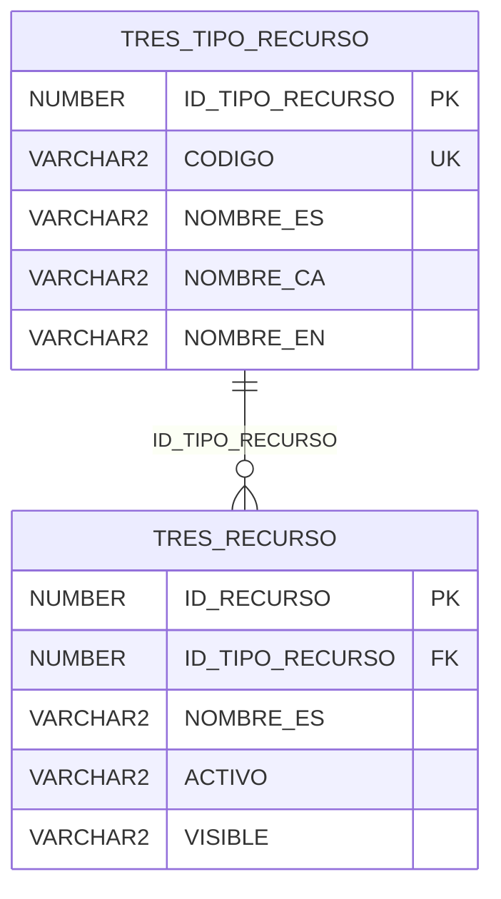
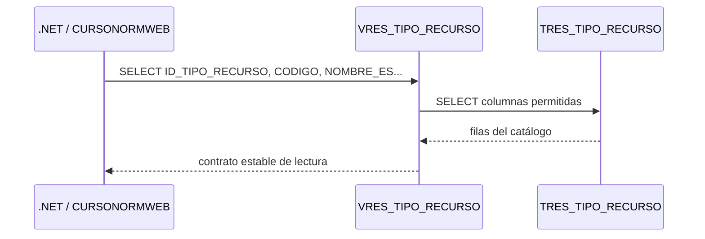
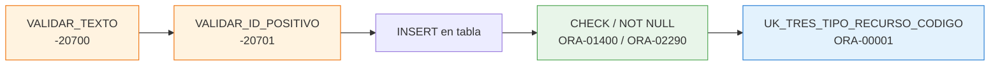
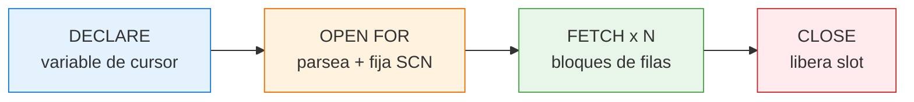
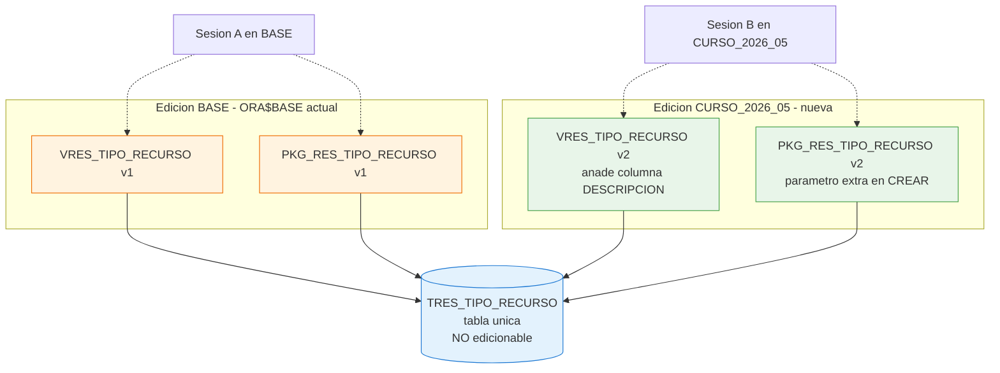
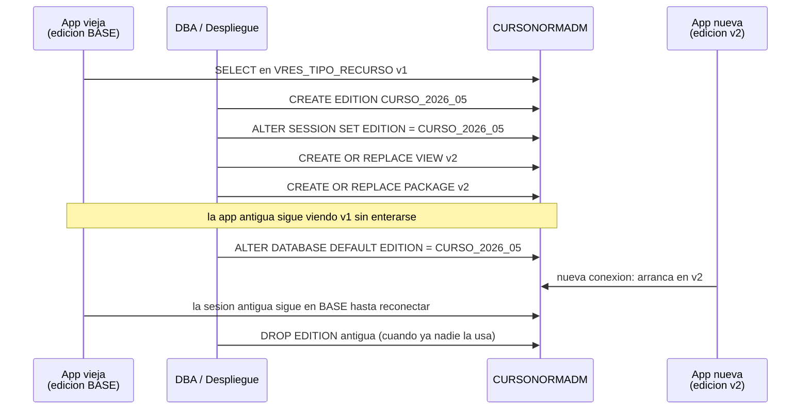

# Sesión 2 — Tablas, vistas y paquetes

::: info CONTEXTO
**Duración:** 1 hora — 30 min teoría + 30 min práctica

Pasamos de la arquitectura ADM/WEB a construirla con objetos reales del schema `CURSONORMADM`. Trabajamos sobre `TRES_TIPO_RECURSO`, `VRES_TIPO_RECURSO` y `PKG_RES_TIPO_RECURSO`. Esta sesión cubre las **dos formas de editar datos**:

- **Vía vista** (la vista que actúa como tabla): `UPDATE/INSERT/DELETE` directos cuando la vista es key-preserved.
- **Vía package** (la elegida por la app): CRUD con validaciones, errores `-20xxx` y los OUT estándar `P_CODIGO_ERROR` / `P_MENSAJE_ERROR`.

Las secciones más densas (REF CURSOR detallado, EBR, funciones SQL) están al final, en [Para profundizar](#profundizar), para que la clase quepa en una hora.
:::

## Antes de empezar {#antes-de-empezar}

Esta sesión continúa directamente desde la [Sesión 1 — Fundamentos Oracle](../1-fundamentos-oracle/). Antes de ejecutar scripts, confirma que tienes claro el punto de partida:

- `CURSONORMADM` es el propietario de tablas, vistas y packages.
- `CURSONORMWEB` es el usuario que representa a la aplicación.
- WEB no debe consultar tablas directamente.
- Las lecturas salen por vistas y las escrituras por packages.
- Reconoces las **seis variantes de `CHECK`** que vimos en la sesión 1.
- Distingues los códigos `-20xxx` (lanzados por el package con `RAISE_APPLICATION_ERROR`) de los `ORA-xxxxx` (lanzados por Oracle al violar constraints).

::: tip CONTINUIDAD
Si no has completado el [ejercicio de la sesión 1](../2-ejercicio-fundamentos/) ni el checklist de continuidad, vuelve primero allí. En esta sesión trabajamos con dos conexiones (`CURSONORMADM` y `CURSONORMWEB`) que deben estar listas.
:::

## Objetivos

Al terminar esta sesión serás capaz de:

- Leer el DDL real de una tabla Oracle exportada y distinguir columnas, PK, UK y CHECKs.
- Crear una vista `VRES_` como contrato de lectura para el usuario WEB, con o sin `JOIN`.
- Decidir cuándo una vista admite **DML directo** (key-preserved) y cuándo no, y razonar por qué seguimos prefiriendo el package.
- Escribir un package CRUD con `CREAR`, `OBTENER_TODOS`, `OBTENER_POR_ID`, `ACTUALIZAR` y `ELIMINAR` que devuelve los errores por `P_CODIGO_ERROR` / `P_MENSAJE_ERROR`.
- Centralizar las validaciones en procedimientos privados (`VALIDAR_TEXTO`, `VALIDAR_ID_POSITIVO`).
- Aplicar el modelo de errores `-20700/-20701/-20702/-20703` de forma coherente.
- Verificar objetos compilados y grants antes de conectar la capa .NET.

## La entidad de ejemplo: `TRES_TIPO_RECURSO` {#entidad-ejemplo}

`TRES_TIPO_RECURSO` clasifica los recursos reservables de ReserUA. Es un catálogo sencillo: no tiene columnas de estado ni borrado lógico. Su objetivo es que otros objetos, como `TRES_RECURSO`, puedan indicar de qué tipo es cada recurso.

La relación relevante del schema real es:



<!-- diagram id="er-tres-tipo-recurso" caption: "TRES_TIPO_RECURSO clasifica los recursos reservables" -->

::: warning IMPORTANTE
En este material manda el schema real. Si una guía genérica habla de `ACTIVO`, borrado lógico o `ACTUALIZAR_ACTIVO`, solo aplica a entidades que tengan esa columna. `TRES_TIPO_RECURSO` no la tiene; `TRES_RECURSO` sí.
:::

## Paso 1 — Tabla `TRES_TIPO_RECURSO` {#tabla}

El DDL exportado define una tabla de catálogo con cinco columnas:

| Columna           | Tipo              | Papel                  |
| ----------------- | ----------------- | ---------------------- |
| `ID_TIPO_RECURSO` | `NUMBER IDENTITY` | Clave primaria técnica |
| `CODIGO`          | `VARCHAR2(100)`   | Código funcional único |
| `NOMBRE_ES`       | `VARCHAR2(150)`   | Nombre en castellano   |
| `NOMBRE_CA`       | `VARCHAR2(150)`   | Nombre en valenciano   |
| `NOMBRE_EN`       | `VARCHAR2(150)`   | Nombre en inglés       |

```sql
CREATE TABLE CURSONORMADM.TRES_TIPO_RECURSO
(
    ID_TIPO_RECURSO NUMBER GENERATED BY DEFAULT ON NULL AS IDENTITY
        CONSTRAINT SYS_CK_TTR_ID_NN NOT NULL,
    CODIGO VARCHAR2(100)
        CONSTRAINT SYS_CK_TTR_CODIGO_NN NOT NULL,
    NOMBRE_ES VARCHAR2(150)
        CONSTRAINT SYS_CK_TTR_NOMBRE_ES_NN NOT NULL,
    NOMBRE_CA VARCHAR2(150)
        CONSTRAINT SYS_CK_TTR_NOMBRE_CA_NN NOT NULL,
    NOMBRE_EN VARCHAR2(150)
        CONSTRAINT SYS_CK_TTR_NOMBRE_EN_NN NOT NULL,

    CONSTRAINT PK_TRES_TIPO_RECURSO
        PRIMARY KEY (ID_TIPO_RECURSO),
    CONSTRAINT UK_TRES_TIPO_RECURSO_CODIGO
        UNIQUE (CODIGO)
);
```

### Qué decisiones enseña esta tabla

| Elemento                 | Lectura técnica                                                                                                                          |
| ------------------------ | ---------------------------------------------------------------------------------------------------------------------------------------- |
| `IDENTITY`               | Oracle genera el ID. No hace falta crear secuencia ni trigger nuevos.                                                                    |
| `CODIGO` con `UK`        | La unicidad funcional se protege en base de datos.                                                                                       |
| Tres columnas `NOMBRE_*` | El catálogo está preparado para interfaz multidioma.                                                                                     |
| Checks `SYS_CK_TTR_*_NN` | En el export real se usan checks nombrados para representar `NOT NULL`. Es una de las **seis variantes de CHECK** vistas en la sesión 1. |
| Sin `ACTIVO`             | No hay borrado lógico en este catálogo; `ELIMINAR` borra físicamente si no hay recursos asociados.                                       |

::: tip BUENA PRÁCTICA
En proyectos nuevos preferimos nombres semánticos para constraints, pero aquí respetamos el export porque es la fotografía del schema real del curso.
:::

## Paso 2 — Vista `VRES_TIPO_RECURSO` {#vista}

La vista es el contrato de lectura para la aplicación. En este caso no filtra por estado porque la tabla no tiene columna `ACTIVO`.

```sql
CREATE OR REPLACE FORCE VIEW CURSONORMADM.VRES_TIPO_RECURSO
(
    ID_TIPO_RECURSO,
    CODIGO,
    NOMBRE_ES,
    NOMBRE_CA,
    NOMBRE_EN
)
AS
SELECT
    ID_TIPO_RECURSO,
    CODIGO,
    NOMBRE_ES,
    NOMBRE_CA,
    NOMBRE_EN
  FROM CURSONORMADM.TRES_TIPO_RECURSO;

GRANT SELECT ON CURSONORMADM.VRES_TIPO_RECURSO TO CURSONORMWEB;
```

::: warning IMPORTANTE
La vista no usa `SELECT *`. Aunque ahora exponga todas las columnas, se listan una a una para que cualquier cambio futuro en la tabla sea una decisión explícita.
:::

### Por qué WEB lee la vista



<!-- diagram id="flujo-vista-tipo-recurso" caption: "CURSONORMWEB lee tipos de recurso a través de la vista" -->

### Borrado lógico vs borrado físico {#borrado-logico}

`TRES_TIPO_RECURSO` no tiene columna `ACTIVO`, así que la vista expone todas las filas y `ELIMINAR` hace `DELETE` físico (protegido contra borrado de catálogos en uso).

En entidades que sí tienen `ACTIVO` (como `TRES_RECURSO`), el patrón cambia:

| Aspecto                           | `TRES_TIPO_RECURSO` (catálogo)          | `TRES_RECURSO` (entidad con estado)                                        |
| --------------------------------- | --------------------------------------- | -------------------------------------------------------------------------- |
| Columna `ACTIVO`                  | No existe                               | `VARCHAR2(1) DEFAULT 'S' NOT NULL`                                         |
| Vista filtra por `ACTIVO`         | No hace falta                           | Puede filtrar `WHERE ACTIVO = 'S'` (o exponerlo y dejar que la app filtre) |
| Procedimiento `ELIMINAR`          | Borrado físico con protección funcional | Cambio de `ACTIVO` a `'N'` (borrado lógico)                                |
| Procedimiento de cambio de estado | No aplica                               | `ACTUALIZAR_FLAGS(P_ID, P_ACTIVO, P_VISIBLE, ...)`                         |

::: tip BUENA PRÁCTICA
Para entidades con estado, **un único procedimiento** `ACTUALIZAR_FLAGS` con un parámetro por flag es preferible a tener `ACTIVAR`/`DESACTIVAR`/`HACER_VISIBLE`/`OCULTAR`. Menos superficie de API, más coherencia.
:::

## Paso 2.5 — La vista que actúa como tabla {#vista-edicion}

Hasta aquí hemos tratado `VRES_TIPO_RECURSO` como un contrato de **lectura**. En Oracle, sin embargo, una vista puede aceptar `UPDATE`, `INSERT` y `DELETE` directos cuando cumple ciertas condiciones: las llamamos *vistas actualizables* o *key-preserved views*.

`VRES_TIPO_RECURSO` cumple las condiciones (un único `SELECT`, sobre una sola tabla, sin `JOIN`, sin agregados, sin `DISTINCT`, sin expresiones), así que **es directamente actualizable**: cualquier `UPDATE` o `DELETE` sobre la vista se propaga a `TRES_TIPO_RECURSO`.

### Demostración rápida

Para ver el efecto en clase basta con conceder permisos de DML temporalmente al usuario WEB. El script de la vista deja los `GRANT` preparados y comentados:

```sql
-- Activar SOLO durante la demo de la sesión 2.
GRANT INSERT, UPDATE, DELETE ON CURSONORMADM.VRES_TIPO_RECURSO TO CURSONORMWEB;
```

Conectado como `CURSONORMWEB`, los tres DML funcionan sin pasar por el package:

```sql
-- 1) UPDATE: la vista se comporta como la tabla y propaga el cambio.
UPDATE CURSONORMADM.VRES_TIPO_RECURSO
   SET NOMBRE_ES = 'Aula docente (editado vía vista)'
 WHERE ID_TIPO_RECURSO = 1;

-- 2) INSERT: igual, IDENTITY genera el ID en la tabla base.
INSERT INTO CURSONORMADM.VRES_TIPO_RECURSO (CODIGO, NOMBRE_ES, NOMBRE_CA, NOMBRE_EN)
VALUES ('DEMO_VISTA', 'Demo desde vista', 'Demo des de vista', 'Demo from view');

-- 3) DELETE: la vista borra físicamente sobre la tabla.
DELETE FROM CURSONORMADM.VRES_TIPO_RECURSO
 WHERE CODIGO = 'DEMO_VISTA';

COMMIT;
```

Tras la demo, **revoca** los permisos para volver al modelo "WEB solo lee la vista":

```sql
REVOKE INSERT, UPDATE, DELETE ON CURSONORMADM.VRES_TIPO_RECURSO FROM CURSONORMWEB;
```

### ¿Cuándo Oracle deja editar una vista?

| Condición | Vista actualizable | Vista no actualizable directamente |
|-----------|---------------------|------------------------------------|
| Origen | Una sola tabla, sin `JOIN`. | Vista con `JOIN` (excepto columnas de la tabla *key-preserved*). |
| Proyección | Columnas de la tabla, sin expresiones complejas. | Columnas calculadas (`UPPER`, concatenaciones, `CASE`...). |
| Agregación | Sin `GROUP BY`, `DISTINCT`, `ROWNUM`, `UNION`. | Cualquiera de ellas hace la vista *no actualizable*. |
| Solución si no es actualizable | — | Crear un *trigger* `INSTEAD OF UPDATE/INSERT/DELETE` que traduzca la operación a la(s) tabla(s) base. |

::: warning IMPORTANTE
`VRES_RECURSO` (que veremos después) tiene `LEFT JOIN` con `TRES_TIPO_RECURSO`. Las columnas de `TRES_RECURSO` siguen siendo actualizables (es la *key-preserved table*), pero los nombres del tipo de recurso (`NOMBRE_TIPO_RECURSO_*`) **no** se pueden actualizar por la vista: Oracle responde `ORA-01779: cannot modify a column which maps to a non key-preserved table`. En ese caso, el patrón es un *INSTEAD OF trigger* — fuera del alcance de esta sesión.
:::

### Por qué seguimos usando el package

Que la vista permita `UPDATE` no convierte el `UPDATE` directo en buena idea para la aplicación. La diferencia se ve mejor en una tabla:

| Aspecto | UPDATE directo en la vista | UPDATE vía `PKG_RES_TIPO_RECURSO.ACTUALIZAR` |
|---------|---------------------------|----------------------------------------------|
| Validación funcional | Ninguna; un `WHERE` mal escrito modifica filas equivocadas. | `VALIDAR_TEXTO` y `VALIDAR_ID_POSITIVO` antes del DML. |
| Errores | `ORA-xxxxx` genéricos (`ORA-01400`, `ORA-00001`) — la app los traduce. | Códigos `-20700`/`-20701`/`-20702` con mensaje funcional listo para mostrar. |
| Permisos al usuario WEB | `GRANT UPDATE/INSERT/DELETE` sobre la vista — superficie amplia. | Solo `GRANT EXECUTE` sobre el package. |
| Auditoría / trazabilidad | Difícil: cualquier sentencia es válida. | Centralizada: el único punto de escritura es el package. |
| `SQL%ROWCOUNT = 0` | Hay que detectarlo en la app. | Lo detecta el package y devuelve `-20702`. |
| `TRIM`, normalización | Cada `UPDATE` debe acordarse. | Se hace dentro del procedimiento, una sola vez. |
| Transacción | La gestiona la app (`COMMIT/ROLLBACK`). | El package hace `COMMIT` al final y `ROLLBACK` en el `EXCEPTION`. |

::: tip BUENA PRÁCTICA
La capacidad de DML directo de la vista es una **opción técnica** que nos guardamos para scripts de mantenimiento puntuales desde la conexión `CURSONORMADM` (corrección de catálogos, cargas iniciales). La aplicación productiva siempre escribe vía package. Por eso `VRES_TIPO_RECURSO.sql` mantiene los `GRANT INSERT/UPDATE/DELETE` **comentados** y solo entrega `GRANT SELECT` a `CURSONORMWEB`.
:::

## Paso 3 — Package `PKG_RES_TIPO_RECURSO` {#package}

El package es la superficie de escritura. El usuario WEB no necesita permisos directos sobre la tabla: ejecuta procedimientos del package.

### Estructura del package: SPEC y BODY

Un package Oracle se divide en dos partes:

- La **especificación** (`PACKAGE`) declara qué procedimientos y tipos son **públicos**.
- El **cuerpo** (`PACKAGE BODY`) implementa esos procedimientos y, además, contiene helpers privados (validaciones, lookups, etc.) que la aplicación no necesita ver.

```sql
-- SPEC: contrato público del package. Solo lo declarado aquí es visible desde fuera.
CREATE OR REPLACE PACKAGE CURSONORMADM.PKG_RES_TIPO_RECURSO AS

  -- Tipo cursor genérico que devolveremos en las lecturas.
  -- REF CURSOR permite que la app .NET itere las filas como un IDataReader.
  TYPE T_CURSOR IS REF CURSOR;

  -- Alta de un nuevo tipo de recurso. Devuelve por OUT el ID generado por IDENTITY
  -- y los OUT estándar de error que .NET lee tras la llamada.
  PROCEDURE CREAR(
    P_CODIGO          IN  CURSONORMADM.TRES_TIPO_RECURSO.CODIGO%TYPE,    -- código funcional único
    P_NOMBRE_ES       IN  CURSONORMADM.TRES_TIPO_RECURSO.NOMBRE_ES%TYPE,
    P_NOMBRE_CA       IN  CURSONORMADM.TRES_TIPO_RECURSO.NOMBRE_CA%TYPE,
    P_NOMBRE_EN       IN  CURSONORMADM.TRES_TIPO_RECURSO.NOMBRE_EN%TYPE,
    P_ID_TIPO_RECURSO OUT CURSONORMADM.TRES_TIPO_RECURSO.ID_TIPO_RECURSO%TYPE,  -- nuevo ID
    P_CODIGO_ERROR    OUT NUMBER,        -- 0 = OK; <0 = código del error funcional u Oracle
    P_MENSAJE_ERROR   OUT VARCHAR2       -- texto del error si P_CODIGO_ERROR <> 0
  );

  -- Listado completo. Devuelve un cursor que la app abre y recorre.
  PROCEDURE OBTENER_TODOS(P_CURSOR OUT T_CURSOR);

  -- Lectura por ID. Devuelve un cursor con 0 o 1 filas.
  PROCEDURE OBTENER_POR_ID(
    P_ID_TIPO_RECURSO IN CURSONORMADM.TRES_TIPO_RECURSO.ID_TIPO_RECURSO%TYPE,
    P_CURSOR          OUT T_CURSOR
  );

  -- Modificación de un tipo existente identificado por su PK.
  PROCEDURE ACTUALIZAR(
    P_ID_TIPO_RECURSO IN  CURSONORMADM.TRES_TIPO_RECURSO.ID_TIPO_RECURSO%TYPE, -- qué fila
    P_CODIGO          IN  CURSONORMADM.TRES_TIPO_RECURSO.CODIGO%TYPE,
    P_NOMBRE_ES       IN  CURSONORMADM.TRES_TIPO_RECURSO.NOMBRE_ES%TYPE,
    P_NOMBRE_CA       IN  CURSONORMADM.TRES_TIPO_RECURSO.NOMBRE_CA%TYPE,
    P_NOMBRE_EN       IN  CURSONORMADM.TRES_TIPO_RECURSO.NOMBRE_EN%TYPE,
    P_CODIGO_ERROR    OUT NUMBER,
    P_MENSAJE_ERROR   OUT VARCHAR2
  );

  -- Borrado físico, protegido contra borrar tipos referenciados desde TRES_RECURSO.
  PROCEDURE ELIMINAR(
    P_ID_TIPO_RECURSO IN  CURSONORMADM.TRES_TIPO_RECURSO.ID_TIPO_RECURSO%TYPE,
    P_CODIGO_ERROR    OUT NUMBER,
    P_MENSAJE_ERROR   OUT VARCHAR2
  );
END PKG_RES_TIPO_RECURSO;
/

-- El usuario WEB solo puede ejecutar el package; nunca tocar la tabla directamente.
GRANT EXECUTE ON CURSONORMADM.PKG_RES_TIPO_RECURSO TO CURSONORMWEB;
```

::: tip BUENA PRÁCTICA
Usa siempre `tabla.columna%TYPE` para los parámetros. Si mañana cambias `CODIGO` de `VARCHAR2(100)` a `VARCHAR2(150)`, el package se recompila sin tener que tocar las firmas.
:::

### Validaciones privadas reutilizables {#validaciones-privadas}

El body centraliza dos validaciones que se reutilizan en `CREAR`, `ACTUALIZAR`, `OBTENER_POR_ID` y `ELIMINAR`:

```sql
-- Validación reutilizable: el texto no puede ser NULL ni cadena vacía/blancos.
-- P_NOMBRE_CAMPO se usa para componer un mensaje de error legible por el usuario.
PROCEDURE VALIDAR_TEXTO(
  P_NOMBRE_CAMPO IN VARCHAR2,   -- nombre del campo (p. ej. 'CODIGO') que aparece en el error
  P_VALOR        IN VARCHAR2    -- valor que se quiere validar
) AS
BEGIN
  -- TRIM(' ') devuelve NULL en Oracle, así que el OR captura tanto NULL como cadenas en blanco.
  IF P_VALOR IS NULL OR TRIM(P_VALOR) IS NULL THEN
    -- -20700 es nuestro código convencional para "campo obligatorio vacío".
    RAISE_APPLICATION_ERROR(-20700, P_NOMBRE_CAMPO || ' es obligatorio.');
  END IF;
END VALIDAR_TEXTO;

-- Validación reutilizable: el ID debe estar informado y ser estrictamente positivo.
PROCEDURE VALIDAR_ID_POSITIVO(
  P_NOMBRE_CAMPO IN VARCHAR2,   -- nombre del ID que estamos validando (para el mensaje)
  P_VALOR        IN NUMBER      -- valor numérico a comprobar
) AS
BEGIN
  -- Rechazamos NULL, 0 y negativos: un ID válido siempre es > 0.
  IF P_VALOR IS NULL OR P_VALOR <= 0 THEN
    -- -20701 es nuestro código convencional para "ID no positivo".
    RAISE_APPLICATION_ERROR(-20701, P_NOMBRE_CAMPO || ' debe ser mayor que 0.');
  END IF;
END VALIDAR_ID_POSITIVO;
```

::: tip BUENA PRÁCTICA
`VALIDAR_TEXTO` recibe el nombre del campo. Así el mismo procedimiento sirve para `CODIGO`, `NOMBRE_ES`, `NOMBRE_CA` y `NOMBRE_EN`, y los mensajes de error siguen siendo claros.
:::

### `CREAR`: validar, insertar y devolver el ID {#crear}

```sql
-- Implementación de CREAR en el BODY del package.
PROCEDURE CREAR(
  P_CODIGO          IN  CURSONORMADM.TRES_TIPO_RECURSO.CODIGO%TYPE,
  P_NOMBRE_ES       IN  CURSONORMADM.TRES_TIPO_RECURSO.NOMBRE_ES%TYPE,
  P_NOMBRE_CA       IN  CURSONORMADM.TRES_TIPO_RECURSO.NOMBRE_CA%TYPE,
  P_NOMBRE_EN       IN  CURSONORMADM.TRES_TIPO_RECURSO.NOMBRE_EN%TYPE,
  P_ID_TIPO_RECURSO OUT CURSONORMADM.TRES_TIPO_RECURSO.ID_TIPO_RECURSO%TYPE,
  P_CODIGO_ERROR    OUT NUMBER,
  P_MENSAJE_ERROR   OUT VARCHAR2
) AS
BEGIN
  -- 0) Inicializamos los OUT de error: 0 / NULL significa "todo OK".
  P_CODIGO_ERROR  := 0;
  P_MENSAJE_ERROR := NULL;

  -- 1) Validamos cada campo obligatorio antes de tocar la tabla.
  --    Si alguno falla, VALIDAR_TEXTO lanza -20700 y caemos al EXCEPTION.
  VALIDAR_TEXTO('CODIGO',    P_CODIGO);
  VALIDAR_TEXTO('NOMBRE_ES', P_NOMBRE_ES);
  VALIDAR_TEXTO('NOMBRE_CA', P_NOMBRE_CA);
  VALIDAR_TEXTO('NOMBRE_EN', P_NOMBRE_EN);

  -- 2) Inserción real. Aplicamos TRIM() para no guardar espacios al principio/final.
  INSERT INTO CURSONORMADM.TRES_TIPO_RECURSO (
    CODIGO, NOMBRE_ES, NOMBRE_CA, NOMBRE_EN
  ) VALUES (
    TRIM(P_CODIGO),
    TRIM(P_NOMBRE_ES),
    TRIM(P_NOMBRE_CA),
    TRIM(P_NOMBRE_EN)
  )
  -- 3) RETURNING captura el ID que IDENTITY acaba de generar y lo deja en el OUT.
  --    La aplicación .NET lo recoge sin necesitar una segunda consulta.
  RETURNING ID_TIPO_RECURSO INTO P_ID_TIPO_RECURSO;

  -- 4) Confirmamos la transacción dentro del package: la app no necesita COMMIT.
  COMMIT;
EXCEPTION
  -- 5) Cualquier error (de validación, de constraint o inesperado) se traduce a
  --    los OUT P_CODIGO_ERROR/P_MENSAJE_ERROR y se hace ROLLBACK. La app .NET
  --    nunca recibe una excepción Oracle: lee los OUT y decide.
  WHEN OTHERS THEN
    ROLLBACK;
    P_CODIGO_ERROR  := SQLCODE;
    P_MENSAJE_ERROR := SQLERRM;
END CREAR;
```

Puntos importantes:

- El package valida **antes** del `INSERT`.
- Los textos se guardan con `TRIM()`.
- `RETURNING ... INTO` devuelve el ID generado por `IDENTITY`.
- La constraint `UK_TRES_TIPO_RECURSO_CODIGO` sigue siendo la última defensa ante códigos duplicados.
- El `EXCEPTION WHEN OTHERS` convierte cualquier error en un par `(P_CODIGO_ERROR, P_MENSAJE_ERROR)`. Es la convención del schema: ningún package del curso lanza excepciones a la app.

::: tip BUENA PRÁCTICA
`P_CODIGO_ERROR = 0` significa "OK". Cualquier valor distinto (`-20700`, `-20702`, `-1` para `ORA-00001`, etc.) lo trata `.NET` como error funcional y se lo muestra al usuario con el mensaje de `P_MENSAJE_ERROR`. Patrón homogéneo con `PKG_RES_RECURSO`, `PKG_RES_RESERVA`, `PKG_RES_HORARIO_DIA` y `PKG_RES_FRANJA_HORARIO`.
:::

### Lectura: `OBTENER_TODOS` y `OBTENER_POR_ID` {#lectura}

Los procedimientos de lectura no consultan la tabla directamente: usan `VRES_TIPO_RECURSO`.

```sql
-- Lectura de todos los tipos. Devuelve un cursor abierto para que la app itere.
PROCEDURE OBTENER_TODOS(P_CURSOR OUT T_CURSOR) AS
BEGIN
  -- OPEN ... FOR asocia el cursor de salida a la consulta. La consulta NO se ejecuta
  -- aquí: se ejecuta cuando la aplicación empieza a leer del cursor.
  OPEN P_CURSOR FOR
    SELECT ID_TIPO_RECURSO, CODIGO, NOMBRE_ES, NOMBRE_CA, NOMBRE_EN
      FROM CURSONORMADM.VRES_TIPO_RECURSO    -- siempre leemos por la vista, nunca por la tabla
     ORDER BY ID_TIPO_RECURSO;
END OBTENER_TODOS;

-- Lectura de un único tipo a partir de su PK.
PROCEDURE OBTENER_POR_ID(
  P_ID_TIPO_RECURSO IN CURSONORMADM.TRES_TIPO_RECURSO.ID_TIPO_RECURSO%TYPE,
  P_CURSOR          OUT T_CURSOR
) AS
BEGIN
  -- Validamos el ID antes de abrir el cursor: si llega NULL o <= 0, no hay nada que buscar.
  VALIDAR_ID_POSITIVO('ID_TIPO_RECURSO', P_ID_TIPO_RECURSO);

  -- Cursor con 0 o 1 filas. La app distingue "no encontrado" cuando lee y no hay registros.
  OPEN P_CURSOR FOR
    SELECT ID_TIPO_RECURSO, CODIGO, NOMBRE_ES, NOMBRE_CA, NOMBRE_EN
      FROM CURSONORMADM.VRES_TIPO_RECURSO
     WHERE ID_TIPO_RECURSO = P_ID_TIPO_RECURSO;
END OBTENER_POR_ID;
```

::: tip BUENA PRÁCTICA
Aunque el package podría leer directamente de la tabla, **siempre** consulta la vista. Si mañana la vista añade columnas calculadas o filtros, el package los aprovecha automáticamente.
:::

### Por qué un procedimiento con cursor en lugar de leer la vista directamente {#por-que-cursor}

Si la lectura ya está expuesta en `VRES_TIPO_RECURSO` y el usuario WEB tiene `GRANT SELECT` sobre ella, **podríamos** leerla directamente desde .NET sin pasar por el procedimiento `OBTENER_TODOS`. De hecho, esa es la opción que usamos en muchos servicios. ¿Por qué entonces existe el procedimiento con `OUT T_CURSOR`?

#### Las dos opciones, una al lado de la otra

::: code-group

```csharp [Opción A — SELECT directo sobre la vista]
// El servicio escribe el SELECT en C# y lo lanza contra la vista.
// ClaseOracleBd lo ejecuta y mapea cada fila a ClaseTipoRecurso.
public async Task<List<ClaseTipoRecurso>> ObtenerTodosAsync()
{
    var sql = @"
        SELECT ID_TIPO_RECURSO, CODIGO, NOMBRE_ES, NOMBRE_CA, NOMBRE_EN
          FROM CURSONORMADM.VRES_TIPO_RECURSO
         ORDER BY NOMBRE_ES";

    var filas = await _oracle.ObtenerTodosMapAsync<ClaseTipoRecurso>(sql, param: null);
    return filas?.ToList() ?? new List<ClaseTipoRecurso>();
}
```

```csharp [Opción B — Llamada al procedimiento del package]
// El servicio invoca PKG_RES_TIPO_RECURSO.OBTENER_TODOS y recibe un cursor.
// ClaseOracleBd recorre el cursor y mapea cada fila a ClaseTipoRecurso.
public async Task<List<ClaseTipoRecurso>> ObtenerTodosAsync()
{
    var parametros = new DynamicParameters();
    parametros.Add("P_CURSOR", null, OracleDbType.RefCursor,
                   ParameterDirection.Output);

    var filas = await _oracle.EjecutarCursorMapAsync<ClaseTipoRecurso>(
        "CURSONORMADM.PKG_RES_TIPO_RECURSO.OBTENER_TODOS",
        parametros);

    return filas?.ToList() ?? new List<ClaseTipoRecurso>();
}
```

:::

Ambas devuelven lo mismo. La diferencia está en **dónde vive el SQL** y en **qué se puede cambiar después**.

#### Cuándo conviene cada una

| Necesidad                                                                                                                               | Mejor opción               | Por qué                                                                                              |
| --------------------------------------------------------------------------------------------------------------------------------------- | -------------------------- | ---------------------------------------------------------------------------------------------------- |
| Listado simple (`SELECT cols FROM vista ORDER BY ...`)                                                                                  | **Vista directa**          | El SQL es trivial; meterlo en un package solo añade indirección.                                     |
| Listado con filtros dinámicos (`WHERE` que depende de la app)                                                                           | **Vista directa**          | Es más natural componer el `WHERE` desde el servicio.                                                |
| Listado paginado para `DataTable` server-side                                                                                           | **Vista directa**          | La paginación se construye en runtime; un procedimiento fijo se queda corto.                         |
| Listado con **lógica que debe quedar en la BD** (joins complejos preprocesados, agregados costosos, validación de permisos del usuario) | **Procedimiento + cursor** | Centralizas la lógica una sola vez; cualquier cliente que llame al procedimiento la respeta.         |
| Necesitas que la app **no conozca** las columnas exactas de la vista                                                                    | **Procedimiento + cursor** | El cursor se mapea por nombre: si añades una columna a la vista y al DTO, no tocas el procedimiento. |
| Quieres que **un cambio de vista se propague sin redeploy** del backend                                                                 | **Procedimiento + cursor** | El paquete y la vista viven en la BD; si rehaces el `OBTENER_TODOS`, .NET ni se entera.              |

#### Ventajas concretas del procedimiento con `OUT T_CURSOR`

1. **Encapsulación de la lectura.** Si mañana decides que el listado debe filtrar por permisos del usuario actual, ordenar de otra forma o unir con otra vista, modificas solo `OBTENER_TODOS` en el package. Los servicios .NET ni se tocan.
2. **Coherencia con las escrituras.** Las operaciones `CREAR`, `ACTUALIZAR`, `ELIMINAR` ya son procedimientos del package. Mantener `OBTENER_*` en el mismo package da una superficie de API uniforme: la app solo "habla" con el package, no con vistas sueltas.
3. **Posibilidad de validar antes de leer.** En `OBTENER_POR_ID` vimos `VALIDAR_ID_POSITIVO` antes de abrir el cursor. Con `SELECT` directo, esa validación tendría que repetirse en cada servicio.
4. **Aislamiento del esquema físico.** El cursor expone "filas con estas columnas en este orden", no la vista concreta. Puedes renombrar la vista interna, partirla en dos o cambiar su origen sin tocar el contrato del cursor.

#### Por qué muchas lecturas siguen yendo directamente a la vista

A pesar de las ventajas anteriores, en este curso **muchos servicios .NET leen directamente de las vistas**. Los motivos:

- **Menos código que escribir y mantener.** Una vista bien diseñada y un `SELECT` en el servicio son suficientes para el 80% de los listados.
- **Filtros dinámicos.** Un `DataTable` server-side construye `WHERE`/`ORDER BY` en runtime; un procedimiento PL/SQL con parámetros fijos se queda corto.
- **Coste de mantener dos sitios.** Cada `OBTENER_*` que pasa por package es código PL/SQL adicional que mantener, compilar y desplegar.

::: tip BUENA PRÁCTICA — regla práctica que aplicamos en la UA

- **Escritura → siempre por package** (`CREAR`, `ACTUALIZAR`, `ELIMINAR`, `ACTUALIZAR_ACTIVO`, etc.). Validaciones, errores funcionales y `COMMIT`/`ROLLBACK` viven en PL/SQL.
- **Lectura → empieza por vista directa**. Solo lleva la lectura al package cuando necesitas validación de entrada, lógica que debe ser invariante o quieres aislar a la app de cambios futuros del esquema.
  :::

> **Detalle técnico:** ciclo de vida de un `REF CURSOR`, lectura consistente, `OPEN_CURSORS`, *strong vs weak* y consumo desde .NET están en [Para profundizar — REF CURSOR](#detalle-ref-cursor) al final de la página.

### `ACTUALIZAR`: comprobar `SQL%ROWCOUNT` {#actualizar}

```sql
-- Modificación de un tipo existente. Devuelve -20702 por OUT si el ID no existe.
PROCEDURE ACTUALIZAR(
  P_ID_TIPO_RECURSO IN  CURSONORMADM.TRES_TIPO_RECURSO.ID_TIPO_RECURSO%TYPE,
  P_CODIGO          IN  CURSONORMADM.TRES_TIPO_RECURSO.CODIGO%TYPE,
  P_NOMBRE_ES       IN  CURSONORMADM.TRES_TIPO_RECURSO.NOMBRE_ES%TYPE,
  P_NOMBRE_CA       IN  CURSONORMADM.TRES_TIPO_RECURSO.NOMBRE_CA%TYPE,
  P_NOMBRE_EN       IN  CURSONORMADM.TRES_TIPO_RECURSO.NOMBRE_EN%TYPE,
  P_CODIGO_ERROR    OUT NUMBER,
  P_MENSAJE_ERROR   OUT VARCHAR2
) AS
BEGIN
  P_CODIGO_ERROR  := 0;
  P_MENSAJE_ERROR := NULL;

  -- Validaciones previas: ID positivo y todos los campos obligatorios informados.
  VALIDAR_ID_POSITIVO('ID_TIPO_RECURSO', P_ID_TIPO_RECURSO);
  VALIDAR_TEXTO('CODIGO',    P_CODIGO);
  VALIDAR_TEXTO('NOMBRE_ES', P_NOMBRE_ES);
  VALIDAR_TEXTO('NOMBRE_CA', P_NOMBRE_CA);
  VALIDAR_TEXTO('NOMBRE_EN', P_NOMBRE_EN);

  -- UPDATE filtrado por la PK. Si el ID no existe, el WHERE no matchea ninguna fila
  -- pero Oracle NO lanza error: simplemente afecta a 0 filas.
  UPDATE CURSONORMADM.TRES_TIPO_RECURSO
     SET CODIGO    = TRIM(P_CODIGO),
         NOMBRE_ES = TRIM(P_NOMBRE_ES),
         NOMBRE_CA = TRIM(P_NOMBRE_CA),
         NOMBRE_EN = TRIM(P_NOMBRE_EN)
   WHERE ID_TIPO_RECURSO = P_ID_TIPO_RECURSO;

  -- SQL%ROWCOUNT contiene cuántas filas afectó el último DML implícito.
  -- Si vale 0, el ID no existía: convertimos ese silencio en un error funcional.
  IF SQL%ROWCOUNT = 0 THEN
    RAISE_APPLICATION_ERROR(-20702, 'El tipo de recurso no existe.');
  END IF;

  COMMIT;
EXCEPTION
  WHEN OTHERS THEN
    ROLLBACK;
    P_CODIGO_ERROR  := SQLCODE;
    P_MENSAJE_ERROR := SQLERRM;
END ACTUALIZAR;
```

Sin la comprobación de `SQL%ROWCOUNT`, una llamada a `ACTUALIZAR` con un ID inexistente parecería correcta: Oracle no devolvería error porque el `WHERE` simplemente no afecta a ninguna fila. El `RAISE_APPLICATION_ERROR(-20702, ...)` lo convierte en error explícito; el `EXCEPTION WHEN OTHERS` lo recoge y lo deja en `P_CODIGO_ERROR = -20702`, `P_MENSAJE_ERROR = 'ORA-20702: El tipo de recurso no existe.'`.

### `ELIMINAR`: borrado físico con protección funcional {#eliminar}

`ELIMINAR` borra físicamente, pero el package comprueba antes si hay recursos asociados:

```sql
-- Borrado físico con dos protecciones funcionales:
-- 1) No borrar si el tipo está siendo usado por algún recurso (-20703).
-- 2) Avisar si el ID no existía (-20702).
PROCEDURE ELIMINAR(
  P_ID_TIPO_RECURSO IN  CURSONORMADM.TRES_TIPO_RECURSO.ID_TIPO_RECURSO%TYPE,
  P_CODIGO_ERROR    OUT NUMBER,
  P_MENSAJE_ERROR   OUT VARCHAR2
) AS
  V_TOTAL_RECURSOS NUMBER;   -- variable local para guardar cuántos recursos referencian al tipo
BEGIN
  P_CODIGO_ERROR  := 0;
  P_MENSAJE_ERROR := NULL;

  -- Validamos que el ID llegue informado y sea positivo.
  VALIDAR_ID_POSITIVO('ID_TIPO_RECURSO', P_ID_TIPO_RECURSO);

  -- SELECT INTO carga el resultado del COUNT en la variable PL/SQL V_TOTAL_RECURSOS.
  -- Necesitamos saber si hay recursos asociados ANTES de intentar borrar.
  SELECT COUNT(*)
    INTO V_TOTAL_RECURSOS
    FROM CURSONORMADM.TRES_RECURSO
   WHERE ID_TIPO_RECURSO = P_ID_TIPO_RECURSO;

  -- Si existen recursos del tipo, abortamos con un error funcional claro.
  -- El mensaje permite a la app explicar al usuario por qué no puede borrar.
  IF V_TOTAL_RECURSOS > 0 THEN
    RAISE_APPLICATION_ERROR(-20703, 'El tipo de recurso tiene recursos asociados.');
  END IF;

  -- Borrado físico (no hay flag ACTIVO en este catálogo).
  DELETE FROM CURSONORMADM.TRES_TIPO_RECURSO
   WHERE ID_TIPO_RECURSO = P_ID_TIPO_RECURSO;

  -- Igual que en ACTUALIZAR: si SQL%ROWCOUNT = 0 es que el ID no existía.
  IF SQL%ROWCOUNT = 0 THEN
    RAISE_APPLICATION_ERROR(-20702, 'El tipo de recurso no existe.');
  END IF;

  COMMIT;
EXCEPTION
  WHEN OTHERS THEN
    ROLLBACK;
    P_CODIGO_ERROR  := SQLCODE;
    P_MENSAJE_ERROR := SQLERRM;
END ELIMINAR;
```

::: info CONTEXTO
La regla "no borrar tipos en uso" no está en una FK con `ON DELETE`; vive en el package porque el mensaje funcional es más claro y porque también queremos protegernos de borrar catálogos referenciados desde otras tablas que podrían añadirse en el futuro.
:::

## Gestión de errores en el package {#gestion-errores}

En la sesión 1 vimos que los errores que llegan a .NET pueden venir del package (`-20xxx`) o de Oracle (`ORA-xxxxx`). Aquí los aplicamos a `PKG_RES_TIPO_RECURSO` para que veas el mapa completo en una entidad real.

::: info CONTEXTO — cómo llegan los errores a .NET
Los procedimientos de **escritura** (`CREAR`, `ACTUALIZAR`, `ELIMINAR`) **no propagan excepciones**: el `EXCEPTION WHEN OTHERS` las convierte en los OUT `P_CODIGO_ERROR` (= `SQLCODE`) y `P_MENSAJE_ERROR` (= `SQLERRM`). La app .NET lee `P_CODIGO_ERROR != 0` y muestra `P_MENSAJE_ERROR` al usuario.

Los procedimientos de **lectura** (`OBTENER_POR_ID`) sí dejan que la excepción burbujee — por ejemplo `-20701` con un ID no positivo — porque no tiene sentido devolver un cursor "sin error" cuando la entrada es inválida. La app captura la excepción Oracle como una más.
:::

### Códigos `-20xxx` definidos en este package {#codigos-package}

| Código   | Procedimiento que lo lanza                                            | Cuándo                                           | Mensaje funcional                              |
| -------- | --------------------------------------------------------------------- | ------------------------------------------------ | ---------------------------------------------- |
| `-20700` | `VALIDAR_TEXTO` (en `CREAR` y `ACTUALIZAR`)                           | El texto llega `NULL` o vacío tras `TRIM()`      | `<CAMPO> es obligatorio.`                      |
| `-20701` | `VALIDAR_ID_POSITIVO` (en `OBTENER_POR_ID`, `ACTUALIZAR`, `ELIMINAR`) | El ID es `NULL` o `<= 0`                         | `<CAMPO> debe ser mayor que 0.`                |
| `-20702` | `ACTUALIZAR`, `ELIMINAR`                                              | `SQL%ROWCOUNT = 0` tras un `UPDATE` o `DELETE`   | `El tipo de recurso no existe.`                |
| `-20703` | `ELIMINAR`                                                            | Hay recursos en `TRES_RECURSO` apuntando al tipo | `El tipo de recurso tiene recursos asociados.` |

::: tip BUENA PRÁCTICA
Reserva un rango concreto de códigos `-20xxx` por package. Aquí usamos `-20700` a `-20703` para `PKG_RES_TIPO_RECURSO`. Otro package del proyecto usaría otro rango (`-20710` a `-2071X`, etc.), evitando colisiones de códigos.
:::

### Errores que puede lanzar Oracle directamente {#ora-errores}

Aunque el package valide bien, Oracle puede saltar si una constraint declarativa se viola:

| Error Oracle | Cuándo aparece en este package                                                             | Constraint involucrada         |
| ------------ | ------------------------------------------------------------------------------------------ | ------------------------------ |
| `ORA-00001`  | `CREAR` con un `CODIGO` que ya existe                                                      | `UK_TRES_TIPO_RECURSO_CODIGO`  |
| `ORA-01400`  | `INSERT` con texto `NULL` (no debería pasar porque `VALIDAR_TEXTO` lo evita)               | `SYS_CK_TTR_*_NN`              |
| `ORA-12899`  | `INSERT` con texto más largo que la columna                                                | Tamaño de la columna           |
| `ORA-02292`  | Si `TRES_RECURSO` tuviera FK con `ON DELETE NO ACTION` y la comprobación funcional fallara | `FK_TRES_RECURSO_TIPO_RECURSO` |

::: warning IMPORTANTE
Los `ORA-xxxxx` no son redundantes con las validaciones del package: son la **última red de seguridad**. Si alguien manipula la base de datos por otra vía o un cambio rompe accidentalmente las validaciones, las constraints siguen protegiendo los datos.
:::

### Capas de defensa en `CREAR` {#capas-crear}

Visualmente, `CREAR` aplica tres capas para proteger una inserción:



<!-- diagram id="capas-crear-tipo-recurso" caption: "Validaciones del package + CHECKs + UK protegen el INSERT" -->

| Capa                 | Quién dispara                           | Mensaje                             | Llega antes que la siguiente |
| -------------------- | --------------------------------------- | ----------------------------------- | ---------------------------- |
| Validación funcional | `VALIDAR_TEXTO` / `VALIDAR_ID_POSITIVO` | Funcional, `-20700` / `-20701`      | Sí, antes del `INSERT`       |
| `CHECK` declarativo  | Oracle al ejecutar el `INSERT`          | Genérico, `ORA-01400` / `ORA-02290` | Sí, antes que la unicidad    |
| `UK`                 | Oracle al confirmar la fila             | Genérico, `ORA-00001`               | Última en saltar             |

::: tip BUENA PRÁCTICA
La capa funcional convierte mensajes técnicos en mensajes accionables para el usuario. Las capas declarativas se mantienen porque garantizan los datos incluso si el package se equivoca.
:::

## Edition-Based Redefinition (EBR) en una línea {#editions}

Tanto `VRES_TIPO_RECURSO` como `PKG_RES_TIPO_RECURSO` se han creado con `EDITIONABLE`: Oracle puede mantener N versiones del mismo objeto en el schema (despliegue sin downtime). La tabla, en cambio, no es edicionable. Si nunca has trabajado con EBR no necesitas usarlo en este curso, pero sí conviene saber por qué nuestros scripts lo declaran.

> **Detalle ampliado:** flujo de despliegue sin parada, objetos edicionables/no edicionables, `ORA-38818`, cómo habilitarlo en un schema y experimento con dos ediciones están en [Para profundizar — EBR](#detalle-ebr) al final.

## Práctica guiada {#practica}

### 1. Verificar la tabla

```sql
DESCRIBE CURSONORMADM.TRES_TIPO_RECURSO;

SELECT constraint_name, constraint_type, status
  FROM all_constraints
 WHERE owner = 'CURSONORMADM'
   AND table_name = 'TRES_TIPO_RECURSO'
 ORDER BY constraint_name;
```

Comprueba que aparecen:

- `PK_TRES_TIPO_RECURSO`
- `UK_TRES_TIPO_RECURSO_CODIGO`
- Checks `SYS_CK_TTR_*`

### 2. Verificar la vista como WEB

Conectado como `CURSONORMWEB`:

```sql
SELECT ID_TIPO_RECURSO, CODIGO, NOMBRE_ES
  FROM CURSONORMADM.VRES_TIPO_RECURSO
 ORDER BY ID_TIPO_RECURSO;
```

La consulta debe funcionar. En cambio, esta debe fallar con `ORA-00942`:

```sql
SELECT *
  FROM CURSONORMADM.TRES_TIPO_RECURSO;
```

### 3. Verificar el package

```sql
SELECT object_name, object_type, status
  FROM all_objects
 WHERE owner = 'CURSONORMADM'
   AND object_name = 'PKG_RES_TIPO_RECURSO'
 ORDER BY object_type;
```

El `PACKAGE` y el `PACKAGE BODY` deben estar en `VALID`.

### 4. Probar lectura

```sql
-- Bloque anónimo (no es un procedimiento del package, es PL/SQL ad-hoc).
DECLARE
  -- Variable local del tipo de cursor declarado en la SPEC del package.
  v_cursor CURSONORMADM.PKG_RES_TIPO_RECURSO.T_CURSOR;
BEGIN
  -- Llamamos al procedimiento; al volver, v_cursor está abierto y apunta a las filas.
  CURSONORMADM.PKG_RES_TIPO_RECURSO.OBTENER_TODOS(v_cursor);
  -- En esta prueba no leemos del cursor: solo comprobamos que el procedimiento
  -- compila y se ejecuta. Cerramos el cursor para liberar recursos.
  CLOSE v_cursor;
END;
/
```

### 5. Probar alta y limpieza vía package

```sql
-- Bloque anónimo: alta + borrado en la misma sesión para no dejar basura.
-- Cada procedimiento del package ya hace su COMMIT internamente.
DECLARE
  v_id  CURSONORMADM.TRES_TIPO_RECURSO.ID_TIPO_RECURSO%TYPE;
  v_cod NUMBER;
  v_msg VARCHAR2(2000);
BEGIN
  -- 1) Damos de alta un tipo de prueba.
  CURSONORMADM.PKG_RES_TIPO_RECURSO.CREAR(
    P_CODIGO          => 'TEST_CURSO',
    P_NOMBRE_ES       => 'Tipo de prueba',
    P_NOMBRE_CA       => 'Tipus de prova',
    P_NOMBRE_EN       => 'Test type',
    P_ID_TIPO_RECURSO => v_id,
    P_CODIGO_ERROR    => v_cod,
    P_MENSAJE_ERROR   => v_msg
  );
  DBMS_OUTPUT.PUT_LINE('CREAR  | id=' || v_id || ' cod=' || v_cod || ' msg=' || v_msg);

  -- 2) Borramos la fila que acabamos de crear.
  CURSONORMADM.PKG_RES_TIPO_RECURSO.ELIMINAR(
    P_ID_TIPO_RECURSO => v_id,
    P_CODIGO_ERROR    => v_cod,
    P_MENSAJE_ERROR   => v_msg
  );
  DBMS_OUTPUT.PUT_LINE('ELIMINA| cod=' || v_cod || ' msg=' || v_msg);
END;
/
```

::: tip BUENA PRÁCTICA
Activa `SET SERVEROUTPUT ON` en tu cliente SQL para ver los `DBMS_OUTPUT.PUT_LINE`. Es la única forma de inspeccionar los OUT desde un bloque anónimo sin recurrir a bind variables.
:::

### 6. Editar a través de la vista (demo "vista que actúa como tabla")

Conectado como `CURSONORMADM`, concede permisos temporales y prueba la edición directa:

```sql
GRANT INSERT, UPDATE, DELETE ON CURSONORMADM.VRES_TIPO_RECURSO TO CURSONORMWEB;
```

Conectado como `CURSONORMWEB`:

```sql
-- 1) UPDATE pasa a la tabla base.
UPDATE CURSONORMADM.VRES_TIPO_RECURSO
   SET NOMBRE_ES = NOMBRE_ES || ' (probado)'
 WHERE ID_TIPO_RECURSO = 1;

SELECT NOMBRE_ES FROM CURSONORMADM.VRES_TIPO_RECURSO WHERE ID_TIPO_RECURSO = 1;

-- 2) Volvemos al estado anterior — sin hablar con ningún package.
UPDATE CURSONORMADM.VRES_TIPO_RECURSO
   SET NOMBRE_ES = REPLACE(NOMBRE_ES, ' (probado)', '')
 WHERE ID_TIPO_RECURSO = 1;

COMMIT;
```

Tras la demo, **revoca** los permisos para volver al modelo "WEB solo lee la vista":

```sql
REVOKE INSERT, UPDATE, DELETE ON CURSONORMADM.VRES_TIPO_RECURSO FROM CURSONORMWEB;
```

::: warning IMPORTANTE
La vista no valida nada: si te equivocas con el `WHERE`, modificas filas equivocadas sin aviso. Por eso, fuera de esta demo, la app **siempre** pasa por `PKG_RES_TIPO_RECURSO.ACTUALIZAR`.
:::

### 7. Forzar cada error `-20xxx` y leerlo por OUT

Como ahora los procedimientos no lanzan excepción, los errores se leen en `P_CODIGO_ERROR` / `P_MENSAJE_ERROR`:

```sql
-- -20700: campo obligatorio vacío
DECLARE v_id NUMBER; v_cod NUMBER; v_msg VARCHAR2(2000);
BEGIN
  CURSONORMADM.PKG_RES_TIPO_RECURSO.CREAR(
    P_CODIGO          => NULL,         -- ← provoca -20700
    P_NOMBRE_ES       => 'X',
    P_NOMBRE_CA       => 'X',
    P_NOMBRE_EN       => 'X',
    P_ID_TIPO_RECURSO => v_id,
    P_CODIGO_ERROR    => v_cod,
    P_MENSAJE_ERROR   => v_msg
  );
  DBMS_OUTPUT.PUT_LINE('cod=' || v_cod || ' msg=' || v_msg);
END;
/

-- -20701: ID no positivo (OBTENER_POR_ID con 0)
-- OBTENER_POR_ID NO tiene OUT de error: por ser de lectura, deja que la
-- excepcion -20701 burbujee. La app la captura como cualquier ORA-xxxxx.
DECLARE v_cur CURSONORMADM.PKG_RES_TIPO_RECURSO.T_CURSOR;
BEGIN
  CURSONORMADM.PKG_RES_TIPO_RECURSO.OBTENER_POR_ID(0, v_cur);
END;
/

-- -20702: ID inexistente. El DELETE no afecta filas, RAISE_APPLICATION_ERROR
-- y EXCEPTION dejan v_cod = -20702.
DECLARE v_cod NUMBER; v_msg VARCHAR2(2000);
BEGIN
  CURSONORMADM.PKG_RES_TIPO_RECURSO.ELIMINAR(9999999, v_cod, v_msg);
  DBMS_OUTPUT.PUT_LINE('cod=' || v_cod || ' msg=' || v_msg);
END;
/

-- -20703: tipo con recursos asociados.
-- Sustituye <id_existente_con_recursos> por un ID real del catálogo.
DECLARE v_cod NUMBER; v_msg VARCHAR2(2000);
BEGIN
  CURSONORMADM.PKG_RES_TIPO_RECURSO.ELIMINAR(<id_existente_con_recursos>, v_cod, v_msg);
  DBMS_OUTPUT.PUT_LINE('cod=' || v_cod || ' msg=' || v_msg);
END;
/
```

::: warning IMPORTANTE
Antes de probar `-20703`, comprueba qué tipo tiene recursos:

```sql
SELECT ID_TIPO_RECURSO, COUNT(*) AS recursos
  FROM CURSONORMADM.TRES_RECURSO
 GROUP BY ID_TIPO_RECURSO;
```

:::

### 7. Opcional para ANALISTAS — desplegar una nueva edición sin parada {#practica-ebr}

::: info SOLO ANALISTAS
Este apartado es **opcional** y está pensado para el perfil de analista que tendrá que coordinar despliegues en producción. Si tu rol es solo de desarrollo, puedes saltarlo. Para hacerlo necesitas un usuario con privilegios `CREATE ANY EDITION` y `ALTER DATABASE` (en el aula lo proporciona el formador, en producción lo ejecuta el DBA).
:::

El objetivo es publicar una segunda versión de `VRES_TIPO_RECURSO` y `PKG_RES_TIPO_RECURSO` conviviendo con la actual y, después, convertirla en la edición por defecto. Sigue el guion completo de la sección [Instrucciones PL/SQL paso a paso](#editions) y comprueba en cada paso lo que se indica abajo.

**a) Crear la edición y verificar el estado inicial**

```sql
-- Como DBA / SYS
CREATE EDITION CURSO_LAB_<TUS_INICIALES> AS CHILD OF ORA$BASE;
GRANT USE ON EDITION CURSO_LAB_<TUS_INICIALES> TO CURSONORMADM;
GRANT USE ON EDITION CURSO_LAB_<TUS_INICIALES> TO CURSONORMWEB;
```

Comprueba que la edición aparece en el diccionario:

```sql
SELECT edition_name, parent_edition_name
  FROM dba_editions
 ORDER BY edition_name;
```

**b) Redefinir vista y package en la nueva edición**

Conectado como `CURSONORMADM`, posiciona la sesión y crea una **versión modificada** de la vista (por ejemplo, añade un alias `NOMBRE` calculado como `NOMBRE_ES`) y del package (añade un procedimiento trivial, p.ej. `CONTAR_ACTIVOS`):

```sql
ALTER SESSION SET EDITION = CURSO_LAB_<TUS_INICIALES>;

CREATE OR REPLACE EDITIONABLE VIEW VRES_TIPO_RECURSO AS
SELECT ID_TIPO_RECURSO,
       CODIGO,
       NOMBRE_ES,
       NOMBRE_VA,
       NOMBRE_ES AS NOMBRE,
       ACTIVO,
       FECHA_ALTA
  FROM TRES_TIPO_RECURSO;
```

Recompila el package SPEC y BODY añadiendo `CONTAR_ACTIVOS`. Asegúrate de que ambos quedan en `VALID`.

**c) Comprobar que conviven las dos versiones**

```sql
SELECT object_name, object_type, edition_name, status
  FROM dba_objects_ae
 WHERE owner = 'CURSONORMADM'
   AND object_name IN ('VRES_TIPO_RECURSO', 'PKG_RES_TIPO_RECURSO')
 ORDER BY object_name, edition_name, object_type;
```

Debes ver dos filas de la vista (una por edición) y cuatro del package. En **dos sesiones distintas** de SQL Developer:

- Sesión A: `ALTER SESSION SET EDITION = ORA$BASE;` y consulta `VRES_TIPO_RECURSO` — no debe aparecer `NOMBRE`.
- Sesión B: `ALTER SESSION SET EDITION = CURSO_LAB_<TUS_INICIALES>;` y consulta lo mismo — debe aparecer `NOMBRE`.

Anota en tu entrega cuál es la diferencia visible entre ambas sesiones. Esa es la prueba de que la app antigua sigue funcionando mientras la nueva ya está disponible.

**d) Promocionar la nueva edición a edición por defecto**

```sql
-- Como DBA / SYS
ALTER DATABASE DEFAULT EDITION = CURSO_LAB_<TUS_INICIALES>;
```

Abre una **tercera sesión nueva** sin `ALTER SESSION SET EDITION` y comprueba que `VRES_TIPO_RECURSO` ya muestra la columna `NOMBRE` por defecto. Confirma además:

```sql
SELECT property_value AS edicion_por_defecto
  FROM database_properties
 WHERE property_name = 'DEFAULT_EDITION';
```

**e) Rollback y limpieza**

Para dejar el aula como estaba:

```sql
-- Como DBA / SYS
ALTER DATABASE DEFAULT EDITION = ORA$BASE;
DROP EDITION CURSO_LAB_<TUS_INICIALES> CASCADE;
```

::: tip ENTREGABLE OPCIONAL
Si haces este apartado, adjunta a la entrega un fichero `ebr_<inicales>.sql` con las sentencias ejecutadas y un pantallazo de la consulta a `dba_objects_ae` mostrando las dos ediciones conviviendo. Cuenta como mejora en la nota de los analistas, no sustituye al ejercicio principal.
:::

## Ejercicio entregable {#ejercicio-entregable}

La práctica de esta página te da una entidad real completa: tabla, vista, package y grants de `TRES_TIPO_RECURSO`.

El trabajo autónomo de esta sesión consiste en aplicar el mismo criterio a un modelo con relaciones y rangos temporales:

- `TRES_RESERVA`
- `TRES_FRANJA_HORARIO`
- `TRES_HORARIO_DIA`

El trabajo autónomo de esta sesión se divide en dos partes complementarias antes de pasar a .NET:

- [Ejercicio 2A — Diseño de vistas](../4-ejercicio-tablas-vistas/): diseñar `VRES_FRANJA_HORARIO` y `VRES_HORARIO_DIA`, decidir alias, JOIN, filtros y compararlas con las vistas reales del schema.
- [Ejercicio 2B — Procedimientos en paquetes](../5-paquetes/): implementar `ACTUALIZAR_BLOQUEADO`, `CREAR_HORARIO_DIA` y `CREAR_RESERVA` con validaciones reutilizables (`VALIDAR_ID_POSITIVO`, `VALIDAR_FLAG`, `VALIDAR_FECHAS`) y detección de solapamiento.

::: warning IMPORTANTE
La referencia de `TRES_TIPO_RECURSO` enseña el patrón, pero no resuelve las decisiones de reservas. En el ejercicio se valorará especialmente que justifiques qué reglas proteges con constraints y cuáles dejas para el package.
:::

## Checklist antes de dar por buena una entidad Oracle {#checklist}

- [ ] La tabla tiene PK nombrada explícitamente con `CONSTRAINT PK_...`.
- [ ] Los campos obligatorios están protegidos por `NOT NULL` o checks equivalentes.
- [ ] Los campos con unicidad funcional tienen `CONSTRAINT UK_...`.
- [ ] Las FK tienen índice de soporte cuando corresponde.
- [ ] La vista no usa `SELECT *`.
- [ ] La vista expone solo las columnas que necesita WEB.
- [ ] El package SPEC declara solo la superficie pública.
- [ ] Los procedimientos de escritura llevan `P_CODIGO_ERROR OUT NUMBER` y `P_MENSAJE_ERROR OUT VARCHAR2`.
- [ ] El package BODY inicializa los OUT a `0/NULL`, hace `COMMIT` al final y captura `WHEN OTHERS` con `ROLLBACK`.
- [ ] El package BODY concentra validaciones privadas reutilizables.
- [ ] Los campos de texto se insertan y actualizan con `TRIM()`.
- [ ] `SQL%ROWCOUNT` se comprueba tras `UPDATE` y `DELETE`, devolviendo `-20702` si no afecta a filas.
- [ ] El ID generado por `IDENTITY` se devuelve con `RETURNING ... INTO`.
- [ ] El package documenta qué códigos `-20xxx` usa y qué significa cada uno.
- [ ] `GRANT SELECT` sobre la vista a usuario WEB. Los `GRANT INSERT/UPDATE/DELETE` quedan **comentados** y solo se activan en demos puntuales.
- [ ] `GRANT EXECUTE` sobre el package a usuario WEB.
- [ ] Los scripts están guardados en el repositorio bajo `SQL/`.

## Funciones SQL y PL/SQL que conviene conocer {#funciones-utiles}

El SQL real del schema usa funciones recurrentes (`NVL`, `TRIM`, `CASE`, `SYSDATE`, `LISTAGG`, `%TYPE`/`%ROWTYPE`, `EXCEPTION WHEN`) que conviene reconocer pero **no son objetivo** de esta sesión.

> **Tabla con los ejemplos completos:** [Para profundizar — Funciones SQL y PL/SQL útiles](#detalle-funciones).

## Resumen y conexión con .NET {#resumen}

Hemos revisado el ciclo real de `TRES_TIPO_RECURSO`:

```text
CREATE TABLE -> CREATE VIEW -> CREATE PACKAGE -> GRANTS -> consumo desde .NET
```

Las **dos vías de escritura** que existen sobre la vista y por qué elegimos siempre la del package:

```text
                                           ┌─ UPDATE/INSERT/DELETE directo en la vista
WEB ──▶ VRES_TIPO_RECURSO (vista actualizable)
                                           └─ PKG_RES_TIPO_RECURSO (validaciones, errores -20xxx, COMMIT)  ◀── la que usa la app
```

Y el modelo de errores que aplicamos en cada package, con dos canales según el tipo de procedimiento:

```text
Escritura (CREAR/ACTUALIZAR/ELIMINAR) ──▶  P_CODIGO_ERROR / P_MENSAJE_ERROR (OUT)
Lectura  (OBTENER_POR_ID con ID no válido) ──▶  excepción ORA-20701 que la app captura

  VALIDAR_TEXTO (-20700)  ->  VALIDAR_ID_POSITIVO (-20701)
                          ->  SQL%ROWCOUNT (-20702)
                          ->  Reglas funcionales (-20703)
                          ->  Constraints declarativas (ORA-xxxxx)
```

Antes de pasar a .NET, completa los dos ejercicios entregables ([2A — vistas](../4-ejercicio-tablas-vistas/) y [2B — paquetes](../5-paquetes/)) para practicar tanto el contrato de lectura como la escritura PL/SQL. En la parte .NET veremos cómo conectar `PKG_RES_TIPO_RECURSO` desde `ClaseOracleBD3`, escribir DTOs como `ClaseTipoRecurso` y exponer el CRUD como API REST leyendo `P_CODIGO_ERROR` / `P_MENSAJE_ERROR`.

## Para profundizar {#profundizar}

::: details Diferencia entre catálogo simple y entidad con estado

`TRES_TIPO_RECURSO` no tiene `ACTIVO`, por tanto:

- La vista no filtra borrado lógico.
- El package no tiene `ACTUALIZAR_ACTIVO`.
- `ELIMINAR` hace borrado físico, protegido por la comprobación de recursos asociados.

Otras entidades del schema, como `TRES_RECURSO` o `TRES_FRANJA_HORARIO`, sí tienen flags `S/N`. En esas entidades hablamos de borrado lógico, cambio de estado o filtros por visibilidad. Volverás a ello cuando diseñes el package del ejercicio.
:::

::: details Errores Oracle comunes en esta entidad

| Error                                                               | Causa habitual                 | Cómo resolverlo                                       |
| ------------------------------------------------------------------- | ------------------------------ | ----------------------------------------------------- |
| `ORA-00001: unique constraint UK_TRES_TIPO_RECURSO_CODIGO violated` | El código ya existe            | Usar otro `CODIGO` o actualizar el registro existente |
| `ORA-01400: cannot insert NULL`                                     | Campo obligatorio sin valor    | Validar antes de llamar a `CREAR`                     |
| `ORA-20700`                                                         | Texto obligatorio vacío        | Revisar `CODIGO` y nombres multidioma                 |
| `ORA-20701`                                                         | ID nulo o menor/igual que cero | Revisar parámetro `P_ID_TIPO_RECURSO`                 |
| `ORA-20702`                                                         | ID inexistente                 | Comprobar que el tipo existe                          |
| `ORA-20703`                                                         | Hay recursos asociados         | No eliminar tipos ya usados por `TRES_RECURSO`        |

:::

::: details Orden de despliegue

El orden importa porque los objetos tienen dependencias:

```text
1. Tablas y constraints
2. Vistas
3. Package SPEC
4. Package BODY
5. Grants al usuario WEB
```

Si creas el BODY antes que el SPEC, la compilación falla. Si creas la vista antes que la tabla, la vista queda en estado `INVALID`.
:::

::: details Cómo ver objetos inválidos

```sql
SELECT object_name, object_type, status, last_ddl_time
  FROM all_objects
 WHERE owner = 'CURSONORMADM'
   AND status <> 'VALID'
 ORDER BY object_type, object_name;

ALTER PACKAGE CURSONORMADM.PKG_RES_TIPO_RECURSO COMPILE;
ALTER PACKAGE CURSONORMADM.PKG_RES_TIPO_RECURSO COMPILE BODY;
```

:::

### Detalle técnico: cómo se comporta un `REF CURSOR` {#detalle-ref-cursor}

Un `REF CURSOR` **no es el resultado** de la consulta: es un *handle* (puntero) a un conjunto de filas que Oracle aún no ha materializado. Conviene conocer cómo lo gestiona el motor para usarlo bien y entender sus garantías.

#### Ciclo de vida



<!-- diagram id="ref-cursor-ciclo-vida" caption: "Ciclo de vida de un REF CURSOR de DECLARE a CLOSE" -->

| Fase | Qué pasa internamente | Coste |
| ---- | --------------------- | ----- |
| `DECLARE` | Reserva una variable de tipo cursor en la PGA. Aún no hay handle de Oracle. | Trivial. |
| `OPEN ... FOR` | Oracle parsea la consulta (o reutiliza el plan de la *shared pool*), liga las bind variables y **fija el SCN de lectura**. No materializa filas. | Una vuelta de red, *soft parse* si la consulta ya estaba en cache. |
| `FETCH` (o lectura desde .NET) | Devuelve un bloque de filas según el `FetchSize` del cliente. Usa el SCN fijado en `OPEN`. | Una vuelta de red por bloque. |
| `CLOSE` | Libera el slot en `OPEN_CURSORS` y los recursos asociados. | Trivial, pero **imprescindible**. |

::: warning IMPORTANTE
Las filas no se calculan en `OPEN`. Se calculan a medida que el cliente las pide. Eso permite trabajar con resultados grandes sin cargarlos enteros en memoria, pero también significa que **una consulta lenta tarda en `FETCH`, no en `OPEN`**.
:::

#### Lectura consistente y `ORA-01555`

Como el SCN se fija en `OPEN`, todos los `FETCH` posteriores ven una foto coherente de la base de datos en ese instante. Si entre `OPEN` y el último `FETCH` pasan minutos y el segmento de UNDO ya recicló la versión necesaria, Oracle lanza:

```text
ORA-01555: snapshot too old
```

Implicaciones prácticas:

- Para listados cortos (catálogos como `VRES_TIPO_RECURSO`) este escenario es prácticamente imposible.
- Para procesos batch que recorren millones de filas, dimensiona UNDO o procesa en bloques con `BULK COLLECT`.

#### Strong vs weak `REF CURSOR`

```sql
-- Weak: no fija la forma del SELECT. Vale para cualquier consulta.
TYPE T_CURSOR IS REF CURSOR;                  -- así lo declara nuestro package

-- SYS_REFCURSOR: tipo predefinido por Oracle equivalente a un weak REF CURSOR.
v_cur SYS_REFCURSOR;

-- Strong: solo se puede abrir con un SELECT cuya forma encaje con el ROWTYPE.
TYPE T_CURSOR_TIPO IS REF CURSOR
  RETURN CURSONORMADM.TRES_TIPO_RECURSO%ROWTYPE;
```

| Variante | Ventaja | Desventaja |
| -------- | ------- | ---------- |
| **Weak** (`REF CURSOR` o `SYS_REFCURSOR`) | Flexible: la misma firma sirve para distintas consultas. Preferida cuando se devuelve desde una vista que puede evolucionar. | Los errores de columnas se descubren en runtime. |
| **Strong** (`REF CURSOR RETURN ...%ROWTYPE`) | Comprobación en compilación: si la consulta no encaja con el ROWTYPE, el package no compila. | Rígido: cualquier cambio en la tabla obliga a recompilar consumidores. |

En `PKG_RES_TIPO_RECURSO` usamos **weak** porque las lecturas pasan por la vista `VRES_TIPO_RECURSO`, y queremos que la vista pueda añadir columnas calculadas sin recompilar el package por cada cambio.

#### Recursos y `OPEN_CURSORS`

Cada cursor abierto ocupa un slot. El parámetro de inicialización `OPEN_CURSORS` define el máximo por sesión (típicamente 300 en producción UA). Si una aplicación abre cursores y no los cierra, antes o después aparece:

```text
ORA-01000: maximum open cursors exceeded
```

Diagnóstico habitual:

```sql
-- Cursores abiertos agrupados por sesión
SELECT s.sid, s.username, COUNT(*) AS cursores
  FROM v$open_cursor c
  JOIN v$session     s ON s.sid = c.sid
 WHERE s.username = 'CURSONORMWEB'
 GROUP BY s.sid, s.username
 ORDER BY cursores DESC;

-- Valor del límite por sesión
SELECT name, value
  FROM v$parameter
 WHERE name = 'open_cursors';
```

::: tip BUENA PRÁCTICA
En PL/SQL, cierra siempre el cursor con `CLOSE`. En .NET, deja que `OracleDataReader.Dispose()` lo haga por ti envolviendo la lectura en `using` o `await using`. Nunca dejes un `OPEN ... FOR` colgando sin un camino claro al `CLOSE`.
:::

#### Forward-only y de un solo uso

Un `REF CURSOR` se recorre **una vez y hacia adelante**:

- No hay equivalente a `MoveFirst` o `Reset`.
- No se puede "rebobinar" para volver a leer las filas.
- Si necesitas iterar varias veces el mismo conjunto, materialízalo: en PL/SQL con `BULK COLLECT INTO` una colección, en .NET cargándolo en `List<T>` y reusando la lista.

#### Cómo lo consume .NET con `ClaseOracleBd`

```csharp
// EjecutarCursorMapAsync<T> internamente hace:
// 1) Abre la conexión y prepara el comando como StoredProcedure
// 2) Añade el parámetro OUT con OracleDbType.RefCursor
// 3) Ejecuta y obtiene un OracleDataReader sobre el cursor devuelto
// 4) Recorre el reader fila a fila (FetchSize controla el tamaño del bloque)
// 5) Mapea cada fila al DTO por nombre de columna
// 6) Cierra reader y conexión: el cursor se libera en el servidor
```

| Aspecto | Comportamiento |
| ------- | -------------- |
| `FetchSize` | Por defecto 64 KB. Subirlo reduce vueltas de red para resultados grandes. |
| Mapeo | Por **nombre de columna**, no por orden. Añadir una columna a la vista y al DTO no obliga a tocar el procedimiento. |
| Tipos | `NUMBER` → `decimal`/`int`/`long`; `VARCHAR2` → `string`; `DATE`/`TIMESTAMP` → `DateTime`; `CLOB` → `string`. |
| Cierre | `using` / `await using` sobre el reader libera el cursor en el servidor. Sin él, el slot queda ocupado hasta el `Dispose` de la conexión. |

#### Atributos del cursor que conviene conocer

Dentro de PL/SQL puedes inspeccionar el estado del último `FETCH`:

| Atributo | Significado |
| -------- | ----------- |
| `v_cur%ISOPEN` | `TRUE` si el cursor está abierto. |
| `v_cur%FOUND` | `TRUE` si el último `FETCH` devolvió una fila. |
| `v_cur%NOTFOUND` | `TRUE` si el último `FETCH` ya no devolvió nada. |
| `v_cur%ROWCOUNT` | Filas leídas hasta el momento. |

Ejemplo recorriendo el cursor de `OBTENER_TODOS` desde un bloque PL/SQL:

```sql
DECLARE
  v_cur     CURSONORMADM.PKG_RES_TIPO_RECURSO.T_CURSOR;
  v_id      CURSONORMADM.TRES_TIPO_RECURSO.ID_TIPO_RECURSO%TYPE;
  v_codigo  CURSONORMADM.TRES_TIPO_RECURSO.CODIGO%TYPE;
  v_nom_es  CURSONORMADM.TRES_TIPO_RECURSO.NOMBRE_ES%TYPE;
  v_nom_ca  CURSONORMADM.TRES_TIPO_RECURSO.NOMBRE_CA%TYPE;
  v_nom_en  CURSONORMADM.TRES_TIPO_RECURSO.NOMBRE_EN%TYPE;
BEGIN
  CURSONORMADM.PKG_RES_TIPO_RECURSO.OBTENER_TODOS(v_cur);

  LOOP
    FETCH v_cur INTO v_id, v_codigo, v_nom_es, v_nom_ca, v_nom_en;
    EXIT WHEN v_cur%NOTFOUND;
    DBMS_OUTPUT.PUT_LINE(v_id || ' - ' || v_codigo || ' - ' || v_nom_es);
  END LOOP;

  DBMS_OUTPUT.PUT_LINE('Total leidas: ' || v_cur%ROWCOUNT);
  CLOSE v_cur;
END;
/
```

::: warning IMPORTANTE
Tras `CLOSE`, los atributos `%ROWCOUNT`, `%FOUND` y `%NOTFOUND` lanzan `ORA-01001: invalid cursor` si se consultan. Léelos siempre **antes** de cerrar el cursor.
:::

#### Resumen rápido

| Pregunta | Respuesta corta |
| -------- | --------------- |
| ¿Cuándo se ejecuta la consulta? | En `OPEN ... FOR`, no antes. |
| ¿Cuándo se traen las filas? | A medida que el consumidor las pide con `FETCH`. |
| ¿Se puede rebobinar? | No: forward-only y un solo uso. |
| ¿Hay que cerrarlos? | Sí, siempre. PL/SQL con `CLOSE`; .NET con `using` sobre el reader. |
| ¿Qué pasa si me olvido? | Se acumulan slots hasta `ORA-01000`. |
| ¿Se mantiene la consistencia entre `FETCH`? | Sí, todos ven la foto del SCN fijado en `OPEN`. |

### Detalle: Edition-Based Redefinition (EBR) {#detalle-ebr}

::: info CONTEXTO
EBR existe desde Oracle 11gR2 y en Oracle 19c está plenamente soportada. Es la base de los **despliegues sin parada** que aplica el Servicio de Informática para servicios críticos como ReserUA, UACloud o Campus Virtual.
:::

Hasta aquí hemos creado dos objetos **edicionables** (`VRES_TIPO_RECURSO` y `PKG_RES_TIPO_RECURSO`) y uno **no edicionable** (`TRES_TIPO_RECURSO`). Esa distinción es la base de **Edition-Based Redefinition (EBR)**, que permite mantener varias versiones simultáneas del mismo objeto dentro de un schema y desplegar cambios sin parar la aplicación.

#### Por qué importa: despliegue sin downtime

Sin EBR, recompilar un package o recrear una vista en producción tiene tres riesgos típicos:

- Bloqueos sobre los objetos mientras se ejecuta el `CREATE OR REPLACE`.
- Errores `ORA-04068: existing state of packages has been discarded` para sesiones que ya tenían el package cargado.
- Necesidad de ventanas de mantenimiento para cambios coordinados que afectan a varios packages y vistas a la vez.

Con EBR creas una **edición nueva** dentro del mismo schema, modificas los objetos solo en esa edición y haces el cambio atómico cuando todo está listo. La aplicación antigua sigue viendo la edición anterior hasta que reconecta.

#### Concepto: dos ediciones, una sola tabla



<!-- diagram id="ebr-dos-ediciones" caption: "Dos ediciones del mismo schema comparten la tabla pero tienen vistas y packages distintos" -->

La tabla aparece **una sola vez**: las tablas no son edicionables. Cambiar su estructura física (añadir o renombrar columnas) sin downtime requiere *editioning views* y *crossedition triggers*, un escenario más avanzado fuera del alcance de esta sesión.

#### Flujo de despliegue sin parada



<!-- diagram id="ebr-despliegue-sin-downtime" caption: "Despliegue de una nueva version de vista y package con EBR, sin parar la aplicacion" -->

##### Instrucciones PL/SQL paso a paso

Partimos de un escenario real: en `CURSONORMADM` ya existen `VRES_TIPO_RECURSO` y `PKG_RES_TIPO_RECURSO` en la edición por defecto (`ORA$BASE` o la que tengas configurada). Queremos publicar una versión nueva (por ejemplo, añadir la columna `DESCRIPCION_ES` a la vista y un nuevo procedimiento al package) **sin parar la aplicación**.

**Paso 1 — Comprobar el estado de partida (cualquier usuario con acceso al diccionario):**

```sql
-- Edición por defecto de la base de datos
SELECT property_value AS edicion_por_defecto
  FROM database_properties
 WHERE property_name = 'DEFAULT_EDITION';

-- Edición de la sesión actual
SELECT SYS_CONTEXT('USERENV', 'CURRENT_EDITION_NAME') AS edicion_sesion
  FROM dual;

-- Confirmar que el schema admite ediciones
SELECT username, editions_enabled
  FROM all_users
 WHERE username = 'CURSONORMADM';
```

**Paso 2 — Crear la nueva edición (lo ejecuta el DBA, hereda de la actual):**

```sql
-- Conectado como SYS o usuario con CREATE ANY EDITION
CREATE EDITION CURSO_2026_05 AS CHILD OF ORA$BASE;

-- Permitir que CURSONORMADM use la nueva edición
GRANT USE ON EDITION CURSO_2026_05 TO CURSONORMADM;
GRANT USE ON EDITION CURSO_2026_05 TO CURSONORMWEB;
```

::: tip CONVENCIÓN DE NOMBRES
En la UA usamos un nombre con fecha o número de release (`CURSO_2026_05`, `REL_2026_Q2`...). Evita nombres genéricos tipo `NUEVA` o `V2`: cuando acumules tres ediciones no sabrás cuál es cuál.
:::

**Paso 3 — Posicionar la sesión en la nueva edición y redefinir los objetos:**

```sql
-- Conectado como CURSONORMADM
ALTER SESSION SET EDITION = CURSO_2026_05;

-- Confirmar que estamos en la edición correcta antes de tocar nada
SELECT SYS_CONTEXT('USERENV', 'CURRENT_EDITION_NAME') AS edicion_actual
  FROM dual;

-- Nueva versión de la vista (añade DESCRIPCION_ES)
CREATE OR REPLACE EDITIONABLE VIEW VRES_TIPO_RECURSO AS
SELECT ID_TIPO_RECURSO,
       CODIGO,
       NOMBRE_ES,
       NOMBRE_VA,
       DESCRIPCION_ES,
       ACTIVO,
       FECHA_ALTA
  FROM TRES_TIPO_RECURSO;

-- Nueva versión del package SPEC y BODY
CREATE OR REPLACE EDITIONABLE PACKAGE PKG_RES_TIPO_RECURSO AS
  -- ... cabecera ampliada con el nuevo procedimiento ...
END PKG_RES_TIPO_RECURSO;
/

CREATE OR REPLACE EDITIONABLE PACKAGE BODY PKG_RES_TIPO_RECURSO AS
  -- ... cuerpo nuevo ...
END PKG_RES_TIPO_RECURSO;
/
```

**Paso 4 — Verificar que conviven las dos versiones:**

```sql
-- DBA_OBJECTS_AE muestra una fila por (objeto, edición)
SELECT object_name, object_type, edition_name, status
  FROM dba_objects_ae
 WHERE owner = 'CURSONORMADM'
   AND object_name IN ('VRES_TIPO_RECURSO', 'PKG_RES_TIPO_RECURSO')
 ORDER BY object_name, edition_name, object_type;
```

Debes ver dos filas para `VRES_TIPO_RECURSO` (una en `ORA$BASE`, otra en `CURSO_2026_05`) y cuatro para el package (SPEC + BODY × 2 ediciones). La aplicación, mientras tanto, sigue conectada a `ORA$BASE` y no se ha enterado de nada.

**Paso 5 — Pruebas en la nueva edición sin afectar a producción:**

```sql
-- Una sesión de QA se posiciona en la nueva edición
ALTER SESSION SET EDITION = CURSO_2026_05;

-- Y prueba la vista y el package nuevos contra los mismos datos
SELECT ID_TIPO_RECURSO, CODIGO, DESCRIPCION_ES
  FROM VRES_TIPO_RECURSO
 ORDER BY ID_TIPO_RECURSO;
```

**Paso 6 — Convertir la nueva edición en la edición por defecto:**

```sql
-- Lo ejecuta el DBA. A partir de ahora, las nuevas conexiones que no fijen
-- edición explícitamente arrancan en CURSO_2026_05.
ALTER DATABASE DEFAULT EDITION = CURSO_2026_05;
```

::: warning IMPORTANTE
Las **sesiones ya abiertas** en `ORA$BASE` siguen viendo la versión antigua hasta que se reconecten. Ese es precisamente el efecto buscado: el cambio se propaga a medida que los pools de conexión renuevan sus sesiones, sin caída de servicio.
:::

**Paso 7 — Retirar la edición antigua (opcional, cuando ya nadie la usa):**

```sql
-- Comprobar que no queda nadie conectado a la edición antigua
SELECT sid, serial#, username, sql_id
  FROM v$session
 WHERE session_edition_id = (SELECT edition_id
                               FROM dba_editions
                              WHERE edition_name = 'ORA$BASE');

-- Si la lista está vacía y has esperado prudencialmente, se puede borrar
DROP EDITION ORA$BASE CASCADE;  -- CASCADE elimina los objetos edicionables exclusivos de esa edición
```

::: tip ROLLBACK INMEDIATO
Si tras el `ALTER DATABASE DEFAULT EDITION` aparece un problema, **vuelve atrás en una sentencia**: `ALTER DATABASE DEFAULT EDITION = ORA$BASE;`. Las nuevas conexiones empezarán otra vez en la versión antigua. Por eso no se hace `DROP EDITION` hasta tener confianza en la nueva.
:::

#### Objetos edicionables y no edicionables

| Categoría | Tipos | Por qué |
| --------- | ----- | ------- |
| **Edicionables** | `VIEW`, `PACKAGE`, `PACKAGE BODY`, `PROCEDURE`, `FUNCTION`, `TRIGGER`, `TYPE`, `TYPE BODY`, `SYNONYM`, `LIBRARY`, `SQL TRANSLATION PROFILE` | Solo contienen lógica o metadatos. Oracle puede mantener N versiones sin duplicar datos. |
| **No edicionables** | `TABLE`, `INDEX`, `SEQUENCE`, `MATERIALIZED VIEW` (con datos físicos) | Contienen o gestionan datos físicos. Duplicarlos por edición tendría coste real. |

::: warning IMPORTANTE
Una `TABLE` **nunca** es edicionable. En este curso `TRES_TIPO_RECURSO` y `TRES_RECURSO` siempre tienen una sola definición. Las versiones se aplican a la **vista** (`VRES_TIPO_RECURSO`) y al **package** (`PKG_RES_TIPO_RECURSO`).
:::

#### Cuándo hay que adaptar la definición del objeto

Si tu esquema (o un esquema al que referencias) tiene `EDITIONS_ENABLED = Y`, hay tres casos en los que la sintaxis estándar no basta y conviene aplicar cláusulas específicas para evitar errores en la creación o que el objeto quede `INVALID`.

##### 1. Sinónimos públicos: cláusula `EDITIONABLE`

```sql
-- Sin EDITIONABLE el sinónimo público no se "engancha" a las ediciones del esquema destino
CREATE EDITIONABLE PUBLIC SYNONYM CVPK_SEGURIDAD
  FOR CV.CVPK_SEGURIDAD;
```

##### 2. Vistas materializadas: `EVALUATE USING CURRENT EDITION`

```sql
ALTER MATERIALIZED VIEW CURRIBREVEADM.VM_PESOS
  EVALUATE USING CURRENT EDITION;
```

Sin esa cláusula, una MV que usa código PL/SQL edicionable se negará a refrescar fuera de la edición base.

##### 3. Columnas virtuales o índices basados en función propia

Cuando una columna virtual (o un índice basado en función, FBI) depende de una función edicionable, hay que indicar explícitamente que se evalúe en la edición de la sesión:

```sql
ALTER TABLE PREINS.TPREUA_SOLICITANTE MODIFY (
  DNI_NORMALIZADO VARCHAR2(15 BYTE)
    GENERATED ALWAYS AS (
      CAST(PREINS.PKG_PREUA.NORMALIZA_DNI(DNI, TIPODOCUMENTO) AS VARCHAR2(15))
    )
    EVALUATE USING CURRENT EDITION
);
```

#### Cuándo NO hay que cambiar nada

| Escenario | ¿Hay que tocar algo? |
| --------- | -------------------- |
| Tu esquema NO es edicionable y referencias objetos de otro esquema NO edicionable | No |
| Tu esquema NO es edicionable y haces `SELECT` sobre una vista de un esquema edicionable | No |
| Tu esquema sí es edicionable y referencias objetos no edicionables (tablas) | No |
| Tu esquema NO es edicionable y **defines un objeto** (vista, package, función...) que referencia un objeto edicionable de un esquema edicionable | **Sí** — recibirás `ORA-38818` |

#### Habilitar editions en un schema

Para que un usuario tenga `EDITIONS_ENABLED = Y`:

```sql
-- Lo ejecuta el DBA, no el propio usuario
ALTER USER CURSONORMADM ENABLE EDITIONS;
```

::: warning IMPORTANTE
La operación es **irreversible** para ese usuario: una vez habilitado, no se puede desactivar. Por eso siempre se solicita al DBA y solo cuando hay un plan claro de uso de EBR o la dependencia con otro schema edicionable lo obliga.
:::

Comprueba el estado del usuario actual:

```sql
SELECT username, editions_enabled
  FROM user_users;
```

Y la edición activa de tu sesión actual:

```sql
SELECT SYS_CONTEXT('USERENV', 'CURRENT_EDITION_NAME') AS edicion_actual
  FROM dual;
```

#### El error típico: `ORA-38818`

```text
ORA-38818: referencia no válida al objeto con edición ...
```

Aparece al **crear o modificar** un objeto en un esquema **no edicionable** que referencia un objeto edicionable de un esquema **edicionable** (por ejemplo, un package corporativo como `CV.CVPK_SEGURIDAD`). Oracle no sabe en qué edición resolver esa referencia.

Soluciones, por orden de preferencia:

1. **Habilitar editions en tu esquema** (`ALTER USER xxx ENABLE EDITIONS`) — pídelo al DBA.
2. **Marcar el sinónimo público como `EDITIONABLE`** si tu acceso al objeto pasa por un sinónimo público.
3. **Replantear la dependencia**: expón los datos a través de una vista no editionable intermedia.

::: tip BUENA PRÁCTICA
Cuando crees un nuevo esquema en la UA, comprueba desde el primer minuto si va a referenciar objetos edicionables (típicamente `CV.CVPK_SEGURIDAD`, packages corporativos, etc.). Si la respuesta es "sí", solicita al DBA `ENABLE EDITIONS` antes de empezar a crear objetos.
:::

### Detalle: Funciones SQL y PL/SQL útiles {#detalle-funciones}

El SQL real del schema usa una serie de funciones recurrentes. Reconocerlas te ahorra escribir lógica equivalente en .NET y, en muchos casos, mejora el rendimiento porque la BD las resuelve junto a la propia consulta.

#### `NVL` y sus variantes — sustituir `NULL` por un valor por defecto

| Función | Qué hace |
| ------- | -------- |
| `NVL(col, valor)` | Si `col IS NULL`, devuelve `valor`; si no, `col`. |
| `NVL2(col, si_no_null, si_null)` | Tres argumentos: dos resultados según `col` sea o no `NULL`. |
| `COALESCE(c1, c2, ..., cn)` | Devuelve el primer argumento no `NULL`. |
| `NULLIF(a, b)` | Devuelve `NULL` si `a = b`; si no, `a`. |

```sql
-- Ejemplo real: la vista VRES_RECURSO normaliza los flags S/N.
SELECT R.ID_RECURSO,
       R.NOMBRE_ES,
       NVL(R.ACTIVO,  'N') AS ACTIVO,
       NVL(R.VISIBLE, 'N') AS VISIBLE
  FROM CURSONORMADM.TRES_RECURSO R;
```

::: tip BUENA PRÁCTICA
Aplica `NVL` en la vista, no en cada `SELECT` del servicio. Si la vista ya devuelve `NVL(BLOQUEADO, 'N')`, todos los servicios reciben datos consistentes.
:::

#### Texto: `TRIM`, `UPPER`, `LOWER`, `INITCAP`, `LENGTH`, `INSTR`, `SUBSTR`

| Función | Para qué sirve | Ejemplo |
| ------- | -------------- | ------- |
| `TRIM(s)` | Quita espacios al principio y al final | `TRIM('  AULA ')` → `'AULA'` |
| `UPPER(s)` / `LOWER(s)` | Cambio de caja | `UPPER('Aula')` → `'AULA'` |
| `INITCAP(s)` | Mayúscula inicial en cada palabra | `INITCAP('hola mundo')` → `'Hola Mundo'` |
| `LENGTH(s)` | Longitud en caracteres | `LENGTH('Aula 1')` → `6` |
| `INSTR(s, sub)` | Posición donde aparece `sub` (0 si no está) | `INSTR('aula1', 'la')` → `3` |
| `SUBSTR(s, ini, n)` | Subcadena desde `ini` con `n` caracteres | `SUBSTR('CURSO2026', 6, 4)` → `'2026'` |
| `REPLACE(s, a, b)` | Sustituye `a` por `b` en `s` | `REPLACE('A-B-C', '-', '_')` → `'A_B_C'` |
| `REGEXP_LIKE(s, patrón)` | `TRUE` si `s` casa con la expresión regular | Visto en `CK_TRES_CONDUCTOR_COLOR` |

#### Fechas: `SYSDATE`, `TRUNC`, `ADD_MONTHS`, `EXTRACT`, `TO_DATE`, `TO_CHAR`

| Función | Para qué sirve | Ejemplo |
| ------- | -------------- | ------- |
| `SYSDATE` | Fecha y hora actual del servidor | `SYSDATE` |
| `TRUNC(d)` | Quita la parte horaria | `TRUNC(SYSDATE)` |
| `TRUNC(d, 'MM')` | Trunca al primer día del mes | `TRUNC(SYSDATE, 'MM')` |
| `ADD_MONTHS(d, n)` | Suma `n` meses a la fecha | `ADD_MONTHS(SYSDATE, 3)` |
| `EXTRACT(YEAR FROM d)` | Extrae año, mes, día… | `EXTRACT(YEAR FROM SYSDATE)` |
| `TO_DATE(s, fmt)` | Convierte texto a fecha | `TO_DATE('03/05/2026', 'DD/MM/YYYY')` |
| `TO_CHAR(d, fmt)` | Convierte fecha a texto | `TO_CHAR(SYSDATE, 'DD/MM/YYYY HH24:MI')` |

```sql
-- Comparar reservas por día ignorando la hora exacta
WHERE TRUNC(FECHA_RESERVA) = TRUNC(P_FECHA_RESERVA)

-- Caducar tokens que tengan más de 30 días
DELETE FROM TRES_TOKEN
 WHERE FECHA_CREACION < SYSDATE - 30;
```

#### Lógica condicional: `CASE` y `DECODE`

```sql
-- CASE estilo SQL estándar (recomendado)
SELECT ID_RESERVA,
       CASE
         WHEN FECHA_CONFIRMACION IS NOT NULL THEN 'Confirmada'
         WHEN FECHA_RESERVA < SYSDATE        THEN 'Caducada'
         ELSE 'Pendiente'
       END AS ESTADO
  FROM CURSONORMADM.TRES_RESERVA;

-- DECODE: forma compacta y propia de Oracle.
SELECT ID_RECURSO,
       DECODE(ACTIVO, 'S', 'Activo', 'N', 'Inactivo', 'Desconocido') AS ESTADO
  FROM CURSONORMADM.TRES_RECURSO;
```

::: tip BUENA PRÁCTICA
Prefiere `CASE` sobre `DECODE` en consultas nuevas: es más legible y portable.
:::

#### Atributos PL/SQL: `%TYPE`, `%ROWTYPE`, `SQL%ROWCOUNT`, `SQL%FOUND`, `SQL%NOTFOUND`

| Atributo | Qué representa | Cuándo usarlo |
| -------- | -------------- | ------------- |
| `tabla.columna%TYPE` | El mismo tipo que esa columna | Declarar parámetros y variables. |
| `tabla%ROWTYPE` | Una "fila" completa de la tabla | Variables que recogen una fila de un `SELECT INTO`. |
| `SQL%ROWCOUNT` | Filas afectadas por el último DML | Detectar `UPDATE`/`DELETE` que no afectaron a nada. |
| `SQL%FOUND` / `SQL%NOTFOUND` | `TRUE`/`FALSE` según el último DML afectó filas | Equivalentes a `SQL%ROWCOUNT > 0` y `= 0`. |

```sql
DECLARE
  v_nombre CURSONORMADM.TRES_TIPO_RECURSO.NOMBRE_ES%TYPE;
  v_fila   CURSONORMADM.TRES_TIPO_RECURSO%ROWTYPE;
BEGIN
  SELECT * INTO v_fila
    FROM CURSONORMADM.TRES_TIPO_RECURSO
   WHERE ID_TIPO_RECURSO = 1;

  v_nombre := v_fila.NOMBRE_ES;
END;
/
```

#### Manejo de excepciones: `EXCEPTION WHEN ... THEN`

```sql
BEGIN
  INSERT INTO CURSONORMADM.TRES_TIPO_RECURSO (CODIGO, NOMBRE_ES, ...) VALUES (...);
EXCEPTION
  WHEN DUP_VAL_ON_INDEX THEN
    RAISE_APPLICATION_ERROR(-20704, 'El código ya existe.');
  WHEN OTHERS THEN
    ROLLBACK;
    RAISE;
END;
```

| Excepción predefinida | Código Oracle | Cuándo se dispara |
| --------------------- | ------------- | ----------------- |
| `NO_DATA_FOUND` | `ORA-01403` | `SELECT INTO` no devuelve filas |
| `TOO_MANY_ROWS` | `ORA-01422` | `SELECT INTO` devuelve más de una |
| `DUP_VAL_ON_INDEX` | `ORA-00001` | Violación de UNIQUE/PK |
| `VALUE_ERROR` | `ORA-06502` | Conversión de tipo o tamaño insuficiente |
| `INVALID_CURSOR` | `ORA-01001` | Operar sobre un cursor no abierto |

::: tip BUENA PRÁCTICA
Captura excepciones específicas (`DUP_VAL_ON_INDEX`, `NO_DATA_FOUND`) cuando puedas convertirlas en mensajes funcionales. Reserva `WHEN OTHERS` para hacer `ROLLBACK` y luego `RAISE` — nunca para "tragarte" errores en silencio. En nuestros packages, `WHEN OTHERS` no relanza: convierte la excepción en `P_CODIGO_ERROR` / `P_MENSAJE_ERROR`.
:::
