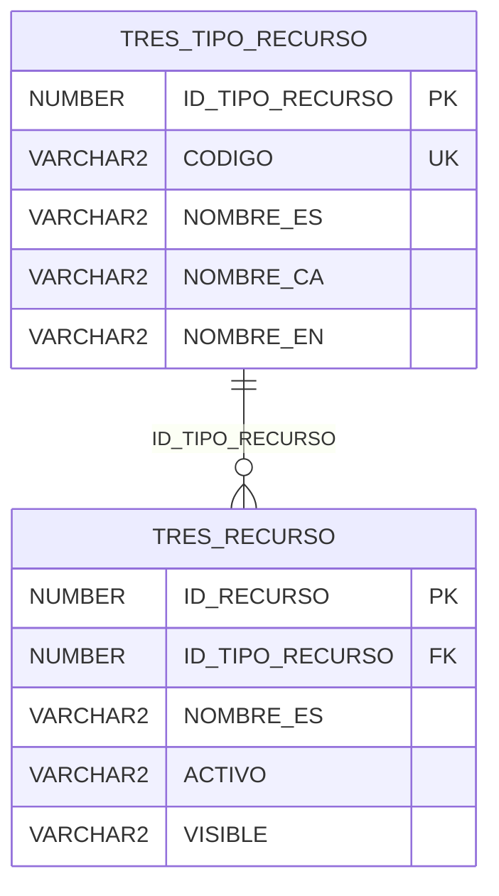
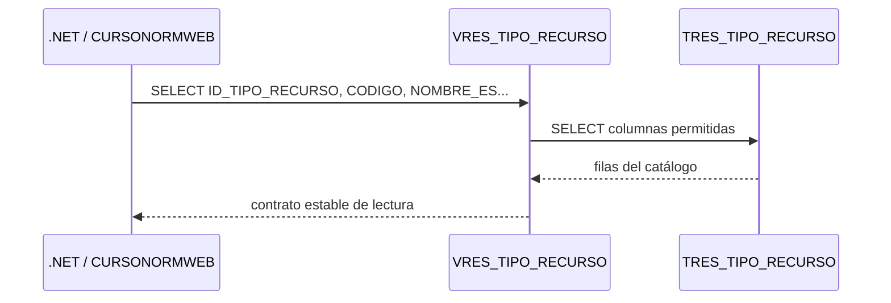
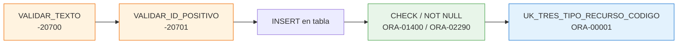

# Sesión 2 — Tablas, vistas y paquetes

::: info CONTEXTO
**Duración:** 1 hora — 30 min teoría + 30 min práctica

Pasamos de entender la arquitectura ADM/WEB a construirla con objetos reales del schema `CURSONORMADM`. En esta sesión usamos `TRES_TIPO_RECURSO`, `VRES_TIPO_RECURSO` y `PKG_RES_TIPO_RECURSO`, que aparecen en la carpeta `SQL` del curso.
:::

## Antes de empezar {#antes-de-empezar}

Esta sesión continúa directamente desde la [Sesión 1 — Fundamentos Oracle](../1-fundamentos-oracle/). Antes de ejecutar scripts, confirma que tienes claro el punto de partida:

- `CURSONORMADM` es el propietario de tablas, vistas y packages.
- `CURSONORMWEB` es el usuario que representa a la aplicación.
- WEB no debe consultar tablas directamente.
- Las lecturas salen por vistas y las escrituras por packages.
- Reconoces las **seis variantes de `CHECK`** que vimos en la sesión 1.
- Distingues los códigos `-20xxx` (lanzados por el package con `RAISE_APPLICATION_ERROR`) de los `ORA-xxxxx` (lanzados por Oracle al violar constraints).

::: tip CONTINUIDAD
Si no has completado el [ejercicio de la sesión 1](../2-ejercicio-fundamentos/) ni el checklist de continuidad, vuelve primero allí. En esta sesión trabajamos con dos conexiones (`CURSONORMADM` y `CURSONORMWEB`) que deben estar listas.
:::

## Objetivos

Al terminar esta sesión serás capaz de:

- Leer el DDL real de una tabla Oracle exportada y distinguir columnas, PK, UK y CHECKs.
- Crear una vista `VRES_` como contrato de lectura para el usuario WEB, con o sin `JOIN`.
- Escribir un package CRUD con `CREAR`, `OBTENER_TODOS`, `OBTENER_POR_ID`, `ACTUALIZAR` y `ELIMINAR`.
- Centralizar las validaciones en procedimientos privados (`VALIDAR_TEXTO`, `VALIDAR_ID_POSITIVO`).
- Aplicar el modelo de errores `-20700/-20701/-20702/-20703` de forma coherente.
- Verificar objetos compilados y grants antes de conectar la capa .NET.

## La entidad de ejemplo: `TRES_TIPO_RECURSO` {#entidad-ejemplo}

`TRES_TIPO_RECURSO` clasifica los recursos reservables de ReserUA. Es un catálogo sencillo: no tiene columnas de estado ni borrado lógico. Su objetivo es que otros objetos, como `TRES_RECURSO`, puedan indicar de qué tipo es cada recurso.

La relación relevante del schema real es:



<!-- diagram id="er-tres-tipo-recurso" caption: "TRES_TIPO_RECURSO clasifica los recursos reservables" -->

::: warning IMPORTANTE
En este material manda el schema real. Si una guía genérica habla de `ACTIVO`, borrado lógico o `ACTUALIZAR_ACTIVO`, solo aplica a entidades que tengan esa columna. `TRES_TIPO_RECURSO` no la tiene; `TRES_RECURSO` sí.
:::

## Paso 1 — Tabla `TRES_TIPO_RECURSO` {#tabla}

El DDL exportado define una tabla de catálogo con cinco columnas:

| Columna           | Tipo              | Papel                  |
| ----------------- | ----------------- | ---------------------- |
| `ID_TIPO_RECURSO` | `NUMBER IDENTITY` | Clave primaria técnica |
| `CODIGO`          | `VARCHAR2(100)`   | Código funcional único |
| `NOMBRE_ES`       | `VARCHAR2(150)`   | Nombre en castellano   |
| `NOMBRE_CA`       | `VARCHAR2(150)`   | Nombre en valenciano   |
| `NOMBRE_EN`       | `VARCHAR2(150)`   | Nombre en inglés       |

```sql
CREATE TABLE CURSONORMADM.TRES_TIPO_RECURSO
(
    ID_TIPO_RECURSO NUMBER GENERATED BY DEFAULT ON NULL AS IDENTITY
        CONSTRAINT SYS_CK_TTR_ID_NN NOT NULL,
    CODIGO VARCHAR2(100)
        CONSTRAINT SYS_CK_TTR_CODIGO_NN NOT NULL,
    NOMBRE_ES VARCHAR2(150)
        CONSTRAINT SYS_CK_TTR_NOMBRE_ES_NN NOT NULL,
    NOMBRE_CA VARCHAR2(150)
        CONSTRAINT SYS_CK_TTR_NOMBRE_CA_NN NOT NULL,
    NOMBRE_EN VARCHAR2(150)
        CONSTRAINT SYS_CK_TTR_NOMBRE_EN_NN NOT NULL,

    CONSTRAINT PK_TRES_TIPO_RECURSO
        PRIMARY KEY (ID_TIPO_RECURSO),
    CONSTRAINT UK_TRES_TIPO_RECURSO_CODIGO
        UNIQUE (CODIGO)
);
```

### Qué decisiones enseña esta tabla

| Elemento                 | Lectura técnica                                                                                                                          |
| ------------------------ | ---------------------------------------------------------------------------------------------------------------------------------------- |
| `IDENTITY`               | Oracle genera el ID. No hace falta crear secuencia ni trigger nuevos.                                                                    |
| `CODIGO` con `UK`        | La unicidad funcional se protege en base de datos.                                                                                       |
| Tres columnas `NOMBRE_*` | El catálogo está preparado para interfaz multidioma.                                                                                     |
| Checks `SYS_CK_TTR_*_NN` | En el export real se usan checks nombrados para representar `NOT NULL`. Es una de las **seis variantes de CHECK** vistas en la sesión 1. |
| Sin `ACTIVO`             | No hay borrado lógico en este catálogo; `ELIMINAR` borra físicamente si no hay recursos asociados.                                       |

::: tip BUENA PRÁCTICA
En proyectos nuevos preferimos nombres semánticos para constraints, pero aquí respetamos el export porque es la fotografía del schema real del curso.
:::

## Paso 2 — Vista `VRES_TIPO_RECURSO` {#vista}

La vista es el contrato de lectura para la aplicación. En este caso no filtra por estado porque la tabla no tiene columna `ACTIVO`.

```sql
CREATE OR REPLACE FORCE VIEW CURSONORMADM.VRES_TIPO_RECURSO
(
    ID_TIPO_RECURSO,
    CODIGO,
    NOMBRE_ES,
    NOMBRE_CA,
    NOMBRE_EN
)
AS
SELECT
    ID_TIPO_RECURSO,
    CODIGO,
    NOMBRE_ES,
    NOMBRE_CA,
    NOMBRE_EN
  FROM CURSONORMADM.TRES_TIPO_RECURSO;

GRANT SELECT ON CURSONORMADM.VRES_TIPO_RECURSO TO CURSONORMWEB;
```

::: warning IMPORTANTE
La vista no usa `SELECT *`. Aunque ahora exponga todas las columnas, se listan una a una para que cualquier cambio futuro en la tabla sea una decisión explícita.
:::

### Por qué WEB lee la vista



<!-- diagram id="flujo-vista-tipo-recurso" caption: "CURSONORMWEB lee tipos de recurso a través de la vista" -->

### Borrado lógico vs borrado físico {#borrado-logico}

`TRES_TIPO_RECURSO` no tiene columna `ACTIVO`, así que la vista expone todas las filas y `ELIMINAR` hace `DELETE` físico (protegido contra borrado de catálogos en uso).

En entidades que sí tienen `ACTIVO` (como `TRES_RECURSO`), el patrón cambia:

| Aspecto                           | `TRES_TIPO_RECURSO` (catálogo)          | `TRES_RECURSO` (entidad con estado)                                        |
| --------------------------------- | --------------------------------------- | -------------------------------------------------------------------------- |
| Columna `ACTIVO`                  | No existe                               | `VARCHAR2(1) DEFAULT 'S' NOT NULL`                                         |
| Vista filtra por `ACTIVO`         | No hace falta                           | Puede filtrar `WHERE ACTIVO = 'S'` (o exponerlo y dejar que la app filtre) |
| Procedimiento `ELIMINAR`          | Borrado físico con protección funcional | Cambio de `ACTIVO` a `'N'` (borrado lógico)                                |
| Procedimiento de cambio de estado | No aplica                               | `ACTUALIZAR_FLAGS(P_ID, P_ACTIVO, P_VISIBLE, ...)`                         |

::: tip BUENA PRÁCTICA
Para entidades con estado, **un único procedimiento** `ACTUALIZAR_FLAGS` con un parámetro por flag es preferible a tener `ACTIVAR`/`DESACTIVAR`/`HACER_VISIBLE`/`OCULTAR`. Menos superficie de API, más coherencia.
:::

## Paso 3 — Package `PKG_RES_TIPO_RECURSO` {#package}

El package es la superficie de escritura. El usuario WEB no necesita permisos directos sobre la tabla: ejecuta procedimientos del package.

### Estructura del package: SPEC y BODY

Un package Oracle se divide en dos partes:

- La **especificación** (`PACKAGE`) declara qué procedimientos y tipos son **públicos**.
- El **cuerpo** (`PACKAGE BODY`) implementa esos procedimientos y, además, contiene helpers privados (validaciones, lookups, etc.) que la aplicación no necesita ver.

```sql
-- SPEC: contrato público del package. Solo lo declarado aquí es visible desde fuera.
CREATE OR REPLACE PACKAGE CURSONORMADM.PKG_RES_TIPO_RECURSO AS

  -- Tipo cursor genérico que devolveremos en las lecturas.
  -- REF CURSOR permite que la app .NET itere las filas como un IDataReader.
  TYPE T_CURSOR IS REF CURSOR;

  -- Alta de un nuevo tipo de recurso. Devuelve por OUT el ID generado por IDENTITY.
  PROCEDURE CREAR(
    P_CODIGO          IN  CURSONORMADM.TRES_TIPO_RECURSO.CODIGO%TYPE,    -- código funcional único
    P_NOMBRE_ES       IN  CURSONORMADM.TRES_TIPO_RECURSO.NOMBRE_ES%TYPE,
    P_NOMBRE_CA       IN  CURSONORMADM.TRES_TIPO_RECURSO.NOMBRE_CA%TYPE,
    P_NOMBRE_EN       IN  CURSONORMADM.TRES_TIPO_RECURSO.NOMBRE_EN%TYPE,
    P_ID_TIPO_RECURSO OUT CURSONORMADM.TRES_TIPO_RECURSO.ID_TIPO_RECURSO%TYPE  -- salida con el nuevo ID
  );

  -- Listado completo. Devuelve un cursor que la app abre y recorre.
  PROCEDURE OBTENER_TODOS(P_CURSOR OUT T_CURSOR);

  -- Lectura por ID. Devuelve un cursor con 0 o 1 filas.
  PROCEDURE OBTENER_POR_ID(
    P_ID_TIPO_RECURSO IN CURSONORMADM.TRES_TIPO_RECURSO.ID_TIPO_RECURSO%TYPE,
    P_CURSOR          OUT T_CURSOR
  );

  -- Modificación de un tipo existente identificado por su PK.
  PROCEDURE ACTUALIZAR(
    P_ID_TIPO_RECURSO IN CURSONORMADM.TRES_TIPO_RECURSO.ID_TIPO_RECURSO%TYPE, -- qué fila se actualiza
    P_CODIGO          IN CURSONORMADM.TRES_TIPO_RECURSO.CODIGO%TYPE,
    P_NOMBRE_ES       IN CURSONORMADM.TRES_TIPO_RECURSO.NOMBRE_ES%TYPE,
    P_NOMBRE_CA       IN CURSONORMADM.TRES_TIPO_RECURSO.NOMBRE_CA%TYPE,
    P_NOMBRE_EN       IN CURSONORMADM.TRES_TIPO_RECURSO.NOMBRE_EN%TYPE
  );

  -- Borrado físico, protegido contra borrar tipos referenciados desde TRES_RECURSO.
  PROCEDURE ELIMINAR(
    P_ID_TIPO_RECURSO IN CURSONORMADM.TRES_TIPO_RECURSO.ID_TIPO_RECURSO%TYPE
  );
END PKG_RES_TIPO_RECURSO;
/

-- El usuario WEB solo puede ejecutar el package; nunca tocar la tabla directamente.
GRANT EXECUTE ON CURSONORMADM.PKG_RES_TIPO_RECURSO TO CURSONORMWEB;
```

::: tip BUENA PRÁCTICA
Usa siempre `tabla.columna%TYPE` para los parámetros. Si mañana cambias `CODIGO` de `VARCHAR2(100)` a `VARCHAR2(150)`, el package se recompila sin tener que tocar las firmas.
:::

### Validaciones privadas reutilizables {#validaciones-privadas}

El body centraliza dos validaciones que se reutilizan en `CREAR`, `ACTUALIZAR`, `OBTENER_POR_ID` y `ELIMINAR`:

```sql
-- Validación reutilizable: el texto no puede ser NULL ni cadena vacía/blancos.
-- P_NOMBRE_CAMPO se usa para componer un mensaje de error legible por el usuario.
PROCEDURE VALIDAR_TEXTO(
  P_NOMBRE_CAMPO IN VARCHAR2,   -- nombre del campo (p. ej. 'CODIGO') que aparece en el error
  P_VALOR        IN VARCHAR2    -- valor que se quiere validar
) AS
BEGIN
  -- TRIM(' ') devuelve NULL en Oracle, así que el OR captura tanto NULL como cadenas en blanco.
  IF P_VALOR IS NULL OR TRIM(P_VALOR) IS NULL THEN
    -- -20700 es nuestro código convencional para "campo obligatorio vacío".
    RAISE_APPLICATION_ERROR(-20700, P_NOMBRE_CAMPO || ' es obligatorio.');
  END IF;
END VALIDAR_TEXTO;

-- Validación reutilizable: el ID debe estar informado y ser estrictamente positivo.
PROCEDURE VALIDAR_ID_POSITIVO(
  P_NOMBRE_CAMPO IN VARCHAR2,   -- nombre del ID que estamos validando (para el mensaje)
  P_VALOR        IN NUMBER      -- valor numérico a comprobar
) AS
BEGIN
  -- Rechazamos NULL, 0 y negativos: un ID válido siempre es > 0.
  IF P_VALOR IS NULL OR P_VALOR <= 0 THEN
    -- -20701 es nuestro código convencional para "ID no positivo".
    RAISE_APPLICATION_ERROR(-20701, P_NOMBRE_CAMPO || ' debe ser mayor que 0.');
  END IF;
END VALIDAR_ID_POSITIVO;
```

::: tip BUENA PRÁCTICA
`VALIDAR_TEXTO` recibe el nombre del campo. Así el mismo procedimiento sirve para `CODIGO`, `NOMBRE_ES`, `NOMBRE_CA` y `NOMBRE_EN`, y los mensajes de error siguen siendo claros.
:::

### `CREAR`: validar, insertar y devolver el ID {#crear}

```sql
-- Implementación de CREAR en el BODY del package.
PROCEDURE CREAR(
  P_CODIGO          IN  CURSONORMADM.TRES_TIPO_RECURSO.CODIGO%TYPE,
  P_NOMBRE_ES       IN  CURSONORMADM.TRES_TIPO_RECURSO.NOMBRE_ES%TYPE,
  P_NOMBRE_CA       IN  CURSONORMADM.TRES_TIPO_RECURSO.NOMBRE_CA%TYPE,
  P_NOMBRE_EN       IN  CURSONORMADM.TRES_TIPO_RECURSO.NOMBRE_EN%TYPE,
  P_ID_TIPO_RECURSO OUT CURSONORMADM.TRES_TIPO_RECURSO.ID_TIPO_RECURSO%TYPE
) AS
BEGIN
  -- 1) Validamos cada campo obligatorio antes de tocar la tabla.
  --    Si alguno falla, VALIDAR_TEXTO lanza -20700 y el INSERT no llega a ejecutarse.
  VALIDAR_TEXTO('CODIGO',    P_CODIGO);
  VALIDAR_TEXTO('NOMBRE_ES', P_NOMBRE_ES);
  VALIDAR_TEXTO('NOMBRE_CA', P_NOMBRE_CA);
  VALIDAR_TEXTO('NOMBRE_EN', P_NOMBRE_EN);

  -- 2) Inserción real. Aplicamos TRIM() para no guardar espacios al principio/final.
  INSERT INTO CURSONORMADM.TRES_TIPO_RECURSO (
    CODIGO, NOMBRE_ES, NOMBRE_CA, NOMBRE_EN
  ) VALUES (
    TRIM(P_CODIGO),
    TRIM(P_NOMBRE_ES),
    TRIM(P_NOMBRE_CA),
    TRIM(P_NOMBRE_EN)
  )
  -- 3) RETURNING captura el ID que IDENTITY acaba de generar y lo deja en el OUT.
  --    La aplicación .NET lo recoge sin necesitar una segunda consulta.
  RETURNING ID_TIPO_RECURSO INTO P_ID_TIPO_RECURSO;
END CREAR;
```

Puntos importantes:

- El package valida **antes** del `INSERT`.
- Los textos se guardan con `TRIM()`.
- `RETURNING ... INTO` devuelve el ID generado por `IDENTITY`.
- La constraint `UK_TRES_TIPO_RECURSO_CODIGO` sigue siendo la última defensa ante códigos duplicados.

### Lectura: `OBTENER_TODOS` y `OBTENER_POR_ID` {#lectura}

Los procedimientos de lectura no consultan la tabla directamente: usan `VRES_TIPO_RECURSO`.

```sql
-- Lectura de todos los tipos. Devuelve un cursor abierto para que la app itere.
PROCEDURE OBTENER_TODOS(P_CURSOR OUT T_CURSOR) AS
BEGIN
  -- OPEN ... FOR asocia el cursor de salida a la consulta. La consulta NO se ejecuta
  -- aquí: se ejecuta cuando la aplicación empieza a leer del cursor.
  OPEN P_CURSOR FOR
    SELECT ID_TIPO_RECURSO, CODIGO, NOMBRE_ES, NOMBRE_CA, NOMBRE_EN
      FROM CURSONORMADM.VRES_TIPO_RECURSO    -- siempre leemos por la vista, nunca por la tabla
     ORDER BY ID_TIPO_RECURSO;
END OBTENER_TODOS;

-- Lectura de un único tipo a partir de su PK.
PROCEDURE OBTENER_POR_ID(
  P_ID_TIPO_RECURSO IN CURSONORMADM.TRES_TIPO_RECURSO.ID_TIPO_RECURSO%TYPE,
  P_CURSOR          OUT T_CURSOR
) AS
BEGIN
  -- Validamos el ID antes de abrir el cursor: si llega NULL o <= 0, no hay nada que buscar.
  VALIDAR_ID_POSITIVO('ID_TIPO_RECURSO', P_ID_TIPO_RECURSO);

  -- Cursor con 0 o 1 filas. La app distingue "no encontrado" cuando lee y no hay registros.
  OPEN P_CURSOR FOR
    SELECT ID_TIPO_RECURSO, CODIGO, NOMBRE_ES, NOMBRE_CA, NOMBRE_EN
      FROM CURSONORMADM.VRES_TIPO_RECURSO
     WHERE ID_TIPO_RECURSO = P_ID_TIPO_RECURSO;
END OBTENER_POR_ID;
```

::: tip BUENA PRÁCTICA
Aunque el package podría leer directamente de la tabla, **siempre** consulta la vista. Si mañana la vista añade columnas calculadas o filtros, el package los aprovecha automáticamente.
:::

### Por qué un procedimiento con cursor en lugar de leer la vista directamente {#por-que-cursor}

Si la lectura ya está expuesta en `VRES_TIPO_RECURSO` y el usuario WEB tiene `GRANT SELECT` sobre ella, **podríamos** leerla directamente desde .NET sin pasar por el procedimiento `OBTENER_TODOS`. De hecho, esa es la opción que usamos en muchos servicios. ¿Por qué entonces existe el procedimiento con `OUT T_CURSOR`?

#### Las dos opciones, una al lado de la otra

::: code-group

```csharp [Opción A — SELECT directo sobre la vista]
// El servicio escribe el SELECT en C# y lo lanza contra la vista.
// ClaseOracleBd lo ejecuta y mapea cada fila a ClaseTipoRecurso.
public async Task<List<ClaseTipoRecurso>> ObtenerTodosAsync()
{
    var sql = @"
        SELECT ID_TIPO_RECURSO, CODIGO, NOMBRE_ES, NOMBRE_CA, NOMBRE_EN
          FROM CURSONORMADM.VRES_TIPO_RECURSO
         ORDER BY NOMBRE_ES";

    var filas = await _oracle.ObtenerTodosMapAsync<ClaseTipoRecurso>(sql, param: null);
    return filas?.ToList() ?? new List<ClaseTipoRecurso>();
}
```

```csharp [Opción B — Llamada al procedimiento del package]
// El servicio invoca PKG_RES_TIPO_RECURSO.OBTENER_TODOS y recibe un cursor.
// ClaseOracleBd recorre el cursor y mapea cada fila a ClaseTipoRecurso.
public async Task<List<ClaseTipoRecurso>> ObtenerTodosAsync()
{
    var parametros = new DynamicParameters();
    parametros.Add("P_CURSOR", null, OracleDbType.RefCursor,
                   ParameterDirection.Output);

    var filas = await _oracle.EjecutarCursorMapAsync<ClaseTipoRecurso>(
        "CURSONORMADM.PKG_RES_TIPO_RECURSO.OBTENER_TODOS",
        parametros);

    return filas?.ToList() ?? new List<ClaseTipoRecurso>();
}
```

:::

Ambas devuelven lo mismo. La diferencia está en **dónde vive el SQL** y en **qué se puede cambiar después**.

#### Cuándo conviene cada una

| Necesidad                                                                                                                               | Mejor opción               | Por qué                                                                                              |
| --------------------------------------------------------------------------------------------------------------------------------------- | -------------------------- | ---------------------------------------------------------------------------------------------------- |
| Listado simple (`SELECT cols FROM vista ORDER BY ...`)                                                                                  | **Vista directa**          | El SQL es trivial; meterlo en un package solo añade indirección.                                     |
| Listado con filtros dinámicos (`WHERE` que depende de la app)                                                                           | **Vista directa**          | Es más natural componer el `WHERE` desde el servicio.                                                |
| Listado paginado para `DataTable` server-side                                                                                           | **Vista directa**          | La paginación se construye en runtime; un procedimiento fijo se queda corto.                         |
| Listado con **lógica que debe quedar en la BD** (joins complejos preprocesados, agregados costosos, validación de permisos del usuario) | **Procedimiento + cursor** | Centralizas la lógica una sola vez; cualquier cliente que llame al procedimiento la respeta.         |
| Necesitas que la app **no conozca** las columnas exactas de la vista                                                                    | **Procedimiento + cursor** | El cursor se mapea por nombre: si añades una columna a la vista y al DTO, no tocas el procedimiento. |
| Quieres que **un cambio de vista se propague sin redeploy** del backend                                                                 | **Procedimiento + cursor** | El paquete y la vista viven en la BD; si rehaces el `OBTENER_TODOS`, .NET ni se entera.              |

#### Ventajas concretas del procedimiento con `OUT T_CURSOR`

1. **Encapsulación de la lectura.** Si mañana decides que el listado debe filtrar por permisos del usuario actual, ordenar de otra forma o unir con otra vista, modificas solo `OBTENER_TODOS` en el package. Los servicios .NET ni se tocan.
2. **Coherencia con las escrituras.** Las operaciones `CREAR`, `ACTUALIZAR`, `ELIMINAR` ya son procedimientos del package. Mantener `OBTENER_*` en el mismo package da una superficie de API uniforme: la app solo "habla" con el package, no con vistas sueltas.
3. **Posibilidad de validar antes de leer.** En `OBTENER_POR_ID` vimos `VALIDAR_ID_POSITIVO` antes de abrir el cursor. Con `SELECT` directo, esa validación tendría que repetirse en cada servicio.
4. **Aislamiento del esquema físico.** El cursor expone "filas con estas columnas en este orden", no la vista concreta. Puedes renombrar la vista interna, partirla en dos o cambiar su origen sin tocar el contrato del cursor.

#### Por qué muchas lecturas siguen yendo directamente a la vista

A pesar de las ventajas anteriores, en este curso **muchos servicios .NET leen directamente de las vistas**. Los motivos:

- **Menos código que escribir y mantener.** Una vista bien diseñada y un `SELECT` en el servicio son suficientes para el 80% de los listados.
- **Filtros dinámicos.** Un `DataTable` server-side construye `WHERE`/`ORDER BY` en runtime; un procedimiento PL/SQL con parámetros fijos se queda corto.
- **Coste de mantener dos sitios.** Cada `OBTENER_*` que pasa por package es código PL/SQL adicional que mantener, compilar y desplegar.

::: tip BUENA PRÁCTICA — regla práctica que aplicamos en la UA

- **Escritura → siempre por package** (`CREAR`, `ACTUALIZAR`, `ELIMINAR`, `ACTUALIZAR_ACTIVO`, etc.). Validaciones, errores funcionales y `COMMIT`/`ROLLBACK` viven en PL/SQL.
- **Lectura → empieza por vista directa**. Solo lleva la lectura al package cuando necesitas validación de entrada, lógica que debe ser invariante o quieres aislar a la app de cambios futuros del esquema.
  :::

### `ACTUALIZAR`: comprobar `SQL%ROWCOUNT` {#actualizar}

```sql
-- Modificación de un tipo existente. Falla con -20702 si el ID no existe.
PROCEDURE ACTUALIZAR(
  P_ID_TIPO_RECURSO IN CURSONORMADM.TRES_TIPO_RECURSO.ID_TIPO_RECURSO%TYPE,
  P_CODIGO          IN CURSONORMADM.TRES_TIPO_RECURSO.CODIGO%TYPE,
  P_NOMBRE_ES       IN CURSONORMADM.TRES_TIPO_RECURSO.NOMBRE_ES%TYPE,
  P_NOMBRE_CA       IN CURSONORMADM.TRES_TIPO_RECURSO.NOMBRE_CA%TYPE,
  P_NOMBRE_EN       IN CURSONORMADM.TRES_TIPO_RECURSO.NOMBRE_EN%TYPE
) AS
BEGIN
  -- Validaciones previas: ID positivo y todos los campos obligatorios informados.
  VALIDAR_ID_POSITIVO('ID_TIPO_RECURSO', P_ID_TIPO_RECURSO);
  VALIDAR_TEXTO('CODIGO',    P_CODIGO);
  VALIDAR_TEXTO('NOMBRE_ES', P_NOMBRE_ES);
  VALIDAR_TEXTO('NOMBRE_CA', P_NOMBRE_CA);
  VALIDAR_TEXTO('NOMBRE_EN', P_NOMBRE_EN);

  -- UPDATE filtrado por la PK. Si el ID no existe, el WHERE no matchea ninguna fila
  -- pero Oracle NO lanza error: simplemente afecta a 0 filas.
  UPDATE CURSONORMADM.TRES_TIPO_RECURSO
     SET CODIGO    = TRIM(P_CODIGO),
         NOMBRE_ES = TRIM(P_NOMBRE_ES),
         NOMBRE_CA = TRIM(P_NOMBRE_CA),
         NOMBRE_EN = TRIM(P_NOMBRE_EN)
   WHERE ID_TIPO_RECURSO = P_ID_TIPO_RECURSO;

  -- SQL%ROWCOUNT contiene cuántas filas afectó el último DML implícito.
  -- Si vale 0, el ID no existía: convertimos ese silencio en un error funcional.
  IF SQL%ROWCOUNT = 0 THEN
    RAISE_APPLICATION_ERROR(-20702, 'El tipo de recurso no existe.');
  END IF;
END ACTUALIZAR;
```

Sin la comprobación de `SQL%ROWCOUNT`, una llamada a `ACTUALIZAR` con un ID inexistente parecería correcta: Oracle no devolvería error porque el `WHERE` simplemente no afecta a ninguna fila. El `RAISE_APPLICATION_ERROR(-20702, ...)` convierte ese silencio en un error explícito.

### `ELIMINAR`: borrado físico con protección funcional {#eliminar}

`ELIMINAR` borra físicamente, pero el package comprueba antes si hay recursos asociados:

```sql
-- Borrado físico con dos protecciones funcionales:
-- 1) No borrar si el tipo está siendo usado por algún recurso (-20703).
-- 2) Avisar si el ID no existía (-20702).
PROCEDURE ELIMINAR(
  P_ID_TIPO_RECURSO IN CURSONORMADM.TRES_TIPO_RECURSO.ID_TIPO_RECURSO%TYPE
) AS
  V_TOTAL_RECURSOS NUMBER;   -- variable local para guardar cuántos recursos referencian al tipo
BEGIN
  -- Validamos que el ID llegue informado y sea positivo.
  VALIDAR_ID_POSITIVO('ID_TIPO_RECURSO', P_ID_TIPO_RECURSO);

  -- SELECT INTO carga el resultado del COUNT en la variable PL/SQL V_TOTAL_RECURSOS.
  -- Necesitamos saber si hay recursos asociados ANTES de intentar borrar.
  SELECT COUNT(*)
    INTO V_TOTAL_RECURSOS
    FROM CURSONORMADM.TRES_RECURSO
   WHERE ID_TIPO_RECURSO = P_ID_TIPO_RECURSO;

  -- Si existen recursos del tipo, abortamos con un error funcional claro.
  -- El mensaje permite a la app explicar al usuario por qué no puede borrar.
  IF V_TOTAL_RECURSOS > 0 THEN
    RAISE_APPLICATION_ERROR(-20703, 'El tipo de recurso tiene recursos asociados.');
  END IF;

  -- Borrado físico (no hay flag ACTIVO en este catálogo).
  DELETE FROM CURSONORMADM.TRES_TIPO_RECURSO
   WHERE ID_TIPO_RECURSO = P_ID_TIPO_RECURSO;

  -- Igual que en ACTUALIZAR: si SQL%ROWCOUNT = 0 es que el ID no existía.
  IF SQL%ROWCOUNT = 0 THEN
    RAISE_APPLICATION_ERROR(-20702, 'El tipo de recurso no existe.');
  END IF;
END ELIMINAR;
```

::: info CONTEXTO
La regla "no borrar tipos en uso" no está en una FK con `ON DELETE`; vive en el package porque el mensaje funcional es más claro y porque también queremos protegernos de borrar catálogos referenciados desde otras tablas que podrían añadirse en el futuro.
:::

## Gestión de errores en el package {#gestion-errores}

En la sesión 1 vimos que los errores que llegan a .NET pueden venir del package (`-20xxx`) o de Oracle (`ORA-xxxxx`). Aquí los aplicamos a `PKG_RES_TIPO_RECURSO` para que veas el mapa completo en una entidad real.

### Códigos `-20xxx` definidos en este package {#codigos-package}

| Código   | Procedimiento que lo lanza                                            | Cuándo                                           | Mensaje funcional                              |
| -------- | --------------------------------------------------------------------- | ------------------------------------------------ | ---------------------------------------------- |
| `-20700` | `VALIDAR_TEXTO` (en `CREAR` y `ACTUALIZAR`)                           | El texto llega `NULL` o vacío tras `TRIM()`      | `<CAMPO> es obligatorio.`                      |
| `-20701` | `VALIDAR_ID_POSITIVO` (en `OBTENER_POR_ID`, `ACTUALIZAR`, `ELIMINAR`) | El ID es `NULL` o `<= 0`                         | `<CAMPO> debe ser mayor que 0.`                |
| `-20702` | `ACTUALIZAR`, `ELIMINAR`                                              | `SQL%ROWCOUNT = 0` tras un `UPDATE` o `DELETE`   | `El tipo de recurso no existe.`                |
| `-20703` | `ELIMINAR`                                                            | Hay recursos en `TRES_RECURSO` apuntando al tipo | `El tipo de recurso tiene recursos asociados.` |

::: tip BUENA PRÁCTICA
Reserva un rango concreto de códigos `-20xxx` por package. Aquí usamos `-20700` a `-20703` para `PKG_RES_TIPO_RECURSO`. Otro package del proyecto usaría otro rango (`-20710` a `-2071X`, etc.), evitando colisiones de códigos.
:::

### Errores que puede lanzar Oracle directamente {#ora-errores}

Aunque el package valide bien, Oracle puede saltar si una constraint declarativa se viola:

| Error Oracle | Cuándo aparece en este package                                                             | Constraint involucrada         |
| ------------ | ------------------------------------------------------------------------------------------ | ------------------------------ |
| `ORA-00001`  | `CREAR` con un `CODIGO` que ya existe                                                      | `UK_TRES_TIPO_RECURSO_CODIGO`  |
| `ORA-01400`  | `INSERT` con texto `NULL` (no debería pasar porque `VALIDAR_TEXTO` lo evita)               | `SYS_CK_TTR_*_NN`              |
| `ORA-12899`  | `INSERT` con texto más largo que la columna                                                | Tamaño de la columna           |
| `ORA-02292`  | Si `TRES_RECURSO` tuviera FK con `ON DELETE NO ACTION` y la comprobación funcional fallara | `FK_TRES_RECURSO_TIPO_RECURSO` |

::: warning IMPORTANTE
Los `ORA-xxxxx` no son redundantes con las validaciones del package: son la **última red de seguridad**. Si alguien manipula la base de datos por otra vía o un cambio rompe accidentalmente las validaciones, las constraints siguen protegiendo los datos.
:::

### Capas de defensa en `CREAR` {#capas-crear}

Visualmente, `CREAR` aplica tres capas para proteger una inserción:



<!-- diagram id="capas-crear-tipo-recurso" caption: "Validaciones del package + CHECKs + UK protegen el INSERT" -->

| Capa                 | Quién dispara                           | Mensaje                             | Llega antes que la siguiente |
| -------------------- | --------------------------------------- | ----------------------------------- | ---------------------------- |
| Validación funcional | `VALIDAR_TEXTO` / `VALIDAR_ID_POSITIVO` | Funcional, `-20700` / `-20701`      | Sí, antes del `INSERT`       |
| `CHECK` declarativo  | Oracle al ejecutar el `INSERT`          | Genérico, `ORA-01400` / `ORA-02290` | Sí, antes que la unicidad    |
| `UK`                 | Oracle al confirmar la fila             | Genérico, `ORA-00001`               | Última en saltar             |

::: tip BUENA PRÁCTICA
La capa funcional convierte mensajes técnicos en mensajes accionables para el usuario. Las capas declarativas se mantienen porque garantizan los datos incluso si el package se equivoca.
:::

## Práctica guiada {#practica}

### 1. Verificar la tabla

```sql
DESCRIBE CURSONORMADM.TRES_TIPO_RECURSO;

SELECT constraint_name, constraint_type, status
  FROM all_constraints
 WHERE owner = 'CURSONORMADM'
   AND table_name = 'TRES_TIPO_RECURSO'
 ORDER BY constraint_name;
```

Comprueba que aparecen:

- `PK_TRES_TIPO_RECURSO`
- `UK_TRES_TIPO_RECURSO_CODIGO`
- Checks `SYS_CK_TTR_*`

### 2. Verificar la vista como WEB

Conectado como `CURSONORMWEB`:

```sql
SELECT ID_TIPO_RECURSO, CODIGO, NOMBRE_ES
  FROM CURSONORMADM.VRES_TIPO_RECURSO
 ORDER BY ID_TIPO_RECURSO;
```

La consulta debe funcionar. En cambio, esta debe fallar con `ORA-00942`:

```sql
SELECT *
  FROM CURSONORMADM.TRES_TIPO_RECURSO;
```

### 3. Verificar el package

```sql
SELECT object_name, object_type, status
  FROM all_objects
 WHERE owner = 'CURSONORMADM'
   AND object_name = 'PKG_RES_TIPO_RECURSO'
 ORDER BY object_type;
```

El `PACKAGE` y el `PACKAGE BODY` deben estar en `VALID`.

### 4. Probar lectura

```sql
-- Bloque anónimo (no es un procedimiento del package, es PL/SQL ad-hoc).
DECLARE
  -- Variable local del tipo de cursor declarado en la SPEC del package.
  v_cursor CURSONORMADM.PKG_RES_TIPO_RECURSO.T_CURSOR;
BEGIN
  -- Llamamos al procedimiento; al volver, v_cursor está abierto y apunta a las filas.
  CURSONORMADM.PKG_RES_TIPO_RECURSO.OBTENER_TODOS(v_cursor);
  -- En esta prueba no leemos del cursor: solo comprobamos que el procedimiento
  -- compila y se ejecuta. Cerramos el cursor para liberar recursos.
  CLOSE v_cursor;
END;
/
```

### 5. Probar alta y limpieza

```sql
-- Bloque anónimo: alta + borrado en la misma transacción para no dejar basura.
DECLARE
  -- Variable local con el mismo tipo que la columna ID_TIPO_RECURSO.
  v_id CURSONORMADM.TRES_TIPO_RECURSO.ID_TIPO_RECURSO%TYPE;
BEGIN
  -- 1) Damos de alta un tipo de prueba; el ID generado vuelve por el OUT v_id.
  CURSONORMADM.PKG_RES_TIPO_RECURSO.CREAR(
    P_CODIGO          => 'TEST_CURSO',
    P_NOMBRE_ES       => 'Tipo de prueba',
    P_NOMBRE_CA       => 'Tipus de prova',
    P_NOMBRE_EN       => 'Test type',
    P_ID_TIPO_RECURSO => v_id
  );
  -- DBMS_OUTPUT escribe en la consola SQL para que veas el ID generado.
  -- Requiere SET SERVEROUTPUT ON activado en la sesión del cliente SQL.
  DBMS_OUTPUT.PUT_LINE('ID creado: ' || v_id);

  -- 2) Limpiamos: borramos la fila que acabamos de crear.
  CURSONORMADM.PKG_RES_TIPO_RECURSO.ELIMINAR(v_id);
  -- COMMIT confirma la transacción completa (alta + borrado).
  COMMIT;
END;
/
```

### 6. Forzar cada error `-20xxx`

Provoca cada uno de los cuatro errores funcionales y comprueba que recibes el código exacto:

```sql
-- -20700: campo obligatorio vacío
-- Pasamos NULL en P_CODIGO. VALIDAR_TEXTO lo detecta y lanza el error.
BEGIN
  CURSONORMADM.PKG_RES_TIPO_RECURSO.CREAR(
    P_CODIGO          => NULL,         -- ← este NULL provoca el -20700
    P_NOMBRE_ES       => 'X',
    P_NOMBRE_CA       => 'X',
    P_NOMBRE_EN       => 'X',
    P_ID_TIPO_RECURSO => :v_id         -- :v_id es una bind variable del cliente SQL
  );
END;
/

-- -20701: ID no positivo
-- Llamamos a OBTENER_POR_ID con 0; VALIDAR_ID_POSITIVO lo rechaza.
DECLARE
  v_cur CURSONORMADM.PKG_RES_TIPO_RECURSO.T_CURSOR;
BEGIN
  CURSONORMADM.PKG_RES_TIPO_RECURSO.OBTENER_POR_ID(0, v_cur);  -- 0 no es > 0 → -20701
END;
/

-- -20702: ID inexistente
-- Intentamos borrar un ID que no existe. El DELETE afecta a 0 filas y
-- la comprobación de SQL%ROWCOUNT lanza -20702.
BEGIN
  CURSONORMADM.PKG_RES_TIPO_RECURSO.ELIMINAR(9999999);
END;
/

-- -20703: tipo con recursos asociados (usa un ID que tenga TRES_RECURSO)
-- Sustituye <id_existente_con_recursos> por un ID real del catálogo.
-- ELIMINAR detecta que hay recursos referenciándolo y aborta antes del DELETE.
BEGIN
  CURSONORMADM.PKG_RES_TIPO_RECURSO.ELIMINAR(<id_existente_con_recursos>);
END;
/
```

::: warning IMPORTANTE
Antes de probar `-20703`, comprueba qué tipo tiene recursos:

```sql
SELECT ID_TIPO_RECURSO, COUNT(*) AS recursos
  FROM CURSONORMADM.TRES_RECURSO
 GROUP BY ID_TIPO_RECURSO;
```

:::

## Ejercicio entregable {#ejercicio-entregable}

La práctica de esta página te da una entidad real completa: tabla, vista, package y grants de `TRES_TIPO_RECURSO`.

El trabajo autónomo de esta sesión consiste en aplicar el mismo criterio a un modelo con relaciones y rangos temporales:

- `TRES_RESERVA`
- `TRES_FRANJA_HORARIO`
- `TRES_HORARIO_DIA`

El trabajo autónomo de esta sesión se divide en dos partes complementarias antes de pasar a .NET:

- [Ejercicio 2A — Diseño de vistas](../4-ejercicio-tablas-vistas/): diseñar `VRES_FRANJA_HORARIO` y `VRES_HORARIO_DIA`, decidir alias, JOIN, filtros y compararlas con las vistas reales del schema.
- [Ejercicio 2B — Procedimientos en paquetes](../5-paquetes/): implementar `ACTUALIZAR_BLOQUEADO`, `CREAR_HORARIO_DIA` y `CREAR_RESERVA` con validaciones reutilizables (`VALIDAR_ID_POSITIVO`, `VALIDAR_FLAG`, `VALIDAR_FECHAS`) y detección de solapamiento.

::: warning IMPORTANTE
La referencia de `TRES_TIPO_RECURSO` enseña el patrón, pero no resuelve las decisiones de reservas. En el ejercicio se valorará especialmente que justifiques qué reglas proteges con constraints y cuáles dejas para el package.
:::

## Checklist antes de dar por buena una entidad Oracle {#checklist}

- [ ] La tabla tiene PK nombrada explícitamente con `CONSTRAINT PK_...`.
- [ ] Los campos obligatorios están protegidos por `NOT NULL` o checks equivalentes.
- [ ] Los campos con unicidad funcional tienen `CONSTRAINT UK_...`.
- [ ] Las FK tienen índice de soporte cuando corresponde.
- [ ] La vista no usa `SELECT *`.
- [ ] La vista expone solo las columnas que necesita WEB.
- [ ] El package SPEC declara solo la superficie pública.
- [ ] El package BODY concentra validaciones privadas reutilizables.
- [ ] Los campos de texto se insertan y actualizan con `TRIM()`.
- [ ] `SQL%ROWCOUNT` se comprueba tras `UPDATE` y `DELETE`, devolviendo `-20702` si no afecta a filas.
- [ ] El ID generado por `IDENTITY` se devuelve con `RETURNING ... INTO`.
- [ ] El package documenta qué códigos `-20xxx` usa y qué significa cada uno.
- [ ] `GRANT SELECT` sobre la vista a usuario WEB.
- [ ] `GRANT EXECUTE` sobre el package a usuario WEB.
- [ ] Los scripts están guardados en el repositorio bajo `SQL/`.

## Funciones SQL y PL/SQL que conviene conocer {#funciones-utiles}

El SQL real del schema usa una serie de funciones recurrentes. Reconocerlas te ahorra escribir lógica equivalente en .NET y, en muchos casos, mejora el rendimiento porque la BD las resuelve junto a la propia consulta.

### `NVL` y sus variantes — sustituir `NULL` por un valor por defecto

Oracle no devuelve `''` para una columna vacía: devuelve `NULL`. `NVL` reemplaza `NULL` por el valor que tú elijas, evitando que la app reciba un `null` inesperado.

| Función                                | Qué hace                                                                             |
| -------------------------------------- | ------------------------------------------------------------------------------------ |
| `NVL(col, valor)`                      | Si `col IS NULL`, devuelve `valor`; si no, devuelve `col`. Dos argumentos.           |
| `NVL2(col, si_no_es_null, si_es_null)` | Tres argumentos: dos resultados distintos según `col` sea o no `NULL`.               |
| `COALESCE(c1, c2, ..., cn)`            | Devuelve el primer argumento no `NULL`. Generaliza `NVL` a N valores.                |
| `NULLIF(a, b)`                         | Devuelve `NULL` si `a = b`; si no, devuelve `a`. Útil para "vaciar" valores neutros. |

```sql
-- Ejemplo real: la vista VRES_RECURSO normaliza los flags S/N
-- para que la app NUNCA reciba NULL en ACTIVO o VISIBLE.
SELECT R.ID_RECURSO,
       R.NOMBRE_ES,
       NVL(R.ACTIVO,  'N') AS ACTIVO,    -- si la columna fuera NULL, devolvemos 'N'
       NVL(R.VISIBLE, 'N') AS VISIBLE
  FROM CURSONORMADM.TRES_RECURSO R;

-- COALESCE con varias alternativas: el primero que no sea NULL
SELECT COALESCE(NOMBRE_PREFERIDO, NOMBRE_OFICIAL, 'Sin nombre') AS NOMBRE_FINAL
  FROM TRES_PERSONA;

-- NULLIF: si la observación es '-', tratar como vacío (NULL)
SELECT NULLIF(OBSERVACIONES, '-') AS OBSERVACIONES_LIMPIAS
  FROM TRES_RESERVA;
```

::: tip BUENA PRÁCTICA
Aplica `NVL` en la vista, no en cada `SELECT` del servicio. Si la vista ya devuelve `NVL(BLOQUEADO, 'N')`, todos los servicios reciben datos consistentes y no tienen que repetir la misma normalización.
:::

### Texto: `TRIM`, `UPPER`, `LOWER`, `INITCAP`, `LENGTH`, `INSTR`, `SUBSTR`

| Función                  | Para qué sirve                                       | Ejemplo                                  |
| ------------------------ | ---------------------------------------------------- | ---------------------------------------- |
| `TRIM(s)`                | Quita espacios al principio y al final               | `TRIM('  AULA ')` → `'AULA'`             |
| `UPPER(s)` / `LOWER(s)`  | Cambio de caja                                       | `UPPER('Aula')` → `'AULA'`               |
| `INITCAP(s)`             | Pone mayúscula inicial en cada palabra               | `INITCAP('hola mundo')` → `'Hola Mundo'` |
| `LENGTH(s)`              | Longitud en caracteres                               | `LENGTH('Aula 1')` → `6`                 |
| `INSTR(s, sub)`          | Posición donde aparece `sub` (0 si no está)          | `INSTR('aula1', 'la')` → `3`             |
| `SUBSTR(s, ini, n)`      | Subcadena desde `ini` con `n` caracteres             | `SUBSTR('CURSO2026', 6, 4)` → `'2026'`   |
| `REPLACE(s, a, b)`       | Sustituye `a` por `b` en `s`                         | `REPLACE('A-B-C', '-', '_')` → `'A_B_C'` |
| `REGEXP_LIKE(s, patrón)` | Devuelve `TRUE` si `s` casa con la expresión regular | Visto en `CK_TRES_CONDUCTOR_COLOR`       |

```sql
-- Patrón habitual: insertar siempre con TRIM y UPPER en códigos para evitar duplicados
INSERT INTO CURSONORMADM.TRES_TIPO_RECURSO (CODIGO, NOMBRE_ES, ...)
VALUES (UPPER(TRIM(P_CODIGO)), TRIM(P_NOMBRE_ES), ...);
```

### Fechas: `SYSDATE`, `TRUNC`, `ADD_MONTHS`, `MONTHS_BETWEEN`, `EXTRACT`, `TO_DATE`, `TO_CHAR`

| Función                  | Para qué sirve                             | Ejemplo                                  |
| ------------------------ | ------------------------------------------ | ---------------------------------------- |
| `SYSDATE`                | Fecha y hora actual del servidor           | `SYSDATE` → `2026-05-03 14:25:10`        |
| `TRUNC(d)`               | Quita la parte horaria, dejando `00:00:00` | `TRUNC(SYSDATE)` → `2026-05-03 00:00:00` |
| `TRUNC(d, 'MM')`         | Trunca al primer día del mes               | `TRUNC(SYSDATE, 'MM')` → `2026-05-01`    |
| `ADD_MONTHS(d, n)`       | Suma `n` meses a la fecha                  | `ADD_MONTHS(SYSDATE, 3)`                 |
| `MONTHS_BETWEEN(d1, d2)` | Diferencia en meses (puede ser fraccional) | `MONTHS_BETWEEN(d1, d2)`                 |
| `EXTRACT(YEAR FROM d)`   | Extrae año, mes, día, hora…                | `EXTRACT(YEAR FROM SYSDATE)` → `2026`    |
| `TO_DATE(s, fmt)`        | Convierte texto a fecha                    | `TO_DATE('03/05/2026', 'DD/MM/YYYY')`    |
| `TO_CHAR(d, fmt)`        | Convierte fecha a texto                    | `TO_CHAR(SYSDATE, 'DD/MM/YYYY HH24:MI')` |

```sql
-- Comparar reservas por día ignorando la hora exacta:
WHERE TRUNC(FECHA_RESERVA) = TRUNC(P_FECHA_RESERVA)

-- Caducar tokens que tengan más de 30 días:
DELETE FROM TRES_TOKEN
 WHERE FECHA_CREACION < SYSDATE - 30;   -- restar días directamente a una DATE

-- Filtrar reservas del año en curso:
WHERE EXTRACT(YEAR FROM FECHA_RESERVA) = EXTRACT(YEAR FROM SYSDATE)
```

### Lógica condicional dentro de un `SELECT`: `CASE` y `DECODE`

Permiten devolver un valor distinto según una condición sin necesidad de PL/SQL.

```sql
-- CASE estilo SQL estándar (recomendado)
SELECT ID_RESERVA,
       CASE
         WHEN FECHA_CONFIRMACION IS NOT NULL THEN 'Confirmada'
         WHEN FECHA_RESERVA < SYSDATE        THEN 'Caducada'
         ELSE 'Pendiente'
       END AS ESTADO
  FROM CURSONORMADM.TRES_RESERVA;

-- DECODE: forma compacta y propia de Oracle (legible para casos simples)
SELECT ID_RECURSO,
       DECODE(ACTIVO, 'S', 'Activo', 'N', 'Inactivo', 'Desconocido') AS ESTADO
  FROM CURSONORMADM.TRES_RECURSO;
```

::: tip BUENA PRÁCTICA
Prefiere `CASE` sobre `DECODE` en consultas nuevas: es más legible y portable a otros motores. `DECODE` lo verás en código heredado y conviene reconocerlo, pero no abuses al escribir nuevo.
:::

### Funciones de agregación: `COUNT`, `SUM`, `AVG`, `MIN`, `MAX`, `LISTAGG`

```sql
-- LISTAGG concatena valores de un grupo separados por una cadena
SELECT ID_TIPO_RECURSO,
       LISTAGG(NOMBRE_ES, ', ') WITHIN GROUP (ORDER BY NOMBRE_ES) AS RECURSOS
  FROM CURSONORMADM.TRES_RECURSO
 GROUP BY ID_TIPO_RECURSO;
```

### Atributos PL/SQL: `%TYPE`, `%ROWTYPE`, `SQL%ROWCOUNT`, `SQL%FOUND`, `SQL%NOTFOUND`

Estos no son funciones SQL, son atributos del lenguaje PL/SQL. Imprescindibles para escribir código robusto:

| Atributo             | Qué representa                    | Cuándo usarlo                                                                    |
| -------------------- | --------------------------------- | -------------------------------------------------------------------------------- |
| `tabla.columna%TYPE` | El mismo tipo que esa columna     | Declarar parámetros y variables que sigan el tipo de la columna automáticamente. |
| `tabla%ROWTYPE`      | Una "fila" completa de la tabla   | Variables que recogen una fila de un `SELECT INTO`.                              |
| `SQL%ROWCOUNT`       | Filas afectadas por el último DML | Detectar `UPDATE`/`DELETE` que no afectaron a nada.                              |
| `SQL%FOUND`          | `TRUE` si afectó a alguna fila    | Equivalente a `SQL%ROWCOUNT > 0`.                                                |
| `SQL%NOTFOUND`       | `TRUE` si no afectó a ninguna     | Equivalente a `SQL%ROWCOUNT = 0`.                                                |

```sql
DECLARE
  -- Variable que adopta automáticamente el tipo de la columna NOMBRE_ES.
  -- Si mañana cambia el tamaño de la columna, esta declaración se adapta sola.
  v_nombre CURSONORMADM.TRES_TIPO_RECURSO.NOMBRE_ES%TYPE;

  -- Variable que adopta la estructura completa de una fila de la tabla.
  v_fila   CURSONORMADM.TRES_TIPO_RECURSO%ROWTYPE;
BEGIN
  -- SELECT INTO carga una fila entera en v_fila (sus campos son v_fila.CODIGO, etc.)
  SELECT *
    INTO v_fila
    FROM CURSONORMADM.TRES_TIPO_RECURSO
   WHERE ID_TIPO_RECURSO = 1;

  v_nombre := v_fila.NOMBRE_ES;
END;
/
```

### Manejo de excepciones: `EXCEPTION WHEN ... THEN`

Estructura básica para capturar errores en PL/SQL:

```sql
BEGIN
  INSERT INTO CURSONORMADM.TRES_TIPO_RECURSO (CODIGO, NOMBRE_ES, ...) VALUES (...);
EXCEPTION
  -- Excepción nombrada: predefinida por Oracle (DUP_VAL_ON_INDEX = ORA-00001).
  WHEN DUP_VAL_ON_INDEX THEN
    -- Convertimos el error genérico en uno funcional con mensaje claro.
    RAISE_APPLICATION_ERROR(-20704, 'El código ya existe.');
  -- WHEN OTHERS captura cualquier otra excepción no esperada.
  WHEN OTHERS THEN
    ROLLBACK;
    RAISE;   -- relanzar para que el cliente vea el error original
END;
```

| Excepción predefinida | Código Oracle | Cuándo se dispara                        |
| --------------------- | ------------- | ---------------------------------------- |
| `NO_DATA_FOUND`       | `ORA-01403`   | `SELECT INTO` no devuelve filas          |
| `TOO_MANY_ROWS`       | `ORA-01422`   | `SELECT INTO` devuelve más de una        |
| `DUP_VAL_ON_INDEX`    | `ORA-00001`   | Violación de UNIQUE/PK                   |
| `VALUE_ERROR`         | `ORA-06502`   | Conversión de tipo o tamaño insuficiente |
| `INVALID_CURSOR`      | `ORA-01001`   | Operar sobre un cursor no abierto        |

::: tip BUENA PRÁCTICA
Captura excepciones específicas (`DUP_VAL_ON_INDEX`, `NO_DATA_FOUND`) cuando puedas convertirlas en mensajes funcionales. Reserva `WHEN OTHERS` para hacer `ROLLBACK` y luego `RAISE` (relanzar) — nunca para "tragarte" errores en silencio.
:::

## Resumen y conexión con .NET {#resumen}

Hemos revisado el ciclo real de `TRES_TIPO_RECURSO`:

```text
CREATE TABLE -> CREATE VIEW -> CREATE PACKAGE -> GRANTS -> consumo desde .NET
```

Y el modelo de errores que aplicamos en cada package:

```text
VALIDAR_TEXTO (-20700)  ->  VALIDAR_ID_POSITIVO (-20701)
                        ->  SQL%ROWCOUNT (-20702)
                        ->  Reglas funcionales (-20703)
                        ->  Constraints declarativas (ORA-xxxxx)
```

Antes de pasar a .NET, completa los dos ejercicios entregables ([2A — vistas](../4-ejercicio-tablas-vistas/) y [2B — paquetes](../5-paquetes/)) para practicar tanto el contrato de lectura como la escritura PL/SQL. En la parte .NET veremos cómo conectar `PKG_RES_TIPO_RECURSO` desde `ClaseOracleBD3`, escribir DTOs como `ClaseTipoRecurso` y exponer el CRUD como API REST.

## Para profundizar {#profundizar}

::: details Diferencia entre catálogo simple y entidad con estado

`TRES_TIPO_RECURSO` no tiene `ACTIVO`, por tanto:

- La vista no filtra borrado lógico.
- El package no tiene `ACTUALIZAR_ACTIVO`.
- `ELIMINAR` hace borrado físico, protegido por la comprobación de recursos asociados.

Otras entidades del schema, como `TRES_RECURSO` o `TRES_FRANJA_HORARIO`, sí tienen flags `S/N`. En esas entidades hablamos de borrado lógico, cambio de estado o filtros por visibilidad. Volverás a ello cuando diseñes el package del ejercicio.
:::

::: details Errores Oracle comunes en esta entidad

| Error                                                               | Causa habitual                 | Cómo resolverlo                                       |
| ------------------------------------------------------------------- | ------------------------------ | ----------------------------------------------------- |
| `ORA-00001: unique constraint UK_TRES_TIPO_RECURSO_CODIGO violated` | El código ya existe            | Usar otro `CODIGO` o actualizar el registro existente |
| `ORA-01400: cannot insert NULL`                                     | Campo obligatorio sin valor    | Validar antes de llamar a `CREAR`                     |
| `ORA-20700`                                                         | Texto obligatorio vacío        | Revisar `CODIGO` y nombres multidioma                 |
| `ORA-20701`                                                         | ID nulo o menor/igual que cero | Revisar parámetro `P_ID_TIPO_RECURSO`                 |
| `ORA-20702`                                                         | ID inexistente                 | Comprobar que el tipo existe                          |
| `ORA-20703`                                                         | Hay recursos asociados         | No eliminar tipos ya usados por `TRES_RECURSO`        |

:::

::: details Orden de despliegue

El orden importa porque los objetos tienen dependencias:

```text
1. Tablas y constraints
2. Vistas
3. Package SPEC
4. Package BODY
5. Grants al usuario WEB
```

Si creas el BODY antes que el SPEC, la compilación falla. Si creas la vista antes que la tabla, la vista queda en estado `INVALID`.
:::

::: details Cómo ver objetos inválidos

```sql
SELECT object_name, object_type, status, last_ddl_time
  FROM all_objects
 WHERE owner = 'CURSONORMADM'
   AND status <> 'VALID'
 ORDER BY object_type, object_name;

ALTER PACKAGE CURSONORMADM.PKG_RES_TIPO_RECURSO COMPILE;
ALTER PACKAGE CURSONORMADM.PKG_RES_TIPO_RECURSO COMPILE BODY;
```

:::
