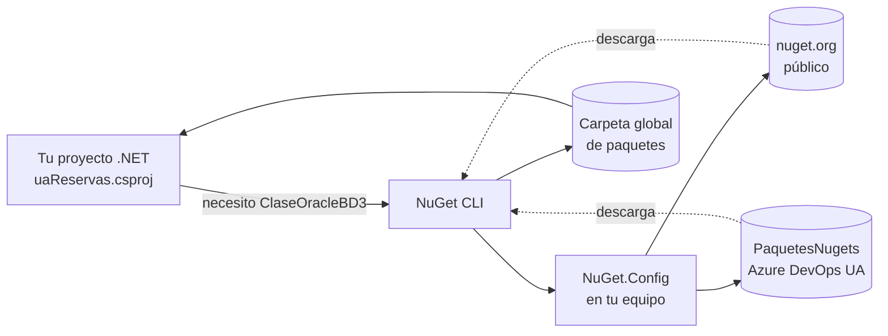
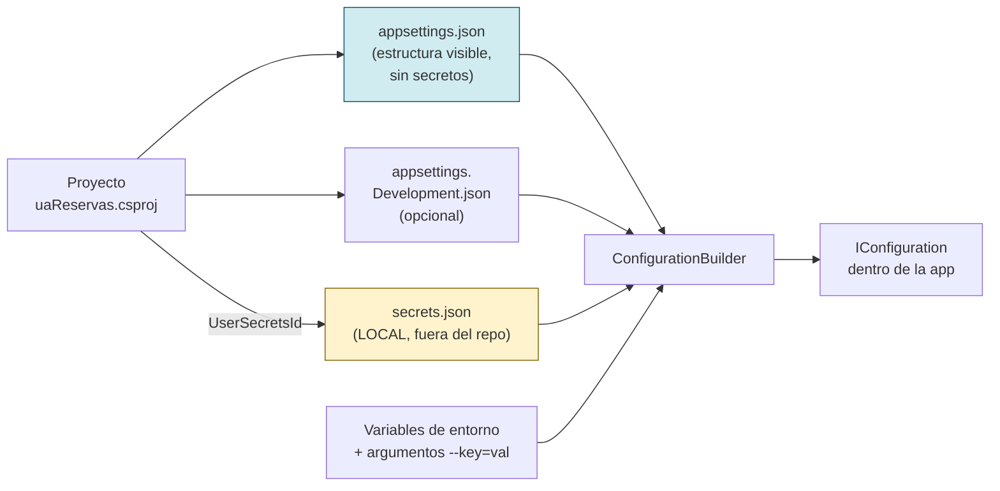

## 0. Pre-requisitos del curso

Antes de programar nada hay que tener el equipo preparado para **descargar paquetes**. La preparación del entorno (Git, SSH, NuGet, npm/pnpm, VS Code, etc.) **está toda recogida en una guía aparte**, que conviene tener delante:

::: tip GUÍA DE INSTALACIÓN
👉 [**Configuración del entorno de desarrollo en Windows** (00-preparacion)](../../../00-preparacion/index.md)

Hay dos sistemas de paquetes y cada uno se configura en su sitio:

| Lado     | Gestor       | Fichero a tocar                                   | Sección                                        |
| -------- | ------------ | ------------------------------------------------- | ---------------------------------------------- |
| **.NET** | NuGet        | `%APPDATA%\NuGet\NuGet.Config`                    | "Configuración de NuGet" en 00-preparacion     |
| **Vue**  | npm / pnpm   | `%USERPROFILE%\.npmrc`                            | "Configuración de npm — registro privado"      |

Recibiréis un correo con el contenido exacto de `NuGet.Config` y las instrucciones para generar el PAT del `.npmrc`. **Asegúrate de tener ambos ficheros funcionando antes de continuar con esta sesión.**
:::



<!-- diagram id="flujo-paquetes" caption: "El proyecto declara dependencias; la herramienta consulta los feeds configurados y descarga." -->

### 0.1 Comandos npm/pnpm útiles para el día a día

Aunque la configuración del registro privado vive en `00-preparacion`, sí merece la pena tener a mano los comandos que vais a usar **todo el curso**, especialmente para vigilar las versiones de los paquetes UA con scope `@vueua`.

```powershell
# Restaurar todo lo declarado en package.json (equivalente a "dotnet restore")
pnpm install

# Comprobar quién soy contra el feed privado (verifica que el PAT funciona)
npm whoami --registry=https://servidortfs.campus.ua.es/tfs/Desarrollo/ComponentesVue/_packaging/ServidorNPM/npm/registry/

# Ver paquetes desactualizados — filtrando SOLO los nuestros (scope @vueua)
pnpm outdated "@vueua/*"

# Listar todas las versiones publicadas de un paquete UA
pnpm view @vueua/plantilla-core versions

# Actualizar todos los @vueua a la última versión compatible
pnpm update "@vueua/*"

# Saber qué versión tengo instalada localmente
pnpm list @vueua/plantilla-core
```

::: tip BUENA PRÁCTICA — el patrón "scope"
Nuestros paquetes propios viven bajo el scope **`@vueua`** (p. ej. `@vueua/plantilla-core`, `@vueua/useaxios`). Eso permite filtrar comandos `npm/pnpm` para que actúen **solo sobre los nuestros** sin tocar `vue`, `axios`, `pinia` u otras dependencias públicas. `pnpm outdated "@vueua/*"` es el comando que vais a ejecutar cada lunes para detectar paquetes UA con nueva versión.
:::

::: warning IMPORTANTE — los feeds privados requieren red campus
Tanto el feed NuGet UA como el feed npm UA están **dentro de la red de la UA**. Si trabajas desde casa sin VPN, los comandos anteriores fallarán con timeouts o `404`.
:::

### 0.2 Inicializar los paquetes NuGet del proyecto

Una vez tienes el `NuGet.Config` global apuntando a los feeds UA (ver `00-preparacion`), el paso siguiente es **decirle a tu proyecto qué paquetes necesita**. Esto se hace **dentro del `.csproj`**: cada NuGet del que dependes aparece como una línea `<PackageReference>`.

#### Dónde se declaran (dentro del `.csproj`)

Este es el bloque real de `uaReservas.csproj` con los paquetes UA del curso:

```xml
<!-- Paquetes de la plantilla UA -->
<ItemGroup>
  <PackageReference Include="PlantillaMVCCore.Configuracion"   Version="1.0.4"   />
  <PackageReference Include="PlantillaMVCCore.Idioma"          Version="1.0.4"   />
  <PackageReference Include="PlantillaMVCCore.Plantilla"       Version="1.1.4"   />
  <PackageReference Include="PlantillaMVCCore.Errores"         Version="1.1.0"   />
  <PackageReference Include="PlantillaMVCCore.Identificacion"  Version="1.0.8.2" />
  <PackageReference Include="PlantillaMVCCore.Seguridad"       Version="1.0.15"  />
  <PackageReference Include="ClaseToken"                       Version="1.0.18.8"/>
</ItemGroup>

<!-- Paquetes UA de uso directo en el código propio -->
<ItemGroup>
  <PackageReference Include="ClaseOracleBD3" Version="1.1.7.5" />
  <PackageReference Include="ClaseCorreo2"   Version="1.0.15.3"/>
</ItemGroup>

<!-- Infraestructura ASP.NET / Scalar / Swashbuckle -->
<ItemGroup>
  <PackageReference Include="Microsoft.AspNetCore.Authentication.JwtBearer" Version="10.0.7" />
  <PackageReference Include="Scalar.AspNetCore"        Version="2.14.11" />
  <PackageReference Include="Swashbuckle.AspNetCore"   Version="10.1.7"  />
  <!-- ... -->
</ItemGroup>
```

#### Cómo añadirlos a un proyecto nuevo

Tienes **tres formas equivalentes**. Usa la que prefieras: todas terminan escribiendo lo mismo en el `.csproj`.

##### 1) CLI con `dotnet add package` (recomendado)

Desde la carpeta del proyecto (donde vive el `.csproj`):

```powershell
# Plantilla UA (los esenciales)
dotnet add package PlantillaMVCCore.Configuracion
dotnet add package PlantillaMVCCore.Idioma
dotnet add package PlantillaMVCCore.Plantilla
dotnet add package PlantillaMVCCore.Errores
dotnet add package PlantillaMVCCore.Identificacion
dotnet add package PlantillaMVCCore.Seguridad
dotnet add package ClaseToken

# Acceso a Oracle y correo
dotnet add package ClaseOracleBD3
dotnet add package ClaseCorreo2

# Para fijar una versión concreta (útil cuando hay breaking changes)
dotnet add package ClaseOracleBD3 --version 1.1.7.5
```

Cada comando consulta los feeds en el orden del `NuGet.Config` y escribe un `<PackageReference>` con la última versión compatible. Al terminar puedes hacer `dotnet restore` (normalmente se ejecuta solo).

##### 2) Visual Studio — "Administrar paquetes NuGet"

1. Clic derecho sobre el proyecto en el Explorador de soluciones → **Administrar paquetes NuGet**.
2. En el desplegable **Origen del paquete** (arriba a la derecha), selecciona **`PaquetesNugets`** (el feed UA en Azure DevOps).
3. Busca el paquete (p. ej. `ClaseOracleBD3`), elige versión y pulsa **Instalar**.
4. VS modifica el `.csproj` por ti y restaura.

::: tip BUENA PRÁCTICA
Si el desplegable de orígenes no muestra los feeds UA, revisa que el `NuGet.Config` global tiene `<activePackageSource>` apuntando a `PaquetesNugets` y reinicia Visual Studio.
:::

##### 3) Editar el `.csproj` a mano

Abrir el `.csproj` y añadir la línea `<PackageReference>` directamente. Luego:

```powershell
dotnet restore
```

Esto es lo que hacen las dos formas anteriores por debajo. Es perfectamente válido y, para ediciones pequeñas, suele ser el camino más rápido.

#### Verificar y actualizar

```powershell
# Lista los paquetes declarados en este proyecto
dotnet list package

# Lista paquetes con nueva versión disponible (incluye transitivos)
dotnet list package --outdated

# Actualiza UN paquete a la última versión compatible
dotnet add package ClaseOracleBD3   # sin --version: última estable

# Quitar un paquete
dotnet remove package ClaseCorreo2
```

::: info CONTEXTO — paquetes "directos" vs "transitivos"
En el `.csproj` declaras solo los paquetes que **tu código** usa directamente. NuGet resuelve sus dependencias (transitivos) automáticamente: por ejemplo, al añadir `PlantillaMVCCore.Plantilla` se bajan también las dependencias internas que esa plantilla necesita. Solo aparecen en el `.csproj` los **directos**; los transitivos se ven con `dotnet list package --include-transitive`.
:::

::: warning IMPORTANTE — fijar versiones en producción
En proyectos serios fijamos versión exacta (`Version="1.1.7.5"`) en lugar de dejar la flotante. Una actualización transitiva inesperada (por ejemplo de la plantilla UA) puede romper un despliegue. **El curso usa versiones fijas a propósito.**
:::

### 0.3 Configuración y secretos: `appsettings.json` + `dotnet user-secrets`

Una aplicación .NET necesita **configuración**: cadenas de conexión a Oracle, claves de API, URLs, contraseñas de servidor de correo... Todo eso se guarda en **`appsettings.json`** (y sus variantes por entorno). Pero hay una regla de oro:

::: danger ZONA PELIGROSA — secretos en git
**Nunca, nunca, nunca pongas contraseñas, tokens, claves privadas o cadenas de conexión completas en `appsettings.json`**. Ese fichero se sube a git. Si lo commiteas con secretos, **estarán para siempre en el historial**, aunque después los borres. La gente externa puede clonar el repo, leer el historial y robarlos.

La solución es **user-secrets**: un fichero JSON paralelo que vive en tu equipo, fuera del proyecto, y que NUNCA se commitea. .NET lo lee automáticamente en modo desarrollo.
:::

#### Cómo funciona en una sola foto



<!-- diagram id="flujo-config-dotnet" caption: "El ConfigurationBuilder fusiona varias fuentes; las secretas viven fuera del repo." -->

**Orden de prioridad** (lo que llega último gana): `appsettings.json` → `appsettings.{Entorno}.json` → **user-secrets** → variables de entorno → argumentos de línea de comandos.

#### Las fuentes de configuración se **fusionan**, no se sustituyen

`WebApplicationBuilder` carga la configuración en cascada. Las claves de niveles posteriores sobrescriben las anteriores; las claves que un nivel no define se mantienen del anterior:

```
appsettings.json
  → appsettings.{Environment}.json     (Development / Staging / Production)
    → User Secrets                     (SOLO en Development, por defecto)
      → Variables de entorno           (Oracle__UserId, Oracle__Password, ...)
        → Argumentos --key=val
```

La consecuencia importante: **puedes partir un objeto entre varias fuentes**. El `DataSource` (no es secreto) vive en `appsettings.json`; el `UserId` / `Password` (sí lo son) viven en user-secrets en desarrollo y en variables de entorno en preproducción/producción. En runtime .NET los devuelve fusionados como si estuviesen en un único objeto `Oracle:*`.

#### Estructura del `appsettings.json` del curso

Este es el `appsettings.json` real de `uaReservas`, ya en su forma definitiva:

```json
{
  "Logging": {
    "LogLevel": { "Default": "Information" }
  },
  "AllowedHosts": "*",
  "App": {
    "Version": "1.0.0",
    "DirApp": "/uareservas",
    "IdApp": "PRU_MVC",
    "NombreApp": "Plantilla UACloud"
  },
  "JwtConfig": {
    "MinutosValidez": "30",
    "UrlBase": "https://www.ua.es",
    "IdApp": "TOKENTP"
  },
  "Authentication": {
    "CAS": {
      "ProtocolVersion": 3,
      "ServerUrlBase": "https://casdesa.cpd.ua.es/cas"
    }
  },
  "ConnectionStrings": {
    "oradb": ""
  },
  "Oracle": {
    "DataSource": "(DESCRIPTION=(ADDRESS=(PROTOCOL=TCP)(HOST=laguar-n1-vip.cpd.ua.es)(PORT=1521))(CONNECT_DATA=(SERVER=DEDICATED)(SERVICE_NAME=ORACTEST.UA.ES)))",
    "ConnectionLifeTime": 240,
    "Pooling": false
  }
}
```

Fíjate en que **no aparecen `UserId` ni `Password`** dentro de `Oracle`. Esos dos valores llegan por user-secrets en desarrollo y por variables de entorno en staging/producción — la sección siguiente lo detalla.

::: tip BUENA PRÁCTICA — qué SÍ va en `appsettings.json` y qué NO
**SÍ va:** estructura, identificadores no sensibles, URLs públicas, `DataSource` Oracle (host, puerto, service name), niveles de log, flags.

**NO va:** `UserId`, `Password`, tokens, claves privadas, cadenas de conexión completas con credenciales embebidas.
:::

::: warning IMPORTANTE — NO pongas comentarios `//` dentro de `appsettings.json`
ASP.NET Core sí tolera comentarios en sus JSON (su lector los salta), pero **Vite los importa con `esbuild`**, que aplica JSON estricto. Si `vite.config.ts` hace `import config from "../appsettings.json"` (es lo que hace la plantilla del curso para leer `App:DirApp`), un `// comentario` en el JSON rompe el dev server con `JSON does not support comments`.

Regla: si necesitas anotar algo del `appsettings.json`, hazlo en el README o en `Program.cs`, **nunca dentro del JSON**.
:::

Fíjate en dos detalles:

- **`ConnectionStrings:oradb` aparece vacío.** `Program.cs` la reconstruye en arranque con `OracleConnectionStringBuilder` a partir de `Oracle:DataSource` + `Oracle:UserId` + `Oracle:Password`. Ese builder escapa por ti los caracteres especiales de la pwd — no hay que envolver nada a mano.
- **La sección `Oracle` no tiene `UserId` ni `Password`**. Esos huecos los rellena user-secrets en dev y variables de entorno en otros entornos.

#### Activar user-secrets en un proyecto

```powershell
# Desde la carpeta del .csproj. Añade <UserSecretsId>GUID-aleatorio</UserSecretsId>.
cd uaReservas
dotnet user-secrets init
```

Tras esto, el `.csproj` tiene:

```xml
<PropertyGroup>
  <UserSecretsId>ccd511a2-a696-4a6e-9187-647ef6b3081c</UserSecretsId>
</PropertyGroup>
```

Ese GUID identifica el fichero de secretos del proyecto. **El csproj sí se commitea**; el GUID solo apunta a un fichero que está **fuera del repo**, en tu equipo:

- **Windows**: `%APPDATA%\Microsoft\UserSecrets\<GUID>\secrets.json`
- **Linux/macOS**: `~/.microsoft/usersecrets/<GUID>/secrets.json`

#### Credenciales de desarrollo en User Secrets

El esquema de aplicación del curso es **`CURSONORMWEB`** sobre ORACTEST. Sus parámetros:

| Campo            | Valor                                                |
| ---------------- | ---------------------------------------------------- |
| Host             | `laguar-n1-vip.cpd.ua.es`                            |
| Puerto           | `1521`                                               |
| Service Name     | `ORACTEST.UA.ES`                                     |
| Usuario          | `CURSONORMWEB`                                       |
| Contraseña       | `8K1wLtuh_30d4sUM662JZ1xVW`                          |

Como `DataSource` ya está en `appsettings.json`, lo único que hay que meter en secrets son las dos credenciales:

```powershell
cd uaReservas

dotnet user-secrets set "Oracle:UserId"   "CURSONORMWEB"
dotnet user-secrets set "Oracle:Password" "8K1wLtuh_30d4sUM662JZ1xVW"

# Verifica
dotnet user-secrets list
```

Salida esperada:

```text
Oracle:Password = 8K1wLtuh_30d4sUM662JZ1xVW
Oracle:UserId = CURSONORMWEB
```

::: info CONTEXTO — los `:` describen rutas anidadas
`"Oracle:UserId"` se traduce a `{ "Oracle": { "UserId": "..." } }`. La configuración de .NET es plana en la API (`IConfiguration["Oracle:UserId"]`) pero estructurada en los proveedores JSON. El `:` une niveles igual que el `.` en notación dotted.
:::

::: tip BUENA PRÁCTICA — el password actual no tiene caracteres especiales
La cuenta `CURSONORMWEB` del curso usa una pwd sin `"`, `'`, `;`, `=`, `\` ni espacios — a propósito. Así no hay que pelearse con el escapado de PowerShell ni con las reglas de envoltura de Oracle. Si en otra app te toca una pwd con esos caracteres, el patrón es: **siempre envuelve en `'...'` (comillas simples)** en PowerShell, y deja que `OracleConnectionStringBuilder` (en `Program.cs`) construya la cadena final.
:::

#### Listar, quitar y limpiar secretos

```powershell
dotnet user-secrets list                       # ver todo
dotnet user-secrets remove "Oracle:Password"   # borrar una clave
dotnet user-secrets clear                      # borrar todo
```

::: info CONTEXTO — desde qué carpeta y `--project`
- **Dentro de `uaReservas/`** (la del `.csproj`): omite `--project`.
- **Desde una carpeta de arriba**: `--project .\uaReservas\uaReservas.csproj`.
- **Error típico** — `The file '...\uaReservas\uaReservas' does not exist`: estabas dentro de `uaReservas/` y has puesto `--project uaReservas` por inercia. Quita el `--project`.
:::

#### Preproducción y producción: variables de entorno

User Secrets **solo está activo en Development** (es lo que hace `WebApplicationBuilder` por defecto: `if (env.IsDevelopment()) builder.Configuration.AddUserSecrets<Program>();`). En cualquier otro entorno hay que inyectar las credenciales como **variables de entorno** con la convención del JsonConfigurationProvider: los `:` se sustituyen por `__` (doble guión bajo, porque shells como bash no admiten `:` en nombres de variables).

```powershell
# En el host (IIS / Windows Service / systemd / pipeline):
$env:Oracle__UserId   = "CURSONORMWEB"
$env:Oracle__Password = "<password DE PREPROD, distinto al de dev>"
```

| Entorno              | Cómo se inyecta `UserId` / `Password`                                            |
| -------------------- | -------------------------------------------------------------------------------- |
| Development          | `dotnet user-secrets set "Oracle:UserId" ...` en tu equipo.                      |
| Staging / Preprod    | Variables de entorno del servidor: `Oracle__UserId`, `Oracle__Password`.         |
| Producción           | Igual que staging, gestionado por infraestructura / pipeline de despliegue.      |

Cada entorno tiene **su propio password**: el `CURSONORMWEB` de desarrollo apunta a ORACTEST; los de preprod/producción apuntan a otras BBDD con credenciales distintas. Nunca se reutilizan.

::: tip BUENA PRÁCTICA — `appsettings.{Environment}.json` para el `DataSource` por entorno
Si el host Oracle cambia entre entornos (BBDD distinta en preprod o prod), crea `appsettings.Staging.json` / `appsettings.Production.json` SOLO con esa clave; las credenciales siguen viniendo por variables de entorno:

```json
// appsettings.Production.json (commiteado, sin secretos)
{
  "Oracle": {
    "DataSource": "(DESCRIPTION=(ADDRESS=(PROTOCOL=TCP)(HOST=oracle-prod.ua.es)(PORT=1521))(CONNECT_DATA=(SERVICE_NAME=ORACPROD.UA.ES)))"
  }
}
```

Los `appsettings.Development.json`, `appsettings.Staging.json` y `appsettings.Production.json` que vienen con la plantilla pueden estar vacíos (`{}`) si no hay overrides; .NET no se queja.
:::

::: warning IMPORTANTE — nunca metas el password en `appsettings.{Environment}.json`
Aunque `appsettings.Production.json` "no se ejecuta en tu máquina", está en git. Lo que entra en git se queda en git. Las credenciales SIEMPRE por user-secrets o variables de entorno.
:::

#### El mismo patrón en el proyecto de tests

`uaReservas.Tests` es un **host distinto** (xUnit construye su propio `ServiceProvider`), así que tiene su propio `UserSecretsId` y su propio fichero de secretos. Los tests REALES (marcados con `[SkippableFact]`) abren Oracle; los tests SIMULADOS no.

```powershell
dotnet user-secrets init --project uaReservas.Tests
dotnet user-secrets set "Oracle:UserId"   "CURSONORMWEB"               --project uaReservas.Tests
dotnet user-secrets set "Oracle:Password" "8K1wLtuh_30d4sUM662JZ1xVW"  --project uaReservas.Tests
```

Si no configuras esto, los tests REALES se marcarán como **skipped** y la suite seguirá pasando.

::: info CONTEXTO — ¿hace falta poner el secreto en cada proyecto que use Oracle?
**No.** Con la inyección de dependencias, el secreto solo se necesita **donde se construye `IClaseOracleBd`** — es decir, en el proyecto host (el que arranca el `WebApplication`).

- En la app web `uaReservas`, `Program.cs` lee `Oracle:*` y registra `IClaseOracleBd` en el contenedor. Cualquier `Services/` o `Controllers/` que pida `IClaseOracleBd` por constructor recibe la instancia configurada — no leen ni necesitan ver el secreto.
- En `uaReservas.Tests`, xUnit construye otro `ServiceProvider`, así que necesita su propio user-secrets. **Solo ahí.**

Si añades una biblioteca de clases (`.csproj` sin `Program.cs`), no le pongas user-secrets: ese código se ejecuta dentro de la app o de los tests, el secreto se inyecta hacia él.
:::

#### Resumen — los comandos que vas a usar

| Comando                                              | Para qué                                                 |
| ---------------------------------------------------- | -------------------------------------------------------- |
| `dotnet user-secrets init`                           | Activa user-secrets en el proyecto (`UserSecretsId`).    |
| `dotnet user-secrets set "Clave:Anidada" "valor"`    | Añade o actualiza un secreto.                            |
| `dotnet user-secrets list`                           | Lista todos los secretos del proyecto.                   |
| `dotnet user-secrets remove "Clave:Anidada"`         | Quita un secreto concreto.                               |
| `dotnet user-secrets clear`                          | Quita TODOS los secretos del proyecto.                   |
| `--project <ruta>.csproj`                            | Apunta a otro proyecto si no estás en su carpeta.        |

::: tip BUENA PRÁCTICA — diagnóstico rápido
Si una conexión falla con `ORA-01017 invalid username/password` o un secreto parece "no llegar":

1. `dotnet user-secrets list` — confirma que la clave existe con el valor que esperas.
2. `echo $env:ASPNETCORE_ENVIRONMENT` — confirma que es `Development`. Fuera de ese entorno, user-secrets se ignora.
3. En Visual Studio, clic derecho en el proyecto → **Manage User Secrets** — abre el `secrets.json` con GUI.
:::

### 0.4 Repaso exprés de la sesión 3 (lo que vamos a usar enseguida)

Antes de meternos en modelos y APIs, recordamos brevemente lo que ya se vio en la sesión 3 y que vamos a usar **inmediatamente**. Si algo no te suena, pregunta antes de avanzar.

#### Inyección de dependencias con un servicio real

`ClaseOracleBd` (de `ClaseOracleBD3`) es un servicio. **No lo creamos con `new`**: lo registramos en `Program.cs` **contra su interfaz** `IClaseOracleBd` y lo recibimos por constructor donde haga falta. Eso es **inyección de dependencias**.

##### 1) Registro en `Program.cs`

En la plantilla UA `builder.AddServicesUA()` ya registra Oracle por nosotros, **pero solo registra la clase concreta `ClaseOracleBd` (como `Transient`)**, no la interfaz. Si nuestros servicios piden `IClaseOracleBd` por constructor (recomendado para poder mockearlos en xUnit), tenemos que añadir nosotros el "alias" interfaz → concreta. Hacerlo en una línea es la diferencia entre tener tests baratos o no tenerlos:

```csharp
// Program.cs
var builder = WebApplication.CreateBuilder(args);

// 1) La plantilla UA lee ConnectionStrings:oradb de configuración (user-secrets)
//    y registra ClaseOracleBd como Transient.
builder.AddServicesUA();

// 2) "Alias": cualquier servicio que pida IClaseOracleBd recibe la misma instancia
//    de ClaseOracleBd que ya ha registrado la plantilla. NO duplica conexiones:
//    es solo un descriptor mas en el contenedor de DI que reenvia al original.
builder.Services.AddTransient<IClaseOracleBd>(sp => sp.GetRequiredService<ClaseOracleBd>());

// 3) Nuestros propios servicios, registrados contra su interfaz para poder
//    sustituirlos por fakes en tests sin tocar el codigo de los controladores.
builder.Services.AddScoped<ITiposRecursoServicio, TiposRecursoServicio>();
builder.Services.AddScoped<IRecursosServicio,     RecursosServicio>();
```

::: warning IMPORTANTE — si te falla con `Unable to resolve service for type 'ua.IClaseOracleBd'`
Es exactamente este caso: `AddServicesUA()` te ha registrado **solo** la clase concreta, pero tu servicio depende de la interfaz. Añade la línea (2) y se arregla. Es uno de los errores más típicos al introducir DI sobre la plantilla UA.
:::

::: tip BUENA PRÁCTICA — registrar SIEMPRE contra la interfaz
Pedir `IClaseOracleBd` en el constructor (en lugar de `ClaseOracleBd` a secas) es **lo que nos abre la puerta a los tests**: cuando llegue xUnit, en lugar de la implementación real podremos registrar un fake que devuelve datos en memoria, **sin tocar el controlador**. El controlador siempre recibe "algo que implementa `IClaseOracleBd`"; en producción es Oracle, en tests es un fake.
:::

##### 2) Consumo por constructor en un servicio

Cualquier servicio que necesite Oracle lo pide por constructor:

```csharp
public class TiposRecursoServicio : ITiposRecursoServicio
{
    private readonly IClaseOracleBd _bd;

    // El framework inspecciona el constructor, ve que pide IClaseOracleBd,
    // y le pasa la instancia registrada (Oracle real en prod, fake en tests).
    public TiposRecursoServicio(IClaseOracleBd bd)
    {
        _bd = bd;
    }

    public Task<List<TipoRecursoLectura>> ObtenerTodosAsync(string idioma) =>
        _bd.ObtenerTodosMapAsync<TipoRecursoLectura>(
            "SELECT * FROM VRES_TIPO_RECURSO", null, idioma);
}
```

##### 3) Cómo lo aprovecha xUnit (adelanto)

Cuando lleguemos a tests, el patrón será exactamente este:

```csharp
// En producción:    Controller -> IRecursosServicio (real) -> IClaseOracleBd (real) -> Oracle
// En test SIMULADO: Controller -> FakeRecursosServicio (en memoria) — ni siquiera tocamos IClaseOracleBd
// En test REAL:     Servicio real -> IClaseOracleBd (real) -> esquema Oracle de TEST
```

Porque registramos contra interfaces, **sustituir cualquier eslabón es cambiar una sola línea** del registro. Sin DI, esto sería un infierno de `new` repartidos por todas partes.

::: info CONTEXTO — ¿por qué no `new ClaseOracleBd()`?
Porque entonces cada servicio crearía su propia conexión, no podríamos compartir transacciones, no podríamos sustituirla por una versión "fake" en tests, y no podríamos cambiar la implementación en producción sin tocar todos los sitios. La DI lo arregla: **pide la abstracción, deja que el framework decida la implementación concreta**.
:::

#### Interfaces: la base de tests y mantenibilidad

Una clase **depende de una interfaz**, no de una implementación concreta. Esto permite:

- En **producción**: inyectar la clase real (`ClaseOracleBd`).
- En **tests**: inyectar una implementación falsa que devuelve datos pre-programados.
- En el **futuro**: cambiar la implementación sin tocar a quien la usa.

```csharp
public interface IClaseRecursos
{
    Task<bool> ExisteYEstaActivoAsync(int idRecurso);
}

public class ClaseRecursos : IClaseRecursos { /* ... */ }
public class ClaseRecursosFake : IClaseRecursos { /* devuelve siempre true */ }
```

#### Ciclos de vida: `AddTransient`, `AddScoped`, `AddSingleton`

| Ciclo          | ¿Cuántas instancias?                          | Cuándo usarlo                                            |
| -------------- | ---------------------------------------------- | --------------------------------------------------------- |
| `AddTransient` | **Una nueva** cada vez que alguien lo pide.    | Servicios pequeños, sin estado, baratos.                  |
| `AddScoped`    | **Una por petición HTTP.** Compartido dentro.  | El típico. Servicios con datos por petición (idioma, BD). |
| `AddSingleton` | **Una en toda la app.** Compartida por todos.  | Configuración, cachés, recursos caros. **Cuidado: si guarda estado mutable, lo comparten todos los usuarios.** |

En el curso usamos casi siempre `AddScoped` para servicios y `AddSingleton` para configuración.

#### C# que vas a ver enseguida

Cinco piezas de C# moderno que aparecen continuamente. Para cada una mostramos **cómo se escribiría antes** (estilo C# 5/6, como en MVC clásico) y **cómo se escribe ahora**, para que se vea que el código nuevo hace exactamente lo mismo, solo que más corto y más seguro.

##### `switch` como expresión + pattern matching

```csharp
// AHORA (C# 8+): switch es una EXPRESIÓN que devuelve un valor.
// Cada rama compara un patrón (tipo, valor, condición) y devuelve un resultado.
return obj switch
{
    null              => "vacío",                  // si obj es null
    string s          => $"texto: {s}",            // si obj es string, lo "captura" en s
    int n when n > 0  => $"positivo: {n}",         // si es int Y cumple la condición
    _                 => "otro"                    // comodín: cualquier otra cosa
};

/*  ANTES (estilo MVC clásico): la misma lógica con if/else encadenados
    y casts manuales. Era más largo, más repetitivo, y se olvidaban casos.

    string resultado;
    if (obj == null)
    {
        resultado = "vacío";
    }
    else if (obj is string)
    {
        string s = (string)obj;
        resultado = "texto: " + s;
    }
    else if (obj is int && (int)obj > 0)
    {
        int n = (int)obj;
        resultado = "positivo: " + n;
    }
    else
    {
        resultado = "otro";
    }
    return resultado;
*/
```

::: info CONTEXTO — qué hace REALMENTE `switch` como expresión
1. Evalúa `obj` **una sola vez**.
2. Recorre las ramas **en orden** hasta encontrar una que case (no hay `break`, no hay fall-through).
3. Devuelve directamente el valor de la rama que casa. Si ninguna casa y no hay `_`, el compilador avisa.

El compilador convierte esto en `if/else` por debajo, así que no es magia: es **azúcar sintáctico** que te ahorra escribir 25 líneas.
:::

##### Null-conditional (`?.`), null-coalescing (`??`), null-conditional assignment

```csharp
// AHORA (C# 6+ y C# 14)
// 1) Encadenar accesos sin que peten si hay un null por el camino:
var nombre = persona?.Direccion?.Calle ?? "(sin dirección)";
//           └──┬──┘ └──┬─────┘ └──┬──┘    └────────┬────────┘
//              │       │         │                 └─ valor por defecto si TODO el chain dio null
//              │       │         └─ si Direccion es null, devuelve null aquí (no peta)
//              │       └─ si persona es null, devuelve null aquí (no peta)
//              └─ punto de entrada

// 2) Null-conditional ASSIGNMENT (C# 14): asignar solo si el objeto NO es null
persona?.Nombre = "Pepe";   // si persona es null, no hace nada (no peta)

/*  ANTES: el mismo código defensivo a mano. Cada `?.` era un `if` distinto.

    string nombre;
    if (persona != null && persona.Direccion != null && persona.Direccion.Calle != null)
    {
        nombre = persona.Direccion.Calle;
    }
    else
    {
        nombre = "(sin dirección)";
    }

    if (persona != null)
    {
        persona.Nombre = "Pepe";
    }
*/
```

::: info CONTEXTO — qué hace REALMENTE
- `?.` **corta la cadena**: si el operando izquierdo es `null`, devuelve `null` inmediatamente sin evaluar el resto (no lanza `NullReferenceException`).
- `??` devuelve el **operando izquierdo si no es null**, y el derecho en caso contrario. Útil para "valor por defecto".
- `?.=` (C# 14) hace `if (x != null) x.Prop = valor;` en una sola línea. Antes había que escribir el `if` siempre.
:::

##### Records

```csharp
// AHORA (C# 9+): un record es una clase inmutable con igualdad por valor.
// Una sola línea declara propiedades, constructor, igualdad, GetHashCode y ToString.
public record DireccionDto(string Calle, int Numero, string Ciudad);

// Uso:
var d1 = new DireccionDto("Av. Universidad", 1, "Alicante");
var d2 = new DireccionDto("Av. Universidad", 1, "Alicante");
bool iguales = (d1 == d2);   // true: compara por VALOR de las propiedades, no por referencia

/*  ANTES: la misma clase requería 30+ líneas: constructor manual, override Equals,
    GetHashCode, ToString, y propiedades de solo lectura. Errores típicos: olvidar
    actualizar Equals al añadir una propiedad, o no implementar GetHashCode.

    public class DireccionDto
    {
        public string Calle  { get; }
        public int    Numero { get; }
        public string Ciudad { get; }

        public DireccionDto(string calle, int numero, string ciudad)
        {
            Calle  = calle;
            Numero = numero;
            Ciudad = ciudad;
        }

        public override bool Equals(object obj) {  ...  }
        public override int  GetHashCode()      {  ...  }
        public override string ToString()       {  ...  }
    }
*/
```

##### Tuplas (solo para retornos internos)

```csharp
// AHORA (C# 7+): devolver varios valores de un método interno sin definir una clase.
private (bool ok, string mensaje) Validar(int edad) =>
    edad >= 18
        ? (true,  "OK")
        : (false, "Menor de edad");

// Uso: descomposición directa en variables locales
var (ok, mensaje) = Validar(20);

/*  ANTES: o devolvías una clase ad-hoc (Resultado), o usabas `out` parameters.

    public bool Validar(int edad, out string mensaje)
    {
        if (edad >= 18) { mensaje = "OK";             return true;  }
        else            { mensaje = "Menor de edad";  return false; }
    }

    // En el caller:
    string mensaje;
    bool ok = Validar(20, out mensaje);
*/
```

::: warning IMPORTANTE — tuplas SOLO para uso interno
Las tuplas son perfectas para retornos privados. **NO las uses en una API pública**: el cliente JSON recibiría `{ "Item1": true, "Item2": "OK" }` en lugar de nombres significativos. En las APIs siempre devolvemos un DTO/record con propiedades nombradas.
:::
