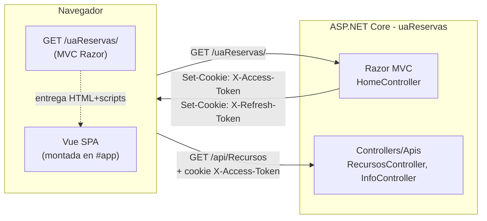
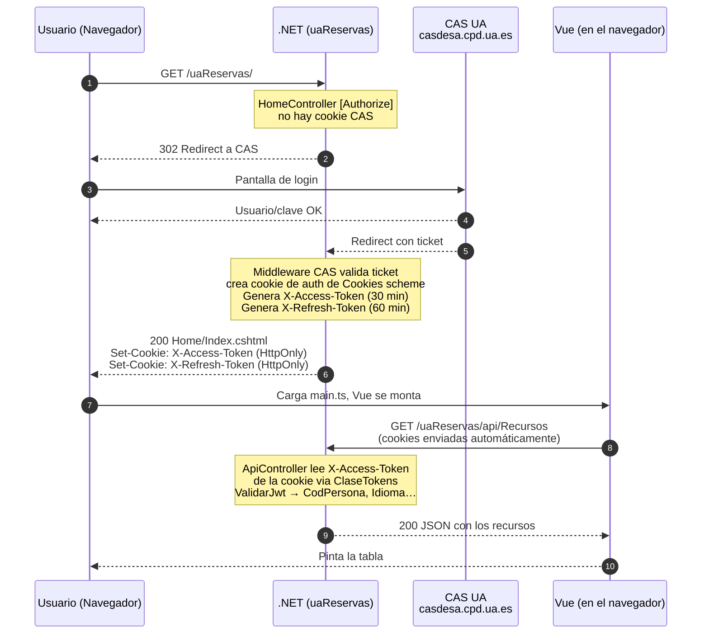
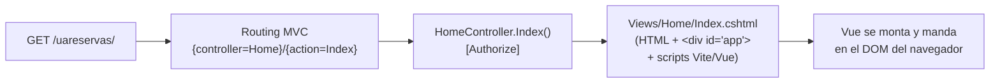
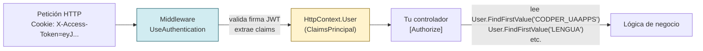
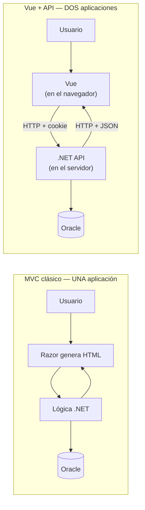
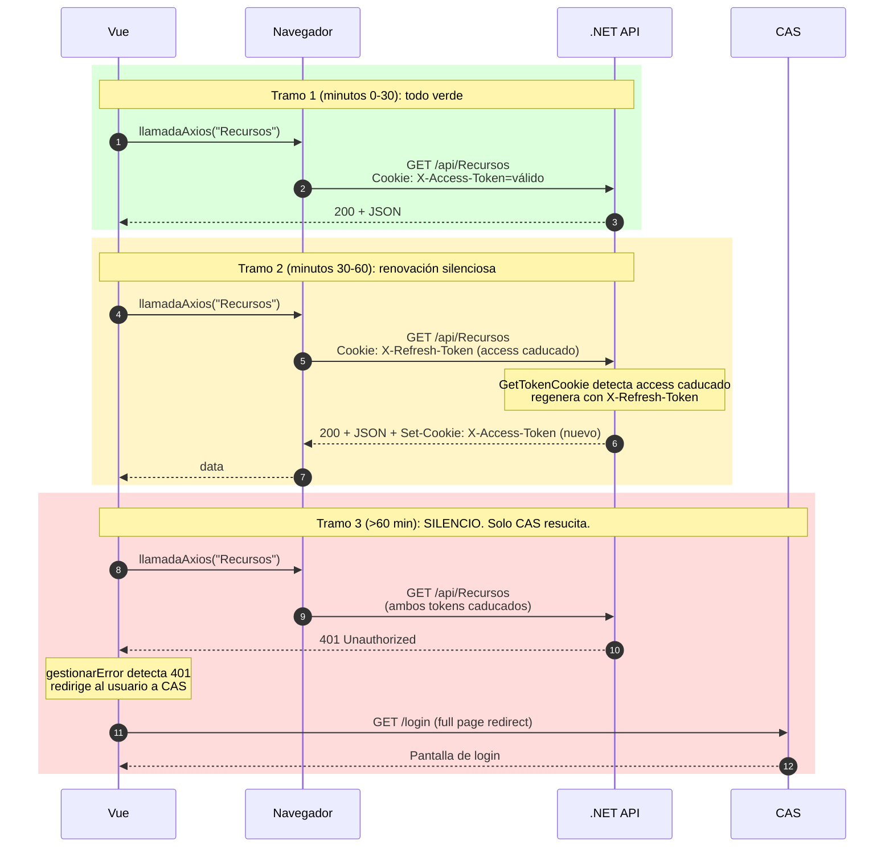
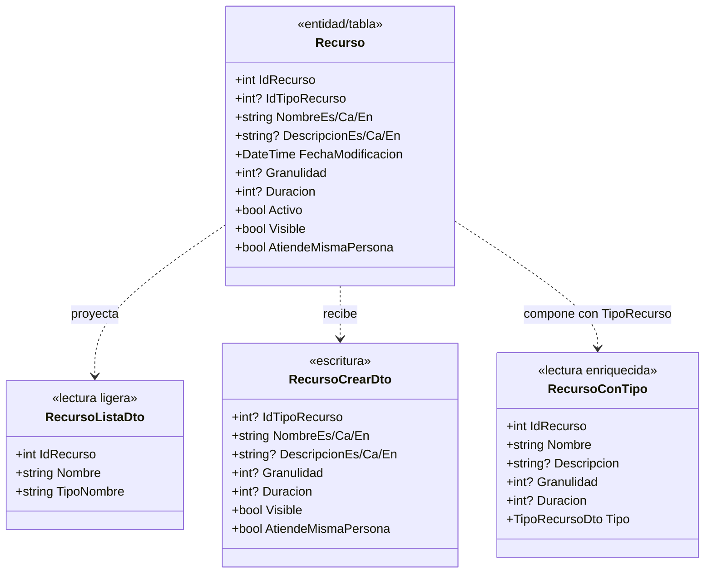
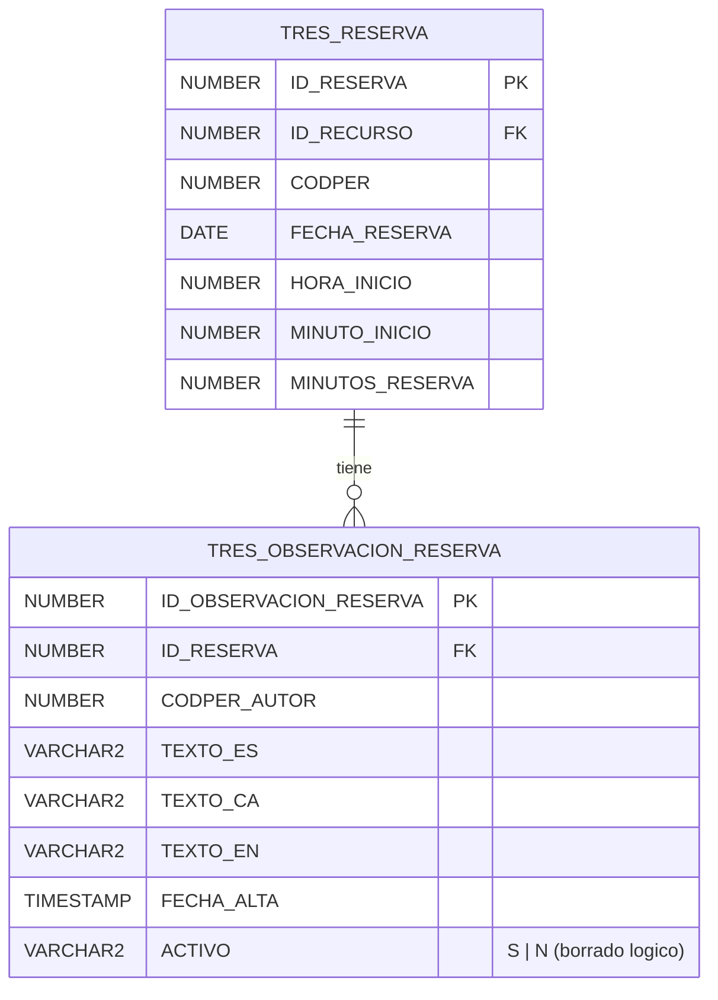

# Sesión 7: Modelos y primer API

::: info ¿Para quién es este material?
Esta sesión está pensada para gente con perfiles muy distintos: desde quien lleva años con Oracle PL/SQL pero nunca ha tocado HTTP, hasta quien viene de ASP clásico, WebForms o MVC y nunca ha trabajado con SPAs. Por eso empezamos despacio con la arquitectura conceptual y vamos descendiendo al detalle.

**En esta sesión no vamos a tocar Oracle ni a escribir Vue:** la API se prueba desde Chrome DevTools y desde la página `Home.vue` (que ya está hecha). El acceso a base de datos y la arquitectura por capas se ven en la [**sesión 8**](../sesion-08-servicios-oracle/).
:::

## 0. Pre-requisitos del curso

::: tip ANTES DE EMPEZAR — lee esta página primero
Todo lo necesario para arrancar (NuGet, npm/pnpm, `appsettings.json`, `dotnet user-secrets`, inyección de dependencias) está en una página dedicada. **Ábrela y tenla a mano durante la sesión:**

👉 [**Pre-requisitos del curso .NET** — configuración del entorno, paquetes y secretos](./pre-requisitos)
:::

---

## 1.0 Antes de tocar código: cómo se hablan .NET y Vue {#arquitectura}

::: warning IMPORTANTE — lee esta sección entera
Esta es **la sección que casi nadie entiende del todo** y de la que dependen todas las demás. Antes de escribir un DTO, antes de crear un endpoint, antes de hacer una llamada `llamadaAxios`, hay que tener clarísimo **qué pasa entre el navegador del usuario y la API .NET**. Si esto no se entiende, el resto del curso es magia (y la magia se rompe la primera vez que algo va mal).
:::

### 1.0.1 La foto grande: una sola aplicación, dos motores

Una app UA típica como `uaReservas` parece que tiene **un solo dominio** (`https://miapp.ua.es/uaReservas`), pero por dentro funcionan **dos motores** sobre el mismo proceso ASP.NET Core:

| Motor   | Sirve                                                  | URL típica                     |
| ------- | ------------------------------------------------------ | ------------------------------ |
| **MVC** | La página inicial (`Home/Index.cshtml`), el `_Layout`. | `GET /uaReservas/`             |
| **API** | Endpoints JSON consumidos por Vue.                     | `GET /uaReservas/api/Recursos` |

Como **comparten dominio**, **comparten cookies**. Esa es la pieza clave: la cookie que la parte MVC deja escrita la API la lee sin más, sin CORS, sin `Authorization: Bearer`, sin `localStorage`.



<!-- diagram id="arquitectura-mvc-vue" caption: "Una sola app: MVC entrega Vue, Vue consume la API. Ambos comparten cookies." -->

### 1.0.2 Paso a paso: del clic en el enlace al primer JSON

Esta es la secuencia completa desde que un usuario abre la app hasta que Vue pinta el primer dato:



<!-- diagram id="flujo-cas-jwt-vue" caption: "Secuencia completa: CAS, generación de JWT, montaje de Vue, llamada autenticada." -->

### 1.0.3 Pieza por pieza, con código real de `uaReservas`

#### A. Vue vive dentro de Razor: la ruta `/` carga `Index.cshtml`

Una app UA moderna **no tiene un proyecto Vue separado del proyecto .NET**. Es un único proyecto ASP.NET Core MVC con:

- Un `HomeController.Index()` que devuelve la vista Razor `Views/Home/Index.cshtml`.
- Dentro de `Index.cshtml` hay un `<div id="app"></div>` y los `<script>` que cargan el bundle de Vite/Vue.

Cuando el navegador pide la URL raíz de la app (`https://localhost:44306/uareservas/`), el routing convencional de MVC (`{controller=Home}/{action=Index}/{id?}`) la mapea a `HomeController.Index()`. Esa acción devuelve `Index.cshtml`, y **el navegador descarga el HTML + los scripts de Vite**. A partir de ese momento Vue se monta sobre `<div id="app">` y manda en el DOM; las siguientes peticiones son llamadas API (JSON) desde Vue al mismo backend .NET.



<!-- diagram id="razor-lanza-vue" caption: "La ruta por defecto (Home/Index) devuelve Razor; Razor entrega los scripts de Vue al navegador." -->

::: info CONTEXTO — esto NO es "Vue como SPA hosteada por nginx"
En otras arquitecturas Vue es un proyecto independiente que se compila a estáticos y los sirve un servidor web aparte. Aquí Vue **vive dentro del ciclo de petición de .NET**: la primera petición es una vista Razor; las siguientes son llamadas API al mismo proceso. Por eso `[Authorize]` en `HomeController` ya basta para forzar el login antes de que Vue siquiera arranque — el navegador no carga ni un solo `.js` de Vue hasta que CAS ha emitido las cookies de sesión.
:::

#### B. La página de entrada: `HomeController` con `[Authorize]`

```csharp
// Controllers/HomeController.cs
/// <summary>
/// Controlador MVC que entrega la primera pagina de la aplicacion.
/// Primero pasa por CAS/JWT y despues devuelve Index.cshtml, que monta Vue.
/// </summary>
[Authorize]                          // obliga a estar autenticado
public class HomeController : Controller
{
    /// <summary>
    /// Si no hay sesion, el middleware redirige a CAS antes de entrar aqui.
    /// </summary>
    public IActionResult Index() => View();
}
```

Si no hay cookie de autenticación, el middleware **devuelve un 302 a CAS** automáticamente. El usuario nunca llega a `Index()` sin estar identificado.

#### C. Las tres cookies que se quedan en el navegador

Cuando CAS confirma la identidad, el servidor responde con **`Set-Cookie`** para tres cookies (de ahí en adelante el navegador las envía solas en cada petición al mismo dominio):

| Cookie                | Quién la pone            | Para qué sirve                                  | TTL típico |
| --------------------- | ------------------------ | ----------------------------------------------- | ---------- |
| `.AspNetCore.Cookies` | Middleware Cookies       | Sesión MVC (saber que estás logueado en CAS)    | Sesión     |
| **`X-Access-Token`**  | `ClaseTokens` (al login) | **JWT corto** que las APIs validan en cada call | 30 min     |
| **`X-Refresh-Token`** | `ClaseTokens` (al login) | JWT largo que **regenera** el access caducado   | 60 min     |

Las tres cookies son **HTTP-only** (las pone el servidor, el navegador las envía solas en cada petición). El código JS de Vue **no las lee directamente**: simplemente al hacer una llamada API, el navegador adjunta las cookies que corresponden al dominio.

#### D. Cómo Razor "lanza" Vue

Tras la autenticación, `Home/Index.cshtml` se renderiza. Su único trabajo es **cargar los scripts de Vite/Vue** y dejar un `<div id="app">` donde Vue se montará. A partir de ese momento, **Vue manda en el DOM** y el navegador es quien adjunta las cookies en cada llamada a la API.

#### E. Vue llama a la API y la cookie viaja sola

El cliente HTTP que usamos (`vueua-useaxios`) está pre-configurado para que el navegador adjunte las cookies del dominio en cada petición. **Vue no toca el token**: simplemente hace `llamadaAxios("Recursos", verbosAxios.GET)` y el navegador se encarga del resto.

#### F. La API lee la cookie e identifica al usuario (y sus roles)

**La validación del token NO se hace en cada controlador**: hay un **middleware** que se ejecuta antes que tu acción, lee la cookie `X-Access-Token`, valida la firma del JWT y vuelca todos los claims en una propiedad llamada `User` que está disponible **en cualquier controlador**.



<!-- diagram id="middleware-user-claims" caption: "El middleware valida y rellena User antes de tu controlador. Tú solo lees claims." -->

::: tip BUENA PRÁCTICA — NO valides el token a mano
Si ves código antiguo con `_tokens.ValidarJwt(token)` dentro de cada acción, sácalo de ahí. Eso es **trabajo del middleware**. Tu controlador solo necesita:

1. El atributo `[Authorize]` en la clase (o en la acción).
2. Leer los claims que necesite desde `User`.

Si el token es inválido o ha caducado, el middleware **ya ha devuelto 401** antes de que tu código se ejecute. Cuando llegas a leer `User`, el usuario está garantizado.
:::

##### Una clase base que centraliza el acceso a `User`

Como casi todos los controladores necesitan los mismos claims (codper, idioma, roles, nombre...), creamos un **`ControladorBase`** del que heredan todos los demás. Así no se repite el `User.FindFirst("...")` en mil sitios.

```csharp
// Controllers/Apis/ControladorBase.cs
using System.Security.Claims;
using Microsoft.AspNetCore.Mvc;

namespace uaReservas.Controllers.Apis
{
    /// <summary>
    /// Base de los controladores que necesitan datos del usuario / peticion.
    /// Hereda de ApiControllerBase, asi que tambien dispone de HandleResult.
    ///
    /// Centraliza idioma, codper y roles para que ningun controlador repita
    /// User.FindFirstValue("...") ni normalice "va" -> "ca" por su cuenta.
    /// </summary>
    public abstract class ControladorBase : ApiControllerBase
    {
        /// <summary>
        /// Idioma efectivo de la peticion. Lo resuelve primero el middleware UA
        /// en HttpContext.Items["idioma"]; el claim LENGUA queda como respaldo.
        /// </summary>
        protected string Idioma => ObtenerIdiomaPeticion();

        /// <summary>
        /// Código de persona (CODPER) del usuario autenticado.
        /// -1 si el claim no existe o no es entero.
        /// </summary>
        protected int CodPer
        {
            get
            {
                var codperStr = User?.FindFirstValue("CODPER_UAAPPS");
                return int.TryParse(codperStr, out var codper) ? codper : -1;
            }
        }

        protected string NombrePersona => User?.FindFirstValue("NOMPER") ?? string.Empty;
        protected string Correo        => User?.FindFirstValue("CORREO") ?? string.Empty;
        protected string PathFoto      => User?.FindFirstValue("PATHFOTO") ?? string.Empty;

        /// <summary>
        /// Roles del usuario. El claim ROLES viene como string "rol1,rol2;rol3".
        /// </summary>
        protected List<string> Roles
        {
            get
            {
                var rolesRaw = User?.FindFirstValue("ROLES") ?? string.Empty;
                if (string.IsNullOrWhiteSpace(rolesRaw)) return new List<string>();

                return rolesRaw
                    .Split(new[] { ',', ';' }, StringSplitOptions.RemoveEmptyEntries)
                    .Select(r => r.Trim())
                    .ToList();
            }
        }

        protected string ObtenerIdiomaPeticion()
        {
            var idiomaMiddleware = HttpContext?.Items.TryGetValue("idioma", out var idiomaContexto) == true
                ? idiomaContexto?.ToString()
                : null;

            if (!string.IsNullOrWhiteSpace(idiomaMiddleware))
            {
                return NormalizarIdioma(idiomaMiddleware);
            }

            return NormalizarIdioma(User?.FindFirstValue("LENGUA"));
        }

        protected static string NormalizarIdioma(string? idioma)
        {
            var limpio = (idioma ?? "es").Trim().ToLowerInvariant();
            if (limpio == "va") limpio = "ca";

            if (limpio.StartsWith("ca")) return "ca";
            if (limpio.StartsWith("en")) return "en";
            if (limpio.StartsWith("es")) return "es";

            return "es";
        }
    }
}
```

::: info CONTEXTO — por qué centralizamos los claims
El middleware de autenticación rellena `HttpContext.User`; `ControladorBase` solo lee esos claims y los normaliza. Si una acción necesita `CodPer` o `Idioma`, lo toma de la clase base. Así evitamos strings mágicos (`"CODPER_UAAPPS"`, `"LENGUA"`) repartidos por cada controlador y mantenemos en un único sitio la regla `va -> ca`.
:::

##### Añadir tus propios claims al token

Si tu aplicación necesita un dato del usuario que no viene por defecto (por ejemplo, un permiso específico de tu app, o el centro al que pertenece), **se añade declarando el claim en `appsettings.json`**. La plantilla UA lo leerá y lo incluirá en el JWT al hacer login.

::: tip BUENA PRÁCTICA — claims propios
La sección que controla qué columnas se inyectan como claim vive en `appsettings.json` bajo la configuración de la plantilla UA (busca por nombres como `ClaimsExtra`, `ClaimsAdicionales` o equivalente en tu proyecto activo). Mira el proyecto de ejemplo del curso para ver la sintaxis exacta — cada proyecto la tiene levemente distinta porque los claims dependen de a qué tablas de personal/aplicaciones se quiera unir el login.
:::

##### Un controlador típico, heredando de `ControladorBase`

```csharp
// Controllers/Apis/InfoController.cs
[Route("api/[controller]")]
[ApiController]
[Authorize]                       // ← obliga a estar autenticado. Si no, 401 automático.
public class InfoController : ControladorBase
{
    /// <summary>
    /// Devuelve los datos del usuario actual, todos sacados del token
    /// vía la clase base. NUNCA se reciben del body.
    /// </summary>
    [HttpGet("UsuarioActual")]
    public IActionResult UsuarioActual()
    {
        // Todos estos vienen de User (rellenado por el middleware).
        // El cliente JS NO envía nada de esto: lo lee el servidor del JWT.
        return Ok(new
        {
            codPer        = CodPer,            // del claim CODPER_UAAPPS
            nombre        = NombrePersona,     // del claim NOMPER
            idioma        = Idioma,            // del claim LENGUA (con va→ca)
            correo        = Correo,            // del claim correspondiente
            dniConLetra   = DniConLetra,
            roles         = Roles,             // del claim ROLES, ya parseado a lista
            pathFoto      = PathFoto
        });
    }
}
```

Y un ejemplo de cómo se usa el `User` en una lógica real:

```csharp
[HttpGet("MisReservas")]
public async Task<IActionResult> MisReservas()
{
    // El servidor decide POR EL TOKEN de qué usuario son las reservas a devolver.
    // Aunque alguien intente meter ?codPer=999 en la URL, lo ignoramos.
    var reservas = await _reservas.ObtenerPorUsuarioAsync(CodPer, Idioma);
    return Ok(reservas);
}

[HttpPost("Aprobar/{idReserva:int}")]
[Authorize(Roles = "admin")]   // ← El rol se exige en la CABECERA, no dentro del método.
public async Task<IActionResult> Aprobar(int idReserva)
{
    // Si llegamos aquí, el usuario está autenticado Y tiene el rol "admin".
    // Si no, ASP.NET ya devolvió 401 (sin cookie) o 403 (sin rol) automáticamente.
    await _reservas.AprobarAsync(idReserva, aprobadoPor: CodPer);
    return NoContent();
}
```

Esto es la clave de lo que vimos en 1.2: **`CODPER`, idioma, roles y datos personales se obtienen del token en el servidor, jamás del payload que envía Vue**. Aunque un usuario malicioso intente enviar `codPer=999` en el body, el servidor lo ignora — usa el de `User`.

::: tip BUENA PRÁCTICA — la autorización por rol va en el atributo
**No** uses `if (!Roles.Contains("..."))` dentro del método. Tres razones:

1. **El check se ejecuta antes de entrar al método.** ASP.NET corta la petición con 401/403 sin ejecutar tu lógica ni abrir transacciones Oracle.
2. **Es declarativo:** mirando la cabecera del método ya sabes quién puede llamarlo. No hay que leer el cuerpo para saberlo.
3. **Lo lee Scalar/OpenAPI:** la UI de la API documenta qué endpoints necesitan qué rol automáticamente.

Para casos sencillos, `[Authorize(Roles = "admin")]` basta. Para combinaciones (PDI o PTGAS, varios roles con la misma política, etc.) se definen **políticas con nombre** en `Program.cs` y se aplican con `[Authorize(Policy = "...")]`. La app de Accesibilidad lo hace así — mira `Accesibilidad/Configuration/AuthorizationPolicies.cs` y la sección `AddAuthorization` de su `Program.cs`. Para profundizar, el skill `ua-dotnet-seguridad` (en `skills-claude/`) tiene el patrón completo: vista Oracle de roles, mapeo de claim `ROLES` → `ClaimTypes.Role`, definición de políticas y uso en controladores.
:::

::: info CONTEXTO — `Roles` viene del claim `ROLES` declarado en `appsettings.json`
Para que `[Authorize(Roles = "admin")]` funcione, el JWT que emite la plantilla UA debe llevar un claim `ROLES`. Ese claim se activa declarándolo en `App:Variables`:

```json
"App": {
  "IdApp": "PRU_MVC",
  "Variables": [ "PATHFOTO", "LENGUA", "CODPER_UAAPPS", "NOMPER", "ROLES" ]
}
```

La plantilla UA lee la vista Oracle de roles del usuario (`{ESQUEMA}.V_ROLES_USUARIOS` típicamente, con `LISTAGG` agrupando todos los roles por `CODPER`) y los inyecta como un único string en el claim `ROLES`. La propiedad `Roles` de `ControladorBase` (vista arriba) lo parsea a lista para cuando quieras leerlo programáticamente — pero **para autorizar, prefiere el atributo**.
:::

#### G. Refresco automático

`X-Access-Token` dura 30 minutos. Cuando caduca, `ClaseTokens` lo regenera automáticamente usando el `X-Refresh-Token` (60 minutos). El usuario no se entera: solo vuelve a CAS cuando **ambos** tokens han caducado.

### 1.0.4 Consecuencias prácticas que vas a aplicar todo el curso

::: tip BUENA PRÁCTICA — reglas que se derivan de esta arquitectura

1. **El `CODPER` se lee del token, NUNCA del body.** Patrón: `_tokens.ValidarJwt(...).CodPersona`. Lo verás en cada controlador del curso.
2. **El idioma viene del token, no de un querystring.** Igual que el `CODPER`: nada que decida quién eres o qué ves debe llegar desde el cliente.
3. **Los roles también vienen del token** (claim `ROLES`). Para decidir si un usuario puede hacer algo, consulta el token, no un campo del DTO.
4. **Mismo dominio = no necesitas CORS abierto.** El `app.UseCors(dominioUA)` solo abre `*.ua.es`. Llamadas desde fuera (Postman, otro dominio) no llevan la cookie y reciben 401.
5. **Los nombres son fijos.** `X-Access-Token` y `X-Refresh-Token` están en `ClaseTokens.APPTOKEN` y `ClaseTokens.REFRESHTOKEN`. Nunca los hardcodees.
   :::

### 1.0.6 La idea más importante: son DOS apps. Si el token muere, se hace el silencio

::: danger LEE ESTO DESPACIO
Si vienes de MVC clásico, tu intuición es que **una app = un proceso = una sesión**. Con la nueva arquitectura **eso ya NO es así**. Una app UA moderna son **dos aplicaciones que se hablan por HTTP**:

- **App nº 1**: Vue corriendo dentro del navegador del usuario.
- **App nº 2**: .NET corriendo en el servidor.

Lo único que las une es una **cookie con un token dentro**. Si ese token muere y no se renueva, las dos apps se **dejan de hablar** y la pantalla se queda muda. No hay magia. No hay redirección automática. No hay "perder sesión" como en MVC.

**El 70 % de los bugs de "no me carga la pantalla" en aplicaciones nuevas son exactamente esto.**
:::

#### Compara el modelo mental



<!-- diagram id="modelo-mental-mvc-vs-spa" caption: "MVC era una sola app que renderizaba HTML. Vue+API son dos apps que dialogan por HTTP." -->

| Aspecto                | MVC clásico                              | Vue + API moderna                                                                      |
| ---------------------- | ---------------------------------------- | -------------------------------------------------------------------------------------- |
| **Procesos**           | UNO (.NET).                              | DOS (.NET en servidor + JS en navegador).                                              |
| **Estado del usuario** | `Session` en memoria del servidor.       | **Solo lo que diga el token JWT** en cada petición.                                    |
| **Si caducas**         | `[Authorize]` redirige a CAS automático. | La llamada axios devuelve **401**. **Vue tiene que reaccionar**, nadie lo hace por ti. |
| **Quién pinta la UI**  | El servidor (Razor genera HTML).         | El navegador (Vue genera DOM en JS).                                                   |
| **Cuándo se rompe**    | Cuando el servidor se cae.               | Cuando el servidor se cae **O cuando el token muere** y nadie lo renueva.              |

#### Línea de tiempo de un token (y de su muerte)

```mermaid
gantt
    title Vida útil de los tokens JWT (con valores por defecto UA)
    dateFormat  HH:mm
    axisFormat %H:%M

    section X-Access-Token
    Vivo (válido en API)        :done,  acc,  10:00, 30m
    CADUCADO                    :crit, accm, after acc, 90m

    section X-Refresh-Token
    Vivo (regenera el access)   :done,  ref,  10:00, 60m
    CADUCADO                    :crit, refm, after ref, 60m

    section Estado del usuario
    Vue ↔ API funciona          :active, ok1, 10:00, 60m
    Auto-renovación silenciosa  :milestone, m1, 10:30, 0m
    LLAMADAS A API = 401        :crit, fail, 11:00, 60m
```



<!-- diagram id="ciclo-vida-tokens" caption: "Vida del APPTOKEN (30 min) y del REFRESHTOKEN (60 min). A partir de minuto 60, todas las llamadas fallan con 401." -->

#### Qué pasa en cada tramo



<!-- diagram id="tramos-vida-token" caption: "Tres tramos: todo verde, renovación silenciosa, silencio total que solo CAS rompe." -->

::: warning IMPORTANTE — el error mental que mata

> _"Llevo la pestaña abierta toda la mañana. ¿Por qué me ha dejado de funcionar a la 1?"_

Porque el `REFRESHTOKEN` dura **60 minutos**. Si abriste la pantalla a las **10:00** y no haces NINGUNA petición a la API hasta las **11:01**, **el refresh ya ha caducado** y la primera llamada va a fallar con 401. La cookie no se renueva "porque sí": **se renueva cuando hay actividad** que llegue al servidor.

En MVC clásico esto no pasaba porque cada navegación entre páginas iba al servidor y reactivaba la sesión. En SPA la página no se recarga: hasta que no haya una llamada API real, los tokens caducan en silencio.
:::

#### Reglas prácticas que se derivan de "son dos apps"

::: tip BUENA PRÁCTICA

1. **El 401 es el "se acabó la fiesta".** Cuando Vue lo reciba, redirige el navegador a CAS (`window.location = /...`) para empezar un ciclo nuevo. `gestionarError` ya hace esto.
2. **No guardes nada importante solo en memoria de Vue.** Un formulario a medio rellenar se pierde si el usuario tiene que ir a CAS. Persiste lo crítico en BD en cuanto puedas.
3. **No asumas que "estabas logueado hace un minuto" significa "sigues logueado".** Cada llamada es una conversación independiente. La cookie podría haber muerto entre dos llamadas.
4. **Cuidado con las pestañas abandonadas.** El usuario que abre la app y se va a comer vuelve a una pantalla "muerta". Considera mostrar un aviso si llevas más de N minutos sin tráfico.
5. **CAS no es tu API.** El login va por una redirección de página completa al dominio de CAS, no por axios. Volver a CAS implica recargar la SPA entera.
   :::

---

## 1.1 ¿Qué es un DTO (en la UA, un "Modelo")?

Un **DTO** (Data Transfer Object) es un objeto que transporta datos entre capas. No contiene lógica de negocio: solo propiedades.

::: info CONTEXTO
En el resto del sector se les llama **DTO**. En nuestras aplicaciones UA los llamamos **Modelos** y viven en la carpeta `Models/`. Son la misma idea: una clase plana que viaja entre el controlador y el cliente (Vue), o entre el controlador y la base de datos.
:::

| Concepto       | Propósito                                       | Ejemplo en la UA                           |
| -------------- | ----------------------------------------------- | ------------------------------------------ |
| **DTO/Modelo** | Transportar datos entre capas (API ↔ cliente)   | `Recurso`, `TipoRecurso`, `RecursoConTipo` |
| **Entidad**    | Representar una fila de la BD con mapeo directo | Modelo de Entity Framework                 |
| **ViewModel**  | Preparar datos específicos para una vista MVC   | `HomeViewModel` (no aplica en APIs)        |

### El caso real: tablas `TRES_RECURSO` y `TRES_TIPO_RECURSO`

A lo largo del curso trabajaremos con dos tablas Oracle relacionadas del esquema de reservas:

```erd
[TRES_TIPO_RECURSO]
*ID_TIPO_RECURSO {label: "PK"}
CODIGO
NOMBRE_ES
NOMBRE_CA
NOMBRE_EN

[TRES_RECURSO]
*ID_RECURSO {label: "PK"}
+ID_TIPO_RECURSO {label: "FK"}
NOMBRE_ES
NOMBRE_CA
NOMBRE_EN
DESCRIPCION_ES
DESCRIPCION_CA
DESCRIPCION_EN
FECHA_MODIFICACION
GRANULIDAD
DURACION
ACTIVO
VISIBLE
ATIENDE_MISMA_PERSONA

TRES_TIPO_RECURSO 1--* TRES_RECURSO
```

<!-- diagram id="erd-recurso-tipo-recurso" caption: "Relación 1:N entre TRES_TIPO_RECURSO y TRES_RECURSO" -->

Cada **recurso** (una sala, un equipo, un servicio) pertenece a un **tipo de recurso** (sala de reuniones, equipo audiovisual, etc.).

### Modelo simple: `TipoRecurso`

Empezamos por la tabla más sencilla. La clase `TipoRecurso` mapea directamente las columnas de `TRES_TIPO_RECURSO`:

```csharp
// Models/Reservas/TipoRecurso.cs
using System.ComponentModel.DataAnnotations;

namespace ua.Models.Reservas
{
    public class TipoRecurso
    {
        public int IdTipoRecurso { get; set; }   // ID_TIPO_RECURSO

        [Required]
        [MaxLength(100)]
        public string Codigo { get; set; } = string.Empty;   // CODIGO

        [Required]
        [MaxLength(150)]
        public string NombreEs { get; set; } = string.Empty; // NOMBRE_ES

        [Required]
        [MaxLength(150)]
        public string NombreCa { get; set; } = string.Empty; // NOMBRE_CA

        [Required]
        [MaxLength(150)]
        public string NombreEn { get; set; } = string.Empty; // NOMBRE_EN
    }
}
```

#### Lo mismo, pero como `record`: para la API no hay diferencia

El mismo Modelo se puede escribir como `record` y la API lo trata **exactamente igual** (mismo JSON, mismas validaciones, mismo binding). Es solo una forma más corta de declarar la clase cuando el DTO no necesita lógica interna:

```csharp
// Models/Reservas/TipoRecursoDto.cs
using System.ComponentModel.DataAnnotations;

namespace ua.Models.Reservas
{
    /// <summary>
    /// DTO de TipoRecurso en versión record. Equivalente funcional a la clase
    /// de arriba: mismos campos, mismas DataAnnotations, mismo JSON.
    /// </summary>
    public record TipoRecursoDto(
        int IdTipoRecurso,
        [Required, MaxLength(100)] string Codigo,
        [Required, MaxLength(150)] string NombreEs,
        [Required, MaxLength(150)] string NombreCa,
        [Required, MaxLength(150)] string NombreEn
    );
}
```

Un endpoint que lo devuelva en JSON se escribe igual que con la clase:

```csharp
// Controllers/Apis/TiposRecursoController.cs
[Route("api/[controller]")]
[ApiController]
[Authorize]
public class TiposRecursoController : ControladorBase
{
    /// <summary>Devuelve un ejemplo "hardcodeado" de TipoRecurso como record.</summary>
    [HttpGet("Ejemplo")]
    public ActionResult<TipoRecursoDto> Ejemplo() =>
        Ok(new TipoRecursoDto(
            IdTipoRecurso: 1,
            Codigo:        "SALAREU",
            NombreEs:      "Sala de reuniones",
            NombreCa:      "Sala de reunions",
            NombreEn:      "Meeting room"));
}
```

JSON de respuesta:

```json
{
  "idTipoRecurso": 1,
  "codigo": "SALAREU",
  "nombreEs": "Sala de reuniones",
  "nombreCa": "Sala de reunions",
  "nombreEn": "Meeting room"
}
```

::: tip BUENA PRÁCTICA — cuándo usar `record` y cuándo `class`
| Usa `record`... | Usa `class`... |
| -------------------------------------------------------- | ------------------------------------------------------------------ |
| DTOs de entrada/salida cortos, sin lógica interna. | Entidades con métodos, lógica de validación cruzada o estado mutable. |
| Cuando quieres igualdad por valor (tests, comparaciones). | Cuando el objeto va a mutar campos a lo largo de su vida. |
| Cuando lo declaras y desaparece en 1-2 líneas. | Cuando tienes 5+ propiedades con `[DataAnnotation]` largas. |

Para la API es **indiferente**: ASP.NET Core serializa records con `System.Text.Json` igual que clases (PascalCase → camelCase en el JSON), y el model binding rellena las propiedades del constructor primario igual que rellenaría setters.
:::

::: info CONTEXTO — sintaxis "constructor primario"
`public record TipoRecursoDto(int IdTipoRecurso, ...)` declara propiedades **inmutables** (`init`-only) y un constructor que las recibe todas. Si necesitas que sean mutables (para que un formulario las modifique tras crearlas), usa la forma alternativa:

```csharp
public record TipoRecursoDto
{
    public int    IdTipoRecurso { get; set; }
    public string Codigo        { get; set; } = string.Empty;
    // ...
}
```

Sigue siendo un `record` (sigue teniendo igualdad por valor), pero las propiedades son mutables como en una clase.
:::

### Modelo más completo: `Recurso`

La clase `Recurso` (ya existente en el proyecto `uaReservas`) mapea la tabla `TRES_RECURSO`, que tiene más columnas, nombres multiidioma, fechas, banderas `S/N` y la clave foránea al tipo:

```csharp
// Models/Reservas/Recurso.cs
public class Recurso
{
    public int IdRecurso { get; set; }
    public int? IdTipoRecurso { get; set; }

    [Required, MaxLength(200)]
    public string NombreEs { get; set; } = string.Empty;
    [Required, MaxLength(200)]
    public string NombreCa { get; set; } = string.Empty;
    [Required, MaxLength(200)]
    public string NombreEn { get; set; } = string.Empty;

    public string? DescripcionEs { get; set; }
    public string? DescripcionCa { get; set; }
    public string? DescripcionEn { get; set; }

    [Required]
    public DateTime FechaModificacion { get; set; }

    public int? Granulidad { get; set; }
    public int? Duracion { get; set; }

    [Required] public bool Activo { get; set; } = true;
    [Required] public bool Visible { get; set; } = true;
    [Required] public bool AtiendeMismaPersona { get; set; } = false;
}
```

::: tip BUENA PRÁCTICA
**Convenciones de nombres UA:**

- Propiedades en **PascalCase** en C# → se mapean automáticamente a **SNAKE_CASE** en Oracle (`FechaModificacion` → `FECHA_MODIFICACION`, `IdTipoRecurso` → `ID_TIPO_RECURSO`).
- Los `bool` de C# se mapean a `VARCHAR2(1)` con valores `'S'` / `'N'` en Oracle.
- Usa `[Columna("NOMBRE_REAL")]` solo si la columna no sigue la convención SNAKE_CASE.
  :::

## 1.2 Un Modelo por operación: no todos los campos viajan siempre

Aquí está la idea clave de la sesión: **un Modelo no es la tabla**. Es **el contrato de datos para una operación concreta**. Por eso es habitual tener varios Modelos sobre la misma entidad, cada uno con los campos justos.

::: info CONTEXTO
La tabla `TRES_RECURSO` tiene 15 columnas. Pero cuando el cliente Vue **lista recursos en un desplegable**, solo necesita `id` y `nombre`. Cuando un usuario **crea** un recurso, no envía `FechaModificacion` (la pone el servidor). Y al **leer** el detalle no nos interesa que el cliente conozca el flag interno `Activo` ni códigos sensibles.
:::

### ¿Qué quitamos del Modelo según el caso?

| Campo                  | ¿Por qué suele NO ir en el DTO hacia el cliente?                                |
| ---------------------- | ------------------------------------------------------------------------------- |
| `Activo` (`S`/`N`)     | Es una bandera interna de borrado lógico. El cliente solo ve registros activos. |
| `FechaModificacion`    | La gestiona la BD/servidor. El cliente nunca debe enviarla.                     |
| `FechaCreacion`        | Igual: auditoría interna, no parte del contrato funcional.                      |
| `CodPer` (CODPER)      | Código de persona UA: dato sensible. **Nunca** debe salir al navegador.         |
| Claves foráneas crudas | A veces interesa enviar el **nombre** del tipo en vez del `IdTipoRecurso`.      |

::: danger ZONA PELIGROSA
**`CODPER` y datos personales no salen al cliente.** Aunque la tabla tenga `COD_PER`, el DTO que devuelve la API debe omitirlo o, si se necesita, sustituirlo por un identificador opaco. Lo mismo aplica a DNIs, correos internos o claves de auditoría. La regla: **el cliente recibe lo mínimo necesario para pintar la pantalla**.
:::

### Tres Modelos sobre la misma entidad

Sobre `Recurso` podemos tener (al menos) tres formas:



<!-- diagram id="modelos-recurso-variantes" caption: "Una entidad, varios Modelos según la operación" -->

### El DTO compuesto: `RecursoConTipo`

Para la pantalla de detalle queremos enviar el recurso **junto con su tipo** en una sola llamada. Creamos un DTO que **une** ambos, **omite** los campos internos (`Activo`, `FechaModificacion`) y **aplana** el idioma a una sola propiedad `Nombre` (el servicio rellenará el idioma activo).

```csharp
// Models/Reservas/RecursoConTipo.cs
namespace ua.Models.Reservas
{
    public class RecursoConTipo
    {
        public int IdRecurso { get; set; }
        public string Nombre { get; set; } = string.Empty;       // resuelto al idioma activo
        public string? Descripcion { get; set; }

        public int? Granulidad { get; set; }
        public int? Duracion { get; set; }
        public bool Visible { get; set; }
        public bool AtiendeMismaPersona { get; set; }

        // Tipo de recurso embebido (no solo el Id)
        public TipoRecursoResumenDto? Tipo { get; set; }
    }

    public class TipoRecursoResumenDto
    {
        public int IdTipoRecurso { get; set; }
        public string Codigo { get; set; } = string.Empty;
        public string Nombre { get; set; } = string.Empty;       // resuelto al idioma activo
    }
}
```

::: tip BUENA PRÁCTICA
Observa qué **NO** hay en `RecursoConTipo`:

- **No** está `Activo`: el cliente solo recibe recursos activos, no necesita la bandera.
- **No** está `FechaModificacion`: es metadato interno de auditoría.
- **No** están los seis campos `NombreEs/Ca/En` + `DescripcionEs/Ca/En`: la API ya resuelve el idioma y entrega un único `Nombre` / `Descripcion`.
- **No** se expone `IdTipoRecurso` "suelto": se envía el objeto `Tipo` con lo justo para pintar (código + nombre legible).

Si mañana añadiéramos un `CodPer` a `Recurso` por algún motivo, **tampoco aparecería aquí**: ese tipo de códigos se queda en el servidor.
:::

::: warning IMPORTANTE
Un DTO es un **contrato**. Cambiar sus campos rompe a quien lo consume. Por eso conviene crear DTOs **específicos por operación** (lista, detalle, crear, editar) en vez de devolver siempre la entidad completa: así puedes evolucionar la tabla sin romper la API.
:::

## 1.3 Creando nuestra primera API

### Anatomía de un controlador API

Todos los controladores API en .NET 10 comparten la misma estructura. Esto es **lo mínimo**:

```csharp
[Route("api/[controller]")]   // Ruta base: /api/{NombreSinControllerSuffix}
[ApiController]               // Activa validación automática del modelo y binding de [FromBody]
[Authorize]                   // Exige cookie JWT válida (en TODOS los controladores del curso)
[Produces("application/json")]  // Todas las respuestas son JSON
[Tags("MiEntidad")]            // Agrupa el endpoint en la sidebar de Scalar
public class MiController : ControladorBase  // Hereda de ControladorBase
{
    // Inyección de dependencias por constructor
    private readonly IMiServicio _servicio;
    public MiController(IMiServicio servicio) => _servicio = servicio;

    // Acción con atributo HTTP + XML docs + ProducesResponseType
    /// <summary>Una frase explicando qué hace.</summary>
    /// <response code="200">Devuelve el resultado.</response>
    [HttpGet]
    [ProducesResponseType<MiDto>(StatusCodes.Status200OK)]
    public async Task<ActionResult> Obtener() =>
        HandleResult(await _servicio.ObtenerAsync());
}
```

Hay **cinco piezas** que se repiten en todos los controladores del proyecto. No son opcionales:

| #   | Pieza                            | Para qué                                                                           |
| --- | -------------------------------- | ---------------------------------------------------------------------------------- |
| 1   | `[Route]` + `[ApiController]`    | Routing convencional + binding/validación automática del modelo.                   |
| 2   | `[Authorize]`                    | Sin esta línea, **cualquiera** puede llamar al endpoint sin cookie de sesión.      |
| 3   | `[Produces("application/json")]` | Le dice al pipeline (y a Scalar) que solo respondes JSON.                          |
| 4   | `[Tags(...)]`                    | Agrupa los endpoints en la UI de Scalar por entidad.                               |
| 5   | Heredar de `ControladorBase`     | Provee `Idioma`, `CodPer`, `Roles`, `HandleResult`, `ValidationProblemLocalizado`. |

::: info CONTEXTO — la jerarquía `ControladorBase` / `ApiControllerBase`

- **`ApiControllerBase`** (en `Controllers/Apis/ApiControllerBase.cs`) hereda de `ControllerBase` (de ASP.NET) y añade `HandleResult<T>(Result<T>)` + `ValidationProblemLocalizado(code, fallback)`. Su trabajo: **traducir `Result<T>` a HTTP** (200/400/404/500 + `ProblemDetails`/`ValidationProblemDetails`) y **localizar el mensaje** vía `IStringLocalizer<SharedResource>`.
- **`ControladorBase`** (en `Controllers/Apis/ControladorBase.cs`) hereda de `ApiControllerBase` y añade las propiedades calculadas del usuario autenticado: `CodPer`, `NombrePersona`, `Idioma`, `Correo`, `Roles`, `PathFoto`, `DniConLetra`, `DniSinLetra`. Todas leen del JWT — NUNCA del body.

Tus controladores **siempre** heredan de `ControladorBase`. Lo demás llega por herencia.
:::

### Ejemplo real: `InfoController` del proyecto

El controlador más sencillo del proyecto. Sirve para tres cosas: leer datos del usuario logueado, comprobar que la API responde y probar el flujo de errores 400 desde Vue:

```csharp
// uaReservas/Controllers/Apis/InfoController.cs
using Microsoft.AspNetCore.Authorization;
using Microsoft.AspNetCore.Mvc;

namespace uaReservas.Controllers.Apis
{
    /// <summary>
    /// Endpoints de informacion sobre el usuario autenticado.
    /// Sirve tambien de "test ping" para verificar que el middleware de
    /// autenticacion (CAS + JWT) esta activo y la API responde.
    /// </summary>
    [Route("api/[controller]")]
    [ApiController]
    [Authorize]
    [Produces("application/json")]
    [Tags("Info")]
    public class InfoController : ControladorBase
    {
        /// <summary>Devuelve los datos identificativos del usuario autenticado.</summary>
        /// <response code="200">Datos del usuario actual.</response>
        /// <response code="401">No autenticado.</response>
        [HttpGet("UsuarioActual")]
        [ProducesResponseType<object>(StatusCodes.Status200OK)]
        [ProducesResponseType(StatusCodes.Status401Unauthorized)]
        public ActionResult UsuarioActual() => Ok(new
        {
            codPer        = CodPer,           // del claim CODPER_UAAPPS
            nombre        = NombrePersona,    // del claim NOMPER
            idioma        = Idioma,           // X-Idioma | claim LENGUA | "es"
            correo        = Correo,
            dniConLetra   = DniConLetra,
            dniSinLetra   = DniSinLetra,
            pathFoto      = PathFoto,
            roles         = Roles             // del claim ROLES, ya parseado a List<string>
        });

        /// <summary>Devuelve un mensaje fijo para verificar que la API responde.</summary>
        /// <response code="200">Mensaje legible con el codper y el nombre.</response>
        /// <response code="401">No autenticado.</response>
        [HttpGet("Message")]
        [ProducesResponseType<string>(StatusCodes.Status200OK)]
        [ProducesResponseType(StatusCodes.Status401Unauthorized)]
        public ActionResult<string> Message() =>
            $"Hola {NombrePersona} (codper {CodPer}, idioma {Idioma}, correo {Correo})";

        /// <summary>Endpoint de demostracion: devuelve siempre 400 Bad Request.</summary>
        /// <response code="400">Siempre. Es un ejemplo intencionado.</response>
        [HttpGet("MessageError")]
        [AllowAnonymous]
        [ProducesResponseType<ProblemDetails>(StatusCodes.Status400BadRequest)]
        public ActionResult MessageError() =>
            ValidationProblemLocalizado(
                "ERROR_DEMO",
                "Endpoint de demostracion del flujo de errores 400.");
    }
}
```

Cosas que se ven aquí y se repiten en todo el curso:

- **El usuario se lee de propiedades de `ControladorBase`**, no del request: `CodPer`, `NombrePersona`, `Idioma`, `Roles`. Nadie lee `Request.Cookies` ni hace `User.FindFirstValue(...)` a mano dentro de la acción.
- **`[AllowAnonymous]`** se usa puntualmente para escapar del `[Authorize]` de la clase. `MessageError` lo necesita porque sirve para probar errores desde el cliente sin haber hecho login.
- **`ValidationProblemLocalizado("CODIGO", "Mensaje literal de respaldo")`** devuelve un `400 ValidationProblemDetails` cuyo `detail` se busca como clave de `SharedResource.{idioma}.resx`. Si la clave no existe, cae al mensaje literal.

### El controlador completo: `TipoRecursosController` (lectura + escritura)

Una vez visto el `InfoController`, este es **el patrón completo** que usamos para entidades reales. Los cinco verbos (lista, detalle, crear, actualizar, borrar) en menos de 100 líneas — porque la lógica está toda en el servicio y `HandleResult` traduce el `Result<T>` a HTTP:

```csharp
// uaReservas/Controllers/Apis/TipoRecursosController.cs
[Route("api/[controller]")]
[ApiController]
[Authorize]
[Produces("application/json")]
[Tags("TipoRecursos")]
public class TipoRecursosController : ControladorBase
{
    private readonly ITiposRecursoServicio _tiposRecurso;
    public TipoRecursosController(ITiposRecursoServicio tiposRecurso) =>
        _tiposRecurso = tiposRecurso;

    // ===== LECTURA =====

    /// <summary>Lista todos los tipos de recurso resueltos al idioma del usuario.</summary>
    /// <response code="200">Lista completa (puede estar vacía).</response>
    /// <response code="401">No autenticado.</response>
    [HttpGet]
    [ProducesResponseType<List<TipoRecursoLectura>>(StatusCodes.Status200OK)]
    [ProducesResponseType(StatusCodes.Status401Unauthorized)]
    public async Task<ActionResult> Listar() =>
        HandleResult(await _tiposRecurso.ObtenerTodosAsync(Idioma));

    /// <summary>Devuelve un tipo por su id.</summary>
    /// <response code="200">Tipo encontrado.</response>
    /// <response code="404">El tipo no existe.</response>
    [HttpGet("{id:int}")]
    [ProducesResponseType<TipoRecursoLectura>(StatusCodes.Status200OK)]
    [ProducesResponseType<ProblemDetails>(StatusCodes.Status404NotFound)]
    public async Task<ActionResult> ObtenerPorId([FromRoute] int id) =>
        HandleResult(await _tiposRecurso.ObtenerPorIdAsync(id, Idioma));

    // ===== ESCRITURA =====

    /// <summary>Crea un nuevo tipo de recurso.</summary>
    /// <response code="201">Creado. Cabecera Location apunta al nuevo recurso.</response>
    /// <response code="400">Datos inválidos.</response>
    [HttpPost]
    [ProducesResponseType<int>(StatusCodes.Status201Created)]
    [ProducesResponseType<ValidationProblemDetails>(StatusCodes.Status400BadRequest)]
    public async Task<ActionResult> Crear([FromBody] TipoRecursoCrearDto dto)
    {
        var resultado = await _tiposRecurso.CrearAsync(dto);
        if (!resultado.IsSuccess) return HandleResult(resultado);

        return CreatedAtAction(nameof(ObtenerPorId), new { id = resultado.Value }, resultado.Value);
    }

    /// <summary>Actualiza un tipo de recurso existente.</summary>
    /// <response code="204">Actualizado correctamente.</response>
    /// <response code="400">Datos inválidos o id de la ruta != id del body.</response>
    /// <response code="404">El tipo no existe.</response>
    [HttpPut("{id:int}")]
    [ProducesResponseType(StatusCodes.Status204NoContent)]
    [ProducesResponseType<ValidationProblemDetails>(StatusCodes.Status400BadRequest)]
    [ProducesResponseType<ProblemDetails>(StatusCodes.Status404NotFound)]
    public async Task<ActionResult> Actualizar([FromRoute] int id, [FromBody] TipoRecursoActualizarDto dto)
    {
        if (id != dto.IdTipoRecurso)
            return ValidationProblemLocalizado(
                "ID_RUTA_CUERPO_NO_COINCIDE",
                "El id de la ruta no coincide con el del cuerpo.");

        var resultado = await _tiposRecurso.ActualizarAsync(dto);
        if (!resultado.IsSuccess) return HandleResult(resultado);

        return NoContent();
    }

    /// <summary>Borra un tipo de recurso.</summary>
    /// <response code="204">Borrado correctamente.</response>
    /// <response code="400">El tipo tiene recursos asociados.</response>
    /// <response code="404">El tipo no existe.</response>
    [HttpDelete("{id:int}")]
    [ProducesResponseType(StatusCodes.Status204NoContent)]
    [ProducesResponseType<ProblemDetails>(StatusCodes.Status400BadRequest)]
    [ProducesResponseType<ProblemDetails>(StatusCodes.Status404NotFound)]
    public async Task<ActionResult> Eliminar([FromRoute] int id)
    {
        var resultado = await _tiposRecurso.EliminarAsync(id);
        if (!resultado.IsSuccess) return HandleResult(resultado);

        return NoContent();
    }
}
```

::: tip BUENA PRÁCTICA — todas las acciones tienen 1-3 líneas
Si una acción crece a más de tres líneas, casi siempre es porque está haciendo trabajo que **debería estar en el servicio**: validar reglas de negocio, normalizar entradas, abrir transacciones, calcular cosas. La regla del proyecto: el controlador solo hace tres cosas: **bindeo de entrada → llamada al servicio → traducción a HTTP**. El cuerpo lo lleva el servicio.
:::

### Verbos HTTP — qué usar para cada cosa

| Verbo      | Atributo       | Para                             | Cuándo lo usa el curso                                       |
| ---------- | -------------- | -------------------------------- | ------------------------------------------------------------ |
| **GET**    | `[HttpGet]`    | Leer datos                       | `Listar()`, `ObtenerPorId(id)`, `BuscarPorFiltro(filtro)`.   |
| **POST**   | `[HttpPost]`   | Crear un recurso                 | `Crear(dto)` con un DTO completo en body.                    |
| **PUT**    | `[HttpPut]`    | Actualizar **todo** el recurso   | `Actualizar(id, dto)` con id en ruta y DTO completo en body. |
| **PATCH**  | `[HttpPatch]`  | Actualizar **parte** del recurso | `ActualizarFlags(id, dto)` con solo los campos a tocar.      |
| **DELETE** | `[HttpDelete]` | Borrar un recurso                | `Eliminar(id)`.                                              |

::: info CONTEXTO — diferencia PUT vs PATCH
**PUT** sustituye el recurso entero: el body lleva **todos** los campos. **PATCH** modifica solo algunos: el body lleva solo los que cambian. `RecursosController` tiene `ActualizarFlagsAsync` para enseñar el patrón PATCH (toggle del flag `Activo`/`Visible` sin tocar el resto del recurso).
:::

### Códigos de respuesta — los que vas a usar

| Código  | Cuándo                                     | Cómo lo devuelves en el curso                                                                                                   |
| ------- | ------------------------------------------ | ------------------------------------------------------------------------------------------------------------------------------- |
| **200** | Lectura con datos                          | `Ok(valor)` — lo hace `HandleResult` cuando `Result.IsSuccess`.                                                                 |
| **201** | Recurso creado                             | `CreatedAtAction(nameof(ObtenerPorId), new { id }, id)`.                                                                        |
| **204** | Operación OK sin contenido (update/delete) | `NoContent()`.                                                                                                                  |
| **400** | Datos del cliente inválidos                | `ValidationProblem(...)` o `ValidationProblemLocalizado(...)`. Lo hace `HandleResult` cuando `Result.Error.Type == Validation`. |
| **401** | Sin cookie JWT                             | El middleware lo devuelve automáticamente — tu acción ni se ejecuta.                                                            |
| **403** | Autenticado pero sin permiso               | `Forbid()` o `[Authorize(Roles = "...")]` en la cabecera.                                                                       |
| **404** | El recurso pedido no existe                | `NotFound(...)` o `Result.NotFound(...)`. Lo hace `HandleResult`.                                                               |
| **500** | Bug del servidor / Oracle caído            | `Problem(...)` o `Result.Failure(...)`. Lo hace `HandleResult`.                                                                 |

::: tip BUENA PRÁCTICA — devuelve siempre vía `Result<T>` + `HandleResult`
**Nunca** uses `BadRequest("Error")` o `NotFound()` directamente desde una acción. En su lugar, el servicio devuelve `Result<T>.Validation(...)` / `Result<T>.NotFound(...)` y la acción hace `return HandleResult(result)`. Tres ventajas:

1. Una sola pieza de código (en `ApiControllerBase`) decide cómo se construye cada `ProblemDetails`.
2. Los mensajes se localizan automáticamente vía `IStringLocalizer<SharedResource>`.
3. Si añades un código de error nuevo (por ejemplo `Result<T>.Conflict(...)`), basta extender `HandleResult` una vez.

La excepción son chequeos triviales **dentro de la propia acción** (id ruta vs id body, dto null, etc.) donde sí está bien llamar a `ValidationProblemLocalizado(...)` directamente — pero la lógica de negocio siempre va al servicio.
:::

::: warning IMPORTANTE — NO `500` por algo previsible
"No existe el recurso 999" es `404`, no `500`. "El nombre está duplicado" es `400`, no `500`. **`500` solo es para cosas que JAMÁS deberían pasar** (Oracle caído, NullReferenceException en código nuestro, etc.). Si tu API responde `500` para algo que el cliente puede arreglar mandando otros datos, el contrato está mal — debería ser `400` con explicación.
:::

## 1.4 Probando la API sin base de datos

Antes de conectar con Oracle, es útil probar con datos hardcodeados. Así validamos que el controlador, las rutas y los códigos de estado funcionan correctamente. **Y de paso vemos en la práctica que el DTO de salida (`RecursoConTipo`) no es la entidad de tabla (`Recurso`)**: el controlador hace la proyección. En esta sesión todavía no usamos `Result<T>` — devolvemos `Ok(...)` / `NotFound(...)` directamente. El patrón `Result<T>` + `HandleResult` que centraliza esa decisión llega en la **sesión 5**.

```csharp
// Controllers/Apis/RecursosController.cs
[Route("api/[controller]")]
[ApiController]
public class RecursosController : ControladorBase   // hereda HandleResult (vía ApiControllerBase)
{
    // Catálogo de tipos (simulando la tabla TRES_TIPO_RECURSO)
    private static readonly List<TipoRecurso> _tipos = new()
    {
        new TipoRecurso
        {
            IdTipoRecurso = 1, Codigo = "SALA",
            NombreEs = "Sala", NombreCa = "Sala", NombreEn = "Room"
        },
        new TipoRecurso
        {
            IdTipoRecurso = 2, Codigo = "EQUIPO",
            NombreEs = "Equipo audiovisual", NombreCa = "Equip audiovisual", NombreEn = "AV equipment"
        }
    };

    // Recursos en bruto (simulando la tabla TRES_RECURSO). Ojo: Activo y FechaModificacion
    // existen aquí, pero NO se exponen al cliente.
    private static readonly List<Recurso> _recursos = new()
    {
        new Recurso
        {
            IdRecurso = 1, IdTipoRecurso = 1,
            NombreEs = "Sala de reuniones A", NombreCa = "Sala de reunions A", NombreEn = "Meeting room A",
            DescripcionEs = "Capacidad 10 personas",
            Granulidad = 30, Duracion = 60,
            FechaModificacion = DateTime.UtcNow,
            Activo = true, Visible = true, AtiendeMismaPersona = false
        },
        new Recurso
        {
            IdRecurso = 2, IdTipoRecurso = 2,
            NombreEs = "Proyector portátil", NombreCa = "Projector portàtil", NombreEn = "Portable projector",
            Granulidad = 60, Duracion = 120,
            FechaModificacion = DateTime.UtcNow,
            Activo = true, Visible = true, AtiendeMismaPersona = false
        },
        new Recurso
        {
            IdRecurso = 3, IdTipoRecurso = 1,
            NombreEs = "Sala antigua C", NombreCa = "Sala antiga C", NombreEn = "Old room C",
            FechaModificacion = DateTime.UtcNow.AddYears(-1),
            Activo = false, Visible = false, AtiendeMismaPersona = false   // ← dada de baja
        }
    };

    // GET /api/Recursos → lista activa, proyectada a RecursoConTipo (sin Activo, sin fechas)
    [HttpGet]
    public ActionResult Listar()
    {
        var lista = _recursos
            .Where(r => r.Activo)
            .Select(MapearAConTipo)
            .ToList();

        return HandleResult(Result<List<RecursoConTipo>>.Success(lista));
    }

    // GET /api/Recursos/{id} → detalle proyectado
    [HttpGet("{id:int}")]
    public ActionResult ObtenerPorId(int id)
    {
        var recurso = _recursos.FirstOrDefault(r => r.IdRecurso == id && r.Activo);
        var resultado = recurso is null
            ? Result<RecursoConTipo>.NotFound(
                "RECURSO_NO_ENCONTRADO",
                $"No existe un recurso activo con id {id}.")
            : Result<RecursoConTipo>.Success(MapearAConTipo(recurso));

        return HandleResult(resultado);
    }

    [HttpGet("error")]
    public ActionResult ProvocarError() =>
        HandleResult(Result<string>.Fail(
            "ERROR_SIMULADO",
            "Error simulado del servidor (demostración del flujo 500)."));

    // Proyección entidad → DTO. Aquí decidimos qué viaja al cliente y qué no.
    private static RecursoConTipo MapearAConTipo(Recurso r)
    {
        var tipo = _tipos.FirstOrDefault(t => t.IdTipoRecurso == r.IdTipoRecurso);

        return new RecursoConTipo
        {
            IdRecurso = r.IdRecurso,
            Nombre = r.NombreEs,             // en Oracle real, el idioma lo resuelve ClaseOracleBD3
            Descripcion = r.DescripcionEs,
            Granulidad = r.Granulidad,
            Duracion = r.Duracion,
            Visible = r.Visible,
            AtiendeMismaPersona = r.AtiendeMismaPersona,
            // Activo y FechaModificacion intencionalmente OMITIDOS
            Tipo = tipo == null ? null : new TipoRecursoResumenDto
            {
                IdTipoRecurso = tipo.IdTipoRecurso,
                Codigo = tipo.Codigo,
                Nombre = tipo.NombreEs
            }
        };
    }
}
```

::: tip BUENA PRÁCTICA — qué viaja y qué no
Mira el método `MapearAConTipo`. Es donde **se decide el contrato** con el cliente:

- Se **omiten** `Activo` y `FechaModificacion` aunque existan en la fila.
- Se **aplana** el multiidioma a `Nombre`/`Descripcion`.
- Se **embebe** el tipo en lugar de enviar el `IdTipoRecurso` desnudo.

Esa pequeña función es, en la práctica, el sitio donde aplicamos las reglas que hemos visto en 1.2: nada de banderas internas, nada de auditoría, nada de códigos sensibles (`CODPER` y similares).
:::

Ejemplo de respuesta `GET /api/Recursos/1`:

```json
{
  "idRecurso": 1,
  "nombre": "Sala de reuniones A",
  "descripcion": "Capacidad 10 personas",
  "granulidad": 30,
  "duracion": 60,
  "visible": true,
  "atiendeMismaPersona": false,
  "tipo": {
    "idTipoRecurso": 1,
    "codigo": "SALA",
    "nombre": "Sala"
  }
}
```

Observa que **no aparece** `activo` ni `fechaModificacion`, aunque esas columnas existen en la tabla. El cliente recibe el contrato funcional, no el reflejo literal de la BD.

::: warning IMPORTANTE
El atributo `[ApiController]` valida automáticamente el `ModelState`. Si un DTO tiene DataAnnotations y los datos no son válidos, .NET devuelve un `400 Bad Request` con un `ValidationProblemDetails` **sin que escribamos código de validación en la acción**.
:::

## 1.5 Documentando y probando la API: Scalar

Una API sin documentación es una API que **nadie sabe cómo usar**. **Scalar** es la UI que pinta la documentación OpenAPI de la API y, además, te permite **lanzar peticiones reales** desde el navegador. En este apartado vemos:

- **Cómo documentar bien un endpoint** (XML + atributos `[ProducesResponseType]`).
- **Cómo usar Scalar** para probar la API.
- **Cómo cambiar el idioma** de la petición para ver el cambio en los textos de error.
- **Recordatorio del formato de errores** (`ProblemDetails` / `ValidationProblemDetails`) con remisión a la **[sesión 14 — Gestión de errores](../../../04-integracion/sesiones/sesion-14-errores/)** para el ciclo completo (Result&lt;T&gt;, HandleResult, `useGestionFormularios`, toasts, notificación al equipo).

::: info CONTEXTO — el setup ya está hecho, no hay que tocarlo
`uaReservas` ya tiene los paquetes (`Microsoft.AspNetCore.OpenApi`, `Scalar.AspNetCore`, `Scalar.AspNetCore.Microsoft`) en el `.csproj` y el wiring en `Program.cs` (`builder.Services.AddOpenApi(...)`, `app.MapOpenApi()`, `app.MapScalarApiReference(...)` dentro del `if (Development || Staging)`). En esta sección nos centramos en **cómo usarlo**, no en cómo se monta.

URLs que te interesan en local:

| URL                                                  | Para qué                                                       |
| ---------------------------------------------------- | -------------------------------------------------------------- |
| `https://localhost:44306/uareservas/openapi/v1.json` | Documento OpenAPI 3.x crudo. Cárgalo en Postman / generadores. |
| `https://localhost:44306/uareservas/scalar/`         | UI de Scalar para explorar y probar la API.                    |

En **producción** ninguna de las dos está expuesta: el `if` del `Program.cs` solo monta los endpoints en Development/Staging.
:::

### 1.5.1 Documentar un endpoint **bien**

Lo que Scalar pinta sobre cada endpoint **lo dictas tú** desde el controlador con dos mecanismos: **comentarios XML** (`<summary>`, `<param>`, `<response>`) y **atributos** (`[ProducesResponseType]`, `[Tags]`). Plantilla recomendada — exactamente lo que tiene `TipoRecursosController`:

```csharp
/// <summary>
/// API REST para el catalogo de tipos de recurso (TRES_TIPO_RECURSO).
/// La autenticacion la garantiza el middleware: si la cookie del token no
/// es valida, el pipeline devuelve 401 antes de entrar al metodo.
/// La traduccion Result&lt;T&gt; -&gt; HTTP la hace HandleResult.
/// </summary>
[Route("api/[controller]")]
[ApiController]
[Authorize]                              // ← exige cookie JWT valida
[Produces("application/json")]           // ← TODOS los endpoints devuelven JSON
[Tags("TipoRecursos")]                   // ← Agrupacion en la sidebar de Scalar
public class TipoRecursosController : ControladorBase
{
    private readonly ITiposRecursoServicio _tiposRecurso;
    public TipoRecursosController(ITiposRecursoServicio tiposRecurso) =>
        _tiposRecurso = tiposRecurso;

    /// <summary>Lista todos los tipos de recurso resueltos al idioma del usuario.</summary>
    /// <response code="200">Lista completa (puede estar vacia).</response>
    /// <response code="401">No autenticado.</response>
    [HttpGet]
    [ProducesResponseType<List<TipoRecursoLectura>>(StatusCodes.Status200OK)]
    [ProducesResponseType(StatusCodes.Status401Unauthorized)]
    public async Task<ActionResult> Listar() =>
        HandleResult(await _tiposRecurso.ObtenerTodosAsync(Idioma));

    /// <summary>Devuelve un tipo por su id.</summary>
    /// <param name="id">Identificador del tipo (ID_TIPO_RECURSO).</param>
    /// <response code="200">Tipo encontrado.</response>
    /// <response code="404">El tipo no existe.</response>
    [HttpGet("{id:int}")]
    [ProducesResponseType<TipoRecursoLectura>(StatusCodes.Status200OK)]
    [ProducesResponseType<ProblemDetails>(StatusCodes.Status404NotFound)]
    public async Task<ActionResult> ObtenerPorId([FromRoute] int id) =>
        HandleResult(await _tiposRecurso.ObtenerPorIdAsync(id, Idioma));
}
```

Cada acción declara **todos los códigos de respuesta posibles** vía `[ProducesResponseType]`. Scalar leerá esos atributos y los `<response>` XML y pintará la tabla de respuestas completa. El cuerpo se queda en una línea porque `HandleResult` mapea `Result<T>` a HTTP.

::: warning IMPORTANTE — escapar `<` y `>` en los `<summary>`
Si en un `<summary>` escribes `Result<T>` o `List<int>`, el compilador interpreta `<T>` como una etiqueta XML y suelta `CS1570: XML comment has badly formed XML`. Escapa con `Result&lt;T&gt;` y `List&lt;int&gt;`. Es el error más típico al activar `GenerateDocumentationFile`.
:::

### 1.5.2 Usar Scalar: lo que ves

Abre `https://localhost:44306/uareservas/scalar/`. Lo que verás:

| Zona              | Qué muestra                                                                      |
| ----------------- | -------------------------------------------------------------------------------- |
| **Sidebar**       | Endpoints agrupados por `[Tags]` (Recursos, Reservas, TipoRecursos…).            |
| **Panel central** | `summary`, parámetros, ejemplos de petición/respuesta, modelos JSON expandibles. |
| **Try it out**    | Formulario para lanzar la llamada **real** desde el navegador.                   |
| **Code samples**  | Snippets ya hechos en Axios/Fetch/cURL — útiles para pegar en Vue.               |

::: warning IMPORTANTE — Scalar y la cookie de autenticación
Scalar ejecuta las pruebas **en el mismo dominio que la app**, así que si has iniciado sesión via CAS, **la cookie viaja sola** y el "Try it out" devuelve los datos de **tu sesión real**. Si pruebas la API con un usuario distinto, abre Scalar en una ventana privada con ese login.
:::

### 1.5.3 Probar con idiomas distintos — la cabecera `X-Idioma`

Una de las cosas que más se prueban en Scalar es **cómo cambian los textos según el idioma**. La plantilla UA tiene tres niveles de resolución de idioma (ya implementados en `Program.cs` y `ControladorBase`):

| Prioridad | Origen                                                         |
| --------- | -------------------------------------------------------------- |
| 1         | Cabecera HTTP **`X-Idioma`** (la que controlamos desde Scalar) |
| 2         | Querystring `?idioma=ca`                                       |
| 3         | Claim `LENGUA` del JWT (el idioma del usuario logueado)        |

Cómo probar el cambio en Scalar:

1. Despliega un endpoint (por ejemplo `GET /api/TipoRecursos`).
2. Pulsa **Test Request** (o "Try it out").
3. En la pestaña **Headers**, añade:
   - Name: `X-Idioma`
   - Value: `ca` (o `en`, `es`, `va` — `va` se normaliza a `ca` en el servidor)
4. Pulsa **Send**.

La respuesta devolverá los nombres `nombreCa` / nombres en valenciano. Si quitas la cabecera y tienes sesión iniciada, devolverá lo que diga tu `LENGUA` del CAS (normalmente `es`).

::: info CONTEXTO — quién aplica el idioma
La plantilla UA tiene **dos consumidores** del idioma en la misma petición:

1. **El servicio**: `TiposRecursoServicio.ObtenerTodosAsync(Idioma)` le pasa el idioma a `ClaseOracleBD3`, que rellena la propiedad `Nombre` desde `NOMBRE_{IDIOMA}` automáticamente. Es un string (`"es"`, `"ca"`, `"en"`) que `ControladorBase.Idioma` resuelve desde `HttpContext.Items["idioma"]` o desde el claim `LENGUA` del JWT.

2. **El motor de localización de ASP.NET**: `UseRequestLocalization()` (en `Program.cs`) aplica `CultureInfo.CurrentUICulture` a toda la petición, usando un `CustomRequestCultureProvider` que mira el **mismo origen** (`HttpContext.Items["idioma"]` → claim `LENGUA` → `"es"`). De ahí beben:
   - `AddDataAnnotationsLocalization()`: traduce los `ErrorMessage` de `[Required]`, `[MaxLength]`, etc. via `IStringLocalizer<SharedResource>` (los ficheros `Resources/SharedResource.{es,ca,en}.resx`).
   - `ApiControllerBase.HandleResult`: localiza el `error.Code` / `error.MessageKey` contra el mismo `SharedResource` para construir el `ProblemDetails.Detail`.

Cambiar `X-Idioma` afecta a las **tres cosas** simultáneamente: nombres multiidioma de tablas, mensajes de validación del modelo y mensajes de error de negocio.
:::

### 1.5.4 Errores: dos formas JSON y un único traductor (referencia a la sesión 16)

Los errores HTTP en el curso siempre viajan en JSON con dos formas estandarizadas (RFC 9457): **`ProblemDetails`** para 404/500 y **`ValidationProblemDetails`** para 400 con `errors` por campo. En el servidor los construye una única función — `ApiControllerBase.HandleResult` — a partir del `Result<T>` que devuelve cada servicio. En el cliente, el interceptor de `useAxios` los reparte automáticamente a `.catch`, y `useGestionFormularios.adaptarProblemDetails` los pinta sobre el formulario.

Todo el ciclo completo — anatomía del `Error`, mapeo `Result<T>` → HTTP, mensajes Oracle (`#…#`), formularios Vue con `useGestionFormularios` y `peticion<T>`, toasts y notificación al equipo — vive en una sola sesión:

::: tip → Sesión 16 · Gestión de errores de extremo a extremo
[**Ir a la sesión 14**](../../../04-integracion/sesiones/sesion-14-errores/). Las anclas clave para esta sesión son:

- §13.0 — [Las dos formas JSON del error](../../../04-integracion/sesiones/sesion-14-errores/#formas-json) (los ejemplos `ProblemDetails` / `ValidationProblemDetails` y cómo provocarlos desde Scalar).
- §13.2.4 — [`HandleResult`: el traductor único `Result<T>` → HTTP](../../../04-integracion/sesiones/sesion-14-errores/#handleresult).
- §13.7.0 — [El interceptor de `useAxios`: `.then` para 2xx, `.catch` para todo lo demás](../../../04-integracion/sesiones/sesion-14-errores/#interceptor-useaxios).
- §13.7.5 — [Patrón canónico de formulario con `TipoRecursoCrearDto`](../../../04-integracion/sesiones/sesion-14-errores/#patron-formulario).
  :::

En esta sesión basta con que recuerdes lo mínimo para diseñar bien los endpoints:

- **Status code correcto, cuerpo `ProblemDetails`/`ValidationProblemDetails`.** Nunca un `200` con `{ error: "..." }` dentro.
- **El controlador no construye el JSON de error a mano** — lo hace `HandleResult(result)`.
- **Anota los códigos** con `[ProducesResponseType<ProblemDetails>(404)]` y `[ProducesResponseType<ValidationProblemDetails>(400)]` para que Scalar los documente (lo verás en §1.5.6).

### 1.5.5 Convenciones UA para una API "muy bien documentada"

Aplicar esta lista a cualquier controlador nuevo:

| ✔   | Convención                                                                                                |
| --- | --------------------------------------------------------------------------------------------------------- |
| ☐   | `[ApiController]` y `[Route("api/[controller]")]`.                                                        |
| ☐   | `[Produces("application/json")]` a nivel de clase.                                                        |
| ☐   | `[Tags("…")]` para agrupar en Scalar (suele coincidir con la entidad).                                    |
| ☐   | `<summary>` XML en clase y en **cada** acción.                                                            |
| ☐   | `<param>` y `<response>` para parámetros y códigos de respuesta no triviales.                             |
| ☐   | `[ProducesResponseType<T>(200)]` para el caso bueno.                                                      |
| ☐   | `[ProducesResponseType<ProblemDetails>(4xx/5xx)]` para los errores tipados.                               |
| ☐   | `[ProducesResponseType<ValidationProblemDetails>(400)]` cuando el endpoint recibe un DTO.                 |
| ☐   | Verbos HTTP correctos: GET = leer, POST = crear, PUT = actualizar todo, PATCH = parcial, DELETE = borrar. |
| ☐   | Rutas en plural (`/api/Recursos`, `/api/Reservas`).                                                       |
| ☐   | Parámetros de ruta con tipo (`{id:int}`) cuando son numéricos: error 404 automático si no.                |

## 1.8 Probar la API sin Vue (referencia a la sesión 14) {#probar-api}

Una vez documentada la API con Scalar (§1.5), todavía falta probarla "como la verá Vue": cookie de sesión, cabecera `X-Idioma`, JSON real en `<pre>`. El **recorrido guiado** (DevTools + Scalar + probador `Home.vue` con `peticion<T>` + `gestionarError`) vive en una sola sesión:

::: tip → Sesión 14 · Llamadas a la API y autenticación
[**Ir a la sesión 12**](../../../04-integracion/sesiones/sesion-12-api-autenticacion/). Anclas clave para esta sesión:

- §11.6.3 — [Tres formas equivalentes de invocar la API en local (DevTools / Scalar / `Home.vue`)](../../../04-integracion/sesiones/sesion-12-api-autenticacion/#tres-formas).
- §11.6.4 — [El probador `Home.vue` por dentro](../../../04-integracion/sesiones/sesion-12-api-autenticacion/#probador-home) (código, `peticion<T>`, `gestionarError` y recorrido guiado en 5 pasos).
  :::

Lo único que necesitas recordar **hoy** para terminar el ejercicio §1.9:

- **Cualquier endpoint que crees ya es invocable desde Scalar** (`/uareservas/scalar`) y desde los botones del probador `Home.vue`. No hace falta escribir Vue para verlo funcionar.
- **DevTools → Network es tu mejor amigo**: ahí ves la cookie `X-Access-Token`, el `X-Idioma`, el status (200/400/404/500) y el JSON real **antes** de que llegue a la consola.

## 1.9 Ejercicio: API de `Observaciones` de reservas

Vamos a construir una API nueva entera, **desde cero**, replicando el patrón que ya hemos visto en `TipoRecursos`. La parte de base de datos está hecha (tabla, vista, paquete PL/SQL); tú haces los DTOs y el controlador en memoria. La sesión 5 enganchará un servicio real contra Oracle sobre el mismo controlador.

### 1.9.1 Contexto

Una **reserva** (`TRES_RESERVA`) puede tener varias **observaciones**: notas o comentarios que añade quien la creó (o un administrador). Cada observación tiene texto en los tres idiomas, autor, fecha de alta y un flag de borrado lógico.



<!-- diagram id="erd-observacion-reserva" caption: "Una reserva tiene N observaciones; cada observación es de un autor (codper) y se borra lógicamente con ACTIVO='N'." -->

Cinco detalles importantes que el ER no captura visualmente:

| Detalle                                                                              | Por qué importa                                                                                                                                                                       |
| ------------------------------------------------------------------------------------ | ------------------------------------------------------------------------------------------------------------------------------------------------------------------------------------- |
| **`TEXTO_ES` / `TEXTO_CA` / `TEXTO_EN`** son tres columnas `NOT NULL VARCHAR2(2000)` | La observación está disponible en los tres idiomas (no podemos exigir al autor que la escriba sólo en uno). El DTO de salida expone un único `Texto`, resuelto al idioma del usuario. |
| **`CODPER_AUTOR`** se rellena en el servidor, NO del body                            | Saldrá del JWT en el controlador (`CodPer` de `ControladorBase`). Si lo aceptaras en el body, un usuario malicioso podría crear observaciones a nombre de otro.                       |
| **`FECHA_ALTA`** es `TIMESTAMP DEFAULT SYSTIMESTAMP`                                 | La pone Oracle. El cliente nunca la envía ni la actualiza. Es auditoría.                                                                                                              |
| **`ACTIVO`** es `VARCHAR2(1)` con check `S` / `N`                                    | Borrado **lógico**: el `DELETE` del paquete hace `UPDATE ... SET ACTIVO='N'`. La vista `VRES_OBSERVACION_RESERVA` filtra `ACTIVO='S'`, así que para .NET las "borradas" no existen.   |
| **FK a `TRES_RESERVA`** con `ON DELETE CASCADE`                                      | Borrar una reserva arrastra sus observaciones (físicamente). El borrado lógico solo aplica a la observación individual.                                                               |

### 1.9.2 Lo que se entrega ya hecho

Estos tres ficheros SQL ya están en el repo, **no los tocas tú**:

| Pieza       | Ruta                                                              | Qué hace                                                                                                     |
| ----------- | ----------------------------------------------------------------- | ------------------------------------------------------------------------------------------------------------ |
| **Tabla**   | `SQL/CURSONORMADM/TABLAS/TRES_OBSERVACION_RESERVA.sql`            | PK, FK a `TRES_RESERVA`, `NOT NULL` en los tres textos, `ACTIVO` con check `S`/`N`, índice por `ID_RESERVA`. |
| **Vista**   | `SQL/CURSONORMADM/VISTAS/VRES_OBSERVACION_RESERVA.sql`            | Filtra `ACTIVO='S'`. No expone la columna `ACTIVO` ni `CODPER_AUTOR` técnico.                                |
| **Paquete** | `SQL/CURSONORMADM/PAQUETES/PKG_RES_OBSERVACION_RESERVA.{pks,pkb}` | `CREAR` y `ELIMINAR` (SOFT: `ACTIVO='N'`) con el contrato `P_CODIGO_ERROR / P_MENSAJE_ERROR` OUT.            |

::: info CONTEXTO — el paquete es minimalista a propósito
Solo expone **CREAR** y **ELIMINAR**. La lectura se hace desde .NET contra la vista `VRES_OBSERVACION_RESERVA` (no hay procedimiento `OBTENER_TODOS` en PL/SQL). Es el patrón que vamos a defender todo el curso: **las vistas son el "GET" del paquete**.
:::

### 1.9.3 Lo que tienes que entregar en la sesión 4

Tres ficheros nuevos en `uaReservas`. Nada de Oracle ni de servicios: solo DTOs y un controlador con datos en memoria.

```
uaReservas/
├── Models/Reservas/
│   ├── ObservacionReservaLectura.cs     ← NUEVO (DTO de salida)
│   └── ObservacionReservaCrearDto.cs    ← NUEVO (DTO de entrada)
└── Controllers/Apis/
    └── ObservacionesController.cs        ← NUEVO (con _datos hardcodeados)
```

**1. `ObservacionReservaLectura.cs`** — el DTO de salida. Mira `TipoRecursoLectura` para el patrón: campos planos que mapean contra la vista, un único `Texto` resuelto al idioma (no los tres a la vez).

**2. `ObservacionReservaCrearDto.cs`** — el DTO de entrada. Lleva **solo lo que el cliente debe enviar**:

- `IdReserva` (obligatorio, entero positivo).
- `TextoEs`, `TextoCa`, `TextoEn` (los tres `[Required]` y `[MaxLength(2000)]`).
- Sus `ErrorMessage` deben ser **claves** del estilo `VALIDACION_TEXTO_ES_REQUERIDO` — la sesión 3 traduce esas claves desde `Resources/SharedResource.{idioma}.resx`.

::: danger ZONA PELIGROSA — `CodperAutor` NO va en el DTO de entrada
Aunque la tabla lo tenga, **no lo pongas en `ObservacionReservaCrearDto`**. En la sesión 5 lo rellenará el controlador con `CodPer` (del token). Si lo aceptas en el body, un usuario malicioso podría crear observaciones a nombre de otro.
:::

**3. `ObservacionesController.cs`** — tres endpoints:

| Verbo | Ruta                          | Devuelve                                                                                                            |
| ----- | ----------------------------- | ------------------------------------------------------------------------------------------------------------------- |
| GET   | `/api/Observaciones`          | `200` + lista hardcodeada de 2-3 `ObservacionReservaLectura`.                                                       |
| GET   | `/api/Observaciones/{id:int}` | `200` con la observación si está, o `404 ProblemDetails` si no.                                                     |
| POST  | `/api/Observaciones`          | `201 CreatedAtAction(...)` con el id nuevo. **`CodperAutor` lo pones desde `CodPer` del controlador**, no del body. |

Convenciones obligatorias (todas vienen de §1.3):

- Hereda de **`ControladorBase`** (no de `ControllerBase`).
- `[Route("api/[controller]")]`, `[ApiController]`, `[Authorize]`, `[Produces("application/json")]`, `[Tags("Observaciones")]` a nivel de clase.
- `<summary>` XML en clase y en cada acción + `[ProducesResponseType<T>(...)]` para cada código posible.
- `Crear` rellena `CodperAutor` con `CodPer` (de `ControladorBase`), nunca del body.

::: tip BUENA PRÁCTICA — el camino más corto
Abre `Controllers/Apis/TipoRecursosController.cs` en otra pestaña. Tu `ObservacionesController` debe ser **muy similar** en estructura — atributos de clase iguales, los mismos `[ProducesResponseType]`, el mismo patrón `CreatedAtAction` en POST, el mismo `NotFound(new ProblemDetails {...})` en GET por id. La única diferencia: tú no tienes servicio, así que devuelves desde una lista estática privada.
:::

### 1.9.4 Cómo verificar tu solución

1. **Compila**: `dotnet build` o que `dotnet watch` no marque errores.
2. **Scalar**: abre `https://localhost:44306/uareservas/scalar/`. Verás una pestaña **Observaciones** con tres endpoints y la sección "Responses" rellena.
3. **Try Request en Scalar**:
   - `GET /api/Observaciones` → `200` + lista.
   - `GET /api/Observaciones/999` → `404` con `ProblemDetails`.
   - `POST /api/Observaciones` con body válido → `201` + cabecera `Location: /api/Observaciones/{id}`.
   - `POST /api/Observaciones` con `textoEs` vacío → `400 ValidationProblemDetails` con `errors.TextoEs` rellenado.
4. **Home.vue**: el botón **`GET /api/Observaciones (ejercicio)`** ya está cableado. Debe pintar el JSON en la zona de salida sin tocar Vue.
5. **DevTools → Network**: la URL es `/uareservas/api/Observaciones` y la cookie `X-Access-Token` viaja sola.

### 1.9.5 Qué se cubrirá en la sesión 5 (lo que NO tocas hoy)

- Crear `IObservacionesServicio` + `ObservacionesServicio` siguiendo el patrón de `TiposRecursoServicio` (§2.3.2 y §2.4.2).
- El servicio leerá `VRES_OBSERVACION_RESERVA` con `ObtenerTodosMapAsync<T>` y llamará a `PKG_RES_OBSERVACION_RESERVA.CREAR`/`ELIMINAR` con `EjecutarParamsAsync` + `DynamicParameters`.
- Cambiar el controlador para que delegue en el servicio: `HandleResult(await _observaciones.ObtenerTodosAsync(Idioma))` etc. Borrar el `_datos` estático.
- Registrar el servicio en `Program.cs`.
- Añadir un test xUnit "simulado" del controlador y otro "real" del servicio contra Oracle (con `[SkippableFact]`).

::: tip BUENA PRÁCTICA — ejercicio acumulativo
Lo que entregues hoy (DTOs + controlador con datos en memoria) **es el cimiento sobre el que la sesión 5 construirá los servicios y los tests**. Si los DTOs no tienen los nombres adecuados, las cabeceras de respuesta no son consistentes o falta `[Authorize]`, la sesión 5 se complica. Tómate el rato de comparar tus respuestas en Scalar con las de `TipoRecursos`.
:::

::: details Solución completa (revísala DESPUÉS de intentarlo)
Cuando hayas terminado tu propia versión, compárala con la de referencia:

→ [Solución del ejercicio §1.9](./solucion-ejercicio-observaciones.md)

Incluye los tres ficheros completos, explicación de cada decisión de diseño y la lista de los cuatro detalles que más se olvidan al revisar.
:::

---

## Tarea progresiva del proyecto final {#tarea-pf}

::: tip MÓDULO 1 · TIPO DE RECURSO — PASO 3 (API EN MEMORIA)
En tu rama `tiporecurso-<nombre>` reproduce el patrón que has visto en clase:

- Crea los DTOs `TipoRecursoLectura`, `TipoRecursoCrearDto`, `TipoRecursoActualizarDto` con DataAnnotations donde proceda.
- Implementa el `TipoRecursosController` con CRUD en memoria (lista estática como en la sesión).
- Documenta cada endpoint con XML doc para que Scalar lo recoja.
- Comprueba con el botón **`GET /api/Observaciones (ejercicio)`** del probador y en Scalar.

En la sesión 5 conectarás el controlador al paquete Oracle real. **No reescribas**: solo cambiarás el servicio.

Mapa completo: [Proyecto final del curso](../../../06-proyecto-final/).
:::

---

## Tests y práctica IA

- [Autoevaluación sesión 4](../../test/sesion-04/autoevaluacion.md)
- [Práctica IA-fix sesión 4](../../test/sesion-04/practica-ia-fix.md)

---

---

<!-- NAV:START -->

| Anterior                                                                                      | Inicio                        | Siguiente                                                                                          |
| --------------------------------------------------------------------------------------------- | ----------------------------- | -------------------------------------------------------------------------------------------------- |
| [← Sesión 4: Introducción a .NET](../../../02-dotnet/sesiones/sesion-04-introduccion-dotnet/) | [Índice del curso](../../../) | [Sesión 6: Servicios y acceso a Oracle →](../../../02-dotnet/sesiones/sesion-06-servicios-oracle/) |

<!-- NAV:END -->
