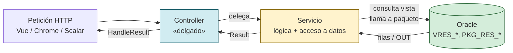
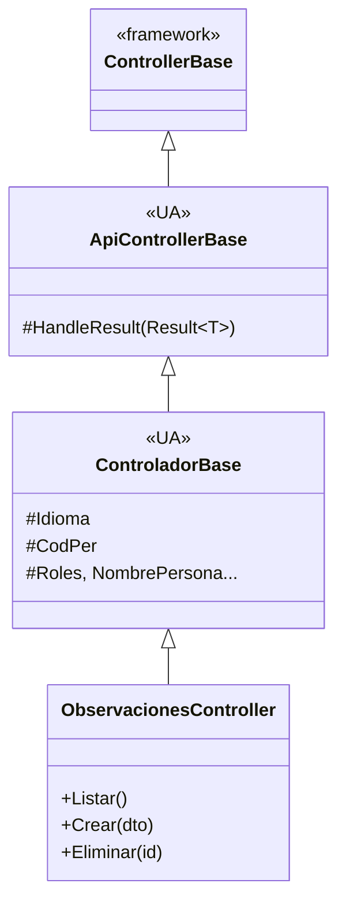
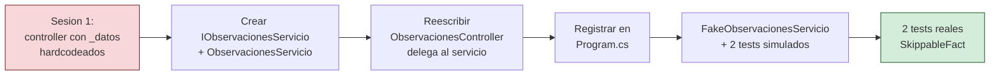
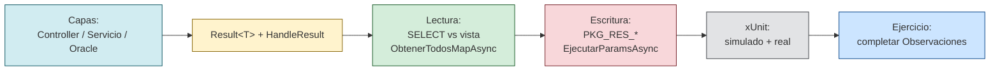

# Sesión 5: Servicios y acceso a Oracle

::: info DE DÓNDE VENIMOS
En la [**sesión 1**](../sesion-07-dtos-apis/) construiste un controlador `ObservacionesController` que devolvía datos hardcodeados. En esta sesión lo conectaremos a Oracle a través de un **servicio**, usando el paquete `PKG_RES_OBSERVACION_RESERVA` que ya tienes en SQL. Al terminar, los mismos botones del `Home.vue` que probabas en clase pasada **traerán datos reales de la base de datos** sin que cambies nada en Vue.
:::

## 5.1 Por qué separamos la lógica en capas

### 5.1.1 Tres capas, tres responsabilidades

Hasta ahora, el controlador hacía dos cosas: **decidir el HTTP** (qué status devolver) y **construir los datos** (el array hardcodeado). Cuando los datos vengan de Oracle, esa segunda parte se hace muy grande. La solución del curso es:



<!-- diagram id="capas-controller-servicio-oracle" caption: "El controlador es la fachada HTTP; el servicio es el corazón funcional; Oracle es la fuente de verdad." -->

| Capa           | Su única misión                                                              | NO debe hacer                                        |
| -------------- | ---------------------------------------------------------------------------- | ---------------------------------------------------- |
| **Controller** | Decidir el HTTP (status code, ProblemDetails) y leer claims del `User`.      | Lógica de negocio, SQL, validaciones de dominio.     |
| **Servicio**   | Lógica de dominio + acceso a datos (vista para leer, paquete para escribir). | Conocer `HttpContext`, `IActionResult`, `Authorize`. |
| **Oracle**     | Integridad, transacción, validación de invariantes.                          | Saber quién es el cliente HTTP.                      |

::: tip BUENA PRÁCTICA — un controlador de buen tamaño es de **una línea por acción**
Después de esta sesión, tus controladores tendrán acciones como:

```csharp
[HttpGet]
public async Task<ActionResult> Listar() =>
    HandleResult(await _observaciones.ObtenerTodosAsync(Idioma));
```

Si una acción ocupa más de 3-4 líneas, casi seguro que está haciendo trabajo del servicio.
:::

### 5.1.2 Inyección de dependencias: la pieza que une todo

La plantilla UA registra `ClaseOracleBd` (la implementación concreta) al llamar a `builder.AddServicesUA()`. **Pero NO registra la interfaz `IClaseOracleBd`**. Como nuestros servicios piden la interfaz por constructor (para poder mockearlos en tests), hay que añadir una línea de "alias" en `Program.cs`:

```csharp
// Program.cs
var builder = WebApplication.CreateBuilder(args);

// 1) La plantilla UA: registra ClaseOracleBd como Transient.
builder.AddServicesUA();

// 2) ALIAS: cualquier servicio que pida IClaseOracleBd recibe la misma
//    instancia de ClaseOracleBd que ya ha registrado la plantilla.
//    No crea conexiones extra: es un descriptor más en el contenedor.
builder.Services.AddTransient<ua.IClaseOracleBd>(sp => sp.GetRequiredService<ua.ClaseOracleBd>());

// 3) Nuestros servicios, registrados contra su interfaz para poder sustituirlos
//    por fakes en tests sin tocar el código de los controladores.
builder.Services.AddScoped<ITiposRecursoServicio, TiposRecursoServicio>();
builder.Services.AddScoped<IRecursosServicio,     RecursosServicio>();
builder.Services.AddScoped<IReservasServicio,     ReservasServicio>();
builder.Services.AddScoped<IObservacionesServicio, ObservacionesServicio>();   // ← lo añadirás hoy
```

::: warning IMPORTANTE — el error que te vas a encontrar si saltas la línea 2

> `Unable to resolve service for type 'ua.IClaseOracleBd' while attempting to activate 'ObservacionesServicio'.`

`builder.Build()` valida en desarrollo todos los constructores. Si tu servicio pide `IClaseOracleBd` y nadie ha registrado esa interfaz, **la app no arranca**. Es el error nº1 al introducir DI sobre la plantilla UA. La solución es exactamente la línea (2).
:::

## 5.2 `Result<T>`: una sola forma de hablar entre capas

### 5.2.1 El problema que resuelve

En la sesión 1 el controlador hacía:

```csharp
[HttpGet("{id:int}")]
public ActionResult ObtenerPorId(int id)
{
    var encontrada = _datosHardcodeados.FirstOrDefault(o => o.Id == id);
    if (encontrada is null)
        return NotFound(new ProblemDetails { Title = "...", Detail = "..." });
    return Ok(encontrada);
}
```

Tres problemas cuando aparezca el servicio real:

- El servicio devolvía `T?` (con `null` = "no existe") y el controlador tenía que adivinarlo.
- El `ProblemDetails` se construía a mano en cada acción — fácil olvidar uno, fácil tener un `Title` distinto.
- Cuando el servicio falle por **otra cosa** (Oracle caído, validación de paquete), el controlador no sabe qué hacer.

Solución: el servicio envuelve siempre su respuesta en `Result<T>`. **Lleva el dato si todo ha ido bien, o un `Error` tipado si no.**

### 5.2.2 Las tres piezas (ya están en el código del curso)

```csharp
// Models/Errors/ErrorType.cs
public enum ErrorType
{
    Failure    = 0,   // -> HTTP 500 (error inesperado)
    Validation = 1,   // -> HTTP 400 (datos inválidos)
    NotFound   = 2    // -> HTTP 404 (recurso no encontrado)
}

// Models/Errors/Error.cs
public record Error(
    string Code,
    string Message,
    ErrorType Type,
    IDictionary<string, string[]>? ValidationErrors = null);

// Models/Errors/Result.cs (esquema simplificado)
public class Result<T>
{
    public bool   IsSuccess { get; }
    public T?     Value     { get; }
    public Error? Error     { get; }

    public static Result<T> Success(T value)        => new(value);
    public static Result<T> Failure(Error error)    => new(error);
    public static Result<T> NotFound(string code, string message) =>
        new(new Error(code, message, ErrorType.NotFound));
    public static Result<T> Validation(string code, string message, IDictionary<string, string[]>? errors = null) =>
        new(new Error(code, message, ErrorType.Validation, errors));
    public static Result<T> Fail(string code, string message) =>
        new(new Error(code, message, ErrorType.Failure));
}
```

### 5.2.3 `ApiControllerBase.HandleResult`: una vez para todo el proyecto

```csharp
// Controllers/Apis/ApiControllerBase.cs
public abstract class ApiControllerBase : ControllerBase
{
    /// <summary>
    /// Convierte Result<T> en respuesta HTTP estándar:
    ///   Success    -> 200 OK con result.Value
    ///   Validation -> 400 ValidationProblemDetails
    ///   NotFound   -> 404 ProblemDetails
    ///   Failure    -> 500 ProblemDetails
    /// </summary>
    protected ActionResult HandleResult<T>(Result<T> result)
    {
        if (result.IsSuccess) return Ok(result.Value);

        var error = result.Error!;
        return error.Type switch
        {
            ErrorType.Validation => ValidationProblem(new ValidationProblemDetails(
                error.ValidationErrors ?? new Dictionary<string, string[]>())
            { Detail = error.Message, Status = StatusCodes.Status400BadRequest }),

            ErrorType.NotFound => NotFound(new ProblemDetails
            { Title = error.Code, Detail = error.Message, Status = StatusCodes.Status404NotFound }),

            _ => Problem(detail: error.Message, title: error.Code,
                         statusCode: StatusCodes.Status500InternalServerError)
        };
    }
}
```

::: info QUÉ DEVUELVE `HandleResult` — la tabla de traducción
`HandleResult` es el único punto del proyecto que convierte un `Result<T>` en respuesta HTTP. Los controladores lo llaman ciegamente y no necesitan interpretar el `Result` por su cuenta:

| `Result<T>` que llega al controlador   | HTTP devuelto               | Body de la respuesta                                       |
| -------------------------------------- | --------------------------- | ---------------------------------------------------------- |
| `Result.Success(valor)`                | `200 OK`                    | El valor serializado como JSON                             |
| `Result.NotFound(code, msg)`           | `404 Not Found`             | `ProblemDetails { Title, Detail, Status: 404 }`            |
| `Result.Validation(code, msg, errors)` | `400 Bad Request`           | `ValidationProblemDetails { errors, Detail, Status: 400 }` |
| `Result.Fail(code, msg)`               | `500 Internal Server Error` | `ProblemDetails { Title, Detail, Status: 500 }`            |

Por eso una acción del controlador se queda en **una sola línea**:

```csharp
public async Task<ActionResult> Listar() =>
    HandleResult(await _tiposRecurso.ObtenerTodosAsync(Idioma));
```

Si el servicio devuelve `Success` → `200 OK` con la lista. Si devuelve `NotFound` → `404` con el mensaje. **El controlador no toma ninguna decisión sobre el HTTP.**
:::

Jerarquía completa de controladores:



<!-- diagram id="jerarquia-controlador" caption: "ApiControllerBase aporta HandleResult; ControladorBase aporta los claims del token; los controladores los heredan los dos." -->

::: tip BUENA PRÁCTICA — qué pasa por dónde

- El **servicio** SIEMPRE devuelve `Result<T>`. Si tiene que decir "no existe", devuelve `Result<T>.NotFound(...)`. NUNCA tira excepciones para flujo normal.
- El **controlador** llama al servicio y pasa el resultado a `HandleResult`. NO interpreta el `Result` a mano.
- Las **excepciones** se reservan para imprevistos reales (Oracle caído, red rota). Un `IExceptionHandler` global las convierte en 500 — pero eso es **sesión 13 (integración)**.
  :::

## 5.3 Lectura: SELECT contra una vista + mapeo automático

### 5.3.1 La fachada: `IClaseOracleBd`

Esta interfaz expone los pocos métodos que el curso necesita. Los más importantes para lectura:

| Método                                          | Para qué                                     | Devuelve                |
| ----------------------------------------------- | -------------------------------------------- | ----------------------- |
| `ObtenerTodosMapAsync<T>(sql, param, idioma)`   | Lista de objetos T mapeados desde el cursor. | `Task<IEnumerable<T>?>` |
| `ObtenerPrimeroMapAsync<T>(sql, param, idioma)` | Un objeto T (o `null` si no hay filas).      | `Task<T?>`              |
| `EjecutarParamsAsync(sql, parametros)`          | Llama a un procedimiento/función PL/SQL.     | `Task`                  |

Las versiones síncronas (`ObtenerTodosMap<T>`, `EjecutarParams`) existen también; en el curso usamos siempre las **async**.

### 5.3.2 Patrón de un servicio "solo lectura"

Lo vemos sobre **`TiposRecursoServicio`** del proyecto del curso, que es la entidad más sencilla (sin joins, sin filtros): un catálogo `TRES_TIPO_RECURSO` con código + nombre multiidioma.

```csharp
// Services/Reservas/TiposRecursoServicio.cs (lecturas)
using System.Data;
using ua;                       // IClaseOracleBd, DynamicParameters
using ua.Models.Errors;         // Result<T>
using ua.Models.Reservas;       // TipoRecursoLectura

namespace uaReservas.Services.Reservas
{
    public class TiposRecursoServicio : ITiposRecursoServicio
    {
        private readonly IClaseOracleBd _bd;
        private readonly ILogger<TiposRecursoServicio> _logger;

        // SIEMPRE leemos por la VISTA, nunca por la tabla.
        // La vista oculta columnas tecnicas y aplica filtros (p.ej. ACTIVO='S').
        private const string VISTA = "CURSONORMADM.VRES_TIPO_RECURSO";

        public TiposRecursoServicio(IClaseOracleBd bd, ILogger<TiposRecursoServicio> logger)
        {
            _bd = bd;
            _logger = logger;
        }

        public async Task<Result<List<TipoRecursoLectura>>> ObtenerTodosAsync(string idioma)
        {
            var idiomaNormalizado = NormalizarIdioma(idioma);

            // ORDER BY NOMBRE_{idioma} -> la columna usada es CULPA del idioma del usuario.
            // Interpolar aqui es seguro porque idiomaNormalizado SOLO puede ser ES/CA/EN
            // (lo decide NormalizarIdioma, no el cliente).
            var sql = $@"
                SELECT ID_TIPO_RECURSO, CODIGO,
                       NOMBRE_ES, NOMBRE_CA, NOMBRE_EN
                  FROM {VISTA}
                 ORDER BY NOMBRE_{idiomaNormalizado}";

            var filas = await _bd.ObtenerTodosMapAsync<TipoRecursoLectura>(
                sql, param: null, idioma: idiomaNormalizado);

            return Result<List<TipoRecursoLectura>>.Success(
                filas?.ToList() ?? new List<TipoRecursoLectura>());
        }

        public async Task<Result<TipoRecursoLectura>> ObtenerPorIdAsync(int idTipoRecurso, string idioma)
        {
            var idiomaNormalizado = NormalizarIdioma(idioma);

            // Parametro nombrado :id. NUNCA concatenar valores del cliente al SQL.
            const string sql = @"
                SELECT ID_TIPO_RECURSO, CODIGO,
                       NOMBRE_ES, NOMBRE_CA, NOMBRE_EN
                  FROM CURSONORMADM.VRES_TIPO_RECURSO
                 WHERE ID_TIPO_RECURSO = :id";

            var fila = await _bd.ObtenerPrimeroMapAsync<TipoRecursoLectura>(
                sql, new { id = idTipoRecurso }, idioma: idiomaNormalizado);

            return fila is null
                ? Result<TipoRecursoLectura>.NotFound(
                    "TIPO_RECURSO_NO_ENCONTRADO",
                    $"No existe un tipo de recurso con id {idTipoRecurso}.",
                    idTipoRecurso)
                : Result<TipoRecursoLectura>.Success(fila);
        }

        // Helper compartido por todos los servicios del curso.
        private static string NormalizarIdioma(string idioma)
        {
            var limpio = (idioma ?? "es").Trim().ToUpperInvariant();
            if (limpio == "VA") limpio = "CA";
            return limpio is "ES" or "CA" or "EN" ? limpio : "ES";
        }
    }
}
```

Tres cosas que se repiten en TODOS los servicios de lectura del curso (mira también `RecursosServicio` y `ReservasServicio`):

| Pieza                                       | Por qué                                                                                                                                                                                |
| ------------------------------------------- | -------------------------------------------------------------------------------------------------------------------------------------------------------------------------------------- |
| Leer de la **vista**, no de la tabla        | La vista oculta columnas técnicas (`FECHA_MODIFICACION`, `USUARIO_MODIFICACION`...) y aplica filtros (`ACTIVO='S'`). Si la regla "qué se ve" cambia, se cambia en la BD, no en .NET.   |
| **`NormalizarIdioma`** antes de tocar SQL   | Filtra el `idioma` del usuario a uno de los tres permitidos (`ES`/`CA`/`EN`). Cualquier otro valor cae a `ES`. Eso permite que la interpolación `ORDER BY NOMBRE_{idioma}` sea segura. |
| **Parámetros nombrados** (`:id`, `:idTipo`) | Toda variable del cliente entra al SQL como parámetro. Nunca concatenación. Es el blindaje contra SQL injection.                                                                       |

::: tip BUENA PRÁCTICA — `RecursosServicio` añade un patrón más
Cuando una vista tiene **muchas columnas**, declara la lista en una constante:

```csharp
private const string COLUMNAS = @"
    ID_RECURSO,
    NOMBRE_ES, NOMBRE_CA, NOMBRE_EN,
    DESCRIPCION_ES, DESCRIPCION_CA, DESCRIPCION_EN,
    GRANULIDAD, DURACION,
    VISIBLE, ATIENDE_MISMA_PERSONA,
    ID_TIPO_RECURSO,
    TIPO_CODIGO,
    TIPO_NOMBRE_ES, TIPO_NOMBRE_CA, TIPO_NOMBRE_EN";

var sql = $@"SELECT {COLUMNAS} FROM {VISTA} ORDER BY NOMBRE_{idiomaNormalizado}";
```

Así `ObtenerTodosAsync`, `ObtenerPorTipoAsync`, `ObtenerPorIdAsync` reutilizan la misma lista y nunca se desincronizan.
:::

::: info CONTEXTO — `ReservasServicio.ObtenerPorFiltroAsync` para WHERE dinámico
Cuando el filtro es **opcional** (varios campos que pueden venir o no), construye un `StringBuilder` para el WHERE y un `DynamicParameters` en paralelo, añadiendo cláusula y parámetro solo si el campo viene relleno. Mira `ReservasServicio:29-72` para el patrón completo.

OJO: el parámetro debe ser `DynamicParameters` (o un objeto anónimo). Un `Dictionary<string, object?>` rompe en `LiberarParametros` con `OracleParameterCollection.RemoveAt "Value does not fall within the expected range"`.
:::

### 5.3.3 El mapeo: PascalCase ⇄ SNAKE_CASE + multiidioma

ClaseOracleBD3 rellena las propiedades del DTO leyendo las columnas que devuelva el cursor. Su orden de resolución:

| Prioridad | Cómo busca la columna                         | Ejemplo                                            |
| --------- | --------------------------------------------- | -------------------------------------------------- |
| 1         | `[Columna("NOMBRE_EXACTO")]` si está presente | `[Columna("IDPER")] int IdPersona` → busca `IDPER` |
| 2         | Nombre exacto                                 | `Email` → busca `EMAIL`                            |
| 3         | Conversión SNAKE_CASE automática              | `FechaAlta` → busca `FECHA_ALTA`                   |

**Y el parámetro `idioma`** rellena propiedades que parecen el nombre raíz de una columna multiidioma:

```csharp
// La vista expone TEXTO_ES, TEXTO_CA, TEXTO_EN.
// Pasando idioma: "CA", ClaseOracleBD3 rellena 'Texto' desde TEXTO_CA.
public string Texto { get; set; } = "";   // se resuelve desde TEXTO_{idioma}
```

Conversiones de tipo automáticas más útiles:

| Oracle                  | .NET                     | Notas                                               |
| ----------------------- | ------------------------ | --------------------------------------------------- |
| `NUMBER`                | `int`, `long`, `decimal` | Elige el tipo según la propiedad C#.                |
| `VARCHAR2`              | `string`                 | Directo.                                            |
| `VARCHAR2(1)` (`S`/`N`) | `bool`                   | `'S'`/`'Y'`/`'1'`/`'SI'` → `true`, resto → `false`. |
| `DATE`, `TIMESTAMP`     | `DateTime`               | Directo.                                            |
| `CLOB`                  | `string`                 | Para textos largos.                                 |

Atributos adicionales:

```csharp
public class Foto
{
    [Columna("IDFOTO")]      public int IdFoto       { get; set; }   // nombre no SNAKE_CASE
    public byte[] Contenido  { get; set; } = [];
    public string TipoMime   { get; set; } = "";

    [IgnorarMapeo]                                                   // NO viene de la BD
    public bool TieneContenido => Contenido.Length > 0;
}
```

::: warning IMPORTANTE — sin `[IgnorarMapeo]` falla
Si tu DTO tiene una propiedad calculada (`get => ...`), **debes marcarla `[IgnorarMapeo]`**. Si no, ClaseOracleBD3 intentará buscar una columna con ese nombre, no la encontrará y lanzará error en la primera lectura.
:::

## 5.4 Escritura: paquetes PL/SQL con OUT params

Las inserciones/actualizaciones/borrados **NO se hacen con SQL inline** en este curso. Se hacen llamando a un paquete PL/SQL que ya hace las validaciones, el `COMMIT` y devuelve el error como dato (no como excepción).

::: info CONTEXTO — un paquete común para validaciones genéricas
Los checks repetitivos (`VALIDAR_TEXTO`, `VALIDAR_ID_POSITIVO`, `VALIDAR_FLAG`) viven en `PKG_RES_VALIDACIONES`. Cada paquete CRUD los llama vía `CURSONORMADM.PKG_RES_VALIDACIONES.VALIDAR_X(...)`. Lo que NO entra ahí son los chequeos de **dominio** específicos (rangos de hora, solape de franjas en reservas...): esos se quedan privados dentro del paquete que los necesita.
:::

### 5.4.1 El contrato de los paquetes UA

Todos los procedimientos de escritura del curso (`PKG_RES_*`) siguen el mismo contrato:

```sql
PROCEDURE CREAR / ACTUALIZAR / ELIMINAR (
    -- ...parámetros de entrada...
    P_ID_GENERADO   OUT NUMBER,       -- solo en CREAR
    P_CODIGO_ERROR  OUT NUMBER,       -- 0 si todo OK, SQLCODE si error
    P_MENSAJE_ERROR OUT VARCHAR2      -- NULL si todo OK, SQLERRM si error
);
```

Por dentro:

```sql
BEGIN
  P_CODIGO_ERROR  := 0;
  P_MENSAJE_ERROR := NULL;

  -- validaciones (RAISE_APPLICATION_ERROR con códigos -20xxx)
  -- INSERT / UPDATE / DELETE
  -- COMMIT
EXCEPTION
  WHEN OTHERS THEN
    ROLLBACK;
    P_CODIGO_ERROR  := SQLCODE;
    P_MENSAJE_ERROR := SQLERRM;
END;
```

::: tip BUENA PRÁCTICA — el paquete absorbe las excepciones
Esto significa que **el cliente .NET NUNCA tiene que poner `try { ... } catch (OracleException) { ... }`**. El paquete absorbe la excepción y la devuelve como datos OUT. La capa .NET lee `P_CODIGO_ERROR` y lo traduce a `Result<T>`.
:::

### 5.4.2 Llamada desde .NET: `EjecutarParamsAsync` + `DynamicParameters`

`ua.DynamicParameters` es el tipo "bolsa de parámetros" que reexporta ClaseOracleBD3. La firma real del método `Add` es:

```csharp
Add(string nombre, object? valor, OracleDbType? tipoBd = null,
    ParameterDirection direccion = ParameterDirection.Input, int tamano = 0)
```

::: warning IMPORTANTE — nombres en CASTELLANO
Los parámetros nombrados son `tipoBd`, `direccion`, `tamano` (no `dbType`, `direction`, `size`). Si copias código de tutoriales genéricos verás `direction:` — **no compila**.

Por la misma razón, `Get` devuelve `object` (no es genérico). Para sacar un `int` o un `string` con tolerancia a `null`/`DBNull`, usa los helpers del proyecto:

```csharp
int      codigo  = ErrorPaquetePlSql.LeerInt   (p, "P_CODIGO_ERROR");
string?  mensaje = ErrorPaquetePlSql.LeerString(p, "P_MENSAJE_ERROR");
int?     idGen   = ErrorPaquetePlSql.LeerIntNullable(p, "P_ID_OBSERVACION_RESERVA");
```

:::

Patrón completo (real, no simplificado) para **`TiposRecursoServicio.CrearAsync`** — el mismo paquete y el mismo `_bd` que veremos en `RecursosServicio.CrearAsync` y `ReservasServicio.CrearAsync`. Es **idéntico** en estructura:

```csharp
// Services/Reservas/TiposRecursoServicio.cs (escrituras)
public async Task<Result<int>> CrearAsync(TipoRecursoCrearDto dto)
{
    // 1) Construye los parametros. NO declaras tipos Oracle: ClaseOracleBD3
    //    infiere OracleDbType desde el tipo .NET de cada valor.
    var p = new DynamicParameters();
    p.Add("P_CODIGO",          dto.Codigo);
    p.Add("P_NOMBRE_ES",       dto.NombreEs);
    p.Add("P_NOMBRE_CA",       dto.NombreCa);
    p.Add("P_NOMBRE_EN",       dto.NombreEn);
    p.Add("P_ID_TIPO_RECURSO", null, direccion: ParameterDirection.Output);
    p.Add("P_CODIGO_ERROR",    null, direccion: ParameterDirection.Output);
    p.Add("P_MENSAJE_ERROR",   null, direccion: ParameterDirection.Output);

    // 2) Llama al procedimiento (esquema.paquete.procedimiento).
    //    El paquete valida, hace INSERT y COMMIT, y rellena los tres OUT.
    await _bd.EjecutarParamsAsync("CURSONORMADM.PKG_RES_TIPO_RECURSO.CREAR", p);

    // 3) Traduce los OUT a Result.Failure si toca, o a Result.Success(id).
    var failure = ErrorPaquetePlSql.AResultFailure<int>(
        ErrorPaquetePlSql.LeerInt   (p, "P_CODIGO_ERROR"),
        ErrorPaquetePlSql.LeerString(p, "P_MENSAJE_ERROR"));
    if (failure is not null) return failure;

    return Result<int>.Success(ErrorPaquetePlSql.LeerInt(p, "P_ID_TIPO_RECURSO"));
}
```

`ActualizarAsync` y `EliminarAsync` son **el mismo patrón** sin el OUT del id generado y devolviendo `Result<bool>`:

```csharp
public async Task<Result<bool>> EliminarAsync(int idTipoRecurso)
{
    var p = new DynamicParameters();
    p.Add("P_ID_TIPO_RECURSO", idTipoRecurso);
    p.Add("P_CODIGO_ERROR",  null, direccion: ParameterDirection.Output);
    p.Add("P_MENSAJE_ERROR", null, direccion: ParameterDirection.Output);

    await _bd.EjecutarParamsAsync("CURSONORMADM.PKG_RES_TIPO_RECURSO.ELIMINAR", p);

    var failure = ErrorPaquetePlSql.AResultFailure<bool>(
        ErrorPaquetePlSql.LeerInt   (p, "P_CODIGO_ERROR"),
        ErrorPaquetePlSql.LeerString(p, "P_MENSAJE_ERROR"));
    return failure ?? Result<bool>.Success(true);
}
```

::: info CONTEXTO — `ReservasServicio.CrearAsync` para ver muchos parámetros
Cuando el procedimiento recibe 10+ parámetros (caso típico de una `RESERVA` con `idRecurso`, `codper`, fechas, horas, observaciones, serie, patrón, excepción...), el patrón es el mismo, solo más largo. Mira `ReservasServicio.cs:91-117`:

- `dto.EsExcepcion ? "S" : "N"` — los `bool` de C# se mapean a `VARCHAR2(1)` `S`/`N`.
- `dto.FechaConfirmacion` (puede ser `null`) viaja como `null` directo, sin escape especial.
- `codper` se pasa **como parámetro propio** (no dentro del DTO): viene del JWT, NUNCA del body.

```csharp
public async Task<Result<int>> CrearAsync(int codper, ReservaCrearDto dto)
{
    var p = new DynamicParameters();
    p.Add("P_ID_RECURSO",      dto.IdRecurso);
    p.Add("P_CODPER",          codper);               // <- del token, no del body
    p.Add("P_FECHA_RESERVA",   dto.FechaReserva);
    p.Add("P_HORA_INICIO",     dto.HoraInicio);
    // ... mas parametros ...
    p.Add("P_ES_EXCEPCION",    dto.EsExcepcion ? "S" : "N");
    p.Add("P_ID_RESERVA",   null, direccion: ParameterDirection.Output);
    p.Add("P_CODIGO_ERROR", null, direccion: ParameterDirection.Output);
    p.Add("P_MENSAJE_ERROR",null, direccion: ParameterDirection.Output);

    await _bd.EjecutarParamsAsync("CURSONORMADM.PKG_RES_RESERVA.CREAR", p);
    // resto identico al patron anterior
}
```

:::

### 5.4.3 Traducción ORA-\* → `Result<T>`

`ErrorPaquetePlSql.DesdeCodigo(codigo, mensaje)` mira el `SQLCODE` y devuelve un `Error` ya clasificado:

| Códigos                                                                      | `ErrorType`  | HTTP        |
| ---------------------------------------------------------------------------- | ------------ | ----------- |
| `0`                                                                          | (éxito)      | 200/201/204 |
| `-20003`, `-20307`, `-20702`                                                 | `NotFound`   | 404         |
| `-20001`, `-20002`, `-20301..-20306`, `-20308`, `-20700`, `-20701`, `-20703` | `Validation` | 400         |
| Cualquier otro                                                               | `Failure`    | 500         |

Cuando añadas un código nuevo en un paquete (`RAISE_APPLICATION_ERROR(-20XYZ, '...')`), recuerda **añadirlo también al `switch` de `ErrorPaquetePlSql.DesdeCodigo`** para que tenga el `ErrorType` correcto.

### 5.4.4 El controlador después de la cirugía: una línea

Así queda `TipoRecursosController` — completo, con los cinco verbos:

```csharp
// Controllers/Apis/TipoRecursosController.cs
[Route("api/[controller]")]
[ApiController]
[Authorize]
[Produces("application/json")]
[Tags("TipoRecursos")]
public class TipoRecursosController : ControladorBase
{
    private readonly ITiposRecursoServicio _tiposRecurso;

    public TipoRecursosController(ITiposRecursoServicio tiposRecurso) =>
        _tiposRecurso = tiposRecurso;

    // ===== LECTURAS =====

    /// <summary>Lista todos los tipos de recurso resueltos al idioma del usuario.</summary>
    [HttpGet]
    [ProducesResponseType<List<TipoRecursoLectura>>(StatusCodes.Status200OK)]
    public async Task<ActionResult> Listar() =>
        HandleResult(await _tiposRecurso.ObtenerTodosAsync(Idioma));

    /// <summary>Devuelve un tipo por su id.</summary>
    [HttpGet("{id:int}")]
    [ProducesResponseType<TipoRecursoLectura>(StatusCodes.Status200OK)]
    [ProducesResponseType<ProblemDetails>(StatusCodes.Status404NotFound)]
    public async Task<ActionResult> ObtenerPorId([FromRoute] int id) =>
        HandleResult(await _tiposRecurso.ObtenerPorIdAsync(id, Idioma));

    // ===== ESCRITURAS =====

    /// <summary>Crea un nuevo tipo de recurso.</summary>
    [HttpPost]
    [ProducesResponseType<int>(StatusCodes.Status201Created)]
    [ProducesResponseType<ValidationProblemDetails>(StatusCodes.Status400BadRequest)]
    public async Task<ActionResult> Crear([FromBody] TipoRecursoCrearDto dto)
    {
        var resultado = await _tiposRecurso.CrearAsync(dto);
        if (!resultado.IsSuccess) return HandleResult(resultado);

        return CreatedAtAction(nameof(ObtenerPorId), new { id = resultado.Value }, resultado.Value);
    }

    /// <summary>Actualiza un tipo de recurso existente.</summary>
    [HttpPut("{id:int}")]
    [ProducesResponseType(StatusCodes.Status204NoContent)]
    [ProducesResponseType<ValidationProblemDetails>(StatusCodes.Status400BadRequest)]
    [ProducesResponseType<ProblemDetails>(StatusCodes.Status404NotFound)]
    public async Task<ActionResult> Actualizar([FromRoute] int id, [FromBody] TipoRecursoActualizarDto dto)
    {
        // Chequeo de coherencia ruta vs body: si no coinciden, 400 con ValidationProblemDetails.
        if (id != dto.IdTipoRecurso)
            return ValidationProblemLocalizado(
                "ID_RUTA_CUERPO_NO_COINCIDE",
                "El id de la ruta no coincide con el del cuerpo.");

        var resultado = await _tiposRecurso.ActualizarAsync(dto);
        if (!resultado.IsSuccess) return HandleResult(resultado);

        return NoContent();
    }

    /// <summary>Borra un tipo de recurso.</summary>
    [HttpDelete("{id:int}")]
    [ProducesResponseType(StatusCodes.Status204NoContent)]
    [ProducesResponseType<ProblemDetails>(StatusCodes.Status400BadRequest)]
    [ProducesResponseType<ProblemDetails>(StatusCodes.Status404NotFound)]
    public async Task<ActionResult> Eliminar([FromRoute] int id)
    {
        var resultado = await _tiposRecurso.EliminarAsync(id);
        if (!resultado.IsSuccess) return HandleResult(resultado);

        return NoContent();
    }
}
```

Cosas a fijarse:

| Pieza                                        | Por qué está ahí                                                                                                                                                                                                                     |
| -------------------------------------------- | ------------------------------------------------------------------------------------------------------------------------------------------------------------------------------------------------------------------------------------ |
| Heredar de **`ControladorBase`**             | Provee `Idioma`, `CodPer`, `Roles`, `ValidationProblemLocalizado(...)`. Cualquier controlador del proyecto lo hereda.                                                                                                                |
| **`HandleResult(...)`**                      | Vive en `ApiControllerBase` (que `ControladorBase` hereda). Traduce `Result<T>` → respuesta HTTP correcta: `200` con valor, `404 ProblemDetails`, `400 ValidationProblemDetails`, etc. Es la **única función que mira el `Result`**. |
| `[ProducesResponseType<T>(...)]`             | Documenta a Scalar / OpenAPI los códigos esperados y los tipos de respuesta. Sin esto, Scalar no sabe qué shape tiene el `200` ni qué errores documentar.                                                                            |
| `[Tags("TipoRecursos")]`                     | Agrupa en la UI de Scalar todos los endpoints bajo una sola pestaña.                                                                                                                                                                 |
| `CreatedAtAction(nameof(ObtenerPorId), ...)` | Devuelve `201` con cabecera `Location: /api/TipoRecursos/{id}` apuntando al recurso recién creado. Es el contrato REST para POST de creación.                                                                                        |

::: info CÓMO FUNCIONA `CreatedAtAction` paso a paso
`nameof(ObtenerPorId)` no construye ninguna URL: solo produce el string `"ObtenerPorId"`. Es `CreatedAtAction` quien, a partir de ese nombre, recorre el sistema de rutas y monta la URL completa:

```
1. Busca la acción "ObtenerPorId" en este controlador
         ↓
2. Lee su plantilla de ruta → [HttpGet("{id:int}")]
         ↓
3. Combina con la ruta del controlador → [Route("api/[controller]")] = "api/TipoRecursos"
         ↓
4. Sustituye {id} con el valor de new { id = resultado.Value }  (p. ej. 42)
         ↓
5. Añade scheme + host de la petición actual
         ↓
   Resultado → Location: https://reservas.ua.es/api/TipoRecursos/42
```

La respuesta HTTP completa que recibe el cliente si Oracle asignó el id `42`:

```
HTTP/1.1 201 Created
Location: https://reservas.ua.es/api/TipoRecursos/42
Content-Type: application/json

42
```

El cuerpo (`42`) es el tercer argumento de `CreatedAtAction`: el id del recurso recién creado. El cliente lo lee directamente sin tener que parsear la cabecera `Location`.

**¿Por qué `nameof` y no el string `"ObtenerPorId"`?**  
Si renombras el método a `ObtenerDetalle`, el compilador avisa del `nameof` roto. Con un string literal, la cabecera `Location` apuntaría a una ruta inexistente en silencio — nadie lo detectaría hasta que un cliente siguiera el enlace y obtuviera `404`.

**¿Por qué `Crear` devuelve `Location` y `Actualizar` no?**

Es el contrato REST estándar:

| Verbo                         | Qué hace                                                   | Respuesta correcta | ¿`Location`?                                                         |
| ----------------------------- | ---------------------------------------------------------- | ------------------ | -------------------------------------------------------------------- |
| `POST /api/TipoRecursos`      | Crea un recurso **nuevo** (id desconocido antes de llamar) | `201 Created`      | **Sí** — el cliente no sabía la URL antes de la llamada              |
| `PUT /api/TipoRecursos/42`    | Actualiza el recurso `42` (id ya conocido en la URL)       | `204 No Content`   | **No** — el cliente ya tiene la URL: la puso él mismo en la petición |
| `DELETE /api/TipoRecursos/42` | Borra el recurso `42`                                      | `204 No Content`   | **No** — ya no existe, una URL no tiene sentido                      |

En el `PUT` el cliente ya sabe exactamente a qué URL pertenece el recurso porque la puso en la ruta (`/api/TipoRecursos/42`). El `Location` solo tiene utilidad cuando el servidor es quien asigna el identificador (el `NEXTVAL` de Oracle en este caso).

**¿Cómo maneja Vue ese `Location`?**

En el proyecto usamos `peticion<T>()` de `@vueua/components/composables/use-axios`. Internamente hace `return response.data`, con lo que **devuelve directamente el cuerpo JSON** — el id `42` — sin exponer cabeceras:

```typescript
import { peticion, verbosAxios } from "@vueua/components/composables/use-axios";

// POST → el body del 201 es el número 42, peticion<number> lo devuelve ya tipado
const nuevoId = await peticion<number>("TipoRecursos", verbosAxios.POST, dto);
// nuevoId === 42

// Usos típicos tras la creación:
await cargarLista(); // recargar la tabla
router.push(`/tipo-recursos/${nuevoId}`); // navegar al detalle
```

La cabecera `Location` **no es accesible** a través de `peticion()`. Para leerla habría que usar la instancia `HttpApi` directamente y acceder a `response.headers['location']`, algo que en el proyecto no hacemos porque el id ya viene en el cuerpo.

La cabecera `Location` es útil para clientes genéricos que siguen el estándar HTTP sin conocer la forma del body: `curl -i`, API gateways, scripts de integración. Para Vue, basta con el body.
:::

::: danger ZONA PELIGROSA — datos del usuario SIEMPRE del token
En `ReservasController.Crear` verás que el controlador llama a `_reservas.CrearAsync(CodPer, dto)` pasando `CodPer` (propiedad de `ControladorBase` leída del JWT) **como argumento aparte del DTO**. Aunque el cliente envíe un campo `codper` en el body, el controlador **no lo usa** — usa el del token. Esto evita que un usuario malicioso cree recursos a nombre de otra persona.
:::

## 5.5 xUnit: primer test del CRUD (referencia a la sesión 21) {#tests-xunit}

El proyecto ya incluye `uaReservas.Tests/` con el patrón completo: tests **simulados** del controlador (con fakes y `UsuarioFake` para suplantar el JWT) y tests **reales** del servicio contra Oracle (con `OracleTestFixture` + `[SkippableFact]` para no romper CI cuando no hay conexión).

El detalle de xUnit — las tres clases de infraestructura (`UsuarioFake`, `FakeTiposRecursoServicio`, `OracleTestFixture`), los tests reales `TipoRecursosControllerSimuladoTests` y `TiposRecursoServicioRealTests`, el `IClassFixture<T>` y los `user-secrets` del proyecto de tests — vive en una sola sesión:

::: tip → Sesión 21 · Tests y calidad de código
[**Ir a la sesión 21**](../../../05-avanzadas/sesiones/sesion-21-tests-calidad/#tests-unitarios-xunit). Anclas clave:

- §21.1.1 — [Tests simulados vs tests reales](../../../05-avanzadas/sesiones/sesion-21-tests-calidad/#_21-1-1-dos-tipos-de-test-que-nos-importan).
- §21.1.2 — [`UsuarioFake`, `FakeTiposRecursoServicio`, fakes sin Moq](../../../05-avanzadas/sesiones/sesion-21-tests-calidad/#_21-1-2-tres-piezas-de-infraestructura-compartidas-entre-tests).
- §21.1.4 — [`OracleTestFixture` con `IClassFixture<T>` y user-secrets de tests](../../../05-avanzadas/sesiones/sesion-21-tests-calidad/#_21-1-4-oracletestfixture-una-conexion-real-a-oracle-compartida).
- §21.1.5 — [Test real con `[SkippableFact]`](../../../05-avanzadas/sesiones/sesion-21-tests-calidad/#_21-1-5-test-real-tiposrecursoserviciorealtests).
:::

Lo mínimo que necesitas saber **para el ejercicio §5.6** que viene a continuación:

- **Test simulado** del controlador → instancia el controller con `new`, le inyecta un fake del servicio y un `ControllerContext` con `UsuarioFake.ConClaims(...)`, asserta `OkObjectResult` / `NotFoundObjectResult` / `ProblemDetails`.
- **Test real** del servicio → hereda `IClassFixture<OracleTestFixture>`, marca los tests con `[SkippableFact]` + `Skip.IfNot(_fixture.HayConexion, ...)`, asserta forma (`IsSuccess`, `Value.Count > 0`, `Error.Type == NotFound`) y **no escribe en BD**.

## 5.6 Ejercicio: cerrar `Observaciones` con servicio + tests

Cierre del ejercicio que arrancaste en [§1.9](../sesion-07-dtos-apis/#_1-9-ejercicio-api-de-observaciones-de-reservas). El controlador `ObservacionesController` con `_datos` hardcodeados se queda obsoleto: lo conectamos a Oracle vía un servicio nuevo, registramos el servicio en DI y añadimos los dos tests del patrón (simulado + real).

### 5.6.1 Punto de partida

Después de la sesión 1 tienes:

- `Models/Reservas/ObservacionReservaLectura.cs` y `ObservacionReservaCrearDto.cs`.
- `Controllers/Apis/ObservacionesController.cs` con la lista estática `_datos`.
- En Oracle (CURSONORMADM): `TRES_OBSERVACION_RESERVA`, `VRES_OBSERVACION_RESERVA`, `PKG_RES_OBSERVACION_RESERVA`.

### 5.6.2 Lo que tienes que entregar hoy



**1. Servicio nuevo** en `Services/Reservas/`:

```
IObservacionesServicio.cs
ObservacionesServicio.cs
```

La interfaz expone cuatro operaciones (siguiendo el patrón de `ITiposRecursoServicio`):

```csharp
public interface IObservacionesServicio
{
    Task<Result<List<ObservacionReservaLectura>>> ObtenerTodosAsync(string idioma);
    Task<Result<ObservacionReservaLectura>>       ObtenerPorIdAsync(int idObs, string idioma);
    Task<Result<int>>                              CrearAsync(int codperAutor, ObservacionReservaCrearDto dto);
    Task<Result<bool>>                             EliminarAsync(int idObs);
}
```

La implementación sigue al pie de la letra los patrones que vimos en §2.3 y §2.4:

- **Lecturas** contra `CURSONORMADM.VRES_OBSERVACION_RESERVA` con `ObtenerTodosMapAsync<T>` / `ObtenerPrimeroMapAsync<T>`. El campo `Texto` se resuelve al idioma del usuario gracias al parámetro `idioma:` (mapea desde `TEXTO_{idioma}`).
- **Escrituras** al paquete `CURSONORMADM.PKG_RES_OBSERVACION_RESERVA.CREAR` / `ELIMINAR` con `EjecutarParamsAsync` + `DynamicParameters`.
- **Cada escritura** pasa por `ErrorPaquetePlSql.AResultFailure<T>(...)` para traducir el OUT `P_CODIGO_ERROR` / `P_MENSAJE_ERROR` a `Result.NotFound` / `Result.Validation` / `Result.Fail` según el código `-20XXX`.

**2. Reescribir `ObservacionesController`** — borrar el `_datos` estático y delegar todo en el servicio:

```csharp
public class ObservacionesController : ControladorBase
{
    private readonly IObservacionesServicio _observaciones;
    public ObservacionesController(IObservacionesServicio observaciones) =>
        _observaciones = observaciones;

    [HttpGet]
    public async Task<ActionResult> Listar() =>
        HandleResult(await _observaciones.ObtenerTodosAsync(Idioma));

    [HttpGet("{id:int}")]
    public async Task<ActionResult> ObtenerPorId([FromRoute] int id) =>
        HandleResult(await _observaciones.ObtenerPorIdAsync(id, Idioma));

    [HttpPost]
    public async Task<ActionResult> Crear([FromBody] ObservacionReservaCrearDto dto)
    {
        // CodperAutor SIEMPRE del JWT (CodPer de ControladorBase), NUNCA del body.
        var resultado = await _observaciones.CrearAsync(CodPer, dto);
        if (!resultado.IsSuccess) return HandleResult(resultado);

        return CreatedAtAction(nameof(ObtenerPorId), new { id = resultado.Value }, resultado.Value);
    }

    [HttpDelete("{id:int}")]
    public async Task<ActionResult> Eliminar([FromRoute] int id)
    {
        var resultado = await _observaciones.EliminarAsync(id);
        if (!resultado.IsSuccess) return HandleResult(resultado);

        return NoContent();
    }
}
```

Los atributos de clase (`[Route]`, `[ApiController]`, `[Authorize]`, `[Tags("Observaciones")]`) y los `[ProducesResponseType<T>(...)]` por acción se mantienen igual que en sesión 1 — Scalar sigue documentándolos.

**3. Registrar el servicio** en `Program.cs`:

```csharp
builder.Services.AddScoped<uaReservas.Services.Reservas.IObservacionesServicio,
                           uaReservas.Services.Reservas.ObservacionesServicio>();
```

Una sola línea, debajo de los `AddScoped` de `TiposRecursoServicio` / `RecursosServicio` / `ReservasServicio`.

**4. Tests simulados** del controlador en `uaReservas.Tests/Controllers/ObservacionesControllerSimuladoTests.cs`, con un `FakeObservacionesServicio` clon del `FakeTiposRecursoServicio` ([§21.1.2](../../../05-avanzadas/sesiones/sesion-21-tests-calidad/#_21-1-2-tres-piezas-de-infraestructura-compartidas-entre-tests)):

- **Test 1**: `Listar` devuelve `OkObjectResult` con la lista del fake.
- **Test 2**: `Crear` pasa el `CodPer` del token (vía `UsuarioFake`) y no el del body — chequeo de seguridad.

**5. Tests reales** del servicio en `uaReservas.Tests/Servicios/ObservacionesServicioRealTests.cs`, usando `OracleTestFixture` + `[SkippableFact]`:

- **Test 1**: `ObtenerTodosAsync("es")` devuelve `Result.Success` y, si hay datos, los campos básicos están rellenos.
- **Test 2**: `ObtenerPorIdAsync(-9999, "es")` devuelve `Result.NotFound` (el id no existe).

**6. Probar en vivo**:

- En Scalar: `Test Request` sobre `GET /api/Observaciones` y `POST /api/Observaciones`. Si el paquete devuelve `-20XXX`, Scalar enseña el `ProblemDetails` / `ValidationProblemDetails` localizado al idioma.
- En `Home.vue`: el botón **`GET /api/Observaciones (ejercicio)`** ahora trae datos reales de Oracle. **Sin tocar Vue**.
- DevTools → Network: cookie `X-Access-Token` viaja sola, `200 OK` con el JSON real.

### 5.6.3 Lista de verificación

| ✅  | Comprobación                                                                                                         |
| --- | -------------------------------------------------------------------------------------------------------------------- |
| ☐   | `IObservacionesServicio.cs` y `ObservacionesServicio.cs` creados en `Services/Reservas/`.                            |
| ☐   | `Program.cs` registra el servicio (línea `AddScoped<IObservacionesServicio, ...>`).                                  |
| ☐   | `ObservacionesController` ya no tiene `_datos` estático — todo delega en el servicio.                                |
| ☐   | `CrearAsync(codperAutor, dto)` recibe el codper por parámetro; el controlador le pasa `CodPer` de `ControladorBase`. |
| ☐   | `dotnet build` sin errores ni warnings nuevos.                                                                       |
| ☐   | Scalar muestra `POST /api/Observaciones` con `ValidationProblemDetails` 400 si los textos van vacíos.                |
| ☐   | `Home.vue → GET /api/Observaciones (ejercicio)` pinta datos reales y devuelve `200`.                                 |
| ☐   | `dotnet test` ejecuta los **dos** tests simulados sin tocar Oracle.                                                  |
| ☐   | Los **dos** tests reales se ejecutan (verde) si hay user-secrets, o se marcan `Skipped` si no.                       |

::: tip BUENA PRÁCTICA — depuración cuando falla el POST
Si al hacer POST en Scalar te llega un 500 sin explicación, **inspecciona el SQL del paquete primero** (`SQLERRM` viaja en `P_MENSAJE_ERROR`, no se pierde):

1. En `ObservacionesServicio`, **antes** de devolver el `Result`, pon un `_logger.LogError("Error PKG OBS: {Codigo} {Mensaje}", ErrorPaquetePlSql.LeerInt(p, "P_CODIGO_ERROR"), ErrorPaquetePlSql.LeerString(p, "P_MENSAJE_ERROR"))`.
2. Vuelve a ejecutar.
3. Lee el log: la causa raíz suele ser un parámetro `IN` mal nombrado, un `NOT NULL` que no se rellena o que el `idReserva` apunta a una reserva que no existe (FK).
   :::

::: details Solución completa (revísala DESPUÉS de intentarlo)
Cuando hayas terminado tu propia versión, compárala con la de referencia:

→ [Solución del ejercicio §5.6](./solucion-ejercicio-observaciones.md)

Incluye los siete ficheros (interfaz, servicio, controlador, registro en `Program.cs`, fake, test simulado, test real), explicación de cada decisión de diseño y el contrato de errores del paquete con la tabla `-20XXX` → `Result<T>`.
:::

## 5.7 Resumen de la sesión



<!-- diagram id="resumen-sesion2" caption: "El flujo de la sesión: de las capas al ejercicio, pasando por Result<T>, lectura, escritura y tests." -->

| Concepto                  | Dónde se aplica en `uaReservas`                                           |
| ------------------------- | ------------------------------------------------------------------------- |
| Capas                     | `Controllers/Apis/*`, `Services/Reservas/*`, `Models/*`                   |
| `Result<T>`               | `Models/Errors/Result.cs`, devuelto por **todos** los servicios.          |
| `HandleResult`            | `Controllers/Apis/ApiControllerBase.cs`. Una sola implementación reusada. |
| Lectura                   | `ObtenerTodosMapAsync<T>` contra `VRES_*`.                                |
| Escritura                 | `EjecutarParamsAsync` contra `PKG_RES_*` con `DynamicParameters`.         |
| Traducción de errores     | `Models/Errors/ErrorPaquetePlSql.cs` — un `switch` por código ORA.        |
| Inyección de dependencias | `Program.cs` con la línea "alias" `IClaseOracleBd → ClaseOracleBd`.       |
| Tests                     | `uaReservas.Tests/` con fakes a mano y `SkippableFact` para los reales.   |

---

## Tarea progresiva del proyecto final {#tarea-pf}

::: tip MÓDULO 1 · TIPO DE RECURSO — PASO 4 (SERVICIO ORACLE)
En tu rama `tiporecurso-<nombre>`, sustituye el CRUD en memoria por un servicio real:

- Crea `ITiposRecursoServicio` + `TiposRecursoServicio` con `ClaseOracleBD3`.
- Lectura contra `VRES_TIPO_RECURSO` con `ObtenerTodosMapAsync<TipoRecursoLectura>`.
- Escritura contra `PKG_RES_TIPO_RECURSO.CREAR / ACTUALIZAR / ELIMINAR` con `DynamicParameters` y `P_CODIGO_ERROR / P_MENSAJE_ERROR`.
- Convierte los errores Oracle con `ErrorPaquetePlSql.AResultFailure(...)` antes de devolver el `Result<T>`.

El controlador **no cambia**: sigue siendo el de la sesión 1, solo pasa a usar el nuevo servicio vía DI.

**Adelanto del módulo 2 (Recurso)**: empieza a pensar en los campos de auditoría (`FECHA_CREACION`, `CODPER_CREADOR`). En la sesión 11 leeremos `CodPer` del JWT; aquí basta con dejarlos como columnas en la tabla.

Mapa completo: [Proyecto final del curso](../../../06-proyecto-final/).
:::

---

## Tests y práctica IA

- [Ver tests y práctica de la sesión](../../test/sesion-2/)
- [Autoevaluación sesión 2](../../test/sesion-2/autoevaluacion.md)
- [Preguntas de test sesión 2](../../test/sesion-2/preguntas.md)
- [Respuestas del test sesión 2](../../test/sesion-2/respuestas.md)

---

---

<!-- NAV:START -->

| Anterior                                                                             | Inicio                        | Siguiente                                                                                                           |
| ------------------------------------------------------------------------------------ | ----------------------------- | ------------------------------------------------------------------------------------------------------------------- |
| [← Sesión 4: Modelos y primer API](../../../02-dotnet/sesiones/sesion-04-dtos-apis/) | [Índice del curso](../../../) | [Sesión 5: Vue 3, TypeScript y primer componente →](../../../03-vue/sesiones/sesion-06-vue-typescript-fundamentos/) |

<!-- NAV:END -->
