# Sesiones 4 y 5: Modelos, primer API y acceso a Oracle

[[toc]]

::: info ¿Para quién es este material?
Este documento sirve a **dos sesiones consecutivas**: la 4 (Modelos y primer API) y la 5 (Servicios y acceso a Oracle). Está pensado para gente con perfiles muy distintos: desde quien lleva años con Oracle PL/SQL pero nunca ha tocado HTTP, hasta quien viene de ASP clásico, WebForms o MVC y nunca ha trabajado con SPAs. Por eso vamos despacio y conceptualmente al principio, y luego entramos al detalle.
:::

## 0. Pre-requisitos del curso

Antes de programar nada hay que tener el equipo preparado para **descargar paquetes**. La preparación del entorno (Git, SSH, NuGet, npm/pnpm, VS Code, etc.) **está toda recogida en una guía aparte**, que conviene tener delante:

::: tip GUÍA DE INSTALACIÓN
👉 [**Configuración del entorno de desarrollo en Windows** (00-preparacion)](../../../00-preparacion/index.md)

Hay dos sistemas de paquetes y cada uno se configura en su sitio:

| Lado     | Gestor       | Fichero a tocar                                   | Sección                                        |
| -------- | ------------ | ------------------------------------------------- | ---------------------------------------------- |
| **.NET** | NuGet        | `%APPDATA%\NuGet\NuGet.Config`                    | "Configuración de NuGet" en 00-preparacion     |
| **Vue**  | npm / pnpm   | `%USERPROFILE%\.npmrc`                            | "Configuración de npm — registro privado"      |

Recibiréis un correo con el contenido exacto de `NuGet.Config` y las instrucciones para generar el PAT del `.npmrc`. **Asegúrate de tener ambos ficheros funcionando antes de continuar con esta sesión.**
:::

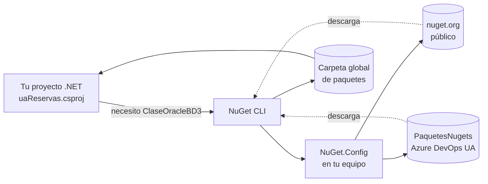

<!-- diagram id="flujo-paquetes" caption: "El proyecto declara dependencias; la herramienta consulta los feeds configurados y descarga." -->

### 0.1 Comandos npm/pnpm útiles para el día a día

Aunque la configuración del registro privado vive en `00-preparacion`, sí merece la pena tener a mano los comandos que vais a usar **todo el curso**, especialmente para vigilar las versiones de los paquetes UA con scope `@vueua`.

```powershell
# Restaurar todo lo declarado en package.json (equivalente a "dotnet restore")
pnpm install

# Comprobar quién soy contra el feed privado (verifica que el PAT funciona)
npm whoami --registry=https://servidortfs.campus.ua.es/tfs/Desarrollo/ComponentesVue/_packaging/ServidorNPM/npm/registry/

# Ver paquetes desactualizados — filtrando SOLO los nuestros (scope @vueua)
pnpm outdated "@vueua/*"

# Listar todas las versiones publicadas de un paquete UA
pnpm view @vueua/plantilla-core versions

# Actualizar todos los @vueua a la última versión compatible
pnpm update "@vueua/*"

# Saber qué versión tengo instalada localmente
pnpm list @vueua/plantilla-core
```

::: tip BUENA PRÁCTICA — el patrón "scope"
Nuestros paquetes propios viven bajo el scope **`@vueua`** (p. ej. `@vueua/plantilla-core`, `@vueua/useaxios`). Eso permite filtrar comandos `npm/pnpm` para que actúen **solo sobre los nuestros** sin tocar `vue`, `axios`, `pinia` u otras dependencias públicas. `pnpm outdated "@vueua/*"` es el comando que vais a ejecutar cada lunes para detectar paquetes UA con nueva versión.
:::

::: warning IMPORTANTE — los feeds privados requieren red campus
Tanto el feed NuGet UA como el feed npm UA están **dentro de la red de la UA**. Si trabajas desde casa sin VPN, los comandos anteriores fallarán con timeouts o `404`.
:::

### 0.2 Inicializar los paquetes NuGet del proyecto

Una vez tienes el `NuGet.Config` global apuntando a los feeds UA (ver `00-preparacion`), el paso siguiente es **decirle a tu proyecto qué paquetes necesita**. Esto se hace **dentro del `.csproj`**: cada NuGet del que dependes aparece como una línea `<PackageReference>`.

#### Dónde se declaran (dentro del `.csproj`)

Este es el bloque real de `uaReservas.csproj` con los paquetes UA del curso:

```xml
<!-- Paquetes de la plantilla UA -->
<ItemGroup>
  <PackageReference Include="PlantillaMVCCore.Configuracion"   Version="1.0.4"   />
  <PackageReference Include="PlantillaMVCCore.Idioma"          Version="1.0.4"   />
  <PackageReference Include="PlantillaMVCCore.Plantilla"       Version="1.1.4"   />
  <PackageReference Include="PlantillaMVCCore.Errores"         Version="1.1.0"   />
  <PackageReference Include="PlantillaMVCCore.Identificacion"  Version="1.0.8.2" />
  <PackageReference Include="PlantillaMVCCore.Seguridad"       Version="1.0.15"  />
  <PackageReference Include="ClaseToken"                       Version="1.0.18.8"/>
</ItemGroup>

<!-- Paquetes UA de uso directo en el código propio -->
<ItemGroup>
  <PackageReference Include="ClaseOracleBD3" Version="1.1.7.5" />
  <PackageReference Include="ClaseCorreo2"   Version="1.0.15.3"/>
</ItemGroup>

<!-- Infraestructura ASP.NET / Scalar / Swashbuckle -->
<ItemGroup>
  <PackageReference Include="Microsoft.AspNetCore.Authentication.JwtBearer" Version="10.0.7" />
  <PackageReference Include="Scalar.AspNetCore"        Version="2.14.11" />
  <PackageReference Include="Swashbuckle.AspNetCore"   Version="10.1.7"  />
  <!-- ... -->
</ItemGroup>
```

#### Cómo añadirlos a un proyecto nuevo

Tienes **tres formas equivalentes**. Usa la que prefieras: todas terminan escribiendo lo mismo en el `.csproj`.

##### 1) CLI con `dotnet add package` (recomendado)

Desde la carpeta del proyecto (donde vive el `.csproj`):

```powershell
# Plantilla UA (los esenciales)
dotnet add package PlantillaMVCCore.Configuracion
dotnet add package PlantillaMVCCore.Idioma
dotnet add package PlantillaMVCCore.Plantilla
dotnet add package PlantillaMVCCore.Errores
dotnet add package PlantillaMVCCore.Identificacion
dotnet add package PlantillaMVCCore.Seguridad
dotnet add package ClaseToken

# Acceso a Oracle y correo
dotnet add package ClaseOracleBD3
dotnet add package ClaseCorreo2

# Para fijar una versión concreta (útil cuando hay breaking changes)
dotnet add package ClaseOracleBD3 --version 1.1.7.5
```

Cada comando consulta los feeds en el orden del `NuGet.Config` y escribe un `<PackageReference>` con la última versión compatible. Al terminar puedes hacer `dotnet restore` (normalmente se ejecuta solo).

##### 2) Visual Studio — "Administrar paquetes NuGet"

1. Clic derecho sobre el proyecto en el Explorador de soluciones → **Administrar paquetes NuGet**.
2. En el desplegable **Origen del paquete** (arriba a la derecha), selecciona **`PaquetesNugets`** (el feed UA en Azure DevOps).
3. Busca el paquete (p. ej. `ClaseOracleBD3`), elige versión y pulsa **Instalar**.
4. VS modifica el `.csproj` por ti y restaura.

::: tip BUENA PRÁCTICA
Si el desplegable de orígenes no muestra los feeds UA, revisa que el `NuGet.Config` global tiene `<activePackageSource>` apuntando a `PaquetesNugets` y reinicia Visual Studio.
:::

##### 3) Editar el `.csproj` a mano

Abrir el `.csproj` y añadir la línea `<PackageReference>` directamente. Luego:

```powershell
dotnet restore
```

Esto es lo que hacen las dos formas anteriores por debajo. Es perfectamente válido y, para ediciones pequeñas, suele ser el camino más rápido.

#### Verificar y actualizar

```powershell
# Lista los paquetes declarados en este proyecto
dotnet list package

# Lista paquetes con nueva versión disponible (incluye transitivos)
dotnet list package --outdated

# Actualiza UN paquete a la última versión compatible
dotnet add package ClaseOracleBD3   # sin --version: última estable

# Quitar un paquete
dotnet remove package ClaseCorreo2
```

::: info CONTEXTO — paquetes "directos" vs "transitivos"
En el `.csproj` declaras solo los paquetes que **tu código** usa directamente. NuGet resuelve sus dependencias (transitivos) automáticamente: por ejemplo, al añadir `PlantillaMVCCore.Plantilla` se bajan también las dependencias internas que esa plantilla necesita. Solo aparecen en el `.csproj` los **directos**; los transitivos se ven con `dotnet list package --include-transitive`.
:::

::: warning IMPORTANTE — fijar versiones en producción
En proyectos serios fijamos versión exacta (`Version="1.1.7.5"`) en lugar de dejar la flotante. Una actualización transitiva inesperada (por ejemplo de la plantilla UA) puede romper un despliegue. **El curso usa versiones fijas a propósito.**
:::

### 0.3 Configuración y secretos: `appsettings.json` + `dotnet user-secrets`

Una aplicación .NET necesita **configuración**: cadenas de conexión a Oracle, claves de API, URLs, contraseñas de servidor de correo... Todo eso se guarda en **`appsettings.json`** (y sus variantes por entorno). Pero hay una regla de oro:

::: danger ZONA PELIGROSA — secretos en git
**Nunca, nunca, nunca pongas contraseñas, tokens, claves privadas o cadenas de conexión completas en `appsettings.json`**. Ese fichero se sube a git. Si lo commiteas con secretos, **estarán para siempre en el historial**, aunque después los borres. La gente externa puede clonar el repo, leer el historial y robarlos.

La solución es **user-secrets**: un fichero JSON paralelo que vive en tu equipo, fuera del proyecto, y que NUNCA se commitea. .NET lo lee automáticamente en modo desarrollo.
:::

#### Cómo funciona en una sola foto

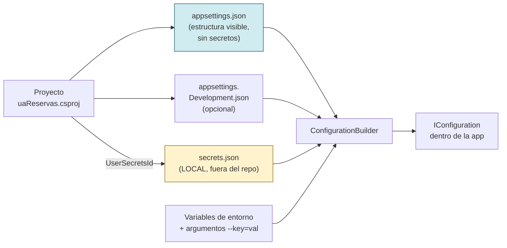

<!-- diagram id="flujo-config-dotnet" caption: "El ConfigurationBuilder fusiona varias fuentes; las secretas viven fuera del repo." -->

**Orden de prioridad** (lo que llega último gana): `appsettings.json` → `appsettings.{Entorno}.json` → **user-secrets** → variables de entorno → argumentos de línea de comandos.

#### Estructura habitual de `appsettings.json`

Este es el `appsettings.json` real de `uaReservas` (resumido). Fíjate en lo que **SÍ** está y lo que **NO**:

```json
{
  "Logging": {
    "LogLevel": { "Default": "Information" }
  },
  "AllowedHosts": "*",
  "App": {
    "Version": "1.0.0",
    "DirApp": "/uaReservas",
    "IdApp": "PRU_MVC",
    "NombreApp": "Plantilla UACloud"
  },
  "JwtConfig": {
    "MinutosValidez": "30",
    "UrlBase": "https://www.ua.es",
    "IdApp": "TOKENTP"
  },
  "Authentication": {
    "CAS": {
      "ProtocolVersion": 3,
      "ServerUrlBase": "https://casdesa.cpd.ua.es/cas"
    }
  },
  "ConnectionStrings": {
    "oradb": ""
  }
}
```

::: tip BUENA PRÁCTICA — qué SÍ va aquí
- **Configuración no sensible**: URLs, identificadores de aplicación, niveles de log, rutas base.
- **La estructura** (las claves): `ConnectionStrings:oradb` aparece, pero **el valor está vacío**. Es un "hueco" que cada desarrollador rellena en su user-secrets.
- **Valores por defecto inocuos**: rangos numéricos, flags booleanos, valores de display.
:::

::: danger qué NO va aquí
- Contraseñas, tokens PAT, claves privadas.
- Cadenas de conexión Oracle completas (`User Id=...;Password=...;...`).
- Direcciones de servidor de correo con credenciales.
- Tokens JWT pre-firmados, claves de cifrado.
:::

#### Activar user-secrets en un proyecto

```powershell
# Desde la carpeta del .csproj. Esto modifica el csproj añadiendo
# <UserSecretsId>GUID-aleatorio</UserSecretsId>
dotnet user-secrets init --project uaReservas
```

Tras esto, el `.csproj` tiene una línea como:

```xml
<PropertyGroup>
  <UserSecretsId>a1b2c3d4-e5f6-7890-abcd-ef1234567890</UserSecretsId>
</PropertyGroup>
```

Ese GUID identifica el fichero de secretos del proyecto. **El csproj sí se commitea**, pero el GUID solo apunta a un fichero que está **en tu equipo, fuera del repo**.

#### La cadena de conexión real del curso

Para todo el curso usamos el **esquema de aplicación `CURSONORMWEB`** sobre la base de datos de test. Sus parámetros son:

| Campo          | Valor                                                  |
| -------------- | ------------------------------------------------------ |
| Host           | `laguar-n1-vip.cpd.ua.es`                              |
| Puerto         | `1521`                                                 |
| Service Name   | `ORACTEST.UA.ES`                                       |
| Usuario        | `CURSONORMWEB`                                         |
| Contraseña     | `O8XN"mA(Ij3U\SMCW-O5`                                 |

La cadena de conexión completa, en formato Oracle Managed Data Access con descriptor TNS embebido, queda así:

```text
Data Source=(DESCRIPTION=(ADDRESS=(PROTOCOL=TCP)(HOST=laguar.cpd.ua.es)(PORT=1521))(LOAD_BALANCE=yes)(CONNECT_DATA=(SERVER=DEDICATED)(SERVICE_NAME=ORACTEST.UA.ES)));User ID=CURSONORMWEB;Password=O8XN"mA(Ij3U\SMCW-O5; Connection Lifetime=240; pooling=false
```

::: danger ZONA PELIGROSA — la contraseña tiene `"` y `\`, no escapes a mano
La contraseña real (`O8XN"mA(Ij3U\SMCW-O5`) contiene **comilla doble** y **barra invertida**, dos de los caracteres que peor lleva PowerShell entre comillas dobles. Intentar pasarla "en línea" entre `"..."` con `\"` y `\\` por dentro **es fuente garantizada de bugs**: PowerShell no usa `\` como escape (el escape es backtick `` ` ``), así que `\\` son dos barras literales y `\"` ni siquiera se interpreta como esperarías.

**Truco clave**: en PowerShell, lo que va entre **comillas simples** `'...'` se trata **literal** — `"`, `\`, `$`, paréntesis... no necesitan escape. Solo no puedes meter una `'` literal por dentro (no es nuestro caso).
:::

#### Añadir el secreto en PowerShell (la forma que funciona)

Desde la carpeta del proyecto `uaReservas` (la que contiene `uaReservas.csproj`), pega estas DOS líneas. Es la receta más simple y robusta:

```powershell
$cadena = 'Data Source=(DESCRIPTION=(ADDRESS=(PROTOCOL=TCP)(HOST=laguar.cpd.ua.es)(PORT=1521))(LOAD_BALANCE=yes)(CONNECT_DATA=(SERVER=DEDICATED)(SERVICE_NAME=ORACTEST.UA.ES)));User ID=CURSONORMWEB;Password=O8XN"mA(Ij3U\SMCW-O5;Connection Lifetime=240;pooling=false'

dotnet user-secrets set "ConnectionStrings:oradb" $cadena
```

##### Cómo funciona, paso a paso

1. **Línea 1 — la cadena entre comillas simples (`'...'`).**
   Todo lo de dentro es literal. Las `"` y las `\` se guardan tal cual, sin escapado. La cadena se asigna a la variable `$cadena`.
2. **Línea 2 — pasamos la variable al comando.**
   `dotnet user-secrets set` recibe dos argumentos: la clave (`"ConnectionStrings:oradb"`) y el valor (`$cadena`). PowerShell expande `$cadena` y lo pasa **sin modificar** como un único argumento.
3. **No hace falta `--project`** si estás dentro de la carpeta del `.csproj`. Si no, añade `--project .\uaReservas\uaReservas.csproj`.

::: tip BUENA PRÁCTICA — pega siempre en dos líneas
Si tu terminal pega todo en una sola línea (algunos terminales lo hacen), divide manualmente con **Enter** después de la primera comilla de cierre `'`. Comprueba que `$cadena` queda en la primera línea entera y que `dotnet user-secrets set` está sola en la segunda.
:::

::: info CONTEXTO — alternativa con here-string (`@'...'@`)
Si la cadena fuese **muy larga** o llevase varias líneas, otra opción es un here-string single-quoted:

```powershell
$cadena = @'
Data Source=(DESCRIPTION=(ADDRESS=(PROTOCOL=TCP)(HOST=laguar.cpd.ua.es)(PORT=1521))(LOAD_BALANCE=yes)(CONNECT_DATA=(SERVER=DEDICATED)(SERVICE_NAME=ORACTEST.UA.ES)));User ID=CURSONORMWEB;Password=O8XN"mA(Ij3U\SMCW-O5;Connection Lifetime=240;pooling=false
'@
dotnet user-secrets set "ConnectionStrings:oradb" $cadena
```

Reglas del here-string que **te van a hacer perder media hora si las saltas**:
- `@'` tiene que ir **solo en su línea**, con un **Enter inmediatamente detrás** (no puede haber nada más en esa misma línea — PowerShell dará "No characters are allowed after a here-string header but before the end of the line").
- `'@` de cierre tiene que ir **solo en su línea** y **en la columna 0** (sin espacios ni tabuladores delante).
- El contenido va **entre** ambas marcas, en líneas propias.

Para una cadena de una sola línea, la versión con `'...'` de arriba es más simple y menos frágil — úsala salvo que tengas saltos de línea reales.
:::

#### Listar, quitar y limpiar secretos

```powershell
# Otro ejemplo de clave anidada (no se usa en esta sesión pero conviene tenerla).
# Sin comillas internas problemáticas: una sola línea entre comillas dobles vale.
dotnet user-secrets set "ClaseCorreo:Password" "lacontraseñadelservidor"

# ─── LISTAR todos los secretos del proyecto ───
dotnet user-secrets list

# ─── QUITAR un secreto concreto ───
dotnet user-secrets remove "ConnectionStrings:oradb"

# ─── QUITAR TODOS los secretos del proyecto (con cuidado) ───
dotnet user-secrets clear
```

::: tip BUENA PRÁCTICA — verifica que ha quedado bien
Después de `set`, ejecuta `dotnet user-secrets list` y compara byte a byte:

```text
ConnectionStrings:oradb = Data Source=(DESCRIPTION=(ADDRESS=(PROTOCOL=TCP)(HOST=laguar.cpd.ua.es)(PORT=1521))(LOAD_BALANCE=yes)(CONNECT_DATA=(SERVER=DEDICATED)(SERVICE_NAME=ORACTEST.UA.ES)));User ID=CURSONORMWEB;Password=O8XN"mA(Ij3U\SMCW-O5;Connection Lifetime=240;pooling=false
```

La contraseña debe aparecer **literal** como `O8XN"mA(Ij3U\SMCW-O5`. Si ves `\"`, `\\` o caracteres extra, es que PowerShell ha tocado el valor: vuelve a guardarlo con el here-string.
:::

::: info CONTEXTO — desde qué carpeta lo ejecutas y `--project`
- **Dentro de `uaReservas/`** (la del `.csproj`): omite `--project`. Es lo más cómodo.
- **Desde una carpeta de arriba**: añade `--project .\uaReservas\uaReservas.csproj` (apuntando al fichero `.csproj`, no solo al nombre de la carpeta).
- **Error típico** — `The file '...\uaReservas\uaReservas' does not exist`: estabas dentro de `uaReservas/` y has puesto `--project uaReservas` por inercia, así que dotnet busca `uaReservas\uaReservas`. Quita el `--project` o pasa el `.csproj` con su ruta completa.
:::

::: info CONTEXTO — `appsettings.json` deja el "hueco"
El `appsettings.json` de `uaReservas` declara la clave pero **vacía**:

```json
"ConnectionStrings": {
  "oradb": ""
}
```

El valor real lo aporta el user-secrets en desarrollo, o variables de entorno en preproducción/producción. Así el fichero del repo nunca tiene credenciales.
:::

#### El mismo secreto en el proyecto de tests

El proyecto `uaReservas.Tests` también necesita la cadena para los tests REALES contra Oracle. **Es un proyecto distinto, así que tiene su propio `UserSecretsId` y su propio fichero de secretos**:

```powershell
# Activar user-secrets en el proyecto de tests
dotnet user-secrets init --project uaReservas.Tests

# Misma cadena (esquema CURSONORMWEB sobre ORACTEST)
dotnet user-secrets set "ConnectionStrings:oradb" "Data Source=(DESCRIPTION=(ADDRESS=(PROTOCOL=TCP)(HOST=laguar.cpd.ua.es)(PORT=1521))(LOAD_BALANCE=yes)(CONNECT_DATA=(SERVER=DEDICATED)(SERVICE_NAME=ORACTEST.UA.ES)));User ID=CURSONORMWEB;Password=O8XN\"mA(Ij3U\\SMCW-O5; Connection Lifetime=240; pooling=false" --project uaReservas.Tests
```

Si no configuras esto, los tests REALES (los que tocan Oracle) se marcarán como **skipped** vía `[SkippableFact]` y la suite seguirá pasando. Los tests SIMULADOS (con fakes) no necesitan ningún secreto.

::: info CONTEXTO — ¿hace falta poner el secreto en cada proyecto que use Oracle?
**No.** Con la inyección de dependencias el secreto solo se necesita **donde se construye `IClaseOracleBd`**, es decir, **en el proyecto host** (el que arranca el `WebApplication`).

- En la app web `uaReservas`, el `Program.cs` lee `ConnectionStrings:oradb` y registra `IClaseOracleBd` en el contenedor. Cualquier `Services/` o `Controllers/` que pida `IClaseOracleBd` por constructor recibe esa instancia ya configurada. **No leen ni necesitan ver el secreto.**
- El proyecto `uaReservas.Tests` es un **host distinto** (xUnit construye su propio `ServiceProvider` para los tests REALES), por eso necesita su propio user-secrets. Pero **solo ahí**.

Conclusión: si añades un proyecto de tipo "biblioteca de clases" (`.csproj` sin `Program.cs`), no le pongas user-secrets. Ese código se ejecuta dentro de la app o de los tests; el secreto se inyecta hacia él, no se lee.
:::

::: info CONTEXTO — ¿dónde se guardan físicamente?
Cuando ejecutas `dotnet user-secrets set`, el secreto se guarda en un fichero JSON en:

- **Windows**: `%APPDATA%\Microsoft\UserSecrets\<UserSecretsId>\secrets.json`
- **Linux/macOS**: `~/.microsoft/usersecrets/<UserSecretsId>/secrets.json`

Puedes abrirlo con un editor y verlo en crudo (`notepad %APPDATA%\Microsoft\UserSecrets\a1b2...\secrets.json`). El contenido es JSON plano, exactamente con la misma estructura que `appsettings.json`.
:::

#### Cómo lo lee la aplicación

En `Program.cs`, la plantilla UA hace algo así (resumido):

```csharp
var builder = WebApplication.CreateBuilder(args);

// Esto es lo que CreateBuilder hace por defecto, pero merece la pena verlo:
// builder.Configuration.AddJsonFile("appsettings.json", optional: false);
// builder.Configuration.AddJsonFile($"appsettings.{Environment}.json", optional: true);
// if (env.IsDevelopment())
//     builder.Configuration.AddUserSecrets<Program>();
// builder.Configuration.AddEnvironmentVariables();
// builder.Configuration.AddCommandLine(args);
```

Y luego, en cualquier servicio inyectas `IConfiguration` y lees:

```csharp
public class MiServicio
{
    private readonly string _cadenaOracle;

    public MiServicio(IConfiguration configuracion)
    {
        // .NET fusiona appsettings.json (estructura) + user-secrets (valor real)
        // y devuelve la cadena resuelta.
        _cadenaOracle = configuracion.GetConnectionString("oradb")
                        ?? throw new InvalidOperationException(
                            "Falta ConnectionStrings:oradb en user-secrets");
    }
}
```

::: warning IMPORTANTE — user-secrets SOLO en desarrollo
`AddUserSecrets()` se activa **solo cuando `ASPNETCORE_ENVIRONMENT=Development`**. En staging, preproducción y producción los secretos vienen de **variables de entorno** o de un gestor centralizado (Azure Key Vault, secrets manager del servidor, etc.). En la UA, los entornos de despliegue ponen las variables vía el pipeline.

Esto significa que en tu equipo local todo se lee de user-secrets, pero en el servidor de preproducción nadie tiene que tocar ese fichero.
:::

#### Aplicado al proyecto de tests (lo que ya hicimos)

El proyecto `uaReservas.Tests` que veremos construir más adelante usa user-secrets **igual** que la app principal:

```powershell
# 1) Activar user-secrets en el proyecto de tests
dotnet user-secrets init --project uaReservas.Tests

# 2) Añadir la cadena de conexión al esquema de TEST
dotnet user-secrets set "ConnectionStrings:oradb" "User Id=...;Password=...;Data Source=..." --project uaReservas.Tests

# 3) Verificar
dotnet user-secrets list --project uaReservas.Tests
```

Si no configuras esto, los tests que tocan Oracle se marcarán como **skipped** (con `[SkippableFact]`) y la suite seguirá pasando.

#### Resumen — los seis comandos que te vas a aprender

| Comando                                            | Para qué                                                |
| -------------------------------------------------- | -------------------------------------------------------- |
| `dotnet user-secrets init --project X`             | Activa user-secrets en el proyecto (añade `UserSecretsId`). |
| `dotnet user-secrets set "Clave:Anidada" "valor"`  | Añade o actualiza un secreto.                           |
| `dotnet user-secrets list`                          | Lista todos los secretos del proyecto.                  |
| `dotnet user-secrets remove "Clave:Anidada"`       | Quita un secreto concreto.                              |
| `dotnet user-secrets clear`                         | Quita TODOS los secretos del proyecto.                  |
| `notepad %APPDATA%\Microsoft\UserSecrets\<id>\secrets.json` | Abre el fichero a pelo (Windows).               |

::: tip BUENA PRÁCTICA — diagnóstico rápido
Si una conexión falla con "ORA-01017 invalid username/password" o un secreto parece "no llegar":

1. Ejecuta `dotnet user-secrets list --project X` para confirmar que el secreto está donde tú crees.
2. Verifica que el entorno es `Development`: `echo $env:ASPNETCORE_ENVIRONMENT`.
3. Si depuras en Visual Studio, abre la pestaña **Manage User Secrets** (clic derecho en el proyecto) — es el mismo fichero pero con GUI.
:::

### 0.4 Repaso exprés de la sesión 3 (lo que vamos a usar enseguida)

Antes de meternos en modelos y APIs, recordamos brevemente lo que ya se vio en la sesión 3 y que vamos a usar **inmediatamente**. Si algo no te suena, pregunta antes de avanzar.

#### Inyección de dependencias con un servicio real

`ClaseOracleBd` (de `ClaseOracleBD3`) es un servicio. **No lo creamos con `new`**: lo registramos en `Program.cs` **contra su interfaz** `IClaseOracleBd` y lo recibimos por constructor donde haga falta. Eso es **inyección de dependencias**.

##### 1) Registro en `Program.cs`

En la plantilla UA `builder.AddServicesUA()` ya registra Oracle por nosotros, **pero solo registra la clase concreta `ClaseOracleBd` (como `Transient`)**, no la interfaz. Si nuestros servicios piden `IClaseOracleBd` por constructor (recomendado para poder mockearlos en xUnit), tenemos que añadir nosotros el "alias" interfaz → concreta. Hacerlo en una línea es la diferencia entre tener tests baratos o no tenerlos:

```csharp
// Program.cs
var builder = WebApplication.CreateBuilder(args);

// 1) La plantilla UA lee ConnectionStrings:oradb de configuración (user-secrets)
//    y registra ClaseOracleBd como Transient.
builder.AddServicesUA();

// 2) "Alias": cualquier servicio que pida IClaseOracleBd recibe la misma instancia
//    de ClaseOracleBd que ya ha registrado la plantilla. NO duplica conexiones:
//    es solo un descriptor mas en el contenedor de DI que reenvia al original.
builder.Services.AddTransient<IClaseOracleBd>(sp => sp.GetRequiredService<ClaseOracleBd>());

// 3) Nuestros propios servicios, registrados contra su interfaz para poder
//    sustituirlos por fakes en tests sin tocar el codigo de los controladores.
builder.Services.AddScoped<ITiposRecursoServicio, TiposRecursoServicio>();
builder.Services.AddScoped<IRecursosServicio,     RecursosServicio>();
```

::: warning IMPORTANTE — si te falla con `Unable to resolve service for type 'ua.IClaseOracleBd'`
Es exactamente este caso: `AddServicesUA()` te ha registrado **solo** la clase concreta, pero tu servicio depende de la interfaz. Añade la línea (2) y se arregla. Es uno de los errores más típicos al introducir DI sobre la plantilla UA.
:::

::: tip BUENA PRÁCTICA — registrar SIEMPRE contra la interfaz
Pedir `IClaseOracleBd` en el constructor (en lugar de `ClaseOracleBd` a secas) es **lo que nos abre la puerta a los tests**: cuando llegue xUnit, en lugar de la implementación real podremos registrar un fake que devuelve datos en memoria, **sin tocar el controlador**. El controlador siempre recibe "algo que implementa `IClaseOracleBd`"; en producción es Oracle, en tests es un fake.
:::

##### 2) Consumo por constructor en un servicio

Cualquier servicio que necesite Oracle lo pide por constructor:

```csharp
public class TiposRecursoServicio : ITiposRecursoServicio
{
    private readonly IClaseOracleBd _bd;

    // El framework inspecciona el constructor, ve que pide IClaseOracleBd,
    // y le pasa la instancia registrada (Oracle real en prod, fake en tests).
    public TiposRecursoServicio(IClaseOracleBd bd)
    {
        _bd = bd;
    }

    public Task<List<TipoRecursoLectura>> ObtenerTodosAsync(string idioma) =>
        _bd.ObtenerTodosMapAsync<TipoRecursoLectura>(
            "SELECT * FROM VRES_TIPO_RECURSO", null, idioma);
}
```

##### 3) Cómo lo aprovecha xUnit (adelanto)

Cuando lleguemos a tests, el patrón será exactamente este:

```csharp
// En producción:    Controller -> IRecursosServicio (real) -> IClaseOracleBd (real) -> Oracle
// En test SIMULADO: Controller -> FakeRecursosServicio (en memoria) — ni siquiera tocamos IClaseOracleBd
// En test REAL:     Servicio real -> IClaseOracleBd (real) -> esquema Oracle de TEST
```

Porque registramos contra interfaces, **sustituir cualquier eslabón es cambiar una sola línea** del registro. Sin DI, esto sería un infierno de `new` repartidos por todas partes.

::: info CONTEXTO — ¿por qué no `new ClaseOracleBd()`?
Porque entonces cada servicio crearía su propia conexión, no podríamos compartir transacciones, no podríamos sustituirla por una versión "fake" en tests, y no podríamos cambiar la implementación en producción sin tocar todos los sitios. La DI lo arregla: **pide la abstracción, deja que el framework decida la implementación concreta**.
:::

#### Interfaces: la base de tests y mantenibilidad

Una clase **depende de una interfaz**, no de una implementación concreta. Esto permite:

- En **producción**: inyectar la clase real (`ClaseOracleBd`).
- En **tests**: inyectar una implementación falsa que devuelve datos pre-programados.
- En el **futuro**: cambiar la implementación sin tocar a quien la usa.

```csharp
public interface IClaseRecursos
{
    Task<bool> ExisteYEstaActivoAsync(int idRecurso);
}

public class ClaseRecursos : IClaseRecursos { /* ... */ }
public class ClaseRecursosFake : IClaseRecursos { /* devuelve siempre true */ }
```

#### Ciclos de vida: `AddTransient`, `AddScoped`, `AddSingleton`

| Ciclo          | ¿Cuántas instancias?                          | Cuándo usarlo                                            |
| -------------- | ---------------------------------------------- | --------------------------------------------------------- |
| `AddTransient` | **Una nueva** cada vez que alguien lo pide.    | Servicios pequeños, sin estado, baratos.                  |
| `AddScoped`    | **Una por petición HTTP.** Compartido dentro.  | El típico. Servicios con datos por petición (idioma, BD). |
| `AddSingleton` | **Una en toda la app.** Compartida por todos.  | Configuración, cachés, recursos caros. **Cuidado: si guarda estado mutable, lo comparten todos los usuarios.** |

En el curso usamos casi siempre `AddScoped` para servicios y `AddSingleton` para configuración.

#### C# que vas a ver enseguida

Cinco piezas de C# moderno que aparecen continuamente. Para cada una mostramos **cómo se escribiría antes** (estilo C# 5/6, como en MVC clásico) y **cómo se escribe ahora**, para que se vea que el código nuevo hace exactamente lo mismo, solo que más corto y más seguro.

##### `switch` como expresión + pattern matching

```csharp
// AHORA (C# 8+): switch es una EXPRESIÓN que devuelve un valor.
// Cada rama compara un patrón (tipo, valor, condición) y devuelve un resultado.
return obj switch
{
    null              => "vacío",                  // si obj es null
    string s          => $"texto: {s}",            // si obj es string, lo "captura" en s
    int n when n > 0  => $"positivo: {n}",         // si es int Y cumple la condición
    _                 => "otro"                    // comodín: cualquier otra cosa
};

/*  ANTES (estilo MVC clásico): la misma lógica con if/else encadenados
    y casts manuales. Era más largo, más repetitivo, y se olvidaban casos.

    string resultado;
    if (obj == null)
    {
        resultado = "vacío";
    }
    else if (obj is string)
    {
        string s = (string)obj;
        resultado = "texto: " + s;
    }
    else if (obj is int && (int)obj > 0)
    {
        int n = (int)obj;
        resultado = "positivo: " + n;
    }
    else
    {
        resultado = "otro";
    }
    return resultado;
*/
```

::: info CONTEXTO — qué hace REALMENTE `switch` como expresión
1. Evalúa `obj` **una sola vez**.
2. Recorre las ramas **en orden** hasta encontrar una que case (no hay `break`, no hay fall-through).
3. Devuelve directamente el valor de la rama que casa. Si ninguna casa y no hay `_`, el compilador avisa.

El compilador convierte esto en `if/else` por debajo, así que no es magia: es **azúcar sintáctico** que te ahorra escribir 25 líneas.
:::

##### Null-conditional (`?.`), null-coalescing (`??`), null-conditional assignment

```csharp
// AHORA (C# 6+ y C# 14)
// 1) Encadenar accesos sin que peten si hay un null por el camino:
var nombre = persona?.Direccion?.Calle ?? "(sin dirección)";
//           └──┬──┘ └──┬─────┘ └──┬──┘    └────────┬────────┘
//              │       │         │                 └─ valor por defecto si TODO el chain dio null
//              │       │         └─ si Direccion es null, devuelve null aquí (no peta)
//              │       └─ si persona es null, devuelve null aquí (no peta)
//              └─ punto de entrada

// 2) Null-conditional ASSIGNMENT (C# 14): asignar solo si el objeto NO es null
persona?.Nombre = "Pepe";   // si persona es null, no hace nada (no peta)

/*  ANTES: el mismo código defensivo a mano. Cada `?.` era un `if` distinto.

    string nombre;
    if (persona != null && persona.Direccion != null && persona.Direccion.Calle != null)
    {
        nombre = persona.Direccion.Calle;
    }
    else
    {
        nombre = "(sin dirección)";
    }

    if (persona != null)
    {
        persona.Nombre = "Pepe";
    }
*/
```

::: info CONTEXTO — qué hace REALMENTE
- `?.` **corta la cadena**: si el operando izquierdo es `null`, devuelve `null` inmediatamente sin evaluar el resto (no lanza `NullReferenceException`).
- `??` devuelve el **operando izquierdo si no es null**, y el derecho en caso contrario. Útil para "valor por defecto".
- `?.=` (C# 14) hace `if (x != null) x.Prop = valor;` en una sola línea. Antes había que escribir el `if` siempre.
:::

##### Records

```csharp
// AHORA (C# 9+): un record es una clase inmutable con igualdad por valor.
// Una sola línea declara propiedades, constructor, igualdad, GetHashCode y ToString.
public record DireccionDto(string Calle, int Numero, string Ciudad);

// Uso:
var d1 = new DireccionDto("Av. Universidad", 1, "Alicante");
var d2 = new DireccionDto("Av. Universidad", 1, "Alicante");
bool iguales = (d1 == d2);   // true: compara por VALOR de las propiedades, no por referencia

/*  ANTES: la misma clase requería 30+ líneas: constructor manual, override Equals,
    GetHashCode, ToString, y propiedades de solo lectura. Errores típicos: olvidar
    actualizar Equals al añadir una propiedad, o no implementar GetHashCode.

    public class DireccionDto
    {
        public string Calle  { get; }
        public int    Numero { get; }
        public string Ciudad { get; }

        public DireccionDto(string calle, int numero, string ciudad)
        {
            Calle  = calle;
            Numero = numero;
            Ciudad = ciudad;
        }

        public override bool Equals(object obj) {  ...  }
        public override int  GetHashCode()      {  ...  }
        public override string ToString()       {  ...  }
    }
*/
```

##### Tuplas (solo para retornos internos)

```csharp
// AHORA (C# 7+): devolver varios valores de un método interno sin definir una clase.
private (bool ok, string mensaje) Validar(int edad) =>
    edad >= 18
        ? (true,  "OK")
        : (false, "Menor de edad");

// Uso: descomposición directa en variables locales
var (ok, mensaje) = Validar(20);

/*  ANTES: o devolvías una clase ad-hoc (Resultado), o usabas `out` parameters.

    public bool Validar(int edad, out string mensaje)
    {
        if (edad >= 18) { mensaje = "OK";             return true;  }
        else            { mensaje = "Menor de edad";  return false; }
    }

    // En el caller:
    string mensaje;
    bool ok = Validar(20, out mensaje);
*/
```

::: warning IMPORTANTE — tuplas SOLO para uso interno
Las tuplas son perfectas para retornos privados. **NO las uses en una API pública**: el cliente JSON recibiría `{ "Item1": true, "Item2": "OK" }` en lugar de nombres significativos. En las APIs siempre devolvemos un DTO/record con propiedades nombradas.
:::

---

## 1.0 Antes de tocar código: cómo se hablan .NET y Vue {#arquitectura}

::: warning IMPORTANTE — lee esta sección entera
Esta es **la sección que casi nadie entiende del todo** y de la que dependen todas las demás. Antes de escribir un DTO, antes de crear un endpoint, antes de hacer una llamada `llamadaAxios`, hay que tener clarísimo **qué pasa entre el navegador del usuario y la API .NET**. Si esto no se entiende, el resto del curso es magia (y la magia se rompe la primera vez que algo va mal).
:::

### 1.0.1 La foto grande: una sola aplicación, dos motores

Una app UA típica como `uaReservas` parece que tiene **un solo dominio** (`https://miapp.ua.es/uaReservas`), pero por dentro funcionan **dos motores** sobre el mismo proceso ASP.NET Core:

| Motor    | Sirve                                                  | URL típica                            |
| -------- | ------------------------------------------------------ | ------------------------------------- |
| **MVC**  | La página inicial (`Home/Index.cshtml`), el `_Layout`. | `GET /uaReservas/`                    |
| **API**  | Endpoints JSON consumidos por Vue.                     | `GET /uaReservas/api/Recursos`        |

Como **comparten dominio**, **comparten cookies**. Esa es la pieza clave: la cookie que la parte MVC deja escrita la API la lee sin más, sin CORS, sin `Authorization: Bearer`, sin `localStorage`.

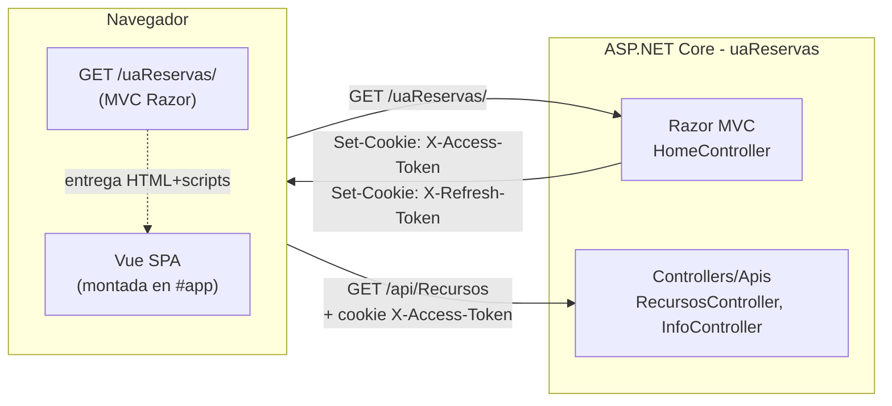

<!-- diagram id="arquitectura-mvc-vue" caption: "Una sola app: MVC entrega Vue, Vue consume la API. Ambos comparten cookies." -->

### 1.0.2 Paso a paso: del clic en el enlace al primer JSON

Esta es la secuencia completa desde que un usuario abre la app hasta que Vue pinta el primer dato:

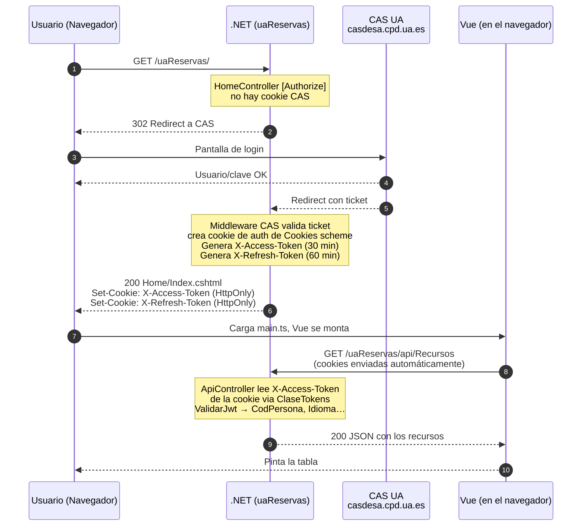

<!-- diagram id="flujo-cas-jwt-vue" caption: "Secuencia completa: CAS, generación de JWT, montaje de Vue, llamada autenticada." -->

### 1.0.3 Pieza por pieza, con código real de `uaReservas`

#### A. El "interruptor" general en `Program.cs`

Toda la cadena CAS + cookies + JWT + plantilla la activa **una sola línea**:

```csharp {6,18,21}
// Program.cs
var builder = WebApplication.CreateBuilder(args);

builder.Services.AddViteServices();

builder.AddServicesUA();        // ← (1) Registra CAS, JWT, ClaseTokens, plantilla...

builder.Services.AddControllersWithViews(options => {
    options.Filters.Add(typeof(GestionLayoutFilter));
});

var app = builder.Build();

app.UseRouting();
app.UsePreServicesUA();         // ← (2) Antes de auth: setup de la plantilla

app.UseAuthentication();        // ← (3) Aquí actúa CAS y se generan los JWT
app.UseAuthorization();

app.UseServicesUA(app.Environment.IsDevelopment());   // (4) Middleware UA
```

| #   | Pieza                          | Qué hace                                                                                                    |
| --- | ------------------------------ | ----------------------------------------------------------------------------------------------------------- |
| (1) | `builder.AddServicesUA()`      | Registra el **scheme de cookies** + el **scheme de CAS** + `ClaseTokens` en el contenedor de DI.            |
| (2) | `app.UsePreServicesUA()`       | Prepara estado de la plantilla antes de la autenticación.                                                  |
| (3) | `UseAuthentication`            | **El núcleo**: detecta que falta cookie → 302 a CAS. Cuando vuelve, valida ticket, escribe **3 cookies**.   |
| (4) | `app.UseServicesUA(...)`       | Cierra la inicialización (filtros UI, idioma, etc.).                                                       |

#### B. La página de entrada: `HomeController` con `[Authorize]`

```csharp
// Controllers/HomeController.cs
[Authorize]                          // ← obliga a estar autenticado
public class HomeController : Controller
{
    public IActionResult Index() => View();
}
```

Si no hay cookie de autenticación, el middleware **devuelve un 302 a CAS** automáticamente. El usuario nunca llega a `Index()` sin estar identificado.

#### C. Las tres cookies que se quedan en el navegador

Cuando CAS confirma la identidad, el servidor responde con **`Set-Cookie`** para tres cookies (de ahí en adelante el navegador las envía solas en cada petición al mismo dominio):

| Cookie                    | Quién la pone           | Para qué sirve                                  | TTL típico |
| ------------------------- | ----------------------- | ----------------------------------------------- | ---------- |
| `.AspNetCore.Cookies`     | Middleware Cookies      | Sesión MVC (saber que estás logueado en CAS)    | Sesión     |
| **`X-Access-Token`**      | `ClaseTokens` (al login) | **JWT corto** que las APIs validan en cada call | 30 min     |
| **`X-Refresh-Token`**     | `ClaseTokens` (al login) | JWT largo que **regenera** el access caducado   | 60 min     |

Las tres cookies son **HTTP-only** (las pone el servidor, el navegador las envía solas en cada petición). El código JS de Vue **no las lee directamente**: simplemente al hacer una llamada API, el navegador adjunta las cookies que corresponden al dominio.

#### D. Cómo Razor "lanza" Vue

Tras la autenticación, `Home/Index.cshtml` se renderiza. Su único trabajo es **cargar los scripts de Vite/Vue** y dejar un `<div id="app">` donde Vue se montará. A partir de ese momento, **Vue manda en el DOM** y el navegador es quien adjunta las cookies en cada llamada a la API.

#### E. Vue llama a la API y la cookie viaja sola

El cliente HTTP que usamos (`vueua-useaxios`) está pre-configurado para que el navegador adjunte las cookies del dominio en cada petición. **Vue no toca el token**: simplemente hace `llamadaAxios("Recursos", verbosAxios.GET)` y el navegador se encarga del resto.

#### F. La API lee la cookie e identifica al usuario (y sus roles)

**La validación del token NO se hace en cada controlador**: hay un **middleware** que se ejecuta antes que tu acción, lee la cookie `X-Access-Token`, valida la firma del JWT y vuelca todos los claims en una propiedad llamada `User` que está disponible **en cualquier controlador**.

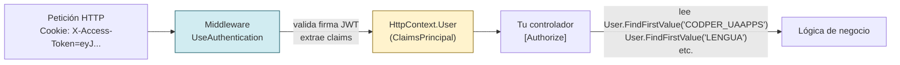

<!-- diagram id="middleware-user-claims" caption: "El middleware valida y rellena User antes de tu controlador. Tú solo lees claims." -->

::: tip BUENA PRÁCTICA — NO valides el token a mano
Si ves código antiguo con `_tokens.ValidarJwt(token)` dentro de cada acción, sácalo de ahí. Eso es **trabajo del middleware**. Tu controlador solo necesita:

1. El atributo `[Authorize]` en la clase (o en la acción).
2. Leer los claims que necesite desde `User`.

Si el token es inválido o ha caducado, el middleware **ya ha devuelto 401** antes de que tu código se ejecute. Cuando llegas a leer `User`, el usuario está garantizado.
:::

##### Una clase base que centraliza el acceso a `User`

Como casi todos los controladores necesitan los mismos claims (codper, idioma, roles, nombre...), creamos un **`ControladorBase`** del que heredan todos los demás. Así no se repite el `User.FindFirst("...")` en mil sitios.

```csharp
// Controllers/Apis/ControladorBase.cs
using System.Security.Claims;
using Microsoft.AspNetCore.Mvc;
using ua;

namespace uaReservas.Controllers.Apis
{
    /// <summary>
    /// Clase base de todos los controladores API.
    /// Lee los claims de User (rellenado por el middleware) y los expone
    /// como propiedades cómodas: CodPer, Idioma, NombrePersona, Roles, etc.
    /// </summary>
    public class ControladorBase : ControllerBase
    {
        private const string ClaimPathFoto    = "PATHFOTO";
        private const string ClaimRoles       = "ROLES";
        private const string ClaimDniConLetra = "DNICONLETRA";
        private const string ClaimDniSinLetra = "DNISINLETRA";

        // Helper genérico para leer cualquier claim con valor por defecto.
        private string ObtenerClaim(string tipo, string valorPorDefecto) =>
            User.FindFirst(tipo)?.Value ?? valorPorDefecto;

        /// <summary>
        /// Código de persona (CODPER) del usuario autenticado.
        /// -1 si el claim no existe o no es entero.
        /// </summary>
        protected int CodPer
        {
            get
            {
                string codperStr = User.CodPer();   // extensión que lee CODPER_UAAPPS
                return int.TryParse(codperStr, out var codper) ? codper : -1;
            }
        }

        /// <summary>
        /// Idioma del usuario desde el claim LENGUA. Normaliza "va" → "ca".
        /// Devuelve "es" por defecto.
        /// </summary>
        protected string Idioma
        {
            get
            {
                string idioma = User.Idioma();
                return idioma == "va" ? "ca" : idioma;
            }
        }

        protected string PathFoto       => ObtenerClaim(ClaimPathFoto, string.Empty);
        protected string NombrePersona  => User.Nombre();
        protected string DniConLetra    => User.LeerClaim(ClaimDniConLetra) ?? string.Empty;
        protected string DniSinLetra    => User.LeerClaim(ClaimDniSinLetra) ?? string.Empty;
        protected string Correo         => User.Correo() ?? string.Empty;

        /// <summary>
        /// Roles del usuario. El claim ROLES viene como string "rol1,rol2;rol3".
        /// </summary>
        protected List<string> Roles
        {
            get
            {
                string rolesRaw = User.LeerClaim(ClaimRoles) ?? string.Empty;
                if (string.IsNullOrWhiteSpace(rolesRaw)) return new List<string>();

                return rolesRaw
                    .Split(new[] { ',', ';' }, StringSplitOptions.RemoveEmptyEntries)
                    .Select(r => r.Trim())
                    .ToList();
            }
        }
    }
}
```

::: info CONTEXTO — los métodos `User.CodPer()`, `User.Idioma()`, `User.Nombre()`...
Son **métodos de extensión** que vienen con la plantilla UA (`using ua;`). Por debajo no hacen nada exótico: son envoltorios sobre `User.FindFirst("CODPER_UAAPPS")`, `User.FindFirst("LENGUA")`, etc. Existen para que el nombre del claim no aparezca como string mágico repartido por toda la app.
:::

##### Añadir tus propios claims al token

Si tu aplicación necesita un dato del usuario que no viene por defecto (por ejemplo, un permiso específico de tu app, o el centro al que pertenece), **se añade declarando el claim en `appsettings.json`**. La plantilla UA lo leerá y lo incluirá en el JWT al hacer login.

::: tip BUENA PRÁCTICA — claims propios
La sección que controla qué columnas se inyectan como claim vive en `appsettings.json` bajo la configuración de la plantilla UA (busca por nombres como `ClaimsExtra`, `ClaimsAdicionales` o equivalente en tu proyecto activo). Mira el proyecto de ejemplo del curso para ver la sintaxis exacta — cada proyecto la tiene levemente distinta porque los claims dependen de a qué tablas de personal/aplicaciones se quiera unir el login.
:::

##### Un controlador típico, heredando de `ControladorBase`

```csharp
// Controllers/Apis/InfoController.cs
[Route("api/[controller]")]
[ApiController]
[Authorize]                       // ← obliga a estar autenticado. Si no, 401 automático.
public class InfoController : ControladorBase
{
    /// <summary>
    /// Devuelve los datos del usuario actual, todos sacados del token
    /// vía la clase base. NUNCA se reciben del body.
    /// </summary>
    [HttpGet("UsuarioActual")]
    public IActionResult UsuarioActual()
    {
        // Todos estos vienen de User (rellenado por el middleware).
        // El cliente JS NO envía nada de esto: lo lee el servidor del JWT.
        return Ok(new
        {
            codPer        = CodPer,            // del claim CODPER_UAAPPS
            nombre        = NombrePersona,     // del claim NOMPER
            idioma        = Idioma,            // del claim LENGUA (con va→ca)
            correo        = Correo,            // del claim correspondiente
            dniConLetra   = DniConLetra,
            roles         = Roles,             // del claim ROLES, ya parseado a lista
            pathFoto      = PathFoto
        });
    }
}
```

Y un ejemplo de cómo se usa el `User` en una lógica real:

```csharp
[HttpGet("MisReservas")]
public async Task<IActionResult> MisReservas()
{
    // El servidor decide POR EL TOKEN de qué usuario son las reservas a devolver.
    // Aunque alguien intente meter ?codPer=999 en la URL, lo ignoramos.
    var reservas = await _reservas.ObtenerPorUsuarioAsync(CodPer, Idioma);
    return Ok(reservas);
}

[HttpPost("Aprobar/{idReserva:int}")]
public async Task<IActionResult> Aprobar(int idReserva)
{
    // Comprobación de rol sin hardcodear strings repartidos:
    if (!Roles.Contains("RESERVAS_ADMIN"))
        return Forbid();

    await _reservas.AprobarAsync(idReserva, aprobadoPor: CodPer);
    return NoContent();
}
```

Esto es la clave de lo que vimos en 1.2: **`CODPER`, idioma, roles y datos personales se obtienen del token en el servidor, jamás del payload que envía Vue**. Aunque un usuario malicioso intente enviar `codPer=999` en el body, el servidor lo ignora — usa el de `User`.

#### G. Refresco automático

`X-Access-Token` dura 30 minutos. Cuando caduca, `ClaseTokens` lo regenera automáticamente usando el `X-Refresh-Token` (60 minutos). El usuario no se entera: solo vuelve a CAS cuando **ambos** tokens han caducado.

### 1.0.4 Consecuencias prácticas que vas a aplicar todo el curso

::: tip BUENA PRÁCTICA — reglas que se derivan de esta arquitectura
1. **El `CODPER` se lee del token, NUNCA del body.** Patrón: `_tokens.ValidarJwt(...).CodPersona`. Lo verás en cada controlador del curso.
2. **El idioma viene del token, no de un querystring.** Igual que el `CODPER`: nada que decida quién eres o qué ves debe llegar desde el cliente.
3. **Los roles también vienen del token** (claim `ROLES`). Para decidir si un usuario puede hacer algo, consulta el token, no un campo del DTO.
4. **Mismo dominio = no necesitas CORS abierto.** El `app.UseCors(dominioUA)` solo abre `*.ua.es`. Llamadas desde fuera (Postman, otro dominio) no llevan la cookie y reciben 401.
5. **Los nombres son fijos.** `X-Access-Token` y `X-Refresh-Token` están en `ClaseTokens.APPTOKEN` y `ClaseTokens.REFRESHTOKEN`. Nunca los hardcodees.
:::

### 1.0.6 La idea más importante: son DOS apps. Si el token muere, se hace el silencio

::: danger LEE ESTO DESPACIO
Si vienes de MVC clásico, tu intuición es que **una app = un proceso = una sesión**. Con la nueva arquitectura **eso ya NO es así**. Una app UA moderna son **dos aplicaciones que se hablan por HTTP**:

- **App nº 1**: Vue corriendo dentro del navegador del usuario.
- **App nº 2**: .NET corriendo en el servidor.

Lo único que las une es una **cookie con un token dentro**. Si ese token muere y no se renueva, las dos apps se **dejan de hablar** y la pantalla se queda muda. No hay magia. No hay redirección automática. No hay "perder sesión" como en MVC.

**El 70 % de los bugs de "no me carga la pantalla" en aplicaciones nuevas son exactamente esto.**
:::

#### Compara el modelo mental

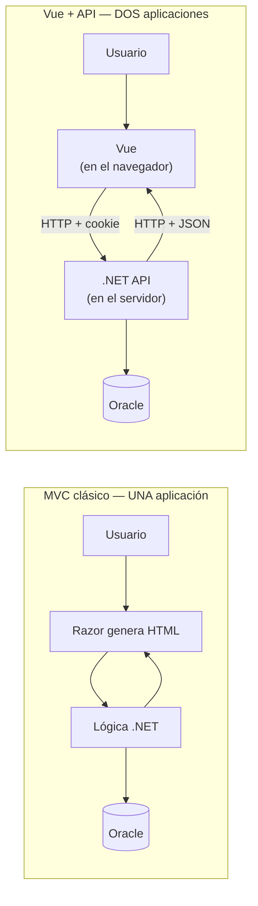

<!-- diagram id="modelo-mental-mvc-vs-spa" caption: "MVC era una sola app que renderizaba HTML. Vue+API son dos apps que dialogan por HTTP." -->

| Aspecto                | MVC clásico                                 | Vue + API moderna                                                          |
| ---------------------- | ------------------------------------------- | -------------------------------------------------------------------------- |
| **Procesos**           | UNO (.NET).                                  | DOS (.NET en servidor + JS en navegador).                                  |
| **Estado del usuario** | `Session` en memoria del servidor.          | **Solo lo que diga el token JWT** en cada petición.                        |
| **Si caducas**         | `[Authorize]` redirige a CAS automático.    | La llamada axios devuelve **401**. **Vue tiene que reaccionar**, nadie lo hace por ti. |
| **Quién pinta la UI**  | El servidor (Razor genera HTML).            | El navegador (Vue genera DOM en JS).                                       |
| **Cuándo se rompe**    | Cuando el servidor se cae.                   | Cuando el servidor se cae **O cuando el token muere** y nadie lo renueva.  |

#### Línea de tiempo de un token (y de su muerte)

```mermaid
gantt
    title Vida útil de los tokens JWT (con valores por defecto UA)
    dateFormat  HH:mm
    axisFormat %H:%M

    section X-Access-Token
    Vivo (válido en API)        :done,  acc,  10:00, 30m
    CADUCADO                    :crit, accm, after acc, 90m

    section X-Refresh-Token
    Vivo (regenera el access)   :done,  ref,  10:00, 60m
    CADUCADO                    :crit, refm, after ref, 60m

    section Estado del usuario
    Vue ↔ API funciona          :active, ok1, 10:00, 60m
    Auto-renovación silenciosa  :milestone, m1, 10:30, 0m
    LLAMADAS A API = 401        :crit, fail, 11:00, 60m
```

<!-- diagram id="ciclo-vida-tokens" caption: "Vida del APPTOKEN (30 min) y del REFRESHTOKEN (60 min). A partir de minuto 60, todas las llamadas fallan con 401." -->

#### Qué pasa en cada tramo

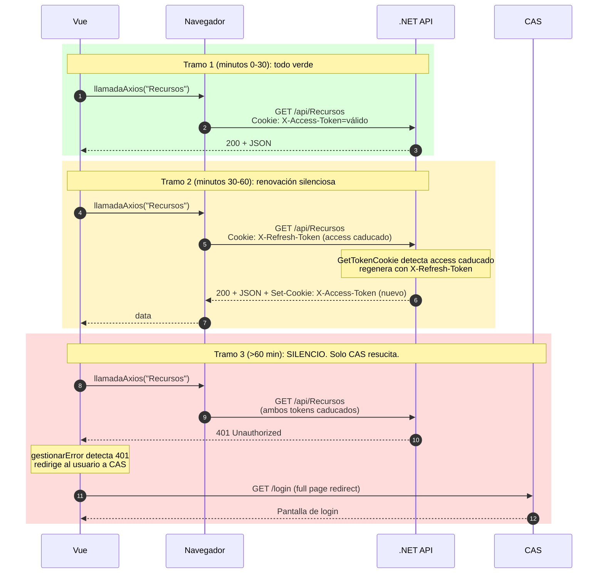

<!-- diagram id="tramos-vida-token" caption: "Tres tramos: todo verde, renovación silenciosa, silencio total que solo CAS rompe." -->

::: warning IMPORTANTE — el error mental que mata
> *"Llevo la pestaña abierta toda la mañana. ¿Por qué me ha dejado de funcionar a la 1?"*

Porque el `REFRESHTOKEN` dura **60 minutos**. Si abriste la pantalla a las **10:00** y no haces NINGUNA petición a la API hasta las **11:01**, **el refresh ya ha caducado** y la primera llamada va a fallar con 401. La cookie no se renueva "porque sí": **se renueva cuando hay actividad** que llegue al servidor.

En MVC clásico esto no pasaba porque cada navegación entre páginas iba al servidor y reactivaba la sesión. En SPA la página no se recarga: hasta que no haya una llamada API real, los tokens caducan en silencio.
:::

#### Reglas prácticas que se derivan de "son dos apps"

::: tip BUENA PRÁCTICA
1. **El 401 es el "se acabó la fiesta".** Cuando Vue lo reciba, redirige el navegador a CAS (`window.location = /...`) para empezar un ciclo nuevo. `gestionarError` ya hace esto.
2. **No guardes nada importante solo en memoria de Vue.** Un formulario a medio rellenar se pierde si el usuario tiene que ir a CAS. Persiste lo crítico en BD en cuanto puedas.
3. **No asumas que "estabas logueado hace un minuto" significa "sigues logueado".** Cada llamada es una conversación independiente. La cookie podría haber muerto entre dos llamadas.
4. **Cuidado con las pestañas abandonadas.** El usuario que abre la app y se va a comer vuelve a una pantalla "muerta". Considera mostrar un aviso si llevas más de N minutos sin tráfico.
5. **CAS no es tu API.** El login va por una redirección de página completa al dominio de CAS, no por axios. Volver a CAS implica recargar la SPA entera.
:::

---

## 1.1 ¿Qué es un DTO (en la UA, un "Modelo")?

Un **DTO** (Data Transfer Object) es un objeto que transporta datos entre capas. No contiene lógica de negocio: solo propiedades.

::: info CONTEXTO
En el resto del sector se les llama **DTO**. En nuestras aplicaciones UA los llamamos **Modelos** y viven en la carpeta `Models/`. Son la misma idea: una clase plana que viaja entre el controlador y el cliente (Vue), o entre el controlador y la base de datos.
:::

| Concepto      | Propósito                                       | Ejemplo en la UA                          |
| ------------- | ----------------------------------------------- | ----------------------------------------- |
| **DTO/Modelo**| Transportar datos entre capas (API ↔ cliente)   | `Recurso`, `TipoRecurso`, `RecursoConTipo`|
| **Entidad**   | Representar una fila de la BD con mapeo directo | Modelo de Entity Framework                |
| **ViewModel** | Preparar datos específicos para una vista MVC   | `HomeViewModel` (no aplica en APIs)       |

### El caso real: tablas `TRES_RECURSO` y `TRES_TIPO_RECURSO`

A lo largo del curso trabajaremos con dos tablas Oracle relacionadas del esquema de reservas:

```erd
[TRES_TIPO_RECURSO]
*ID_TIPO_RECURSO {label: "PK"}
CODIGO
NOMBRE_ES
NOMBRE_CA
NOMBRE_EN

[TRES_RECURSO]
*ID_RECURSO {label: "PK"}
+ID_TIPO_RECURSO {label: "FK"}
NOMBRE_ES
NOMBRE_CA
NOMBRE_EN
DESCRIPCION_ES
DESCRIPCION_CA
DESCRIPCION_EN
FECHA_MODIFICACION
GRANULIDAD
DURACION
ACTIVO
VISIBLE
ATIENDE_MISMA_PERSONA

TRES_TIPO_RECURSO 1--* TRES_RECURSO
```

<!-- diagram id="erd-recurso-tipo-recurso" caption: "Relación 1:N entre TRES_TIPO_RECURSO y TRES_RECURSO" -->

Cada **recurso** (una sala, un equipo, un servicio) pertenece a un **tipo de recurso** (sala de reuniones, equipo audiovisual, etc.).

### Modelo simple: `TipoRecurso`

Empezamos por la tabla más sencilla. La clase `TipoRecurso` mapea directamente las columnas de `TRES_TIPO_RECURSO`:

```csharp
// Models/Reservas/TipoRecurso.cs
using System.ComponentModel.DataAnnotations;

namespace ua.Models.Reservas
{
    public class TipoRecurso
    {
        public int IdTipoRecurso { get; set; }   // ID_TIPO_RECURSO

        [Required]
        [MaxLength(100)]
        public string Codigo { get; set; } = string.Empty;   // CODIGO

        [Required]
        [MaxLength(150)]
        public string NombreEs { get; set; } = string.Empty; // NOMBRE_ES

        [Required]
        [MaxLength(150)]
        public string NombreCa { get; set; } = string.Empty; // NOMBRE_CA

        [Required]
        [MaxLength(150)]
        public string NombreEn { get; set; } = string.Empty; // NOMBRE_EN
    }
}
```

### Modelo más completo: `Recurso`

La clase `Recurso` (ya existente en el proyecto `uaReservas`) mapea la tabla `TRES_RECURSO`, que tiene más columnas, nombres multiidioma, fechas, banderas `S/N` y la clave foránea al tipo:

```csharp
// Models/Reservas/Recurso.cs
public class Recurso
{
    public int IdRecurso { get; set; }
    public int? IdTipoRecurso { get; set; }

    [Required, MaxLength(200)]
    public string NombreEs { get; set; } = string.Empty;
    [Required, MaxLength(200)]
    public string NombreCa { get; set; } = string.Empty;
    [Required, MaxLength(200)]
    public string NombreEn { get; set; } = string.Empty;

    public string? DescripcionEs { get; set; }
    public string? DescripcionCa { get; set; }
    public string? DescripcionEn { get; set; }

    [Required]
    public DateTime FechaModificacion { get; set; }

    public int? Granulidad { get; set; }
    public int? Duracion { get; set; }

    [Required] public bool Activo { get; set; } = true;
    [Required] public bool Visible { get; set; } = true;
    [Required] public bool AtiendeMismaPersona { get; set; } = false;
}
```

::: tip BUENA PRÁCTICA
**Convenciones de nombres UA:**

- Propiedades en **PascalCase** en C# → se mapean automáticamente a **SNAKE_CASE** en Oracle (`FechaModificacion` → `FECHA_MODIFICACION`, `IdTipoRecurso` → `ID_TIPO_RECURSO`).
- Los `bool` de C# se mapean a `VARCHAR2(1)` con valores `'S'` / `'N'` en Oracle.
- Usa `[Columna("NOMBRE_REAL")]` solo si la columna no sigue la convención SNAKE_CASE.
:::

## 1.2 Un Modelo por operación: no todos los campos viajan siempre

Aquí está la idea clave de la sesión: **un Modelo no es la tabla**. Es **el contrato de datos para una operación concreta**. Por eso es habitual tener varios Modelos sobre la misma entidad, cada uno con los campos justos.

::: info CONTEXTO
La tabla `TRES_RECURSO` tiene 15 columnas. Pero cuando el cliente Vue **lista recursos en un desplegable**, solo necesita `id` y `nombre`. Cuando un usuario **crea** un recurso, no envía `FechaModificacion` (la pone el servidor). Y al **leer** el detalle no nos interesa que el cliente conozca el flag interno `Activo` ni códigos sensibles.
:::

### ¿Qué quitamos del Modelo según el caso?

| Campo                | ¿Por qué suele NO ir en el DTO hacia el cliente?                          |
| -------------------- | -------------------------------------------------------------------------- |
| `Activo` (`S`/`N`)   | Es una bandera interna de borrado lógico. El cliente solo ve registros activos. |
| `FechaModificacion`  | La gestiona la BD/servidor. El cliente nunca debe enviarla.                |
| `FechaCreacion`      | Igual: auditoría interna, no parte del contrato funcional.                 |
| `CodPer` (CODPER)    | Código de persona UA: dato sensible. **Nunca** debe salir al navegador.    |
| Claves foráneas crudas | A veces interesa enviar el **nombre** del tipo en vez del `IdTipoRecurso`. |

::: danger ZONA PELIGROSA
**`CODPER` y datos personales no salen al cliente.** Aunque la tabla tenga `COD_PER`, el DTO que devuelve la API debe omitirlo o, si se necesita, sustituirlo por un identificador opaco. Lo mismo aplica a DNIs, correos internos o claves de auditoría. La regla: **el cliente recibe lo mínimo necesario para pintar la pantalla**.
:::

### Tres Modelos sobre la misma entidad

Sobre `Recurso` podemos tener (al menos) tres formas:

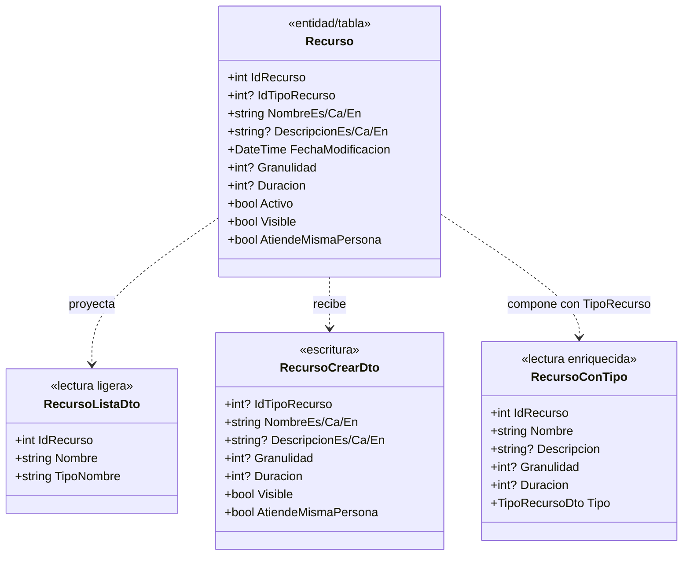

<!-- diagram id="modelos-recurso-variantes" caption: "Una entidad, varios Modelos según la operación" -->

### El DTO compuesto: `RecursoConTipo`

Para la pantalla de detalle queremos enviar el recurso **junto con su tipo** en una sola llamada. Creamos un DTO que **une** ambos, **omite** los campos internos (`Activo`, `FechaModificacion`) y **aplana** el idioma a una sola propiedad `Nombre` (el servicio rellenará el idioma activo).

```csharp
// Models/Reservas/RecursoConTipo.cs
namespace ua.Models.Reservas
{
    public class RecursoConTipo
    {
        public int IdRecurso { get; set; }
        public string Nombre { get; set; } = string.Empty;       // resuelto al idioma activo
        public string? Descripcion { get; set; }

        public int? Granulidad { get; set; }
        public int? Duracion { get; set; }
        public bool Visible { get; set; }
        public bool AtiendeMismaPersona { get; set; }

        // Tipo de recurso embebido (no solo el Id)
        public TipoRecursoResumenDto? Tipo { get; set; }
    }

    public class TipoRecursoResumenDto
    {
        public int IdTipoRecurso { get; set; }
        public string Codigo { get; set; } = string.Empty;
        public string Nombre { get; set; } = string.Empty;       // resuelto al idioma activo
    }
}
```

::: tip BUENA PRÁCTICA
Observa qué **NO** hay en `RecursoConTipo`:

- **No** está `Activo`: el cliente solo recibe recursos activos, no necesita la bandera.
- **No** está `FechaModificacion`: es metadato interno de auditoría.
- **No** están los seis campos `NombreEs/Ca/En` + `DescripcionEs/Ca/En`: la API ya resuelve el idioma y entrega un único `Nombre` / `Descripcion`.
- **No** se expone `IdTipoRecurso` "suelto": se envía el objeto `Tipo` con lo justo para pintar (código + nombre legible).

Si mañana añadiéramos un `CodPer` a `Recurso` por algún motivo, **tampoco aparecería aquí**: ese tipo de códigos se queda en el servidor.
:::

::: warning IMPORTANTE
Un DTO es un **contrato**. Cambiar sus campos rompe a quien lo consume. Por eso conviene crear DTOs **específicos por operación** (lista, detalle, crear, editar) en vez de devolver siempre la entidad completa: así puedes evolucionar la tabla sin romper la API.
:::

## 1.3 Creando nuestra primera API

### Anatomía de un controlador API

Todos los controladores API en .NET Core 10 comparten esta estructura:

```csharp
[Route("api/[controller]")]  // Ruta base: /api/NombreControlador
[ApiController]               // Habilita validación automática del modelo
public class InfoController : ControllerBase  // Hereda de ControllerBase
{
    // Inyección de dependencias en el constructor
    private readonly ClaseTokens _tokens;

    public InfoController(ClaseTokens tokens)
    {
        _tokens = tokens;
    }

    // Acciones con atributos HTTP
    [HttpGet("Message")]
    public string GetBackendMessage()
    {
        return "Hola desde la API";
    }
}
```

### Ejemplo real: InfoController del proyecto Curso

Este es el controlador más sencillo del proyecto. Observamos cómo valida el token del usuario y devuelve información:

```csharp
// Curso/Controllers/Apis/InfoController.cs
[Route("api/[controller]")]
[ApiController]
public class InfoController : ControllerBase
{
    private readonly ClaseTokens _tokens;

    public InfoController(ClaseTokens tokens)
    {
        _tokens = tokens;
    }

    [HttpGet("MessageError")]
    public IActionResult GetErrorMessage()
    {
        return BadRequest("Error en la petición");
    }

    [HttpGet("Message")]
    public string GetBackendMessage()
    {
        var token = _tokens.GetTokenCookie(_tokens.APPTOKEN);
        var validacion = _tokens.ValidarJwt(token, false);

        if (validacion.TokenValido)
        {
            return "Eres " + validacion.CodPersona + " - "
                + validacion.NombrePersona + " - "
                + validacion.Idioma + " - "
                + validacion.Correo;
        }

        return "El token no es valido: " + validacion.TokenCaducado;
    }
}
```

### Verbos HTTP

| Verbo      | Atributo       | Uso                         | Ejemplo                          |
| ---------- | -------------- | --------------------------- | -------------------------------- |
| **GET**    | `[HttpGet]`    | Obtener datos               | Listar permisos, obtener usuario |
| **POST**   | `[HttpPost]`   | Crear recurso               | Crear una herramienta IA         |
| **PUT**    | `[HttpPut]`    | Actualizar recurso completo | Modificar un permiso             |
| **DELETE** | `[HttpDelete]` | Eliminar recurso            | Desactivar una herramienta       |

### Códigos de estado HTTP

| Código  | Método en .NET             | Significado                       |
| ------- | -------------------------- | --------------------------------- |
| **200** | `Ok(valor)`                | Operación exitosa con datos       |
| **204** | `NoContent()`              | Operación exitosa sin datos       |
| **400** | `BadRequest(mensaje)`      | Error en la solicitud del cliente |
| **401** | `Unauthorized()`           | No autenticado                    |
| **404** | `NotFound()`               | Recurso no encontrado             |
| **500** | `Problem(detail: mensaje)` | Error interno del servidor        |

::: code-group

```csharp [Controller básico]
[Route("api/[controller]")]
[ApiController]
public class ReservasController : ControllerBase
{
    [HttpGet]
    public IActionResult Listar()
    {
        return Ok(new[] { "Reserva 1", "Reserva 2" });
    }
}
```

```csharp [Controller con atributos]
[Route("api/[controller]")]
[ApiController]
[Produces("application/json")]
public class ReservasController : ControllerBase
{
    [HttpGet]
    [ProducesResponseType(typeof(List<ClaseReserva>), 200)]
    [ProducesResponseType(typeof(ProblemDetails), 500)]
    public IActionResult Listar()
    {
        return Ok(new[] { "Reserva 1", "Reserva 2" });
    }
}
```

:::

## 1.3.bis Patrón `Result<T>` + `HandleResult`: una sola forma de responder

Antes de seguir, paramos un momento para introducir **el patrón que vamos a usar en TODOS los controladores del curso**. Si lo entiendes ahora, los próximos controladores son trivial.

### 1.3.bis.1 El problema: `return Ok / NotFound / Problem` repartido por todas partes

Mira el controlador que acabamos de ver: cada acción decide a mano cuándo devolver `Ok`, cuándo `NotFound`, cuándo `Problem`, y construye su `ProblemDetails` artesanal. Eso significa:

- **Repetición**: cada controlador escribe el mismo `if (datos == null) return NotFound(...)`.
- **Inconsistencia**: en uno el `ProblemDetails` lleva `Title`, en otro `Detail`, en otro nada.
- **Mezcla de capas**: el controlador conoce los códigos HTTP **y** la lógica de negocio.
- **Tests difíciles**: para probar el flujo "no existe" hay que montar HTTP, no basta con probar el servicio.

::: tip BUENA PRÁCTICA — separar QUÉ ha pasado de CÓMO se traduce a HTTP
Queremos que **el servicio diga qué pasó** (éxito, no encontrado, validación falla, error inesperado) y que **una sola clase del controlador traduzca eso a HTTP**. Así cada uno tiene una responsabilidad.
:::

### 1.3.bis.2 Las piezas: `Result<T>`, `Error`, `ErrorType`

Creamos un pequeño "sobre" en el que el servicio mete su respuesta. **`Result<T>` es un éxito con un valor, o un fallo con un `Error`** — nunca las dos cosas.

```csharp
// Models/Errors/ErrorType.cs
public enum ErrorType
{
    Failure    = 0,   // -> HTTP 500 (error inesperado)
    Validation = 1,   // -> HTTP 400 (datos inválidos del cliente)
    NotFound   = 2    // -> HTTP 404 (recurso no encontrado)
}

// Models/Errors/Error.cs — record inmutable
public record Error(
    string Code,                                          // ej. "RECURSO_NO_ENCONTRADO"
    string Message,                                       // mensaje legible
    ErrorType Type,                                       // clasifica el error
    IDictionary<string, string[]>? ValidationErrors = null);

// Models/Errors/Result.cs
public class Result<T>
{
    public bool   IsSuccess { get; }
    public T?     Value     { get; }
    public Error? Error     { get; }

    private Result(T value)        => (IsSuccess, Value, Error) = (true,  value,   null);
    private Result(Error error)    => (IsSuccess, Value, Error) = (false, default, error);

    public static Result<T> Success(T value)         => new(value);
    public static Result<T> Failure(Error error)     => new(error);

    // Atajos para no tener que crear el Error a mano cada vez:
    public static Result<T> NotFound(string code, string message) =>
        new(new Error(code, message, ErrorType.NotFound));

    public static Result<T> Validation(string code, string message,
        IDictionary<string, string[]>? errors = null) =>
        new(new Error(code, message, ErrorType.Validation, errors));

    public static Result<T> Fail(string code, string message) =>
        new(new Error(code, message, ErrorType.Failure));
}
```

### 1.3.bis.3 `ApiControllerBase` con `HandleResult`

Ahora la clase base que TODOS los controladores API heredan. Su única misión: convertir `Result<T>` en respuesta HTTP. Esto se escribe **una sola vez** en todo el proyecto.

```csharp
// Controllers/Apis/ApiControllerBase.cs
public abstract class ApiControllerBase : ControllerBase
{
    /// <summary>
    /// Convierte un Result<T> en HTTP:
    ///   Success           -> 200 OK con result.Value
    ///   Validation        -> 400 ValidationProblemDetails (con campo->errores)
    ///   NotFound          -> 404 ProblemDetails
    ///   Failure (default) -> 500 ProblemDetails genérico
    /// </summary>
    protected ActionResult HandleResult<T>(Result<T> result)
    {
        if (result.IsSuccess)
            return Ok(result.Value);

        var error = result.Error!;
        return error.Type switch
        {
            ErrorType.Validation => ValidationProblem(
                new ValidationProblemDetails(
                    error.ValidationErrors ?? new Dictionary<string, string[]>())
                {
                    Detail = error.Message,
                    Status = StatusCodes.Status400BadRequest
                }),

            ErrorType.NotFound => NotFound(new ProblemDetails
            {
                Title  = error.Code,
                Detail = error.Message,
                Status = StatusCodes.Status404NotFound
            }),

            _ => Problem(
                detail:     error.Message,
                title:      error.Code,
                statusCode: StatusCodes.Status500InternalServerError)
        };
    }
}
```

En el curso, `ControladorBase` (el que ya conocemos, con `ObtenerIdiomaPeticion`, `CodPer`, etc.) **hereda de `ApiControllerBase`**. Así los controladores específicos heredan de `ControladorBase` y obtienen **las dos cosas a la vez**: helpers de usuario y `HandleResult`.

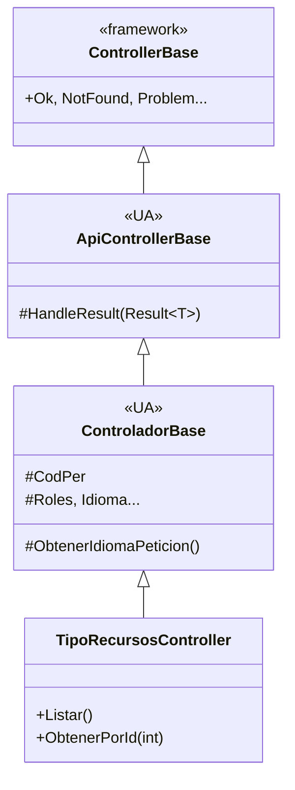

<!-- diagram id="jerarquia-controlador-base" caption: "ApiControllerBase aporta HandleResult; ControladorBase aporta claims; los controladores los heredan los dos." -->

### 1.3.bis.4 Los servicios devuelven `Result<T>`, no datos pelados

Antes el servicio devolvía `Task<TipoRecursoLectura?>` y dejaba al controlador interpretar el `null`. Ahora devuelve `Task<Result<TipoRecursoLectura>>` y la respuesta es **explícita**:

```csharp
public async Task<Result<TipoRecursoLectura>> ObtenerPorIdAsync(int id, string idioma)
{
    var fila = await _bd.ObtenerPrimeroMapAsync<TipoRecursoLectura>(
        "SELECT ... FROM CURSONORMADM.VRES_TIPO_RECURSO WHERE ID_TIPO_RECURSO = :id",
        new { id }, idioma);

    return fila is null
        ? Result<TipoRecursoLectura>.NotFound(
            "TIPO_RECURSO_NO_ENCONTRADO",
            $"No existe un tipo de recurso con id {id}.")
        : Result<TipoRecursoLectura>.Success(fila);
}
```

Y la acción del controlador queda **a una línea**:

```csharp
[HttpGet("{id:int}")]
public async Task<ActionResult> ObtenerPorId(int id) =>
    HandleResult(await _tiposRecurso.ObtenerPorIdAsync(id, ObtenerIdiomaPeticion()));
```

::: info CONTEXTO — ¿se ha "ido" el `if`?
No, está en `HandleResult`. Pero está **escrito una sola vez**, en la clase base. Cada controlador deja de tener `if` repetidos, y los códigos HTTP dejan de salpicar el código de dominio.
:::

### 1.3.bis.5 Comparativa antes / ahora

| Aspecto                           | Antes                                                      | Con `Result<T>` + `HandleResult`                       |
| --------------------------------- | ---------------------------------------------------------- | ------------------------------------------------------ |
| Lo que devuelve el servicio       | `T?` con `null` significa "no existe"                      | `Result<T>` explícito (`Success`, `NotFound`, ...)     |
| Qué hace el controlador           | `if (x == null) return NotFound(new ProblemDetails {...})` | `return HandleResult(await _svc.Algo(...))`            |
| Coherencia de respuestas          | Cada acción improvisa su `ProblemDetails`                  | Centralizado en una sola clase base                    |
| Tests del servicio                | Tests "happy path"; el `null` cuesta interpretarlo         | Tests asertan `IsSuccess` y `Error.Type` directamente  |
| Mezcla de capas                   | El servicio "sabe" que un null se traducirá a 404          | El servicio expresa el dominio; HTTP lo decide la base |

::: tip BUENA PRÁCTICA — cuándo NO usar `Result<T>`
No todo necesita `Result<T>`. Para una operación que **siempre tiene éxito o no aplica** (por ejemplo `ExisteAsync` que devuelve `bool`), un tipo simple es más claro. Reserva `Result<T>` para acciones que pueden fallar de **varias formas distintas** (no encontrado, validación, conflicto, etc.).
:::

## 1.4 Probando la API sin base de datos

Antes de conectar con Oracle, es útil probar con datos hardcodeados. Así validamos que el controlador, las rutas y los códigos de estado funcionan correctamente. **Y de paso vemos en la práctica que el DTO de salida (`RecursoConTipo`) no es la entidad de tabla (`Recurso`)**: el controlador hace la proyección. Esta versión usa el patrón `Result<T>` + `HandleResult` que acabamos de introducir.

```csharp
// Controllers/Apis/RecursosController.cs
[Route("api/[controller]")]
[ApiController]
public class RecursosController : ControladorBase   // hereda HandleResult (vía ApiControllerBase)
{
    // Catálogo de tipos (simulando la tabla TRES_TIPO_RECURSO)
    private static readonly List<TipoRecurso> _tipos = new()
    {
        new TipoRecurso
        {
            IdTipoRecurso = 1, Codigo = "SALA",
            NombreEs = "Sala", NombreCa = "Sala", NombreEn = "Room"
        },
        new TipoRecurso
        {
            IdTipoRecurso = 2, Codigo = "EQUIPO",
            NombreEs = "Equipo audiovisual", NombreCa = "Equip audiovisual", NombreEn = "AV equipment"
        }
    };

    // Recursos en bruto (simulando la tabla TRES_RECURSO). Ojo: Activo y FechaModificacion
    // existen aquí, pero NO se exponen al cliente.
    private static readonly List<Recurso> _recursos = new()
    {
        new Recurso
        {
            IdRecurso = 1, IdTipoRecurso = 1,
            NombreEs = "Sala de reuniones A", NombreCa = "Sala de reunions A", NombreEn = "Meeting room A",
            DescripcionEs = "Capacidad 10 personas",
            Granulidad = 30, Duracion = 60,
            FechaModificacion = DateTime.UtcNow,
            Activo = true, Visible = true, AtiendeMismaPersona = false
        },
        new Recurso
        {
            IdRecurso = 2, IdTipoRecurso = 2,
            NombreEs = "Proyector portátil", NombreCa = "Projector portàtil", NombreEn = "Portable projector",
            Granulidad = 60, Duracion = 120,
            FechaModificacion = DateTime.UtcNow,
            Activo = true, Visible = true, AtiendeMismaPersona = false
        },
        new Recurso
        {
            IdRecurso = 3, IdTipoRecurso = 1,
            NombreEs = "Sala antigua C", NombreCa = "Sala antiga C", NombreEn = "Old room C",
            FechaModificacion = DateTime.UtcNow.AddYears(-1),
            Activo = false, Visible = false, AtiendeMismaPersona = false   // ← dada de baja
        }
    };

    // GET /api/Recursos → lista activa, proyectada a RecursoConTipo (sin Activo, sin fechas)
    [HttpGet]
    public ActionResult Listar()
    {
        var lista = _recursos
            .Where(r => r.Activo)
            .Select(MapearAConTipo)
            .ToList();

        return HandleResult(Result<List<RecursoConTipo>>.Success(lista));
    }

    // GET /api/Recursos/{id} → detalle proyectado
    [HttpGet("{id:int}")]
    public ActionResult ObtenerPorId(int id)
    {
        var recurso = _recursos.FirstOrDefault(r => r.IdRecurso == id && r.Activo);
        var resultado = recurso is null
            ? Result<RecursoConTipo>.NotFound(
                "RECURSO_NO_ENCONTRADO",
                $"No existe un recurso activo con id {id}.")
            : Result<RecursoConTipo>.Success(MapearAConTipo(recurso));

        return HandleResult(resultado);
    }

    [HttpGet("error")]
    public ActionResult ProvocarError() =>
        HandleResult(Result<string>.Fail(
            "ERROR_SIMULADO",
            "Error simulado del servidor (demostración del flujo 500)."));

    // Proyección entidad → DTO. Aquí decidimos qué viaja al cliente y qué no.
    private static RecursoConTipo MapearAConTipo(Recurso r)
    {
        var tipo = _tipos.FirstOrDefault(t => t.IdTipoRecurso == r.IdTipoRecurso);

        return new RecursoConTipo
        {
            IdRecurso = r.IdRecurso,
            Nombre = r.NombreEs,             // en Oracle real, el idioma lo resuelve ClaseOracleBD3
            Descripcion = r.DescripcionEs,
            Granulidad = r.Granulidad,
            Duracion = r.Duracion,
            Visible = r.Visible,
            AtiendeMismaPersona = r.AtiendeMismaPersona,
            // Activo y FechaModificacion intencionalmente OMITIDOS
            Tipo = tipo == null ? null : new TipoRecursoResumenDto
            {
                IdTipoRecurso = tipo.IdTipoRecurso,
                Codigo = tipo.Codigo,
                Nombre = tipo.NombreEs
            }
        };
    }
}
```

::: tip BUENA PRÁCTICA — qué viaja y qué no
Mira el método `MapearAConTipo`. Es donde **se decide el contrato** con el cliente:

- Se **omiten** `Activo` y `FechaModificacion` aunque existan en la fila.
- Se **aplana** el multiidioma a `Nombre`/`Descripcion`.
- Se **embebe** el tipo en lugar de enviar el `IdTipoRecurso` desnudo.

Esa pequeña función es, en la práctica, el sitio donde aplicamos las reglas que hemos visto en 1.2: nada de banderas internas, nada de auditoría, nada de códigos sensibles (`CODPER` y similares).
:::

Ejemplo de respuesta `GET /api/Recursos/1`:

```json
{
  "idRecurso": 1,
  "nombre": "Sala de reuniones A",
  "descripcion": "Capacidad 10 personas",
  "granulidad": 30,
  "duracion": 60,
  "visible": true,
  "atiendeMismaPersona": false,
  "tipo": {
    "idTipoRecurso": 1,
    "codigo": "SALA",
    "nombre": "Sala"
  }
}
```

Observa que **no aparece** `activo` ni `fechaModificacion`, aunque esas columnas existen en la tabla. El cliente recibe el contrato funcional, no el reflejo literal de la BD.

::: warning IMPORTANTE
El atributo `[ApiController]` valida automáticamente el `ModelState`. Si un DTO tiene DataAnnotations y los datos no son válidos, .NET devuelve un `400 Bad Request` con un `ValidationProblemDetails` **sin que escribamos código de validación en la acción**.
:::

## 1.5 Documentando la API: OpenAPI nativo de .NET 10 + Scalar

Una API sin documentación es una API que **nadie sabe cómo usar**: ni la persona Vue que la consume, ni quien la mantenga dentro de 6 meses, ni los compañeros de otros equipos. Y en la UA tenemos un grado extra: muchas APIs las consumen **varias** aplicaciones (una en Vue, otra en .NET de otro servicio, una integración externa). El estándar de facto para documentar APIs HTTP es **OpenAPI** (antes "Swagger").

::: info CONTEXTO — qué stack de documentación usa `uaReservas`
En el curso usamos **Swashbuckle** (clásico, maduro y robusto) para **generar** el documento OpenAPI 3.x, y **Scalar** para **renderizar** la UI. Es la combinación que mejor funciona hoy contra .NET 10 cuando se quieren conservar los `<summary>` XML, las anotaciones `[ProducesResponseType]` y los esquemas de seguridad.

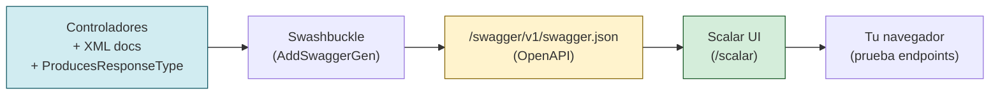

<!-- diagram id="pipeline-openapi-scalar" caption: "Swashbuckle genera el JSON; Scalar lo pinta. El JSON sigue accesible para Postman, generadores de clientes, etc." -->
:::

### 1.5.1 Lo que ya tienes en `uaReservas.csproj`

```xml
<ItemGroup>
    <!-- Generador del JSON OpenAPI a partir de los controladores -->
    <PackageReference Include="Swashbuckle.AspNetCore"        Version="10.1.7" />

    <!-- UI Scalar + puente con Swashbuckle -->
    <PackageReference Include="Scalar.AspNetCore"             Version="2.14.11" />
    <PackageReference Include="Scalar.AspNetCore.Microsoft"   Version="2.14.11" />
    <PackageReference Include="Scalar.AspNetCore.Swashbuckle" Version="2.14.11" />
</ItemGroup>
```

Y en `<PropertyGroup>`, las dos líneas que hacen que los `<summary>` XML lleguen al JSON OpenAPI:

```xml
<PropertyGroup>
    <!-- Genera bin/Debug/net10.0/uaReservas.xml con todos los <summary> -->
    <GenerateDocumentationFile>true</GenerateDocumentationFile>

    <!-- 1591 = "Missing XML comment for publicly visible type or member".
         Sin esta línea cada propiedad de DTO sin <summary> sería un warning. -->
    <NoWarn>$(NoWarn);1591</NoWarn>
</PropertyGroup>
```

::: warning IMPORTANTE — escapar `<` y `>` en los `<summary>`
Si en un `<summary>` escribes `Result<T>` o `List<int>`, el compilador interpreta `<T>` como una etiqueta XML y suelta `CS1570: XML comment has badly formed XML`. Escapa con `Result&lt;T&gt;` y `List&lt;int&gt;`. Es el error más típico al activar `GenerateDocumentationFile`.
:::

### 1.5.2 Activar Swagger + Scalar en `Program.cs`

Esto es **exactamente** lo que tiene `uaReservas/Program.cs`:

```csharp
using System.Reflection;
using Microsoft.OpenApi;          // ⚠ OpenApi v2: ya NO es "Microsoft.OpenApi.Models"
using Scalar.AspNetCore;

var builder = WebApplication.CreateBuilder(args);

// ... (resto del builder: AddServicesUA, DI, AddControllersWithViews, etc.)

// 1) Configurar Swashbuckle para generar el JSON OpenAPI.
builder.Services.AddSwaggerGen(c =>
{
    c.SwaggerDoc("v1", new OpenApiInfo
    {
        Title       = builder.Configuration["App:NombreApp"] ?? "uaReservas API",
        Version     = builder.Configuration["App:Version"]   ?? "1.0.0",
        Description = builder.Configuration["App:DescripcionApp"] ??
                      "API de reservas — proyecto de ejemplo del curso de normalización."
    });

    // Incluye los <summary>, <param> y <response> que MSBuild ha volcado al XML.
    var xmlFile = $"{Assembly.GetExecutingAssembly().GetName().Name}.xml";
    var xmlPath = Path.Combine(AppContext.BaseDirectory, xmlFile);
    if (File.Exists(xmlPath))
    {
        c.IncludeXmlComments(xmlPath, includeControllerXmlComments: true);
    }

    // Esquema de autenticación documental: el JWT viaja en una cookie HttpOnly,
    // así que Scalar NO la podrá enviar desde la UI — pero queda DOCUMENTADO.
    c.AddSecurityDefinition("CookieJWT", new OpenApiSecurityScheme
    {
        Type        = SecuritySchemeType.ApiKey,
        In          = ParameterLocation.Cookie,
        Name        = "X-Access-Token",
        Description = "JWT corto (30 min) emitido tras el login CAS. " +
                      "El navegador lo adjunta automáticamente como cookie HttpOnly."
    });
});

var app = builder.Build();

// 2) Activar OpenAPI + Scalar SOLO en desarrollo / staging.
//    En producción no exponemos la documentación al mundo.
if (app.Environment.IsDevelopment() || app.Environment.IsStaging())
{
    // Sirve el JSON OpenAPI en /swagger/v1/swagger.json
    app.UseSwagger();

    // Scalar lee ese JSON y pinta su UI en /scalar
    app.MapScalarApiReference(options =>
    {
        options.Title               = builder.Configuration["App:NombreApp"] ?? "uaReservas API";
        options.OpenApiRoutePattern = "/swagger/{documentName}/swagger.json";
        options.WithTheme(ScalarTheme.BluePlanet);
        options.WithDefaultHttpClient(ScalarTarget.JavaScript, ScalarClient.Axios);
    });

    app.UseDeveloperExceptionPage();
}
```

URLs útiles tras esto (con `App:DirApp = /uareservas`):

| URL                                                  | Para qué                                                       |
| ---------------------------------------------------- | -------------------------------------------------------------- |
| `https://localhost:44306/uareservas/swagger/v1/swagger.json` | Documento OpenAPI 3.x crudo. Cárgalo en Postman / generadores. |
| `https://localhost:44306/uareservas/scalar`          | **La UI bonita** de Scalar para explorar y probar la API.      |

::: info CONTEXTO — namespace `Microsoft.OpenApi` (v2)
Con `Microsoft.OpenApi` 2.x (el que arrastra Swashbuckle 10), `OpenApiInfo`, `OpenApiSecurityScheme`, `SecuritySchemeType` y `ParameterLocation` viven **directamente** en `Microsoft.OpenApi`. Si copias código de tutoriales antiguos verás `using Microsoft.OpenApi.Models;` — esa namespace **ya no existe** y dará `CS0234`.
:::

::: tip BUENA PRÁCTICA — Scalar solo en desarrollo / staging
Como ves arriba, `UseSwagger()` y `MapScalarApiReference()` van **dentro del `if`** que comprueba el entorno. En producción nadie debe poder navegar `/scalar` desde fuera. Si necesitas que esté disponible en producción para integraciones internas, protege esas rutas con `[Authorize]` y/o un filtro por IP de campus.
:::

### 1.5.bis Cómo aprovecha Scalar lo que escribes en `ControladorBase` / `ApiControllerBase`

`HandleResult` traduce `Result<T>` a respuestas HTTP estándar (`200`, `400`, `404`, `500`). Como `[ProducesResponseType]` se declara **en la acción**, Scalar muestra los códigos posibles de cada endpoint sin que tengas que volver a explicarlos: el `summary` cuenta el "qué" y los atributos cuentan los "cómo".

### 1.5.3 Documentar un endpoint **bien**

Un endpoint mal documentado dice solo "GET /api/Recursos devuelve algo". Uno bien documentado dice **qué devuelve, qué errores puede dar, qué tipos JSON y qué parámetros, con un resumen claro**. Plantilla recomendada (es exactamente lo que tiene `TipoRecursosController` en el proyecto):

```csharp
/// <summary>
/// API REST para consultar los tipos de recurso (TRES_TIPO_RECURSO).
///
/// La autenticación la garantiza el middleware (UseAuthentication +
/// UseAuthorization + [Authorize]). Si la cookie del token no es válida,
/// el pipeline devuelve 401 antes de entrar al método.
///
/// El idioma de la petición lo resuelve ControladorBase: prioriza la
/// cabecera "X-Idioma" si la hay, y si no usa el claim LENGUA del JWT.
///
/// La traducción Result&lt;T&gt; -&gt; HTTP la hace HandleResult, definido
/// en ApiControllerBase (clase base de ControladorBase).
/// </summary>
[Route("api/[controller]")]
[ApiController]
[Authorize]                              // ← exige cookie JWT válida
[Produces("application/json")]           // ← TODOS los endpoints devuelven JSON
[Tags("TipoRecursos")]                   // ← Agrupación en la sidebar de Scalar
public class TipoRecursosController : ControladorBase
{
    private readonly ITiposRecursoServicio _tiposRecurso;
    public TipoRecursosController(ITiposRecursoServicio tiposRecurso)
        => _tiposRecurso = tiposRecurso;

    /// <summary>Devuelve la lista de tipos de recurso, resueltos al idioma del usuario.</summary>
    /// <response code="200">Devuelve la lista completa (puede estar vacía).</response>
    /// <response code="401">No autenticado (cookie JWT ausente o caducada).</response>
    [HttpGet]
    [ProducesResponseType(typeof(List<TipoRecursoLectura>), StatusCodes.Status200OK)]
    [ProducesResponseType(StatusCodes.Status401Unauthorized)]
    public async Task<ActionResult> Listar() =>
        HandleResult(await _tiposRecurso.ObtenerTodosAsync(ObtenerIdiomaPeticion()));

    /// <summary>Devuelve un tipo de recurso por su id.</summary>
    /// <param name="id">Identificador del tipo (ID_TIPO_RECURSO).</param>
    /// <response code="200">Tipo encontrado.</response>
    /// <response code="401">No autenticado.</response>
    /// <response code="404">El tipo no existe.</response>
    [HttpGet("{id:int}")]
    [ProducesResponseType(typeof(TipoRecursoLectura), StatusCodes.Status200OK)]
    [ProducesResponseType(StatusCodes.Status401Unauthorized)]
    [ProducesResponseType(typeof(ProblemDetails), StatusCodes.Status404NotFound)]
    public async Task<ActionResult> ObtenerPorId(int id) =>
        HandleResult(await _tiposRecurso.ObtenerPorIdAsync(id, ObtenerIdiomaPeticion()));
}
```

Observa cómo cada acción declara **todos los códigos de respuesta posibles** vía `[ProducesResponseType]`: Scalar leerá esos atributos junto con los `<response>` XML y pintará la tabla de respuestas completa. El cuerpo de la acción se queda en **una línea** porque `HandleResult` hace el trabajo de mapear `Result<T>` a HTTP.

### 1.5.4 Buenas prácticas con los comentarios XML

::: tip BUENA PRÁCTICA — qué comentar y qué no
- **Comenta**: `<summary>` del endpoint (para qué sirve), `<param>` de cada parámetro **si no son obvios**, `<response>` de cada código posible.
- **No comentes** lo que ya dice el nombre: `// Obtiene el id` sobre `ObtenerPorId(int id)` es ruido.
- **No comentes** propiedades de DTOs si ya tienen nombres claros. Pero **sí** comenta unidades o reglas: `/// <summary>Duración en minutos (múltiplo de Recurso.Granulidad).</summary>`.
- **Escapa `<` y `>`** en los `<summary>` cuando hablen de genéricos: `Result&lt;T&gt;`, `List&lt;int&gt;`. Si no, `CS1570`.
:::

### 1.5.5 Cómo se ve en Scalar y cómo se prueba

Abre `https://localhost:44306/uareservas/scalar`. Lo que vas a ver:

| Zona              | Qué muestra                                                                            |
| ----------------- | -------------------------------------------------------------------------------------- |
| **Sidebar**       | Endpoints agrupados por `[Tags]` (Recursos, Reservas…).                                |
| **Panel central** | `summary`, parámetros, ejemplos de petición/respuesta, modelos JSON expandibles.       |
| **Try it out**    | Formulario para lanzar la llamada **real** desde el navegador.                         |
| **Code samples**  | Snippets ya hechos en Axios/Fetch/cURL — útiles para pegar en Vue.                     |

::: warning IMPORTANTE — Scalar y la cookie de autenticación
Scalar ejecuta las pruebas **en el mismo dominio que la app**, así que si has iniciado sesión via CAS, **la cookie viaja sola** y el "Try it out" devuelve los datos de tu sesión real. Si pruebas la API con un usuario distinto, abre Scalar en una ventana privada con ese login.

Esto es lo mismo que vimos en 1.0: la cookie es del navegador, no de la herramienta concreta.
:::

### 1.5.6 Convenciones UA para una API "muy bien documentada"

Aplicar esta lista a cualquier controlador nuevo:

| ✔ | Convención                                                                                    |
| - | --------------------------------------------------------------------------------------------- |
| ☐ | `[ApiController]` y `[Route("api/[controller]")]`.                                            |
| ☐ | `[Produces("application/json")]` a nivel de clase.                                            |
| ☐ | `[Tags("…")]` para agrupar en Scalar (suele coincidir con la entidad).                       |
| ☐ | `<summary>` XML en clase y en **cada** acción.                                                |
| ☐ | `<param>` y `<response>` para parámetros y códigos de respuesta no triviales.                 |
| ☐ | `[ProducesResponseType(typeof(T), 200)]` para el caso bueno.                                  |
| ☐ | `[ProducesResponseType(typeof(ProblemDetails), 4xx/5xx)]` para los errores tipados.           |
| ☐ | Verbos HTTP correctos: GET = leer, POST = crear, PUT = actualizar todo, PATCH = parcial, DELETE = borrar. |
| ☐ | Rutas en plural (`/api/Recursos`, `/api/Reservas`).                                           |
| ☐ | Parámetros de ruta con tipo (`{id:int}`) cuando son numéricos: error 404 automático si no.    |

## 1.6 Cómo responde .NET 10: `TypedResults`, `ProblemDetails` y status codes

Una API **es** sus respuestas. La diferencia entre una API mediocre y una excelente está en cómo devuelve los errores: si el cliente Vue puede distinguir un "no autenticado" de un "no autorizado" de un "validación fallida" de un "no encontrado", todo el código de UI se simplifica. Si todo es `500 algo fue mal`, el cliente tiene que adivinar.

### 1.6.1 Las cuatro familias de status code: el idioma común

Antes de los nombres concretos (`200 OK`, `404 NotFound`...), entiende **las familias**. Cada respuesta HTTP empieza por un número del 100 al 599 y ese primer dígito **ya te dice mucho**:

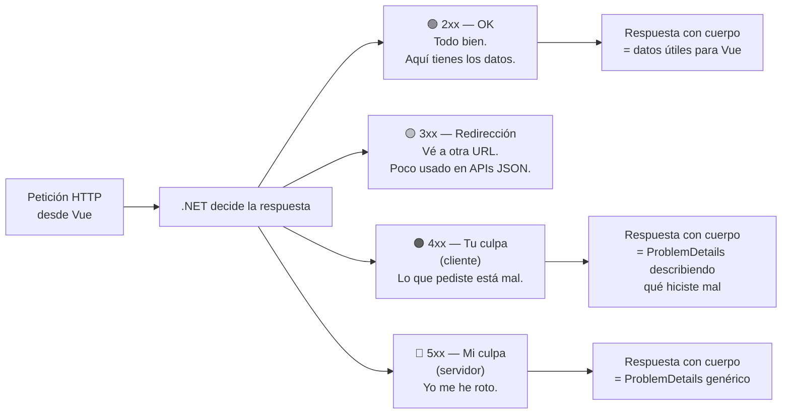

<!-- diagram id="familias-http" caption: "Las cuatro familias de status code y qué significa cada una semánticamente." -->

::: info CONTEXTO — la pregunta clave de cada familia
| Familia    | Pregunta que responde                                 | ¿Quién la "lía"?       | ¿Vue debe reaccionar?                           |
| ---------- | ------------------------------------------------------ | ---------------------- | ------------------------------------------------ |
| **2xx**    | "¿Salió bien?" → **Sí**.                              | Nadie, todo en orden.  | Mostrar los datos.                               |
| **3xx**    | "¿Tengo que ir a otra URL?" → **Sí**.                 | Es informativo.        | Casi nunca: axios sigue redirecciones solo.      |
| **4xx**    | "¿La culpa es del que pidió?" → **Sí**.               | El cliente (tú).       | Pintar el error: lo puedes arreglar.             |
| **5xx**    | "¿La culpa es del servidor?" → **Sí**.                | El servidor.           | Disculparse y reintentar o avisar al usuario.    |
:::

#### Lectura visual: qué piensa Vue ante cada familia

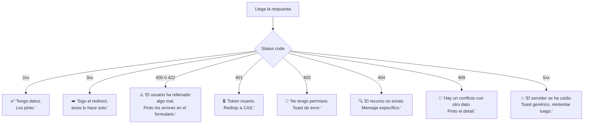

<!-- diagram id="reaccion-vue-familias" caption: "Una reacción tipo de Vue para cada familia de respuesta." -->

::: tip BUENA PRÁCTICA — qué reglas se derivan de las familias
- **Distingue 4xx de 5xx** en logs y monitoring: los 5xx te dicen que tu servidor está mal; los 4xx te dicen que tus clientes están mal (o tu UI los confunde).
- **No respondas 200 con un `{ error: ... }` dentro**. Es un anti-patrón clásico. Si algo falla, devuelve **4xx o 5xx** con `ProblemDetails`; si va bien, devuelve **2xx** con el dato. Mezclar capas confunde al cliente.
- **Las redirecciones (3xx) en APIs JSON son rarísimas.** Si las ves, probablemente sean del middleware de auth (p.ej. CAS interceptando una petición sin token). Cuando llegan al `.catch` de axios sin `error.response`, sospecha de esto.
:::

### 1.6.2 Tres formas de devolver desde un controlador (.NET 10)

```csharp
// (a) IActionResult — la clásica, máxima flexibilidad
[HttpGet("{id:int}")]
public IActionResult ObtenerA(int id)
{
    var r = _recursos.BuscarxId(id);
    if (r == null) return NotFound();
    return Ok(r);
}

// (b) ActionResult<T> — añade tipado para Swagger/OpenAPI
[HttpGet("{id:int}")]
public ActionResult<RecursoLectura> ObtenerB(int id)
{
    var r = _recursos.BuscarxId(id);
    if (r == null) return NotFound();
    return r;   // implícitamente Ok(r)
}

// (c) Results<...> + TypedResults — el patrón moderno (.NET 9+)
[HttpGet("{id:int}")]
public Results<Ok<RecursoLectura>, NotFound<ProblemDetails>> ObtenerC(int id)
{
    var r = _recursos.BuscarxId(id);
    if (r == null)
        return TypedResults.NotFound(new ProblemDetails {
            Title = "Recurso no encontrado",
            Detail = $"No existe el recurso con id {id}.",
            Status = StatusCodes.Status404NotFound
        });
    return TypedResults.Ok(r);
}
```

::: tip BUENA PRÁCTICA — cuándo cada una
- **`IActionResult`**: para controladores existentes que ya lo usan. Sigue siendo válido y es lo que verás en la mayor parte del código UA.
- **`ActionResult<T>`**: si quieres que Swagger detecte el tipo de retorno sin escribir `[ProducesResponseType(typeof(T), 200)]`.
- **`Results<...>` + `TypedResults`** (.NET 9+): la opción moderna. Cada posible respuesta es un tipo en la firma del método → OpenAPI lo detecta perfecto y tienes ayuda del compilador si olvidas un caso.

En código nuevo de la UA: **`Results<...>` para nuevos endpoints**, **`IActionResult`** si extiendes un controlador antiguo. No mezcles estilos en el mismo método.
:::

### 1.6.3 Tabla maestra de status codes que vas a usar

| Código | Helper `TypedResults`                            | Cuándo                                                   |
| ------ | ------------------------------------------------ | ---------------------------------------------------------- |
| **200 OK**             | `TypedResults.Ok(valor)`             | Lectura exitosa con cuerpo.                                |
| **201 Created**        | `TypedResults.Created(url, valor)`   | Creación exitosa. `url` apunta al recurso nuevo.           |
| **204 NoContent**      | `TypedResults.NoContent()`           | Operación exitosa sin cuerpo (DELETE típico).              |
| **400 BadRequest**     | `TypedResults.BadRequest(detalles)`  | Petición mal formada (validación rota, JSON inválido).     |
| **401 Unauthorized**   | `TypedResults.Unauthorized()`        | Falta autenticación (no hay cookie JWT válida).            |
| **403 Forbidden**      | `TypedResults.Forbid()`              | Hay autenticación, pero no permiso para esta acción.       |
| **404 NotFound**       | `TypedResults.NotFound()`            | El recurso no existe.                                      |
| **409 Conflict**       | `TypedResults.Conflict(detalles)`    | Estado inconsistente (p.ej. solapamiento de reserva).      |
| **422 UnprocessableEntity** | `TypedResults.UnprocessableEntity(...)` | Sintaxis OK, semántica imposible. Menos usado.       |
| **500 Problem**        | `TypedResults.Problem(...)`          | Error inesperado del servidor.                             |

::: danger ZONA PELIGROSA — confusiones habituales
- **401 vs 403**: 401 = "no sé quién eres", 403 = "sé quién eres pero no puedes". Vue debería **redirigir a login** ante 401 y mostrar **toast de error** ante 403.
- **404 vs 400**: si el recurso no existe → 404. Si la petición es absurda (tipo incorrecto, falta campo) → 400. Nunca al revés.
- **500 no es papelera**: un 500 dice "yo, servidor, me he roto". Un fallo de validación **no es** un 500. Un FK violation tampoco (es 409 o 400).
:::

### 1.6.4 `ProblemDetails` (RFC 9457): el formato estándar para errores

Cualquier error con cuerpo en .NET sigue el **estándar RFC 9457** (antes 7807). Esto significa que el cliente Vue siempre recibe la misma forma JSON para cualquier error:

```json
{
  "type":     "https://tools.ietf.org/html/rfc9110#section-15.5.5",
  "title":    "Recurso no encontrado",
  "status":   404,
  "detail":   "No existe el recurso con id 999.",
  "instance": "/api/Recursos/999",
  "traceId":  "00-abc123def456-..."
}
```

Para validaciones se extiende a **`ValidationProblemDetails`** con el campo `errors`:

```json
{
  "type":   "https://tools.ietf.org/html/rfc9110#section-15.5.1",
  "title":  "One or more validation errors occurred.",
  "status": 400,
  "errors": {
    "HoraInicio":   ["La hora de inicio debe estar entre 0 y 23."],
    "MinutosReserva": ["La duracion debe ser multiplo de la granulidad."]
  }
}
```

### 1.6.5 Activar `ProblemDetails` global

```csharp
// Program.cs
builder.Services.AddProblemDetails(options =>
{
    options.CustomizeProblemDetails = ctx =>
    {
        ctx.ProblemDetails.Instance = ctx.HttpContext.Request.Path;
        ctx.ProblemDetails.Extensions["traceId"] = ctx.HttpContext.TraceIdentifier;
        ctx.ProblemDetails.Extensions["timestamp"] = DateTime.UtcNow;
    };
});

var app = builder.Build();

// Convierte excepciones no controladas en ProblemDetails (en lugar de página HTML)
app.UseExceptionHandler();
app.UseStatusCodePages();         // 404, 401, etc., también con ProblemDetails
```

Con esto, **cualquier excepción** que escape de un controlador se convierte automáticamente en un JSON `ProblemDetails` 500. Vue puede tratarlo igual que el resto.

### 1.6.6 Tres patrones de respuesta aplicados a `uaReservas`

**Patrón A — Lectura con 404:**

```csharp
[HttpGet("{id:int}")]
[ProducesResponseType(typeof(RecursoConTipo), 200)]
[ProducesResponseType(typeof(ProblemDetails), 404)]
public Results<Ok<RecursoConTipo>, NotFound<ProblemDetails>> ObtenerPorId(int id)
{
    var r = _recursos.BuscarxId(id);
    if (r == null)
        return TypedResults.NotFound(new ProblemDetails
        {
            Title  = "Recurso no encontrado",
            Detail = $"No existe el recurso con id {id} o esta dado de baja.",
            Status = 404
        });
    return TypedResults.Ok(MapearAConTipo(r));
}
```

**Patrón B — Creación con 201 + Location:**

```csharp
[HttpPost]
[ProducesResponseType(typeof(object), 201)]
[ProducesResponseType(typeof(ValidationProblemDetails), 400)]
[ProducesResponseType(typeof(ProblemDetails), 401)]
public Results<Created<object>, ValidationProblem, UnauthorizedHttpResult> Crear(
    [FromBody] ReservaCrear dto)
{
    var v = _tokens.ValidarJwt(_tokens.GetTokenCookie(_tokens.APPTOKEN), false);
    if (!v.TokenValido) return TypedResults.Unauthorized();

    int codPer = int.Parse(v.CodPersona);
    int idReserva = _reservas.Crear(dto, codPer);

    return TypedResults.Created($"/api/Reservas/{idReserva}", new { idReserva });
}
```

**Patrón C — Detección de conflicto con 409:**

```csharp
catch (ReservaSolapadaException ex)
{
    return TypedResults.Conflict(new ProblemDetails
    {
        Title  = "Solapamiento de reserva",
        Detail = ex.Message,
        Status = 409
    });
}
```

### 1.6.7 La regla de oro: NUNCA `500` por algo previsible

Una validación rota es **400**. Un recurso ausente es **404**. Un conflicto de datos es **409**. Un error de permisos es **403**. Reservar el **500** para lo que es realmente inesperado (BD caída, NullReference no contemplado, fallo de dependencia externa).

::: tip BUENA PRÁCTICA
Si en tu controlador escribes `try { ... } catch (Exception) { return Problem(...); }`, está bien como red de seguridad. Pero **lo importante** es que los errores **previsibles** se capturen como tipos específicos (`ReservaSolapadaException`, `RecursoNoEncontradoException`, etc.) y se mapeen al status correcto. El 500 debería ser raro en logs.
:::

## 1.7 Cómo consume Vue: conceptos clave (sin código)

::: info CONTEXTO
El **código** del cliente Vue se cubre en sesiones posteriores. Aquí solo nos quedamos con **los conceptos** que necesitas tener claros desde el lado de .NET, para diseñar bien la API. Si la API está bien pensada, el código Vue casi se escribe solo.
:::

### 1.7.1 El reparto axios: `.then` para 2xx, `.catch` para TODO lo demás

Esto es **la regla mental** que ahorra la mitad de las dudas:

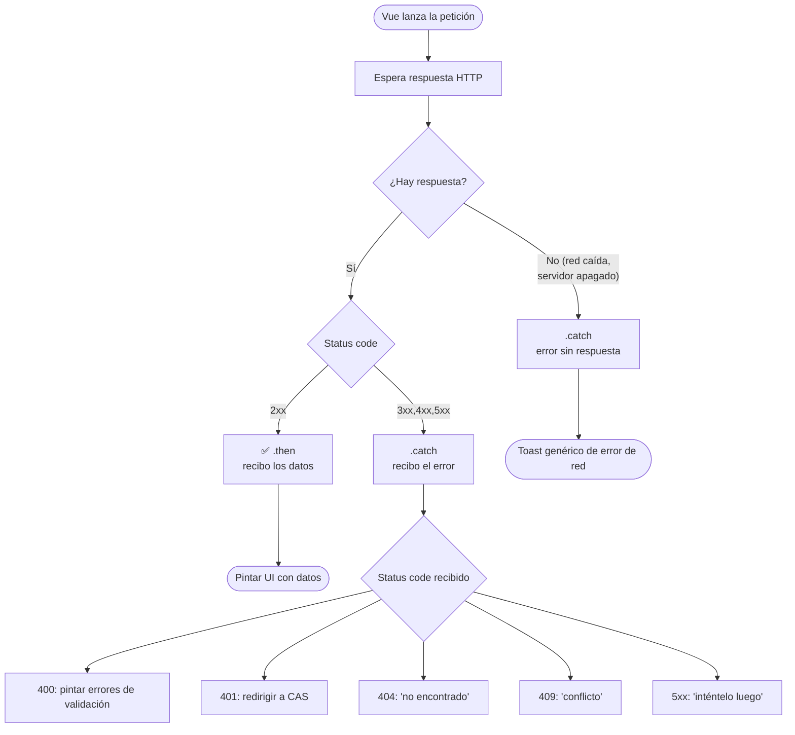

<!-- diagram id="reparto-axios-then-catch" caption: "axios reparte 2xx al .then; cualquier otra cosa cae al .catch." -->

::: warning IMPORTANTE — la regla en una frase
> **`.then` se ejecuta SOLO si el status es 2xx. CUALQUIER otra cosa — 4xx, 5xx, incluso "el servidor no respondió nunca" — entra en el `.catch`.**

En Vue **no se escribe** `if (status === 200) ... else if (status === 404) ...`. Ese reparto lo hace axios por ti. Tu código solo tiene **dos ramas**: la buena (`.then`) y todo lo demás (`.catch`).
:::

### 1.7.2 La consecuencia para el diseño de la API

Como el cliente reacciona **al código de status**, no al cuerpo, la API debe:

1. **Devolver 2xx solo cuando todo salió bien.** Nunca un `200 OK` con un `{ error: "..."}` dentro.
2. **Usar el status adecuado para cada problema** (vimos 1.6: 400, 401, 403, 404, 409, 500).
3. **Devolver un `ProblemDetails` o `ValidationProblemDetails`** en los errores, para que el cliente tenga un mensaje útil que mostrar.

Si tu API cumple eso, **el código Vue se reduce a casi nada**: una rama feliz (pintar datos) y una rama de error que el componente UA `gestionarError` ya sabe interpretar.

### 1.7.3 Resumen de la conversación API ↔ Vue

| Caso desde .NET                                        | Status | Qué hace Vue                                          |
| ------------------------------------------------------ | ------ | ------------------------------------------------------ |
| `return Ok(datos)`                                     | 200    | `.then` → pinta los datos.                             |
| `return Created(url, dto)`                             | 201    | `.then` → muestra éxito, navega al recurso.            |
| `return NoContent()`                                   | 204    | `.then` → muestra éxito sin pintar nada.               |
| `return BadRequest(ValidationProblemDetails)`          | 400    | `.catch` → pinta errores campo a campo.                |
| `return Unauthorized()`                                | 401    | `.catch` → redirige a CAS.                             |
| `return Forbid()`                                      | 403    | `.catch` → toast "no tienes permiso".                  |
| `return NotFound()`                                    | 404    | `.catch` → toast/mensaje "no existe".                  |
| `return Conflict(ProblemDetails)`                      | 409    | `.catch` → toast con el `detail` del conflicto.        |
| Excepción no controlada                                | 500    | `.catch` → toast genérico "vuelva a intentarlo".       |

Por eso lo importante es **devolver el status correcto desde .NET**: lo demás lo gestiona el cliente con un patrón único.

## 1.8 Mapeo automático de `ClaseOracleBD3` (y cómo nos simplifica el multiidioma)

Cuando un servicio llama a `bd.ObtenerTodosMapAsync<T>(sql, param, idioma)`, la librería **rellena el objeto `T` por su cuenta** leyendo columna a columna del cursor que devuelve Oracle. No hace falta escribir un mapeador manual. Vemos **cómo funciona** ese mapeo y cómo aprovecharlo para escribir menos código.

::: info CONTEXTO
La vista `VRES_RECURSO` trae las tres versiones (`NOMBRE_ES`, `NOMBRE_CA`, `NOMBRE_EN`). Pero **no siempre** es así: muchos procedimientos PL/SQL devuelven un cursor con una sola columna `NOMBRE` (ya resuelta al idioma del usuario), y muchas vistas de solo lectura tampoco se molestan en exponer las tres columnas si solo van a alimentar listados.

Cuando la fuente trae **una** columna `NOMBRE`, nuestro DTO también puede tener **una** propiedad `Nombre`. Cuando la fuente trae **tres** (`NOMBRE_ES/CA/EN`), `ClaseOracleBD3` nos deja elegir: o las tres en el DTO (típico para edición), o una sola `Nombre` que se resuelve por idioma (típico para lectura).
:::

### 1.8.1 Cómo resuelve los nombres de columna

`ClaseOracleBD3` recorre cada propiedad pública del tipo `T` y, para cada una, busca su columna en el `OracleDataReader` por **prioridad**:

| Prioridad | Regla                          | Ejemplo                                          |
| --------- | ------------------------------ | ------------------------------------------------ |
| 1ª        | Atributo `[Columna("...")]`    | `[Columna("COD_USR")] string Usuario;` → `COD_USR` |
| 2ª        | Nombre exacto en mayúsculas    | `Email` → `EMAIL`                                |
| 3ª        | Conversión PascalCase → SNAKE  | `FechaModificacion` → `FECHA_MODIFICACION`       |
| 4ª        | Sufijo de idioma (si se pasa)  | `Nombre` + `idioma="ES"` → `NOMBRE_ES`           |

Si una propiedad lleva `[IgnorarMapeo]`, se salta (útil para propiedades calculadas o subobjetos rellenados por `funcionPostMapeo`).

### 1.8.2 Conversiones de tipo "gratis"

El mismo mapeo se ocupa de convertir tipos Oracle ↔ .NET sin que escribamos `Convert.ToXxx`:

| Columna Oracle             | Propiedad C# permitida                     |
| -------------------------- | ------------------------------------------ |
| `NUMBER`                   | `int`, `long`, `decimal`, `double`         |
| `VARCHAR2('S'/'N')`        | `bool` (`'S'`,`'Y'`,`'1'`,`'SI'` → `true`) |
| `VARCHAR2` con texto       | `string`                                   |
| `VARCHAR2` con número      | `int`, `decimal`                           |
| `DATE`, `TIMESTAMP`        | `DateTime`, `DateTime?`                    |
| `BLOB`                     | `byte[]`                                   |

Por eso `Recurso.Activo` se declara `bool` aunque la columna sea `VARCHAR2(1)`: la conversión `'S'`/`'N'` ↔ `true`/`false` la hace la librería.

### 1.8.3 Multiidioma con un solo `Nombre`

Aquí está el truco que ahorra columnas en el DTO. Si pasamos `idioma` a los métodos de mapeo, **al no encontrar la columna `NOMBRE` exacta**, la librería intenta añadir el sufijo:

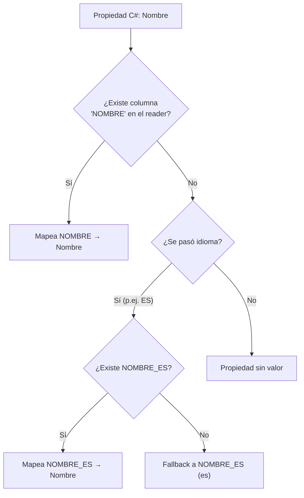

<!-- diagram id="resolucion-multiidioma-oraclebd3" caption: "Resolución de columnas con sufijo de idioma" -->

### 1.8.4 La clase ligera de lectura: `RecursoLectura`

Si solo vamos a **consumir** recursos (listado, autocompletado, combo), no necesitamos `NombreEs`, `NombreCa` y `NombreEn`. Una propiedad `Nombre` basta:

```csharp
// Models/Reservas/RecursoLectura.cs
namespace ua.Models.Reservas
{
    // DTO ligero pensado SOLO para lectura.
    // Tiene una sola propiedad Nombre (no las tres por idioma).
    // El idioma se resuelve al llamar a ObtenerTodosMapAsync(..., idioma).
    public class RecursoLectura
    {
        public int IdRecurso { get; set; }
        public string Nombre { get; set; } = string.Empty;        // ← NOMBRE_{idioma}
        public string? Descripcion { get; set; }                  // ← DESCRIPCION_{idioma}

        public int? Granulidad { get; set; }
        public int? Duracion { get; set; }

        public int? IdTipoRecurso { get; set; }
        public string? TipoCodigo { get; set; }
        public string? TipoNombre { get; set; }                   // ← TIPO_NOMBRE_{idioma}
    }
}
```

Y la consulta se reduce a una llamada:

```csharp
public async Task<List<RecursoLectura>> ObtenerLecturaAsync(string idioma)
{
    const string sql = @"
        SELECT ID_RECURSO,
               NOMBRE_ES, NOMBRE_CA, NOMBRE_EN,
               DESCRIPCION_ES, DESCRIPCION_CA, DESCRIPCION_EN,
               GRANULIDAD, DURACION,
               ID_TIPO_RECURSO, TIPO_CODIGO,
               TIPO_NOMBRE_ES, TIPO_NOMBRE_CA, TIPO_NOMBRE_EN
        FROM CURSONORMADM.VRES_RECURSO
        ORDER BY NOMBRE_" + idioma;

    var filas = await bd.ObtenerTodosMapAsync<RecursoLectura>(
        sql,
        param: null,
        idioma: idioma);          // ← resuelve Nombre, Descripcion, TipoNombre

    return filas?.ToList() ?? new List<RecursoLectura>();
}
```

::: tip BUENA PRÁCTICA — clase pesada vs clase ligera
Sobre la misma tabla podemos convivir con **dos modelos** según el uso:

| Uso                                       | Clase            | `Nombre*`                          |
| ----------------------------------------- | ---------------- | ---------------------------------- |
| Edición (necesita guardar los 3 idiomas)  | `Recurso`        | `NombreEs`, `NombreCa`, `NombreEn` |
| Listado/combo (solo lectura)              | `RecursoLectura` | `Nombre` (resuelto por idioma)     |

No es duplicación: cada clase es el **contrato adecuado para una operación**. Si una pantalla solo lee, no la obligues a cargar columnas que va a ignorar. **Estos modelos los construiremos desde cero en la próxima sección.**
:::

### 1.8.5 Antes (constructor `IDataRecord`) vs ahora (`ObtenerTodosMapAsync<T>`)

Esto importa porque en proyectos antiguos de la UA es probable que veas todavía el patrón **legacy**: cada modelo tenía un constructor que recibía `IDataRecord` y rellenaba las propiedades una a una.

::: code-group

```csharp [Antes (legacy)]
// Models/Reservas/RecursoLectura.cs — patrón antiguo
public class RecursoLectura
{
    public int IdRecurso { get; set; }
    public string Nombre { get; set; } = "";
    public string? Descripcion { get; set; }
    public bool Activo { get; set; }

    public RecursoLectura() { }

    // Constructor especial: mapeo MANUAL columna a columna
    public RecursoLectura(IDataRecord r)
    {
        IdRecurso  = Convert.ToInt32(r["ID_RECURSO"]);
        Nombre     = r["NOMBRE_ES"].ToString() ?? "";
        Descripcion= r["DESCRIPCION_ES"]?.ToString();
        Activo     = r["ACTIVO"]?.ToString() == "S";
    }
}

// Uso:
bd.TextoComando = "SELECT * FROM VRES_RECURSO";
var lista = bd.GetAllObjects<RecursoLectura>();  // usa el constructor
```

```csharp [Ahora (mapeo automático)]
// Models/Reservas/RecursoLectura.cs — sin constructor especial
public class RecursoLectura
{
    public int IdRecurso { get; set; }
    public string Nombre { get; set; } = "";        // ← multiidioma automático
    public string? Descripcion { get; set; }
    public bool Activo { get; set; }                // ← 'S'/'N' → bool automático
}

// Uso:
var lista = await bd.ObtenerTodosMapAsync<RecursoLectura>(
    "SELECT * FROM VRES_RECURSO",
    param: null,
    idioma: "ES");
```

:::

::: warning IMPORTANTE — ventajas del enfoque actual
- **Menos código**: desaparece el constructor `IDataRecord` y los `Convert.ToXxx` manuales.
- **Menos errores**: si añades una columna a la vista, el viejo constructor seguía sin leerla; ahora se mapea sola con solo añadir la propiedad.
- **Asíncrono**: `ObtenerTodosMapAsync<T>` no bloquea el hilo (importante en APIs con concurrencia).
- **Multiidioma de regalo**: el parámetro `idioma` cambia el sufijo en runtime sin tocar el modelo.

El patrón legacy sigue funcionando (`GetAllObjects<T>`, `GetObject<T>` están disponibles) pero está en el apéndice de la guía y se conserva solo por compatibilidad. **Para código nuevo, usa siempre `ObtenerTodosMap[Async]<T>` / `ObtenerPrimeroMap[Async]<T>`**.
:::

### 1.8.6 Cuándo necesitas `[Columna]` o `[IgnorarMapeo]`

| Atributo                | Cuándo usarlo                                                                            |
| ----------------------- | ---------------------------------------------------------------------------------------- |
| `[Columna("NOMBRE")]`   | La columna **no** sigue SNAKE_CASE (`IDDOC`, `FECALTA`, `CODPER`, etc.).                  |
| `[IgnorarMapeo]`        | Propiedad **calculada** (`get => $"{Nombre} ({Codigo})"`) o subobjeto rellenado a mano. |

Ejemplo combinando ambos:

```csharp
public class RecursoLectura
{
    public int IdRecurso { get; set; }

    [Columna("NOMBRE_ES")]   // forzamos columna concreta, ignoramos el idioma
    public string NombreOriginal { get; set; } = "";

    public string Nombre { get; set; } = "";  // resuelta por idioma

    [IgnorarMapeo]
    public string NombreConCodigo => $"{Nombre} ({TipoCodigo})";

    public string? TipoCodigo { get; set; }
}
```

::: danger ZONA PELIGROSA
Sin `[IgnorarMapeo]`, una propiedad como `NombreConCodigo` haría que `ClaseOracleBD3` buscase una columna `NOMBRE_CON_CODIGO` que **no existe** → excepción en runtime. Si una propiedad no proviene de la BD, márcala explícitamente.
:::

### 1.8.7 Documentación de referencia

La documentación completa de `ClaseOracleBD3` está en:

- [Guía de uso (Markdown)](https://preproddesa.campus.ua.es/docu-aplicaciones/guias/dotnet/nugets/claseoraclebd3.html)
- En el repositorio del NuGet: `ClaseOracleBD3/Documentacion/GUIA-DE-USO.md`

Allí se cubren transacciones, `REF CURSOR`, UDT, `funcionPostMapeo` para subobjetos y el apéndice "Código Legacy" con la tabla comparativa legacy/actual.

## 1.9 Cuando DataAnnotations se queda corto: FluentValidation

Las DataAnnotations (`[Required]`, `[StringLength]`, `[Range]`) que vimos antes son perfectas para validación **de campo aislado**. Pero hay reglas que las exceden:

- **Cruces entre campos**: si `FechaReserva` es hoy, entonces `HoraInicio` debe ser futura.
- **Reglas contra base de datos**: `IdRecurso` debe existir y estar activo.
- **Reglas de negocio**: la duración debe ser múltiplo de la `Granulidad` del recurso.
- **Detección de conflictos**: no puede solapar con otra reserva existente.

Para esto en la UA usamos **FluentValidation**.

::: info CONTEXTO
FluentValidation es una librería que separa las reglas del DTO. El DTO queda como una clase plana de propiedades; las reglas viven en un **`Validator`** dedicado, con API fluida (`RuleFor(x => x.Campo).NotEmpty().GreaterThan(0)`) y soporte nativo de **async** para tocar la BD.
:::

### 1.8.1 El caso real: crear una reserva

La tabla `TRES_RESERVA` tiene esta forma (resumida):

| Columna           | Tipo            | ¿Quién lo aporta?                                  |
| ----------------- | --------------- | -------------------------------------------------- |
| `ID_RESERVA`      | NUMBER (PK)     | Oracle (secuencia)                                 |
| `ID_RECURSO`      | NUMBER          | Cliente                                            |
| `FECHA_RESERVA`   | DATE            | Cliente                                            |
| `HORA_INICIO`     | NUMBER 0..23    | Cliente                                            |
| `MINUTO_INICIO`   | NUMBER 0..59    | Cliente                                            |
| `MINUTOS_RESERVA` | NUMBER > 0      | Cliente                                            |
| `OBSERVACIONES`   | VARCHAR2(1000)  | Cliente (opcional)                                 |
| **`CODPER`**      | **NUMBER**      | **Servidor (token JWT) — NUNCA el cliente**        |
| `FECHA_ALTA`      | DATE            | Oracle (`DEFAULT sysdate`)                         |
| `FECHA_CONFIRMACION` | DATE         | Servidor cuando se confirma                        |

Aplicando lo de 1.2, el DTO de entrada **solo** lleva los campos del cliente:

```csharp
// Models/Reservas/ReservaCrear.cs
public class ReservaCrear
{
    public int IdRecurso { get; set; }
    public DateTime FechaReserva { get; set; }
    public int HoraInicio { get; set; }      // 0..23
    public int MinutoInicio { get; set; }    // 0..59
    public int MinutosReserva { get; set; }  // > 0
    public string? Observaciones { get; set; }
}
```

::: danger ZONA PELIGROSA — `CODPER` no está en el DTO
El `CODPER` **no aparece** en `ReservaCrear`. Aunque la tabla lo necesite, el cliente nunca lo envía: lo inyecta el controlador desde el token JWT. Si lo pusiéramos en el DTO, un usuario podría crear reservas en nombre de **otra persona**.

> *"No puedes validar lo que no puedes recibir."* La forma más segura de validar `CODPER` es **no aceptarlo nunca como entrada**.
:::

### 1.8.2 Instalación y registro

```bash
dotnet add package FluentValidation.AspNetCore
```

```csharp
// Program.cs

// Registra todos los AbstractValidator<T> del ensamblado
builder.Services.AddValidatorsFromAssemblyContaining<ReservaCrearValidator>();
builder.Services.AddFluentValidationAutoValidation();   // integra con [ApiController]
```

Con `AddFluentValidationAutoValidation`, el `[ApiController]` ejecuta el validator antes de entrar al método. Si falla, ASP.NET devuelve **400 Bad Request** con el mismo formato `ValidationProblemDetails` que ya conocemos.

### 1.8.3 El validator: patrones que vas a repetir

Un validator es una clase que hereda de `AbstractValidator<T>` y declara las reglas en el constructor. Veamos los **tres patrones síncronos** (los asíncronos contra BD los veremos al construir los servicios desde cero):

**Patrón 1 — Rangos simples por campo** (equivalente a `[Range]` pero más legible):

```csharp
RuleFor(r => r.HoraInicio)
    .InclusiveBetween(0, 23)
    .WithMessage("La hora de inicio debe estar entre 0 y 23.");

RuleFor(r => r.MinutosReserva)
    .GreaterThan(0).WithMessage("La duracion debe ser mayor que 0.")
    .LessThanOrEqualTo(8 * 60).WithMessage("Maximo 8 horas.");
```

**Patrón 2 — Regla con `Must` (cruce de campos, síncrono):**

```csharp
RuleFor(r => r.FechaReserva)
    .NotEmpty().WithMessage("La fecha es obligatoria.")
    .Must(f => f.Date >= DateTime.Today)
        .WithMessage("La fecha no puede ser pasada.");
```

**Patrón 3 — `When` para reglas condicionales:**

```csharp
// Solo si la fecha es HOY exigimos que la hora sea futura.
When(r => r.FechaReserva.Date == DateTime.Today, () =>
{
    RuleFor(r => r)
        .Must(r =>
            r.FechaReserva.Date
             .AddHours(r.HoraInicio)
             .AddMinutes(r.MinutoInicio) > DateTime.Now)
        .WithName("HoraInicio")
        .WithMessage("La hora de inicio ya ha pasado.");
});
```

**Patrón 4 (avanzado) — `MustAsync` contra la base de datos:** la pieza que DataAnnotations **no** puede hacer. Permite preguntar a Oracle si una FK existe, si hay solapamiento, etc. **Se verá cuando construyamos los servicios desde cero**, porque requiere inyectar un servicio que sepa consultar Oracle.

::: tip BUENA PRÁCTICA — `WithName` cuando la regla es a nivel de objeto
Las reglas tipo `RuleFor(r => r).Must(...)` validan **todo el DTO**, no un campo concreto. Sin `WithName`, el error aparecería en una propiedad genérica. Usamos `WithName("HoraInicio")` para que el error se asocie al campo correcto.
:::

### 1.8.4 Lo que devuelve la API cuando falla la validación

Misma forma `ValidationProblemDetails` que con DataAnnotations — el cliente Vue no nota la diferencia:

```json
// POST /api/Reservas
{
  "idRecurso": 1,
  "fechaReserva": "2026-05-14",
  "horaInicio": 10,
  "minutoInicio": 15,        // ← granulidad del recurso = 30 min
  "minutosReserva": 45,      // ← no es multiplo de 30
  "observaciones": null
}

// Respuesta: 400 Bad Request
{
  "status": 400,
  "title": "One or more validation errors occurred.",
  "errors": {
    "MinutoInicio":   ["El minuto de inicio debe coincidir con la granulidad."],
    "MinutosReserva": ["La duracion debe ser multiplo de la granulidad del recurso."]
  }
}
```

### 1.8.5 DataAnnotations vs FluentValidation: cuándo cada uno

| Aspecto                            | DataAnnotations                 | FluentValidation                    |
| ---------------------------------- | ------------------------------- | ----------------------------------- |
| Reglas simples por campo           | ✅ Cómodo                       | ✅ Cómodo                           |
| Cruces entre campos                | ❌ Difícil                      | ✅ `Must`, `When`                   |
| Validación contra BD               | ❌ Imposible (sin código extra) | ✅ `MustAsync` con DI               |
| Mensaje localizado dinámico        | ⚠️ Limitado                    | ✅ Completo (`IStringLocalizer`)   |
| Reutilización de reglas            | ❌ Vive en el DTO              | ✅ Composición de validators       |
| Testabilidad                       | ⚠️ Mediante el controlador     | ✅ Test unitario directo           |
| Curva de aprendizaje               | ✅ Mínima                       | ⚠️ API nueva                       |

::: tip BUENA PRÁCTICA — combinar las dos
- **DataAnnotations** para rangos triviales y `[Required]` evidentes (descubrirles enseguida en Swagger).
- **FluentValidation** en cuanto aparece una regla que cruza campos o toca la BD.

No son excluyentes: puedes tener `[Required]` en el DTO y, además, un validator con reglas asíncronas. `[ApiController]` ejecuta ambos.
:::

### 1.8.6 Test unitario del validator (regalo casi gratis)

Una de las grandes ventajas: el validator **se prueba en aislamiento**, sin levantar Web ni HTTP. Para los patrones síncronos no necesitas ni base de datos: instancias el validator, le pasas un DTO con datos inválidos, y compruebas los errores. Esto se ampliará en la sesión de testing del curso, pero conviene saber desde ya que **cada regla que metes en el validator es una regla que podrás probar sin Oracle ni `WebApplicationFactory`**.

## 1.10 Probando el código: introducción a xUnit

A medida que construimos modelos, servicios y controladores, hace falta una red de seguridad: **una colección de pruebas automáticas que confirme que todo sigue funcionando** cuando cambies algo mañana. En .NET el estándar de facto es **xUnit**, y todo lo que has visto construir hasta aquí (`TiposRecursoServicio`, `TipoRecursosController`, `RecursosServicio`, `RecursosController`) lleva su correspondiente test.

::: info CONTEXTO — qué gano probando
- **Confianza para tocar código**: si rompes algo, los tests lo dicen en segundos.
- **Documentación viva**: un test bien escrito es el mejor ejemplo de cómo se usa una clase.
- **Diseño más limpio**: si una clase es difícil de probar, probablemente está mal diseñada (acoplamiento, dependencias rígidas, métodos demasiado largos).
:::

### 1.10.1 Lo mínimo que tienes que saber de xUnit

Un **test xUnit** es simplemente un método público de una clase pública marcado con un atributo:

```csharp
public class CalculadoraTests
{
    [Fact]
    public void Sumar_DosMasDos_DevuelveCuatro()
    {
        // ARRANGE: preparar
        var calc = new Calculadora();

        // ACT: ejecutar
        var resultado = calc.Sumar(2, 2);

        // ASSERT: verificar
        Assert.Equal(4, resultado);
    }
}
```

Tres bloques siempre presentes (patrón **AAA**: *Arrange, Act, Assert*):

| Bloque   | Qué hace                                              |
| -------- | ------------------------------------------------------ |
| Arrange  | Prepara los datos y dependencias.                      |
| Act      | Llama al método que se quiere probar.                  |
| Assert   | Verifica que el resultado coincide con lo esperado.    |

#### Los atributos que vas a ver

| Atributo                | Para qué                                                             |
| ----------------------- | -------------------------------------------------------------------- |
| `[Fact]`                | Un test "normal". Sin parámetros.                                    |
| `[Theory] + [InlineData(...)]` | Mismo test ejecutado varias veces con datos distintos.        |
| `[SkippableFact]`       | Test que puede saltarse si no hay condiciones (de `Xunit.SkippableFact`). Lo usamos cuando no hay BD configurada. |
| `IClassFixture<T>`      | Interfaz que comparte un objeto pesado entre todos los tests de la clase (p.ej. una conexión Oracle). |

#### Los asserts más habituales

```csharp
Assert.Equal(esperado, actual);             // igualdad
Assert.True(condicion);                      // true / false
Assert.Null(valor);          Assert.NotNull(valor);
Assert.Empty(coleccion);     Assert.NotEmpty(coleccion);
Assert.Single(coleccion);                    // exactamente 1 elemento
Assert.Contains(elemento, coleccion);        // contiene
Assert.IsType<T>(objeto);                    // tipo exacto
Assert.Throws<ExcepcionConcreta>(() => ...); // lanza esa excepción
```

#### Cómo se ejecutan los tests

```powershell
# Desde la solución
dotnet test

# Solo un proyecto
dotnet test uaReservas.Tests

# Filtrando por nombre
dotnet test --filter "FullyQualifiedName~TiposRecurso"
```

Visual Studio y Rider tienen además **Test Explorer**, que muestra los tests como un árbol y permite ejecutar / depurar uno a uno.

### 1.10.2 Cómo hemos probado lo que llevamos construido

El proyecto `uaReservas.Tests` que acompaña al curso tiene **dos sabores** de tests, separados por carpeta. Son intencionadamente distintos porque responden a preguntas distintas:

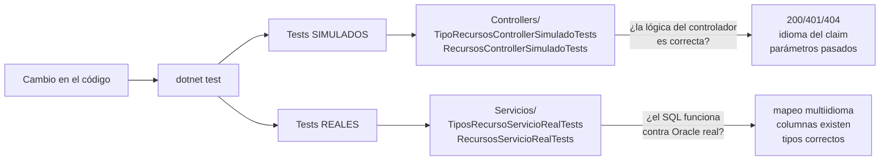

<!-- diagram id="dos-tipos-tests" caption: "Dos tipos de tests con propósitos distintos: simulados (controladores) vs reales (servicios)." -->

| Carpeta            | Tipo       | Qué prueban                              | Velocidad        | Necesitan Oracle |
| ------------------ | ---------- | ---------------------------------------- | ---------------- | ---------------- |
| `Controllers/`     | Simulados  | Lógica del **controlador** sin tocar BD. | Milisegundos.    | No.              |
| `Servicios/`       | Reales     | SQL del **servicio** contra el esquema.  | Segundos.        | Sí (esquema test). |

### 1.10.3 Tests SIMULADOS: el patrón "fake" para los controladores

Para probar un controlador, **lo único que nos interesa** es:

- ¿Devuelve `200` cuando el servicio devuelve datos?
- ¿Devuelve `404` cuando el servicio devuelve `null`?
- ¿Pasa al servicio el **idioma correcto** del usuario?
- ¿Pasa al servicio el **id correcto**?

No queremos que esos tests toquen Oracle: eso sería frágil y lento. La técnica clásica es **inyectar un doble del servicio** (un "fake") que devuelve datos pre-calculados y registra las llamadas que recibe.

```csharp
// uaReservas.Tests/Infraestructura/FakeTiposRecursoServicio.cs (resumido)
public class FakeTiposRecursoServicio : ITiposRecursoServicio
{
    // Cada test rellena estas propiedades antes de actuar
    public List<TipoRecursoLectura> ListaParaDevolver { get; set; } = new();

    // El fake registra todo lo que recibe para que el test pueda verificarlo
    public List<string> IdiomasPedidos { get; } = new();

    public Task<List<TipoRecursoLectura>> ObtenerTodosAsync(string idioma)
    {
        IdiomasPedidos.Add(idioma);
        return Task.FromResult(ListaParaDevolver);
    }
    // ... resto de métodos de la interfaz
}
```

Un test típico tiene esta forma:

```csharp
[Fact]
public async Task Listar_LaCabeceraXIdioma_ManaPorEncimaDelClaim()
{
    // ARRANGE
    // 1) Creamos un controlador con:
    //    - un fake del servicio
    //    - un usuario "autenticado" con claim LENGUA=es Y cabecera X-Idioma=en
    var (controller, fakeServicio) = CrearControlador(
        idiomaClaim: "es",
        cabeceraXIdioma: "en");

    // ACT
    await controller.Listar();

    // ASSERT
    // El controlador debe haber pasado al servicio el idioma "en" (cabecera gana)
    Assert.Equal("en", fakeServicio.IdiomasPedidos[0]);
}
```

::: tip BUENA PRÁCTICA — qué es un "fake" y qué no
- **Fake**: implementación a mano de una interfaz, con comportamiento controlado por el test. Es lo que usamos aquí.
- **Mock**: un fake generado por una librería (Moq, NSubstitute) con sintaxis declarativa.
- **Stub**: un fake que solo devuelve datos canned, sin verificar nada.

Para los tests del curso usamos **fakes a mano**. Son más verbosos pero infinitamente más claros para alguien que está empezando: no hay magia, ves exactamente qué devuelve.
:::

### 1.10.4 Tests REALES: contra el esquema de Oracle de test

Una vez sabemos que el controlador delega bien, queremos verificar que el **servicio** (que es quien habla con Oracle) cumple lo prometido: que sus SQL son correctos, que las columnas existen, que el multiidioma funciona.

Para esto **no hay sustituto a probar contra Oracle de verdad**. Pero contra el esquema de **test**, no el de producción.

#### La fixture compartida

xUnit crea **una instancia nueva de la clase de tests** por cada `[Fact]`. Si cada test abriese su conexión Oracle, sería costosísimo. Por eso usamos un **fixture compartido**: un objeto que se crea **una vez** y vive el tiempo de toda la suite.

```csharp
// Marcador IClassFixture<T>: "comparte una OracleTestFixture entre todos
// los tests de esta clase"
public class TiposRecursoServicioRealTests : IClassFixture<OracleTestFixture>
{
    private readonly OracleTestFixture _fixture;

    public TiposRecursoServicioRealTests(OracleTestFixture fixture)
    {
        _fixture = fixture;
    }
    // ...
}
```

La `OracleTestFixture`:
1. Lee la cadena `oradb` de **user-secrets** (recuerda 0.3).
2. Si no hay cadena, marca `HayConexion = false` y los tests se **saltan**.
3. Si la hay, monta un mini-`ServiceProvider` con `ClaseOracleBd` registrado, como en la app real.

#### Tests que se saltan si no hay BD

```csharp
[SkippableFact]
public async Task ObtenerTodosAsync_Devuelve_AlMenosUnTipo()
{
    Skip.IfNot(_fixture.HayConexion, _fixture.MotivoSinConexion);

    // ... el test usa el ClaseOracleBd real ...
}
```

`Skip.IfNot(...)` **no falla** el test si la condición no se cumple: lo marca como **skipped**. En CI sin BD, la suite queda verde con un mensaje claro. En tu equipo con BD configurada, los tests se ejecutan de verdad.

#### Qué cazan estos tests

| Bug que solo se detecta con BD real      | Ejemplo                                            |
| ---------------------------------------- | -------------------------------------------------- |
| SQL con error de sintaxis                 | Olvidé una coma, alias mal puesto.                 |
| Columna que no existe en la vista         | Renombramos `NOMBRE_ES` a `NOM_ES` y se nos olvidó. |
| Tipo de columna que no encaja             | `GRANULIDAD` es `NUMBER` y el DTO la tiene `string`. |
| Mapeo multiidioma fallido                 | `idioma="ca"` pero la vista no expone `NOMBRE_CA`. |
| Conversión `'S'/'N'` ↔ `bool` rota        | `Activo` viene como string crudo.                  |

### 1.10.5 Mapa de los tests creados hasta ahora

Resumen rápido de qué hemos probado en cada pieza:

| Pieza bajo test               | Tipo de test    | Casos cubiertos                                                                       |
| ----------------------------- | --------------- | ------------------------------------------------------------------------------------- |
| `TipoRecursosController`      | Simulado        | `Listar` 200 con datos; idioma del claim; cabecera `X-Idioma` gana al claim; `va→ca`. |
| `TipoRecursosController`      | Simulado        | `ObtenerPorId` 200 si existe; 404 con `ProblemDetails` si no; paso del id al servicio. |
| `RecursosController`          | Simulado        | `Listar` sin filtro vs `?idTipoRecurso=N`; idioma del claim; paso correcto del id.    |
| `TiposRecursoServicio`        | Real (Oracle)   | Listar trae registros; multiidioma; normalización `va→ca`; `ObtenerPorId` con null y con valor. |
| `RecursosServicio`            | Real (Oracle)   | Listar; filtrar por tipo; multiidioma; `ExisteAsync` true/false; detalle por id.      |

::: warning IMPORTANTE
Los tests **simulados** se ejecutan SIEMPRE: en tu equipo, en CI, en cualquier máquina. Los tests **reales** solo si has configurado `ConnectionStrings:oradb` en user-secrets del proyecto de tests (ver 0.3). Esa separación es deliberada:
- En CI corremos solo simulados (rápidos, deterministas).
- En tu equipo de desarrollo corres ambos cuando vayas a hacer un merge.
:::

### 1.10.6 Pequeño glosario para no perderse

| Término             | Qué significa                                                            |
| ------------------- | ------------------------------------------------------------------------ |
| **xUnit**           | El framework de tests de .NET que usamos.                                |
| **Fact**            | Un test individual.                                                      |
| **Theory**          | Un test ejecutado N veces con N juegos de datos (`[InlineData(...)]`).   |
| **Assert**          | Comprobación de que algo es como esperamos.                              |
| **AAA**             | Arrange, Act, Assert — la estructura de cualquier test.                  |
| **Fake / Mock**     | Objeto que sustituye a una dependencia real durante el test.             |
| **Fixture**         | Objeto compartido entre los tests de una clase (conexión BD, etc.).      |
| **Skip**            | Marcar un test como "no se ejecuta" sin que cuente como fallo.            |
| **Test runner**     | Visual Studio Test Explorer, `dotnet test`, Rider — quien ejecuta y reporta. |

Esto es lo justo para entender los tests del curso. Cuando llegue la sesión dedicada a testing avanzado, profundizaremos en `[Theory]` con `MemberData`, mocks generados con Moq, `WebApplicationFactory` para tests de integración HTTP completos, y cobertura de código.

## 1.11 Práctica guiada: Rojo-Verde-Refactor con validación

::: tip SESIÓN DE INTEGRACIÓN
Esta práctica introduce DataAnnotations como primer contacto con la validación. El tema se amplía en la **Sesión 12 — Validación en todas las capas**, donde se cubre FluentValidation, localización de mensajes y validación end-to-end con Vue.
:::

En esta sección practicamos el ciclo **Rojo-Verde-Refactor** usando el `EcoController`: un controlador que devuelve exactamente el mismo DTO que recibe. No necesita base de datos, así que podemos centrarnos en la validación.

### Paso 1: ROJO — Sin validación, todo pasa

Nuestro DTO inicial no tiene ninguna validación:

```csharp
// Models/Eco/ClaseEcoUnidad.cs
public class ClaseEcoUnidad
{
    public string? NombreEs { get; set; }
    public string? NombreCa { get; set; }
    public string? NombreEn { get; set; }
    public int Granularidad { get; set; }
    public string? EmailContacto { get; set; }
}
```

Y el controlador simplemente devuelve lo que recibe:

```csharp
// Controllers/Apis/EcoController.cs
[Route("api/[controller]")]
[ApiController]
public class EcoController : ControllerBase
{
    [HttpPost]
    public ActionResult<ClaseEcoUnidad> Eco([FromBody] ClaseEcoUnidad dto)
    {
        return Ok(dto);
    }

    [HttpPost("validar")]
    public ActionResult<ClaseEcoUnidad> Validar([FromBody] ClaseEcoUnidad dto)
    {
        return Ok(dto);
    }
}
```

**Probamos en Vue** enviando un DTO con campos vacíos al endpoint `/api/Eco/validar`:

```json
// Enviamos esto:
{
  "nombreEs": "",
  "nombreCa": "",
  "nombreEn": "",
  "granularidad": 0,
  "emailContacto": ""
}

// Recibimos 200 OK con el mismo DTO vacío:
{
  "nombreEs": "",
  "nombreCa": "",
  "nombreEn": "",
  "granularidad": 0,
  "emailContacto": ""
}
```

::: danger ESTO ES ROJO
La API acepta datos completamente vacíos. Un nombre vacío, una granularidad de 0 minutos y un email vacío no deberían ser válidos. Necesitamos **validación**.
:::

Desde el cliente (Vue) el endpoint `/api/Eco/validar` se prueba como cualquier POST. Cuando los datos son válidos llega `200 OK` con el DTO; cuando no, llega `400 Bad Request` con `ValidationProblemDetails`. El código Vue se aborda en sesiones siguientes; aquí nos centramos en **lo que la API devuelve**.

### Paso 2: VERDE — Añadimos [Required] y .NET rechaza datos vacíos

Añadimos `[Required]` a los tres campos de nombre:

```csharp
// Models/Eco/ClaseEcoUnidad.cs — Fase VERDE
using System.ComponentModel.DataAnnotations;

public class ClaseEcoUnidad
{
    [Required(ErrorMessage = "El nombre en español es obligatorio")]
    public string? NombreEs { get; set; }

    [Required(ErrorMessage = "El nombre en valenciano es obligatorio")]
    public string? NombreCa { get; set; }

    [Required(ErrorMessage = "El nombre en inglés es obligatorio")]
    public string? NombreEn { get; set; }

    public int Granularidad { get; set; }
    public string? EmailContacto { get; set; }
}
```

**Enviamos el mismo DTO vacío** y ahora la API devuelve `400 Bad Request` con un `ValidationProblemDetails`:

```json
// POST /api/Eco/validar con campos vacíos
// Respuesta: 400 Bad Request
{
  "type": "https://tools.ietf.org/html/rfc9110#section-15.5.1",
  "title": "One or more validation errors occurred.",
  "status": 400,
  "errors": {
    "NombreEs": ["El nombre en español es obligatorio"],
    "NombreCa": ["El nombre en valenciano es obligatorio"],
    "NombreEn": ["El nombre en inglés es obligatorio"]
  }
}
```

::: tip ESTO ES VERDE
Ahora la API rechaza datos vacíos con mensajes claros por cada campo. El `[ApiController]` se encarga de validar automáticamente el `ModelState` y devolver el `ValidationProblemDetails` estándar (RFC 7807). **No hemos escrito ni una línea de código de validación en el controlador**.
:::

Desde el cliente, la clave `errors` del `ValidationProblemDetails` lleva un diccionario `campo → lista de mensajes`. Eso es exactamente lo que cualquier formulario necesita para pintar errores junto a cada campo — pero ese código del lado del cliente lo dejamos para más adelante.

### Paso 3: REFACTOR — Validaciones más específicas

Ahora mejoramos las validaciones añadiendo restricciones de longitud, rango numérico y expresión regular para el email:

```csharp
// Models/Eco/ClaseEcoUnidad.cs — Fase REFACTOR
public class ClaseEcoUnidad
{
    [Required(ErrorMessage = "El nombre en español es obligatorio")]
    [StringLength(200, MinimumLength = 3,
        ErrorMessage = "El nombre en español debe tener entre 3 y 200 caracteres")]
    public string? NombreEs { get; set; }

    [Required(ErrorMessage = "El nombre en valenciano es obligatorio")]
    [StringLength(200, MinimumLength = 3,
        ErrorMessage = "El nombre en valenciano debe tener entre 3 y 200 caracteres")]
    public string? NombreCa { get; set; }

    [Required(ErrorMessage = "El nombre en inglés es obligatorio")]
    [StringLength(200, MinimumLength = 3,
        ErrorMessage = "El nombre en inglés debe tener entre 3 y 200 caracteres")]
    public string? NombreEn { get; set; }

    [Range(5, 120, ErrorMessage = "La granularidad debe estar entre 5 y 120 minutos")]
    public int Granularidad { get; set; }

    [EmailAddress(ErrorMessage = "El formato del email no es válido")]
    [RegularExpression(@"^[^@]+@(ua\.es|alu\.ua\.es)$",
        ErrorMessage = "El email debe ser de @ua.es o @alu.ua.es")]
    public string? EmailContacto { get; set; }
}
```

**Probamos con datos inválidos:**

```json
// POST /api/Eco/validar
{
  "nombreEs": "AB",
  "nombreCa": "Unitat de prova",
  "nombreEn": "Test unit",
  "granularidad": 3,
  "emailContacto": "usuario@gmail.com"
}

// Respuesta: 400 Bad Request
{
  "type": "https://tools.ietf.org/html/rfc9110#section-15.5.1",
  "title": "One or more validation errors occurred.",
  "status": 400,
  "errors": {
    "NombreEs": ["El nombre en español debe tener entre 3 y 200 caracteres"],
    "Granularidad": ["La granularidad debe estar entre 5 y 120 minutos"],
    "EmailContacto": ["El email debe ser de @ua.es o @alu.ua.es"]
  }
}
```

::: tip ESTO ES REFACTOR
Cada atributo de validación añade una capa más de seguridad. Observa cómo se acumulan los errores: un mismo campo puede tener varios mensajes (por ejemplo, `EmailContacto` primero valida formato y luego dominio). Los atributos más comunes son:

| Atributo                                   | Propósito            | Ejemplo                  |
| ------------------------------------------ | -------------------- | ------------------------ |
| `[Required]`                               | Campo obligatorio    | Nombres, códigos         |
| `[StringLength(max, MinimumLength = min)]` | Longitud de texto    | Entre 3 y 200 caracteres |
| `[Range(min, max)]`                        | Rango numérico       | Granularidad 5-120 min   |
| `[EmailAddress]`                           | Formato de email     | Validación RFC estándar  |
| `[RegularExpression(pattern)]`             | Patrón personalizado | Solo emails @ua.es       |

:::

## Ejercicio Sesión 1

**Objetivo:** Crear una API de reservas sin base de datos y consumirla desde Vue.

1. Crear el DTO `ClaseReserva` con propiedades: `CodReserva`, `Descripcion`, `FechaInicio`, `FechaFin`, `Activo`
2. Crear `ReservasController` con:
   - `GET /api/Reservas` → Lista de reservas hardcodeadas
   - `GET /api/Reservas/{id}` → Buscar por ID (devolver `404` si no existe)
   - `GET /api/Reservas/error` → Devolver un `Problem` con código 500
3. En Vue, crear una vista que:
   - Llame a la API y muestre las reservas
   - Tenga un botón para provocar el error 500 y comprobar que llega como `ProblemDetails`

::: details Solución

**DTO:**

```csharp
// Models/Reserva/ClaseReserva.cs
public class ClaseReserva
{
    public int CodReserva { get; set; }
    public string Descripcion { get; set; }
    public DateTime FechaInicio { get; set; }
    public DateTime FechaFin { get; set; }
    public bool Activo { get; set; }
}
```

**Controlador:**

```csharp
// Controllers/Apis/ReservasController.cs
[Route("api/[controller]")]
[ApiController]
public class ReservasController : ControllerBase
{
    private static readonly List<ClaseReserva> _reservas = new()
    {
        new ClaseReserva
        {
            CodReserva = 1,
            Descripcion = "Sala de reuniones A",
            FechaInicio = new DateTime(2026, 3, 1, 10, 0, 0),
            FechaFin = new DateTime(2026, 3, 1, 11, 0, 0),
            Activo = true
        },
        new ClaseReserva
        {
            CodReserva = 2,
            Descripcion = "Aula de formación B",
            FechaInicio = new DateTime(2026, 3, 2, 9, 0, 0),
            FechaFin = new DateTime(2026, 3, 2, 12, 0, 0),
            Activo = true
        }
    };

    [HttpGet]
    public IActionResult Listar()
    {
        return Ok(_reservas.Where(r => r.Activo));
    }

    [HttpGet("{id}")]
    public IActionResult ObtenerPorId(int id)
    {
        var reserva = _reservas.FirstOrDefault(r => r.CodReserva == id);
        return reserva != null ? Ok(reserva) : NotFound();
    }

    [HttpGet("error")]
    public IActionResult ProvocarError()
    {
        return Problem(detail: "Error simulado del servidor", statusCode: 500);
    }
}
```

**Vista Vue:** se aborda en sesiones posteriores. Conceptualmente: una llamada GET a `/api/Reservas` para la lista (que entra por `.then`) y otra GET a `/api/Reservas/error` para provocar el 500 (que entra por `.catch`).

:::

::: details Código con fallos para Copilot (Controlador)
Copia este código en tu proyecto. Tiene **5 errores intencionados**. Usa Copilot para identificarlos y corregirlos:

```csharp
// ⚠️ CÓDIGO CON FALLOS - Usa Copilot para arreglarlo
[Route("api/controller")]          // 🐛 Falta [controller] entre corchetes
[ApiController]
public class ReservasController    // 🐛 No hereda de ControllerBase
{
    private static readonly List<ClaseReserva> _reservas = new()
    {
        new ClaseReserva { CodReserva = 1, Descripcion = "Sala A" }
    };

    [HttpGet]
    public IActionResult Listar()
    {
        return _reservas;           // 🐛 Falta Ok() para devolver IActionResult
    }

    [HttpGet("{id}")]
    public IActionResult ObtenerPorId(string id)  // 🐛 id debería ser int
    {
        var reserva = _reservas.FirstOrDefault(r => r.CodReserva == id);
        return Ok(reserva);         // 🐛 No comprueba si es null → debería devolver NotFound
    }
}
```

:::

::: details Código con fallos para Copilot (Validación DTO)
Este DTO tiene **4 errores** en las DataAnnotations:

```csharp
// ⚠️ CÓDIGO CON FALLOS - DTO con validaciones incorrectas
public class ClaseEcoUnidad
{
    [Required]                          // 🐛 Sin ErrorMessage → mensaje genérico en inglés
    [StringLength(200)]                 // 🐛 Falta MinimumLength → acepta strings de 1 carácter
    public string? NombreEs { get; set; }

    public string? NombreCa { get; set; }   // 🐛 Falta [Required] → acepta vacío

    [Range(0, 999)]                     // 🐛 Rango incorrecto: acepta 0 min y 999 min
    public int Granularidad { get; set; }

    [RegularExpression(@"@ua.es")]      // 🐛 Regex mal: no ancla, no escapa el punto,
    public string? EmailContacto { get; set; }  //     no contempla @alu.ua.es
}
```

:::

## Preguntas de test

::: details 1. ¿Qué es un DTO?
**a)** Un objeto que contiene lógica de negocio y accede a la base de datos
**b)** Un objeto que transporta datos entre capas sin lógica de negocio ✅
**c)** Un componente de Vue que muestra datos al usuario
**d)** Un middleware de autenticación en .NET Core
:::

::: details 2. ¿Qué hace el atributo [ApiController] en un controlador?
**a)** Registra el controlador en el contenedor de inyección de dependencias
**b)** Habilita la autenticación JWT automáticamente
**c)** Valida automáticamente el ModelState y devuelve 400 si no es válido ✅
**d)** Genera documentación Swagger para todas las acciones
:::

::: details 3. ¿Qué código HTTP devuelve NotFound()?
**a)** 400 Bad Request
**b)** 401 Unauthorized
**c)** 404 Not Found ✅
**d)** 500 Internal Server Error
:::

::: details 4. ¿Cuál es la ruta generada para un controlador llamado UnidadesController con [Route("api/[controller]")]?
**a)** `/api/UnidadesController`
**b)** `/api/Unidades` ✅
**c)** `/Unidades`
**d)** `/api/controller/Unidades`
:::

::: details 5. ¿Qué verbo HTTP se usa para crear un recurso nuevo?
**a)** GET
**b)** PUT
**c)** POST ✅
**d)** DELETE
:::

::: details 6. ¿Por qué un controlador API NO debe devolver `200 OK` con un cuerpo `{ "error": "..." }`?
**a)** Porque axios no sabe leer JSON
**b)** Porque rompe el contrato HTTP: el cliente solo ve "todo bien" y nunca entra por la rama de error ✅
**c)** Porque Swagger no documenta esa respuesta
**d)** Porque `Ok()` solo admite strings, no objetos
:::

::: details 7. Si un controlador API devuelve Problem(detail: "Error", statusCode: 500), ¿qué formato tiene la respuesta?
**a)** Un string plano con el mensaje de error
**b)** Un JSON con formato ProblemDetails (RFC 7807) ✅
**c)** Un HTML con la página de error del servidor
**d)** Un código de estado sin cuerpo de respuesta
:::

::: details 8. En el proyecto UA, ¿de qué clase hereda un controlador API básico?
**a)** `Controller`
**b)** `ControllerBase` ✅
**c)** `ApiController`
**d)** `BaseApiController`
:::

::: details 9. Si un DTO tiene [Required] en una propiedad string y enviamos ese campo vacío, ¿qué ocurre con [ApiController]?
**a)** La acción del controlador recibe el string vacío y debe validarlo manualmente
**b)** .NET devuelve automáticamente un 400 Bad Request con ValidationProblemDetails ✅
**c)** .NET lanza una excepción NullReferenceException
**d)** El campo se rellena con un valor por defecto
:::

::: details 10. ¿Qué expresión regular valida que un email sea de @ua.es o @alu.ua.es?
**a)** `@".*@ua\.es$"` — solo valida @ua.es, no @alu.ua.es
**b)** `@"^[^@]+@(ua\.es|alu\.ua\.es)$"` ✅
**c)** `@"@ua.es|@alu.ua.es"` — no ancla el patrón, acepta texto extra
**d)** `@"^.+@ua\.es$"` — solo valida @ua.es
:::

---

## Tests y práctica IA

- [Ver tests y práctica de la sesión](../../test/sesion-1/)
- [Autoevaluación sesión 1](../../test/sesion-1/autoevaluacion.md)
- [Preguntas de test sesión 1](../../test/sesion-1/preguntas.md)
- [Respuestas del test sesión 1](../../test/sesion-1/respuestas.md)
- [Práctica IA-fix sesión 1](../../test/sesion-1/practica-ia-fix.md)

---

**Siguiente:** [Sesión 2: Servicios, Oracle y ClaseOracleBD3](../sesion-2-servicios-oracle/)
