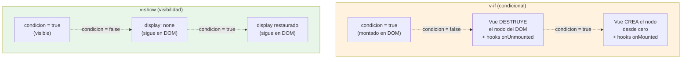

# Sesión 7: Directivas, eventos y datos (~90 min)

<!-- [[toc]] -->

::: info CONTEXTO
En la sesión anterior vimos la estructura de un componente, TypeScript básico, reactividad e interpolación. Ahora damos el paso hacia la **interactividad real**: primero tipamos mejor nuestros datos con **interfaces** y **funciones**, y después construimos interfaces dinámicas con directivas, eventos y transformación de datos.

**Al terminar esta sesión sabrás:**
- Definir contratos de datos con interfaces y escribir funciones tipadas en componentes Vue
- Renderizar listas, mostrar/ocultar elementos y vincular atributos
- Manejar eventos del DOM con modificadores
- Transformar arrays con `.map()`, `.filter()`, `.find()` y `.reduce()`
- Trabajar con objetos con spread, destructuring y acceso seguro a propiedades
:::

## Plan de sesión (90 min) {#plan-90}

| Bloque | Tiempo | Contenido |
|--------|--------|-----------|
| **Teoría guiada** | 45 min | 2.1 a 2.10 (interfaces, directivas, eventos, arrays y objetos) |
| **Práctica en aula** | 25 min | Lista de tareas tipada con filtros y eventos |
| **Test de sesión** | 15 min | Preguntas de comprensión y corrección inmediata |
| **Cierre** | 5 min | Dudas frecuentes y transición a componentes/comunicación |

::: tip OBJETIVO PEDAGÓGICO
La prioridad en esta sesión es que el alumno no solo "sepa usar" una directiva, sino que entienda cuándo elegir cada una y cómo evitar errores típicos de estado y renderizado.
:::

## 2.1 Interfaces y contratos de datos {#interfaces}

Antes de renderizar listas o construir formularios, necesitamos **describir la forma de los datos** con los que trabajamos. Para eso usamos **interfaces**.

### Interface local dentro de un componente

```html
<script setup lang="ts">
import { ref } from 'vue'

interface IClaseTarea {
  id: number
  texto: string
  completada: boolean
}

const tareas = ref<IClaseTarea[]>([
  { id: 1, texto: 'Preparar demo', completada: false },
  { id: 2, texto: 'Revisar documentación', completada: true }
])
</script>
```

### ¿Dónde crear la interface?

| Ubicación | Cuándo usar | Ventaja |
|-----------|-------------|---------|
| Dentro del `.vue` | Solo se usa en ese componente | Más simple para empezar |
| `src/interfaces/IClaseNombre.ts` | Se reutiliza en varias vistas/componentes | Centraliza el contrato |

::: tip BUENA PRÁCTICA
En la UA usamos `IClase<Nombre>` para contratos reutilizables y los guardamos en `src/interfaces/` cuando dejan de ser locales.
:::

## 2.2 Funciones en TypeScript aplicadas a Vue {#funciones}

En Vue declaramos funciones dentro de `<script setup>` para responder a eventos, transformar datos o encapsular pequeñas reglas de negocio.

### Funciones tipadas

```typescript
const sumar = (a: number, b: number): number => a + b

const mostrarAlerta = (mensaje: string): void => {
  alert(mensaje)
}

const obtenerEtiqueta = (completada: boolean): string => {
  return completada ? 'Hecha' : 'Pendiente'
}
```

### Parámetros opcionales y valores por defecto

```typescript
const saludar = (nombre: string, apellido?: string): string => {
  return apellido ? `Hola ${nombre} ${apellido}` : `Hola ${nombre}`
}

const crearMensaje = (texto: string, prefijo: string = 'INFO'): string => {
  return `[${prefijo}] ${texto}`
}
```

### Funciones dentro de un componente Vue

```html
<script setup lang="ts">
import { ref } from 'vue'

const nuevaTarea = ref<string>('')

const limpiarTexto = (texto: string): string => texto.trim()

const agregarTarea = (): void => {
  const textoLimpio = limpiarTexto(nuevaTarea.value)
  if (!textoLimpio) return
  console.log('Tarea válida:', textoLimpio)
}
</script>
```

::: tip IDEA CLAVE
Tipa siempre parámetros y retorno cuando la función tenga cierta importancia. En handlers pequeños como `@click="contador++"` no hace falta extraer función si no aporta claridad.
:::

## 2.3 Directivas: tabla resumen {#directivas-resumen}

Las directivas son atributos especiales que empiezan por `v-` y aplican comportamiento reactivo al DOM:

| Directiva | Atajo | Descripción | Uso principal |
|-----------|-------|-------------|---------------|
| `v-if` / `v-else-if` / `v-else` | — | Renderizado condicional (añade/elimina del DOM) | Condiciones que cambian poco |
| `v-show` | — | Visibilidad (CSS `display: none`) | Toggle frecuente (modales, tabs) |
| `v-for` | — | Renderizado de listas | Iterar arrays/objetos |
| `v-bind` | `:` | Vincular atributos HTML | class, style, src, href, props |
| `v-model` | — | Enlace bidireccional | Inputs, selects, textareas |
| `v-on` | `@` | Escuchar eventos | click, input, submit |
| `v-html` | — | Renderizar HTML | Contenido HTML confiable |

## 2.4 Renderizado condicional: `v-if` y `v-show` {#condicional}

### `v-if`, `v-else-if`, `v-else`

Controlan si un elemento **existe en el DOM**. Si la condición es falsa, el elemento se elimina completamente:

```html
<script setup lang="ts">
import { ref } from 'vue'

const edad = ref<number>(20)
</script>

<template>
  <p v-if="edad < 13">Eres un niño</p>
  <p v-else-if="edad < 18">Eres adolescente</p>
  <p v-else-if="edad < 65">Eres adulto</p>
  <p v-else>Eres mayor</p>
</template>
```

### `v-show`

El elemento **siempre está en el DOM**, solo se oculta con CSS:

```html
<script setup lang="ts">
import { ref } from 'vue'

const mostrarModal = ref<boolean>(false)
</script>

<template>
  <button @click="mostrarModal = !mostrarModal">
    {{ mostrarModal ? 'Ocultar' : 'Mostrar' }} Modal
  </button>

  <div v-show="mostrarModal" class="modal">
    <h2>Contenido del Modal</h2>
  </div>
</template>
```

### ¿Cuándo usar cada uno?

| Aspecto | `v-if` | `v-show` |
|---------|--------|----------|
| **DOM** | Añade / elimina el elemento | Siempre en el DOM (`display: none`) |
| **Rendimiento inicial** | Más rápido si la condición es falsa | Siempre renderiza |
| **Toggle frecuente** | Más costoso (recrea el elemento) | Más eficiente (solo cambia CSS) |
| **Cuándo usar** | Condiciones que cambian poco | Modales, tabs, toggles frecuentes |

El siguiente diagrama enseña la diferencia material: con `v-if` Vue **destruye y recrea** el nodo y dispara los hooks del ciclo de vida; con `v-show` el nodo **vive todo el tiempo** en el DOM y solo cambia su CSS:



<!-- diagram id="s7-vif-vshow-ciclo" caption: "v-if destruye/recrea el nodo; v-show solo cambia su display" -->

::: tip CONSECUENCIA PRACTICA
Si un componente hijo dentro de `v-if` tiene `onMounted` con una llamada a la API, esa llamada se repetira CADA vez que `condicion` pase de false a true. Con `v-show` solo ocurre una vez (cuando se monta el padre).
:::

## 2.5 Renderizado de listas: `v-for` {#listas}

Itera sobre arrays, objetos o rangos numéricos:

### Arrays

```html
<script setup lang="ts">
import { ref } from 'vue'

interface IClaseUsuario {
  id: number
  nombre: string
  edad: number
}

const usuarios = ref<IClaseUsuario[]>([
  { id: 1, nombre: 'Ana', edad: 25 },
  { id: 2, nombre: 'Juan', edad: 30 },
  { id: 3, nombre: 'María', edad: 28 }
])
</script>

<template>
  <table>
    <tbody>
      <!-- ✅ SIEMPRE usa el ID único como :key -->
      <tr v-for="usuario in usuarios" :key="usuario.id">
        <td>{{ usuario.id }}</td>
        <td>{{ usuario.nombre }}</td>
        <td>{{ usuario.edad }}</td>
      </tr>
    </tbody>
  </table>
</template>
```

### Objetos y rangos

```html
<template>
  <!-- Recorrer propiedades de un objeto -->
  <ul>
    <li v-for="(valor, clave) in persona" :key="clave">
      {{ clave }}: {{ valor }}
    </li>
  </ul>

  <!-- Rango numérico (empieza en 1) -->
  <span v-for="n in 5" :key="n">{{ n }} </span>
  <!-- Renderiza: 1 2 3 4 5 -->
</template>
```

### El atributo `:key`

`:key` es **obligatorio** con `v-for`. Ayuda a Vue a identificar cada elemento de forma única:

| Tipo de datos | `:key` recomendado | Ejemplo |
|---------------|-------------------|---------|
| Array de objetos | `:key="obj.id"` | `:key="usuario.id"` |
| Array de strings únicos | `:key="item"` | `:key="fruta"` |
| Objeto | `:key="clave"` | `:key="clave"` |
| Rango numérico | `:key="n"` | `:key="n"` |

::: danger ZONA PELIGROSA
No uses `:key="index"` en listas que se reordenan o eliminan elementos. Vue reutiliza el HTML por posición y los estados internos (checkboxes marcados, inputs con texto) se mezclan.

```html
<!-- ❌ Si eliminas un elemento, los estados se mezclan -->
<div v-for="(tarea, index) in tareas" :key="index">
  <input type="checkbox" /> {{ tarea }}
</div>

<!-- ✅ Usa un ID único -->
<div v-for="tarea in tareas" :key="tarea.id">
  <input type="checkbox" /> {{ tarea.texto }}
</div>
```
:::

::: details Por que :key="index" mezcla los estados

```svgbob
ANTES                            DESPUES de borrar B
                                 (con :key="index")

+----+---+                       +----+---+
| 0  | A |  foco activo          | 0  | A |  foco activo
+----+---+                       +----+---+
| 1  | B |  texto "editando"     | 1  | C |  texto "editando" (!)
+----+---+                       +----+---+      (era de B)
| 2  | C |  -                
+----+---+                       

Vue ve la misma clave 1, decide REUTILIZAR el <input>,
y conserva el estado interno de B en lo que ahora es C.
```

<!-- diagram id="s7-key-index-bug" caption: "Reutilizacion erronea de nodos cuando la key cambia de significado" -->

Con `:key="item.id"` no pasa: Vue ve que la id de B ya no esta y monta un nodo nuevo para C.
:::

### No mezcles `v-if` y `v-for`

```html
<!-- ❌ INCORRECTO: v-if y v-for en el mismo elemento -->
<li v-for="u in usuarios" v-if="u.activo" :key="u.id">{{ u.nombre }}</li>

<!-- ✅ CORRECTO: Usa <template> wrapper o computed -->
<template v-for="u in usuarios" :key="u.id">
  <li v-if="u.activo">{{ u.nombre }}</li>
</template>
```

::: tip BUENA PRÁCTICA
La mejor solución es usar una propiedad `computed` que filtre antes de renderizar (lo veremos en la sesión 3).
:::

## 2.6 Vincular atributos: `v-bind` (`:`) {#v-bind}

Vincula dinámicamente atributos HTML a valores reactivos:

```html
<script setup lang="ts">
import { ref } from 'vue'

const imagenUrl = ref<string>('https://example.com/logo.png')
const esActivo = ref<boolean>(true)
</script>

<template>
  <!-- Vincular src -->
  

  <!-- Vincular múltiples atributos -->
  <button :disabled="!esActivo" :title="esActivo ? 'Activo' : 'Inactivo'">
    Botón
  </button>
</template>
```

### Vincular clases CSS (muy común)

Las llaves `{ }` representan un objeto donde la **clave** es el nombre de la clase y el **valor** es una condición booleana. La demo `Sesion7Semaforo.vue` lo combina con un **union type** para que TypeScript impida valores fuera del dominio:

```html
<script setup lang="ts">
import { ref } from 'vue'

type EstadoSemaforo = 'rojo' | 'ambar' | 'verde'
const estado = ref<EstadoSemaforo>('rojo')
</script>

<template>
  <div
    class="semaforo"
    :class="{
      'semaforo--rojo':  estado === 'rojo',
      'semaforo--ambar': estado === 'ambar',
      'semaforo--verde': estado === 'verde',
    }"
  >
    Estado actual: <strong>{{ estado }}</strong>
  </div>

  <button class="btn btn-danger"  @click="estado = 'rojo'">Rojo</button>
  <button class="btn btn-warning" @click="estado = 'ambar'">Ambar</button>
  <button class="btn btn-success" @click="estado = 'verde'">Verde</button>
</template>
```

> Fichero real: `ClientApp/src/views/sesiones-vue/sesion-7/Sesion7Semaforo.vue`. Intentar `estado.value = 'azul'` en el script falla en compilación: ese es el valor del union type.

::: warning IMPORTANTE
Si el nombre de clase tiene guion (ej: `btn-activo`), debe ir entre comillas: `'btn-activo'`.
:::

## 2.7 Enlace bidireccional: `v-model` {#v-model}

`v-model` sincroniza automáticamente un dato reactivo con un elemento de formulario:

```html
<script setup lang="ts">
import { ref } from 'vue'

const nombre = ref<string>('')
const acepto = ref<boolean>(false)
const opcion = ref<string>('a')
</script>

<template>
  <form>
    <input v-model="nombre" placeholder="Nombre" />
    <input type="checkbox" v-model="acepto" /> Acepto condiciones
    <select v-model="opcion">
      <option value="a">Opción A</option>
      <option value="b">Opción B</option>
    </select>

    <p>Nombre: {{ nombre }}</p>
    <p>Aceptado: {{ acepto }}</p>
    <p>Opción: {{ opcion }}</p>
  </form>
</template>
```

Soporta: `<input>` (text, checkbox, radio), `<select>`, `<textarea>`. El valor de la variable se actualiza automáticamente al cambiar el input y viceversa.

## 2.8 Eventos del DOM {#eventos}

Se usa `v-on` (atajo `@`) para escuchar eventos:

```html
<script setup lang="ts">
import { ref } from 'vue'

const contador = ref<number>(0)

function handleInput(event: Event) {
  const valor = (event.target as HTMLInputElement).value
  console.log('Escribiste:', valor)
}

function enviarFormulario() {
  console.log('Formulario enviado')
}
</script>

<template>
  <!-- Evento simple -->
  <button @click="contador++">Sumar</button>

  <!-- Evento con parámetro -->
  <button @click="alert('¡Hola!')">Saludar</button>

  <!-- Acceso al evento nativo -->
  <input @input="handleInput" placeholder="Escribe algo">

  <!-- .prevent evita el comportamiento por defecto (recargar página) -->
  <form @submit.prevent="enviarFormulario">
    <button type="submit">Enviar</button>
  </form>
</template>
```

### Eventos más comunes

| Evento | Descripción | Ejemplo de uso |
|--------|-------------|----------------|
| `@click` | Click del ratón | Botones, enlaces |
| `@input` | Cambio en input (tiempo real) | Búsqueda en vivo |
| `@change` | Cambio confirmado | Select, checkbox |
| `@submit` | Envío de formulario | Formularios |
| `@keyup` / `@keydown` | Tecla presionada/soltada | Atajos de teclado |
| `@focus` / `@blur` | Enfocado / desenfocado | Validación de campos |

### Modificadores

| Modificador | Descripción | Ejemplo |
|-------------|-------------|---------|
| `.prevent` | Evita la acción por defecto | `@submit.prevent` |
| `.stop` | Detiene la propagación | `@click.stop` |
| `.once` | Se ejecuta solo una vez | `@click.once` |
| `.self` | Solo si proviene del propio elemento | `@click.self` |

### Modificadores de teclado

```html
<!-- Solo al presionar Enter -->
<input @keyup.enter="buscar">

<!-- Ctrl + Enter -->
<input @keyup.ctrl.enter="enviar">

<!-- Otros: .tab, .delete, .esc, .space, .up, .down, .left, .right -->
```

## 2.9 Métodos de arrays {#metodos-arrays}

Los métodos de arrays son fundamentales en Vue para transformar, filtrar y agregar datos. Todos son **inmutables** (no modifican el array original, excepto `.sort()`).

La demo `Sesion7MetodosArrays.vue` muestra los cuatro métodos clave sobre el mismo array de reservas y todos como `computed`:

```typescript
interface IClaseReserva {
  id: number
  recurso: string
  horas: number
  confirmada: boolean
}

const reservas = ref<IClaseReserva[]>([
  { id: 1, recurso: 'Aula 12',          horas: 2, confirmada: true },
  { id: 2, recurso: 'Sala reuniones A', horas: 1, confirmada: false },
  { id: 3, recurso: 'Aula 12',          horas: 3, confirmada: true },
  { id: 4, recurso: 'Proyector',        horas: 1, confirmada: true },
])

// .map → transforma cada elemento; mismo tamaño que el original.
const titulares = computed(() =>
  reservas.value.map(r => `${r.recurso} (${r.horas}h)`)
)

// .filter → deja solo los que cumplen.
const confirmadas = computed(() =>
  reservas.value.filter(r => r.confirmada)
)

// .find → primero que cumple, o undefined.
const primeraSinConfirmar = computed(() =>
  reservas.value.find(r => !r.confirmada)
)

// .reduce → acumula. Aquí, horas confirmadas totales.
const horasConfirmadas = computed(() =>
  reservas.value
    .filter(r => r.confirmada)
    .reduce((total, r) => total + r.horas, 0)
)
```

> Fichero real: `ClientApp/src/views/sesiones-vue/sesion-7/Sesion7MetodosArrays.vue`. Encadenar `.filter().reduce()` es legible y no muta el array original.

### `.some()` y `.every()` — Verificar condiciones

```typescript
const hayCaros = productos.some(p => p.precio > 500)     // true (al menos uno)
const todosBaratos = productos.every(p => p.precio < 100) // false (no todos)
```

### `.sort()` — Ordenar

```typescript
// ⚠️ .sort() MUTA el array original → clonar antes
const ordenados = [...productos].sort((a, b) => a.precio - b.precio)
// Orden ascendente por precio
```

### Encadenamiento de métodos

```typescript
interface IClaseEstudiante {
  nombre: string
  nota: number
}

const estudiantes: IClaseEstudiante[] = [
  { nombre: 'Ana', nota: 8 },
  { nombre: 'Juan', nota: 4 },
  { nombre: 'María', nota: 9 },
  { nombre: 'Pedro', nota: 6 }
]

// Aprobados (≥5), ordenados de mayor a menor nota, solo nombres
const mejoresAprobados = estudiantes
  .filter(e => e.nota >= 5)
  .sort((a, b) => b.nota - a.nota)
  .map(e => e.nombre)
// ['María', 'Ana', 'Pedro']
```

### Tabla resumen

| Método | Retorna | Propósito | Ejemplo típico |
|--------|---------|-----------|----------------|
| `.map()` | Array mismo tamaño | Transformar | Extraer nombres, añadir IVA |
| `.filter()` | Array menor o igual | Filtrar | Solo activos, buscar por texto |
| `.find()` | 1 elemento o `undefined` | Buscar uno | Buscar por ID |
| `.reduce()` | Cualquier valor | Acumular | Sumar, contar, agrupar |
| `.some()` | `boolean` | ¿Alguno cumple? | ¿Hay errores? |
| `.every()` | `boolean` | ¿Todos cumplen? | ¿Todo validado? |
| `.sort()` | Array (mutado) | Ordenar | Ordenar por precio |

## 2.10 Objetos y acceso seguro a datos {#metodos-objetos}

### Spread operator (`...`) y clonación superficial

La demo `Sesion7SpreadDestructuring.vue` recorre los cuatro patrones (spread, destructuring, `?.` y `??`) sobre un mismo `IClaseUsuario`:

```typescript
interface IClaseUsuario {
  nombre: string
  email?: string
  direccion?: { ciudad: string; codigoPostal?: string }
}

const usuario = ref<IClaseUsuario>({
  nombre: 'Ada Lovelace',
  email: 'ada@uacloud.ua.es',
  direccion: { ciudad: 'Alicante' },
})

// 1) Spread para clonar y modificar SIN mutar el original.
const usuarioRenombrado = { ...usuario.value, nombre: 'Ada L.' }

// 2) Spread con arrays.
const numeros = [1, 2, 3]
const numerosAmpliados = [0, ...numeros, 4]
```

::: warning IMPORTANTE
El spread operator es **superficial** (shallow). Para objetos con propiedades anidadas, los cambios en la copia afectan al original:

```typescript
const copia = { ...usuario }
copia.direccion.ciudad = 'Valencia'  // ⚠️ Modifica también el original

// Para copia profunda (deep copy):
const copiaReal = structuredClone(usuario)
```
:::

### Destructuring

Extrae propiedades de un objeto en variables individuales. Continuando con el mismo `usuario` de la demo:

```typescript
// Destructuring con renombrado y default.
const { nombre: nombreUsuario, email = '(sin correo)' } = usuario.value

// Acceso seguro a campos opcionales anidados.
const codigoPostal = usuario.value.direccion?.codigoPostal

// Nullish: '' es válido, solo cae al fallback con null/undefined.
const cpVisible = codigoPostal ?? 'sin CP'
```

### Optional chaining (`?.`) y Nullish coalescing (`??`)

Dos operadores fundamentales para trabajar con datos de APIs que pueden tener propiedades opcionales:

```typescript
interface IClaseUsuario {
  nombre: string
  direccion?: {
    ciudad: string
    codigoPostal?: string
  }
}

const usuario: IClaseUsuario = { nombre: 'Ana' }

// ?.  → Acceso seguro (retorna undefined si no existe, sin error)
const ciudad = usuario.direccion?.ciudad          // undefined (no da error)
const cp = usuario.direccion?.codigoPostal        // undefined

// ??  → Valor por defecto SOLO si es null o undefined
const ciudadFinal = usuario.direccion?.ciudad ?? 'Sin ciudad'  // 'Sin ciudad'
```

**Diferencia entre `??` y `||`:**

| Expresión | `\|\|` (OR) | `??` (Nullish) |
|-----------|------------|----------------|
| `0 \|\| 10` | `10` (0 es falsy) | `0` |
| `'' \|\| 'default'` | `'default'` ('' es falsy) | `''` |
| `false \|\| true` | `true` (false es falsy) | `false` |
| `null \|\| 10` | `10` | `10` |
| `undefined \|\| 10` | `10` | `10` |

::: tip BUENA PRÁCTICA
Usa `??` en lugar de `||` cuando quieras distinguir entre "valor vacío pero válido" (0, '', false) y "valor ausente" (null, undefined). Es el patrón estándar con datos de API.
:::

::: info PUENTE A LA SESIÓN 3
En esta sesión trabajamos `v-model`, handlers y validaciones básicas. En la sesión 3 verás el patrón completo de formulario con **estado derivado** usando `computed`: normalización de entrada, habilitar/deshabilitar acciones y criterio `computed` vs método.
:::

## 2.11 Pruébalo en el proyecto {#sandbox}

En `uaReservas/ClientApp/src/views/sesiones-vue/sesion-7/` hay seis demos navegables, una por concepto. Arranca la app y entra en `/uareservas/sesiones-vue/sesion-7`:

| Demo | Concepto que ilustra | Fichero |
|------|----------------------|---------|
| `Sesion7Semaforo.vue` | `:class` con objeto + union type (`'rojo' \| 'ambar' \| 'verde'`) | `sesion-7/Sesion7Semaforo.vue` |
| `Sesion7VifVshow.vue` | `v-if` destruye/crea nodo; `v-show` solo cambia `display` | `sesion-7/Sesion7VifVshow.vue` |
| `Sesion7ListaTareas.vue` | `v-for`, `:key` estable, `v-model` en checkbox, `@keyup.enter` | `sesion-7/Sesion7ListaTareas.vue` |
| `Sesion7MetodosArrays.vue` | `.map / .filter / .find / .reduce` sobre reservas, todos como `computed` | `sesion-7/Sesion7MetodosArrays.vue` |
| `Sesion7SpreadDestructuring.vue` | Spread, destructuring, `?.`, `??` sobre `IClaseUsuario` | `sesion-7/Sesion7SpreadDestructuring.vue` |
| `Sesion7TablaRecursos.vue` | Demo integradora: filtro + checkbox + tabla con clases dinámicas | `sesion-7/Sesion7TablaRecursos.vue` |

::: tip CÓMO TRABAJAR LAS DEMOS
Abre `Sesion7TablaRecursos.vue` con F12 abierto y mira cómo Vue solo redibuja las filas afectadas al teclear en el filtro o marcar "solo activos". Esta vista es el "antes" del DataTable con paginación servidor que veremos en la sesión 14.
:::

---

## Ejercicio Sesión 2 {#ejercicio}

::: info ENUNCIADO
Debes implementar una mini lista de tareas para validar que dominas el flujo completo de esta sesión: tipado de datos con interface, renderizado de listas, formulario con `v-model`, eventos de usuario y transformación de arrays para actualizar estado.

**Resultado esperado:** un componente `ListaTareas.vue` donde el usuario pueda crear, marcar y eliminar tareas, y vea el estado de la lista actualizado en tiempo real.
:::

**Objetivo:** Practicar interfaces, funciones tipadas, directivas (`v-for`, `v-if`, `v-model`), eventos y métodos de arrays creando una lista de tareas interactiva.

Crea un componente `ListaTareas.vue` con:

1. Una interface `IClaseTarea` con: `id` (number), `texto` (string), `completada` (boolean)
2. Un array reactivo `tareas` con 2-3 tareas iniciales
3. Un `<input>` con `v-model` para escribir nuevas tareas
4. Un botón "Añadir" que cree una tarea nueva (genera `id` con `Date.now()`)
5. Renderiza cada tarea con `v-for` mostrando:
   - Un checkbox (`v-model` con `tarea.completada`)
   - El texto de la tarea (con estilo tachado si está completada usando `:class` o `:style`)
   - Un botón "Eliminar" que quite la tarea del array (`.filter()`)
6. Muestra un contador: "X tareas pendientes" usando `.filter()` para contar las no completadas
7. Un mensaje con `v-if`: si no hay tareas, muestra "¡No hay tareas! 🎉"

::: details Solución

```html
<script setup lang="ts">
import { ref } from 'vue'

interface IClaseTarea {
  id: number
  texto: string
  completada: boolean
}

const tareas = ref<IClaseTarea[]>([
  { id: 1, texto: 'Aprender Vue 3', completada: false },
  { id: 2, texto: 'Practicar TypeScript', completada: true },
  { id: 3, texto: 'Crear mi primer componente', completada: false }
])

const nuevaTarea = ref<string>('')

const agregarTarea = (): void => {
  const textoLimpio = nuevaTarea.value.trim()
  if (!textoLimpio) return

  tareas.value.push({
    id: Date.now(),
    texto: textoLimpio,
    completada: false
  })
  nuevaTarea.value = ''
}

const eliminarTarea = (id: number): void => {
  tareas.value = tareas.value.filter(t => t.id !== id)
}

const pendientes = (): number => {
  return tareas.value.filter(t => !t.completada).length
}
</script>

<template>
  <div class="p-4" style="max-width: 500px">
    <h2>Lista de Tareas</h2>

    <div class="d-flex gap-2 mb-3">
      <input
        v-model="nuevaTarea"
        @keyup.enter="agregarTarea"
        placeholder="Nueva tarea..."
        class="form-control"
      />
      <button @click="agregarTarea" class="btn btn-primary">Añadir</button>
    </div>

    <p v-if="tareas.length === 0">¡No hay tareas! 🎉</p>

    <ul class="list-group" v-else>
      <li
        v-for="tarea in tareas"
        :key="tarea.id"
        class="list-group-item d-flex align-items-center gap-2"
      >
        <input type="checkbox" v-model="tarea.completada" />
        <span :style="{ textDecoration: tarea.completada ? 'line-through' : 'none' }">
          {{ tarea.texto }}
        </span>
        <button
          @click="eliminarTarea(tarea.id)"
          class="btn btn-sm btn-danger ms-auto"
        >
          Eliminar
        </button>
      </li>
    </ul>

    <p class="mt-2" v-if="tareas.length > 0">
      {{ pendientes() }} tareas pendientes
    </p>
  </div>
</template>
```
:::

## Test Sesión 2 {#test}

### Preguntas (desplegables)

::: details 1. ¿Qué describe una interface en TypeScript?
- a) Un componente visual
- b) La forma o contrato de un objeto
- c) Un evento del DOM
- d) Un tipo de directiva
:::

::: details 2. ¿Dónde suele colocarse una interface reutilizable según la convención explicada?
- a) src/assets
- b) src/interfaces
- c) src/styles
- d) src/router
:::

::: details 3. ¿Qué significa que una función esté tipada como void?
- a) Que devuelve siempre null
- b) Que no devuelve un valor útil
- c) Que no puede recibir parámetros
- d) Que solo se usa en Vue
:::

::: details 4. ¿Por qué conviene tipar un handler o una función de negocio sencilla?
- a) Porque Vue deja de ser reactivo si no la tipas
- b) Porque mejora legibilidad y evita errores de uso
- c) Porque sustituye a v-model
- d) Porque elimina la necesidad de probar
:::

::: details 5. ¿Qué directiva elimina o crea nodos del DOM según una condición?
- a) v-show
- b) v-if
- c) v-bind
- d) v-model
:::

::: details 6. ¿Qué directiva encaja mejor cuando una zona se muestra y oculta con mucha frecuencia?
- a) v-for
- b) v-show
- c) v-slot
- d) v-pre
:::

::: details 7. ¿Qué directiva se usa para iterar una lista?
- a) v-for
- b) v-repeat
- c) v-list
- d) v-map
:::

::: details 8. ¿Cuál es la mejor key en un v-for si cada objeto tiene id?
- a) El índice del array
- b) Math.random()
- c) objeto.id
- d) El texto visible
:::

::: details 9. ¿Qué atajo representa v-bind?
- a) @
- b) :
- c) #
- d) $
:::

::: details 10. ¿Qué directiva conecta un input con una variable reactiva de forma bidireccional?
- a) v-if
- b) v-model
- c) v-html
- d) v-once
:::

::: details 11. ¿Qué modificador evita el comportamiento por defecto de un formulario al enviarlo?
- a) .stop
- b) .once
- c) .prevent
- d) .capture
:::

::: details 12. ¿Qué método devuelve un nuevo array con solo los elementos que cumplen una condición?
- a) find
- b) filter
- c) reduce
- d) some
:::

::: details 13. ¿Qué método devuelve el primer elemento que cumple una condición?
- a) map
- b) filter
- c) find
- d) every
:::

::: details 14. ¿Qué método modifica el array original?
- a) filter
- b) map
- c) sort
- d) find
:::

::: details 15. ¿Qué operador usa un valor por defecto solo cuando el de la izquierda es null o undefined?
- a) ||
- b) &&
- c) ??
- d) ?.
:::

### Respuestas (Autoevaluación)

::: details Ver respuestas
1. b) La forma o contrato de un objeto.
2. b) src/interfaces.
3. b) No devuelve un valor útil.
4. b) Mejora legibilidad y evita errores de uso.
5. b) v-if. Crea o elimina nodos según la condición.
6. b) v-show. Encaja mejor en cambios frecuentes de visibilidad.
7. a) v-for.
8. c) objeto.id. Es una key estable y única.
9. b) :
10. b) v-model.
11. c) .prevent.
12. b) filter.
13. c) find.
14. c) sort. Muta el array original.
15. c) ??.
:::


