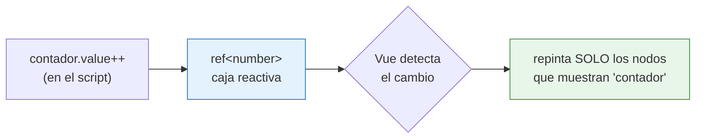

# Sesión 7: Vue 3, TypeScript y tu primer componente

<!-- [[toc]] -->

::: info CONTEXTO
Esta sesión sienta las bases para el resto del módulo. Si ya conoces Vue 3, sirve como repaso rápido de sintaxis con TypeScript. Si vienes de otros frameworks, aquí encontrarás todo lo que necesitas para seguir las sesiones siguientes.

**Sesiones de Vue en este curso:**

| Sesión       | Tema                       | Qué aprenderás                                                                |
| ------------ | -------------------------- | ----------------------------------------------------------------------------- |
| **7 (esta)** | Fundamentos                | Estructura `.vue`, TypeScript básico, reactividad, interpolación              |
| **8**        | Datos e interactividad     | Interfaces, funciones, `v-if`, `v-for`, `v-model`, eventos, métodos de arrays |
| **9**        | Componentes y comunicación | Props, Emits, `defineModel`, `computed`, `watch`, slots                       |
| **10**       | Arquitectura y servicios   | Composables, servicios, Vista → Composable → Servicio                         |
| **11**       | Componentes internos UA    | `vueua-autocomplete`, `vueua-dialogmodal`, Teleport                           |

Los temas de `useAxios`, validación y Pinia se cubren en las sesiones de **Integración full-stack** (14-17).
:::

## Plan de sesión (90 min) {#plan-90}

| Bloque               | Tiempo | Contenido                                                                   |
| -------------------- | ------ | --------------------------------------------------------------------------- |
| **Teoría guiada**    | 45 min | 1.1 a 1.6 (fundamentos, TS, reactividad, interpolación y depuración básica) |
| **Práctica en aula** | 25 min | Tarjeta de `TipoRecurso` con `ref` e interpolación + revisión en directo    |
| **Test de sesión**   | 15 min | Preguntas rápidas en formato desplegable y corrección grupal                |
| **Cierre**           | 5 min  | Dudas, errores frecuentes y preparación de la sesión 10                     |

::: tip ENFOQUE DIDÁCTICO
Con 90 minutos buscamos no solo explicar sintaxis, sino también consolidar hábitos: leer errores, comprobar tipos y validar que cada alumno pueda crear y entender un componente básico sin ayuda.
:::

## 1.1 ¿Por qué Vue 3 en la UA? {#por-que-vue}

Vue 3 es el framework seleccionado para el desarrollo de la parte cliente en el Servicio de Informática de la UA por:

| Ventaja                        | Descripción                                                                                                       |
| ------------------------------ | ----------------------------------------------------------------------------------------------------------------- |
| **Curva de aprendizaje suave** | Principal razón frente a Angular o React. Especialmente asequible para desarrolladores con HTML, CSS y JavaScript |
| **Estructura clara**           | Separación en `<script>`, `<template>` y `<style>` que mejora legibilidad y mantenimiento                         |
| **Reactividad**                | Actualización automática de la interfaz cuando cambian los datos                                                  |
| **TypeScript integrado**       | Tipado estático, autocompletado inteligente y detección temprana de errores                                       |
| **Composition API**            | Código reutilizable, organizado y escalable                                                                       |
| **Vue Devtools**               | Depuración directa en el navegador con inspección de componentes y estado                                         |

::: tip BUENA PRÁCTICA
Usamos **Composition API** (`<script setup>`) en el curso, no la Options API de Vue 2. Es más moderna, más flexible y tiene mejor soporte de TypeScript.
:::

## 1.2 Estructura de un componente Vue {#estructura-componente}

Un archivo `.vue` se divide en tres secciones:

```html
<script setup lang="ts">
  // 1. SCRIPT: Lógica del componente (TypeScript)
</script>

<template>
  <!-- 2. TEMPLATE: HTML que renderiza el componente -->
</template>

<style lang="scss" scoped>
  /* 3. STYLE: CSS específico de este componente */
</style>
```

```svgbob
+---------------------------+
| <script setup lang="ts">  |   <- LOGICA TypeScript
|   imports                 |      (lo que el componente sabe hacer)
|   ref / reactive          |
|   funciones               |
| </script>                 |
+---------------------------+
| <template>                |   <- VISTA (HTML + directivas)
|   {{ interpolacion }}     |      (lo que el componente pinta)
|   v-if / v-for / @click   |
| </template>               |
+---------------------------+
| <style scoped lang="scss">|   <- ESTILO local
|   .clase { ... }          |      (CSS encapsulado al componente)
| </style>                  |
+---------------------------+
```

<!-- diagram id="s6-anatomia-vue" caption: "Las tres secciones de un componente .vue" -->

| Sección                    | Qué contiene                          | Notas                                                           |
| -------------------------- | ------------------------------------- | --------------------------------------------------------------- |
| `<script setup lang="ts">` | Imports, variables, funciones, lógica | `setup` activa Composition API, `lang="ts"` activa TypeScript   |
| `<template>`               | HTML con directivas Vue               | Todo lo declarado en script está disponible automáticamente     |
| `<style scoped>`           | CSS/SCSS del componente               | `scoped` asegura que los estilos no afecten a otros componentes |

### Diferencia entre Vista y Componente

| Aspecto          | Vista                                 | Componente                               |
| ---------------- | ------------------------------------- | ---------------------------------------- |
| **Ubicación**    | `src/views/`                          | `src/components/`                        |
| **Propósito**    | Página completa (asociada a ruta URL) | Pieza reutilizable de la interfaz        |
| **Router**       | ✅ Tiene ruta asociada                | ❌ No tiene ruta                         |
| **Uso**          | Se carga desde el router              | Se importa en vistas u otros componentes |
| **Nomenclatura** | `PascalCase` (`Home.vue`)             | `PascalCase` (`SelectorFechas.vue`)      |

::: tip REGLA PRÁCTICA
Si el usuario puede navegar directamente a ello con una URL → es una **Vista**. Si se usa como pieza dentro de otras partes → es un **Componente**.
:::

### Orden recomendado en `<script setup>`

```html
<script setup lang="ts">
  // 1. Imports
  import { ref, computed } from "vue";
  import TarjetaTipoRecurso from "@/components/TarjetaTipoRecurso.vue";

  // 2. Interfaces locales (misma forma que el DTO del backend .NET)
  interface ITipoRecurso {
    idTipoRecurso: number;
    codigo: string;
    nombre: string;
  }

  // 3. Props / Emits (si el .vue es un componente que el padre instancia)
  const props = defineProps<{ titulo: string }>();

  // 4. Variables reactivas (estado de la vista)
  const tipos = ref<ITipoRecurso[]>([]);
  const seleccionado = ref<ITipoRecurso | null>(null);

  // 5. Computed (valores derivados)
  const total = computed(() => tipos.value.length);

  // 6. Watchers (efectos secundarios al cambiar el estado)

  // 7. Lifecycle hooks (onMounted, onUnmounted, ...)

  // 8. Funciones (handlers)
  function seleccionar(t: ITipoRecurso): void {
    seleccionado.value = t;
  }
</script>
```

## 1.3 TypeScript: lo que necesitas saber {#typescript-basico}

TypeScript es un **superset de JavaScript** que añade tipado estático. Esto significa que puedes especificar qué tipo de dato debe tener cada variable, y el compilador te avisa si cometes un error.

### Declaración de variables y tipos principales

```typescript
// Tipo explícito
const nombre: string = "Juan";
const edad: number = 25;
const activo: boolean = true;

// Inferencia de tipos (TypeScript deduce el tipo automáticamente)
const ciudad = "Alicante"; // TypeScript sabe que es string
const contador = 0; // TypeScript sabe que es number
```

### `let`, `const` y `var`: qué usar y cuándo

En esta sesión conviene fijar una regla clara:

- **`const` por defecto**.
- **`let` solo si vas a reasignar**.
- **`var` no se usa en código actual** (comportamiento más confuso por alcance de función).

```typescript
const curso = "Vue 3"; // ✅ no se reasigna
let pagina = 1; // ✅ puede cambiar
pagina = 2;

// curso = 'React'      // ❌ error: no puedes reasignar un const
```

Diferencia importante con objetos:

```typescript
// Mismo dominio que veremos en .NET/Oracle: TipoRecurso, Recurso, Reserva.
const tipoRecurso = {
  idTipoRecurso: 1,
  codigo: "SALA",
  nombre: "Sala de reuniones",
};
tipoRecurso.nombre = "Sala grande"; // ✅ permitido (cambia propiedad interna)

// tipoRecurso = { idTipoRecurso: 2, codigo: 'EQUIPO', nombre: 'Proyector' }   // ❌ reasignar referencia
```

Comparación rápida:

| Declaración | Reasignable | Alcance       | Recomendación               |
| ----------- | ----------- | ------------- | --------------------------- |
| `const`     | ❌          | bloque (`{}`) | ✅ opción por defecto       |
| `let`       | ✅          | bloque (`{}`) | ✅ cuando debe cambiar      |
| `var`       | ✅          | función       | ❌ evitar en código moderno |

::: tip REGLA PRÁCTICA
Si dudas entre `let` y `const`, empieza por `const`. Solo cambia a `let` cuando realmente necesites reasignar.
:::

### Otras posibilidades útiles: `as const` y `readonly`

No es imprescindible dominarlas hoy, pero conviene conocerlas:

```typescript
// as const: convierte literales en valores inmutables y más específicos
const estado = "activo" as const;
// estado = 'inactivo'   // ❌ error

interface IConfig {
  readonly apiBase: string;
  timeout: number;
}

const config: IConfig = {
  apiBase: "/api",
  timeout: 5000,
};

config.timeout = 7000; // ✅ permitido
// config.apiBase = '/v2'   // ❌ error (readonly)
```

En esta sesión basta con recordar:

- `as const` fija literales.
- `readonly` protege propiedades que no deberían modificarse.

### Resumen rápido de tipos más usados

| Tipo        | Ejemplo         | Descripción                                          |
| ----------- | --------------- | ---------------------------------------------------- |
| `string`    | `"Hola"`        | Texto                                                |
| `number`    | `42`, `3.14`    | Números enteros y decimales                          |
| `boolean`   | `true`, `false` | Verdadero / Falso                                    |
| `string[]`  | `["a", "b"]`    | Array de strings                                     |
| `number[]`  | `[1, 2, 3]`     | Array de números                                     |
| `any`       | Cualquier valor | ❌ Evitar: desactiva la verificación de tipos        |
| `unknown`   | Cualquier valor | Como `any` pero más seguro (obliga a comprobar tipo) |
| `null`      | `null`          | Valor nulo                                           |
| `undefined` | `undefined`     | Valor indefinido                                     |

### Union Types: varios tipos posibles

```typescript
let resultado: string | number;

resultado = "éxito"; // ✅ válido
resultado = 200; // ✅ válido
resultado = true; // ❌ error de compilación
```

### Tipos especiales: `null`, `undefined`, `any` y `unknown`

Los cuatro existen para casos muy concretos. La regla general: **elige siempre el tipo real** (o una unión con `null`) antes de caer en `any`.

```typescript
// ── null y undefined ──────────────────────────────────────────────
// Úsalos en uniones para indicar "puede no haber valor todavía".
// Es lo habitual cuando una variable se rellena tras una llamada async.
let tipoCargado: ITipoRecurso | null = null; // luego: { idTipoRecurso: 1, ... }
let idSeleccionado: number | null = null; // luego: 42

// ── any → desactiva TypeScript (EVITAR) ───────────────────────────
let valor: any = "texto";
valor = 42; // No hay error... pero pierdes la red de seguridad
valor.noExiste(); // No hay error en compilación; revienta en ejecución

// ── unknown → la versión segura de any ────────────────────────────
// Útil cuando recibes un dato del exterior y aún no sabes su forma
// (respuesta de fetch, mensaje de postMessage, contenido de localStorage).
let dato: unknown = JSON.parse(localStorage.getItem("config") ?? "{}");
// dato.toUpperCase()                   // ❌ Error: TS te obliga a comprobar primero
if (typeof dato === "string") {
  dato.toUpperCase(); // ✅ Dentro del if, TS sabe que es string
}
```

::: tip BUENA PRÁCTICA — qué tipo real poner en el ejemplo de arriba
| En el ejemplo... | El tipo "de juguete" | El tipo real que pondrías en código de producción |
| --- | --- | --- |
| `valor: any` | `any` (no escribir) | `string \| number` si admite los dos, o un _union type_ concreto |
| `dato: unknown` | `unknown` (genérico) | Una **interface** que describa la forma esperada (`interface IConfig { ... }`) y un _type guard_ que la valide |
| `tipoCargado` | `ITipoRecurso \| null` | Es ya el tipo real: misma forma que el DTO `TipoRecursoLectura` que el backend devuelve en `/api/TipoRecursos` (sesión 7) |
| `idSeleccionado` | `number \| null` | `null` para "aún no elegido" — es lo idiomático en los formularios de Recursos/Reservas del proyecto |

La idea: `any`/`unknown` son **comodines de paso**. En cuanto sepas la forma, define una `interface` o un `type` y úsalo. En este curso esa forma viene casi siempre del backend: las clases `TipoRecurso`, `Recurso`, `Reserva` que viste en .NET pasan a ser `ITipoRecurso`, `IRecurso`, `IReserva` en TypeScript.
:::

::: danger ZONA PELIGROSA
Nunca uses `any` salvo en casos muy justificados (librerías sin tipos, migración de JS). Pierdes toda la protección que ofrece TypeScript y los `.d.ts` que vienen con Vue, Axios y los componentes UA.
:::

## 1.4 Reactividad: ref y reactive {#reactividad}

::: tip REGLA DE ORO EN LA UA
**Usa `ref` por defecto.** `ref` funciona con cualquier tipo (primitivos, arrays, objetos), se integra mejor con TypeScript y es el patrón que verás en casi todo el código del proyecto. `reactive` queda como **opción puntual** para objetos grandes donde escribir `.value` en cada acceso resulte engorroso. Si tienes dudas, elige `ref`.
:::

La reactividad es la capacidad de Vue de **actualizar automáticamente** el DOM cuando cambian los datos. El ciclo es siempre el mismo: cambias un `ref` desde el script y Vue repinta **solo** los nodos del DOM que dependen de él.



<!-- diagram id="s6-reactividad" caption: "Al cambiar un ref, Vue repinta solo los nodos del DOM que dependen de el" -->

En código:

```typescript
// 1) Declaras una variable reactiva con ref(...).
const contador = ref<number>(0);

// 2) La usas en el template: {{ contador }}.
//    Vue "anota" que ese nodo del DOM depende de 'contador'.

// 3) Cuando cambias el valor con contador.value++,
//    Vue dispara automáticamente un re-renderizado
//    pero SOLO de los nodos que dependen de esa variable.
```

Lo importante: **tú no escribes ningún `document.getElementById` ni ningún `innerHTML = ...`**. Vue lo hace por ti porque sabe quién depende de quién.

### ¿Por qué usamos `const` con variables reactivas?

Al principio resulta raro ver esto:

```typescript
const contador = ref(0);
```

Usamos `const` porque lo que protegemos es la **referencia reactiva**, no su contenido interno:

```typescript
const contador = ref(0);
contador.value = 10; // ✅ correcto
contador.value++; // ✅ correcto

// contador = ref(20)   // ❌ error: estarías reasignando la referencia
```

Con `reactive` ocurre lo mismo:

```typescript
const tipoRecurso = reactive({
  idTipoRecurso: 1,
  codigo: "SALA",
  nombre: "Sala de reuniones",
});
tipoRecurso.nombre = "Sala grande"; // ✅ correcto (cambias propiedad)

// tipoRecurso = reactive({ idTipoRecurso: 2, ... })  // ❌ reasignar la referencia rompe la reactividad
```

::: tip IDEA CLAVE
Con `const` no decimos "el dato no cambia". Decimos "esta referencia reactiva no se reemplaza".
:::

### `ref` — Referencia reactiva

`ref` crea una referencia reactiva a cualquier valor. El núcleo de la demo `Sesion7HolaVue.vue` del sandbox es justo eso: dos botones cambian un mismo `ref<string>` y el saludo se actualiza solo, sin que escribamos nada para tocar el DOM.

```html
<script setup lang="ts">
  import { ref } from "vue";

  // 'nombre' es una "caja" que Vue vigila. Cuando cambia el valor
  // interno, el template se vuelve a pintar solo.
  const nombre = ref<string>("Mundo");

  // .value SOLO en el script. En el template se escribe {{ nombre }}.
  function saludarALola() {
    nombre.value = "Lola, mi perra";
  }
  function saludarATiger() {
    nombre.value = "Tiger, mi super gato";
  }
</script>

<template>
  <!-- En template: sin .value (Vue lo desempaqueta solo) -->
  <div class="display-4 my-3">Hola, {{ nombre }} 👋</div>

  <!-- v-model: enlace bidireccional con el input -->
  <input v-model="nombre" type="text" class="form-control" />

  <button class="btn btn-primary" @click="saludarALola">Saluda a Lola</button>
  <button class="btn btn-primary" @click="saludarATiger">Saluda a Tiger</button>
</template>
```

> Fichero real: `ClientApp/src/views/sesiones-vue/sesion-7/Sesion7HolaVue.vue`. El fichero del sandbox añade además una **foto** de la mascota — la dejamos como ampliación porque usa `computed` y `v-if`, que verás en las sesiones 10 y 11.

::: details AMPLIACIÓN — mostrar la foto de la mascota (`computed` + `v-if`)
La demo real deriva la URL de la foto con una `computed` y la muestra con `v-if`. No necesitas dominar esto todavía; es un adelanto de las sesiones 10 (`v-if`) y 11 (`computed`):

```html
<script setup lang="ts">
  import { ref, computed } from "vue";

  const nombre = ref<string>("Mundo");

  // computed: recalcula la URL sola cada vez que cambia 'nombre'.
  const fotoMascota = computed<string | null>(() => {
    const base = import.meta.env.BASE_URL; // raíz de los assets de public/
    if (nombre.value === "Lola, mi perra") return `${base}lola.jpg`;
    if (nombre.value === "Tiger, mi super gato") return `${base}tiger.jpg`;
    return null;
  });
</script>

<template>
  <!-- v-if monta/desmonta el bloque según haya foto o no. -->
  
</template>
```

:::

::: tip BUENA PRÁCTICA — assets desde `public/` y `import.meta.env.BASE_URL`
Todo lo que metes en `ClientApp/public/` se sirve **tal cual** bajo la URL base de la app (`/uareservas/` en producción, `/` en dev). Si escribes ``, en producción falla porque la URL real es `/uareservas/lola.jpg`. Por eso usamos `import.meta.env.BASE_URL` como prefijo: Vite lo resuelve correctamente en ambos entornos sin tocar el código.
:::

::: warning IMPORTANTE

- En el `<script>`: usa `contador.value`
- En el `<template>`: usa `contador` (sin `.value`)

Si olvidas `.value` en el script, el código no funciona. Si pones `.value` en el template, sobra.
:::

### `reactive` — Objeto reactivo

Para **objetos** existe `reactive`. La demo `Sesion7RefVsReactive.vue` coloca un `ref` y un `reactive` lado a lado para que se vea la diferencia:

```html
<script setup lang="ts">
  import { ref, reactive } from "vue";

  // ---- Izquierda: ref<number> ----
  const contadorA = ref<number>(0);
  function incrementarA() {
    contadorA.value++;
  }

  // ---- Derecha: reactive({ ... }) ----
  const estadoB = reactive({
    count: 0,
    ultimaAccion: "ninguna",
  });
  function incrementarB() {
    estadoB.count++; // ✓ modifica propiedad → reactivo
    estadoB.ultimaAccion = "increment";
    // estadoB = { count: 0, ... }        // ✗ NO reasignar: rompe la reactividad
  }
</script>

<template>
  <div>Contador A (ref): {{ contadorA }}</div>
  <div>
    Contador B (reactive): {{ estadoB.count }} — última acción: {{
    estadoB.ultimaAccion }}
  </div>
</template>
```

> Fichero real: `ClientApp/src/views/sesiones-vue/sesion-7/Sesion7RefVsReactive.vue`.

### `ref` vs `reactive` — Cuándo usar cada uno

| Aspecto                  | `ref`                                   | `reactive`              |
| ------------------------ | --------------------------------------- | ----------------------- |
| **Uso**                  | Valores simples, arrays, cualquier cosa | Objetos complejos       |
| **Sintaxis en script**   | `.value`                                | Acceso directo          |
| **Sintaxis en template** | Sin `.value`                            | Sin `.value`            |
| **Tipado TypeScript**    | `ref<Tipo>(valor)`                      | `reactive<Tipo>({...})` |

::: tip BUENA PRÁCTICA
Prefiere **`ref`** en la mayoría de casos. Es más clara, funciona con todo y tiene mejor soporte TypeScript. Usa `reactive` solo para objetos donde te resulte más cómodo.
:::

### Aplicado al dominio del curso

En el proyecto trabajamos con tres entidades: `TipoRecurso` → `Recurso` → `Reserva`. Su forma en el cliente es la misma que viste en .NET, en formato TypeScript. Patrones típicos con `ref`:

```typescript
import { ref } from "vue";

// Forma del DTO que el backend devuelve en GET /api/TipoRecursos
// (mismo contrato que la clase TipoRecursoLectura del backend .NET — sesión 7).
interface ITipoRecurso {
  idTipoRecurso: number;
  codigo: string;
  nombre: string;
}

// 1) ref<T[]> para listados: empieza vacío y se rellena cuando llega la respuesta.
const tiposRecurso = ref<ITipoRecurso[]>([]);

// 2) ref<T | null> para "selección actual": null hasta que el usuario elige.
const tipoSeleccionado = ref<ITipoRecurso | null>(null);

// 3) ref<boolean> para flags de UI: cargando, modal abierto, hay error.
const cargando = ref<boolean>(false);
```

> La demo integradora **`Sesion7DemoTipoRecurso.vue`** aplica estos tres patrones con un mock local. En la sesión 12 cambiaremos el mock por una llamada real al servicio (`apiTiposRecurso.listar()` — definido en `services/api/apiTiposRecurso.ts`) y la vista apenas se moverá. Ese es el sentido de la interface: la vista no sabe quién le pasa los datos.

## 1.5 Interpolación: mostrar datos en el template {#interpolacion}

Usa llaves dobles <code v-pre>{{ }}</code> para mostrar valores reactivos en el template. La demo `Sesion7Interpolacion.vue` agrupa los siete usos típicos partiendo de un objeto `persona`:

```html
<script setup lang="ts">
  import { ref } from "vue";

  const persona = ref({
    nombre: "Ana Garcia",
    edad: 27,
    email: "ana@ua.es",
    notas: [7.5, 8.2, 9.0, 6.5],
    rol: "PDI" as "PDI" | "PTGAS" | "Alumno",
  });

  function aniosDesdeNacimiento(edad: number): number {
    return new Date().getFullYear() - edad;
  }
</script>

<template>
  <!-- 1. Propiedades simples -->
  <p>Nombre: <strong>{{ persona.nombre }}</strong></p>

  <!-- 2. Aritmética -->
  <p>Edad en meses: {{ persona.edad * 12 }}</p>

  <!-- 3. Concatenación y template literals -->
  <p>{{ `${persona.nombre} (${persona.rol})` }}</p>

  <!-- 4. Ternario inline -->
  <p>¿Mayor de edad? {{ persona.edad >= 18 ? 'Si' : 'No' }}</p>

  <!-- 5. Llamadas a funciones del script -->
  <p>Año aproximado: {{ aniosDesdeNacimiento(persona.edad) }}</p>

  <!-- 6. Métodos de arrays/strings -->
  <p>
    Media: {{ (persona.notas.reduce((a, b) => a + b, 0) /
    persona.notas.length).toFixed(2) }}
  </p>

  <!-- 7. Atributos: ':' (alias de v-bind), no llaves -->
  <a :href="`mailto:${persona.email}`">Escribir a {{ persona.nombre }}</a>
</template>
```

> Fichero real: `ClientApp/src/views/sesiones-vue/sesion-7/Sesion7Interpolacion.vue`. El objeto `persona` se usa por comodidad didáctica (campos variados: string, number, array, union type). Los **siete patrones** funcionan idénticamente sobre los DTOs del proyecto:

```html
<!-- Los mismos siete patrones aplicados a TipoRecurso. -->
<p>Nombre: <strong>{{ tipoRecurso.nombre }}</strong></p>
<!-- 1 -->
<p>Longitud del código: {{ tipoRecurso.codigo.length }}</p>
<!-- 2 -->
<p>{{ `${tipoRecurso.codigo} — ${tipoRecurso.nombre}` }}</p>
<!-- 3 -->
<p>¿Tiene descripción? {{ tipoRecurso.descripcion ? 'Sí' : 'No' }}</p>
<!-- 4 -->
<p>Iniciales: {{ obtenerIniciales(tipoRecurso.nombre) }}</p>
<!-- 5 -->
<p>Código en mayúsculas: {{ tipoRecurso.codigo.toUpperCase() }}</p>
<!-- 6 -->
<a :href="`/uareservas/tipos/${tipoRecurso.idTipoRecurso}`">Ver detalle</a>
<!-- 7 -->
```

Esto es exactamente lo que hace la demo integradora **`Sesion7DemoTipoRecurso.vue`** (sandbox §1.7): mismo objeto que en .NET, mismo patrón de interpolación.

::: warning IMPORTANTE
La interpolación solo acepta **expresiones** (que devuelven un valor). No acepta sentencias como `if`, `for` o asignaciones (<code v-pre>{{ x = 5 }}</code> está prohibido). Para lógica condicional en templates usamos directivas (`v-if`, `v-for`), que veremos en la sesión 10.
:::

## 1.6 Depuración básica {#debug-basico}

Cuando algo no funciona, no adivines: **comprueba**. Esta sesión te da una rutina de tres pasos — Console → Vue Devtools → breakpoint — que resuelve el 80 % de los fallos.

::: info SI VIENES DE VISUAL STUDIO
El depurador aquí lo tiene el **navegador**, no el IDE. Abre `F12` → pestaña **Sources** para breakpoints y usa la **Console** para evaluar expresiones. Los atajos principales (`F10`, `F11`, `Shift+F11`) son los mismos.
:::

### 1.6.1 Preparación mínima

1. **DevTools del navegador**: `F12` o `Ctrl+Shift+I`. En esta sesión usaremos sobre todo **Console** y **Elements**.
2. **Vue Devtools** (extensión): instálala desde la tienda de extensiones, recarga la app y localiza la pestaña **Vue**. Te muestra refs, props y eventos en vivo sin tocar el código.

### 1.6.2 `console.log` y variantes útiles

```html
<script setup lang="ts">
  import { ref } from "vue";
  const contador = ref<number>(0);

  function incrementar() {
    console.log("Antes:", contador.value);
    contador.value++;
    console.log("Despues:", contador.value);
  }
</script>
```

::: warning Logging refs y reactives
`console.log(contador)` (sin `.value`) imprime `RefImpl { value: 0, ... }`, no `0`. Para ver el valor limpio: `console.log(contador.value)`. Para objetos `reactive`: `console.dir(estado)` o `JSON.stringify(estado)`. Vue Devtools muestra los valores ya desempaquetados.
:::

| Variante             | Cuándo usarla                                               |
| -------------------- | ----------------------------------------------------------- |
| `console.log(...)`   | Información general.                                        |
| `console.warn(...)`  | Aviso amarillo: no rompe pero algo no encaja.               |
| `console.error(...)` | Rojo + stack trace, para errores detectados en un `catch`.  |
| `console.table(arr)` | Pinta arrays de objetos como tabla con columnas ordenables. |
| `console.dir(obj)`   | Árbol explorable, mejor que `log` para objetos profundos.   |

::: details Más variantes (`group`, `time`, `count`, `assert`, `trace`)
| Variante | Para qué |
|---|---|
| `console.group('etiqueta')` + `console.groupEnd()` | Agrupa logs en árbol plegable. |
| `console.time('t')` + `console.timeEnd('t')` | Mide milisegundos entre las dos llamadas. |
| `console.count('clave')` | Cuenta invocaciones — útil para detectar renders duplicados. |
| `console.assert(cond, 'msg')` | Solo imprime si la condición es falsa. |
| `console.trace('etiqueta')` | Pila completa de llamadas hasta este punto. |

Ejemplo combinado:

```ts
function incrementar() {
  console.group("[click] incrementar");
  console.count("clicks");
  console.time("t");
  contador.value++;
  console.timeEnd("t");
  console.groupEnd();
}
```

> Fichero real: `ClientApp/src/views/sesiones-vue/sesion-7/Sesion7Depuracion.vue` (botón "3. group + count + time").
> :::

### 1.6.3 Pausar el código: `debugger` y breakpoints {#debugger}

`console.log` te dice **qué** valor hay; el debugger te deja inspeccionar **todo** el estado (refs, scope, pila) y avanzar paso a paso.

**Opción A — sentencia `debugger`** dentro del código:

```ts
function incrementar() {
  debugger; // ← Vue para aquí (si DevTools está abierto)
  contador.value++;
}
```

**Opción B — breakpoint en DevTools** (sin tocar el código): pestaña **Sources** → busca tu `.vue` → clic en el número de línea → punto azul. Interactúa con la app y se pausará allí.

Una vez parado: `F8` continuar, `F10` step over, `F11` step into, `Shift+F11` step out. En **Scope** ves las locales, en **Watch** añades expresiones como `contador.value`, y en la **Console** ejecutas cualquier cosa con el scope actual.

::: warning Quita los `debugger` antes de subir
Si dejas un `debugger` y un compañero abre DevTools, la app le para de repente. El linter de la UA los detecta como `no-debugger`.
:::

::: details Breakpoint condicional + equivalencias con Visual Studio
**Breakpoint condicional**: clic derecho sobre el número de línea → _Add conditional breakpoint_ → escribe `contador.value > 5`. Solo pausa cuando se cumpla. Imprescindible para fallos que solo ocurren tras N clics.

**Equivalencias VS ↔ DevTools**:

| Visual Studio            | DevTools                          | Notas                               |
| ------------------------ | --------------------------------- | ----------------------------------- |
| F9 — toggle breakpoint   | Clic en número de línea (Sources) | Punto azul en el margen             |
| F5 — Continuar           | F8 — Resume                       |                                     |
| F10 / F11 / Shift+F11    | F10 / F11 / Shift+F11             | Mismos atajos                       |
| Ventana Locals/Autos     | Panel Scope                       | Variables del frame actual          |
| Ventana Watch            | Panel Watch                       | Expresiones evaluadas a cada paso   |
| Ventana inmediata        | Console mientras está pausado     | Ejecuta cualquier expresión         |
| `Debugger.Break()` en C# | Sentencia `debugger` en TS        | Solo pausa si DevTools está abierto |

VS Code también puede depurar Vue conectándose a Chrome con un `launch.json` tipo `"chrome"`, pero en esta sesión usamos DevTools del navegador por inmediatez.
:::

### 1.6.4 Checklist y "qué mirar"

**Rutina de 6 pasos cuando algo falla:**

1. Reproducir el fallo con un caso mínimo.
2. Revisar la **Console** tras cada cambio.
3. ¿Hay errores de TypeScript en el editor?
4. En **Vue Devtools**, ¿la variable reactiva cambia cuando esperas?
5. Si el log no basta → `debugger` o breakpoint en **Sources**.
6. ¿La UI refleja el estado sin recarga manual?

**Pestañas de DevTools (resumen):**

| Pestaña            | Para qué                                             |
| ------------------ | ---------------------------------------------------- |
| **Console**        | Errores, warnings, `console.*`                       |
| **Elements**       | Confirmar que el DOM refleja el estado               |
| **Sources**        | Breakpoints, scope, watch                            |
| **Network**        | Ver `/api/...`, status, payload del backend          |
| **Vue (Devtools)** | Árbol de componentes, refs, eventos sin tocar código |

::: tip Truco — `$0` en la consola
Selecciona un nodo en **Elements**; en la **Console**, `$0` te lo devuelve. `console.dir($0)` ve todas sus propiedades. `$_` es el resultado de la última expresión.
:::

::: details Anexo — TypeScript en el navegador (source maps) {#sourcemaps}

> "Pero si yo escribí TypeScript… ¿por qué la consola pone la línea de mi `.vue`? El navegador no entiende TS, ¿no?"

Correcto. El navegador **solo ejecuta JavaScript**. Vite compila tu `.vue` + `.ts` a JS y junto al bundle genera un fichero `.map` (**source map**) que asocia cada línea del JS compilado con la del fichero original. DevTools usa ese mapa para mostrarte **tu código fuente** en lugar del JS transformado.

Implicaciones prácticas:

- El breakpoint en una línea TypeScript funciona porque Vite añade source maps en `dev` por defecto.
- A veces el breakpoint salta a una línea "cercana": el compilador puede haber fusionado líneas. Pon `debugger` en la línea exacta.
- Si DevTools de pronto muestra **JavaScript ofuscado** en vez de tu fuente, falta o se ha perdido el source map (build de producción sin maps, recurso cacheado antiguo, etc.). Recarga sin caché con `Ctrl+Shift+R`.
  :::

::: details Anexo — Qué revisar cuando algo "no aparece"
| Síntoma | Comprobación rápida |
|---|---|
| El valor no se actualiza | ¿La variable es reactiva (`ref` o `reactive`)? |
| El valor no cambia en script | ¿Estás usando `.value` en `ref` dentro de `<script setup>`? |
| Error de tipo en editor | ¿Coincide el tipo declarado con el valor asignado? |
| En template sale vacío | ¿La variable existe en `<script setup>` y tiene valor inicial? |
| El botón no hace nada | ¿El `@click` apunta a una función existente? ¿Hay un `console.log` que confirme que entra? |
| Vue Devtools no muestra estado | ¿Extensión instalada, habilitada y app recargada? |
| El breakpoint no se dispara | ¿DevTools abierto antes de la acción? ¿Punto azul en Sources? |
| DevTools muestra JS ofuscado | Falta el source map. `Ctrl+Shift+R` para recargar sin caché. |
:::

## 1.7 Pruébalo en el proyecto {#sandbox}

En `uaReservas/ClientApp/src/views/sesiones-vue/sesion-7/` viven seis demos navegables, una por concepto. Arranca la app y entra en `/uareservas/sesiones-vue/sesion-7`:

| Demo                          | Concepto que ilustra                                                             | Fichero                                |
| ----------------------------- | -------------------------------------------------------------------------------- | -------------------------------------- |
| `Sesion7HolaVue.vue`          | Estructura `.vue` mínima, `ref<string>`, `v-model`                               | `sesion-6/Sesion7HolaVue.vue`          |
| `Sesion7TypeScriptBasico.vue` | Primitivos, arrays, `const`/`let`, union types, `any` vs `unknown`               | `sesion-6/Sesion7TypeScriptBasico.vue` |
| `Sesion7RefVsReactive.vue`    | Dos contadores lado a lado: `ref<number>` vs `reactive({...})`                   | `sesion-6/Sesion7RefVsReactive.vue`    |
| `Sesion7Interpolacion.vue`    | Los siete usos típicos de <code v-pre>{{ ... }}</code> sobre un objeto `persona` | `sesion-6/Sesion7Interpolacion.vue`    |
| `Sesion7DemoTipoRecurso.vue`  | Demo integradora con un `TipoRecursoLectura[]` mock y navegación                 | `sesion-6/Sesion7DemoTipoRecurso.vue`  |
| `Sesion7Depuracion.vue`       | Variantes de `console`, diferencia `ref` vs `ref.value` en consola y `debugger`  | `sesion-6/Sesion7Depuracion.vue`       |

::: tip CÓMO TRABAJAR LAS DEMOS
Abre cada fichero en VS Code, lee el `<script setup>` y luego el `<template>`. Modifica un valor, guarda y observa cómo Vue redibuja **solo** lo que ha cambiado. La integradora `Sesion7DemoTipoRecurso.vue` ya usa el mismo DTO (`TipoRecursoLectura`) que devolverá la API real en la sesión 12; cambiar el mock por una llamada axios no toca el template.
:::

## 1.8 Lo que viene en las próximas sesiones {#preview}

A partir de aquí cerramos el ciclo **Oracle → .NET → Vue** trabajando con las mismas entidades que ya viste en el backend: `TipoRecurso`, `Recurso` y `Reserva`. Cada sesión añade una capa Vue sobre los DTOs que tu API ya entrega.

### Sesión 10: Directivas, eventos y datos

Aprenderemos a definir contratos de datos con **interfaces** (`ITipoRecurso`, `IRecurso`), a escribir **funciones tipadas** y a construir interfaces interactivas con `v-if`, `v-for`, `v-bind`, `v-model` y eventos. También veremos los métodos de arrays (`.map()`, `.filter()`, `.find()`, `.reduce()`) que usaremos constantemente al trabajar con listados de recursos.

### Sesión 11: Componentes, comunicación y estado derivado

Crearemos componentes reutilizables y aprenderemos a pasar datos entre ellos con Props, Emits y `defineModel`. Implementaremos `computed`, `watch` y `onMounted` para construir vistas más completas (lista de recursos con filtro, contador de reservas confirmadas…).

### Sesión 12: Arquitectura profesional, APIs y flujo de trabajo

Estructuraremos la aplicación con el patrón **Vista → Composable → Servicio**: `useRecursos()` para el estado reactivo, `apiRecursos` para las llamadas HTTP, la vista solo pinta. Consumiremos `/api/Recursos` con `useAxios` y validaremos formularios con `useGestionFormularios`. Aquí cierra el ciclo: el DTO `RecursoLectura` que define el backend .NET es el mismo `IRecursoLectura` que recibe tu vista.

### Sesión 13: Otros componentes UA

Veremos los componentes de la librería `vueua-lib` (modales, toasts, `BotonLoading`, checkbox triestado, Teleport) que estandarizan el aspecto y comportamiento de las apps internas de la UA, aplicados al CRUD de Recursos y Reservas.

---

## Ejercicio Sesión 9 {#ejercicio}

::: info ENUNCIADO
Vas a crear la primera **tarjeta de detalle de un Tipo de Recurso** del proyecto. La forma del objeto es la que ya devuelve el backend en `/api/TipoRecursos` (DTO `TipoRecursoLectura` de la sesión 7). De momento los datos viven hardcoded en el componente; en la sesión 12 los recogeremos de la API real.

**Resultado esperado:** un único componente `TarjetaTipoRecurso.vue` que declare un `ref` de tipo `ITipoRecurso` con datos mock y los muestre en una tarjeta Bootstrap, demostrando que sabes usar `ref`, `.value` (cuando hace falta) e interpolación con expresiones.
:::

**Objetivo:** Crear un componente Vue que muestre la ficha de un `TipoRecurso` usando `ref`, interpolación y template literals — sin axios todavía.

Crea un componente `TarjetaTipoRecurso.vue` con:

1. Una `interface ITipoRecurso` local con: `idTipoRecurso` (number), `codigo` (string), `nombre` (string), `descripcion` (string opcional).
2. Un `ref<ITipoRecurso>` con datos mock (por ejemplo, una sala de reuniones).
3. Un `ref<boolean>` llamado `visible` inicializado a `true` que controlará el botón "Ocultar / Mostrar".
4. En el `<template>`, dentro de una `<div class="card">`:
   - Un `<h2>` con el nombre del tipo de recurso.
   - Un `<code>` con el código en mayúsculas (usa `.toUpperCase()` en la interpolación).
   - Un párrafo con la descripción si existe, o el texto `'Sin descripción'` con ternario.
   - Una línea con el ID en formato <code v-pre>#{{ idTipoRecurso }}</code>.
   - La longitud del nombre como dato calculado: `"Nombre de N caracteres"` con template literal.
   - Un botón que alterne `visible` con `@click="visible = !visible"`.
   - El cuerpo de la tarjeta solo se ve si `visible` es `true` (más adelante usaremos `v-if`; por ahora puedes envolver con un `<div v-show="visible">` que verás en S10 — pista, basta con que el botón cambie el valor).

::: tip PISTA DIDÁCTICA
La interface en esta sesión vive **dentro del `.vue`**: aún no estamos centralizando contratos. En la sesión 10 veremos `interface` con más profundidad, y en la 12 moveremos `ITipoRecurso` a `src/interfaces/` cuando varias vistas la compartan.
:::

::: details Solución

```html
<script setup lang="ts">
  import { ref } from "vue";

  // Misma forma que TipoRecursoLectura del backend .NET (sesión 7).
  // Cuando esto venga de la API en S12, la interface no cambiará.
  interface ITipoRecurso {
    idTipoRecurso: number;
    codigo: string;
    nombre: string;
    descripcion?: string;
  }

  const tipo = ref<ITipoRecurso>({
    idTipoRecurso: 1,
    codigo: "sala",
    nombre: "Sala de reuniones",
    descripcion: "Espacios reservables para reuniones del personal.",
  });

  const visible = ref<boolean>(true);
</script>

<template>
  <div class="card my-3" style="max-width: 500px">
    <div class="card-header d-flex justify-content-between align-items-center">
      <span>Tipo de recurso #{{ tipo.idTipoRecurso }}</span>
      <button
        class="btn btn-sm btn-outline-secondary"
        @click="visible = !visible"
      >
        {{ visible ? 'Ocultar' : 'Mostrar' }}
      </button>
    </div>

    <div v-show="visible" class="card-body">
      <h2 class="card-title">{{ tipo.nombre }}</h2>
      <p>Código: <code>{{ tipo.codigo.toUpperCase() }}</code></p>
      <p>{{ tipo.descripcion ? tipo.descripcion : 'Sin descripción' }}</p>
      <p class="text-muted small">
        {{ `Nombre de ${tipo.nombre.length} caracteres` }}
      </p>
    </div>
  </div>
</template>
```

Una vez funcione, abre Vue DevTools y comprueba que `tipo` y `visible` aparecen como refs. Cambia `tipo.value.nombre = 'Sala grande'` desde la consola (con DevTools) y verás que la tarjeta se actualiza sola: esa es la reactividad de Vue trabajando.
:::

<!-- NAV:START -->

| Anterior                                                                                           | Inicio                        | Siguiente                                                                                          |
| -------------------------------------------------------------------------------------------------- | ----------------------------- | -------------------------------------------------------------------------------------------------- |
| [← Sesión 6: Servicios y acceso a Oracle](../../../02-dotnet/sesiones/sesion-06-servicios-oracle/) | [Índice del curso](../../../) | [Sesión 08: Directivas, eventos y datos →](../../../03-vue/sesiones/sesion-08-directivas-eventos/) |

<!-- NAV:END -->
