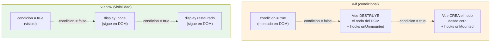

# Sesión 8: Directivas, eventos y datos

::: info CONTEXTO
En la sesión anterior vimos la estructura de un componente, TypeScript básico, reactividad e interpolación. Ahora damos el paso hacia la **interactividad real**: primero tipamos mejor nuestros datos con **interfaces** y **funciones**, y después construimos interfaces dinámicas con directivas, eventos y transformación de datos.

**Al terminar esta sesión sabrás:**

- Definir contratos de datos con interfaces y escribir funciones tipadas en componentes Vue
- Renderizar listas, mostrar/ocultar elementos y vincular atributos
- Manejar eventos del DOM con modificadores
- Transformar arrays con `.map()`, `.filter()`, `.find()` y `.reduce()`
- Trabajar con objetos con spread, destructuring y acceso seguro a propiedades
  :::

## Plan de sesión (90 min) {#plan-90}

| Bloque               | Tiempo | Contenido                                                      |
| -------------------- | ------ | -------------------------------------------------------------- |
| **Teoría guiada**    | 45 min | 2.1 a 2.10 (interfaces, directivas, eventos, arrays y objetos) |
| **Práctica en aula** | 25 min | Lista de reservas tipada con filtros y eventos                 |
| **Test de sesión**   | 15 min | Preguntas de comprensión y corrección inmediata                |
| **Cierre**           | 5 min  | Dudas frecuentes y transición a componentes/comunicación       |

::: tip OBJETIVO PEDAGÓGICO
La prioridad en esta sesión es que el alumno no solo "sepa usar" una directiva, sino que entienda cuándo elegir cada una y cómo evitar errores típicos de estado y renderizado.
:::

## 2.1 Interfaces y contratos de datos {#interfaces}

Antes de renderizar listas o construir formularios, necesitamos **describir la forma de los datos** con los que trabajamos. Para eso usamos **interfaces**.

### Interface local dentro de un componente

```html
<script setup lang="ts">
  import { ref } from "vue";

  // Una interface describe la FORMA de un objeto: qué propiedades tiene
  // y de qué tipo es cada una. No genera código en runtime, sólo le sirve
  // a TypeScript para avisarte si te equivocas (autocompletado + errores
  // en tiempo de compilación).
  //
  // Esta es la misma forma que el DTO ReservaLectura del backend .NET
  // (sesión 7). Cuando en la sesión 12 llamemos a /api/Reservas, el
  // JSON que vuelva cumplirá este contrato.
  interface IReserva {
    id: number; // identificador único — usado luego en :key
    recurso: string; // nombre del recurso reservado (Aula 12, Proyector...)
    horas: number; // duración de la reserva
    confirmada: boolean; // bandera de estado
  }

  // ref<IReserva[]> declara una caja reactiva que SÓLO admite arrays
  // de IReserva. Si intentas { id: '1' } o falta una propiedad, TS falla.
  const reservas = ref<IReserva[]>([
    { id: 1, recurso: "Aula 12", horas: 2, confirmada: true },
    { id: 2, recurso: "Sala reuniones A", horas: 1, confirmada: false },
  ]);
</script>
```

### ¿Dónde crear la interface?

| Ubicación                   | Cuándo usar                               | Ventaja                 |
| --------------------------- | ----------------------------------------- | ----------------------- |
| Dentro del `.vue`           | Solo se usa en ese componente             | Más simple para empezar |
| `src/interfaces/INombre.ts` | Se reutiliza en varias vistas/componentes | Centraliza el contrato  |

::: tip CONVENCIÓN
Prefijo `I` para las interfaces (`ITipoRecurso`, `IRecurso`, `IReserva`); cuando son DTOs de API añadimos sufijo según el rol (`IRecursoLectura`, `IRecursoCrear`). Las que se reutilizan viven en `src/interfaces/`.
:::

## 2.2 Funciones en TypeScript aplicadas a Vue {#funciones}

En Vue declaramos funciones dentro de `<script setup>` para responder a eventos, transformar datos o encapsular pequeñas reglas de negocio. La gran mayoría son **handlers** enganchados a `@click`, `@submit` o `@input`.

### Tipos de retorno habituales

```typescript
// 1) ': void' = handler / side effect. El llamador (el evento del DOM) NO espera
//    un valor de vuelta. Es lo más común en un .vue.
const eliminarReserva = (id: number): void => {
  reservas.value = reservas.value.filter((r) => r.id !== id);
};

// 2) ': boolean' = función que decide. Útil para habilitar/deshabilitar botones,
//    validar formularios, o como condición en un v-if.
const esRecursoValido = (nombre: string): boolean => {
  return nombre.trim().length > 0;
};

// 3) ': string' (u otro tipo concreto) = transformación / etiqueta para pintar.
//    Garantiza que NUNCA devuelves undefined por error.
const etiquetaEstado = (confirmada: boolean): string => {
  return confirmada ? "Confirmada" : "Pendiente";
};
```

::: tip POR QUÉ TIPAR EL RETORNO
Aunque TypeScript puede inferir el retorno, declararlo (`: void`, `: boolean`, `: string`) actúa de **contrato**: si alguien edita la función y empieza a devolver otra cosa, TS te avisa en el editor. En handlers de una línea no aporta — en lógica de negocio sí.
:::

### Handlers reales dentro de un componente

Estos tres patrones aparecen en casi todos los `.vue` del proyecto. Aplicados al dominio del curso (reservas):

```html
<script setup lang="ts">
  import { ref } from "vue";

  interface IReserva {
    id: number;
    recurso: string;
    horas: number;
    confirmada: boolean;
  }

  const reservas = ref<IReserva[]>([
    /* … */
  ]);
  const nuevoRecurso = ref("");

  // PATRÓN 1: handler sin argumentos enganchado con @click="anadirReserva" (sin paréntesis).
  // Devuelve void porque no le interesa al @click qué devuelve.
  const anadirReserva = (): void => {
    const limpio = nuevoRecurso.value.trim();
    if (!limpio) return; // early return
    reservas.value.push({
      id: Date.now(),
      recurso: limpio,
      horas: 1,
      confirmada: false,
    });
    nuevoRecurso.value = "";
  };

  // PATRÓN 2: handler con argumento enganchado con @click="eliminar(reserva.id)".
  // Recibe el id para saber qué fila quitar.
  const eliminar = (id: number): void => {
    reservas.value = reservas.value.filter((r) => r.id !== id);
  };

  // PATRÓN 3: función pura (no muta nada) que el template usa para etiquetar.
  // Devuelve un valor (number), no void — porque su resultado se interpola en el template.
  const contarPendientes = (): number => {
    return reservas.value.filter((r) => !r.confirmada).length;
  };
</script>

<template>
  <button @click="anadirReserva">Añadir</button>
  <!-- sin paréntesis -->
  <button @click="eliminar(reserva.id)">Eliminar</button>
  <!-- con paréntesis -->
  <p>{{ contarPendientes() }} pendientes</p>
  <!-- se llama en cada render -->
</template>
```

> Demo equivalente en el repo: `Sesion8ListaReservas.vue` aplica los patrones 1 y 2 (`anadirReserva`, `eliminar`) sobre `IClaseReserva` —la misma forma que `IReserva`—. El recuento de pendientes (patrón 3) lo resuelve con un objeto `resumen` que veremos en §2.5.

::: tip REGLA PRÁCTICA

- Handler que **no recibe nada del template** → engancha sin paréntesis: `@click="fn"`.
- Handler que **necesita un dato del item iterado** (id, índice, etc.) → con paréntesis: `@click="fn(item.id)"`.
- En la sesión 11 muchas de estas funciones se convertirán en `computed` para evitar recalcular en cada render.
  :::

::: details Parámetros opcionales y valores por defecto (uso minoritario)
Aparecen poco en componentes `.vue` pero sí en composables y servicios. Léelo cuando los necesites:

```typescript
// '?' marca el parámetro como OPCIONAL → su tipo interno es 'string | undefined'.
const saludar = (nombre: string, apellido?: string): string => {
  return apellido ? `Hola ${nombre} ${apellido}` : `Hola ${nombre}`;
};

// Valor por defecto: si no se pasa, vale 'INFO'. Nunca es undefined dentro de la función.
const crearMensaje = (texto: string, prefijo: string = "INFO"): string => {
  return `[${prefijo}] ${texto}`;
};
```

:::

## 2.3 Directivas: tabla resumen {#directivas-resumen}

Las directivas son atributos especiales que empiezan por `v-` y aplican comportamiento reactivo al DOM:

| Directiva                       | Atajo | Descripción                                     | Uso principal                    |
| ------------------------------- | ----- | ----------------------------------------------- | -------------------------------- |
| `v-if` / `v-else-if` / `v-else` | —     | Renderizado condicional (añade/elimina del DOM) | Condiciones que cambian poco     |
| `v-show`                        | —     | Visibilidad (CSS `display: none`)               | Toggle frecuente (modales, tabs) |
| `v-for`                         | —     | Renderizado de listas                           | Iterar arrays/objetos            |
| `v-bind`                        | `:`   | Vincular atributos HTML                         | class, style, src, href, props   |
| `v-model`                       | —     | Enlace bidireccional                            | Inputs, selects, textareas       |
| `v-on`                          | `@`   | Escuchar eventos                                | click, input, submit             |
| `v-html`                        | —     | Renderizar HTML                                 | Contenido HTML confiable         |

## 2.4 Renderizado condicional: `v-if` y `v-show` {#condicional}

### `v-if`, `v-else-if`, `v-else`

Controlan si un elemento **existe en el DOM**. Si la condición es falsa, el elemento se elimina completamente:

```html
<script setup lang="ts">
  import { ref } from "vue";

  const edad = ref<number>(20);
</script>

<template>
  <!-- Vue evalúa las condiciones en orden. Sólo SE CREA EN EL DOM el <p>
       cuya condición es true; los demás ni siquiera existen como nodo. -->
  <p v-if="edad < 13">Eres un niño</p>
  <p v-else-if="edad < 18">Eres adolescente</p>
  <p v-else-if="edad < 65">Eres adulto</p>
  <p v-else>Eres mayor</p>
</template>
```

### `v-show` y comparación lado a lado

El elemento **siempre está en el DOM**, solo se oculta con CSS. La demo `Sesion8VifVshow.vue` pone los dos comportamientos uno al lado del otro para inspeccionarlos con F12:

```html
<script setup lang="ts">
  import { ref } from "vue";

  // Un único booleano que dispara los dos bloques a la vez. Así, al alternar
  // el checkbox, ves cómo v-if RETIRA el nodo del DOM y v-show solo le añade
  // style="display: none".
  const mostrar = ref(true);
</script>

<template>
  <div class="form-check form-switch mb-3">
    <input
      v-model="mostrar"
      id="chkMostrar"
      class="form-check-input"
      type="checkbox"
    />
    <label for="chkMostrar" class="form-check-label">Mostrar bloques</label>
  </div>

  <div class="row g-3">
    <div class="col-md-6">
      <div class="card">
        <div class="card-header"><code>v-if</code></div>
        <div class="card-body">
          <!-- Si mostrar es false, Vue DESTRUYE este <p>. Pulsa F12 y verás
               que el nodo desaparece y vuelve a crearse al activar. -->
          <p v-if="mostrar" class="alert alert-success mb-0">
            Yo aparezco/desaparezco del DOM.
          </p>
        </div>
      </div>
    </div>

    <div class="col-md-6">
      <div class="card">
        <div class="card-header"><code>v-show</code></div>
        <div class="card-body">
          <!-- v-show conserva el nodo y solo le cambia el display CSS. -->
          <p v-show="mostrar" class="alert alert-primary mb-0">
            Yo me quedo en el DOM y solo cambio mi <code>display</code>.
          </p>
        </div>
      </div>
    </div>
  </div>
</template>
```

> Fichero real: `ClientApp/src/views/sesiones-vue/sesion-8/Sesion8VifVshow.vue`. Abre la demo con F12 en el panel **Elements**: el bloque con `v-if` aparece y desaparece del árbol, el de `v-show` permanece con `style="display: none"`.

### ¿Cuándo usar cada uno?

| Aspecto                 | `v-if`                              | `v-show`                            |
| ----------------------- | ----------------------------------- | ----------------------------------- |
| **DOM**                 | Añade / elimina el elemento         | Siempre en el DOM (`display: none`) |
| **Rendimiento inicial** | Más rápido si la condición es falsa | Siempre renderiza                   |
| **Toggle frecuente**    | Más costoso (recrea el elemento)    | Más eficiente (solo cambia CSS)     |
| **Cuándo usar**         | Condiciones que cambian poco        | Modales, tabs, toggles frecuentes   |

El siguiente diagrama enseña la diferencia material: con `v-if` Vue **destruye y recrea** el nodo y dispara los hooks del ciclo de vida; con `v-show` el nodo **vive todo el tiempo** en el DOM y solo cambia su CSS:



<!-- diagram id="s7-vif-vshow-ciclo" caption: "v-if destruye/recrea el nodo; v-show solo cambia su display" -->

::: tip CONSECUENCIA PRACTICA
Si un componente hijo dentro de `v-if` tiene `onMounted` con una llamada a la API, esa llamada se repetira CADA vez que `condicion` pase de false a true. Con `v-show` solo ocurre una vez (cuando se monta el padre).
:::

## 2.5 Renderizado de listas: `v-for` {#listas}

Itera sobre arrays, objetos o rangos numéricos:

### Arrays

`v-for` sobre el contrato `IReserva` que ya vimos en §2.1:

```html
<script setup lang="ts">
  import { ref } from "vue";

  interface IReserva {
    id: number;
    recurso: string;
    horas: number;
    confirmada: boolean;
  }

  const reservas = ref<IReserva[]>([
    { id: 1, recurso: "Aula 12", horas: 2, confirmada: true },
    { id: 2, recurso: "Sala reuniones A", horas: 1, confirmada: false },
    { id: 3, recurso: "Proyector", horas: 1, confirmada: true },
  ]);
</script>

<template>
  <ul class="list-group">
    <!-- v-for="reserva in reservas" → genera un <li> por cada elemento.
         :key="reserva.id" → identificador ÚNICO y ESTABLE de cada fila.
         Vue lo usa para saber qué fila actualizar, mover o eliminar
         cuando el array cambia, en lugar de redibujar toda la lista. -->
    <li v-for="reserva in reservas" :key="reserva.id" class="list-group-item">
      {{ reserva.recurso }} ({{ reserva.horas }}h) — {{ reserva.confirmada ?
      'confirmada' : 'pendiente' }}
    </li>
  </ul>
</template>
```

> Demo equivalente en el repo: `ClientApp/src/views/sesiones-vue/sesion-8/Sesion8ListaReservas.vue` itera este mismo bucle sobre `IClaseReserva` — los input/checkbox/botón eliminar de la demo los veremos a continuación en §2.7 y §2.8.

### Objetos y rangos

```html
<template>
  <!-- Sobre un objeto, v-for entrega (valor, clave). El orden de los pares
       es el de inserción en el objeto. -->
  <ul>
    <li v-for="(valor, clave) in tipoRecurso" :key="clave">
      {{ clave }}: {{ valor }}
    </li>
  </ul>

  <!-- Pasar un número a v-for itera de 1 hasta N (INCLUSIVE), no de 0 a N-1.
       Útil para listas de páginas, estrellas de valoración, etc. -->
  <span v-for="n in 5" :key="n">{{ n }} </span>
  <!-- Renderiza: 1 2 3 4 5 -->
</template>
```

::: warning EL ORDEN CAMBIA SEGÚN LO QUE RECORRES
Sobre un **array** `v-for` entrega `(elemento, índice)`; sobre un **objeto** entrega `(valor, clave)` — el valor **primero**, la clave después. Es un error clásico asumir que la clave va delante.
:::

> Demo equivalente en el repo: `Sesion8ListaReservas.vue` incluye un bloque **Resumen** con `v-for="(valor, clave) in resumen"` sobre un objeto `computed` (`{ pendientes, confirmadas }`). Al confirmar o eliminar reservas, los recuentos se recalculan solos — el objeto que recorre `v-for` es reactivo.

### El atributo `:key`

`:key` es **obligatorio** con `v-for`. Ayuda a Vue a identificar cada elemento de forma única:

| Tipo de datos           | `:key` recomendado | Ejemplo             |
| ----------------------- | ------------------ | ------------------- |
| Array de objetos        | `:key="obj.id"`    | `:key="reserva.id"` |
| Array de strings únicos | `:key="item"`      | `:key="codigo"`     |
| Objeto                  | `:key="clave"`     | `:key="clave"`      |
| Rango numérico          | `:key="n"`         | `:key="n"`          |

::: danger ZONA PELIGROSA
No uses `:key="index"` en listas que se reordenan o eliminan elementos. Vue reutiliza el HTML por posición y los estados internos (checkboxes marcados, inputs con texto) se mezclan.

```html
<!-- ❌ Si eliminas un elemento, los estados se mezclan -->
<div v-for="(reserva, index) in reservas" :key="index">
  <input type="checkbox" /> {{ reserva.recurso }}
</div>

<!-- ✅ Usa un ID único -->
<div v-for="reserva in reservas" :key="reserva.id">
  <input type="checkbox" /> {{ reserva.recurso }}
</div>
```

:::

::: details Por que :key="index" mezcla los estados

```svgbob
ANTES                            DESPUES de borrar B
                                 (con :key="index")

+----+---+                       +----+---+
| 0  | A |  foco activo          | 0  | A |  foco activo
+----+---+                       +----+---+
| 1  | B |  texto "editando"     | 1  | C |  texto "editando" (!)
+----+---+                       +----+---+      (era de B)
| 2  | C |  -
+----+---+

Vue ve la misma clave 1, decide REUTILIZAR el <input>,
y conserva el estado interno de B en lo que ahora es C.
```

<!-- diagram id="s7-key-index-bug" caption: "Reutilizacion erronea de nodos cuando la key cambia de significado" -->

Con `:key="item.id"` no pasa: Vue ve que la id de B ya no esta y monta un nodo nuevo para C.
:::

### No mezcles `v-if` y `v-for`

```html
<!-- ❌ INCORRECTO: en Vue 3, v-if tiene PRIORIDAD sobre v-for en el mismo
     elemento. La condición se evalúa antes de que exista 'r', así que
     r.confirmada es undefined y aparece warning en consola. -->
<li v-for="r in reservas" v-if="r.confirmada" :key="r.id">{{ r.recurso }}</li>

<!-- ✅ CORRECTO: <template> envuelve el v-for sin generar nodo extra en el DOM.
     El v-if se evalúa POR CADA r, ya con la variable disponible. -->
<template v-for="r in reservas" :key="r.id">
  <li v-if="r.confirmada">{{ r.recurso }}</li>
</template>
```

::: tip BUENA PRÁCTICA
La mejor solución es usar una propiedad `computed` que filtre antes de renderizar (lo veremos en la sesión 11).
:::

## 2.6 Vincular atributos: `v-bind` (`:`) {#v-bind}

Vincula dinámicamente atributos HTML a valores reactivos. Recuperamos a **Lola, la perra** y a **Tiger, el gato** para ver `:src`, `:alt`, `:title` y `:disabled` en acción. Empezamos con lo mínimo: tres `ref` sencillos y un único handler que los actualiza — sin `computed` ni union types, para ver **solo** la idea de `v-bind`:

```html
<script setup lang="ts">
  import { ref } from "vue";

  // Vite sirve los assets de public/ bajo import.meta.env.BASE_URL
  // (en dev "/", en producción "/uareservas/").
  const base = import.meta.env.BASE_URL;

  // Tres datos que vamos a "enganchar" a atributos del HTML.
  const foto = ref<string>(`${base}lola.jpg`);
  const descripcion = ref<string>("Lola, mi perra");
  const actual = ref<string>("lola"); // qué mascota mostramos

  // Un único handler actualiza los tres refs. Al cambiarlos, la imagen y
  // los botones se repintan solos.
  function mostrar(mascota: string): void {
    actual.value = mascota;
    foto.value = `${base}${mascota}.jpg`;
    descripcion.value =
      mascota === "lola" ? "Lola, mi perra" : "Tiger, mi super gato";
  }
</script>

<template>
  <!-- src="foto" pintaría literalmente la cadena "foto".
       :src="foto" evalúa la expresión y usa la URL guardada en el ref. -->
  

  <p>Mascota actual: <strong>{{ descripcion }}</strong></p>

  <!-- :disabled acepta cualquier expresión booleana.
       Cada botón se deshabilita cuando ya estamos mostrando esa mascota. -->
  <button
    class="btn btn-primary"
    :disabled="actual === 'lola'"
    @click="mostrar('lola')"
  >
    Saluda a Lola
  </button>
  <button
    class="btn btn-primary"
    :disabled="actual === 'tiger'"
    @click="mostrar('tiger')"
  >
    Saluda a Tiger
  </button>
</template>
```

> Demo equivalente en el repo: `Sesion8VBind.vue`. Las fotos viven en `ClientApp/public/lola.jpg` y `ClientApp/public/tiger.jpg`. Lo que estrenamos es `v-bind` (`:`) sobre **varios atributos a la vez** (`:src`, `:alt`, `:title`, `:disabled`) y el caso clásico de **botón deshabilitado** cuando ya estás en ese estado — patrón que reutilizaremos en formularios.

### Vincular clases CSS (muy común)

Las llaves `{ }` representan un objeto donde la **clave** es el nombre de la clase y el **valor** es una condición booleana. La demo `Sesion8Semaforo.vue` lo combina con un **union type** para que TypeScript impida valores fuera del dominio:

```html
<script setup lang="ts">
  import { ref } from "vue";

  // Union type: 'estado' SÓLO puede ser uno de estos tres literales.
  // Cualquier otra cadena ('azul', 'rojo ' con espacio...) es error de TS.
  type EstadoSemaforo = "rojo" | "ambar" | "verde";
  const estado = ref<EstadoSemaforo>("rojo");
</script>

<template>
  <!-- class="semaforo" → clase FIJA, siempre presente.
       :class="{ ... }" → clases DINÁMICAS: cada par 'clase: condición'
       añade la clase si la condición es true. Vue combina ambas en el DOM.
       Resultado: <div class="semaforo semaforo--rojo"> cuando estado es 'rojo'. -->
  <div
    class="semaforo"
    :class="{
      'semaforo--rojo':  estado === 'rojo',
      'semaforo--ambar': estado === 'ambar',
      'semaforo--verde': estado === 'verde',
    }"
  >
    Estado actual: <strong>{{ estado }}</strong>
  </div>

  <!-- Asignación inline al ref: como 'estado' es ref<EstadoSemaforo>,
       sólo se aceptan los tres literales. Probar @click="estado = 'azul'"
       y verás el error rojo en el editor. -->
  <button class="btn btn-danger" @click="estado = 'rojo'">Rojo</button>
  <button class="btn btn-warning" @click="estado = 'ambar'">Ambar</button>
  <button class="btn btn-success" @click="estado = 'verde'">Verde</button>
</template>
```

> Fichero real: `ClientApp/src/views/sesiones-vue/sesion-8/Sesion8Semaforo.vue`. Intentar `estado.value = 'azul'` en el script falla en compilación: ese es el valor del union type.

::: warning IMPORTANTE
Si el nombre de clase tiene guion (ej: `btn-activo`), debe ir entre comillas: `'btn-activo'`.
:::

## 2.7 Enlace bidireccional: `v-model` {#v-model}

`v-model` sincroniza automáticamente un dato reactivo con un elemento de formulario:

```html
<script setup lang="ts">
  import { ref } from "vue";

  // Un ref por cada campo. Vue elige automáticamente la propiedad correcta
  // del input según el type: .value para text, .checked para checkbox,
  // .value (cadena) para select. Por eso 'acepto' es boolean, no string.
  const nombre = ref<string>("");
  const acepto = ref<boolean>(false);
  const opcion = ref<string>("a");
</script>

<template>
  <form>
    <!-- v-model es azúcar sintáctico para :value="x" + @input="x = $event.target.value".
         La diferencia con :value: aquí Vue ESCRIBE en el ref cuando el usuario teclea. -->
    <input v-model="nombre" placeholder="Nombre" />

    <!-- En checkbox, v-model usa el atributo 'checked' (boolean), no 'value'. -->
    <input type="checkbox" v-model="acepto" /> Acepto condiciones

    <!-- En select, v-model toma el 'value' del <option> elegido. -->
    <select v-model="opcion">
      <option value="a">Opción A</option>
      <option value="b">Opción B</option>
    </select>

    <!-- Los tres <p> se actualizan automáticamente con cada pulsación / click. -->
    <p>Nombre: {{ nombre }}</p>
    <p>Aceptado: {{ acepto }}</p>
    <p>Opción: {{ opcion }}</p>
  </form>
</template>
```

Soporta: `<input>` (text, checkbox, radio), `<select>`, `<textarea>`. El valor de la variable se actualiza automáticamente al cambiar el input y viceversa.

### `v-model` dentro de un `v-for` (caso real)

Cada checkbox enlaza directamente con `reserva.confirmada` del objeto que itera el `v-for`. No hace falta `@change` ni un handler intermedio: al pulsar el checkbox, Vue muta la propiedad del objeto dentro del array y eso dispara el re-render:

```html
<li
  v-for="reserva in reservas"
  :key="reserva.id"
  class="list-group-item d-flex justify-content-between align-items-center"
>
  <div class="form-check flex-grow-1">
    <!-- v-model directamente sobre la propiedad del objeto del array.
         Al hacer click, reserva.confirmada pasa de false a true (o al revés). -->
    <input
      v-model="reserva.confirmada"
      :id="`reserva-${reserva.id}`"
      class="form-check-input"
      type="checkbox"
    />
    <!-- :class con objeto: aplica color verde SOLO cuando confirmada === true. -->
    <label
      :for="`reserva-${reserva.id}`"
      class="form-check-label"
      :class="{ 'text-success fw-bold': reserva.confirmada }"
    >
      {{ reserva.recurso }} ({{ reserva.horas }}h)
    </label>
  </div>
</li>
```

> Demo equivalente en el repo: `Sesion8ListaReservas.vue`. Observa que `:id` y `:for` se construyen con template literal (`` `reserva-${reserva.id}` ``) para que cada `<label>` apunte a su propio checkbox.

## 2.8 Eventos del DOM {#eventos}

Se usa `v-on` (atajo `@`) para escuchar eventos:

```html
<script setup lang="ts">
  import { ref } from "vue";

  const contador = ref<number>(0);

  // El parámetro 'event' lo recibe automáticamente cuando enganchas la función
  // SIN paréntesis (@input="handleInput"). Es el Event nativo del DOM.
  function handleInput(event: Event) {
    // event.target es de tipo EventTarget | null. Lo "casteamos" a HTMLInputElement
    // con 'as' para acceder a .value. Si el casting es incorrecto, falla en runtime.
    const valor = (event.target as HTMLInputElement).value;
    console.log("Escribiste:", valor);
  }

  function enviarFormulario() {
    console.log("Formulario enviado");
  }
</script>

<template>
  <!-- Expresión inline: incrementa el ref directamente. Para acciones de 1 línea. -->
  <button @click="contador++">Sumar</button>

  <!-- Cualquier expresión JS válida vale: llamadas a funciones globales, etc. -->
  <button @click="alert('¡Hola!')">Saludar</button>

  <!-- SIN paréntesis → Vue pasa el Event automáticamente al handler.
       CON paréntesis (handleInput($event)) tendrías que escribir $event a mano. -->
  <input @input="handleInput" placeholder="Escribe algo" />

  <!-- .prevent = event.preventDefault(). Aquí evita que el submit recargue
       la página, que es el comportamiento por defecto de los formularios HTML.
       Imprescindible en SPAs. -->
  <form @submit.prevent="enviarFormulario">
    <button type="submit">Enviar</button>
  </form>
</template>
```

### Eventos más comunes

| Evento                | Descripción                   | Ejemplo de uso       |
| --------------------- | ----------------------------- | -------------------- |
| `@click`              | Click del ratón               | Botones, enlaces     |
| `@input`              | Cambio en input (tiempo real) | Búsqueda en vivo     |
| `@change`             | Cambio confirmado             | Select, checkbox     |
| `@submit`             | Envío de formulario           | Formularios          |
| `@keyup` / `@keydown` | Tecla presionada/soltada      | Atajos de teclado    |
| `@focus` / `@blur`    | Enfocado / desenfocado        | Validación de campos |

### Modificadores

| Modificador | Descripción                          | Ejemplo           |
| ----------- | ------------------------------------ | ----------------- |
| `.prevent`  | Evita la acción por defecto          | `@submit.prevent` |
| `.stop`     | Detiene la propagación               | `@click.stop`     |
| `.once`     | Se ejecuta solo una vez              | `@click.once`     |
| `.self`     | Solo si proviene del propio elemento | `@click.self`     |

### Modificadores de teclado

```html
<!-- @keyup escucha TODAS las teclas; con .enter Vue filtra y sólo dispara
     'buscar' cuando la tecla soltada es Enter. Es lo que esperan los usuarios
     en un campo de búsqueda. -->
<input @keyup.enter="buscar" />

<!-- Se pueden encadenar modificadores: aquí exige Ctrl + Enter a la vez.
     Útil para enviar formularios complejos sin tener que pulsar el botón. -->
<input @keyup.ctrl.enter="enviar" />

<!-- Otros: .tab, .delete, .esc, .space, .up, .down, .left, .right -->
```

### Eventos en una demo real

Combinamos `@keyup.enter` para añadir reservas sin tocar el ratón y `@click` con argumento para identificar qué fila eliminar:

```html
<script setup lang="ts">
  import { ref } from "vue";

  interface IReserva {
    id: number;
    recurso: string;
    horas: number;
    confirmada: boolean;
  }

  const reservas = ref<IReserva[]>([
    /* … */
  ]);
  const nuevoRecurso = ref("");
  let proximoId = 100;

  // Handler sin paréntesis en el template → no recibe Event, no le hace falta.
  function anadirReserva(): void {
    const limpio = nuevoRecurso.value.trim();
    if (!limpio) return; // descarta vacíos
    reservas.value.push({
      id: proximoId++,
      recurso: limpio,
      horas: 1,
      confirmada: false,
    });
    nuevoRecurso.value = ""; // limpia el input
  }

  // Handler CON argumento: en el template se llama eliminar(reserva.id).
  function eliminar(id: number): void {
    reservas.value = reservas.value.filter((r) => r.id !== id); // .filter no muta
  }
</script>

<template>
  <div class="input-group mb-3">
    <!-- @keyup.enter sustituye un if (event.key === 'Enter'): Vue ya filtra. -->
    <input
      v-model="nuevoRecurso"
      class="form-control"
      placeholder="Nombre del recurso a reservar (pulsa Enter)"
      @keyup.enter="anadirReserva"
    />
    <!-- @click sin argumento: el handler ignora el Event que recibiría. -->
    <button class="btn btn-primary" @click="anadirReserva">Añadir</button>
  </div>

  <ul class="list-group">
    <li v-for="reserva in reservas" :key="reserva.id" class="list-group-item">
      {{ reserva.recurso }} ({{ reserva.horas }}h)
      <!-- @click CON argumento: paréntesis para pasar el id de esta fila. -->
      <button
        class="btn btn-sm btn-outline-danger"
        @click="eliminar(reserva.id)"
      >
        Eliminar
      </button>
    </li>
  </ul>
</template>
```

> Demo equivalente en el repo: `Sesion8ListaReservas.vue` (mismos handlers sobre `IClaseReserva`). Regla práctica: enganchar `@click="fn"` (sin paréntesis) si el handler no necesita argumentos, y `@click="fn(arg)"` cuando sí.

## 2.9 Métodos de arrays {#metodos-arrays}

Los métodos de arrays son fundamentales en Vue para transformar, filtrar y agregar datos. Todos son **inmutables** (no modifican el array original, excepto `.sort()`).

La demo `Sesion8MetodosArrays.vue` muestra los cuatro métodos clave sobre el mismo array de reservas y todos como `computed`:

```typescript
interface IReserva {
  id: number;
  recurso: string;
  horas: number;
  confirmada: boolean;
}

const reservas = ref<IReserva[]>([
  { id: 1, recurso: "Aula 12", horas: 2, confirmada: true },
  { id: 2, recurso: "Sala reuniones A", horas: 1, confirmada: false },
  { id: 3, recurso: "Aula 12", horas: 3, confirmada: true },
  { id: 4, recurso: "Proyector", horas: 1, confirmada: true },
]);

// .map → transforma cada elemento; mismo tamaño que el original.
const titulares = computed(() =>
  reservas.value.map((r) => `${r.recurso} (${r.horas}h)`),
);

// .filter → deja solo los que cumplen.
const confirmadas = computed(() => reservas.value.filter((r) => r.confirmada));

// .find → primero que cumple, o undefined.
const primeraSinConfirmar = computed(() =>
  reservas.value.find((r) => !r.confirmada),
);

// .reduce → acumula. Aquí, horas confirmadas totales.
const horasConfirmadas = computed(() =>
  reservas.value
    .filter((r) => r.confirmada)
    .reduce((total, r) => total + r.horas, 0),
);
```

> Fichero real: `ClientApp/src/views/sesiones-vue/sesion-8/Sesion8MetodosArrays.vue`. Encadenar `.filter().reduce()` es legible y no muta el array original.

### `.some()` y `.every()` — Verificar condiciones

```typescript
// .some  → true en cuanto encuentra UN elemento que cumple. Corta búsqueda.
// .every → true sólo si TODOS cumplen. Corta al primer false.
const hayLargas = reservas.some((r) => r.horas > 4); // ¿alguna reserva > 4h?
const todasConfirmadas = reservas.every((r) => r.confirmada); // ¿todas confirmadas?
```

### `.sort()` — Ordenar

```typescript
// ⚠️ .sort() es la EXCEPCIÓN: muta el array original. Si pasaras 'reservas'
// directo, cambiarías la fuente reactiva y dispararías renders no deseados.
// El truco: clonar con spread ([...reservas]) y ordenar la copia.
const ordenadas = [...reservas].sort((a, b) => a.horas - b.horas);
// Comparator: número negativo → a antes que b. Por eso (a-b) = ascendente,
// (b-a) = descendente.
```

### Encadenamiento de métodos

```typescript
// Pipeline en 3 pasos sobre IReserva. Cada método devuelve un array NUEVO,
// por eso se pueden encadenar con el punto. Se lee de arriba a abajo como una receta:
const recursosConfirmadosLargos = reservas
  .filter((r) => r.confirmada) // 1) quita las pendientes
  .sort((a, b) => b.horas - a.horas) // 2) ordena de más horas a menos
  .map((r) => r.recurso); // 3) quédate sólo con los nombres de recurso
// → ['Aula 12', 'Proyector', ...]
```

### Tabla resumen

| Método      | Retorna                  | Propósito       | Ejemplo típico                              |
| ----------- | ------------------------ | --------------- | ------------------------------------------- |
| `.map()`    | Array mismo tamaño       | Transformar     | Extraer nombres de recurso de un listado    |
| `.filter()` | Array menor o igual      | Filtrar         | Solo confirmadas, buscar recurso por nombre |
| `.find()`   | 1 elemento o `undefined` | Buscar uno      | Buscar reserva por id                       |
| `.reduce()` | Cualquier valor          | Acumular        | Sumar horas totales, agrupar por tipo       |
| `.some()`   | `boolean`                | ¿Alguno cumple? | ¿Hay alguna reserva pendiente?              |
| `.every()`  | `boolean`                | ¿Todos cumplen? | ¿Están todas confirmadas?                   |
| `.sort()`   | Array (mutado)           | Ordenar         | Ordenar reservas por horas o fecha          |

## 2.10 Acceso seguro a datos: `?.` y `??` {#metodos-objetos}

::: tip POR QUÉ ESTOS DOS OPERADORES ABREN LA SECCIÓN
Son los dos operadores que **más vas a usar al consumir APIs**. Cualquier respuesta JSON del backend tiene campos opcionales que pueden venir `undefined` (porque la BD permite `NULL`, porque la versión del DTO ha cambiado, porque el usuario aún no lo ha rellenado…). Sin `?.` y `??`, cada acceso es un fallo en producción esperando a ocurrir.
:::

Tipo de partida para los ejemplos — la forma real del DTO `RecursoLectura` del backend .NET (sesión 7):

```typescript
interface IRecursoLectura {
  idRecurso: number;
  nombre: string;
  descripcion?: string | null; // opcional → puede ser undefined o null
  idTipoRecurso: number | null; // nullable explícitamente en BD
  tipo?: {
    // ↳ navegación opcional al tipo
    codigo: string;
    nombre: string;
  };
}
```

### Optional chaining (`?.`) — acceso seguro

`?.` corta la cadena de accesos en cuanto encuentra `null` o `undefined`, sin lanzar error:

```typescript
const r: IRecursoLectura = {
  idRecurso: 12, nombre: 'Aula 12', idTipoRecurso: null,
}                                                  // tipo ni siquiera existe

// Sin ?.: TS no compila ('tipo' is possibly undefined).
// Si lo forzaras en runtime, lanzaría: Cannot read property 'codigo' of undefined.
// const codigo = r.tipo.codigo                    // ❌

// Con ?.: cuando tipo es undefined, la expresión entera devuelve undefined.
const codigoTipo = r.tipo?.codigo                  // ✅ undefined (sin error)
const nombreTipo = r.tipo?.nombre                  // ✅ undefined

// También funciona en llamadas a métodos y accesos por índice:
const primeraLetra = r.descripcion?.[0]            // undefined si descripcion es null/undefined
respuesta?.reservas?.forEach(...)                  // no peta si respuesta o reservas faltan
```

### Nullish coalescing (`??`) — valor por defecto

`??` devuelve el valor de la izquierda **salvo** que sea `null` o `undefined`. En ese caso, devuelve el de la derecha:

```typescript
const tipoFinal = r.tipo?.nombre ?? "Sin tipo asignado"; // 'Sin tipo asignado'
const descripcion = r.descripcion ?? "(sin descripción)"; // '(sin descripción)'

// Combinado con ?.: el patrón "leer campo opcional con fallback" en una línea.
const codigoVisible = r.tipo?.codigo ?? "—";
```

### `??` vs `||` — la diferencia que más sorprende

`||` también ofrece un valor por defecto, pero cae con **cualquier valor falsy**: `0`, `''`, `false`, `NaN`, además de `null`/`undefined`. Esto rompe formularios y contadores:

| Expresión           | `                             |            | ` (OR) | `??` (Nullish) |
| ------------------- | ----------------------------- | ---------- | ------ | -------------- |
| `0 \|\| 10`         | `10` ⚠️ (0 cuenta como falsy) | `0` ✅     |
| `'' \|\| 'X'`       | `'X'` ⚠️ (cadena vacía cae)   | `''` ✅    |
| `false \|\| true`   | `true` ⚠️                     | `false` ✅ |
| `null \|\| 10`      | `10`                          | `10`       |
| `undefined \|\| 10` | `10`                          | `10`       |

::: warning EL BUG CLÁSICO

```ts
const horas = reserva.horas || 1; // ❌ si horas es 0, asume 1
const horas = reserva.horas ?? 1; // ✅ 0 horas sigue siendo 0
```

Usa `??` siempre que `0`, `''` o `false` sean valores **válidos** del dominio. Es lo normal con datos de API.
:::

### Spread (`...`) y destructuring

Dos patrones más de uso diario, aplicados sobre un `IRecursoLectura`:

```typescript
const recurso = ref<IRecursoLectura>({
  idRecurso: 12,
  nombre: "Aula 12",
  idTipoRecurso: 1,
  tipo: { codigo: "SALA", nombre: "Sala de reuniones" },
});

// SPREAD para clonar y modificar SIN mutar el original.
// Patrón típico antes de un PUT: parte de la copia, cambia un campo, envía.
const recursoRenombrado = { ...recurso.value, nombre: "Aula 12 (reformada)" };

// SPREAD con arrays (insertar al inicio/final, concatenar).
const ids = [1, 2, 3];
const ampliados = [0, ...ids, 4]; // [0, 1, 2, 3, 4]

// DESTRUCTURING con renombrado y default — útil al leer DTOs en handlers.
const { nombre: nombreRecurso, descripcion = "(sin descripción)" } =
  recurso.value;
```

::: warning SPREAD ES SUPERFICIAL
Si el objeto tiene propiedades anidadas, la copia comparte la referencia interna:

```typescript
const copia = { ...recurso.value };
copia.tipo.codigo = "EQUIPO"; // ⚠️ Modifica también el original

// Para copia profunda real:
const copiaReal = structuredClone(recurso.value);
```

:::

> Demo equivalente en el repo: `Sesion8SpreadDestructuring.vue` (con `IUsuario { nombre, email, direccion }` como dominio de juguete). Los cuatro patrones (`...`, destructuring, `?.`, `??`) son idénticos sobre `IRecursoLectura`.

::: info PUENTE A LA SESIÓN 11
En esta sesión trabajamos `v-model`, handlers y validaciones básicas. En la sesión 11 verás el patrón completo de formulario con **estado derivado** usando `computed`: normalización de entrada, habilitar/deshabilitar acciones y criterio `computed` vs método.
:::

## 2.11 Pruébalo en el proyecto {#sandbox}

En `uaReservas/ClientApp/src/views/sesiones-vue/sesion-8/` hay siete demos navegables, una por concepto. Arranca la app y entra en `/uareservas/sesiones-vue/sesion-8`:

| Demo                             | Concepto que ilustra                                                                  | Fichero                                   |
| -------------------------------- | ------------------------------------------------------------------------------------- | ----------------------------------------- |
| `Sesion8Semaforo.vue`            | `:class` con objeto + union type (`'rojo' \| 'ambar' \| 'verde'`)                     | `sesion-7/Sesion8Semaforo.vue`            |
| `Sesion8VifVshow.vue`            | `v-if` destruye/crea nodo; `v-show` solo cambia `display`                             | `sesion-7/Sesion8VifVshow.vue`            |
| `Sesion8VBind.vue`               | `v-bind` sobre atributos: `:src`, `:alt`, `:title`, `:disabled`                       | `sesion-7/Sesion8VBind.vue`               |
| `Sesion8ListaReservas.vue`       | `v-for`, `:key` estable, `v-model` en checkbox, `@keyup.enter` y `v-for` sobre objeto | `sesion-7/Sesion8ListaReservas.vue`       |
| `Sesion8MetodosArrays.vue`       | `.map / .filter / .find / .reduce` sobre reservas, todos como `computed`              | `sesion-7/Sesion8MetodosArrays.vue`       |
| `Sesion8SpreadDestructuring.vue` | Spread, destructuring, `?.`, `??` sobre `IUsuario`                                    | `sesion-7/Sesion8SpreadDestructuring.vue` |
| `Sesion8TablaRecursos.vue`       | Demo integradora: filtro + checkbox + tabla con clases dinámicas                      | `sesion-7/Sesion8TablaRecursos.vue`       |

::: tip CÓMO TRABAJAR LAS DEMOS
Abre `Sesion8TablaRecursos.vue` con F12 abierto y mira cómo Vue solo redibuja las filas afectadas al teclear en el filtro o marcar "solo activos". Esta vista es el "antes" del DataTable con paginación servidor que veremos en la sesión 15.
:::

---

## Ejercicio Sesión 10 {#ejercicio}

::: info ENUNCIADO
Vas a implementar una mini lista de reservas para validar que dominas el flujo completo de la sesión: tipado de datos con interface, renderizado de listas, formulario con `v-model`, eventos y transformación de arrays. La forma de `IReserva` es la misma que devuelve `/api/Reservas` en el backend .NET (sesión 7).

**Resultado esperado:** un componente `ListaReservas.vue` donde el usuario pueda crear, confirmar y eliminar reservas, y vea el estado de la lista actualizado en tiempo real.
:::

**Objetivo:** Practicar interfaces, funciones tipadas, directivas (`v-for`, `v-if`, `v-model`), eventos y métodos de arrays creando una lista de reservas interactiva.

Crea un componente `ListaReservas.vue` con:

1. Una interface `IReserva` con: `id` (number), `recurso` (string), `horas` (number), `confirmada` (boolean).
2. Un array reactivo `reservas` con 2-3 reservas iniciales (Aula 12, Sala A…).
3. Un `<input>` con `v-model` para escribir el nombre de un nuevo recurso y otro para las horas.
4. Un botón "Añadir" que cree una reserva nueva (genera `id` con `Date.now()`).
5. Renderiza cada reserva con `v-for` mostrando:
   - Un checkbox (`v-model` con `reserva.confirmada`).
   - El nombre del recurso y las horas (<code v-pre>{{ reserva.recurso }} ({{ reserva.horas }}h)</code>), con `:class` que aplica `text-success fw-bold` cuando está confirmada.
   - Un botón "Eliminar" que quite la reserva del array (`.filter()`).
6. Muestra un contador: `"X reservas pendientes"` con `.filter(r => !r.confirmada).length`.
7. Un mensaje con `v-if`: si no hay reservas, muestra "No hay reservas. Añade una con el formulario.".

::: details Solución

```html
<script setup lang="ts">
  import { ref } from "vue";

  // Contrato local. Cuando esta lista la consumamos desde la API
  // (sesión 12), moveremos IReserva a src/interfaces/IReserva.ts.
  interface IReserva {
    id: number;
    recurso: string;
    horas: number;
    confirmada: boolean;
  }

  // Estado principal: array reactivo de reservas, con datos iniciales.
  const reservas = ref<IReserva[]>([
    { id: 1, recurso: "Aula 12", horas: 2, confirmada: false },
    { id: 2, recurso: "Sala reuniones A", horas: 1, confirmada: true },
    { id: 3, recurso: "Proyector", horas: 1, confirmada: false },
  ]);

  // Estado del formulario: lo que teclea el usuario.
  const nuevoRecurso = ref<string>("");
  const nuevasHoras = ref<number>(1);

  // ── Añadir reserva ───────────────────────────────────────────────────────
  const agregarReserva = (): void => {
    const limpio = nuevoRecurso.value.trim();
    if (!limpio) return; // descarta espacios en blanco

    // push muta el array, y Vue lo detecta porque ref<T[]> envuelve el array
    // en un Proxy reactivo. Date.now() devuelve un timestamp único como id.
    reservas.value.push({
      id: Date.now(),
      recurso: limpio,
      horas: nuevasHoras.value,
      confirmada: false,
    });
    nuevoRecurso.value = ""; // limpia el input para la siguiente
    nuevasHoras.value = 1;
  };

  // ── Eliminar reserva ─────────────────────────────────────────────────────
  // .filter devuelve un ARRAY NUEVO sin el id indicado. Reasignamos a .value
  // para que el reactivity system de Vue lo detecte y redibuje la lista.
  const eliminarReserva = (id: number): void => {
    reservas.value = reservas.value.filter((r) => r.id !== id);
  };

  // ── Pendientes (función, no computed) ────────────────────────────────────
  // En esta sesión todavía no hemos visto 'computed'. Por eso lo resolvemos
  // como función. En la sesión 11 lo refactorizaremos a computed para que
  // el resultado se cachee entre renders.
  const pendientes = (): number => {
    return reservas.value.filter((r) => !r.confirmada).length;
  };
</script>

<template>
  <div class="p-4" style="max-width: 600px">
    <h2>Lista de Reservas</h2>

    <div class="d-flex gap-2 mb-3">
      <!-- v-model + @keyup.enter para añadir con teclado. -->
      <input
        v-model="nuevoRecurso"
        @keyup.enter="agregarReserva"
        placeholder="Recurso (Aula 12, Sala A...)"
        class="form-control"
      />
      <input
        v-model.number="nuevasHoras"
        type="number"
        min="1"
        class="form-control"
        style="max-width: 90px"
      />
      <button @click="agregarReserva" class="btn btn-primary">Añadir</button>
    </div>

    <!-- v-if/v-else: o se ve el mensaje vacío o la lista, nunca los dos. -->
    <p v-if="reservas.length === 0">
      No hay reservas. Añade una con el formulario.
    </p>

    <ul class="list-group" v-else>
      <!-- :key="reserva.id" es CRÍTICO: si usáramos :key="index", al eliminar
           una reserva los checkboxes se mezclarían (ver §2.5 - zona peligrosa). -->
      <li
        v-for="reserva in reservas"
        :key="reserva.id"
        class="list-group-item d-flex align-items-center gap-2"
      >
        <!-- v-model directo sobre la propiedad del objeto: cambia la reserva
             dentro del array y dispara el re-render correspondiente. -->
        <input type="checkbox" v-model="reserva.confirmada" />

        <!-- :class con objeto: resalta SOLO cuando confirmada === true. -->
        <span :class="{ 'text-success fw-bold': reserva.confirmada }">
          {{ reserva.recurso }} ({{ reserva.horas }}h)
        </span>

        <!-- Pasar argumento al handler: usar paréntesis. ms-auto empuja
             el botón al borde derecho con flexbox. -->
        <button
          @click="eliminarReserva(reserva.id)"
          class="btn btn-sm btn-danger ms-auto"
        >
          Eliminar
        </button>
      </li>
    </ul>

    <!-- pendientes() se llama en CADA render del template (todavía no usamos
         computed). Como la lista es corta, no importa. -->
    <p class="mt-2" v-if="reservas.length > 0">
      {{ pendientes() }} reservas pendientes
    </p>
  </div>
</template>
```

:::

<!-- NAV:START -->

| Anterior                                                                                                            | Inicio                        | Siguiente                                                                                         |
| ------------------------------------------------------------------------------------------------------------------- | ----------------------------- | ------------------------------------------------------------------------------------------------- |
| [← Sesión 7: Vue 3, TypeScript y primer componente](../../../03-vue/sesiones/sesion-07-vue-typescript-fundamentos/) | [Índice del curso](../../../) | [Sesión 09: Componentes y comunicación →](../../../03-vue/sesiones/sesion-09-componentes-estado/) |

<!-- NAV:END -->
