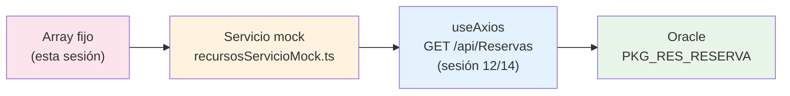

# Sesión especial: construye un componente TODO desde cero

<!-- [[toc]] -->

::: info CONTEXTO
Esta es una **sesión especial** (formato masterclass grabada) que **refuerza la [Sesión 8: Directivas, eventos y datos](../sesion-08-directivas-eventos/)**. En la sesión 8 vimos cada directiva en una demo aislada; aquí las **encadenamos en una sola construcción en vivo**: partimos de una lista de HTML escrita a mano y, paso a paso, llegamos a un componente TODO interactivo. Después repetimos el **mismo patrón** con las reservas del curso y vemos cómo enlaza con la aplicación real.

**Al terminar esta sesión sabrás:**

- Partir de HTML estático y entender por qué no escala.
- Pasar de HTML "muerto" a datos reactivos con una **interface** y `v-for`.
- Añadir, marcar y borrar elementos con `v-model`, eventos y `.filter()`.
- Reconocer que **el patrón no cambia** al pasar del TODO de juguete al dominio real (reservas).
- Saber dónde encaja todo esto en la aplicación demo y qué viene después (servicio mock → `useAxios`).
  :::

::: tip ¿VIENES DE RAZOR, PHP O ASP?
En los pasos del `v-for` (§Paso 2) y de **añadir** (§Paso 4) encontrarás recuadros **"Si vienes de Razor, PHP o ASP"** que comparan el código de servidor con el de Vue. Si ya programas con esas tecnologías, te ayudarán a ver qué es **lo mismo** (iterar una colección, un formulario) y qué **cambia de raíz** (render en servidor con recarga → reactividad en el cliente sin recarga).
:::

## Plan de sesión (90 min) {#plan-90}

| Bloque                        | Tiempo | Contenido                                     |
| ----------------------------- | ------ | --------------------------------------------- |
| **Construcción del TODO**     | 50 min | Pasos 1 a 7: de `<li>` fijos a TODO completo  |
| **El mismo patrón: reservas** | 20 min | Paso 8: mismo componente sobre `IReserva`     |
| **Y después la app**          | 10 min | Paso 9: dónde vive y cómo se conecta a la API |
| **Cierre**                    | 10 min | Resumen y puente a las sesiones 11–14         |

::: tip OBJETIVO PEDAGÓGICO
El TODO es un dominio **de juguete a propósito**. Lo importante no es la lista de tareas: es interiorizar el **patrón** (interface → array reactivo → `v-for` → añadir/marcar/borrar) para luego aplicarlo sin pensar a reservas, recursos o cualquier entidad del proyecto final.
:::

::: details Demos ejecutables de esta sesión
Todo lo de esta sesión está disponible y navegable en la aplicación demo:

| Demo                           | Ruta en la app                                      | Fichero                      |
| ------------------------------ | --------------------------------------------------- | ---------------------------- |
| Índice de la sesión especial   | `/uareservas/sesiones-vue/sesion-especial`          | `SesionEspecialIndice.vue`   |
| Componente TODO (estado final) | `/uareservas/sesiones-vue/sesion-especial/todo`     | `SesionEspecialTodo.vue`     |
| El mismo patrón: reservas      | `/uareservas/sesiones-vue/sesion-especial/reservas` | `SesionEspecialReservas.vue` |

Carpeta: `uaReservas/ClientApp/src/views/sesiones-vue/sesion-especial/`.
:::

---

## Paso 0 — El lienzo: crear el componente y su ruta {#paso-0}

Antes de escribir nada de lógica, creamos el fichero del componente y lo **enchufamos a una ruta** para poder verlo en pantalla. Un componente que no está en ninguna ruta no se ve.

```html
<!-- src/views/sesiones-vue/sesion-especial/SesionEspecialTodo.vue -->
<script setup lang="ts">
  // De momento, vacío. Aquí irá la lógica a partir del Paso 2.
</script>

<template>
  <h1>Mi lista de tareas</h1>
</template>
```

Registramos la ruta en `src/router.ts`:

```typescript
// 1) Import arriba, junto a los demás
import SesionEspecialTodo from "@/views/sesiones-vue/sesion-especial/SesionEspecialTodo.vue";

// 2) Una entrada más en el array de rutas
{
  path: APP_DIR + "/sesiones-vue/sesion-especial/todo",
  name: "SesionEspecialTodo",
  component: SesionEspecialTodo,
  meta: { title: "Sesion especial · Componente TODO" },
},
```

::: tip 🎥 EN PANTALLA
Arranca la app (`pnpm local`) y navega a `/uareservas/sesiones-vue/sesion-especial/todo`. Debe verse solo el `<h1>`. Es el punto de partida: a partir de aquí, **todo lo demás lo construimos sobre este fichero**.
:::

## Paso 1 — Lista de HTML escrita a mano {#paso-1}

Empezamos como lo haría cualquiera que conoce HTML pero todavía no Vue: una lista `<ul>` con un `<li>` por tarea, **escrito a mano**.

```html
<template>
  <h1>Mi lista de tareas</h1>

  <!-- Lista 100% estática: cada <li> es HTML fijo, escrito a mano. -->
  <ul>
    <li>Asisto a la sesión del curso de normalización: Vue</li>
    <li>Me voy a la playa</li>
    <li>Hago la cena</li>
    <li>Me voy a dormir</li>
  </ul>
</template>
```

::: tip 🎥 EN PANTALLA
Refresca: ya se ven las cuatro tareas. Funciona… pero hazte estas preguntas en voz alta para la cámara:

- ¿Y si quiero **añadir** una tarea? Tengo que editar el HTML y recompilar.
- ¿Y si quiero **marcar** una como hecha o **borrarla**? El HTML no sabe nada de "estado".
- ¿Y si las tareas vienen de una **base de datos**? No puedo escribir `<li>` a mano para cada fila.
  :::

::: warning EL PROBLEMA
Este HTML está **"muerto"**: es contenido fijo y repetido. No hay datos, no hay estado, no hay interacción. Vue existe precisamente para resolver esto: **describir la lista una sola vez y dejar que se genere a partir de los datos**.
:::

## Paso 2 — De HTML a datos: interface + `v-for` {#paso-2}

Ahora aparece el `<script>`. Primero **describimos la forma de una tarea** con una interface, después creamos un **array reactivo** con esas mismas cuatro tareas, y lo pintamos con `v-for`. Para verlo bien, dejamos **las dos listas a la vez**: la fija de antes y la nueva generada por datos.

```html
<script setup lang="ts">
  import { ref } from "vue";

  // Una interface describe la FORMA de un objeto: qué propiedades tiene
  // y de qué tipo. No genera código en runtime; le sirve a TypeScript
  // para avisarte si te equivocas. 'hecha' es la bandera de estado
  // (el equivalente a 'confirmada' en una reserva).
  interface ITarea {
    id: number; // identificador único y estable → usado en :key
    texto: string; // lo que se muestra en el <li>
    hecha: boolean; // ¿está completada?
  }

  // ref<ITarea[]> es una "caja" reactiva que solo admite arrays de ITarea.
  // Son las mismas cuatro tareas que antes estaban escritas a mano.
  const tareas = ref<ITarea[]>([
    {
      id: 1,
      texto: "Asisto a la sesión del curso de normalización: Vue",
      hecha: false,
    },
    { id: 2, texto: "Me voy a la playa", hecha: false },
    { id: 3, texto: "Hago la cena", hecha: false },
    { id: 4, texto: "Me voy a dormir", hecha: false },
  ]);
</script>

<template>
  <h1>Mi lista de tareas</h1>

  <!-- LISTA 1: la de siempre, escrita a mano (la dejamos para comparar). -->
  <h2>Hecha a mano</h2>
  <ul>
    <li>Asisto a la sesión del curso de normalización: Vue</li>
    <li>Me voy a la playa</li>
    <li>Hago la cena</li>
    <li>Me voy a dormir</li>
  </ul>

  <!-- LISTA 2: generada con v-for a partir del array 'tareas'.
       v-for="tarea in tareas" → genera un <li> por cada elemento.
       :key="tarea.id" → identificador ÚNICO y ESTABLE de cada fila;
       Vue lo usa para saber qué fila actualizar, mover o borrar. -->
  <h2>Generada con v-for</h2>
  <ul>
    <li v-for="tarea in tareas" :key="tarea.id">{{ tarea.texto }}</li>
  </ul>
</template>
```

::: tip 🎥 EN PANTALLA
Las dos listas se ven **idénticas**. Ese es justo el momento "ajá": _el `v-for` produce exactamente lo mismo que el HTML a mano, pero desde los datos_. Cambia un texto en el array `tareas` y verás que **solo cambia la segunda lista** — la de datos es la viva.
:::

::: warning `:key` ES OBLIGATORIO EN `v-for`
Siempre una clave **única y estable**, normalmente el `id`. Nunca uses el índice del bucle (`:key="index"`): cuando borras o reordenas, Vue reutiliza los nodos por posición y los estados internos (checkboxes marcados, texto editado) se mezclan. Lo vimos en la [Sesión 8 §2.5](../sesion-08-directivas-eventos/#listas).
:::

### Si vienes de Razor, PHP o ASP {#vfor-servidor}

Recorrer una colección para pintar una fila por elemento **no es nuevo**: ya lo hacías en el servidor. La idea es la misma; cambia **dónde y cuándo** se ejecuta el bucle.

::: code-group

```cshtml [Razor (ASP.NET)]
@* El bucle se ejecuta en el SERVIDOR al generar la página *@
<ul>
@foreach (var tarea in Model.Tareas)
{
    <li>@tarea.Texto</li>
}
</ul>
```

```php [PHP]
<?php /* El bucle se ejecuta en el SERVIDOR al servir la página */ ?>
<ul>
<?php foreach ($tareas as $tarea): ?>
    <li><?= htmlspecialchars($tarea['texto']) ?></li>
<?php endforeach; ?>
</ul>
```

```asp [ASP clásico (VBScript)]
<% ' El bucle se ejecuta en el SERVIDOR al pedir la página %>
<ul>
<% For Each tarea In tareas %>
    <li><%= tarea("texto") %></li>
<% Next %>
</ul>
```

```vue [Vue]
<!-- El bucle vive en el NAVEGADOR y se re-ejecuta solo si cambian los datos -->
<ul>
  <li v-for="tarea in tareas" :key="tarea.id">{{ tarea.texto }}</li>
</ul>
```

:::

|                          | Razor / PHP / ASP                                | Vue (`v-for`)                                                           |
| ------------------------ | ------------------------------------------------ | ----------------------------------------------------------------------- |
| **Dónde corre el bucle** | En el **servidor**                               | En el **navegador**                                                     |
| **Cuándo**               | **Una vez** por petición, al generar el HTML     | Cada vez que **cambian los datos** (reactivo)                           |
| **Si cambian los datos** | Hay que **recargar la página** (nueva petición)  | La lista se **repinta sola**, sin recargar                              |
| **El `:key`**            | No existe (el HTML se tira y se regenera entero) | **Obligatorio**: identifica cada fila para actualizar solo lo necesario |
| **Origen de los datos**  | `Model` / variable de servidor                   | Un `ref`/array reactivo en el cliente                                   |

::: tip LA DIFERENCIA DE FONDO
En Razor/PHP/ASP el HTML se **arma una vez en el servidor** y llega "congelado" al navegador: para ver un cambio, otra petición. En Vue el `v-for` queda **vivo en el cliente**, atado a un array reactivo; cuando ese array cambia (añadir, marcar, borrar), Vue actualiza el DOM **sin recargar**. Mismo concepto (iterar una colección), distinto momento de ejecución.
:::

## Paso 3 — Borrar la lista a mano {#paso-3}

Ya hemos demostrado que las dos listas son equivalentes. La fija **ya sobra**: la borramos y nos quedamos solo con la versión por datos, que es la que vamos a hacer crecer.

```html
<template>
  <h1>Mi lista de tareas</h1>

  <ul>
    <li v-for="tarea in tareas" :key="tarea.id">{{ tarea.texto }}</li>
  </ul>
</template>
```

::: info A PARTIR DE AQUÍ
Todo lo que añadamos (formulario, checkbox, botón borrar) cuelga de este `v-for`. La regla de oro: **el template describe la lista una vez; los datos mandan**.
:::

## Paso 4 — Añadir tareas {#paso-4}

Para añadir necesitamos dos cosas: un sitio donde el usuario **escriba** (un `<input>` enlazado con `v-model`) y una **función** que meta la tarea nueva en el array.

```html
<script setup lang="ts">
  import { ref } from "vue";

  interface ITarea {
    id: number;
    texto: string;
    hecha: boolean;
  }

  const tareas = ref<ITarea[]>([
    {
      id: 1,
      texto: "Asisto a la sesión del curso de normalización: Vue",
      hecha: false,
    },
    { id: 2, texto: "Me voy a la playa", hecha: false },
    { id: 3, texto: "Hago la cena", hecha: false },
    { id: 4, texto: "Me voy a dormir", hecha: false },
  ]);

  // Estado del formulario: lo que el usuario está escribiendo ahora mismo.
  const nuevaTarea = ref("");

  // Generador simple de ids para las tareas nuevas. Empezamos alto para
  // no chocar con los ids 1-4 iniciales. (Date.now() también valdría.)
  let proximoId = 100;

  // Handler SIN argumentos → se engancha con @click="anadir" (sin paréntesis).
  function anadir(): void {
    const limpio = nuevaTarea.value.trim();
    if (!limpio) return; // descarta vacíos
    tareas.value.push({ id: proximoId++, texto: limpio, hecha: false });
    nuevaTarea.value = ""; // limpia el input
  }
</script>

<template>
  <h1>Mi lista de tareas</h1>

  <!-- v-model enlaza el input con 'nuevaTarea' en ambos sentidos.
       @keyup.enter dispara 'anadir' al pulsar Enter, sin tocar el ratón:
       el modificador .enter sustituye a un if (event.key === 'Enter'). -->
  <div class="input-group mb-3" style="max-width: 560px">
    <input
      v-model="nuevaTarea"
      class="form-control"
      placeholder="Escribe una tarea y pulsa Enter"
      @keyup.enter="anadir"
    />
    <button class="btn btn-primary" @click="anadir">Añadir</button>
  </div>

  <ul class="list-group" style="max-width: 560px">
    <li v-for="tarea in tareas" :key="tarea.id" class="list-group-item">
      {{ tarea.texto }}
    </li>
  </ul>
</template>
```

::: tip 🎥 EN PANTALLA
Escribe "Comprar pan" y pulsa **Enter**: aparece al final de la lista. Escribe otra y pulsa el botón **Añadir**. Prueba a darle a Enter con el input **vacío**: no pasa nada, porque `anadir` hace `return` si el texto está vacío. Hemos añadido clases de Bootstrap (`list-group`, `input-group`) solo para que se vea presentable.
:::

### Si vienes de Razor, PHP o ASP {#anadir-servidor}

Aquí está el **mayor cambio de mentalidad**. En el mundo de servidor, añadir una fila normalmente significa **reenviar la página** (postback): el formulario hace `POST`, el servidor añade el dato y **vuelve a generar toda la página**.

::: code-group

```cshtml [Razor (ASP.NET)]
@* Postback: el navegador envía POST y el servidor RE-RENDERIZA toda la página *@
<form method="post" asp-action="Anadir">
    <input name="texto" />
    <button type="submit">Añadir</button>
</form>

@* En el controlador:
   [HttpPost] public IActionResult Anadir(string texto) {
       _tareas.Add(new Tarea { Texto = texto });
       return View("Index", _tareas);   // se devuelve la página entera
   } *@
```

```php [PHP]
<?php
// Postback: el POST recarga la página y se vuelve a pintar toda
if (!empty($_POST['texto'])) {
    $tareas[] = ['texto' => $_POST['texto']];
}
?>
<form method="post" action="">
    <input name="texto" />
    <button type="submit">Añadir</button>
</form>
```

```asp [ASP clásico (VBScript)]
<%
' Postback: Request.Form llega tras recargar, y se re-renderiza la página
If Request.Form("texto") <> "" Then
    ' ... añadir a la colección ...
End If
%>
<form method="post">
    <input name="texto" />
    <button type="submit">Añadir</button>
</form>
```

```vue [Vue]
<!-- Sin postback: anadir() muta el array y el DOM se actualiza al instante -->
<input v-model="nuevaTarea" @keyup.enter="anadir" />
<button @click="anadir">Añadir</button>
<!-- function anadir() { tareas.value.push({ ... }) }  ← no hay recarga -->
```

:::

|                                                | Razor / PHP / ASP                           | Vue                                |
| ---------------------------------------------- | ------------------------------------------- | ---------------------------------- |
| **Qué pasa al añadir**                         | `POST` al servidor (postback)               | Se muta un array en el cliente     |
| **Repintado**                                  | El servidor **re-renderiza toda la página** | Vue **parchea solo** el nodo nuevo |
| **Recarga del navegador**                      | Sí (nueva petición)                         | No                                 |
| **Foco / scroll / lo escrito en otros campos** | Se **pierden** (página nueva)               | Se **mantienen**                   |

::: tip ¿Y los datos no se guardan en el servidor?
En este TODO el array vive **solo en el navegador**, así que al recargar se pierde. En una app real, `anadir()` además llamaría a la API para **persistir** (lo verás con `peticion<T>` en la sesión 12). La diferencia clave se mantiene: en Vue **la UI se actualiza al instante en el cliente** y la llamada al servidor es un paso aparte, no un recargado de toda la página.
:::

## Paso 5 — Marcar tareas como hechas {#paso-5}

Cada tarea ya tiene la propiedad `hecha`. La conectamos a un **checkbox** con `v-model` y usamos `:class` para **tachar** visualmente las completadas.

```html
<template>
  <h1>Mi lista de tareas</h1>

  <div class="input-group mb-3" style="max-width: 560px">
    <input
      v-model="nuevaTarea"
      class="form-control"
      placeholder="Escribe una tarea y pulsa Enter"
      @keyup.enter="anadir"
    />
    <button class="btn btn-primary" @click="anadir">Añadir</button>
  </div>

  <ul class="list-group" style="max-width: 560px">
    <li
      v-for="tarea in tareas"
      :key="tarea.id"
      class="list-group-item d-flex align-items-center gap-2"
    >
      <!-- v-model directamente sobre la propiedad del objeto del array.
           Al pulsar, tarea.hecha pasa de false a true (o al revés) y
           Vue redibuja solo esta fila. En checkbox, v-model usa 'checked'. -->
      <input
        v-model="tarea.hecha"
        :id="`tarea-${tarea.id}`"
        class="form-check-input mt-0"
        type="checkbox"
      />

      <!-- :class con objeto: la clase se aplica SOLO cuando la condición
           es true. Aquí, tachado + texto atenuado cuando la tarea está hecha.
           :for se construye con template literal para apuntar a ESTE checkbox. -->
      <label
        :for="`tarea-${tarea.id}`"
        class="form-check-label flex-grow-1"
        :class="{ 'text-decoration-line-through text-muted': tarea.hecha }"
      >
        {{ tarea.texto }}
      </label>
    </li>
  </ul>
</template>
```

::: tip 🎥 EN PANTALLA
Marca y desmarca un par de tareas: el texto se tacha y se atenúa al instante. No hemos escrito ningún `@change` ni manipulado el DOM: `v-model` sobre `tarea.hecha` y `:class` con una condición hacen todo el trabajo. Abre **F12 → Elements** y observa cómo Vue añade/quita las clases en el `<label>`.
:::

## Paso 6 — Borrar tareas {#paso-6}

Añadimos un botón por fila que elimina **esa** tarea. Como el botón necesita saber **cuál** borrar, le pasamos el `id` (handler con argumento → con paréntesis).

```html
<script setup lang="ts">
  // ... (interface, tareas, nuevaTarea, proximoId y anadir, sin cambios)

  // .filter devuelve un ARRAY NUEVO sin el id indicado. Reasignar a .value
  // es lo que Vue detecta para redibujar la lista. .filter NO muta el original.
  function borrar(id: number): void {
    tareas.value = tareas.value.filter((t) => t.id !== id);
  }
</script>

<template>
  <!-- ... formulario igual ... -->

  <ul class="list-group" style="max-width: 560px">
    <li
      v-for="tarea in tareas"
      :key="tarea.id"
      class="list-group-item d-flex align-items-center gap-2"
    >
      <input
        v-model="tarea.hecha"
        :id="`tarea-${tarea.id}`"
        class="form-check-input mt-0"
        type="checkbox"
      />
      <label
        :for="`tarea-${tarea.id}`"
        class="form-check-label flex-grow-1"
        :class="{ 'text-decoration-line-through text-muted': tarea.hecha }"
      >
        {{ tarea.texto }}
      </label>

      <!-- @click CON argumento: paréntesis para pasar el id de esta fila. -->
      <button class="btn btn-sm btn-outline-danger" @click="borrar(tarea.id)">
        Borrar
      </button>
    </li>
  </ul>
</template>
```

::: warning AÑADIR SIN PARÉNTESIS, BORRAR CON PARÉNTESIS

- `@click="anadir"` → **sin** paréntesis: el handler no necesita ningún dato de la fila.
- `@click="borrar(tarea.id)"` → **con** paréntesis: necesita saber qué fila borrar.

Es la misma regla práctica de la [Sesión 8 §2.2](../sesion-08-directivas-eventos/#funciones).
:::

::: tip 🎥 EN PANTALLA
Borra una tarea **del medio**: Vue solo quita ese `<li>`, no redibuja toda la lista, porque `:key="tarea.id"` identifica cada fila de forma estable. Marca una tarea como hecha y bórrala: nunca se confunde con la de al lado (eso pasaría con `:key="index"`).
:::

## Paso 7 — Pulido: contador y lista vacía {#paso-7}

Dos detalles que convierten la demo en algo usable: un **contador de pendientes** y un **mensaje cuando no queda ninguna tarea**. Este es el **estado final** del componente, idéntico al que está en la app.

```html
<script setup lang="ts">
  import { ref } from "vue";

  interface ITarea {
    id: number;
    texto: string;
    hecha: boolean;
  }

  const tareas = ref<ITarea[]>([
    {
      id: 1,
      texto: "Asisto a la sesión del curso de normalización: Vue",
      hecha: false,
    },
    { id: 2, texto: "Me voy a la playa", hecha: false },
    { id: 3, texto: "Hago la cena", hecha: false },
    { id: 4, texto: "Me voy a dormir", hecha: false },
  ]);

  const nuevaTarea = ref("");
  let proximoId = 100;

  function anadir(): void {
    const limpio = nuevaTarea.value.trim();
    if (!limpio) return;
    tareas.value.push({ id: proximoId++, texto: limpio, hecha: false });
    nuevaTarea.value = "";
  }

  function borrar(id: number): void {
    tareas.value = tareas.value.filter((t) => t.id !== id);
  }

  // Cuenta las que NO están hechas. La resolvemos como FUNCIÓN porque en
  // la sesión 10 aún no hemos visto 'computed'. En la sesión 11 la
  // refactorizaremos a computed para cachear el resultado entre renders.
  function pendientes(): number {
    return tareas.value.filter((t) => !t.hecha).length;
  }
</script>

<template>
  <h1>Mi lista de tareas</h1>

  <div class="input-group mb-3" style="max-width: 560px">
    <input
      v-model="nuevaTarea"
      class="form-control"
      placeholder="Escribe una tarea y pulsa Enter"
      @keyup.enter="anadir"
    />
    <button class="btn btn-primary" @click="anadir">Añadir</button>
  </div>

  <ul class="list-group" style="max-width: 560px">
    <li
      v-for="tarea in tareas"
      :key="tarea.id"
      class="list-group-item d-flex align-items-center gap-2"
    >
      <input
        v-model="tarea.hecha"
        :id="`tarea-${tarea.id}`"
        class="form-check-input mt-0"
        type="checkbox"
      />
      <label
        :for="`tarea-${tarea.id}`"
        class="form-check-label flex-grow-1"
        :class="{ 'text-decoration-line-through text-muted': tarea.hecha }"
      >
        {{ tarea.texto }}
      </label>
      <button class="btn btn-sm btn-outline-danger" @click="borrar(tarea.id)">
        Borrar
      </button>
    </li>

    <!-- v-if: solo se crea este <li> cuando el array está vacío. -->
    <li
      v-if="tareas.length === 0"
      class="list-group-item text-center text-muted"
    >
      No hay tareas. Añade una con el formulario de arriba.
    </li>
  </ul>

  <!-- pendientes() se llama en cada render. Con listas cortas, no importa. -->
  <p v-if="tareas.length > 0" class="mt-2 text-muted">
    {{ pendientes() }} tareas pendientes
  </p>
</template>
```

::: tip 🎥 EN PANTALLA
Borra **todas** las tareas una a una: cuando cae la última, aparece el mensaje "No hay tareas…". Marca algunas como hechas y observa cómo baja el contador de pendientes. Este es el componente terminado — y lo hemos construido **sin saltarnos ningún concepto de la sesión 10**.
:::

::: info PUENTE A LA SESIÓN 9
`pendientes()` es una **función** que se recalcula en cada render. En la [Sesión 9](../sesion-09-componentes-estado/) la convertiremos en una propiedad `computed`, que cachea el resultado y solo lo recalcula cuando cambian las tareas.
:::

---

## Paso 8 — El mismo patrón, ahora con reservas {#paso-8}

Aquí está la idea central de la sesión. El TODO era el juguete; las **reservas** son el dominio real del curso. Vamos a reescribir el componente **cambiando solo el contrato y los nombres** — la mecánica de Vue es exactamente la misma.

| Concepto                 | TODO                          | Reserva                                       |
| ------------------------ | ----------------------------- | --------------------------------------------- |
| Interface                | `ITarea { id, texto, hecha }` | `IReserva { id, recurso, horas, confirmada }` |
| Bandera de estado        | `hecha`                       | `confirmada`                                  |
| Texto que se pinta       | `tarea.texto`                 | `reserva.recurso (reserva.horas h)`           |
| Añadir / marcar / borrar | igual                         | igual                                         |

```html
<script setup lang="ts">
  import { ref } from "vue";

  // Mismo patrón, distinto contrato. Esta es la forma del DTO ReservaLectura
  // del backend .NET (sesión 7): cuando en la sesión 12 llamemos a
  // /api/Reservas, el JSON cumplirá esta interface.
  interface IReserva {
    id: number;
    recurso: string;
    horas: number;
    confirmada: boolean; // ← la bandera de estado, antes 'hecha'
  }

  const reservas = ref<IReserva[]>([
    { id: 1, recurso: "Aula 12", horas: 2, confirmada: false },
    { id: 2, recurso: "Sala reuniones A", horas: 1, confirmada: true },
    { id: 3, recurso: "Proyector", horas: 1, confirmada: false },
  ]);

  const nuevoRecurso = ref("");
  let proximoId = 100;

  function anadir(): void {
    const limpio = nuevoRecurso.value.trim();
    if (!limpio) return;
    reservas.value.push({
      id: proximoId++,
      recurso: limpio,
      horas: 1,
      confirmada: false,
    });
    nuevoRecurso.value = "";
  }

  function borrar(id: number): void {
    reservas.value = reservas.value.filter((r) => r.id !== id);
  }

  function pendientes(): number {
    return reservas.value.filter((r) => !r.confirmada).length;
  }
</script>

<template>
  <h1>Reservas</h1>

  <div class="input-group mb-3" style="max-width: 560px">
    <input
      v-model="nuevoRecurso"
      class="form-control"
      placeholder="Nombre del recurso a reservar (pulsa Enter)"
      @keyup.enter="anadir"
    />
    <button class="btn btn-primary" @click="anadir">Añadir</button>
  </div>

  <ul class="list-group" style="max-width: 560px">
    <li
      v-for="reserva in reservas"
      :key="reserva.id"
      class="list-group-item d-flex align-items-center gap-2"
    >
      <input
        v-model="reserva.confirmada"
        :id="`reserva-${reserva.id}`"
        class="form-check-input mt-0"
        type="checkbox"
      />
      <!-- Aquí la clase verde marca lo CONFIRMADO (no tachamos: una reserva
           confirmada es algo "bueno", no algo "terminado"). -->
      <label
        :for="`reserva-${reserva.id}`"
        class="form-check-label flex-grow-1"
        :class="{ 'text-success fw-bold': reserva.confirmada }"
      >
        {{ reserva.recurso }} ({{ reserva.horas }}h)
      </label>
      <button class="btn btn-sm btn-outline-danger" @click="borrar(reserva.id)">
        Borrar
      </button>
    </li>

    <li
      v-if="reservas.length === 0"
      class="list-group-item text-center text-muted"
    >
      No hay reservas. Añade una con el formulario de arriba.
    </li>
  </ul>

  <p v-if="reservas.length > 0" class="mt-2 text-muted">
    {{ pendientes() }} reservas pendientes
  </p>
</template>
```

::: tip 🎥 EN PANTALLA
Pon los dos componentes lado a lado (pestaña TODO y pestaña reservas). Son **el mismo componente** con otros nombres. El mensaje para la cámara: _cuando domines este patrón, montar el CRUD de cualquier entidad —tipos de recurso, recursos, reservas— es repetir esta misma estructura_.
:::

> Demo equivalente en el repo: `SesionEspecialReservas.vue`. Es prácticamente idéntico a `Sesion8ListaReservas.vue` de la [Sesión 8](../sesion-08-directivas-eventos/#eventos), que añade además un bloque "Resumen" con `v-for` sobre un objeto.

## Paso 9 — Y después… la aplicación {#paso-9}

Hasta ahora los datos son un **array fijo escrito en el componente**. En una aplicación real, las reservas vienen de la **base de datos** a través de la API. El salto se da en dos etapas, y cada una tiene su sesión:



<!-- diagram id="especial-fijo-a-api" caption: "Del array fijo a la API real: las dos etapas y sus sesiones" -->

Lo importante: **el `<template>` casi no cambia**. Lo único que se sustituye es _de dónde sale el array_: hoy es un literal, mañana es la respuesta de un servicio. El `v-for`, el `v-model`, el añadir/marcar/borrar… siguen igual.

::: info DÓNDE VERLO EN LA APP

- **Servicio mock:** `uaReservas/ClientApp/src/services/recursosServicioMock.ts` — simula la API con datos en memoria, para trabajar el cliente sin backend.
- **`useAxios`:** composable de `@vueua/components` que hace las llamadas HTTP reales con renovación de token CAS/JWT. Se introduce en la [Sesión 12](../../../04-integracion/sesiones/sesion-12-api-autenticacion/).
- **El CRUD completo de verdad:** `sesiones-vue/sesion-11/Sesion11CrudRecursos.vue` — combina este patrón con modales, toasts y confirmación de borrado (componentes UA de la [Sesión 11](../sesion-11-componentes-ua/)).
  :::

::: warning ESTO NO ES MAGIA, ES EL MISMO PATRÓN
Cuando en la sesión 12 cambies el array fijo por `useAxios`, no estarás aprendiendo "otra cosa": estarás cambiando **una sola línea de origen de datos** sobre el componente que ya sabes construir desde esta sesión.
:::

---

## Resumen {#resumen}

- Una lista de HTML a mano **no escala**: no tiene datos, ni estado, ni interacción.
- Con una **interface** + un **array reactivo** + `v-for`, describimos la lista una vez y la generamos desde los datos.
- `v-model` (formulario y checkbox), eventos (`@click`, `@keyup.enter`) y `.filter()` nos dan **añadir, marcar y borrar**.
- `:key="item.id"` estable, `:class` con condición y `v-if` para los casos vacíos son el acabado mínimo.
- **El patrón no depende del dominio:** TODO y reservas son el mismo componente con otros nombres.
- El salto a la app es cambiar **el origen de los datos** (array fijo → mock → `useAxios`), no el componente.

## Pruébalo en el proyecto {#sandbox}

Arranca la app y entra en `/uareservas/sesiones-vue/sesion-especial`:

| Demo                      | Concepto que ilustra                                            | Fichero                                      |
| ------------------------- | --------------------------------------------------------------- | -------------------------------------------- |
| Componente TODO           | Construcción completa: `v-for`, `v-model`, añadir/marcar/borrar | `sesion-especial/SesionEspecialTodo.vue`     |
| El mismo patrón: reservas | El mismo componente sobre `IReserva` (objetos fijos)            | `sesion-especial/SesionEspecialReservas.vue` |

::: tip CÓMO TRABAJAR LAS DEMOS
Abre `SesionEspecialTodo.vue` con **F12** y, mientras marcas/borras tareas, observa en **Elements** cómo Vue solo toca los nodos afectados. Después abre `SesionEspecialReservas.vue` en paralelo y compara: **mismo esqueleto, distinto contrato**.
:::

## Referencias {#referencias}

- [Sesión 08: Directivas, eventos y datos](../sesion-08-directivas-eventos/) — la teoría completa de `v-for`, `v-model`, eventos y `:class`.
- [Sesión 09: Componentes y comunicación](../sesion-09-componentes-estado/) — `computed`, props y emits para extraer cada fila a su propio componente.
- [Sesión 11: Otros componentes internos](../sesion-11-componentes-ua/) — modales, toasts y el CRUD con componentes UA.
- [Sesión 12: Llamadas a la API y autenticación](../../../04-integracion/sesiones/sesion-12-api-autenticacion/) — sustituir el array fijo por `useAxios`.

<!-- NAV:START -->

| Anterior                                                                     | Inicio                        | Siguiente                                                                   |
| ---------------------------------------------------------------------------- | ----------------------------- | --------------------------------------------------------------------------- |
| [← Sesión 08: Directivas, eventos y datos](../sesion-08-directivas-eventos/) | [Índice del curso](../../../) | [Sesión 9: Componentes y comunicación →](../sesion-09-componentes-estado/) |

<!-- NAV:END -->
