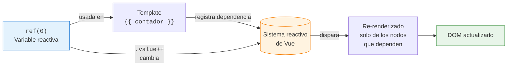

# Sesión 6: Vue 3, TypeScript y tu primer componente (~90 min)

<!-- [[toc]] -->

::: info CONTEXTO
Esta sesión sienta las bases para el resto del módulo. Si ya conoces Vue 3, sirve como repaso rápido de sintaxis con TypeScript. Si vienes de otros frameworks, aquí encontrarás todo lo que necesitas para seguir las sesiones siguientes.

**Sesiones de Vue en este curso:**

| Sesión | Tema | Qué aprenderás |
|--------|------|-----------------|
| **6 (esta)** | Fundamentos | Estructura `.vue`, TypeScript básico, reactividad, interpolación |
| **7** | Datos e interactividad | Interfaces, funciones, `v-if`, `v-for`, `v-model`, eventos, métodos de arrays |
| **8** | Componentes y comunicación | Props, Emits, `defineModel`, `computed`, `watch`, slots |
| **9** | Arquitectura y servicios | Composables, servicios, Vista → Composable → Servicio |
| **10** | Componentes internos UA | `vueua-autocomplete`, `vueua-dialogmodal`, Teleport |

Los temas de `useAxios`, validación y Pinia se cubren en las sesiones de **Integración full-stack** (11-14).
:::

## Plan de sesión (90 min) {#plan-90}

| Bloque | Tiempo | Contenido |
|--------|--------|-----------|
| **Teoría guiada** | 45 min | 1.1 a 1.6 (fundamentos, TS, reactividad, interpolación y depuración básica) |
| **Práctica en aula** | 25 min | Ejercicio de tarjeta personal + revisión en directo |
| **Test de sesión** | 15 min | Preguntas rápidas en formato desplegable y corrección grupal |
| **Cierre** | 5 min | Dudas, errores frecuentes y preparación de la sesión 2 |

::: tip ENFOQUE DIDÁCTICO
Con 90 minutos buscamos no solo explicar sintaxis, sino también consolidar hábitos: leer errores, comprobar tipos y validar que cada alumno pueda crear y entender un componente básico sin ayuda.
:::

## 1.1 ¿Por qué Vue 3 en la UA? {#por-que-vue}

Vue 3 es el framework seleccionado para el desarrollo de la parte cliente en el Servicio de Informática de la UA por:

| Ventaja | Descripción |
|---------|-------------|
| **Curva de aprendizaje suave** | Principal razón frente a Angular o React. Especialmente asequible para desarrolladores con HTML, CSS y JavaScript |
| **Estructura clara** | Separación en `<script>`, `<template>` y `<style>` que mejora legibilidad y mantenimiento |
| **Reactividad** | Actualización automática de la interfaz cuando cambian los datos |
| **TypeScript integrado** | Tipado estático, autocompletado inteligente y detección temprana de errores |
| **Composition API** | Código reutilizable, organizado y escalable |
| **Vue Devtools** | Depuración directa en el navegador con inspección de componentes y estado |

::: tip BUENA PRÁCTICA
Usamos **Composition API** (`<script setup>`) en el curso, no la Options API de Vue 2. Es más moderna, más flexible y tiene mejor soporte de TypeScript.
:::

## 1.2 Estructura de un componente Vue {#estructura-componente}

Un archivo `.vue` se divide en tres secciones:

```html
<script setup lang="ts">
// 1. SCRIPT: Lógica del componente (TypeScript)
</script>

<template>
  <!-- 2. TEMPLATE: HTML que renderiza el componente -->
</template>

<style lang="scss" scoped>
/* 3. STYLE: CSS específico de este componente */
</style>
```

```svgbob
+---------------------------+
| <script setup lang="ts">  |   <- LOGICA TypeScript
|   imports                 |      (lo que el componente sabe hacer)
|   ref / reactive          |
|   funciones               |
| </script>                 |
+---------------------------+
| <template>                |   <- VISTA (HTML + directivas)
|   {{ interpolacion }}     |      (lo que el componente pinta)
|   v-if / v-for / @click   |
| </template>               |
+---------------------------+
| <style scoped lang="scss">|   <- ESTILO local
|   .clase { ... }          |      (CSS encapsulado al componente)
| </style>                  |
+---------------------------+
```

<!-- diagram id="s6-anatomia-vue" caption: "Las tres secciones de un componente .vue" -->

| Sección | Qué contiene | Notas |
|---------|-------------|-------|
| `<script setup lang="ts">` | Imports, variables, funciones, lógica | `setup` activa Composition API, `lang="ts"` activa TypeScript |
| `<template>` | HTML con directivas Vue | Todo lo declarado en script está disponible automáticamente |
| `<style scoped>` | CSS/SCSS del componente | `scoped` asegura que los estilos no afecten a otros componentes |

### Diferencia entre Vista y Componente

| Aspecto | Vista | Componente |
|---------|-------|------------|
| **Ubicación** | `src/views/` | `src/components/` |
| **Propósito** | Página completa (asociada a ruta URL) | Pieza reutilizable de la interfaz |
| **Router** | ✅ Tiene ruta asociada | ❌ No tiene ruta |
| **Uso** | Se carga desde el router | Se importa en vistas u otros componentes |
| **Nomenclatura** | `PascalCase` (`Home.vue`) | `PascalCase` (`SelectorFechas.vue`) |

::: tip REGLA PRÁCTICA
Si el usuario puede navegar directamente a ello con una URL → es una **Vista**. Si se usa como pieza dentro de otras partes → es un **Componente**.
:::

### Orden recomendado en `<script setup>`

```html
<script setup lang="ts">
// 1. Imports
import { ref, computed } from 'vue'
import MiComponente from '@/components/MiComponente.vue'

// 2. Interfaces locales
interface IDatos { id: number; nombre: string }

// 3. Props / Emits (si es componente)
const props = defineProps<{ titulo: string }>()

// 4. Variables reactivas
const contador = ref<number>(0)

// 5. Computed
const doble = computed(() => contador.value * 2)

// 6. Watchers

// 7. Lifecycle hooks

// 8. Funciones
function incrementar() { contador.value++ }
</script>
```

## 1.3 TypeScript: lo que necesitas saber {#typescript-basico}

TypeScript es un **superset de JavaScript** que añade tipado estático. Esto significa que puedes especificar qué tipo de dato debe tener cada variable, y el compilador te avisa si cometes un error.

### Declaración de variables y tipos principales

```typescript
// Tipo explícito
const nombre: string = 'Juan'
const edad: number = 25
const activo: boolean = true

// Inferencia de tipos (TypeScript deduce el tipo automáticamente)
const ciudad = 'Alicante'     // TypeScript sabe que es string
const contador = 0            // TypeScript sabe que es number
```

### `let`, `const` y `var`: qué usar y cuándo

En esta sesión conviene fijar una regla clara:

- **`const` por defecto**.
- **`let` solo si vas a reasignar**.
- **`var` no se usa en código actual** (comportamiento más confuso por alcance de función).

```typescript
const curso = 'Vue 3'   // ✅ no se reasigna
let pagina = 1          // ✅ puede cambiar
pagina = 2

// curso = 'React'      // ❌ error: no puedes reasignar un const
```

Diferencia importante con objetos:

```typescript
const usuario = { nombre: 'Ana', edad: 25 }
usuario.edad = 26          // ✅ permitido (cambia propiedad interna)

// usuario = { nombre: 'Luis', edad: 30 }   // ❌ no permitido (reasignar referencia)
```

Comparación rápida:

| Declaración | Reasignable | Alcance | Recomendación |
|-------------|-------------|---------|---------------|
| `const` | ❌ | bloque (`{}`) | ✅ opción por defecto |
| `let` | ✅ | bloque (`{}`) | ✅ cuando debe cambiar |
| `var` | ✅ | función | ❌ evitar en código moderno |

::: tip REGLA PRÁCTICA
Si dudas entre `let` y `const`, empieza por `const`. Solo cambia a `let` cuando realmente necesites reasignar.
:::

### Otras posibilidades útiles: `as const` y `readonly`

No es imprescindible dominarlas hoy, pero conviene conocerlas:

```typescript
// as const: convierte literales en valores inmutables y más específicos
const estado = 'activo' as const
// estado = 'inactivo'   // ❌ error

interface IConfig {
  readonly apiBase: string
  timeout: number
}

const config: IConfig = {
  apiBase: '/api',
  timeout: 5000
}

config.timeout = 7000       // ✅ permitido
// config.apiBase = '/v2'   // ❌ error (readonly)
```

En sesión 1 basta con recordar:

- `as const` fija literales.
- `readonly` protege propiedades que no deberían modificarse.

### Resumen rápido de tipos más usados

| Tipo | Ejemplo | Descripción |
|------|---------|-------------|
| `string` | `"Hola"` | Texto |
| `number` | `42`, `3.14` | Números enteros y decimales |
| `boolean` | `true`, `false` | Verdadero / Falso |
| `string[]` | `["a", "b"]` | Array de strings |
| `number[]` | `[1, 2, 3]` | Array de números |
| `any` | Cualquier valor | ❌ Evitar: desactiva la verificación de tipos |
| `unknown` | Cualquier valor | Como `any` pero más seguro (obliga a comprobar tipo) |
| `null` | `null` | Valor nulo |
| `undefined` | `undefined` | Valor indefinido |

### Union Types: varios tipos posibles

```typescript
let resultado: string | number

resultado = "éxito"  // ✅ válido
resultado = 200      // ✅ válido
resultado = true     // ❌ error de compilación
```

### Tipos especiales: `null`, `undefined`, `any` y `unknown`

```typescript
// any → desactiva TypeScript (EVITAR)
let valor: any = "texto"
valor = 42          // No hay error, pero pierdes seguridad
valor.noExiste()    // No hay error en compilación, pero falla en ejecución

// unknown → más seguro que any (hay que comprobar tipo antes de usar)
let dato: unknown = "texto"
// dato.toUpperCase()  // ❌ Error: no se puede usar sin comprobar tipo
if (typeof dato === 'string') {
  dato.toUpperCase()   // ✅ Ahora sí, TypeScript sabe que es string
}
```

::: danger ZONA PELIGROSA
Nunca uses `any` salvo en casos muy justificados (librerías sin tipos, migración de JS). Pierdes toda la protección que ofrece TypeScript.
:::

## 1.4 Reactividad: ref y reactive {#reactividad}

La reactividad es la capacidad de Vue de **actualizar automáticamente** el DOM cuando cambian los datos. Es la característica más poderosa de Vue.



<!-- diagram id="s6-ciclo-reactividad" caption: "Ciclo de reactividad de Vue: dependencias, cambio y re-render selectivo" -->

### ¿Por qué usamos `const` con variables reactivas?

Al principio resulta raro ver esto:

```typescript
const contador = ref(0)
```

Usamos `const` porque lo que protegemos es la **referencia reactiva**, no su contenido interno:

```typescript
const contador = ref(0)
contador.value = 10     // ✅ correcto
contador.value++        // ✅ correcto

// contador = ref(20)   // ❌ error: estarías reasignando la referencia
```

Con `reactive` ocurre lo mismo:

```typescript
const usuario = reactive({ nombre: 'Ana' })
usuario.nombre = 'Juan'   // ✅ correcto

// usuario = reactive({ nombre: 'María' })  // ❌ error
```

::: tip IDEA CLAVE
Con `const` no decimos "el dato no cambia". Decimos "esta referencia reactiva no se reemplaza".
:::

### `ref` — Referencia reactiva

`ref` crea una referencia reactiva a cualquier valor:

```html
<script setup lang="ts">
import { ref } from 'vue'

const contador = ref<number>(0)
const nombre = ref<string>('Juan')
const tareas = ref<string[]>([])

function incrementar() {
  contador.value++          // En script: usamos .value
}
</script>

<template>
  <!-- En template: sin .value (Vue lo hace automáticamente) -->
  <p>Contador: {{ contador }}</p>
  <p>Hola {{ nombre }}</p>
  <button @click="incrementar">+1</button>
</template>
```

::: warning IMPORTANTE
- En el `<script>`: usa `contador.value`
- En el `<template>`: usa `contador` (sin `.value`)

Si olvidas `.value` en el script, el código no funciona. Si pones `.value` en el template, sobra.
:::

### `reactive` — Objeto reactivo

Para objetos, también existe `reactive`:

```html
<script setup lang="ts">
import { reactive } from 'vue'

const usuario = reactive({
  nombre: 'Juan',
  edad: 25,
  ciudad: 'Alicante'
})

function cumplirAnios() {
  usuario.edad++          // Sin .value: acceso directo a propiedades
}
</script>

<template>
  <p>{{ usuario.nombre }} tiene {{ usuario.edad }} años</p>
  <button @click="cumplirAnios">Cumplir años</button>
</template>
```

### `ref` vs `reactive` — Cuándo usar cada uno

| Aspecto | `ref` | `reactive` |
|---------|-------|-----------|
| **Uso** | Valores simples, arrays, cualquier cosa | Objetos complejos |
| **Sintaxis en script** | `.value` | Acceso directo |
| **Sintaxis en template** | Sin `.value` | Sin `.value` |
| **Tipado TypeScript** | `ref<Tipo>(valor)` | `reactive<Tipo>({...})` |

::: tip BUENA PRÁCTICA
Prefiere **`ref`** en la mayoría de casos. Es más clara, funciona con todo y tiene mejor soporte TypeScript. Usa `reactive` solo para objetos donde te resulte más cómodo.
:::

## 1.5 Interpolación: mostrar datos en el template {#interpolacion}

Usa llaves dobles `{{ }}` para mostrar valores reactivos en el template:

```html
<template>
  <!-- Texto simple -->
  <p>Hola {{ nombre }}</p>

  <!-- Operaciones -->
  <p>{{ precio * cantidad }}</p>

  <!-- Operador ternario (if/else en una línea) -->
  <p>{{ edad >= 18 ? 'Mayor de edad' : 'Menor de edad' }}</p>

  <!-- Métodos de string -->
  <p>{{ nombre.toUpperCase() }}</p>

  <!-- Llamar funciones -->
  <p>{{ calcularTotal(precio, impuesto) }}</p>

  <!-- Template literal -->
  <p>{{ `Mi nombre es ${nombre} y tengo ${edad} años` }}</p>
</template>
```

::: warning IMPORTANTE
La interpolación solo acepta **expresiones** (que devuelven un valor). No acepta sentencias como `if`, `for` o declaraciones de variables. Para lógica condicional en templates, usamos directivas (`v-if`, `v-for`), que veremos en la sesión 2.
:::

## 1.6 Depuración básica {#debug-basico}

Antes de avanzar a directivas y comunicación entre componentes, conviene establecer una rutina corta de depuración. La idea es simple: cuando algo falla, no adivinar; comprobar.

### 1.6.1 Preparación mínima (navegador + extensión)

**DevTools del navegador**

- Abrir con `F12` o `Ctrl + Shift + I`
- Para esta sesión usaremos sobre todo: **Console** y **Elements**

**Vue Devtools (extensión del navegador)**

1. Instalar la extensión **Vue.js devtools** desde la tienda de extensiones del navegador.
2. Recargar la aplicación Vue después de instalarla.
3. Abrir DevTools y localizar la pestaña **Vue**.
4. Seleccionar el componente actual y revisar sus `ref` en tiempo real.

Si no aparece la pestaña Vue:

- Verifica que la app está en modo desarrollo.
- Recarga la página con DevTools abiertas.
- Comprueba que la extensión está habilitada.

### 1.6.2 Ejemplo rápido con `console.log`

```html
<script setup lang="ts">
import { ref } from 'vue'

const contador = ref<number>(0)

function incrementar() {
  console.log('[click] incrementar')
  console.log('Antes:', contador.value)
  contador.value++
  console.log('Despues:', contador.value)
}
</script>

<template>
  <button @click="incrementar">+1</button>
  <p>Contador: {{ contador }}</p>
</template>
```

Qué debes comprobar en este ejemplo:

1. Cada clic genera logs en consola.
2. El valor "Antes" y "Despues" cambia correctamente.
3. El texto en pantalla se actualiza sin recargar.

Si falla alguno de los tres puntos, ya tienes una pista de dónde está el problema (evento, estado o renderizado).

### 1.6.3 Qué mirar en DevTools (nivel sesión 1)

| Pestaña | Qué revisar | Para qué sirve |
|---------|-------------|----------------|
| **Console** | Errores, warnings y `console.log` | Detectar fallos de ejecución y flujo de eventos |
| **Elements** | Si el DOM refleja cambios esperados | Confirmar que la UI se está renderizando |
| **Vue (Devtools)** | Estado del componente (`ref`, props) | Verificar valores reactivos sin tocar código |

### 1.6.4 Checklist mínimo de depuración

1. Reproducir el fallo con un caso simple.
2. Revisar la consola del navegador tras cada cambio importante.
3. Comprobar que no hay errores de TypeScript en el editor.
4. Verificar en Vue Devtools que las variables reactivas cambian cuando esperas.
5. Confirmar que la UI refleja el estado sin recargar manualmente.

### 1.6.5 Qué revisar cuando algo "no aparece"

| Síntoma | Comprobación rápida |
|---------|---------------------|
| El valor no se actualiza | ¿La variable es reactiva (`ref` o `reactive`)? |
| El valor no cambia en script | ¿Estás usando `.value` en `ref` dentro de `<script setup>`? |
| Error de tipo en editor | ¿Coincide el tipo declarado con el valor asignado? |
| En template sale vacío | ¿La variable existe en `<script setup>` y tiene valor inicial? |
| El botón no hace nada | ¿El `@click` apunta a una función existente? |
| Vue Devtools no muestra estado | ¿Extensión instalada, habilitada y app recargada? |

::: tip BUENA PRÁCTICA
En esta sesión no necesitas una depuración avanzada: primero revisa **Console**, luego **Vue Devtools** y por último el código.
:::

## 1.7 Lo que viene en las próximas sesiones {#preview}

### Sesión 2: Datos e interactividad

Aprenderemos a definir contratos de datos con **interfaces**, a escribir **funciones tipadas** y a construir interfaces interactivas con `v-if`, `v-for`, `v-bind`, `v-model` y eventos. También veremos los métodos de arrays (`.map()`, `.filter()`, `.find()`, `.reduce()`) que usaremos constantemente.

### Sesión 3: Componentes, comunicación y estado derivado

Crearemos componentes reutilizables y aprenderemos a pasar datos entre ellos con Props, Emits y `defineModel`. Implementaremos `computed`, `watch` y `onMounted` para construir componentes más completos.

### Sesión 4: Arquitectura profesional, APIs y flujo de trabajo

Estructuraremos nuestra aplicación con el patrón Vista → Composable → Servicio. Consumiremos APIs REST con `useAxios` y validaremos formularios con `useGestionFormularios`.

---

## Ejercicio Sesión 1 {#ejercicio}

::: info ENUNCIADO
Acabas de incorporarte a un proyecto Vue y tu primera tarea es crear una tarjeta de presentación de un miembro del equipo. El objetivo no es el diseño visual, sino demostrar que sabes declarar estado reactivo con `ref` y pintarlo correctamente en el template con interpolación y expresiones simples.

**Resultado esperado:** un único componente funcional (`TarjetaPresentacion.vue`) que muestre datos personales y cálculos básicos sin usar aún interfaces ni lógica compleja.
:::

**Objetivo:** Crear un componente Vue que muestre una tarjeta de presentación personal usando `ref`, interpolación y template literals.

Crea un componente `TarjetaPresentacion.vue` con:

1. Variables reactivas separadas con `ref` para: `nombre`, `edad`, `ciudad`, `profesion`, `hobbies` y `activo`
2. En el template, muestra:
   - Un título `<h2>` con el nombre
   - Un párrafo con template literal: `"Tengo X años"`
   - Un párrafo: `"Vivo en [ciudad] y soy [profesion]"`
   - Los hobbies en una lista `<ul>` (manual, sin `v-for` por ahora)
   - Estado con operador ternario: "Activo" / "Inactivo"
   - Año aproximado de nacimiento: `{{ 2025 - edad }}`
   - Un mensaje con ternario: `{{ edad >= 50 ? '¡Veterano!' : '¡Joven aún!' }}`

::: tip PISTA DIDÁCTICA
En esta sesión todavía **no** usamos interfaces. Primero asentamos `ref`, `.value` e interpolación. Los contratos de datos llegarán en la sesión 2.
:::

::: details Solución

```html
<script setup lang="ts">
import { ref } from 'vue'

const nombre = ref<string>('Juan García López')
const edad = ref<number>(28)
const ciudad = ref<string>('Alicante')
const profesion = ref<string>('Desarrollador Frontend')
const hobbies = ref<string[]>(['Programación', 'Fotografía', 'Senderismo'])
const activo = ref<boolean>(true)
</script>

<template>
  <div class="card p-4" style="max-width: 400px">
    <h2>{{ nombre }}</h2>
    <p>{{ `Tengo ${edad} años` }}</p>
    <p>Vivo en {{ ciudad }} y soy {{ profesion }}</p>

    <h4>Mis hobbies:</h4>
    <ul>
      <li>{{ hobbies[0] }}</li>
      <li>{{ hobbies[1] }}</li>
      <li>{{ hobbies[2] }}</li>
    </ul>

    <p>Estado: {{ activo ? 'Activo ✅' : 'Inactivo ❌' }}</p>
    <p>Nací aproximadamente en {{ 2025 - edad }}</p>
    <p>{{ edad >= 50 ? '¡Veterano!' : '¡Joven aún!' }}</p>
  </div>
</template>
```
:::

## Test Sesión 1 {#test}

### Preguntas (desplegables)

::: details 1. ¿Qué bloque concentra la lógica principal en un componente Vue con Composition API?
- a) template
- b) style scoped
- c) script setup
- d) router-view
:::

::: details 2. ¿Qué bloque se encarga del marcado que se renderiza en pantalla?
- a) template
- b) script setup
- c) composable
- d) interface
:::

::: details 3. En script, ¿cómo accedes al valor interno de un ref llamado contador?
- a) contador
- b) contador.value
- c) value(contador)
- d) contador.current
:::

::: details 4. En el template, ¿cómo se usa normalmente un ref?
- a) Siempre con .value
- b) Sin .value
- c) Solo con .value si es number
- d) No se puede usar en template
:::

::: details 5. ¿Qué describe mejor la reactividad en Vue?
- a) El DOM se actualiza manualmente con JavaScript puro
- b) La interfaz responde cuando cambia el estado reactivo
- c) El CSS se recompila al cambiar una variable
- d) Las props se convierten en rutas
:::

::: details 6. ¿Por qué const contador = ref(0) sigue siendo correcto si el contador cambia?
- a) Porque const hace inmutable tambien contador.value
- b) Porque cambia el valor interno, no la referencia
- c) Porque Vue ignora const
- d) Porque ref solo funciona con const por sintaxis
:::

::: details 7. ¿Cuál es la opción más segura entre any y unknown?
- a) any
- b) unknown
- c) Son equivalentes
- d) Ninguna de las dos se puede usar
:::

::: details 8. ¿Qué es un union type en TypeScript?
- a) Un tipo exclusivo de Vue
- b) Un tipo que admite varios tipos válidos
- c) Un tipo reservado para arrays
- d) Una versión corta de interface
:::

::: details 9. ¿Qué significa que TypeScript infiera un tipo?
- a) Que desactiva el tipado para esa variable
- b) Que deduce el tipo a partir del valor inicial
- c) Que obliga a importar una interface
- d) Que convierte automáticamente todo en string
:::

::: details 10. En TypeScript moderno, ¿qué regla práctica es más recomendable?
- a) Usar var para evitar errores de bloque
- b) Usar let siempre, incluso si no reasignas
- c) Usar const por defecto y let solo si reasignas
- d) Evitar const cuando trabajas con Vue
:::

::: details 11. ¿Qué efecto tiene style scoped en un componente?
- a) Aplica estilos a toda la aplicación
- b) Limita los estilos al componente actual
- c) Desactiva CSS en Vue
- d) Obliga a usar Bootstrap
:::

::: details 12. ¿Qué opción encaja mejor con ref al empezar?
- a) Valores simples como string, number o boolean
- b) Solo arrays grandes
- c) Solo props del hijo
- d) Exclusivamente llamadas HTTP
:::

::: details 13. ¿Cuándo puede resultar más cómodo reactive?
- a) Cuando trabajas con un objeto con varias propiedades
- b) Cuando solo tienes un número
- c) Cuando quieres evitar toda reactividad
- d) Cuando defines estilos CSS
:::

::: details 14. ¿Qué permite la interpolación de dobles llaves en el template?
- a) Sentencias for completas
- b) Expresiones que devuelven un valor
- c) Declarar interfaces
- d) Ejecutar varias líneas de lógica compleja
:::

::: details 15. ¿Qué debería evitarse dentro de una interpolación?
- a) Mostrar un dato simple
- b) Concatenar texto corto
- c) Meter lógica de negocio compleja
- d) Usar un ternario sencillo
:::

::: details 16. ¿Qué ventaja principal aporta TypeScript en un proyecto de equipo?
- a) Elimina por completo la necesidad de probar
- b) Detecta errores antes y mejora el autocompletado
- c) Hace que Vue no necesite reactividad
- d) Sustituye las interfaces visuales
:::

### Respuestas (Autoevaluación)

::: details Ver respuestas
1. c) script setup.
2. a) template.
3. b) contador.value.
4. b) Sin .value.
5. b) La interfaz responde cuando cambia el estado reactivo.
6. b) Cambia el valor interno, no la referencia.
7. b) unknown.
8. b) Un tipo que admite varios tipos válidos.
9. b) TypeScript deduce el tipo desde el valor inicial.
10. c) Usar const por defecto y let solo si reasignas.
11. b) Limita los estilos al componente actual.
12. a) Valores simples como string, number o boolean.
13. a) Cuando trabajas con un objeto con varias propiedades.
14. b) Permite expresiones que devuelven valor.
15. c) Debe evitarse meter lógica de negocio compleja.
16. b) Detecta errores antes y mejora el autocompletado.
:::


