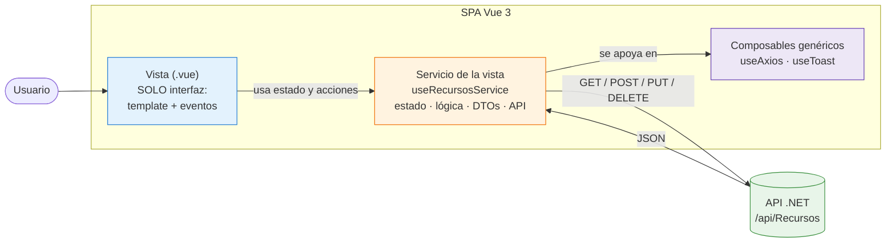
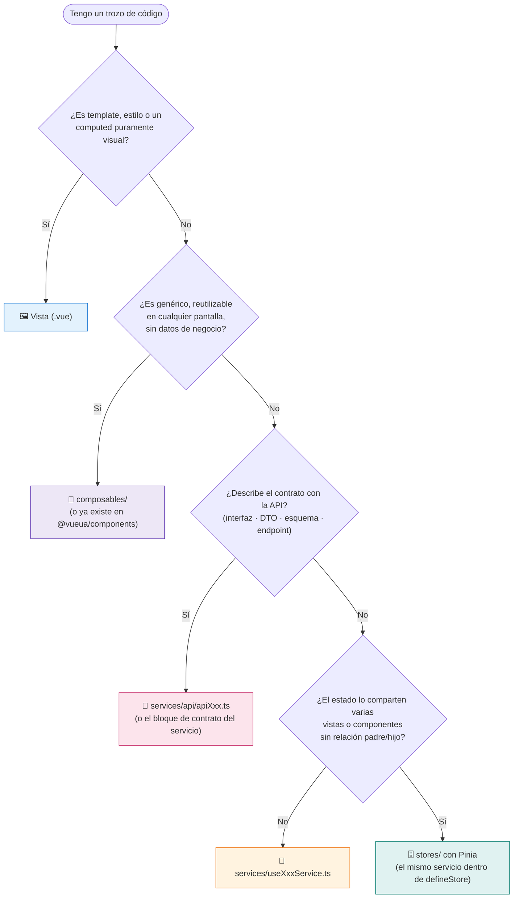
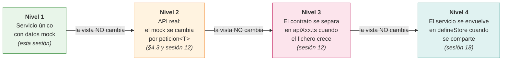
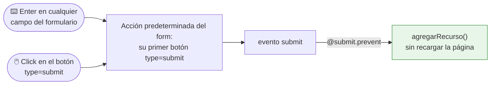
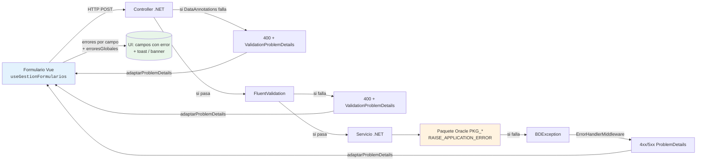
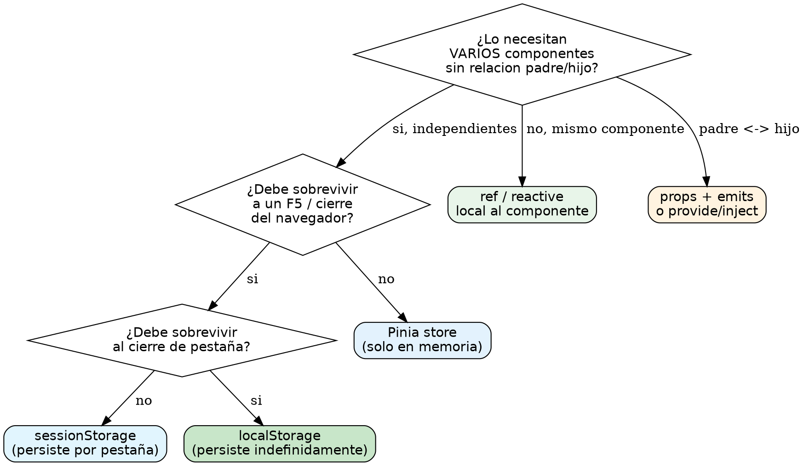
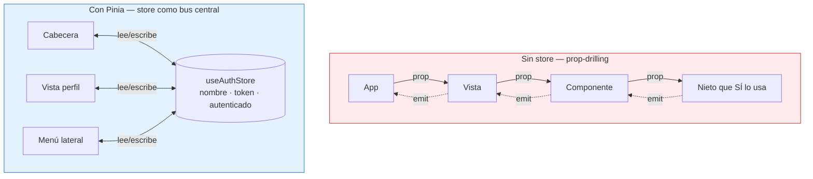

# Sesión 10: Arquitectura de componentes y servicios

::: tip SESIÓN DE INTEGRACIÓN
Esta sesión se centra en la **arquitectura** (Composables vs Servicios). Los temas de `useAxios`, validación de formularios (`useGestionFormularios`) y estado global (Pinia) se cubren en:

- **Sesión 12** — Llamadas a la API y autenticación
- **Sesión 13** — Validación en todas las capas
- **Sesión 18** — Estado y persistencia
  :::

::: info CONTEXTO
En las sesiones anteriores aprendimos a crear componentes, comunicar datos y derivar estado. Ahora damos el paso a una forma de trabajo más cercana a un proyecto real: **arquitectura por capas**, consumo de APIs, validación y criterio para gestionar el estado sin desordenarlo.

**Al terminar esta sesión sabrás:**

- Entender qué es un composable, para qué sirve y qué correspondencia tiene con el .NET MVC
- Diferenciar un composable genérico de un servicio de vista y cuándo usar cada uno
- Estructurar una pantalla con la arquitectura Vista → Servicio → API
- Consumir APIs REST (GET, POST, PUT, DELETE) con `useAxios`
- Escribir formularios **accesibles**: foco, `label`, acción predeterminada y Enter
- Entender qué papel juega **Zod** como contrato de validación en cliente (el hermano de las DataAnnotations)
- Validar formularios en cliente y servidor con `useGestionFormularios`
- Gestionar estado local, compartido y persistente en frontend
- Usar herramientas de apoyo para depurar y verificar una aplicación Vue
  :::

## Plan de sesión (90 min) {#plan-90}

| Bloque               | Tiempo | Contenido                                                                |
| -------------------- | ------ | ------------------------------------------------------------------------ |
| **Teoría guiada**    | 55 min | 4.1 a 4.7 (arquitectura, APIs, validación, estado y flujo de depuración) |
| **Práctica en aula** | 20 min | Ejercicio completo Vista -> Composable -> Servicio                       |
| **Test de sesión**   | 10 min | Preguntas de consolidación y corrección técnica                          |
| **Cierre**           | 5 min  | Checklist final de calidad y próximos pasos del módulo                   |

::: tip OBJETIVO PEDAGÓGICO
El foco de esta sesión es que el alumno tome decisiones de arquitectura con criterio, no solo que consiga "hacer funcionar" una llamada HTTP.
:::

## 4.1 ¿Qué es un composable y por qué lo usamos? {#composables-servicios}

Un **composable** es una función `useX()` que agrupa **lógica reactiva** (estado + funciones) para poder **reutilizarla** fuera de un único componente. Es la pieza con la que evitamos repetir código entre vistas.

La mejor forma de entenderlo es ver **qué pasa cuando no lo usamos**.

### El problema: la lógica metida dentro del componente

Imagina un contador escrito directamente en una vista:

```html
<!-- Contador escrito DENTRO del componente -->
<script setup lang="ts">
  import { ref } from "vue";

  const contador = ref(0);
  const incrementar = () => contador.value++;
  const decrementar = () => contador.value--;
  const reiniciar = () => (contador.value = 0);
</script>

<template>
  <button @click="decrementar">−</button>
  <span>{{ contador }}</span>
  <button @click="incrementar">+</button>
  <button @click="reiniciar">Reset</button>
</template>
```

Funciona. Pero el día que necesites **el mismo contador en otra vista**, solo te queda copiar y pegar ese `ref` y esas funciones. Con dos o tres copias aparecen los problemas: el código está **duplicado**, cada copia **evoluciona por su lado**, no se puede **probar de forma aislada** y la vista se va **llenando de lógica** que no es asunto suyo.

### La solución: sacar la lógica a un composable

Movemos ese estado y esas funciones a un fichero aparte, una función `useContador()`:

```typescript
// src/composables/useContador.ts
import { ref, computed } from "vue";

export function useContador(inicial: number = 0, paso: number = 1) {
  const contador = ref<number>(inicial);

  const esCero = computed(() => contador.value === 0);

  const incrementar = () => {
    contador.value += paso;
  };
  const decrementar = () => {
    contador.value -= paso;
  };
  const reiniciar = () => {
    contador.value = inicial;
  };

  // Devolvemos lo que el componente podrá usar.
  return { contador, esCero, incrementar, decrementar, reiniciar };
}
```

Ahora cualquier vista lo usa en una línea, y cada llamada crea **su propio estado independiente**:

```html
<script setup lang="ts">
  import { useContador } from "@/composables/useContador";

  const { contador, incrementar, decrementar, reiniciar } = useContador(10);
</script>

<template>
  <button @click="decrementar">−</button>
  <span>{{ contador }}</span>
  <button @click="incrementar">+</button>
  <button @click="reiniciar">Reset</button>
</template>
```

> Ficheros reales: `composables/useContador.ts` + `views/sesiones-vue/sesion-10/Sesion10ContadorComposable.vue`. La demo monta **dos** contadores con el mismo composable para que veas que no comparten estado.
>
> 🔗 **En la app** · Vista `Sesion10ContadorComposable.vue` (+ `composables/useContador.ts`) · URL <https://localhost:44306/uareservas/sesiones-vue/sesion-10/contador-composable>

::: tip QUÉ HEMOS GANADO

- **Reutilización**: la lógica vive en un sitio y se usa desde donde haga falta.
- **Vista más limpia**: el `.vue` se queda casi sin lógica.
- **Testable**: `useContador` se prueba sin montar ningún componente.
- **Un único punto de cambio**: si cambia la regla, se cambia una vez.
  :::

### Correspondencia con el .NET MVC de siempre

Si vienes de .NET MVC, ya conoces estas piezas con otro nombre:

| En Vue                                              | En .NET MVC                                      | Papel                                                   |
| --------------------------------------------------- | ------------------------------------------------ | ------------------------------------------------------- |
| **Composable genérico** (`useAxios`, `useContador`) | **Helper / clase de utilidades**                 | Código transversal reutilizable, sin pantalla concreta  |
| **Servicio** (`useRecursosService`)                 | **Service** (capa de negocio)                    | Lógica de negocio y acceso a datos de una funcionalidad |
| **Vista `.vue`**                                    | **Vista Razor** (+ el pegamento del controlador) | Solo presentación; cuanta menos lógica, mejor           |
| **Pinia**                                           | Servicio _singleton_ con estado compartido       | Datos que comparten varias pantallas                    |

### Dos tipos de `useX()`: composable genérico vs servicio

Aunque ambos se escriben igual (una función `useX()` que devuelve refs y funciones), cumplen papeles distintos:

- **Composable genérico** — no pertenece a ninguna vista. Es un **"componente sin cabeza"** (_headless_): lógica reactiva sin interfaz. Se usa en cualquier parte. Ejemplos: `useAxios` (peticiones HTTP), `useContador`, `useToast`, `useUtils`. Son el equivalente a los **helpers o librerías** del MVC.

- **Servicio (de la vista)** — pertenece a **una vista concreta**. Reúne todo lo que esa vista necesita para funcionar:
  - el **estado** de la vista (lista, `cargando`, `error`, el modelo del formulario),
  - las **estructuras de datos** (la interfaz del formulario y los DTOs para enviar/recibir de la API),
  - la **lógica de negocio** de esa vista,
  - las **llamadas a la API** (usando `useAxios` por dentro).

  Su objetivo es que la `.vue` **no tenga lógica y tenga el mínimo código posible**. Es el equivalente al **Service de .NET MVC**.

::: info LA IDEA CLAVE
**Un servicio no es más que un composable especial, adaptado a su vista.** Misma mecánica (`useX()` que devuelve estado y funciones); lo que cambia es el propósito: el composable genérico es una librería reutilizable; el servicio es el "cerebro" de una pantalla.
:::

| Aspecto               | Composable genérico                   | Servicio (de la vista)                           |
| --------------------- | ------------------------------------- | ------------------------------------------------ |
| **Ubicación**         | `src/composables/`                    | `src/services/`                                  |
| **Pertenece a**       | Nadie en concreto (reutilizable)      | Una vista concreta                               |
| **Contiene**          | Lógica reactiva genérica              | Estado + lógica de negocio + DTOs + llamadas API |
| **Equivale en MVC a** | Helper / utilidades                   | Service                                          |
| **Ejemplos**          | `useAxios`, `useContador`, `useToast` | `useRecursosService`, `useReservasService`       |

## 4.2 Arquitectura: Vista → Servicio → API {#arquitectura}

Con esos dos tipos de pieza, una pantalla se organiza así: la **vista** solo pinta, el **servicio** concentra todo lo demás, y se apoya en los **composables genéricos** como helpers.



<!-- diagram id="s12-arquitectura" caption: "La vista solo pinta; el servicio concentra estado, lógica y API; los composables genéricos son helpers que el servicio reutiliza" -->

::: tip REGLA DE ORO
La **vista** no debe saber **cómo** se piden los datos: solo pide al servicio y pinta lo que recibe. Toda la lógica (estado, reglas de negocio, llamadas HTTP) vive en el **servicio**. Si la vista empieza a llenarse de `if`, cálculos o `axios`, es señal de que algo tiene que bajar al servicio.
:::

### Ejemplo: listado de recursos

Un servicio mínimo para una vista que lista recursos. Tiene el **estado**, la **estructura de datos** y la **llamada a la API** (de momento, datos de ejemplo en memoria; en la sesión 12 esa única línea pasa a ser una llamada real con `useAxios` y **la vista no cambia**):

```typescript
// src/services/useRecursosService.ts
import { ref } from "vue";

// Estructura de datos de la vista.
export interface IRecurso {
  id: number;
  nombre: string;
  tipo: string;
  activo: boolean;
}

export function useRecursosService() {
  // Estado de la vista.
  const recursos = ref<IRecurso[]>([]);
  const cargando = ref(false);

  // Lógica de negocio + llamada a la API.
  async function cargar(): Promise<void> {
    cargando.value = true;
    try {
      // En la sesión 12: const { data } = await peticion('/Recursos', verbosAxios.GET)
      await new Promise((r) => setTimeout(r, 800)); // simula la red
      recursos.value = [
        { id: 1, nombre: "Aula 12", tipo: "Aula", activo: true },
        { id: 2, nombre: "Sala reuniones A", tipo: "Sala", activo: true },
        { id: 3, nombre: "Proyector", tipo: "Equipo", activo: false },
      ];
    } finally {
      cargando.value = false;
    }
  }

  return { recursos, cargando, cargar };
}
```

La vista coge del servicio solo lo que va a pintar:

```html
<!-- views/sesiones-vue/sesion-10/Sesion10ArquitecturaTresCapas.vue (simplificado) -->
<script setup lang="ts">
  import { onMounted } from "vue";
  import { useRecursosService } from "@/services/useRecursosService";

  // Una línea: la vista no sabe de dónde salen los datos.
  const { recursos, cargando, cargar } = useRecursosService();

  onMounted(cargar);
</script>

<template>
  <p v-if="cargando">Cargando…</p>
  <ul v-else class="list-group">
    <li v-for="r in recursos" :key="r.id" class="list-group-item">
      {{ r.nombre }} <small class="text-muted">({{ r.tipo }})</small>
    </li>
  </ul>
</template>
```

Fíjate en el reparto: la vista **solo pinta**, el servicio **tiene todo lo demás**. El día de mañana, cambiar el origen de los datos (mock → API real) es tocar **una línea del servicio**.

> 🔗 **En la app** · Vista `Sesion10ArquitecturaTresCapas.vue` (+ `composables/useRecursos.ts` + `services/recursosServicioMock.ts`) · URL <https://localhost:44306/uareservas/sesiones-vue/sesion-10/tres-capas>

::: details En el repo el servicio está partido en dos ficheros
La demo real (`Sesion10ArquitecturaTresCapas.vue`) separa el servicio en dos piezas, algo habitual cuando el proyecto crece:

- `composables/useRecursos.ts` — el estado y la lógica (lo que aquí llamamos "servicio de la vista").
- `services/recursosServicioMock.ts` — solo la obtención de datos, con los DTOs en el formato exacto del servidor (`PascalCase`) y un adaptador a `camelCase`.

Conceptualmente son **la misma capa de servicio**; ese corte en dos es el natural cuando una vista crece. Para empezar, basta con el servicio único de arriba.
:::

### Y cuando varios componentes comparten datos: Pinia

A veces una vista **orquesta varios componentes** que necesitan el **mismo dato** (un filtro, el horario en edición, el usuario en sesión). Entonces el estado se saca del servicio a un **store de Pinia**. No es un concepto nuevo: es **un paso más** sobre lo que ya tienes — el mismo `ref`, pero declarado en un sitio compartido para que cualquier componente de la vista lo lea y escriba.

```typescript
// El estado deja de vivir dentro del servicio y pasa a un store compartido.
import { defineStore } from "pinia";
import { ref } from "vue";

export const useRecursosStore = defineStore("recursos", () => {
  const recursos = ref<IRecurso[]>([]); // ahora lo comparten varios componentes
  const cargando = ref(false);
  // … cargar(), igual que en el servicio
  return { recursos, cargando };
});
```

> Pinia se desarrolla en la [sesión 18 — Estado global y persistencia](../../../05-avanzadas/sesiones/sesion-18-estado-persistencia/). Por ahora quédate con la idea: **un servicio para una vista; Pinia cuando ese estado lo comparten varias**.

::: info PARA LOS DE .NET: ES EL CICLO DE VIDA DE LA INYECCIÓN DE DEPENDENCIAS
En .NET decides si un servicio es `Transient` o `Singleton` **al registrarlo**, no al escribirlo.
Aquí igual: el **mismo servicio** puede vivir como función normal — cada vista que llama a
`useRecursosService()` recibe su propia instancia, como un `Transient` — o envuelto en
`defineStore` de Pinia — instancia única para toda la SPA, como un `Singleton`. El código de
dentro **no cambia**: solo cambia el envoltorio. Y la regla de oro: el estado tiene **un único
dueño** — o el servicio local o el store compartido, nunca los dos a la vez.
:::

### Ventajas de separar así

| Ventaja              | Descripción                                                           |
| -------------------- | --------------------------------------------------------------------- |
| **Separación clara** | Vista = UI · Servicio = estado + lógica + API · Composables = helpers |
| **Reutilización**    | Los composables genéricos sirven para cualquier vista                 |
| **Mantenibilidad**   | Un cambio en la API solo toca el servicio                             |
| **Testabilidad**     | El servicio se prueba sin montar la vista                             |

### Dónde vive cada cosa

```
src/
├── composables/                ← composables GENÉRICOS (helpers reutilizables)
│   ├── useContador.ts
│   └── useCrudResource.ts
├── services/                   ← SERVICIOS de vista (estado + lógica + form)
│   ├── useRecursosService.ts
│   ├── useReservasService.ts
│   └── api/                    ← puertas a la API: contrato + HTTP, sin estado
│       ├── apiRecursos.ts          (se desarrolla en la sesión 12)
│       └── apiReservas.ts
├── stores/                     ← Pinia: estado compartido entre vistas (sesión 18)
│   └── useRecursosStore.ts
└── views/                      ← vistas .vue: solo interfaz
    └── Recursos.vue
```

::: tip CÓMO ELEGIR LA CARPETA

- ¿Lo usaría cualquier pantalla y no tiene datos de negocio? → `composables/` (genérico).
- ¿Es la lógica/estado/API de **una** pantalla? → `services/`.
- ¿Describe el contrato con la API (interfaces, DTOs, endpoints)? → `services/api/` (sesión 12).
- ¿Ese estado lo comparten **varias** pantallas? → `stores/` (Pinia).
  :::

Frente al código real, el árbol de decisión completo es este:



<!-- diagram id="s10-decision-codigo" caption: "Árbol de decisión: dónde vive cada trozo de código del frontend" -->

### El camino de crecimiento: cuatro niveles {#niveles}

Este patrón se adopta **de forma progresiva**: una pantalla empieza simple y solo sube de nivel
cuando aparece la necesidad. La clave es que **cada salto no toca la vista**, porque la firma
pública del servicio no cambia.



<!-- diagram id="s10-niveles-crecimiento" caption: "Camino de crecimiento: cada nivel se adopta cuando aparece la necesidad, sin tocar la vista" -->

En la app del curso, el patrón está implementado **completo y en su nivel 3** para las cuatro
entidades de la API: `services/useTiposRecursoService.ts`, `useRecursosService.ts`,
`useReservasService.ts` y `useObservacionesService.ts`, cada uno sobre su puerta
`services/api/apiXxx.ts`. Las pantallas que los consumen están en
`views/sesiones-dotnet/crud-real/` — fíjate en lo corto que queda el `<script setup>` de cada
vista: una llamada al servicio y el control de sus modales.

## 4.3 Traer datos reales (un vistazo) {#useaxios}

En el ejemplo de §4.2 el servicio rellenaba la lista con un `setTimeout` de mentira. Para hablar con la **API real** solo cambia **esa línea**: pasa a ser una llamada con `peticion<T>` del composable `useAxios` de `@vueua/components`. **La vista no se toca.**

```typescript
// src/services/useRecursosService.ts — lo único que cambia frente al mock
import { ref } from "vue";
import { peticion, verbosAxios } from "@vueua/components/composables/use-axios";

export interface IRecurso {
  id: number;
  nombre: string;
  tipo: string;
  activo: boolean;
}

export function useRecursosService() {
  const recursos = ref<IRecurso[]>([]);
  const cargando = ref(false);

  async function cargar(): Promise<void> {
    cargando.value = true;
    try {
      // Antes:   await new Promise(r => setTimeout(r, 800)); recursos.value = [ … ]
      // Ahora:   una sola llamada tipada a la API.
      recursos.value = await peticion<IRecurso[]>("Recursos", verbosAxios.GET);
    } finally {
      cargando.value = false;
    }
  }

  return { recursos, cargando, cargar };
}
```

Eso es **toda** la diferencia entre el mock y la API real: una línea dentro del servicio. Ese es el premio de separar por capas.

> 🔗 **En la app** · Vista `Sesion10Peticion.vue` (`peticion` vs `llamadaAxios`) · URL <https://localhost:44306/uareservas/sesiones-vue/sesion-10/peticion>

### El contrato con la API: convenciones de nombres {#contrato}

Cada tipo de dato de la API tiene su **contrato escrito una sola vez**, con estas convenciones
(las mismas que usa la app del curso en `services/api/apiReservas.ts` y compañía):

| Pieza | Convención | Por qué |
| --- | --- | --- |
| **Interfaz de lectura** | `RecursoLectura`, `camelCase` | Es lo que **devuelve** la API serializada; la vista pinta esto |
| **DTO de escritura** | `RecursoCrearDto`, `PascalCase` | Es lo que **espera** el endpoint .NET; mismos nombres que el DTO C# |
| **Esquema Zod** | `esquemaCrearRecurso` | Las reglas de validación del DTO, junto a su tipo (§4.4) |
| **Formulario inicial** | `formInicialRecurso` | El estado limpio del formulario; resetear = `Object.assign(form, formInicial)` |

El `formInicialXxx` es el equivalente al `new ViewModel()` de MVC: un objeto exportado junto al
contrato con los valores de un formulario recién abierto. El servicio lo usa para crear el
`reactive` del formulario y para limpiarlo tras guardar o cancelar.

::: tip EL CONTRATO VIVE JUNTO A SU API
Interfaz, DTO, esquema y formulario inicial **cambian a la vez** cuando cambia el endpoint. Por
eso viven en el mismo fichero (el bloque de contrato del servicio o, cuando crece, su
`services/api/apiXxx.ts` — sesión 12), nunca repartidos por carpetas que evolucionen por separado.
:::

### Y los datos, ¿cómo se comparten?

- Si los usa **una sola vista**, se quedan en su **servicio** (como arriba).
- Si los necesitan **varios componentes** que la vista orquesta (o varias vistas), el estado sube a un **store de Pinia** — el "paso más" que vimos en §4.2.

::: info EL DETALLE COMPLETO ESTÁ EN LA SESIÓN 12
Aquí solo vemos **que** los datos llegan con `peticion<T>` y dónde viven. El tratamiento completo —`peticion` vs `llamadaAxios` vs `HttpApi`, interfaces de **lectura** y de **escritura** (DTOs), operaciones POST/PUT/DELETE, interceptores y refresco del token, autenticación CAS/JWT y Scalar— se desarrolla en la [sesión 12 — Llamadas a la API y autenticación](../../../04-integracion/sesiones/sesion-12-api-autenticacion/).
:::

## 4.4 Formularios: accesibles y validados (un vistazo) {#validacion}

Un formulario que escribe en la API valida en **varias capas**, y todas devuelven el mismo formato (`ValidationProblemDetails`): el **cliente** (feedback inmediato), **.NET** (`DataAnnotations` / `FluentValidation`) y **Oracle**. En Vue, el composable **`useGestionFormularios`** de `@vueua/components` recibe esa respuesta y pinta los errores **por campo** y los **globales**.

Pero antes de validar nada, el formulario tiene que estar **bien construido**. Empezamos por ahí.

### Primero: un formulario accesible {#formularios-accesibles}

Una persona ciega navega la aplicación **con el teclado**: la tecla <kbd>Tab</kbd> va saltando de
elemento en elemento y el lector de pantalla anuncia dónde está el **foco**. La consecuencia
práctica es inmediata: **solo los controles interactivos reciben el foco** — `<a>`, `<button>`,
`<input>`, `<select>`, `<textarea>`. Un `<div>`, un `<li>` o un `<p>` **nunca** lo reciben.

De ahí salen las cuatro reglas que aplicamos en **todos** los formularios del curso:

**1. Los eventos de interacción (`@click`, `@keyup`…) van solo sobre controles interactivos.**
Si le pones `@click` a un `<div>`, funciona con el ratón… y es **inalcanzable** con el teclado.
Haz la prueba: recorre tu pantalla pulsando <kbd>Tab</kbd>; si no puedes llegar a un elemento,
una persona con lector de pantalla tampoco. Es más fácil usar un `<button>` con otra clase que
convertir en botón algo que no lo es (haría falta `role="button"`, `tabindex="0"`, gestión de
teclado… mejor no entrar ahí).

**2. Los campos se agrupan en un `<form>`.** Cuando el lector de pantalla (o la IA) llega a un
`<form>`, sabe que eso es una acción interactiva con principio y fin. En las SPA se ha perdido la
costumbre porque "ya no hace falta", pero debe hacerse por semántica y legibilidad.

**3. Cada campo lleva su `<label for>`.** El `for` del label apunta al `id` del input: el lector
anuncia "Nombre del nuevo recurso, control de formulario" en lugar de un input anónimo.

**4. El formulario tiene una acción predeterminada que se dispara con <kbd>Enter</kbd>.** Un
`<form>` con un botón `type="submit"` ejecuta esa acción al pulsar <kbd>Enter</kbd> **desde
cualquier campo**, sin perseguir el botón con el ratón. En Vue, el patrón es
`@submit.prevent="accion"` (el `.prevent` evita que el form llame a un `action=""` y recargue la
página). Los botones secundarios del form llevan `type="button"` para no disparar el submit.



<!-- diagram id="s10-accion-predeterminada" caption: "La acción predeterminada del formulario: Enter en cualquier campo y el click en el botón submit desembocan en la misma función" -->

Las cuatro reglas juntas, en el formulario más pequeño posible:

::: code-group

```html [✅ Accesible]
<form @submit.prevent="agregarRecurso">
  <label for="inputNuevoRecurso">Nombre del nuevo recurso:</label>
  <input id="inputNuevoRecurso" v-model="nombreRecurso" type="text" />
  <button type="submit">Agregar</button>
</form>
```

```html [❌ Inalcanzable con teclado]
<!-- El div no recibe el foco: con Tab nunca llegas a "Agregar".
     Y sin form ni label, el input es un campo anónimo y suelto. -->
<input v-model="nombreRecurso" placeholder="Nombre" />
<div class="boton" @click="agregarRecurso">Agregar</div>
```

:::

Y cuando el formulario valida (lo que viene a continuación), los errores también se anuncian:
`aria-invalid` en el campo que falla, `aria-describedby` apuntando al `id` del mensaje de error y
`role="alert"` en el banner de errores globales. Lo verás aplicado en todos los ejemplos que
siguen.

::: warning EN LOS MODALES, OJO CON EL ENTER
En los modales de la plantilla el botón visible de guardar está en el *footer*, **fuera** del
`<form>`, así que pulsar <kbd>Enter</kbd> en un campo no enviaría nada. La solución de las demos
de la app es añadir dentro del form un botón `type="submit"` oculto
(`class="d-none" aria-hidden="true" tabindex="-1"`): el Enter vuelve a funcionar y el botón del
footer sigue siendo el visible. Lo tienes en `views/sesiones-dotnet/crud-real/CrudTiposRecurso.vue`.
:::

> La accesibilidad completa (WCAG 2.1 AA, ENS, verificación) se trabaja en la
> [sesión 22 — Accesibilidad y ENS](../../../05-avanzadas/sesiones/sesion-22-accesibilidad-ens/).
> Lo de hoy es el mínimo que **todo** formulario del curso debe cumplir desde ya.

### Zod, grosso modo: el contrato validable {#zod}

En el bloque .NET ya validaste DTOs con **DataAnnotations** (`[Required]`, `[MaxLength]`…) y
conocerás **FluentValidation** en la sesión 13. **Zod es la misma idea en el cliente**: un
*esquema* que describe las reglas de un objeto y que se evalúa en tiempo de ejecución.

```typescript
// services/api/apiTiposRecurso.ts — el esquema vive JUNTO al DTO que valida
export interface TipoRecursoCrearDto {
  Codigo:   string;
  NombreEs: string;
  NombreCa: string;
  NombreEn: string;
}

export const esquemaCrearTipoRecurso = z.object({
  Codigo: z.string()
    .trim()
    .min(1,   'El codigo es obligatorio')
    .max(100, 'El codigo no puede superar los 100 caracteres')
    .regex(/^[A-Z0-9_]+$/, 'Solo se admiten mayusculas, numeros y guion bajo'),
  NombreEs: z.string().trim().min(1, 'El nombre en castellano es obligatorio').max(150),
  NombreCa: z.string().trim().min(1, 'El nombre en catalan es obligatorio').max(150),
  NombreEn: z.string().trim().min(1, 'El nombre en ingles es obligatorio').max(150),
});
```

Léelo como leerías el DTO de C#: mismas reglas, mismo vocabulario, otro idioma. La
correspondencia es directa:

| Regla | DataAnnotations (.NET) | FluentValidation (.NET) | Zod (cliente) |
| --- | --- | --- | --- |
| Obligatorio | `[Required]` | `.NotEmpty()` | `.min(1, 'mensaje')` |
| Longitud máxima | `[MaxLength(100)]` | `.MaximumLength(100)` | `.max(100)` |
| Formato | `[RegularExpression(...)]` | `.Matches(...)` | `.regex(/.../)` |
| Rango numérico | `[Range(0, 23)]` | `.InclusiveBetween(0, 23)` | `.min(0).max(23)` |

¿Y por qué una capa más, si el navegador ya valida (`required`, `maxlength`) y la API también?
Porque cada capa hace un trabajo distinto y **ninguna puede sustituir a las otras**:

| Capa | Herramienta | Qué aporta | Qué NO puede hacer |
| --- | --- | --- | --- |
| Navegador | HTML5 (`required`, `maxlength`…) | Feedback mientras se escribe | Reglas ricas (regex con mensaje, condicionales); se desactiva con `novalidate` y se salta con DevTools |
| **Cliente Vue** | **Zod** + `validarConEsquema` | **Todas las reglas del DTO, sin viaje de red** y con mensajes propios | Garantizar nada: el cliente siempre es manipulable |
| API .NET | DataAnnotations / FluentValidation | La **barrera real**: nada entra sin pasar por aquí | Feedback instantáneo (cada error cuesta un viaje de red) |
| Oracle | Constraints + `RAISE_APPLICATION_ERROR` | Última red de seguridad de los datos | Mensajes amigables para el usuario |

Por eso el formulario **no depende** de la validación HTML5 (ponemos `novalidate` y validamos con
Zod, que expresa las mismas reglas que el servidor y unas cuantas más) **ni depende** de la API
para enterarse de un campo vacío (sería un viaje de red por cada error tonto). Zod da el feedback
completo e inmediato; el servidor sigue siendo quien manda.

::: tip EL ESQUEMA VIVE JUNTO AL DTO
`esquemaCrearTipoRecurso` y `TipoRecursoCrearDto` están en el **mismo fichero** y describen el
**mismo contrato**: si mañana el código pasa de 100 a 50 caracteres, se cambia el tipo y la regla
a la vez, en el mismo sitio que el endpoint. Esquemas en una carpeta y tipos en otra es la receta
para que se desincronicen.
:::

### Flujo de validación cross-capa

La validación no vive solo en el cliente: una misma regla puede comprobarse en HTML5, en `DataAnnotations`, en `FluentValidation` y en el paquete Oracle. El diagrama recorre el camino completo desde el formulario hasta la BD y de vuelta:



<!-- diagram id="s9-validacion-cross-capa" caption: "Pipeline de validacion: Vue -> .NET (DataAnnotations + FluentValidation) -> Oracle, y vuelta con ProblemDetails" -->

::: warning NO TE FÍES SOLO DEL CLIENTE
La validación de cliente (HTML5 o Zod) mejora la UX, pero cualquier `curl` o DevTools la salta. La del servidor es la que protege los datos. Por eso validamos en **las dos**.
:::

### El patrón, en breve

El mismo `useGestionFormularios` gestiona los errores del **cliente** (con un esquema Zod) y los del **servidor** (el `400` que llega como `ValidationProblemDetails`):

```ts
import { peticion, verbosAxios } from "@vueua/components/composables/use-axios";
import { useGestionFormularios } from "@vueua/components/composables/use-gestion-formularios";
import {
  esquemaCrearTipoRecurso,
  type TipoRecursoCrearDto,
} from "@/services/api/apiTiposRecurso";

const {
  erroresGlobales, // string[]: errores sin un campo concreto
  erroresDeCampo, // (campo) => string[]
  validarConEsquema, // valida en cliente con un esquema Zod
  adaptarProblemDetails, // mapea el 400 del servidor a los campos del form
  inicializarMensajeError,
} = useGestionFormularios();

async function crear(
  form: TipoRecursoCrearDto,
  formRef: HTMLFormElement,
): Promise<void> {
  inicializarMensajeError();
  if (!validarConEsquema(esquemaCrearTipoRecurso, form)) return; // 1) cliente (Zod)
  try {
    await peticion<number>("TipoRecursos", verbosAxios.POST, form); // 2) servidor
  } catch (e: any) {
    adaptarProblemDetails(e.response?.data, formRef); // 3) pinta el 400 por campo
  }
}
```

En el template, cada input marca su propio error (y se lo anuncia al lector de pantalla con
`aria-invalid` + `aria-describedby`) y arriba se listan los globales con `role="alert"`:

```html
<label class="form-label" for="campoCodigo">Código</label>
<input
  id="campoCodigo"
  v-model="form.Codigo"
  name="Codigo"
  class="form-control"
  :class="{ 'is-invalid': erroresDeCampo('Codigo').length }"
  :aria-invalid="erroresDeCampo('Codigo').length > 0"
  :aria-describedby="erroresDeCampo('Codigo').length ? 'errorCodigo' : undefined"
/>
<div v-if="erroresDeCampo('Codigo').length" id="errorCodigo" class="invalid-feedback">
  <div v-for="m in erroresDeCampo('Codigo')" :key="m">{{ m }}</div>
</div>

<div v-if="erroresGlobales.length" class="alert alert-danger" role="alert">
  <ul class="mb-0">
    <li v-for="m in erroresGlobales" :key="m">{{ m }}</li>
  </ul>
</div>
```

::: info EL DETALLE COMPLETO ESTÁ EN LA SESIÓN 13
Aquí solo vemos **dónde encaja** la validación en la arquitectura. El pipeline completo (`DataAnnotations`, `FluentValidation`, errores de Oracle, `errorDeCampo` vs `erroresDeCampo`, el prefijo de campos y `validarConEsquema`) se desarrolla en la [sesión 13 — Validación en todas las capas](../../../04-integracion/sesiones/sesion-13-validacion/). Demo ejecutable: `Sesion10Formulario.vue` · 🔗 <https://localhost:44306/uareservas/sesiones-vue/sesion-10/formulario>
:::

## 4.5 Estado de la aplicación {#estado}

Gestionar estado bien significa responder a estas tres preguntas:

1. ¿Quién necesita este dato? (solo un componente o muchos)
2. ¿Cuánto debe durar? (solo mientras está abierta la app o también tras recargar)
3. ¿Qué sensibilidad tiene? (preferencias, filtros, tokens, datos temporales)

### Niveles de estado en una SPA Vue

| Nivel                        | Dónde vive                                      | Duración                   | Ejemplo típico                                    |
| ---------------------------- | ----------------------------------------------- | -------------------------- | ------------------------------------------------- |
| **Local de componente**      | `ref`/`reactive` dentro de una vista/componente | Hasta desmontar componente | Modal abierto/cerrado, tab activo                 |
| **Compartido en memoria**    | Store de Pinia                                  | Hasta recargar página      | Usuario en sesión, carrito, filtros globales      |
| **Persistente en navegador** | `localStorage` o `sessionStorage`               | Según almacenamiento       | Tema, último filtro usado, borrador de formulario |

::: tip REGLA PRÁCTICA
Empieza por estado local. Solo sube a Pinia si el dato lo consumen varias vistas. Solo persiste en storage si realmente necesitas recuperar ese valor tras navegación o recarga.
:::

### `localStorage` vs `sessionStorage` vs Pinia

| Opción           | Persistencia                          | Alcance                           | Cuándo usar                                              |
| ---------------- | ------------------------------------- | --------------------------------- | -------------------------------------------------------- |
| `localStorage`   | Permanente (hasta borrar manualmente) | Todo el sitio en ese navegador    | Preferencias de usuario (tema, idioma, columnas)         |
| `sessionStorage` | Solo pestaña/sesión actual            | Esa pestaña del navegador         | Estado temporal de navegación (wizard, búsqueda puntual) |
| Pinia            | Memoria de ejecución                  | Toda la SPA mientras esté cargada | Estado compartido entre vistas/componentes               |

### Árbol de decisión

Frente al código real, este árbol es más rápido de aplicar que la tabla:



<!-- diagram id="s9-decision-estado" caption: "Decidir donde vive el estado segun alcance y persistencia" -->

### Ejemplo 1: Preferencia persistente con `localStorage`

```typescript
import { ref, watch } from "vue";

const tema = ref<string>(localStorage.getItem("tema") ?? "claro");

watch(tema, (nuevoTema) => {
  localStorage.setItem("tema", nuevoTema);
});
```

Qué aporta este patrón:

- Al recargar la app, el usuario conserva su preferencia
- El componente sigue trabajando de forma reactiva
- Solo persistes un valor pequeño y estable

### Ejemplo 2: Filtro temporal con `sessionStorage`

```typescript
import { ref, watch } from "vue";

const filtroBusqueda = ref<string>(
  sessionStorage.getItem("filtro-unidades") ?? "",
);

watch(filtroBusqueda, (nuevoFiltro) => {
  sessionStorage.setItem("filtro-unidades", nuevoFiltro);
});
```

Cuándo encaja:

- Quieres mantener estado durante la sesión actual
- No quieres arrastrar datos entre días o sesiones futuras

### Ejemplo 3: Estado compartido con Pinia

Cuando varios componentes **sin relación padre/hijo** necesitan el mismo dato (el usuario en sesión, por ejemplo), pasarlo con props/emits obliga a encadenarlo por niveles intermedios que ni lo usan (_prop-drilling_). Pinia actúa como un **bus central**: un único store que cualquier componente lee y escribe directamente.



<!-- diagram id="s9-pinia-bus" caption: "Pinia como bus central: componentes sin relacion padre/hijo leen y escriben el mismo store, evitando el prop-drilling" -->

```typescript
// src/stores/useAuthStore.ts
import { defineStore } from "pinia";

interface IAuthState {
  nombre: string;
  token: string;
  autenticado: boolean;
}

export const useAuthStore = defineStore("auth", {
  state: (): IAuthState => ({
    nombre: "",
    token: "",
    autenticado: false,
  }),
  getters: {
    nombreVisible: (state) => state.nombre || "Invitado",
  },
  actions: {
    login(nombre: string, token: string) {
      this.nombre = nombre;
      this.token = token;
      this.autenticado = true;
    },
    logout() {
      this.nombre = "";
      this.token = "";
      this.autenticado = false;
    },
  },
});
```

```html
<script setup lang="ts">
  import { useAuthStore } from "@/stores/useAuthStore";

  const auth = useAuthStore();
</script>

<template>
  <p>Usuario: {{ auth.nombreVisible }}</p>
  <button v-if="!auth.autenticado" @click="auth.login('Ana', 'token-demo')">
    Entrar
  </button>
  <button v-else @click="auth.logout()">Salir</button>
</template>
```

### Diferencias importantes que suelen confundir

1. Pinia no persiste por sí sola: al recargar se reinicia.
2. `localStorage` y `sessionStorage` no son reactivos: guardar ahí no actualiza la UI por sí mismo.
3. El patrón habitual es combinar ambos: estado reactivo en Pinia o `ref` y sincronización a storage con `watch`.

### Patrón recomendado para la UA

| Tipo de dato                           | Solución recomendada                                                          |
| -------------------------------------- | ----------------------------------------------------------------------------- |
| Estado de una vista concreta           | `ref`/`reactive` local                                                        |
| Estado compartido entre vistas         | Pinia                                                                         |
| Preferencias de usuario (tema, idioma) | Pinia o `ref` + `localStorage`                                                |
| Filtros de búsqueda temporales         | `sessionStorage`                                                              |
| Tokens / datos sensibles               | Evitar almacenamiento innecesario; aplicar política de seguridad del proyecto |

::: warning IMPORTANTE
No conviertas todo en estado global. El exceso de estado compartido complica trazabilidad, pruebas y mantenimiento.
:::

::: tip BUENA PRÁCTICA
Documenta en cada store qué parte del estado es temporal y qué parte se persiste. Evita "persistir por defecto".
:::

## 4.6 Herramientas y flujo de trabajo {#herramientas}

En un proyecto real no basta con que la pantalla "funcione". Necesitamos herramientas para comprobar estado, tipos y peticiones.

### Vue Devtools

Permite inspeccionar componentes, props, estado reactivo y stores en el navegador.

Úsalo para:

- Ver qué props recibe un componente
- Comprobar si un `computed` cambia cuando esperas
- Inspeccionar estado de Pinia sin añadir `console.log`

### Comprobación de tipos

Antes de dar por buena una tarea, conviene ejecutar la comprobación de TypeScript:

```bash
pnpm vue-tsc --noEmit
```

Qué detecta:

- Props mal tipadas
- Interfaces incompletas
- Accesos a propiedades que no existen
- Funciones con tipos incompatibles

### Red del navegador

La pestaña Network ayuda a revisar:

- URL real que se ha llamado
- Código HTTP devuelto
- Tiempo de respuesta
- Payload enviado al backend

### Regla práctica de depuración

Si algo falla con datos remotos, revisa en este orden:

1. ¿Se dispara el evento correcto?
2. ¿El estado reactivo cambia?
3. ¿Sale la petición en Network?
4. ¿La respuesta tiene la forma esperada?
5. ¿El tipado refleja de verdad esa forma?

## 4.7 Checklist de entrega técnica {#checklist-entrega}

Antes de dar por buena una práctica de arquitectura, revisa estos puntos:

| Punto                  | Pregunta de control                                        |
| ---------------------- | ---------------------------------------------------------- |
| Capas separadas        | ¿La vista evita llamadas HTTP directas?                    |
| Tipado                 | ¿Interfaces y tipos reflejan la respuesta real de la API?  |
| Estados de carga/error | ¿La UI informa cuando carga o falla?                       |
| Validación             | ¿Hay validación mínima en cliente y control en servidor?   |
| Accesibilidad          | ¿`label` con `for` en cada campo, eventos solo en controles interactivos y submit que responde a Enter? |
| Estado compartido      | ¿Solo se globaliza lo que realmente es compartido?         |
| Revisión final         | ¿Se ejecutó `pnpm vue-tsc --noEmit` y se comprobó Network? |

### Señales de alerta (antipatrones)

1. Un componente de vista con demasiada lógica de negocio y llamadas HTTP.
2. Uso de `any` sin justificación en datos de API.
3. Stores globales para estado temporal de una sola vista.
4. Falta de manejo de error en operaciones de red.

::: warning CRITERIO DE CALIDAD
Si un alumno solo prueba el "camino feliz" y no revisa errores de red o validación, la práctica no está completa aunque funcione visualmente.
:::

## 4.8 Pruébalo en el proyecto {#sandbox}

En `uaReservas/ClientApp/src/views/sesiones-vue/sesion-10/` hay varias demos navegables. Arranca la app y entra en <https://localhost:44306/uareservas/sesiones-vue/sesion-10>:

| Demo (vista)                       | Concepto que ilustra                                                                        | URL en la app                                                |
| ---------------------------------- | ------------------------------------------------------------------------------------------- | ------------------------------------------------------------ |
| `Sesion10ContadorComposable.vue` (+ `composables/useContador.ts`) | Composable casero (`useContador`) con dos instancias **independientes**     | `/uareservas/sesiones-vue/sesion-10/contador-composable`     |
| `Sesion10UseUtils.vue`              | Composable sin estado: `generateUniqueId` y `deepClone` de `@vueua/components`              | `/uareservas/sesiones-vue/sesion-10/use-utils`               |
| `Sesion10UseToast.vue`              | `avisar / avisarError / avisarPersonalizado`, grupos y toast persistente                    | `/uareservas/sesiones-vue/sesion-10/use-toast`               |
| `Sesion10BotonLoading.vue`          | Patrón "ocupado" como **componente** (`<BotonLoading>`) y como **directiva** (`v-loading`)  | `/uareservas/sesiones-vue/sesion-10/boton-loading`           |
| `Sesion10Peticion.vue`              | `peticion` vs `llamadaAxios` (anticipo de la sesión 12)                                      | `/uareservas/sesiones-vue/sesion-10/peticion`                |
| `Sesion10Formulario.vue`            | Validación con `useGestionFormularios` (anticipo de la sesión 13)                            | `/uareservas/sesiones-vue/sesion-10/formulario`              |
| `Sesion10ArquitecturaTresCapas.vue` (+ `composables/useRecursos.ts` + `services/recursosServicioMock.ts`) | Integradora: Vista → `useRecursos` → `recursosServicioMock` con `SpinnerModal` y `useToast` | `/uareservas/sesiones-vue/sesion-10/tres-capas` |

::: tip CÓMO TRABAJAR LAS DEMOS
La integradora `Sesion10ArquitecturaTresCapas.vue` es el "estado final" de esta sesión: la vista no sabe de dónde vienen los datos, el composable transforma DTOs PascalCase del servidor a camelCase del cliente, y el servicio aún es mock. Cuando en la sesión 12 sustituyas `recursosServicioMock` por uno con `useAxios`, ni la vista ni el composable se tocan.
:::

### El patrón completo, en la app {#patron-completo-app}

Además de las demos, la app implementa el patrón **de principio a fin** para las cuatro entidades
de la API. Es el mejor sitio para ver el reparto con código real:

| Entidad | Servicio de la vista | Puerta a la API | Vista (solo UI) |
| --- | --- | --- | --- |
| Tipos de recurso | `services/useTiposRecursoService.ts` | `services/api/apiTiposRecurso.ts` | `crud-real/CrudTiposRecurso.vue` |
| Recursos | `services/useRecursosService.ts` | `services/api/apiRecursos.ts` | `crud-real/CrudRecursos.vue` |
| Reservas | `services/useReservasService.ts` | `services/api/apiReservas.ts` | `crud-real/CrudReservas.vue` |
| Observaciones | `services/useObservacionesService.ts` | `services/api/apiObservaciones.ts` | `crud-real/CrudObservaciones.vue` |

(Las vistas están en `views/sesiones-dotnet/crud-real/` y necesitan la API arrancada y login CAS.)

Fíjate en tres cosas al leerlas:

1. El `<script setup>` de cada vista se reduce a **una llamada al servicio** y al control de sus
   modales. Todo lo demás (estado, formulario, catálogos de los `<select>`, llamadas) está en el
   servicio.
2. Los cuatro servicios comparten esqueleto porque se apoyan en el composable genérico
   `composables/useCrudResource.ts`: el servicio solo aporta lo específico del dominio (contrato,
   `formInicial`, mapeos y mensajes).
3. Los formularios cumplen las reglas de accesibilidad de §4.4: `label` con `for`, errores con
   `aria-invalid`/`aria-describedby`, y el botón submit oculto que hace funcionar el
   <kbd>Enter</kbd> dentro del modal.

---

## Ejercicio Sesión 10 {#ejercicio}

::: info ENUNCIADO
En esta práctica construirás una funcionalidad real con la arquitectura de la sesión: un **servicio de la vista** que concentra el estado, la lógica y las llamadas a la API, y una **vista** que solo pinta. El objetivo no es solo que funcione, sino que cada responsabilidad quede en su sitio: la vista no debe conocer ni URLs ni `peticion`.
:::

**Objetivo:** Aplicar la arquitectura Vista → Servicio → API con `peticion` e interfaces de lectura/escritura.

Crea un **listado de unidades** con esta estructura:

1. **Interfaces** (en el propio servicio):
   - `UnidadLectura` (lectura, `camelCase`): `id`, `codigo`, `nombre`, `activa`.
   - `UnidadCrearDto` (escritura, `PascalCase` como el DTO de .NET): `Codigo`, `Nombre`, `Activa`.

2. **Servicio de la vista** `useUnidadesService.ts` en `src/services/`:
   - Estado: `unidades`, `cargando`, `filtro`.
   - Computed: `unidadesFiltradas` (filtrar por nombre) y `totalActivas` (contar activas).
   - Acciones con `peticion`: `cargar()` (GET), `agregar(dto)` (POST + recarga), `eliminar(id)` (DELETE).

3. **Vista** `Unidades.vue` (solo UI, y **accesible** según §4.4):
   - Input de búsqueda con `v-model` sobre `filtro` y su `<label for>`.
   - Tabla con `v-for` de `unidadesFiltradas`.
   - Indicador de carga con `v-if`.
   - Botón de eliminar en cada fila (un `<button>`, nunca un `<div>` clicable).
   - Contador: "X unidades activas de Y total".

::: details Solución

```typescript
// src/services/useUnidadesService.ts — el "cerebro" de la vista
import { ref, computed } from "vue";
import { peticion, verbosAxios } from "@vueua/components/composables/use-axios";

// LECTURA: lo que DEVUELVE la API (camelCase). La vista pinta esto.
export interface UnidadLectura {
  id: number;
  codigo: string;
  nombre: string;
  activa: boolean;
}

// ESCRITURA (DTO): lo que ESPERA la API al crear (PascalCase, como en .NET).
export interface UnidadCrearDto {
  Codigo: string;
  Nombre: string;
  Activa: boolean;
}

export function useUnidadesService() {
  // Estado de la vista
  const unidades = ref<UnidadLectura[]>([]);
  const cargando = ref(false);
  const filtro = ref("");

  // Derivados
  const unidadesFiltradas = computed(() =>
    unidades.value.filter((u) =>
      u.nombre.toLowerCase().includes(filtro.value.toLowerCase()),
    ),
  );
  const totalActivas = computed(
    () => unidades.value.filter((u) => u.activa).length,
  );

  // Acciones: lógica de negocio + llamadas a la API con peticion
  async function cargar(): Promise<void> {
    cargando.value = true;
    try {
      unidades.value = await peticion<UnidadLectura[]>(
        "Unidades",
        verbosAxios.GET,
      );
    } finally {
      cargando.value = false;
    }
  }

  async function agregar(dto: UnidadCrearDto): Promise<void> {
    await peticion<number>("Unidades", verbosAxios.POST, dto);
    await cargar(); // recarga para ver la nueva
  }

  async function eliminar(id: number): Promise<void> {
    await peticion<void>(`Unidades/${id}`, verbosAxios.DELETE);
    unidades.value = unidades.value.filter((u) => u.id !== id);
  }

  return {
    unidades,
    cargando,
    filtro,
    unidadesFiltradas,
    totalActivas,
    cargar,
    agregar,
    eliminar,
  };
}
```

```html
<!-- src/views/Unidades.vue — solo UI -->
<script setup lang="ts">
  import { onMounted } from "vue";
  import { useUnidadesService } from "@/services/useUnidadesService";

  // La vista coge solo lo que pinta. No conoce URLs ni peticion.
  const {
    unidades,
    unidadesFiltradas,
    filtro,
    cargando,
    totalActivas,
    cargar,
    eliminar,
  } = useUnidadesService();

  onMounted(cargar);
</script>

<template>
  <div class="container mt-4">
    <h1>Gestión de unidades</h1>
    <p>{{ totalActivas }} unidades activas de {{ unidades.length }} total</p>

    <div class="mb-3">
      <label class="form-label" for="campoFiltro">Buscar por nombre</label>
      <input id="campoFiltro" v-model="filtro" type="search" class="form-control" />
    </div>

    <p v-if="cargando">Cargando unidades…</p>

    <table v-else class="table table-striped">
      <thead>
        <tr>
          <th>ID</th>
          <th>Código</th>
          <th>Nombre</th>
          <th>Estado</th>
          <th>Acciones</th>
        </tr>
      </thead>
      <tbody>
        <tr v-for="u in unidadesFiltradas" :key="u.id">
          <td>{{ u.id }}</td>
          <td>{{ u.codigo }}</td>
          <td>{{ u.nombre }}</td>
          <td>
            <span :class="u.activa ? 'badge bg-success' : 'badge bg-secondary'">
              {{ u.activa ? 'Activa' : 'Inactiva' }}
            </span>
          </td>
          <td>
            <button class="btn btn-sm btn-danger" @click="eliminar(u.id)">
              Eliminar
            </button>
          </td>
        </tr>
      </tbody>
    </table>
  </div>
</template>
```

:::

::: tip FÍJATE EN EL REPARTO
La vista quedó **sin lógica**: solo llama a `cargar` al montar y pinta. Todo el estado, los derivados y las llamadas viven en el **servicio**. Si más adelante varias vistas necesitaran las mismas unidades, ese estado subiría a un **store de Pinia** — el "paso más" de §4.2.
:::

## Test Sesión 10 {#test}

### Preguntas (desplegables)

::: details 1. En la arquitectura propuesta, ¿qué responsabilidad principal tiene la vista?

- a) Centralizar llamadas HTTP
- b) Renderizar UI y gestionar eventos del usuario
- c) Persistir el estado en storage
- d) Definir interfaces globales
  :::

::: details 2. ¿Qué capa suele concentrar estado reactivo, computed y funciones de una vista?

- a) Servicio
- b) Composable
- c) Router
- d) CSS del componente
  :::

::: details 3. ¿Dónde conviene centralizar las llamadas REST?

- a) En la vista
- b) En el servicio
- c) En el template
- d) En los estilos
  :::

::: details 4. ¿Qué anti-patrón debería evitarse?

- a) Crear interfaces reutilizables
- b) Mezclar llamadas API directamente en una vista grande
- c) Usar computed
- d) Separar responsabilidades
  :::

::: details 5. ¿Qué ofrece el modo reactivo de useAxios?

- a) data, isLoading y error listos para la interfaz
- b) Persistencia automática en Pinia
- c) Validación HTML5 incorporada
- d) Renderizado en servidor
  :::

::: details 6. ¿Cuándo encaja mejor el modo manual con async/await?

- a) Cuando hay varios pasos o control más fino del flujo
- b) Solo en componentes sin formulario
- c) Nunca, porque el modo reactivo siempre es mejor
- d) Solo al trabajar con CSS
  :::

::: details 7. Según la explicación de useAxios, ¿qué no debes incluir en la URL del endpoint?

- a) La barra inicial
- b) El nombre del recurso
- c) /api/
- d) El método HTTP
  :::

::: details 8. ¿Por qué se valida tanto en cliente como en servidor?

- a) Porque el cliente reemplaza las reglas del servidor
- b) Porque cliente mejora UX y servidor garantiza reglas y seguridad
- c) Porque así no hace falta tipado
- d) Porque Vue lo exige por defecto
  :::

::: details 9. ¿Qué función de `useGestionFormularios` valida el formulario en cliente con un esquema Zod?

- a) adaptarProblemDetails
- b) validarConEsquema
- c) erroresGlobales
- d) watchFormulario
  :::

::: details 10. ¿Qué función adapta los errores del servidor (400 ValidationProblemDetails) a los campos del formulario?

- a) inicializarMensajeError
- b) erroresDeCampo
- c) adaptarProblemDetails
- d) useErrores
  :::

::: details 11. ¿Qué describe mejor a Pinia?

- a) Storage persistente por defecto
- b) Estado compartido reactivo en memoria
- c) Sustituto obligatorio de ref
- d) Cliente HTTP integrado
  :::

::: details 12. ¿Qué almacenamiento se mantiene tras cerrar y volver a abrir el navegador?

- a) sessionStorage
- b) localStorage
- c) Pinia
- d) Un ref
  :::

::: details 13. ¿Qué almacenamiento dura solo mientras la pestaña sigue abierta?

- a) localStorage
- b) sessionStorage
- c) Pinia persistente
- d) computed
  :::

::: details 14. ¿Para qué sirve pnpm vue-tsc --noEmit?

- a) Para compilar CSS
- b) Para comprobar tipos sin generar salida de build
- c) Para levantar el servidor de desarrollo
- d) Para inspeccionar peticiones HTTP
  :::

::: details 15. ¿Qué herramienta abrirías primero para inspeccionar una petición fallida al backend?

- a) Vue Devtools
- b) Pestaña Network del navegador
- c) El archivo de estilos
- d) Un slot del componente
  :::

::: details 16. ¿Qué papel cumple un esquema Zod en el cliente?

- a) Sustituye a la validación del servidor
- b) Describe las mismas reglas que el DTO (como DataAnnotations en .NET) y valida sin viaje de red
- c) Genera el HTML del formulario
- d) Persiste el formulario en localStorage
  :::

::: details 17. ¿Sobre qué elementos puede ir un `@click` para que el control sea accesible con teclado?

- a) Sobre cualquier elemento, incluido un `<div>` o un `<li>`
- b) Solo sobre controles interactivos: `<a>`, `<button>`, `<input>`, `<select>`…
- c) Solo sobre elementos con clase `btn`
- d) Sobre cualquier elemento si tiene un estilo de cursor pointer
  :::

::: details 18. ¿Cómo se consigue que pulsar Enter en cualquier campo de un formulario ejecute la acción de guardar?

- a) Añadiendo `@keyup.enter` a cada input, uno a uno
- b) Con un botón `type="submit"` dentro del `<form>` y `@submit.prevent="guardar"` en el form
- c) Es automático en Vue, no hay que hacer nada
- d) Solo se puede hacer con jQuery
  :::

### Respuestas (Autoevaluación)

::: details Ver respuestas

1. b) Renderizar UI y gestionar eventos del usuario.
2. b) Composable. Suele concentrar estado reactivo y derivados de la vista.
3. b) En el servicio.
4. b) Mezclar llamadas API directamente en una vista grande.
5. a) data, isLoading y error listos para la interfaz.
6. a) Cuando hay varios pasos o control más fino del flujo.
7. c) /api/. Lo añade la configuración de useAxios.
8. b) Cliente mejora UX y servidor garantiza reglas y seguridad.
9. b) validarConEsquema (validación en cliente con un esquema Zod).
10. c) adaptarProblemDetails (mapea el 400 del servidor a los campos).
11. b) Estado compartido reactivo en memoria.
12. b) localStorage.
13. b) sessionStorage.
14. b) Para comprobar tipos sin generar salida.
15. b) La pestaña Network del navegador.
16. b) Describe las mismas reglas que el DTO y valida en cliente sin viaje de red; el servidor sigue siendo quien manda.
17. b) Solo sobre controles interactivos (`<a>`, `<button>`, `<input>`, `<select>`…): son los únicos que reciben el foco con Tab.
18. b) Botón `type="submit"` dentro del form + `@submit.prevent="guardar"`: el Enter dispara la acción predeterminada desde cualquier campo.
    :::

---

<!-- NAV:START -->

| Anterior                                                                                          | Inicio                        | Siguiente                                                                                     |
| ------------------------------------------------------------------------------------------------- | ----------------------------- | --------------------------------------------------------------------------------------------- |
| [← Sesión 09: Componentes y comunicación](../../../03-vue/sesiones/sesion-09-componentes-estado/) | [Índice del curso](../../../) | [Sesión 11: Otros componentes internos →](../../../03-vue/sesiones/sesion-11-componentes-ua/) |

<!-- NAV:END -->
