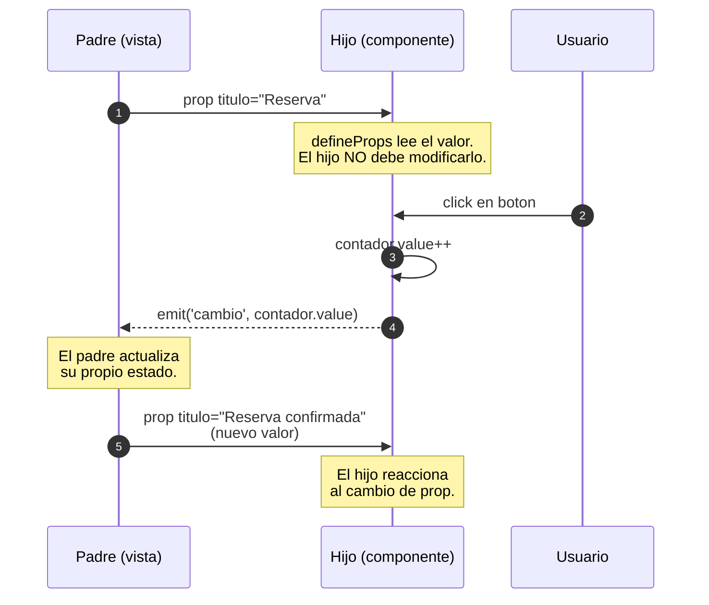
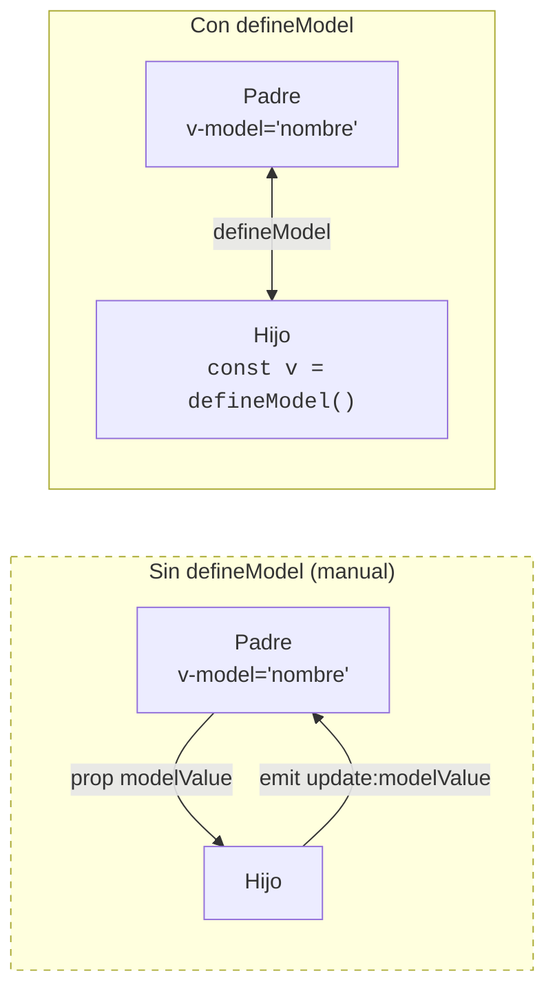
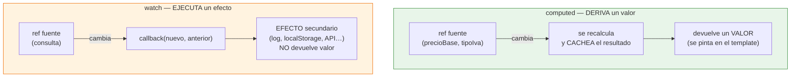
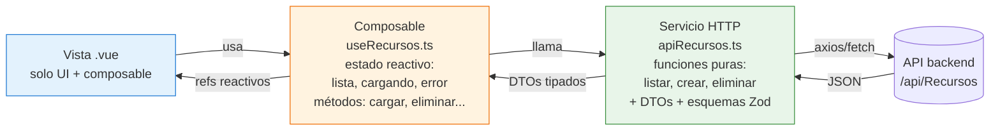

# Sesión 11: Componentes y comunicación
<!-- [[toc]] -->

::: info CONTEXTO
En las sesiones anteriores trabajamos con componentes individuales, directivas, eventos y listas. Ahora damos el salto a **componentes que colaboran entre sí** y a **estado derivado** con `computed` y `watch`, dos herramientas que usarás constantemente en aplicaciones reales.

**Al terminar esta sesión sabrás:**
- Calcular valores derivados con `computed` sin duplicar estado
- Aplicar el patrón entrada -> derivado -> acción en formularios reactivos
- Pasar datos de padre a hijo con Props (`defineProps`)
- Enviar eventos de hijo a padre con Emits (`defineEmits`)
- Simplificar la comunicación bidireccional con `defineModel`
- Reaccionar a cambios con `watch` y `watchEffect`
- Usar `onMounted` y `async/await` para carga inicial
- Crear componentes visuales reutilizables con slots
:::

## Plan de sesión (90 min) {#plan-90}

| Bloque | Tiempo | Contenido |
|--------|--------|-----------|
| **Teoría guiada** | 45 min | 3.1 a 3.9 (computed, comunicación entre componentes, watch, lifecycle y slots) |
| **Práctica en aula** | 25 min | Ejercicio 1 (tras 3.4) + Ejercicio 2 (cierre de sesión) |
| **Test de sesión** | 15 min | Preguntas de consolidación con debate de respuestas |
| **Cierre** | 5 min | Conclusiones y puente a arquitectura/composables |

::: tip ENFOQUE DIDÁCTICO
En esta sesión no buscamos memorizar APIs, sino decidir bien el patrón: `computed` para derivar, props/emits para comunicar, `watch` para efectos y slots para composición visual.
:::

## 3.1 Propiedades Computadas (`computed`) {#computed}

Una `computed` es un valor que se **calcula automáticamente** a partir de otras propiedades reactivas. Vue la cachea y solo la recalcula cuando cambian sus dependencias. La demo `Sesion8Computed.vue` lo ilustra con el cálculo del IVA:

```html
<script setup lang="ts">
import { ref, computed } from 'vue'

const precioBase = ref<number>(100)
const tipoIva = ref<number>(21)

// computed: nuevo valor derivado, reactivo y cacheado.
const ivaImporte  = computed(() => (precioBase.value * tipoIva.value) / 100)
const precioTotal = computed(() => precioBase.value + ivaImporte.value)

// Computed con setter: util cuando queremos un v-model bidireccional
// que escriba en otra variable.
const precioRedondeado = computed({
  get: () => Math.round(precioTotal.value * 100) / 100,
  set: nuevo => {
    // Quitar IVA al fijar el redondeado para recuperar la base.
    precioBase.value = nuevo / (1 + tipoIva.value / 100)
  },
})
</script>

<template>
  <input v-model.number="precioBase" type="number" />
  <input v-model.number="tipoIva"    type="number" />
  <p>IVA: {{ ivaImporte.toFixed(2) }} € · Total: {{ precioTotal.toFixed(2) }} €</p>
  <input v-model.number="precioRedondeado" type="number" step="0.01" />
</template>
```

> Fichero real: `ClientApp/src/views/sesiones-vue/sesion-8/Sesion8Computed.vue`. Si pones el mismo cálculo en un método y lo invocas dos veces en el template, se ejecuta dos veces; el `computed` se ejecuta una sola.

### `computed` vs método

| Aspecto | `computed` | Método |
|---------|-----------|--------|
| **Cacheo** | Sí, según dependencias | No |
| **Cuándo usar** | Valores derivados | Acciones o cálculos con parámetros |
| **Ejemplo** | Total de horas reservadas, filtro de recursos | `guardarReserva()`, `eliminar(id)` |

### Estado derivado en un formulario simple

`computed` aparece sobre todo en formularios: para **derivar** si el botón puede pulsarse, normalizar lo que escribe el usuario o mostrar un mensaje de validación. Tres roles que conviene separar:

1. **Entrada** (`ref`) — lo que escribe el usuario.
2. **Derivado** (`computed`) — lo que sale de esa entrada (válido/no válido, normalizado, contador).
3. **Acción** (función) — lo que se ejecuta al pulsar enviar.

```html
<script setup lang="ts">
import { ref, computed } from 'vue'

// 1) Entrada: el texto crudo del input.
const texto = ref<string>('')

// 2) Derivados: dos computed que dependen del mismo ref.
const textoNormalizado = computed(() => texto.value.trim())
const puedeEnviar      = computed(() => textoNormalizado.value.length >= 3)

// 3) Acción: se invoca al pulsar el botón / Enter.
const guardar = (): void => {
  if (!puedeEnviar.value) return                // protección por si el botón se pulsa de otra forma
  console.log('Guardado:', textoNormalizado.value)
  texto.value = ''
}
</script>

<template>
  <input v-model="texto" @keyup.enter="guardar" placeholder="Mínimo 3 caracteres" />
  <button :disabled="!puedeEnviar" @click="guardar">Guardar</button>
  <small v-if="!puedeEnviar">Escribe al menos 3 caracteres (sin contar espacios).</small>
</template>
```

::: info ESTE ES EL ESCALÓN, NO EL DESTINO
Este patrón funciona para un formulario aislado. En cuanto el formulario llama a una API real (crear/editar/eliminar), la entrada y los derivados siguen aquí, pero **la acción se mueve a un servicio HTTP** y el estado compartido (`cargando`, `error`, lista) a un **composable**. Esa arquitectura se desarrolla en la **sesión 12**. La transición visual está al final de esta sesión (§3.10).
:::

### Errores frecuentes en formularios reactivos

| Error | Consecuencia | Alternativa recomendada |
|------|--------------|-------------------------|
| Validar solo al enviar | Feedback tardío al usuario | Reglas simples en `computed` y mensaje reactivo |
| Repetir lógica en varios handlers | Código duplicado | Extraer función pura (`.trim()`, `.toLowerCase()`…) |
| Mezclar mutaciones y lógica compleja en template | Difícil de depurar | Mover la lógica a `computed` o a un método |

::: tip CRITERIO RÁPIDO
Si produce un valor derivado sin efectos secundarios, piensa en `computed`. Si dispara una acción de usuario (guardar, borrar, enviar), método.
:::

### `computed` con arrays

Sobre el dominio del proyecto (`IRecurso`): filtrar por nombre y contar los visibles.

```html
<script setup lang="ts">
import { ref, computed } from 'vue'

// Misma forma que el DTO RecursoLectura del backend .NET (sesión 7).
interface IRecurso {
  idRecurso: number
  nombre: string
  tipo: 'Aula' | 'Sala' | 'Equipo'
  visible: boolean
}

const recursos = ref<IRecurso[]>([
  { idRecurso: 1, nombre: 'Aula 12',          tipo: 'Aula',   visible: true  },
  { idRecurso: 2, nombre: 'Sala reuniones A', tipo: 'Sala',   visible: true  },
  { idRecurso: 3, nombre: 'Proyector',        tipo: 'Equipo', visible: false },
])

const busqueda = ref<string>('')

// computed #1: filtro de texto. Se recalcula automáticamente cuando cambia
// 'busqueda' o cuando se añade/quita un recurso de la lista.
const recursosFiltrados = computed(() =>
  recursos.value.filter(r =>
    r.nombre.toLowerCase().includes(busqueda.value.toLowerCase()),
  ),
)

// computed #2: cuenta los visibles del resultado filtrado. Encadenar
// computed (uno depende del otro) es válido y eficiente — Vue solo
// recalcula los afectados por el cambio.
const totalVisibles = computed(() =>
  recursosFiltrados.value.filter(r => r.visible).length,
)
</script>
```

::: tip BUENA PRÁCTICA
Si un valor depende de estado reactivo y se muestra en pantalla, empieza pensando en `computed`.
:::

## 3.2 Comunicación Padre → Hijo: Props {#props}

Los **props** pasan datos de un componente padre a un componente hijo. Antes de ver la sintaxis, fija la regla básica de comunicación en Vue: **los datos bajan, los eventos suben**.



<!-- diagram id="s8-props-emits" caption: "Datos bajan via props, eventos suben via emits" -->

Los props se definen con `defineProps`. La demo `Sesion8PropsEmits.vue` usa `TarjetaContador` para mostrar el patrón en código real:

**Componente Hijo** (`TarjetaContador.vue`) — recibe `titulo` como prop y mantiene su contador local:

```html
<script setup lang="ts">
import { ref } from 'vue'

// 1) Declarar la prop que el hijo acepta del padre.
defineProps<{
  titulo: string
}>()

// 2) Estado LOCAL del hijo: ningún componente externo lo modifica directamente.
const contador = ref(0)

function incrementar(): void { contador.value++ }
function reiniciar(): void  { contador.value = 0 }
</script>

<template>
  <div class="card">
    <!-- La prop se interpola exactamente igual que un ref local. -->
    <div class="card-header">{{ titulo }}</div>
    <div class="card-body text-center">
      <p class="display-5 mb-3">{{ contador }}</p>
      <button class="btn btn-primary me-2" @click="incrementar">+1</button>
      <button class="btn btn-outline-secondary" @click="reiniciar">Reset</button>
    </div>
  </div>
</template>
```

**Componente Padre** (`Sesion8PropsEmits.vue`) — instancia dos veces el mismo hijo, cada uno con su título (por ahora sin escuchar su evento; lo añadimos en §3.3):

```html
<script setup lang="ts">
import TarjetaContador from './TarjetaContador.vue'
</script>

<template>
  <!-- Sin v-bind (':'), el valor es literal: titulo="Contador A" es una cadena.
       Aquí no necesitamos reactividad en la prop, solo pasar un nombre fijo. -->
  <TarjetaContador titulo="Contador A" />
  <TarjetaContador titulo="Contador B" />
</template>
```

> Aquí mostramos solo la parte de **props** de `TarjetaContador.vue`. El fichero real además **emite un evento** cuando cambia su contador — lo añadimos en §3.3. Si el padre quisiera cambiar el título dinámicamente, usaría `:titulo="nombreA"` con un `ref`.

### Props con valores por defecto: `withDefaults`

```typescript
interface Props {
  titulo: string
  activo?: boolean
  contador?: number
}

const props = withDefaults(defineProps<Props>(), {
  activo: true,
  contador: 0
})
```

::: warning IMPORTANTE
Los props son de **solo lectura** en el componente hijo. Nunca modifiques un prop directamente (`props.nombre = 'otro'` es un error). Si el hijo necesita cambiar un valor del padre, usa Emits o `defineModel`.
:::

## 3.3 Comunicación Hijo → Padre: Emits {#emits}

Los **emits** envían eventos desde el hijo hacia el padre. El `TarjetaContador` que acabamos de ver mantiene su contador en local; cuando ese contador cambia, **avisa al padre** emitiendo un evento. Los emits se declaran con `defineEmits`.

**Componente Hijo** (`TarjetaContador.vue`) — ahora con el emit que faltaba en §3.2:

```html
<script setup lang="ts">
import { ref } from 'vue'

defineProps<{
  titulo: string
}>()

// Declarar el evento que el hijo puede emitir, con el tipo de su payload.
const emit = defineEmits<{
  (e: 'cambio', valor: number): void
}>()

const contador = ref(0)

// El hijo NO modifica al padre: solo emite. El padre decide qué hacer.
function incrementar(): void { contador.value++; emit('cambio', contador.value) }
function reiniciar(): void  { contador.value = 0; emit('cambio', contador.value) }
</script>

<template>
  <div class="card">
    <div class="card-header">{{ titulo }}</div>
    <div class="card-body text-center">
      <p class="display-5 mb-3">{{ contador }}</p>
      <button class="btn btn-primary me-2" @click="incrementar">+1</button>
      <button class="btn btn-outline-secondary" @click="reiniciar">Reset</button>
    </div>
  </div>
</template>
```

**Componente Padre** (`Sesion8PropsEmits.vue`) — escucha `@cambio` y guarda un historial:

```html
<script setup lang="ts">
import { ref } from 'vue'
import TarjetaContador from './TarjetaContador.vue'

const historial = ref<{ origen: string; valor: number }[]>([])

// $event lleva el payload del emit (el número). Envolvemos la llamada
// para añadir de qué tarjeta viene.
function onCambio(origen: string, valor: number): void {
  historial.value.unshift({ origen, valor })
}
</script>

<template>
  <!-- titulo: prop (baja). @cambio: emit (sube). -->
  <TarjetaContador titulo="Contador A" @cambio="onCambio('Contador A', $event)" />
  <TarjetaContador titulo="Contador B" @cambio="onCambio('Contador B', $event)" />

  <ul>
    <li v-for="(ev, i) in historial" :key="i">
      <code>{{ ev.origen }}</code> emitió: <strong>{{ ev.valor }}</strong>
    </li>
  </ul>
</template>
```

> Ficheros reales: `ClientApp/src/views/sesiones-vue/sesion-8/TarjetaContador.vue` + `Sesion8PropsEmits.vue`. Cada `TarjetaContador` tiene su propio contador local: Vue no comparte estado entre instancias del mismo componente, y el padre solo se entera de los cambios porque el hijo los emite.

::: tip ¿Y SI EL ESTADO DEBE VIVIR EN EL PADRE?
Aquí el contador es local del hijo. Si necesitas que el **padre** sea el dueño del número (y el hijo solo lo muestre y pida cambios), el patrón es el mismo —prop que baja, emit que sube— pero sin estado local en el hijo. Lo practicarás en el **Ejercicio 1** con `ContadorPropsEmits`, y en §3.4 verás cómo `defineModel` lo compacta a una línea.
:::

## 3.4 `defineModel`: comunicación bidireccional simplificada {#define-model}

El patrón Props + Emits funciona, pero es repetitivo para `v-model`. **`defineModel`** (Vue 3.4+) lo simplifica a una sola línea:



<!-- diagram id="s8-define-model" caption: "defineModel compacta prop + emit en una sola declaracion bidireccional" -->

### Comparación

| Aspecto | Props + Emits | `defineModel` |
|---------|---------------|---------------|
| **Líneas de código** | ~15 líneas | ~3 líneas |
| **Props a definir** | `modelValue` manual | Automático |
| **Emits a definir** | `update:modelValue` manual | Automático |
| **Función handler** | Necesaria | No necesaria |

### Ejemplo: Input personalizado

La demo `Sesion8DefineModel.vue` usa `InputEditable.vue` como componente hijo. Es el patrón "real" con etiqueta + botón "Limpiar":

```html
<!-- InputEditable.vue (hijo) -->
<script setup lang="ts">
// defineModel reemplaza a defineProps + defineEmits('update:modelValue').
const valor = defineModel<string>({ required: true })

defineProps<{ etiqueta: string }>()

function limpiar(): void { valor.value = '' }
</script>

<template>
  <div class="input-group">
    <span class="input-group-text">{{ etiqueta }}</span>
    <input v-model="valor" type="text" class="form-control" />
    <button class="btn btn-outline-secondary" type="button" @click="limpiar">Limpiar</button>
  </div>
</template>
```

**Uso en el padre** (`Sesion8DefineModel.vue`):

```html
<script setup lang="ts">
import { ref } from 'vue'
import InputEditable from './InputEditable.vue'

const nombre = ref('')
const apellido = ref('Lovelace')
</script>

<template>
  <InputEditable v-model="nombre"   etiqueta="Nombre" />
  <InputEditable v-model="apellido" etiqueta="Apellido" />
  <p>Hola, <strong>{{ nombre }} {{ apellido }}</strong></p>
</template>
```

> Ficheros reales: `ClientApp/src/views/sesiones-vue/sesion-8/Sesion8DefineModel.vue` + `InputEditable.vue`.

### Toggle personalizado

```html
<script setup lang="ts">
const activo = defineModel<boolean>({ default: false })
</script>

<template>
  <button @click="activo = !activo" :class="{ activado: activo }">
    {{ activo ? 'Encendido ✓' : 'Apagado ✗' }}
  </button>
</template>
```

### Múltiples v-models

```html
<script setup lang="ts">
const nombre = defineModel<string>('nombre')
const apellido = defineModel<string>('apellido')
</script>

<template>
  <input v-model="nombre" placeholder="Nombre" />
  <input v-model="apellido" placeholder="Apellido" />
</template>
```

```html
<!-- Uso en el padre -->
<FormularioNombre v-model:nombre="nombreUsuario" v-model:apellido="apellidoUsuario" />
```

::: tip BUENA PRÁCTICA
**Cuándo usar cada patrón:**
- **Props** (solo lectura) → `defineProps`
- **Eventos del hijo al padre** → `defineEmits`
- **Comunicación bidireccional** (`v-model`) → `defineModel` ✅
:::

## Ejercicio 1: Contador con componentes {#ejercicio-1}

::: info ENUNCIADO
Vas a resolver el mismo problema funcional con dos patrones de comunicación entre componentes. La práctica busca que comprendas cuándo usar Props+Emits y cuándo `defineModel`, manteniendo en ambos casos una única fuente de verdad del estado en el padre.

**Resultado esperado:** tres componentes (`ContadorPropsEmits.vue`, `ContadorVModel.vue`, `PadreContadores.vue`) con comportamiento equivalente y suma derivada mediante `computed`.
:::

**Objetivo:** Practicar Props, Emits y `defineModel` creando un contador que vive en el padre pero se controla desde el hijo.

1. Crea `ContadorPropsEmits.vue` (hijo):
   - Recibe prop `contador` (number)
   - Emite evento `actualizar` con el nuevo valor
   - Tiene botones +1 y -1 que emiten el cambio

2. Crea `ContadorVModel.vue` (hijo):
   - Usa `defineModel<number>()` en lugar de props/emits
   - Misma funcionalidad pero con menos código

3. Crea `PadreContadores.vue` (padre):
   - Mantiene `contadorA` y `contadorB` como refs
   - Usa `ContadorPropsEmits` con `contadorA`
   - Usa `ContadorVModel` con `contadorB`
   - Muestra la suma de ambos contadores con `computed`

::: details Solución Ejercicio 1

```html
<!-- ContadorPropsEmits.vue -->
<script setup lang="ts">
const props = defineProps<{ contador: number }>()
const emit = defineEmits<{ actualizar: [valor: number] }>()
</script>

<template>
  <div class="d-flex align-items-center gap-2">
    <button class="btn btn-sm btn-danger" @click="emit('actualizar', contador - 1)">-1</button>
    <span class="badge bg-primary fs-5">{{ contador }}</span>
    <button class="btn btn-sm btn-success" @click="emit('actualizar', contador + 1)">+1</button>
  </div>
</template>
```

```html
<!-- ContadorVModel.vue -->
<script setup lang="ts">
const modelo = defineModel<number>({ default: 0 })
</script>

<template>
  <div class="d-flex align-items-center gap-2">
    <button class="btn btn-sm btn-danger" @click="modelo!--">-1</button>
    <span class="badge bg-info fs-5">{{ modelo }}</span>
    <button class="btn btn-sm btn-success" @click="modelo!++">+1</button>
  </div>
</template>
```

```html
<!-- PadreContadores.vue -->
<script setup lang="ts">
import { ref, computed } from 'vue'
import ContadorPropsEmits from './ContadorPropsEmits.vue'
import ContadorVModel from './ContadorVModel.vue'

const contadorA = ref<number>(0)
const contadorB = ref<number>(0)

const suma = computed(() => contadorA.value + contadorB.value)
</script>

<template>
  <div class="p-4">
    <h2>Contadores</h2>

    <div class="mb-3">
      <h4>Props + Emits</h4>
      <ContadorPropsEmits :contador="contadorA" @actualizar="(v) => contadorA = v" />
    </div>

    <div class="mb-3">
      <h4>defineModel</h4>
      <ContadorVModel v-model="contadorB" />
    </div>

    <p class="fs-4">Suma: {{ suma }}</p>
  </div>
</template>
```
:::

## 3.5 Watchers: reaccionar a cambios {#watchers}

Los **watchers** ejecutan código cuando cambia una propiedad reactiva. A diferencia de `computed`, no devuelven un valor: sirven para **efectos secundarios**.

| | `computed` | `watch` |
|---|---|---|
| **Propósito** | Derivar o transformar datos | Ejecutar efectos secundarios |
| **Retorna valor** | Sí | No |
| **Ejemplo típico** | Filtrar, totalizar | Guardar en storage, llamar API, lanzar alerta |

La diferencia se ve mejor lado a lado: ante un cambio en un `ref`, `computed` **devuelve un valor nuevo** (y lo cachea), mientras que `watch` **no devuelve nada** — dispara un efecto:



<!-- diagram id="s8-computed-vs-watch" caption: "computed deriva y cachea un valor; watch reacciona a un cambio para ejecutar un efecto secundario" -->

### `watch` con código real

La demo `Sesion8Watchers.vue` observa un input de búsqueda y registra cada cambio en un historial visible:

```html
<script setup lang="ts">
import { ref, watch } from 'vue'

const consulta = ref('')
const eventosWatch = ref<string[]>([])

// El primer argumento es la FUENTE: el ref a observar.
// El callback recibe el valor NUEVO y el ANTERIOR. Útil para logging,
// guardar en storage, lanzar una petición debounced, etc.
watch(consulta, (nuevo, anterior) => {
  eventosWatch.value.unshift(`'${anterior}' -> '${nuevo}'`)
  if (eventosWatch.value.length > 6) eventosWatch.value.pop()
})
</script>

<template>
  <input v-model="consulta" class="form-control" placeholder="Empieza a escribir…" />
  <ul class="list-group mt-3">
    <li v-for="(e, i) in eventosWatch" :key="i" class="list-group-item">{{ e }}</li>
  </ul>
</template>
```

> Fichero real: `ClientApp/src/views/sesiones-vue/sesion-8/Sesion8Watchers.vue`. Cuando el efecto sea una llamada a una API (por ejemplo, autocompletar al teclear), recuerda añadir _debounce_ o cancelación: cada tecla disparará un nuevo `watch`.

### Opciones útiles: `deep` e `immediate`

Por defecto `watch` solo detecta cambios en la **referencia** del valor. Para objetos anidados o para disparar el callback ya en el primer render:

```typescript
const recurso = ref({
  nombre: 'Aula 12',
  tipo: { codigo: 'AULA', nombre: 'Aula' }    // ← campo anidado (relación con TipoRecurso)
})

watch(
  recurso,
  (nuevoRecurso) => console.log('Recurso cambiado:', nuevoRecurso),
  {
    deep: true,       // dispara también con cambios en tipo.codigo
    immediate: true,  // ejecuta el callback YA, sin esperar al primer cambio
  },
)
```

::: warning IMPORTANTE
No uses `watch` para calcular valores derivados que podrían ser `computed`. Síntoma típico: un `watch` que cambia otro `ref` para "mantenerlo sincronizado" con el primero. Eso debería ser un `computed`.
:::

::: details `watchEffect` (uso minoritario)
Variante de `watch` que **detecta automáticamente** las dependencias leyendo el callback. No le indicas qué observar:

```typescript
import { ref, watchEffect } from 'vue'

const consulta = ref('')

// Se ejecuta ya al montar (como un immediate implícito) y cada vez que
// cambia cualquier ref leído dentro. Sin acceso al valor anterior.
watchEffect(() => {
  console.log(`leyendo consulta='${consulta.value}'`)
})
```

| `watch` | `watchEffect` |
|---|---|
| Indicas explícitamente qué observar | Detecta dependencias automáticamente |
| Recibe valor nuevo y anterior | Solo conoce el actual |
| No se ejecuta hasta que hay cambio | Se ejecuta al montar |

En el código UA aparece poco — la mayoría de casos se resuelven con `watch` explícito.
:::

## 3.6 Lifecycle Hooks y async/await {#lifecycle}

Vue ejecuta funciones en momentos concretos de la vida del componente. Antes de ver `onMounted` en código, fija el orden de los hooks:


<!-- diagram id="s8-lifecycle" caption: "Hooks de ciclo de vida de un componente Vue 3" -->

::: tip CUANDO USAR CADA HOOK
- `onMounted`: cargas iniciales que necesitan el DOM montado (peticiones HTTP, foco, integraciones con librerias DOM).
- `onUpdated`: rarisimo en codigo de la UA. Si crees que lo necesitas, casi seguro hay un `computed` o `watch` que encaja mejor.
- `onBeforeUnmount`: limpiar suscripciones, intervalos, listeners globales. Si no lo haces, hay leak.
:::

El hook más usado en frontend de negocio es `onMounted`:

```typescript
import { ref, onMounted } from 'vue'

const datos = ref<string[]>([])

onMounted(() => {
  console.log('Componente montado en el DOM')
})
```

### Cargar datos al montar (patrón real de la UA)

Lo más habitual en el proyecto es disparar `cargar()` desde `onMounted`. La demo `Sesion8Lifecycle.vue` simula la espera con `setTimeout`; el código de producción llamaría al servicio HTTP correspondiente:

```html
<script setup lang="ts">
import { ref, onMounted } from 'vue'

interface IRecurso {
  idRecurso: number
  nombre: string
}

// Estado de la vista — tres refs típicos en cualquier listado.
const recursos = ref<IRecurso[]>([])
const cargando = ref(false)
// const error = ref<string | null>(null)        // se añade cuando hay try/catch real

async function cargar(): Promise<void> {
  cargando.value = true
  try {
    // En producción: await apiRecursos.listar()
    // (servicio definido en services/api/apiRecursos.ts — sesión 12).
    await new Promise(r => setTimeout(r, 1500))       // simulación de latencia
    recursos.value = [
      { idRecurso: 1, nombre: 'Aula 12' },
      { idRecurso: 2, nombre: 'Sala reuniones A' },
      { idRecurso: 3, nombre: 'Proyector' },
    ]
  } finally {
    cargando.value = false                            // siempre baja el spinner, falle o no
  }
}

// onMounted dispara la carga una sola vez, cuando el componente ya está en el DOM.
onMounted(() => { void cargar() })
</script>

<template>
  <button :disabled="cargando" @click="cargar">Recargar</button>
  <p v-if="cargando">Cargando…</p>
  <ul v-else>
    <li v-for="r in recursos" :key="r.idRecurso">{{ r.nombre }}</li>
  </ul>
</template>
```

> Fichero real: `ClientApp/src/views/sesiones-vue/sesion-8/Sesion8Lifecycle.vue`. Allí el spinner es el componente `<SpinnerModal v-model:visible="cargando" />` de la UA.

::: info HACIA LA SESIÓN 12
Cuando este código crezca (varias vistas listan recursos, hay crear/editar/eliminar, hace falta manejar errores con un toast común…), `cargar()` y los tres refs (`recursos`, `cargando`, `error`) se mueven a un **composable** (`useRecursos.ts`) y la llamada `fetch`/`axios` se aísla en un **servicio** (`apiRecursos.ts`). El `.vue` se queda muy corto: solo `useRecursos()` y el template. Veremos el patrón completo en la sesión 12.
:::

::: tip BUENA PRÁCTICA
Usa `try/catch/finally` en operaciones asíncronas que afecten a la UI. El `finally` es lo único que garantiza bajar el spinner aunque la API falle.
:::

## 3.7 Slots: contenido dinámico y layout reutilizable {#slots}

Los **slots** permiten que el componente padre inyecte contenido HTML en un componente hijo. La demo `Sesion8Slots.vue` usa `TarjetaUA.vue` con **tres slots** (cabecera / default / acciones) y _fallback_ para cuando el padre no rellena alguno:

```html
<!-- TarjetaUA.vue (hijo) -->
<template>
  <div class="card border-primary mb-3">
    <div class="card-header bg-primary text-white">
      <slot name="cabecera"><em>Tarjeta sin titulo</em></slot>
    </div>
    <div class="card-body">
      <slot><p class="text-muted mb-0">Tarjeta sin contenido.</p></slot>
    </div>
    <div class="card-footer text-end">
      <slot name="acciones" />
    </div>
  </div>
</template>
```

**Uso en el padre** (`Sesion8Slots.vue`):

```html
<TarjetaUA>
  <template #cabecera>🗓️ Reserva confirmada</template>

  <p><strong>Recurso:</strong> Aula 12<br /><strong>Fecha:</strong> 16/05/2026 — 10:00 a 12:00</p>

  <template #acciones>
    <button class="btn btn-sm btn-outline-secondary me-2">Editar</button>
    <button class="btn btn-sm btn-danger">Eliminar</button>
  </template>
</TarjetaUA>
```

> Ficheros reales: `ClientApp/src/views/sesiones-vue/sesion-8/Sesion8Slots.vue` + `TarjetaUA.vue`. Cuando veas `<DialogModal>` en la sesión 10, sus slots `#header / #body / #buttons` son exactamente este patrón.

## 3.8 Nota: Provide / Inject {#provide-inject}

::: tip SESIÓN AVANZADA
Este tema se amplía en la **Sesión 17 — Estado global y persistencia**, donde se cubre `provide`/`inject` junto con Pinia y otros mecanismos de estado compartido.
:::

`provide` / `inject` permite compartir datos entre componentes **sin pasar props** por cada nivel intermedio. Es útil para contexto compartido (tema, configuración, autenticación simple), pero no es el primer mecanismo que debe aprender alguien que empieza.

```typescript
import { provide, inject, ref, type Ref } from 'vue'

const tema = ref<string>('claro')
provide('tema', tema)

const temaInyectado = inject<Ref<string>>('tema')
```

Úsalo cuando realmente quieras evitar pasar props por muchos niveles. Para estado compartido más amplio, ya pensaremos en Pinia en la sesión 20.

## 3.9 Errores frecuentes y criterio de elección {#errores-frecuentes}

Cuando un alumno empieza a combinar componentes, aparecen dudas repetidas. Este bloque ayuda a fijar criterio antes de pasar a arquitectura.

| Situación | Opción recomendada | Evitar |
|----------|--------------------|--------|
| Necesitas mostrar un total o un filtro en pantalla | `computed` | Recalcular en varios sitios con funciones duplicadas |
| El hijo notifica una acción al padre | `defineEmits` | Modificar props directamente |
| Padre e hijo editan el mismo dato | `defineModel` o props/emits explícito | Duplicar estado en ambos componentes |
| Reaccionar a cambio para guardar/log/API | `watch` | Meter side effects dentro de `computed` |
| Compartir layout flexible | `slots` | Multiplicar props para contenido que es estructura |

### Pregunta guía para decidir rápido

1. ¿Es un valor derivado mostrado en UI? -> `computed`.
2. ¿Es un efecto secundario? -> `watch` o `watchEffect`.
3. ¿Es comunicación de componentes? -> props/emits o `defineModel`.

::: tip REGLA PRÁCTICA
Si dudas entre dos enfoques, elige el que deje una única fuente de verdad del estado y haga más predecible el flujo de datos.
:::

### Hacia la sesión 12: Vista → Composable → Servicio

Todo lo que has visto en esta sesión (refs, computed, watch, lifecycle, props/emits) son **piezas** que conviven dentro de un `.vue`. Cuando esas piezas se repiten en varias vistas (listar recursos, crear, editar, manejar `cargando`/`error`), la arquitectura UA las extrae en tres capas con responsabilidades distintas:



<!-- diagram id="s11-vista-composable-servicio" caption: "Arquitectura UA en tres capas — se desarrolla en la sesión 12" -->

::: info QUÉ APRENDERÁS EN SESIÓN 12
- **Composable de dominio** (`useRecursos`): centraliza los tres refs (`lista`, `cargando`, `error`) y los métodos (`cargar`, `crear`, `eliminar`). Una vista lo consume con `const { recursos, cargando, cargar } = useRecursos()`.
- **Servicio HTTP** (`apiRecursos`): expone funciones puras (`listar()`, `crear(dto)`, etc.) que llaman al backend con `axios`/`useAxios`. Es donde viven los DTOs y los esquemas Zod de validación.
- **Vista**: queda muy corta — solo llama al composable en `onMounted` y pinta. Toda la lógica de estado y HTTP vive fuera.

Si comparas el código de §3.6 (todo dentro del `.vue`) con la versión final de la sesión 12, verás que el `.vue` pasa de 40 a 10 líneas.
:::

## 3.10 Pruébalo en el proyecto {#sandbox}

En `uaReservas/ClientApp/src/views/sesiones-vue/sesion-8/` hay ocho demos navegables. Arranca la app y entra en `/uareservas/sesiones-vue/sesion-8`:

| Demo | Concepto que ilustra | Fichero |
|------|----------------------|---------|
| `Sesion8Computed.vue` | `computed` con dependencias + `computed` con setter (IVA bidireccional) | `sesion-8/Sesion8Computed.vue` |
| `Sesion8PropsEmits.vue` | Padre → hijo (`titulo`) + hijo → padre (`@cambio`) con `TarjetaContador` | `sesion-8/Sesion8PropsEmits.vue` + `TarjetaContador.vue` |
| `Sesion8PropsEmitsModal.vue` | API declarativa (`v-model:visible`) vs imperativa (`ref + show()`) de `PopUpModal` | `sesion-8/Sesion8PropsEmitsModal.vue` |
| `Sesion8DefineModel.vue` | `v-model` sobre un componente personalizado (`InputEditable`) | `sesion-8/Sesion8DefineModel.vue` + `InputEditable.vue` |
| `Sesion8Watchers.vue` | `watch(consulta, ...)` vs `watchEffect(...)` con historial visible | `sesion-8/Sesion8Watchers.vue` |
| `Sesion8Lifecycle.vue` | `onMounted` + `SpinnerModal` controlado por `v-model:visible` | `sesion-8/Sesion8Lifecycle.vue` |
| `Sesion8Slots.vue` | Tres slots (cabecera / default / acciones) con _fallback_ en `TarjetaUA` | `sesion-8/Sesion8Slots.vue` + `TarjetaUA.vue` |
| `Sesion8FormularioReserva.vue` | Integradora: `computed` (validación), `defineModel`, slots — sin axios todavía | `sesion-8/Sesion8FormularioReserva.vue` |

::: tip CÓMO TRABAJAR LAS DEMOS
La integradora `Sesion8FormularioReserva.vue` reúne todo: `puedeReservar` es un `computed` que habilita el botón solo cuando los tres campos son válidos, `InputEditable` usa `defineModel`, y `TarjetaUA` aporta la estructura visual con slots. Cuando en la sesión 10 sustituyas `TarjetaUA` por `DialogModal`, el resto del código apenas cambia.
:::

---

## Ejercicio 2: Gestor de reservas con cuota semanal {#ejercicio-2}

::: info ENUNCIADO
Ahora aplicarás estado derivado y efectos secundarios en un caso realista del dominio: un formulario que registra reservas de recursos, calcula horas consumidas por tipo de recurso y avisa cuando se acerca a la cuota semanal asignada. El foco es separar entrada, cálculos (`computed`) y reacción a umbrales (`watch`).

**Resultado esperado:** un componente `GestorReservas.vue` que permita registrar y eliminar reservas, calcular el total de horas por tipo de recurso (Aula / Sala / Equipo / Servicio) y mostrar alertas cuando la cuota semanal se acerca o se supera.
:::

**Objetivo:** Aplicar `computed`, `watch` y métodos de arrays sobre las entidades del proyecto.

Crea `GestorReservas.vue` con:
1. Interface `IReserva`: `id`, `recurso`, `horas`, `tipo` (`'Aula' | 'Sala' | 'Equipo' | 'Servicio'`), `confirmada`.
2. Estado reactivo: `reservas`, `nuevoRecurso`, `nuevasHoras`, `nuevoTipo`, `cuotaSemanal`, `alertaCuota`.
3. Funciones: `agregarReserva()` y `eliminarReserva(id)`.
4. `computed`: `totalHoras`, `horasPorTipo`, `horasRestantes`, `porcentajeUsado`.
5. `watch`: alertar al superar el 80 % o el 100 % de la cuota semanal.

::: details Solución Ejercicio 2

```html
<script setup lang="ts">
import { ref, computed, watch } from 'vue'

// Dominio del proyecto: los cuatro tipos coinciden con TipoRecurso de la BD.
type TipoRecurso = 'Aula' | 'Sala' | 'Equipo' | 'Servicio'

interface IReserva {
  id: number
  recurso: string
  horas: number
  tipo: TipoRecurso
  confirmada: boolean
}

const reservas = ref<IReserva[]>([])
const nuevoRecurso = ref<string>('')
const nuevasHoras = ref<number>(1)
const nuevoTipo = ref<TipoRecurso>('Aula')
const cuotaSemanal = ref<number>(20)        // horas máximas reservables por semana
const alertaCuota = ref<string>('')

let contadorId = 1

const agregarReserva = (): void => {
  if (!nuevoRecurso.value.trim() || nuevasHoras.value <= 0) return

  reservas.value.push({
    id: contadorId++,
    recurso: nuevoRecurso.value.trim(),
    horas: nuevasHoras.value,
    tipo: nuevoTipo.value,
    confirmada: false,
  })

  nuevoRecurso.value = ''
  nuevasHoras.value = 1
  nuevoTipo.value = 'Aula'
}

const eliminarReserva = (id: number): void => {
  reservas.value = reservas.value.filter(r => r.id !== id)
}

const totalHoras = computed((): number =>
  reservas.value.reduce((total, r) => total + r.horas, 0),
)

const horasPorTipo = computed(() => ({
  Aula:     reservas.value.filter(r => r.tipo === 'Aula')    .reduce((s, r) => s + r.horas, 0),
  Sala:     reservas.value.filter(r => r.tipo === 'Sala')    .reduce((s, r) => s + r.horas, 0),
  Equipo:   reservas.value.filter(r => r.tipo === 'Equipo')  .reduce((s, r) => s + r.horas, 0),
  Servicio: reservas.value.filter(r => r.tipo === 'Servicio').reduce((s, r) => s + r.horas, 0),
}))

const horasRestantes = computed((): number =>
  cuotaSemanal.value - totalHoras.value,
)

const porcentajeUsado = computed((): number =>
  Number(((totalHoras.value / cuotaSemanal.value) * 100).toFixed(2)),
)

watch(totalHoras, (nuevoTotal) => {
  const porcentaje = (nuevoTotal / cuotaSemanal.value) * 100

  if (porcentaje > 100) {
    alertaCuota.value = '🚨 Has superado tu cuota semanal de horas'
  } else if (porcentaje > 80) {
    alertaCuota.value = '⚠️ Has usado más del 80 % de tu cuota semanal'
  } else {
    alertaCuota.value = ''
  }
})
</script>

<template>
  <div class="p-4" style="max-width: 800px">
    <h2>Gestor de reservas — cuota semanal</h2>

    <div class="row g-2 mb-3">
      <div class="col-md-5">
        <input v-model="nuevoRecurso" class="form-control" placeholder="Recurso (Aula 12, Sala A...)" />
      </div>
      <div class="col-md-2">
        <input v-model.number="nuevasHoras" type="number" min="1" class="form-control" placeholder="Horas" />
      </div>
      <div class="col-md-3">
        <select v-model="nuevoTipo" class="form-select">
          <option value="Aula">Aula</option>
          <option value="Sala">Sala</option>
          <option value="Equipo">Equipo</option>
          <option value="Servicio">Servicio</option>
        </select>
      </div>
      <div class="col-md-2 d-grid">
        <button @click="agregarReserva" class="btn btn-primary">Añadir</button>
      </div>
    </div>

    <div class="mb-3 p-3 border rounded bg-light">
      <p class="mb-1">Cuota semanal: <strong>{{ cuotaSemanal }} h</strong></p>
      <p class="mb-1">Horas reservadas: <strong>{{ totalHoras }} h</strong></p>
      <p class="mb-1">Horas restantes: <strong>{{ horasRestantes }} h</strong></p>
      <p class="mb-0">Porcentaje usado: <strong>{{ porcentajeUsado }} %</strong></p>
      <p v-if="alertaCuota" class="mt-2 mb-0 text-danger fw-bold">{{ alertaCuota }}</p>
    </div>

    <div class="mb-3 p-3 border rounded">
      <h5>Horas por tipo de recurso</h5>
      <p class="mb-1">Aula:     {{ horasPorTipo.Aula }} h</p>
      <p class="mb-1">Sala:     {{ horasPorTipo.Sala }} h</p>
      <p class="mb-1">Equipo:   {{ horasPorTipo.Equipo }} h</p>
      <p class="mb-0">Servicio: {{ horasPorTipo.Servicio }} h</p>
    </div>

    <ul class="list-group">
      <li v-if="reservas.length === 0" class="list-group-item text-muted">No hay reservas registradas.</li>
      <li v-for="r in reservas" :key="r.id" class="list-group-item d-flex justify-content-between align-items-center">
        <span>{{ r.recurso }} <small class="text-muted">({{ r.tipo }})</small></span>
        <div class="d-flex align-items-center gap-2">
          <strong>{{ r.horas }} h</strong>
          <button @click="eliminarReserva(r.id)" class="btn btn-sm btn-outline-danger">Eliminar</button>
        </div>
      </li>
    </ul>
  </div>
</template>
```
:::

## Tarea progresiva del proyecto final {#tarea-pf}

::: tip MÓDULOS 3 Y 4 · COMPONENTES REUTILIZABLES
Esta sesión te da las piezas para dos módulos del proyecto final que aún no has empezado:

**Módulo 3 · Horario** — Diseña en tu cabeza el componente `BloqueDia` que usarás más adelante:

- Recibe el día (lunes-domingo) como prop y las franjas como `defineModel`.
- Botones "añadir franja", "borrar franja", "bloquear día" usando los patrones de hoy.
- En la sesión de Pinia (sesión 20) lo conectaremos a un store compartido del horario en edición.

**Módulo 4 · Reserva** — Componentes `SelectorHora` y `SelectorDuracion`:

- `SelectorHora` con `defineModel<number>()` para el minuto del día (0-1439) y formato `HH:mm` en pantalla.
- `SelectorDuracion` con `defineModel<number>()` para minutos, presets en botones (15, 30, 60, 90).

Hoy basta con que dejes esbozada la API (`<script setup>` con `defineProps` y `defineModel`) en tu rama. La integradora vendrá en módulos posteriores.

Mapa completo: [Proyecto final del curso](../../../06-proyecto-final/).
:::

<!-- NAV:START -->
| Anterior | Inicio | Siguiente |
|---|---|---|
| [← Sesión 10: Directivas, eventos y datos](../../../03-vue/sesiones/sesion-10-directivas-eventos/) | [Índice del curso](../../../) | [Sesión 12: Arquitectura de componentes y servicios →](../../../03-vue/sesiones/sesion-12-arquitectura-apis/) |
<!-- NAV:END -->
