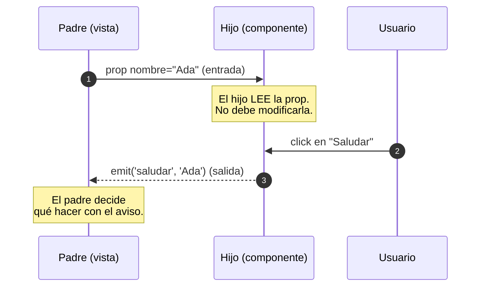
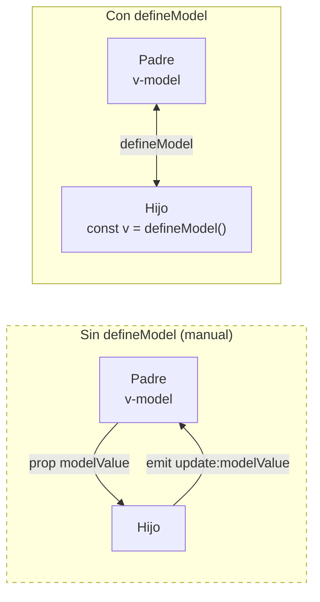
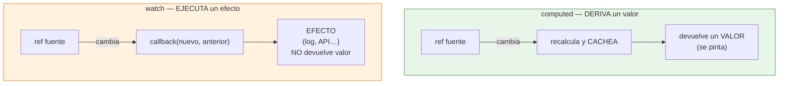
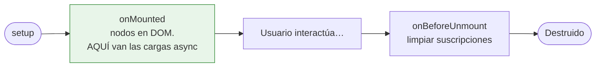

# Sesión 11: Componentes y comunicación

<!-- [[toc]] -->

::: info CONTEXTO
Hasta ahora hemos trabajado con componentes sueltos, directivas y listas. En esta sesión damos dos saltos:

1. **Derivar datos** con `computed` en lugar de repetir cálculos a mano.
2. **Partir una vista en varios componentes** que colaboran entre sí.

Vamos a ir **de menos a más**, con un concepto por apartado y su demo en la aplicación. No hace falta memorizar APIs: basta con entender _cuándo_ usar cada herramienta.

**Al terminar esta sesión sabrás:**

- Calcular valores derivados con `computed` (y por qué es mejor que un método).
- Pasar datos de padre a hijo con **Props**.
- Enviar eventos de hijo a padre con **Emits** — la regla _"los datos bajan, los eventos suben"_.
- Simplificar el `v-model` de un componente con **`defineModel`**.
- Reaccionar a un cambio con **`watch`** (efectos secundarios).
- Cargar datos al montar con **`onMounted` + `async/await`**.
- Reutilizar estructura visual con **slots**.
  :::

## Plan de sesión (90 min) {#plan-90}

| Bloque               | Tiempo | Contenido                                                               |
| -------------------- | ------ | ----------------------------------------------------------------------- |
| **Teoría guiada**    | 50 min | 3.1 a 3.9 (computed, props/emits, defineModel, watch, onMounted, slots) |
| **Práctica en aula** | 25 min | Ejercicio 1 (tras Emits) + Ejercicio 2 (cierre)                         |
| **Test de sesión**   | 10 min | Preguntas de consolidación                                              |
| **Cierre**           | 5 min  | Conclusiones y puente a la sesión 12                                    |

::: tip ENFOQUE DIDÁCTICO
La meta no es ver "todo lo que existe", sino **decidir bien**: `computed` para derivar, props/emits para comunicar, `watch` para efectos y slots para estructura. Lo avanzado de cada tema queda recogido en bloques `Ver más` plegables, para quien quiera profundizar.
:::

## 3.1 El punto de partida: de una función a un `computed` {#arranque}

En la [sesión especial del TODO](../sesion-10b-especial-todo/) terminamos con un contador de pendientes resuelto como **función**:

```html
<script setup lang="ts">
  import { ref } from "vue";

  interface ITarea {
    id: number;
    texto: string;
    hecha: boolean;
  }

  const tareas = ref<ITarea[]>([
    /* … */
  ]);

  // Función: se ejecuta CADA vez que el template la invoca.
  function pendientes(): number {
    return tareas.value.filter((t) => !t.hecha).length;
  }
</script>

<template>
  <p>{{ pendientes() }} tareas pendientes</p>
</template>
```

Funciona, pero tiene un detalle: `pendientes()` se **vuelve a ejecutar en cada render**, aunque las tareas no hayan cambiado. La herramienta correcta para "un valor que se calcula a partir de otros datos reactivos" es **`computed`**.

Antes de verlo, fijémonos en la sintaxis que vamos a usar dentro de `computed`, porque aparece por todas partes en Vue: la **función anónima _arrow_**.

### Un paréntesis: la sintaxis `() => …` {#arrow-functions}

Una **función anónima** es una función **sin nombre** que se define justo donde se usa, normalmente como argumento de otra función. La forma moderna de escribirla es la **_arrow function_** (función flecha):

```typescript
() => tareas.value.filter((t) => !t.hecha).length;
//↑    ↑
//│    └─ cuerpo: lo que devuelve (sin 'return' al no llevar llaves)
//└────── () = parámetros (aquí, ninguno);  => = "va a"
```

- `()` → los **parámetros** (en este caso, ninguno).
- `=>` → el operador flecha, se lee _"va a"_.
- A la derecha, el **cuerpo**. Si es **una sola expresión** (sin llaves), su resultado se **devuelve automáticamente**. Si usas llaves `{ … }`, dentro escribes `return` como en una función normal.

Cuando hacemos `computed(() => …)`, le estamos **pasando una función** a `computed` como argumento. La clave es que **pasamos la función, no su resultado**: `computed` se guarda esa función y la ejecuta _él_ cuando le convenga (cuando cambien las dependencias).

::: tip PASAR LA FUNCIÓN, NO LLAMARLA
Hay tres formas equivalentes de escribir lo mismo. En las tres se pasa la función **sin paréntesis de llamada**:

```typescript
// 1) Anónima arrow (la habitual): se define y se pasa en el mismo sitio.
const pendientes = computed(() => tareas.value.filter((t) => !t.hecha).length);

// 2) Función nombrada tradicional, pasada por su nombre.
function contar(): number {
  return tareas.value.filter((t) => !t.hecha).length;
}
const pendientes = computed(contar); // 'contar', NO 'contar()'

// 3) Arrow nombrada, también pasada por su nombre.
const contar = () => tareas.value.filter((t) => !t.hecha).length;
const pendientes = computed(contar); // 'contar', NO 'contar()'
```

Si escribieras `computed(contar())` con paréntesis, JavaScript ejecutaría `contar` **en ese instante** y le pasaría a `computed` un número fijo, no una función que recalcular. Por eso se pasa la **referencia** (`contar`), no la llamada (`contar()`).
:::

Con esto, ya podemos leer la versión con `computed`:

```html
<script setup lang="ts">
  import { ref, computed } from "vue";

  interface ITarea {
    id: number;
    texto: string;
    hecha: boolean;
  }

  const tareas = ref<ITarea[]>([
    /* … */
  ]);

  // computed: Vue lo recalcula SOLO cuando cambia 'tareas', y entre
  // medias devuelve el valor cacheado. Además, se usa SIN paréntesis.
  const pendientes = computed(
    () => tareas.value.filter((t) => !t.hecha).length,
  );
</script>

<template>
  <!-- Sin paréntesis: pendientes es un valor, no una llamada. -->
  <p>{{ pendientes }} tareas pendientes</p>
</template>
```

::: tip QUÉ HA CAMBIADO

- `function pendientes()` → `const pendientes = computed(() => …)`.
- En el template, `pendientes()` → `pendientes` (sin paréntesis).
- Vue ahora **cachea** el resultado y solo lo recalcula cuando cambian las tareas.

Este es el patrón que vamos a generalizar en toda la sesión: **si un valor se muestra en pantalla y depende de datos reactivos, casi siempre es un `computed`**.
:::

## 3.2 Propiedades computadas (`computed`) {#computed}

Una `computed` es un valor que se **calcula automáticamente** a partir de otros datos reactivos. La demo `Sesion8Computed.vue` lo ilustra con el cálculo del IVA:

```html
<script setup lang="ts">
  import { ref, computed } from "vue";

  const precioBase = ref<number>(100);
  const tipoIva = ref<number>(21);

  // computed: valor derivado, reactivo y cacheado. Cuando cambia
  // 'precioBase' o 'tipoIva', Vue recalcula solo lo afectado.
  const ivaImporte = computed(() => (precioBase.value * tipoIva.value) / 100);
  const precioTotal = computed(() => precioBase.value + ivaImporte.value);
</script>

<template>
  <input v-model.number="precioBase" type="number" />
  <input v-model.number="tipoIva" type="number" />
  <!-- Las computed se interpolan sin paréntesis. -->
  <p>
    IVA: {{ ivaImporte.toFixed(2) }} € · Total: {{ precioTotal.toFixed(2) }} €
  </p>
</template>
```

> Fichero real: `ClientApp/src/views/sesiones-vue/sesion-8/Sesion8Computed.vue`. Fíjate en que `precioTotal` depende de `ivaImporte`, que a su vez es otra `computed`: **encadenar computed es válido y eficiente**, Vue solo recalcula las afectadas por el cambio.

### `computed` vs método

| Aspecto         | `computed`                                           | Método                                         |
| --------------- | ---------------------------------------------------- | ---------------------------------------------- |
| **Cacheo**      | Sí, según dependencias                               | No (se ejecuta en cada llamada)                |
| **Cuándo usar** | Valores derivados que se muestran                    | Acciones del usuario o cálculos con parámetros |
| **Ejemplo**     | Total de horas, filtro de recursos, nº de pendientes | `guardar()`, `eliminar(id)`                    |

::: tip CRITERIO RÁPIDO

- ¿Produce un **valor** que se pinta y no tiene efectos secundarios? → `computed`.
- ¿Dispara una **acción** (guardar, borrar, enviar)? → método.
  :::

::: details Ver más · `computed` con setter (avanzado)
Una `computed` normal es de solo lectura. Si necesitas que también sea **escribible** (por ejemplo, un `v-model` que al cambiar actualice otra variable), se le añade un `get` y un `set`:

```html
<script setup lang="ts">
  import { computed } from "vue";
  // … precioBase, tipoIva, precioTotal como arriba

  const precioRedondeado = computed({
    get: () => Math.round(precioTotal.value * 100) / 100,
    set: (nuevo) => {
      // Operación inversa: al fijar el redondeado, recalcula la base.
      precioBase.value = nuevo / (1 + tipoIva.value / 100);
    },
  });
</script>
```

Está en `Sesion8Computed.vue`. Úsalo solo cuando tengas una "operación inversa" clara; en la mayoría de casos basta con la `computed` de solo lectura.
:::

## 3.3 `computed` en formularios: entrada → derivado → acción {#formularios}

Donde más se usa `computed` es en **formularios**: para decidir si el botón puede pulsarse, normalizar lo que escribe el usuario o mostrar un mensaje de validación. Conviene separar tres papeles:

1. **Entrada** (`ref`) — lo que escribe el usuario.
2. **Derivado** (`computed`) — lo que sale de esa entrada (válido/no válido, normalizado…).
3. **Acción** (función) — lo que se ejecuta al pulsar enviar.

```html
<script setup lang="ts">
  import { ref, computed } from "vue";

  // 1) Entrada: el texto crudo del input.
  const texto = ref<string>("");

  // 2) Derivados: dos computed que dependen del mismo ref.
  const textoNormalizado = computed(() => texto.value.trim());
  const puedeEnviar = computed(() => textoNormalizado.value.length >= 3);

  // 3) Acción: se invoca al pulsar el botón o Enter.
  const guardar = (): void => {
    if (!puedeEnviar.value) return; // protección extra
    console.log("Guardado:", textoNormalizado.value);
    texto.value = "";
  };
</script>

<template>
  <input
    v-model="texto"
    @keyup.enter="guardar"
    placeholder="Mínimo 3 caracteres"
  />
  <!-- El botón se deshabilita solo, sin escribir lógica en el template. -->
  <button :disabled="!puedeEnviar" @click="guardar">Guardar</button>
  <small v-if="!puedeEnviar"
    >Escribe al menos 3 caracteres (sin contar espacios).</small
  >
</template>
```

::: info ESTE ES EL ESCALÓN, NO EL DESTINO
Este patrón vale para un formulario aislado. Cuando el formulario llame a una **API real**, la entrada y los derivados se quedan aquí, pero la acción se moverá a un **servicio HTTP** y el estado compartido a un **composable**. Esa arquitectura es la [sesión 12](../sesion-12-arquitectura-apis/).
:::

## 3.4 Un componente es como una función {#props}

Esta es la idea más importante de la sesión, así que vamos despacio. Cuando una vista crece, la partimos en **componentes** más pequeños. Para entender cómo se comunican, piensa en un componente como en una **función** de cualquier lenguaje de programación:

| En una función… | …en un componente Vue |
| ---------------- | --------------------- |
| **Parámetros** de entrada | **Props** (datos que recibe del padre) |
| Cuerpo que opera con ellos | `<script setup>` + `<template>` |
| Valor de **retorno** / aviso de salida | **Emits** (eventos que manda al padre) |

```text
function saludo(nombre) { … }   ⇄   <SaludoNombre :nombre="…" @saludar="…" />
//              ▲ parámetro (entrada)              ▲ prop        ▲ emit
//                                                 (entrada)     (salida)
```

La regla que gobierna toda la comunicación en Vue:



<!-- diagram id="s11-props-emits" caption: "Los datos bajan por props; los avisos suben por emits" -->

**Los datos bajan por props; los avisos suben por emits.** En este apartado vemos solo la entrada (props); la salida (emits) llega en §3.5.

### Props: los "parámetros" del componente

Empecemos por el caso más simple posible: un hijo que **solo muestra un nombre** que le pasa el padre. El hijo no tiene el nombre; se lo dan, igual que un parámetro.

**Hijo** (`SaludoNombre.vue`) — declara la prop con `defineProps` y la pinta:

```html
<script setup lang="ts">
  // defineProps declara los "parámetros" que este componente acepta.
  defineProps<{
    nombre: string;
  }>();
</script>

<template>
  <!-- La prop se interpola igual que un ref local. -->
  <p class="fs-4">Hola, <strong>{{ nombre }}</strong> 👋</p>
</template>
```

**Padre** (`Sesion8Props.vue`) — le pasa el nombre. Hay **dos formas**, y la diferencia es clave:

```html
<script setup lang="ts">
  import { ref } from "vue";
  import SaludoNombre from "./SaludoNombre.vue";

  const nombre = ref("Ada");
</script>

<template>
  <!-- Sin ':' → LITERAL. El hijo recibe la cadena "Grace" tal cual. -->
  <SaludoNombre nombre="Grace" />

  <!-- Con ':' → VARIABLE. El hijo recibe el valor de 'nombre'. -->
  <input v-model="nombre" />
  <SaludoNombre :nombre="nombre" />
</template>
```

::: tip EL PADRE CAMBIA, EL HIJO SE ACTUALIZA SOLO
Escribe en el `<input>` y verás que el saludo cambia en vivo, sin avisar al hijo a mano: **las props son reactivas**. Cuando la variable del padre cambia, Vue vuelve a pintar el hijo con el nuevo valor. El hijo solo **lee** la prop; nunca toca la variable del padre.
:::

::: info VISTA vs COMPONENTE HIJO — ¿cómo se llega a cada uno?
Dos componentes, dos formas de invocarlos:

- `SaludoNombre.vue` es un **componente hijo**: no se navega a él por URL. Lo **importa su padre** con `import SaludoNombre from "./SaludoNombre.vue"` y lo usa en su `<template>`. Es como llamar a una función desde otra.
- `Sesion8Props.vue` (el padre) es una **vista**: una página completa a la que se llega por **URL**. Toda vista se engancha al router con **dos líneas** en `router.ts`:

```ts
// 1) Import del componente de vista.
import Sesion8Props from "@/views/sesiones-vue/sesion-8/Sesion8Props.vue";

// 2) Ruta que lo asocia a una URL.
{ path: APP_DIR + "/sesiones-vue/sesion-8/props", name: "Sesion8Props", component: Sesion8Props },
```

A partir de ahí, navegar a `…/sesiones-vue/sesion-8/props` muestra esa vista. Recordaremos estas dos líneas (import + ruta) cada vez que aparezca una vista nueva.
:::

::: warning LOS PROPS SON DE SOLO LECTURA
Nunca modifiques un prop dentro del hijo (`props.nombre = 'otro'` es un error). Si el hijo necesita cambiar un valor del padre, usa **Emits** (§3.5) o **`defineModel`** (§3.6).
:::

> Ficheros reales: `ClientApp/src/views/sesiones-vue/sesion-8/Sesion8Props.vue` + `SaludoNombre.vue`. Demo navegable en `/uareservas/sesiones-vue/sesion-8/props`.

::: details Ver más · Props con valor por defecto (`withDefaults`)
Si una prop es opcional y quieres un valor por defecto:

```typescript
interface Props {
  titulo: string;
  activo?: boolean;
}
const props = withDefaults(defineProps<Props>(), {
  activo: true,
});
```

:::

## 3.5 Comunicación hijo → padre: Emits {#emits}

Si las props son los **parámetros de entrada**, los emits son la **salida**: el hijo **no modifica** al padre, le **avisa** emitiendo un evento, y el padre decide qué hacer. Los eventos se declaran con `defineEmits`.

### Lo más simple: el hijo emite su propio nombre

Ampliamos `SaludoNombre.vue` con un botón "Saludar". Al pulsarlo, el hijo **emite su propio nombre**. Como cada instancia recibe un `nombre` distinto, el padre sabrá exactamente **quién** ha saludado.

**Hijo** (`SaludoNombre.vue`) — añade el emit:

```html
<script setup lang="ts">
  // Guardamos las props en 'props' para poder leerlas dentro de una función.
  const props = defineProps<{ nombre: string }>();

  // Declarar el evento y el tipo de su dato (payload).
  const emit = defineEmits<{
    (e: "saludar", origen: string): void;
  }>();

  function saludar(): void {
    // Emite SU nombre: cada instancia manda uno distinto.
    emit("saludar", props.nombre);
  }
</script>

<template>
  <p class="fs-4">Hola, <strong>{{ nombre }}</strong> 👋</p>
  <button @click="saludar">Saludar</button>
</template>
```

**Padre** (`Sesion8PropsEmits.vue`) — escucha `@saludar`, guarda quién fue y un `watch` lo registra en consola:

```html
<script setup lang="ts">
  import { ref, watch } from "vue";
  import SaludoNombre from "./SaludoNombre.vue";

  // El padre guarda quién ha saludado el último.
  const ultimoSaludo = ref("");

  // El handler recibe el dato del emit (el nombre) y lo guarda.
  function onSaludar(origen: string): void {
    ultimoSaludo.value = origen;
  }

  // Un watch reacciona al cambio y hace el efecto: un console.log.
  watch(ultimoSaludo, (nuevo) => {
    console.log(`[emit] Ha saludado: ${nuevo}`);
  });
</script>

<template>
  <!-- nombre: prop (baja). @saludar: emit (sube). -->
  <SaludoNombre nombre="Ada" @saludar="onSaludar" />
  <SaludoNombre nombre="Linus" @saludar="onSaludar" />

  <p>Último en saludar: <strong>{{ ultimoSaludo || "(nadie todavía)" }}</strong></p>
</template>
```

::: tip TRES PIEZAS QUE SE ENCADENAN
Fíjate en el recorrido completo del aviso: **emit** (el hijo lanza el evento) → **handler `@saludar`** (el padre lo recibe y guarda el dato) → **`watch`** (reacciona al cambio y ejecuta el efecto). Abre la consola del navegador (F12) y verás el `console.log` cada vez que pulses "Saludar". El `watch` lo veremos a fondo en §3.7; aquí basta con ver que un emit puede acabar disparando un efecto.
:::

### El mismo patrón con estado local: el contador

El nombre es un dato que **viene del padre**. Pero un hijo también puede tener **estado propio** y emitir su valor. La demo lo muestra con `TarjetaContador.vue`: cada instancia guarda su propio número y emite `cambio` al cambiarlo.

```html
<!-- TarjetaContador.vue (hijo) -->
<script setup lang="ts">
  import { ref } from "vue";

  defineProps<{ titulo: string }>();
  const emit = defineEmits<{ (e: "cambio", valor: number): void }>();

  // Estado LOCAL del hijo. Cada instancia tiene el suyo.
  const contador = ref(0);

  function incrementar(): void {
    contador.value++;
    emit("cambio", contador.value); // avisa con el nuevo valor
  }
</script>
```

```html
<!-- Sesion8PropsEmits.vue (padre) -->
<template>
  <!-- $event lleva el dato del emit; lo envolvemos para añadir el origen. -->
  <TarjetaContador titulo="Contador A" @cambio="onCambio('Contador A', $event)" />
  <TarjetaContador titulo="Contador B" @cambio="onCambio('Contador B', $event)" />
</template>
```

> Ficheros reales: `ClientApp/src/views/sesiones-vue/sesion-8/SaludoNombre.vue` + `TarjetaContador.vue` + `Sesion8PropsEmits.vue`. Cada hijo tiene su propia identidad (su nombre, su contador): Vue **no comparte estado** entre instancias del mismo componente, y el padre solo se entera de los cambios porque el hijo los emite.

## Ejercicio 1: dos contadores {#ejercicio-1}

::: info ENUNCIADO
Practica Props y Emits con un caso mínimo: un componente hijo `TarjetaContador` y un padre que **suma** los valores de dos tarjetas con un `computed`.

**Resultado esperado:** dos tarjetas contador y, debajo, la suma de ambas actualizándose en vivo.
:::

1. Usa el `TarjetaContador.vue` de la demo (prop `titulo` + emit `cambio`).
2. En el padre, guarda `valorA` y `valorB` como `ref`, actualizados al recibir `@cambio`.
3. Muestra `suma` como `computed(() => valorA + valorB)`.

::: details Solución Ejercicio 1

```html
<!-- PadreContadores.vue -->
<script setup lang="ts">
  import { ref, computed } from "vue";
  import TarjetaContador from "./TarjetaContador.vue";

  const valorA = ref(0);
  const valorB = ref(0);

  // Estado derivado: la suma se recalcula sola cuando cambia A o B.
  const suma = computed(() => valorA.value + valorB.value);
</script>

<template>
  <div class="row g-3">
    <div class="col-md-6">
      <TarjetaContador titulo="Contador A" @cambio="valorA = $event" />
    </div>
    <div class="col-md-6">
      <TarjetaContador titulo="Contador B" @cambio="valorB = $event" />
    </div>
  </div>

  <p class="fs-4 mt-3">Suma: <strong>{{ suma }}</strong></p>
</template>
```

:::

## 3.6 `defineModel`: `v-model` sobre un componente {#define-model}

Props + Emits funciona, pero para la comunicación bidireccional típica de un `v-model` es repetitivo. **`defineModel`** (Vue 3.4+) lo resume en una línea: el padre usa `v-model` sobre el hijo como si fuera un `<input>` nativo.



<!-- diagram id="s11-define-model" caption: "defineModel resume prop + emit en una sola declaración bidireccional" -->

La demo `Sesion8DefineModel.vue` usa `InputEditable.vue` (un input con etiqueta y botón "Limpiar"):

```html
<!-- InputEditable.vue (hijo) -->
<script setup lang="ts">
  // defineModel reemplaza a defineProps({ modelValue }) + defineEmits('update:modelValue').
  const valor = defineModel<string>({ required: true });

  defineProps<{ etiqueta: string }>();

  function limpiar(): void {
    valor.value = "";
  }
</script>

<template>
  <div class="input-group">
    <span class="input-group-text">{{ etiqueta }}</span>
    <input v-model="valor" type="text" class="form-control" />
    <button class="btn btn-outline-secondary" type="button" @click="limpiar">
      Limpiar
    </button>
  </div>
</template>
```

```html
<!-- Sesion8DefineModel.vue (padre) -->
<script setup lang="ts">
  import { ref } from "vue";
  import InputEditable from "./InputEditable.vue";

  const nombre = ref("");
  const apellido = ref("Lovelace");
</script>

<template>
  <InputEditable v-model="nombre" etiqueta="Nombre" />
  <InputEditable v-model="apellido" etiqueta="Apellido" />
  <p>Hola, <strong>{{ nombre }} {{ apellido }}</strong></p>
</template>
```

> Ficheros reales: `ClientApp/src/views/sesiones-vue/sesion-8/Sesion8DefineModel.vue` + `InputEditable.vue`.

::: tip CUÁNDO USAR CADA PATRÓN

- Solo lectura (padre → hijo) → **`defineProps`**.
- Aviso del hijo al padre → **`defineEmits`**.
- Edición compartida del mismo dato (`v-model`) → **`defineModel`**.
  :::

::: details Ver más · toggle y varios v-model

```html
<!-- defineModel booleano para un toggle -->
<script setup lang="ts">
  const activo = defineModel<boolean>({ default: false });
</script>
<template>
  <button @click="activo = !activo">
    {{ activo ? 'Encendido' : 'Apagado' }}
  </button>
</template>
```

```html
<!-- Varios v-model con nombre -->
<script setup lang="ts">
  const nombre = defineModel<string>("nombre");
  const apellido = defineModel<string>("apellido");
</script>
<!-- En el padre: <FormularioNombre v-model:nombre="n" v-model:apellido="a" /> -->
```

:::

## 3.7 `watch`: reaccionar a un cambio {#watch}

`computed` **deriva un valor**. `watch` **ejecuta un efecto** cuando algo cambia (guardar en almacenamiento, registrar un log, llamar a una API…). No devuelve nada.



<!-- diagram id="s11-computed-vs-watch" caption: "computed deriva y cachea; watch reacciona a un cambio para ejecutar un efecto" -->

La demo `Sesion8Watchers.vue` observa un input de búsqueda y registra cada cambio:

```html
<script setup lang="ts">
  import { ref, watch } from "vue";

  const consulta = ref("");
  const eventos = ref<string[]>([]);

  // Primer argumento: la FUENTE (el ref a observar).
  // El callback recibe el valor NUEVO y el ANTERIOR.
  watch(consulta, (nuevo, anterior) => {
    eventos.value.unshift(`'${anterior}' -> '${nuevo}'`);
    if (eventos.value.length > 6) eventos.value.pop();
  });
</script>

<template>
  <input
    v-model="consulta"
    class="form-control"
    placeholder="Empieza a escribir…"
  />
  <ul class="list-group mt-3">
    <li v-for="(e, i) in eventos" :key="i" class="list-group-item">{{ e }}</li>
  </ul>
</template>
```

> Fichero real: `ClientApp/src/views/sesiones-vue/sesion-8/Sesion8Watchers.vue`. Si el efecto fuera una llamada a una API (autocompletar al teclear), habría que añadir _debounce_ o cancelación: cada tecla dispara el `watch`.

::: warning NO USES `watch` PARA DERIVAR
Si te encuentras con un `watch` que cambia otro `ref` para "mantenerlo sincronizado" con el primero, eso casi siempre debería ser un `computed`. Usa `watch` solo para **efectos**.
:::

::: details Ver más · `deep`, `immediate` y `watchEffect`

```typescript
// Observar objetos anidados y disparar ya en el primer render:
watch(recurso, (nuevo) => console.log(nuevo), { deep: true, immediate: true });
```

`watchEffect` detecta solas sus dependencias (lo que lee dentro) y se ejecuta al montar. En el código de la UA aparece poco; la mayoría de casos se resuelven con `watch` explícito. La demo `Sesion8Watchers.vue` muestra los dos lado a lado.
:::

## 3.8 `onMounted` y carga asíncrona {#onmounted}

Vue ejecuta ciertas funciones en momentos concretos de la vida del componente. El hook que más usarás es **`onMounted`**: se ejecuta una sola vez, cuando el componente ya está en el DOM. Es el sitio para **lanzar la carga inicial** de datos.



<!-- diagram id="s11-lifecycle" caption: "Los tres momentos del ciclo de vida que de verdad usarás" -->

La demo `Sesion8Lifecycle.vue` simula la espera de una API con `setTimeout`:

```html
<script setup lang="ts">
  import { ref, onMounted } from "vue";

  interface IRecurso {
    id: number;
    nombre: string;
  }

  // Los dos refs típicos de cualquier listado (un tercero, 'error',
  // se añade en la sesión 12 al manejar fallos de la API).
  const recursos = ref<IRecurso[]>([]);
  const cargando = ref(false);

  async function cargar(): Promise<void> {
    cargando.value = true;
    try {
      // En producción: await apiRecursos.listar() (servicio — sesión 12).
      await new Promise((r) => setTimeout(r, 1500)); // simula latencia
      recursos.value = [
        { id: 1, nombre: "Aula 12" },
        { id: 2, nombre: "Sala reuniones A" },
        { id: 3, nombre: "Proyector" },
      ];
    } finally {
      cargando.value = false; // baja el spinner, falle o no
    }
  }

  // onMounted dispara la carga una vez, con el componente ya en el DOM.
  onMounted(() => {
    void cargar();
  });
</script>

<template>
  <button :disabled="cargando" @click="cargar">Recargar</button>
  <p v-if="cargando">Cargando…</p>
  <ul v-else>
    <li v-for="r in recursos" :key="r.id">{{ r.nombre }}</li>
  </ul>
</template>
```

> Fichero real: `ClientApp/src/views/sesiones-vue/sesion-8/Sesion8Lifecycle.vue`. Allí, en lugar del `<p v-if="cargando">`, el spinner es el componente **`<SpinnerModal v-model:visible="cargando">`** de `@vueua/components`: una sola variable `cargando` gobierna a la vez el modal, el `:disabled` del botón y el `v-if` de la lista.

::: tip BUENA PRÁCTICA

- `onMounted` **no** se vuelve a ejecutar al pulsar "Recargar": por eso la carga se encapsula en una función reutilizable (`cargar()`).
- Usa siempre `try/finally` en operaciones asíncronas que afecten a la UI. El `finally` es lo único que garantiza bajar el spinner aunque la API falle.
  :::

::: info HACIA LA SESIÓN 12
Cuando este código crezca (varias vistas listan recursos, hay crear/editar/eliminar, hace falta manejar errores…), `cargar()` y los refs (`recursos`, `cargando`, `error`) se moverán a un **composable** (`useRecursos.ts`) y la llamada HTTP a un **servicio** (`apiRecursos.ts`). El `.vue` se queda muy corto. Es el tema de la [sesión 12](../sesion-12-arquitectura-apis/).
:::

## 3.9 Slots: estructura visual reutilizable {#slots}

Los **slots** son "huecos" que el padre rellena con el contenido que quiera. Permiten crear componentes visuales reutilizables sin inventar veinte props. La demo `Sesion8Slots.vue` usa `TarjetaUA.vue` con tres slots:

```html
<!-- TarjetaUA.vue (hijo) -->
<template>
  <div class="card border-primary mb-3">
    <div class="card-header bg-primary text-white">
      <slot name="cabecera"><em>Tarjeta sin título</em></slot>
    </div>
    <div class="card-body">
      <slot><p class="text-muted mb-0">Tarjeta sin contenido.</p></slot>
    </div>
    <div class="card-footer text-end">
      <slot name="acciones" />
    </div>
  </div>
</template>
```

```html
<!-- Sesion8Slots.vue (padre) -->
<TarjetaUA>
  <template #cabecera>🗓️ Reserva confirmada</template>

  <p>
    <strong>Recurso:</strong> Aula 12<br /><strong>Fecha:</strong> 16/05/2026 —
    10:00 a 12:00
  </p>

  <template #acciones>
    <button class="btn btn-sm btn-outline-secondary me-2">Editar</button>
    <button class="btn btn-sm btn-danger">Eliminar</button>
  </template>
</TarjetaUA>
```

> Ficheros reales: `ClientApp/src/views/sesiones-vue/sesion-8/Sesion8Slots.vue` + `TarjetaUA.vue`. Cada slot puede tener un _fallback_ (el contenido por defecto cuando el padre no rellena ese hueco). Cuando veas `<DialogModal>` en la [sesión 13](../sesion-13-componentes-ua/), sus slots `#header / #body / #buttons` son exactamente este patrón.

## 3.10 Criterio de elección {#criterio}

| Situación                                       | Opción recomendada | Evitar                                               |
| ----------------------------------------------- | ------------------ | ---------------------------------------------------- |
| Mostrar un total, filtro o contador en pantalla | `computed`         | Recalcular en varios sitios con funciones duplicadas |
| El hijo avisa de una acción al padre            | `defineEmits`      | Modificar props directamente                         |
| Padre e hijo editan el mismo dato               | `defineModel`      | Duplicar estado en ambos                             |
| Reaccionar a un cambio para guardar/log/API     | `watch`            | Meter efectos dentro de un `computed`                |
| Compartir estructura visual flexible            | `slots`            | Multiplicar props para lo que es estructura          |

::: tip TRES PREGUNTAS PARA DECIDIR RÁPIDO

1. ¿Es un **valor derivado** que se muestra? → `computed`.
2. ¿Es un **efecto secundario**? → `watch`.
3. ¿Es **comunicación entre componentes**? → props/emits o `defineModel`.

Y si dudas entre dos enfoques, elige el que deje **una única fuente de verdad** del estado.
:::

> `provide`/`inject` (compartir datos sin pasar props por cada nivel) y Pinia se ven más adelante, en la [sesión 17 — Estado global y persistencia](../../../05-avanzadas/sesiones/sesion-20-estado-persistencia/). No es el primer mecanismo que conviene aprender.

## 3.11 Pruébalo en el proyecto {#sandbox}

En `uaReservas/ClientApp/src/views/sesiones-vue/sesion-8/` hay varias demos navegables. Arranca la app (`pnpm local`) y entra en `/uareservas/sesiones-vue/sesion-8`:

| Demo                           | Concepto que ilustra                                                  | Fichero                                                  |
| ------------------------------ | --------------------------------------------------------------------- | -------------------------------------------------------- |
| `Sesion8Computed.vue`          | `computed` con dependencias (IVA)                                     | `sesion-8/Sesion8Computed.vue`                           |
| `Sesion8Props.vue`             | Padre → hijo (`nombre`): literal vs variable reactiva                 | `sesion-8/Sesion8Props.vue` + `SaludoNombre.vue`         |
| `Sesion8PropsEmits.vue`        | Hijo → padre: emite su nombre (`@saludar` + `watch`) y el contador    | `sesion-8/Sesion8PropsEmits.vue` + `SaludoNombre.vue` + `TarjetaContador.vue` |
| `Sesion8DefineModel.vue`       | `v-model` sobre un componente (`InputEditable`)                       | `sesion-8/Sesion8DefineModel.vue` + `InputEditable.vue`  |
| `Sesion8Watchers.vue`          | `watch` (y `watchEffect`) con historial visible                       | `sesion-8/Sesion8Watchers.vue`                           |
| `Sesion8Lifecycle.vue`         | `onMounted` + carga async + `Modal` de la UA                          | `sesion-8/Sesion8Lifecycle.vue`                          |
| `Sesion8Slots.vue`             | Tres slots con _fallback_ en `TarjetaUA`                              | `sesion-8/Sesion8Slots.vue` + `TarjetaUA.vue`            |
| `Sesion8FormularioReserva.vue` | **Integradora**: `computed` + `defineModel` + slots (sin API todavía) | `sesion-8/Sesion8FormularioReserva.vue`                  |

::: tip LA DEMO INTEGRADORA
`Sesion8FormularioReserva.vue` lo reúne todo: `puedeReservar` es un `computed` que habilita el botón solo si los tres campos son válidos, `InputEditable` usa `defineModel` y `TarjetaUA` aporta la estructura con slots. Cuando en la sesión 13 cambies `TarjetaUA` por `DialogModal`, el resto del código apenas se toca.
:::

::: details Demos adicionales (avanzado, opcional)

- `Sesion8PropsEmitsModal.vue`: compara la API **declarativa** (`v-model:visible`) con la **imperativa** (`ref + show()`) de `PopUpModal`. Es material de la sesión 13; déjalo para cuando domines props/emits.
  :::

---

## Ejercicio 2: lista de reservas con resumen {#ejercicio-2}

::: info ENUNCIADO
Une lo de hoy con lo de la sesión anterior: una lista de reservas (que ya sabes construir) más una **tarjeta de resumen** calculada con `computed` y mostrada por un **componente hijo** que recibe los totales por props.

**Resultado esperado:** una lista donde puedes añadir, confirmar (checkbox) y eliminar reservas, y una tarjeta que muestra en vivo _cuántas hay, cuántas confirmadas y cuántas horas suman_.
:::

**Objetivo:** practicar `computed` (derivar los totales) + Props (pasarlos a un hijo).

1. `IReserva { id, recurso, horas, confirmada }` y un array inicial.
2. Añadir / confirmar / eliminar reservas (como en la [sesión 10](../sesion-10-directivas-eventos/)).
3. `computed`: `total`, `confirmadas`, `horasTotales`.
4. Un hijo `TarjetaResumen.vue` que recibe esos tres números por props y los pinta.

::: details Solución Ejercicio 2

```html
<!-- TarjetaResumen.vue (hijo) -->
<script setup lang="ts">
  // Solo recibe datos y los muestra. No tiene estado propio.
  defineProps<{
    total: number;
    confirmadas: number;
    horasTotales: number;
  }>();
</script>

<template>
  <div class="card border-primary">
    <div class="card-header bg-primary text-white">Resumen</div>
    <ul class="list-group list-group-flush">
      <li class="list-group-item d-flex justify-content-between">
        <span>Reservas</span><strong>{{ total }}</strong>
      </li>
      <li class="list-group-item d-flex justify-content-between">
        <span>Confirmadas</span><strong>{{ confirmadas }}</strong>
      </li>
      <li class="list-group-item d-flex justify-content-between">
        <span>Horas totales</span><strong>{{ horasTotales }} h</strong>
      </li>
    </ul>
  </div>
</template>
```

```html
<!-- ListaReservasResumen.vue (padre) -->
<script setup lang="ts">
  import { ref, computed } from "vue";
  import TarjetaResumen from "./TarjetaResumen.vue";

  interface IReserva {
    id: number;
    recurso: string;
    horas: number;
    confirmada: boolean;
  }

  const reservas = ref<IReserva[]>([
    { id: 1, recurso: "Aula 12", horas: 2, confirmada: false },
    { id: 2, recurso: "Sala reuniones A", horas: 1, confirmada: true },
  ]);

  const nuevoRecurso = ref("");
  let proximoId = 100;

  function anadir(): void {
    const limpio = nuevoRecurso.value.trim();
    if (!limpio) return;
    reservas.value.push({
      id: proximoId++,
      recurso: limpio,
      horas: 1,
      confirmada: false,
    });
    nuevoRecurso.value = "";
  }

  function borrar(id: number): void {
    reservas.value = reservas.value.filter((r) => r.id !== id);
  }

  // Tres valores derivados: se recalculan solos al añadir, confirmar o borrar.
  const total = computed(() => reservas.value.length);
  const confirmadas = computed(
    () => reservas.value.filter((r) => r.confirmada).length,
  );
  const horasTotales = computed(() =>
    reservas.value.reduce((s, r) => s + r.horas, 0),
  );
</script>

<template>
  <div class="row g-3">
    <div class="col-md-8">
      <div class="input-group mb-3">
        <input
          v-model="nuevoRecurso"
          class="form-control"
          placeholder="Recurso a reservar (pulsa Enter)"
          @keyup.enter="anadir"
        />
        <button class="btn btn-primary" @click="anadir">Añadir</button>
      </div>

      <ul class="list-group">
        <li
          v-for="reserva in reservas"
          :key="reserva.id"
          class="list-group-item d-flex align-items-center gap-2"
        >
          <input
            v-model="reserva.confirmada"
            type="checkbox"
            class="form-check-input mt-0"
          />
          <span
            class="flex-grow-1"
            :class="{ 'text-success fw-bold': reserva.confirmada }"
          >
            {{ reserva.recurso }} ({{ reserva.horas }}h)
          </span>
          <button
            class="btn btn-sm btn-outline-danger"
            @click="borrar(reserva.id)"
          >
            Borrar
          </button>
        </li>
        <li
          v-if="reservas.length === 0"
          class="list-group-item text-center text-muted"
        >
          No hay reservas.
        </li>
      </ul>
    </div>

    <div class="col-md-4">
      <!-- Los totales (computed) bajan al hijo por props. -->
      <TarjetaResumen
        :total="total"
        :confirmadas="confirmadas"
        :horas-totales="horasTotales"
      />
    </div>
  </div>
</template>
```

:::

## Tarea progresiva del proyecto final {#tarea-pf}

::: tip PIENSA EN TUS PRÓXIMOS COMPONENTES
Lo de hoy te da las piezas para componentes que montarás en los módulos 3 y 4 del proyecto final:

- **`BloqueDia`** (Horario): recibe el día por prop y las franjas con `defineModel`.
- **`SelectorHora` / `SelectorDuracion`** (Reserva): `defineModel<number>()` para el valor.

Hoy basta con que entiendas el patrón (prop que baja, `defineModel` para editar). La integración completa llega en módulos posteriores. Mapa: [Proyecto final del curso](../../../06-proyecto-final/).
:::

<!-- NAV:START -->

| Anterior                                                                                           | Inicio                        | Siguiente                                                                                                     |
| -------------------------------------------------------------------------------------------------- | ----------------------------- | ------------------------------------------------------------------------------------------------------------- |
| [← Sesión 10: Directivas, eventos y datos](../../../03-vue/sesiones/sesion-10-directivas-eventos/) | [Índice del curso](../../../) | [Sesión 12: Arquitectura de componentes y servicios →](../../../03-vue/sesiones/sesion-12-arquitectura-apis/) |

<!-- NAV:END -->
