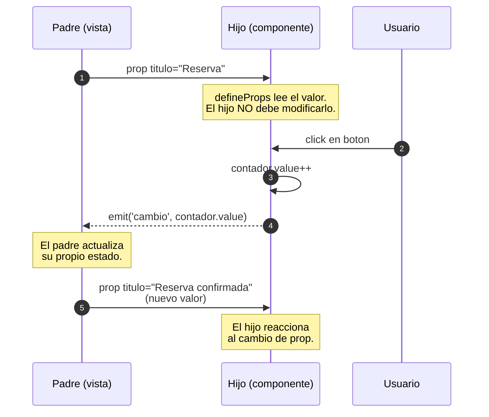
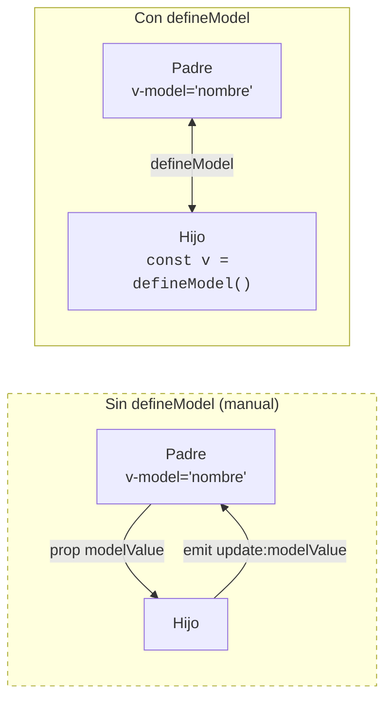
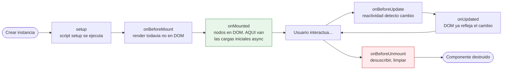

# Sesión 8: Componentes y comunicación
<!-- [[toc]] -->

::: info CONTEXTO
En las sesiones anteriores trabajamos con componentes individuales, directivas, eventos y listas. Ahora damos el salto a **componentes que colaboran entre sí** y a **estado derivado** con `computed` y `watch`, dos herramientas que usarás constantemente en aplicaciones reales.

**Al terminar esta sesión sabrás:**
- Calcular valores derivados con `computed` sin duplicar estado
- Aplicar el patrón entrada -> derivado -> acción en formularios reactivos
- Pasar datos de padre a hijo con Props (`defineProps`)
- Enviar eventos de hijo a padre con Emits (`defineEmits`)
- Simplificar la comunicación bidireccional con `defineModel`
- Reaccionar a cambios con `watch` y `watchEffect`
- Usar `onMounted` y `async/await` para carga inicial
- Crear componentes visuales reutilizables con slots
:::

## Plan de sesión (90 min) {#plan-90}

| Bloque | Tiempo | Contenido |
|--------|--------|-----------|
| **Teoría guiada** | 45 min | 3.1 a 3.9 (computed, comunicación entre componentes, watch, lifecycle y slots) |
| **Práctica en aula** | 25 min | Ejercicio 1 (tras 3.4) + Ejercicio 2 (cierre de sesión) |
| **Test de sesión** | 15 min | Preguntas de consolidación con debate de respuestas |
| **Cierre** | 5 min | Conclusiones y puente a arquitectura/composables |

::: tip ENFOQUE DIDÁCTICO
En esta sesión no buscamos memorizar APIs, sino decidir bien el patrón: `computed` para derivar, props/emits para comunicar, `watch` para efectos y slots para composición visual.
:::

## 3.1 Propiedades Computadas (`computed`) {#computed}

Una `computed` es un valor que se **calcula automáticamente** a partir de otras propiedades reactivas. Vue la cachea y solo la recalcula cuando cambian sus dependencias. La demo `Sesion8Computed.vue` lo ilustra con el cálculo del IVA:

```html
<script setup lang="ts">
import { ref, computed } from 'vue'

const precioBase = ref<number>(100)
const tipoIva = ref<number>(21)

// computed: nuevo valor derivado, reactivo y cacheado.
const ivaImporte  = computed(() => (precioBase.value * tipoIva.value) / 100)
const precioTotal = computed(() => precioBase.value + ivaImporte.value)

// Computed con setter: util cuando queremos un v-model bidireccional
// que escriba en otra variable.
const precioRedondeado = computed({
  get: () => Math.round(precioTotal.value * 100) / 100,
  set: nuevo => {
    // Quitar IVA al fijar el redondeado para recuperar la base.
    precioBase.value = nuevo / (1 + tipoIva.value / 100)
  },
})
</script>

<template>
  <input v-model.number="precioBase" type="number" />
  <input v-model.number="tipoIva"    type="number" />
  <p>IVA: {{ ivaImporte.toFixed(2) }} € · Total: {{ precioTotal.toFixed(2) }} €</p>
  <input v-model.number="precioRedondeado" type="number" step="0.01" />
</template>
```

> Fichero real: `ClientApp/src/views/sesiones-vue/sesion-8/Sesion8Computed.vue`. Si pones el mismo cálculo en un método y lo invocas dos veces en el template, se ejecuta dos veces; el `computed` se ejecuta una sola.

### `computed` vs método

| Aspecto | `computed` | Método |
|---------|-----------|--------|
| **Cacheo** | Sí, según dependencias | No |
| **Cuándo usar** | Valores derivados | Acciones o cálculos con parámetros |
| **Ejemplo** | Total del carrito, filtro de lista | `guardar()`, `eliminar(id)` |

### Patrón de formulario: entrada, derivado y acción

Cuando el formulario crece, separa siempre tres capas:

1. Estado de entrada (lo que escribe el usuario).
2. Estado derivado (lo que calculas desde ese estado).
3. Acción (lo que ejecutas al guardar/enviar).

```html
<script setup lang="ts">
import { ref, computed } from 'vue'

const texto = ref<string>('')

const normalizarTexto = (valor: string): string => valor.trim()

const textoNormalizado = computed(() => normalizarTexto(texto.value))
const puedeEnviar = computed(() => textoNormalizado.value.length >= 3)

const guardar = (): void => {
  if (!puedeEnviar.value) return
  console.log('Guardado:', textoNormalizado.value)
  texto.value = ''
}
</script>

<template>
  <input v-model="texto" @keyup.enter="guardar" placeholder="Escribe al menos 3 caracteres" />
  <button :disabled="!puedeEnviar" @click="guardar">Guardar</button>
  <small v-if="!puedeEnviar">Mínimo 3 caracteres tras normalizar.</small>
</template>
```

### Errores frecuentes en formularios reactivos

| Error | Consecuencia | Alternativa recomendada |
|------|--------------|-------------------------|
| Validar solo al enviar | Feedback tardío | Reglas simples en `computed` y mensaje reactivo |
| Repetir lógica en varios handlers | Código duplicado | Extraer función pura (`normalizarTexto`) |
| Mezclar mutaciones y lógica compleja en template | Difícil de depurar | Mover la lógica a `computed` o métodos |

::: tip CRITERIO RÁPIDO
Si produce un valor derivado sin efectos secundarios, piensa en `computed`. Si dispara una acción de usuario (guardar, borrar, enviar), usa método.
:::

### `computed` con arrays

```html
<script setup lang="ts">
import { ref, computed } from 'vue'

interface IClaseProducto {
  id: number
  nombre: string
  precio: number
  disponible: boolean
}

const productos = ref<IClaseProducto[]>([
  { id: 1, nombre: 'Laptop', precio: 800, disponible: true },
  { id: 2, nombre: 'Mouse', precio: 20, disponible: true },
  { id: 3, nombre: 'Teclado', precio: 45, disponible: false }
])

const busqueda = ref<string>('')

const productosFiltrados = computed(() =>
  productos.value.filter(p =>
    p.nombre.toLowerCase().includes(busqueda.value.toLowerCase())
  )
)

const totalDisponible = computed(() =>
  productos.value
    .filter(p => p.disponible)
    .reduce((total, p) => total + p.precio, 0)
)
</script>
```

::: tip BUENA PRÁCTICA
Si un valor depende de estado reactivo y se muestra en pantalla, empieza pensando en `computed`.
:::

## 3.2 Comunicación Padre → Hijo: Props {#props}

Los **props** pasan datos de un componente padre a un componente hijo. Antes de ver la sintaxis, fija la regla básica de comunicación en Vue: **los datos bajan, los eventos suben**.



<!-- diagram id="s8-props-emits" caption: "Datos bajan via props, eventos suben via emits" -->

Los props se definen con `defineProps`:

**Componente Hijo** (`TarjetaUsuario.vue`):

```html
<script setup lang="ts">
// Definir las props que el hijo puede recibir
const props = defineProps<{
  nombre: string
  edad: number
  ciudad?: string  // Opcional
}>()
</script>

<template>
  <div class="card p-3">
    <h3>{{ nombre }}</h3>
    <p>Edad: {{ edad }}</p>
    <p v-if="ciudad">Ciudad: {{ ciudad }}</p>
  </div>
</template>
```

**Componente Padre**:

```html
<script setup lang="ts">
import { ref } from 'vue'
import TarjetaUsuario from '@/components/TarjetaUsuario.vue'

const nombreUsuario = ref<string>('Ana')
const edadUsuario = ref<number>(25)
</script>

<template>
  <!-- Pasar datos al hijo con : (v-bind) -->
  <TarjetaUsuario :nombre="nombreUsuario" :edad="edadUsuario" ciudad="Alicante" />
</template>
```

### Props con valores por defecto: `withDefaults`

```typescript
interface Props {
  titulo: string
  activo?: boolean
  contador?: number
}

const props = withDefaults(defineProps<Props>(), {
  activo: true,
  contador: 0
})
```

::: warning IMPORTANTE
Los props son de **solo lectura** en el componente hijo. Nunca modifiques un prop directamente (`props.nombre = 'otro'` es un error). Si el hijo necesita cambiar un valor del padre, usa Emits o `defineModel`.
:::

## 3.3 Comunicación Hijo → Padre: Emits {#emits}

Los **emits** envían eventos desde el hijo hacia el padre. Se definen con `defineEmits`:

**Componente Hijo** (`BotonAccion.vue`):

```html
<script setup lang="ts">
// Definir los eventos que el hijo puede emitir (con tipos)
const emit = defineEmits<{
  mensajeEnviado: [mensaje: string]
  actualizar: [datos: { id: number; texto: string }]
}>()

const enviarMensaje = () => {
  emit('mensajeEnviado', 'Hola desde el hijo')
}
</script>

<template>
  <button @click="enviarMensaje">Enviar Mensaje</button>
</template>
```

**Componente Padre**:

```html
<script setup lang="ts">
import { ref } from 'vue'
import BotonAccion from '@/components/BotonAccion.vue'

const mensajeRecibido = ref<string>('')

const manejarMensaje = (mensaje: string) => {
  mensajeRecibido.value = mensaje
}
</script>

<template>
  <!-- Escuchar eventos del hijo con @ (v-on) -->
  <BotonAccion @mensajeEnviado="manejarMensaje" />
  <p v-if="mensajeRecibido">Recibido: {{ mensajeRecibido }}</p>
</template>
```

### Patrón completo: comunicación con estado en el padre

Combinando Props + Emits:

```
[Padre] contador = 0
   ↓ (prop :contador)
[Hijo] recibe props.contador = 0
   ↓ (usuario hace click)
[Hijo] emit('actualizar', 1)
   ↑ (evento @actualizar)
[Padre] contador.value = 1
   ↓ (reactividad automática)
[Hijo] props.contador = 1
```

```html
<!-- Hijo: recibe dato y emite cambio -->
<script setup lang="ts">
const props = defineProps<{ contador: number }>()
const emit = defineEmits<{ actualizar: [nuevoValor: number] }>()

const incrementar = () => emit('actualizar', props.contador + 1)
</script>

<template>
  <div>
    <p>Contador: {{ contador }}</p>
    <button @click="incrementar">+1</button>
  </div>
</template>
```

```html
<!-- Padre: mantiene el estado y actualiza -->
<script setup lang="ts">
import { ref } from 'vue'
import ContadorHijo from '@/components/ContadorHijo.vue'

const contador = ref<number>(0)
</script>

<template>
  <ContadorHijo :contador="contador" @actualizar="(v) => contador = v" />
</template>
```

## 3.4 `defineModel`: comunicación bidireccional simplificada {#define-model}

El patrón Props + Emits funciona, pero es repetitivo para `v-model`. **`defineModel`** (Vue 3.4+) lo simplifica a una sola línea:



<!-- diagram id="s8-define-model" caption: "defineModel compacta prop + emit en una sola declaracion bidireccional" -->

### Comparación

| Aspecto | Props + Emits | `defineModel` |
|---------|---------------|---------------|
| **Líneas de código** | ~15 líneas | ~3 líneas |
| **Props a definir** | `modelValue` manual | Automático |
| **Emits a definir** | `update:modelValue` manual | Automático |
| **Función handler** | Necesaria | No necesaria |

### Ejemplo: Input personalizado

La demo `Sesion8DefineModel.vue` usa `InputEditable.vue` como componente hijo. Es el patrón "real" con etiqueta + botón "Limpiar":

```html
<!-- InputEditable.vue (hijo) -->
<script setup lang="ts">
// defineModel reemplaza a defineProps + defineEmits('update:modelValue').
const valor = defineModel<string>({ required: true })

defineProps<{ etiqueta: string }>()

function limpiar(): void { valor.value = '' }
</script>

<template>
  <div class="input-group">
    <span class="input-group-text">{{ etiqueta }}</span>
    <input v-model="valor" type="text" class="form-control" />
    <button class="btn btn-outline-secondary" type="button" @click="limpiar">Limpiar</button>
  </div>
</template>
```

**Uso en el padre** (`Sesion8DefineModel.vue`):

```html
<script setup lang="ts">
import { ref } from 'vue'
import InputEditable from './InputEditable.vue'

const nombre = ref('')
const apellido = ref('Lovelace')
</script>

<template>
  <InputEditable v-model="nombre"   etiqueta="Nombre" />
  <InputEditable v-model="apellido" etiqueta="Apellido" />
  <p>Hola, <strong>{{ nombre }} {{ apellido }}</strong></p>
</template>
```

> Ficheros reales: `ClientApp/src/views/sesiones-vue/sesion-8/Sesion8DefineModel.vue` + `InputEditable.vue`.

### Toggle personalizado

```html
<script setup lang="ts">
const activo = defineModel<boolean>({ default: false })
</script>

<template>
  <button @click="activo = !activo" :class="{ activado: activo }">
    {{ activo ? 'Encendido ✓' : 'Apagado ✗' }}
  </button>
</template>
```

### Múltiples v-models

```html
<script setup lang="ts">
const nombre = defineModel<string>('nombre')
const apellido = defineModel<string>('apellido')
</script>

<template>
  <input v-model="nombre" placeholder="Nombre" />
  <input v-model="apellido" placeholder="Apellido" />
</template>
```

```html
<!-- Uso en el padre -->
<FormularioNombre v-model:nombre="nombreUsuario" v-model:apellido="apellidoUsuario" />
```

::: tip BUENA PRÁCTICA
**Cuándo usar cada patrón:**
- **Props** (solo lectura) → `defineProps`
- **Eventos del hijo al padre** → `defineEmits`
- **Comunicación bidireccional** (`v-model`) → `defineModel` ✅
:::

## Ejercicio 1: Contador con componentes {#ejercicio-1}

::: info ENUNCIADO
Vas a resolver el mismo problema funcional con dos patrones de comunicación entre componentes. La práctica busca que comprendas cuándo usar Props+Emits y cuándo `defineModel`, manteniendo en ambos casos una única fuente de verdad del estado en el padre.

**Resultado esperado:** tres componentes (`ContadorPropsEmits.vue`, `ContadorVModel.vue`, `PadreContadores.vue`) con comportamiento equivalente y suma derivada mediante `computed`.
:::

**Objetivo:** Practicar Props, Emits y `defineModel` creando un contador que vive en el padre pero se controla desde el hijo.

1. Crea `ContadorPropsEmits.vue` (hijo):
   - Recibe prop `contador` (number)
   - Emite evento `actualizar` con el nuevo valor
   - Tiene botones +1 y -1 que emiten el cambio

2. Crea `ContadorVModel.vue` (hijo):
   - Usa `defineModel<number>()` en lugar de props/emits
   - Misma funcionalidad pero con menos código

3. Crea `PadreContadores.vue` (padre):
   - Mantiene `contadorA` y `contadorB` como refs
   - Usa `ContadorPropsEmits` con `contadorA`
   - Usa `ContadorVModel` con `contadorB`
   - Muestra la suma de ambos contadores con `computed`

::: details Solución Ejercicio 1

```html
<!-- ContadorPropsEmits.vue -->
<script setup lang="ts">
const props = defineProps<{ contador: number }>()
const emit = defineEmits<{ actualizar: [valor: number] }>()
</script>

<template>
  <div class="d-flex align-items-center gap-2">
    <button class="btn btn-sm btn-danger" @click="emit('actualizar', contador - 1)">-1</button>
    <span class="badge bg-primary fs-5">{{ contador }}</span>
    <button class="btn btn-sm btn-success" @click="emit('actualizar', contador + 1)">+1</button>
  </div>
</template>
```

```html
<!-- ContadorVModel.vue -->
<script setup lang="ts">
const modelo = defineModel<number>({ default: 0 })
</script>

<template>
  <div class="d-flex align-items-center gap-2">
    <button class="btn btn-sm btn-danger" @click="modelo!--">-1</button>
    <span class="badge bg-info fs-5">{{ modelo }}</span>
    <button class="btn btn-sm btn-success" @click="modelo!++">+1</button>
  </div>
</template>
```

```html
<!-- PadreContadores.vue -->
<script setup lang="ts">
import { ref, computed } from 'vue'
import ContadorPropsEmits from './ContadorPropsEmits.vue'
import ContadorVModel from './ContadorVModel.vue'

const contadorA = ref<number>(0)
const contadorB = ref<number>(0)

const suma = computed(() => contadorA.value + contadorB.value)
</script>

<template>
  <div class="p-4">
    <h2>Contadores</h2>

    <div class="mb-3">
      <h4>Props + Emits</h4>
      <ContadorPropsEmits :contador="contadorA" @actualizar="(v) => contadorA = v" />
    </div>

    <div class="mb-3">
      <h4>defineModel</h4>
      <ContadorVModel v-model="contadorB" />
    </div>

    <p class="fs-4">Suma: {{ suma }}</p>
  </div>
</template>
```
:::

## 3.5 Watchers: reaccionar a cambios {#watchers}

Los **watchers** ejecutan código cuando cambia una propiedad reactiva. A diferencia de `computed`, no devuelven un valor: sirven para **efectos secundarios**.

| | `computed` | `watch` |
|---|---|---|
| **Propósito** | Derivar o transformar datos | Ejecutar efectos secundarios |
| **Retorna valor** | Sí | No |
| **Ejemplo típico** | Filtrar, totalizar | Guardar en storage, llamar API, lanzar alerta |

### Watch simple

```typescript
import { ref, watch } from 'vue'

const contador = ref<number>(0)

watch(contador, (nuevo, anterior) => {
  console.log(`Contador: ${anterior} -> ${nuevo}`)
})
```

### Watch con opciones

```typescript
const usuario = ref({
  nombre: 'Ana',
  direccion: { ciudad: 'Alicante' }
})

watch(usuario, (nuevoUsuario) => {
  console.log('Usuario cambiado:', nuevoUsuario)
}, { deep: true, immediate: true })
```

### `watchEffect`

```typescript
import { ref, watchEffect } from 'vue'

const contador = ref<number>(0)
const nombre = ref<string>('Ana')

watchEffect(() => {
  console.log(`Contador: ${contador.value}, Nombre: ${nombre.value}`)
})
```

| `watch` | `watchEffect` |
|---------|---------------|
| Indicas qué observar | Detecta dependencias automáticamente |
| Permite usar valor anterior | No aporta valor anterior |
| Mejor para casos concretos | Útil para lógica corta |

::: warning IMPORTANTE
No uses `watch` para calcular valores derivados que podrían ser `computed`.
:::

## 3.6 Lifecycle Hooks y async/await {#lifecycle}

Vue ejecuta funciones en momentos concretos de la vida del componente. Antes de ver `onMounted` en código, fija el orden de los hooks:



<!-- diagram id="s8-lifecycle" caption: "Hooks de ciclo de vida de un componente Vue 3" -->

::: tip CUANDO USAR CADA HOOK
- `onMounted`: cargas iniciales que necesitan el DOM montado (peticiones HTTP, foco, integraciones con librerias DOM).
- `onUpdated`: rarisimo en codigo de la UA. Si crees que lo necesitas, casi seguro hay un `computed` o `watch` que encaja mejor.
- `onBeforeUnmount`: limpiar suscripciones, intervalos, listeners globales. Si no lo haces, hay leak.
:::

El hook más usado en frontend de negocio es `onMounted`:

```typescript
import { ref, onMounted } from 'vue'

const datos = ref<string[]>([])

onMounted(() => {
  console.log('Componente montado en el DOM')
})
```

### Cargar datos al montar

```typescript
import { ref, onMounted } from 'vue'

interface IClaseUsuario {
  id: number
  nombre: string
}

const usuarios = ref<IClaseUsuario[]>([])
const cargando = ref<boolean>(true)

const cargarDatos = async (): Promise<void> => {
  try {
    const respuesta = await fetch('/api/usuarios')
    usuarios.value = await respuesta.json()
  } catch (error) {
    console.error('Error al cargar datos', error)
  } finally {
    cargando.value = false
  }
}

onMounted(cargarDatos)
```

::: tip BUENA PRÁCTICA
Usa `try/catch/finally` en operaciones asíncronas que afecten a la UI.
:::

## 3.7 Slots: contenido dinámico y layout reutilizable {#slots}

Los **slots** permiten que el componente padre inyecte contenido HTML en un componente hijo. La demo `Sesion8Slots.vue` usa `TarjetaUA.vue` con **tres slots** (cabecera / default / acciones) y _fallback_ para cuando el padre no rellena alguno:

```html
<!-- TarjetaUA.vue (hijo) -->
<template>
  <div class="card border-primary mb-3">
    <div class="card-header bg-primary text-white">
      <slot name="cabecera"><em>Tarjeta sin titulo</em></slot>
    </div>
    <div class="card-body">
      <slot><p class="text-muted mb-0">Tarjeta sin contenido.</p></slot>
    </div>
    <div class="card-footer text-end">
      <slot name="acciones" />
    </div>
  </div>
</template>
```

**Uso en el padre** (`Sesion8Slots.vue`):

```html
<TarjetaUA>
  <template #cabecera>🗓️ Reserva confirmada</template>

  <p><strong>Recurso:</strong> Aula 12<br /><strong>Fecha:</strong> 16/05/2026 — 10:00 a 12:00</p>

  <template #acciones>
    <button class="btn btn-sm btn-outline-secondary me-2">Editar</button>
    <button class="btn btn-sm btn-danger">Eliminar</button>
  </template>
</TarjetaUA>
```

> Ficheros reales: `ClientApp/src/views/sesiones-vue/sesion-8/Sesion8Slots.vue` + `TarjetaUA.vue`. Cuando veas `<DialogModal>` en la sesión 10, sus slots `#header / #body / #buttons` son exactamente este patrón.

## 3.8 Nota: Provide / Inject {#provide-inject}

::: tip SESIÓN AVANZADA
Este tema se amplía en la **Sesión 17 — Estado global y persistencia**, donde se cubre `provide`/`inject` junto con Pinia y otros mecanismos de estado compartido.
:::

`provide` / `inject` permite compartir datos entre componentes **sin pasar props** por cada nivel intermedio. Es útil para contexto compartido (tema, configuración, autenticación simple), pero no es el primer mecanismo que debe aprender alguien que empieza.

```typescript
import { provide, inject, ref, type Ref } from 'vue'

const tema = ref<string>('claro')
provide('tema', tema)

const temaInyectado = inject<Ref<string>>('tema')
```

Úsalo cuando realmente quieras evitar pasar props por muchos niveles. Para estado compartido más amplio, ya pensaremos en Pinia en la sesión 4.

## 3.9 Errores frecuentes y criterio de elección {#errores-frecuentes}

Cuando un alumno empieza a combinar componentes, aparecen dudas repetidas. Este bloque ayuda a fijar criterio antes de pasar a arquitectura.

| Situación | Opción recomendada | Evitar |
|----------|--------------------|--------|
| Necesitas mostrar un total o un filtro en pantalla | `computed` | Recalcular en varios sitios con funciones duplicadas |
| El hijo notifica una acción al padre | `defineEmits` | Modificar props directamente |
| Padre e hijo editan el mismo dato | `defineModel` o props/emits explícito | Duplicar estado en ambos componentes |
| Reaccionar a cambio para guardar/log/API | `watch` | Meter side effects dentro de `computed` |
| Compartir layout flexible | `slots` | Multiplicar props para contenido que es estructura |

### Pregunta guía para decidir rápido

1. ¿Es un valor derivado mostrado en UI? -> `computed`.
2. ¿Es un efecto secundario? -> `watch` o `watchEffect`.
3. ¿Es comunicación de componentes? -> props/emits o `defineModel`.

::: tip REGLA PRÁCTICA
Si dudas entre dos enfoques, elige el que deje una única fuente de verdad del estado y haga más predecible el flujo de datos.
:::

## 3.10 Pruébalo en el proyecto {#sandbox}

En `uaReservas/ClientApp/src/views/sesiones-vue/sesion-8/` hay ocho demos navegables. Arranca la app y entra en `/uareservas/sesiones-vue/sesion-8`:

| Demo | Concepto que ilustra | Fichero |
|------|----------------------|---------|
| `Sesion8Computed.vue` | `computed` con dependencias + `computed` con setter (IVA bidireccional) | `sesion-8/Sesion8Computed.vue` |
| `Sesion8PropsEmits.vue` | Padre → hijo (`titulo`) + hijo → padre (`@cambio`) con `TarjetaContador` | `sesion-8/Sesion8PropsEmits.vue` + `TarjetaContador.vue` |
| `Sesion8PropsEmitsModal.vue` | API declarativa (`v-model:visible`) vs imperativa (`ref + show()`) de `PopUpModal` | `sesion-8/Sesion8PropsEmitsModal.vue` |
| `Sesion8DefineModel.vue` | `v-model` sobre un componente personalizado (`InputEditable`) | `sesion-8/Sesion8DefineModel.vue` + `InputEditable.vue` |
| `Sesion8Watchers.vue` | `watch(consulta, ...)` vs `watchEffect(...)` con historial visible | `sesion-8/Sesion8Watchers.vue` |
| `Sesion8Lifecycle.vue` | `onMounted` + `SpinnerModal` controlado por `v-model:visible` | `sesion-8/Sesion8Lifecycle.vue` |
| `Sesion8Slots.vue` | Tres slots (cabecera / default / acciones) con _fallback_ en `TarjetaUA` | `sesion-8/Sesion8Slots.vue` + `TarjetaUA.vue` |
| `Sesion8FormularioReserva.vue` | Integradora: `computed` (validación), `defineModel`, slots — sin axios todavía | `sesion-8/Sesion8FormularioReserva.vue` |

::: tip CÓMO TRABAJAR LAS DEMOS
La integradora `Sesion8FormularioReserva.vue` reúne todo: `puedeReservar` es un `computed` que habilita el botón solo cuando los tres campos son válidos, `InputEditable` usa `defineModel`, y `TarjetaUA` aporta la estructura visual con slots. Cuando en la sesión 10 sustituyas `TarjetaUA` por `DialogModal`, el resto del código apenas cambia.
:::

---

## Ejercicio 2: Gestor de gastos {#ejercicio-2}

::: info ENUNCIADO
Ahora aplicarás estado derivado y efectos secundarios en un caso realista: un formulario de gastos con resumen financiero reactivo. El foco es separar claramente entrada, cálculos (`computed`) y reacción a umbrales (`watch`).

**Resultado esperado:** un componente `GestorGastos.vue` que permita registrar y eliminar gastos, calcular métricas por categoría y mostrar alertas cuando el presupuesto se acerca o se supera.
:::

**Objetivo:** Aplicar `computed`, `watch` y métodos de arrays en un caso real de formulario y resumen financiero.

Crea `GestorGastos.vue` con:
1. Interface `IGasto`: `id`, `descripcion`, `cantidad`, `categoria` (`'alimentacion' | 'transporte' | 'ocio' | 'otros'`)
2. Estado reactivo: `gastos`, `nuevaDescripcion`, `nuevaCantidad`, `nuevaCategoria`, `presupuesto`, `alertaPresupuesto`
3. Funciones: `agregarGasto()` y `eliminarGasto(id)`
4. `computed`: `totalGastado`, `gastosPorCategoria`, `presupuestoRestante`, `porcentajeGastado`
5. `watch`: alertar al superar el 80% o el 100% del presupuesto

::: details Solución Ejercicio 2

```html
<script setup lang="ts">
import { ref, computed, watch } from 'vue'

interface IGasto {
  id: number
  descripcion: string
  cantidad: number
  categoria: 'alimentacion' | 'transporte' | 'ocio' | 'otros'
}

const gastos = ref<IGasto[]>([])
const nuevaDescripcion = ref<string>('')
const nuevaCantidad = ref<number>(0)
const nuevaCategoria = ref<'alimentacion' | 'transporte' | 'ocio' | 'otros'>('alimentacion')
const presupuesto = ref<number>(500)
const alertaPresupuesto = ref<string>('')

let contadorId = 1

const agregarGasto = (): void => {
  if (!nuevaDescripcion.value.trim() || nuevaCantidad.value <= 0) return

  gastos.value.push({
    id: contadorId++,
    descripcion: nuevaDescripcion.value.trim(),
    cantidad: nuevaCantidad.value,
    categoria: nuevaCategoria.value
  })

  nuevaDescripcion.value = ''
  nuevaCantidad.value = 0
  nuevaCategoria.value = 'alimentacion'
}

const eliminarGasto = (id: number): void => {
  gastos.value = gastos.value.filter(g => g.id !== id)
}

const totalGastado = computed((): number =>
  gastos.value.reduce((total, g) => total + g.cantidad, 0)
)

const gastosPorCategoria = computed(() => ({
  alimentacion: gastos.value
    .filter(g => g.categoria === 'alimentacion')
    .reduce((sum, g) => sum + g.cantidad, 0),
  transporte: gastos.value
    .filter(g => g.categoria === 'transporte')
    .reduce((sum, g) => sum + g.cantidad, 0),
  ocio: gastos.value
    .filter(g => g.categoria === 'ocio')
    .reduce((sum, g) => sum + g.cantidad, 0),
  otros: gastos.value
    .filter(g => g.categoria === 'otros')
    .reduce((sum, g) => sum + g.cantidad, 0)
}))

const presupuestoRestante = computed((): number =>
  presupuesto.value - totalGastado.value
)

const porcentajeGastado = computed((): number =>
  Number(((totalGastado.value / presupuesto.value) * 100).toFixed(2))
)

watch(totalGastado, (nuevoTotal) => {
  const porcentaje = (nuevoTotal / presupuesto.value) * 100

  if (porcentaje > 100) {
    alertaPresupuesto.value = '🚨 Has excedido tu presupuesto'
  } else if (porcentaje > 80) {
    alertaPresupuesto.value = '⚠️ Has gastado más del 80% de tu presupuesto'
  } else {
    alertaPresupuesto.value = ''
  }
})
</script>

<template>
  <div class="p-4" style="max-width: 800px">
    <h2>Gestor de Gastos</h2>

    <div class="row g-2 mb-3">
      <div class="col-md-5">
        <input v-model="nuevaDescripcion" class="form-control" placeholder="Descripción" />
      </div>
      <div class="col-md-3">
        <input v-model.number="nuevaCantidad" type="number" min="0" step="0.01" class="form-control" placeholder="Cantidad" />
      </div>
      <div class="col-md-2">
        <select v-model="nuevaCategoria" class="form-select">
          <option value="alimentacion">alimentacion</option>
          <option value="transporte">transporte</option>
          <option value="ocio">ocio</option>
          <option value="otros">otros</option>
        </select>
      </div>
      <div class="col-md-2 d-grid">
        <button @click="agregarGasto" class="btn btn-primary">Añadir</button>
      </div>
    </div>

    <div class="mb-3 p-3 border rounded bg-light">
      <p class="mb-1">Presupuesto: <strong>{{ presupuesto.toFixed(2) }}€</strong></p>
      <p class="mb-1">Total gastado: <strong>{{ totalGastado.toFixed(2) }}€</strong></p>
      <p class="mb-1">Presupuesto restante: <strong>{{ presupuestoRestante.toFixed(2) }}€</strong></p>
      <p class="mb-0">Porcentaje gastado: <strong>{{ porcentajeGastado }}%</strong></p>
      <p v-if="alertaPresupuesto" class="mt-2 mb-0 text-danger fw-bold">{{ alertaPresupuesto }}</p>
    </div>

    <div class="mb-3 p-3 border rounded">
      <h5>Gastos por categoría</h5>
      <p class="mb-1">alimentacion: {{ gastosPorCategoria.alimentacion.toFixed(2) }}€</p>
      <p class="mb-1">transporte: {{ gastosPorCategoria.transporte.toFixed(2) }}€</p>
      <p class="mb-1">ocio: {{ gastosPorCategoria.ocio.toFixed(2) }}€</p>
      <p class="mb-0">otros: {{ gastosPorCategoria.otros.toFixed(2) }}€</p>
    </div>

    <ul class="list-group">
      <li v-if="gastos.length === 0" class="list-group-item text-muted">No hay gastos registrados.</li>
      <li v-for="gasto in gastos" :key="gasto.id" class="list-group-item d-flex justify-content-between align-items-center">
        <span>{{ gasto.descripcion }} <small class="text-muted">({{ gasto.categoria }})</small></span>
        <div class="d-flex align-items-center gap-2">
          <strong>{{ gasto.cantidad.toFixed(2) }}€</strong>
          <button @click="eliminarGasto(gasto.id)" class="btn btn-sm btn-outline-danger">Eliminar</button>
        </div>
      </li>
    </ul>
  </div>
</template>
```
:::

## Tarea progresiva del proyecto final {#tarea-pf}

::: tip MÓDULOS 3 Y 4 · COMPONENTES REUTILIZABLES
Esta sesión te da las piezas para dos módulos del proyecto final que aún no has empezado:

**Módulo 3 · Horario** — Diseña en tu cabeza el componente `BloqueDia` que usarás más adelante:

- Recibe el día (lunes-domingo) como prop y las franjas como `defineModel`.
- Botones "añadir franja", "borrar franja", "bloquear día" usando los patrones de hoy.
- En la sesión de Pinia (sesión 23) lo conectaremos a un store compartido del horario en edición.

**Módulo 4 · Reserva** — Componentes `SelectorHora` y `SelectorDuracion`:

- `SelectorHora` con `defineModel<number>()` para el minuto del día (0-1439) y formato `HH:mm` en pantalla.
- `SelectorDuracion` con `defineModel<number>()` para minutos, presets en botones (15, 30, 60, 90).

Hoy basta con que dejes esbozada la API (`<script setup>` con `defineProps` y `defineModel`) en tu rama. La integradora vendrá en módulos posteriores.

Mapa completo: [Proyecto final del curso](../../../06-proyecto-final/).
:::

## Test Sesión 3 {#test}

### Preguntas (desplegables)

::: details 1. ¿Para qué sirve principalmente una computed?
- a) Para declarar props
- b) Para derivar un valor reactivo a partir de otro estado
- c) Para lanzar peticiones HTTP
- d) Para crear slots
:::

::: details 2. ¿Qué ventaja ofrece computed frente a un método simple en muchos casos?
- a) Se ejecuta solo en el backend
- b) Se cachea según sus dependencias
- c) Permite modificar props directamente
- d) Sustituye a watch
:::

::: details 3. ¿Qué mecanismo pasa datos del padre al hijo?
- a) defineEmits
- b) defineProps
- c) defineStore
- d) watchEffect
:::

::: details 4. ¿Qué afirmación es correcta sobre los props?
- a) El hijo puede modificarlos libremente
- b) Son de solo lectura en el hijo
- c) Solo pueden ser strings
- d) No admiten valores por defecto
:::

::: details 5. ¿Qué mecanismo envía eventos del hijo al padre?
- a) defineProps
- b) defineSlots
- c) defineEmits
- d) defineExpose
:::

::: details 6. ¿Qué herramienta simplifica el uso de v-model en un componente personalizado?
- a) defineModel
- b) provide
- c) withDefaults
- d) reactiveModel
:::

::: details 7. Cuando padre e hijo comparten un dato editable, ¿dónde suele vivir el estado fuente?
- a) En el hijo por defecto
- b) En el padre
- c) En cualquier slot
- d) En el CSS del componente
:::

::: details 8. ¿Para qué sirve withDefaults junto a defineProps?
- a) Para declarar eventos
- b) Para asignar valores por defecto a props opcionales
- c) Para evitar tipado
- d) Para transformar props en refs globales
:::

::: details 9. ¿Cuándo conviene watch?
- a) Para calcular totales que se muestran en pantalla
- b) Para efectos secundarios como storage, logs o llamadas externas
- c) Para definir interfaces
- d) Para evitar usar onMounted
:::

::: details 10. ¿Qué diferencia principal tiene watchEffect frente a watch?
- a) No reacciona a cambios
- b) Detecta dependencias automáticamente
- c) Solo sirve con Pinia
- d) Obliga a usar deep: true
:::

::: details 11. ¿Qué hook se usa normalmente para cargar datos iniciales al montar el componente?
- a) onHydrated
- b) onMounted
- c) onReady
- d) onVisible
:::

::: details 12. ¿Qué es un slot?
- a) Un hueco de contenido que el padre puede rellenar
- b) Un evento especial del DOM
- c) Una variante de watch
- d) Un store compartido
:::

::: details 13. ¿Para qué sirve provide/inject en esencia?
- a) Para reemplazar siempre Props y Emits
- b) Para compartir contexto sin pasar props por muchos niveles
- c) Para crear formularios con v-model
- d) Para hacer peticiones HTTP
:::

::: details 14. Si necesitas mostrar el total de gastos de una lista reactiva, ¿qué encaja mejor?
- a) computed
- b) watch
- c) defineEmits
- d) slot
:::

::: details 15. Si un hijo emite un clic de "guardar" al padre, ¿qué mecanismo encaja mejor?
- a) defineModel
- b) defineEmits
- c) withDefaults
- d) provide
:::

::: details 16. En un formulario reactivo, ¿qué patrón es más claro?
- a) Mezclar validación y guardado directamente en el template
- b) Entrada (`ref`) + derivado (`computed`) + acción (método)
- c) Guardar todo en `watch` para que sea automático
- d) Usar solo `defineModel` para cualquier lógica
:::

### Respuestas (Autoevaluación)

::: details Ver respuestas
1. b) Para derivar un valor reactivo desde otro estado.
2. b) computed se cachea según sus dependencias.
3. b) defineProps.
4. b) Son de solo lectura en el hijo.
5. c) defineEmits.
6. a) defineModel.
7. b) En el padre.
8. b) Asigna valores por defecto a props opcionales.
9. b) Para efectos secundarios como storage, logs o llamadas externas.
10. b) Detecta dependencias automáticamente.
11. b) onMounted.
12. a) Un hueco de contenido que el padre puede rellenar.
13. b) Compartir contexto sin pasar props por muchos niveles.
14. a) computed.
15. b) defineEmits.
16. b) Entrada (`ref`) + derivado (`computed`) + acción (método).
:::

---

<!-- NAV:START -->
| Anterior | Inicio | Siguiente |
|---|---|---|
| [← Sesión 10: Directivas, eventos y datos](../../../03-vue/sesiones/sesion-10-directivas-eventos/) | [Índice del curso](../../../) | [Sesión 12: Arquitectura de componentes y servicios →](../../../03-vue/sesiones/sesion-12-arquitectura-apis/) |
<!-- NAV:END -->
