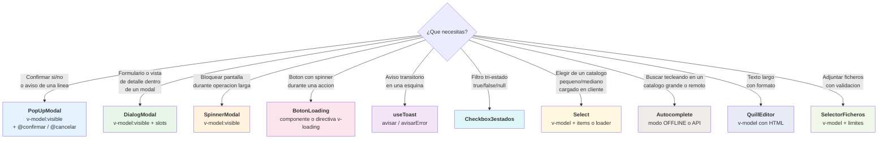
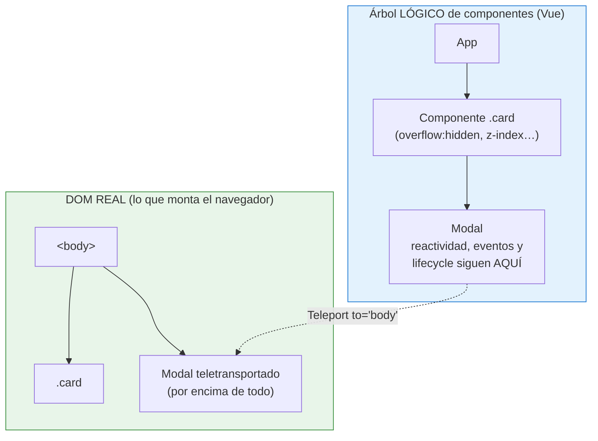

# Sesión 11: Otros componentes internos

::: info CONTEXTO
En las sesiones anteriores construimos componentes y composables a mano para entender los mecanismos de Vue. Ahora vemos los componentes de **`@vueua/components`** — la libreria oficial de la UA — que cubren los patrones repetidos (modales, toasts, botones con spinner, …) ya resueltos.

**Al terminar esta sesión sabrás:**

- Elegir el componente UA correcto frente a un caso real
- Controlar los modales con **variables de visibilidad** (`v-model:visible`) — el modo recomendado
- Elegir entre **`Select`** y **`Autocomplete`** para campos de selección, y usar **`QuillEditor`** y **`SelectorFicheros`** en formularios
- Aplicar el **flujo recomendado** de un CRUD: validar el modelo en cliente con **Zod**, enviar con **`peticion<T>`** y gestionar los errores **400/500** con **`useGestionFormularios`**
- Encajar varios componentes UA en un flujo CRUD completo
- Entender qué hace `Teleport` y por qué los modales lo usan por dentro
  :::

## Plan de sesión (90 min) {#plan-90}

| Bloque               | Tiempo | Contenido                                                          |
| -------------------- | ------ | ------------------------------------------------------------------ |
| **Teoría guiada**    | 45 min | 6.1 a 6.12 (árbol de decisión + componentes uno a uno + Teleport)  |
| **Práctica en aula** | 25 min | Demo integradora CRUD mock (`Sesion11CrudRecursos.vue`)            |
| **Test de sesión**   | 15 min | Preguntas rápidas en formato desplegable y corrección grupal       |
| **Cierre**           | 5 min  | Dudas y enlace con sesiones de integración (12-15)                 |

::: tip ENFOQUE DIDÁCTICO
Cada componente se presenta junto con su demo abrible en `uareservas/sesiones-vue/sesion-11/...`. Abre el código y modifica valores: es la forma más rápida de fijar la API.
:::

## 6.1 ¿Qué componente UA elegir? {#decision}

Antes de ver la API de cada uno, fija el árbol de decisión: el alumno que se sienta frente a una pantalla nueva debe poder elegir en 10 segundos qué componente UA usa.



<!-- diagram id="s10-decision-modales" caption: "Elegir el componente UA correcto segun la necesidad" -->

::: tip MODO DE TRABAJO RECOMENDADO
La librería se ha **unificado y modernizado**: todos los componentes viven en `@vueua/components` y el patrón de trabajo recomendado para una pantalla es siempre el mismo:

1. **Visibilidad declarativa**: los modales se abren y cierran con una **variable de visibilidad** (`v-model:visible`), no con llamadas imperativas `show()`/`hide()`.
2. **`peticion<T>`** para hablar con la API (sesión 12).
3. **Validar el modelo en el cliente con Zod** (vía `useGestionFormularios`) **antes** de enviar.
4. **Gestionar los errores 400 y 500** desde `useGestionFormularios`: 400 → errores por campo (`adaptarProblemDetails`); 500/red → toast (`gestionarError`).

A lo largo de la sesión usamos siempre este modo. La antigua API imperativa (`ref + show()`) sigue existiendo por compatibilidad, pero queda relegada a una nota _legacy_.
:::

## 6.2 `PopUpModal` · confirmaciones y avisos breves {#popup-modal}

Modal pensado para decisiones cortas: "¿Eliminar?", "Operación completada", "¿Estás seguro?". No lleva formulario dentro; si tu caso lo necesita, salta a `DialogModal`.

**Modo recomendado — visibilidad declarativa con `v-model:visible`:** la apertura es una variable reactiva (`abierto`) y reaccionas a `@confirmar` / `@cancelar`.

```vue
<script setup lang="ts">
import { ref } from "vue";
import { PopUpModal } from "@vueua/components/ui/popup-modal";

const abierto = ref(false);

function eliminar() {
  // Llamar a la API con peticion<T>, recargar la tabla...
  abierto.value = false;
}
</script>

<template>
  <button class="btn btn-danger" @click="abierto = true">Eliminar</button>

  <PopUpModal
    v-model:visible="abierto"
    @confirmar="eliminar"
    @cancelar="abierto = false"
  >
    <template #header>Eliminar reserva</template>
    <template #body>Esta accion no se puede deshacer.</template>
  </PopUpModal>
</template>
```

::: details Legacy · API imperativa con `show()`
La versión antigua (`ref + await modal.show()` que devuelve `Promise<boolean>`) sigue funcionando por compatibilidad, pero **ya no es la recomendada**: prefiere siempre la variable de visibilidad.

```vue
<script setup lang="ts">
import { ref } from "vue";
import { PopUpModal } from "@vueua/components/ui/popup-modal";

const popupRef = ref<InstanceType<typeof PopUpModal>>();

async function eliminar() {
  const ok = await popupRef.value?.show();
  if (!ok) return;
  // ...
}
</script>

<template>
  <button class="btn btn-danger" @click="eliminar">Eliminar</button>
  <PopUpModal ref="popupRef">
    <template #header>Eliminar reserva</template>
    <template #body>Esta accion no se puede deshacer.</template>
  </PopUpModal>
</template>
```

:::

[Demo abrible: `/uareservas/sesiones-vue/sesion-11/popup-modal`](/uareservas/sesiones-vue/sesion-11/popup-modal)

## 6.3 `DialogModal` · formularios y vistas de detalle {#dialog-modal}

Modal generalista con slots `#header`, `#body` y `#buttons`. Ideal cuando dentro va un formulario o una ficha de detalle. Recuerda el patrón de slots que vimos en la sesión 8: el padre decide qué HTML va en cada hueco.

```vue
<script setup lang="ts">
import { ref } from "vue";
import { DialogModal } from "@vueua/components/ui/dialog-modal";

const editando = ref(false);
const recurso = ref({ nombre: "", tipo: "Aula" });

async function guardar() {
  // POST/PUT a la API...
  editando.value = false;
}
</script>

<template>
  <button class="btn btn-primary" @click="editando = true">
    Editar recurso
  </button>

  <DialogModal
    v-model:visible="editando"
    titulo="Editar recurso"
    :cerrado-automatico="false"
    @confirmar="guardar"
  >
    <template #body>
      <!-- Form accesible (sesión 10 §4.4): label con for, submit con Enter -->
      <form novalidate @submit.prevent="guardar">
        <div class="mb-3">
          <label class="form-label" for="campoNombre">Nombre</label>
          <input
            id="campoNombre"
            v-model="recurso.nombre"
            class="form-control autofocus"
            required
          />
        </div>
        <div class="mb-3">
          <label class="form-label" for="campoTipo">Tipo</label>
          <select id="campoTipo" v-model="recurso.tipo" class="form-select">
            <option>Aula</option>
            <option>Sala</option>
            <option>Equipo</option>
          </select>
        </div>

        <!-- El botón visible (Aceptar) está en el footer del modal, FUERA
             del form: este submit oculto hace que Enter también guarde. -->
        <button type="submit" class="d-none" aria-hidden="true" tabindex="-1">
          Guardar
        </button>
      </form>
    </template>
  </DialogModal>
</template>
```

::: warning IMPORTANTE
`:cerrado-automatico="false"` evita que el modal se cierre al pulsar "Aceptar" antes de que termine la validacion / llamada a la API. Vuelve a poner `editando = false` solo cuando el `await` haya terminado correctamente.
:::

::: tip EL ENTER EN LOS MODALES
Los botones del footer del modal están **fuera** del `<form>`, así que sin más ayuda pulsar
<kbd>Enter</kbd> en un campo no haría nada. El patrón del curso (sesión 10, §4.4): el form lleva
`@submit.prevent="guardar"` y un **botón submit oculto** dentro. Enter y el botón "Aceptar"
desembocan en la misma función.
:::

[Demo abrible: `/uareservas/sesiones-vue/sesion-11/dialog-modal`](/uareservas/sesiones-vue/sesion-11/dialog-modal)

## 6.4 `SpinnerModal` · bloquear pantalla durante operación larga {#spinner-modal}

Cuando una operación dura más de medio segundo y no se puede acompañar con un `BotonLoading` (por ejemplo, porque la disparas tú al cargar la página, no desde un botón), bloquea la pantalla con `SpinnerModal`.

```vue
<script setup lang="ts">
import { ref, onMounted } from "vue";
import { SpinnerModal } from "@vueua/components/ui/spinner-modal";
import { useRecursos } from "@/composables/useRecursos";

const { recursos, cargando, cargar } = useRecursos();

onMounted(() => cargar());
</script>

<template>
  <SpinnerModal
    v-model:visible="cargando"
    titulo="Cargando recursos"
    mensaje="Conectando con el servidor…"
  />
  <ul v-if="!cargando">
    <li v-for="r in recursos" :key="r.id">{{ r.nombre }}</li>
  </ul>
</template>
```

Una **sola variable booleana** (`cargando`) gobierna a la vez la visibilidad del modal y el `v-if` que decide si pintar la lista. Es el caso típico de "una fuente de verdad" que vimos en la sesión 8.

[Demo abrible: `/uareservas/sesiones-vue/sesion-11/spinner-modal`](/uareservas/sesiones-vue/sesion-11/spinner-modal)

## 6.5 `BotonLoading` · botón con spinner integrado {#boton-loading}

Cuando el usuario pulsa un botón y la operación tarda, hay dos cosas que evitar:

1. Que vuelva a hacer click pensando que no ha pasado nada (doble envío).
2. Que se quede sin feedback visual.

`BotonLoading` resuelve las dos. Existe en **dos formas**:

::: code-group

```vue [Como componente]
<script setup lang="ts">
import { ref } from "vue";
import { BotonLoading } from "@vueua/components/ui/boton-loading";

// BotonLoading se controla por ref: el click activa el spinner solo;
// tú lo desactivas con loadContent(false) cuando la operación termina.
const btnRef = ref<InstanceType<typeof BotonLoading>>();

async function guardar() {
  try {
    await guardarEnServidor();
  } finally {
    btnRef.value?.loadContent(false); // desbloquea el botón al terminar
  }
}
</script>

<template>
  <BotonLoading ref="btnRef" class="btn btn-primary" @click="guardar">
    Guardar
  </BotonLoading>
</template>
```

```vue [Como directiva v-loading]
<script setup lang="ts">
import { ref } from "vue";
import { loadingDirective as vLoading } from "@vueua/components/ui/boton-loading";

const enviando = ref(false);
async function enviar() {
  enviando.value = true;
  try {
    await enviarFormulario();
  } finally {
    enviando.value = false;
  }
}
</script>

<template>
  <button
    v-loading="enviando"
    :disabled="enviando"
    class="btn btn-success"
    @click="enviar"
  >
    Enviar
  </button>
</template>
```

:::

::: tip CUANDO CADA VARIANTE

- **Componente**: cuando arrancas un botón nuevo. Más conciso.
- **Directiva**: cuando ya tienes el botón tal cual lo quieres y solo necesitas añadir el spinner.
  :::

::: warning DESBLOQUEA SIEMPRE EL BOTÓN
El botón se bloquea solo al pulsarlo. **No** olvides el `try/finally`: desbloquéalo con `loadContent(false)` (componente) o poniendo a `false` la variable de `v-loading` (directiva). Si el `await` lanza una excepción y no lo desbloqueas, el botón queda inservible hasta recargar la página.
:::

[Demo abrible: `/uareservas/sesiones-vue/sesion-10/boton-loading`](/uareservas/sesiones-vue/sesion-10/boton-loading) (introducido en la sesión 10)

## 6.6 `useToast` · avisos transitorios {#use-toast}

Notificaciones globales que aparecen en una esquina y se cierran solas. Se usan para **confirmar acciones** ("Guardado correctamente"), **avisar de errores** ("No se ha podido contactar") y **informar de procesos en curso**.

```ts
import {
  avisar,
  avisarError,
  avisarPersonalizado,
  cerrarToastsPorGrupo,
} from "@vueua/components/composables/use-toast";

avisar("Guardado", "Los datos se han guardado correctamente");
avisarError("Error", "No se ha podido contactar con el servidor");
avisarPersonalizado("Aviso", "Quedan 3 plazas libres", "aviso", 5000);

// Grupos: relacionar varios toasts y cerrarlos juntos
avisar("Recurso 1 guardado", "Aula 12", "es", "reservas");
avisar("Recurso 2 guardado", "Sala A", "es", "reservas");
cerrarToastsPorGrupo("reservas");
```

::: tip CUANDO USAR TOAST O MODAL

- **Toast**: información que el usuario puede ignorar y no bloquea el flujo (éxito, aviso suave).
- **Modal**: información que el usuario debe leer antes de seguir (errores graves, confirmaciones).
  :::

::: warning REQUISITO DE MONTAJE
El contenedor `<ToastContainer />` debe estar en `App.vue` (o se monta solo en el primer aviso). En `uaReservas` ya está montado explícitamente.
:::

[Demo abrible: `/uareservas/sesiones-vue/sesion-10/use-toast`](/uareservas/sesiones-vue/sesion-10/use-toast) (introducido en la sesión 10)

## 6.7 `Checkbox3estados` · filtros con `boolean | null` {#checkbox3estados}

Un checkbox normal tiene dos estados: marcado / no marcado. En filtros, falta un tercero: **"da igual / no filtrar"**. `Checkbox3estados` da los tres con un único `v-model`:

```vue
<script setup lang="ts">
import { ref, computed } from "vue";
import { Checkbox3estados } from "@vueua/components/ui/checkbox-3-estados";

const recursos = [
  { id: 1, nombre: "Aula 12", activo: true },
  { id: 2, nombre: "Aula 14", activo: false },
  { id: 3, nombre: "Sala A", activo: true },
];

const filtroActivo = ref<boolean | null>(null);

const filtrados = computed(() =>
  recursos.filter(
    (r) => filtroActivo.value === null || r.activo === filtroActivo.value,
  ),
);
</script>

<template>
  <Checkbox3estados v-model="filtroActivo" id="filtroActivo" />
  <label for="filtroActivo">Activo</label>

  <p>
    Mostrando:
    {{
      filtroActivo === null
        ? "todos"
        : filtroActivo
          ? "solo activos"
          : "solo inactivos"
    }}
  </p>
</template>
```

::: tip CONTRATO RECOMENDADO
Tipa la variable como `boolean | null`. Aunque el componente admite valores laxos, este contrato es el más estable.
:::

[Demo abrible: `/uareservas/sesiones-vue/sesion-11/checkbox-3-estados`](/uareservas/sesiones-vue/sesion-11/checkbox-3-estados)

## 6.8 `Select` · elegir de un catálogo en cliente {#select}

El selector general de la librería para catálogos **pequeños o medianos que caben en memoria**:
centros, departamentos, tipos, estados… Sustituye al `<select>` nativo añadiendo búsqueda,
limpieza, selección múltiple y estados de carga, con defaults pensados para la UA.

```vue
<script setup lang="ts">
import { ref } from "vue";
import { Select } from "@vueua/components/ui/select";

const centro = ref<number | null>(null);

const centros = [
  { id: 1, nombre: "Escuela Politécnica Superior" },
  { id: 2, nombre: "Facultad de Ciencias" },
  { id: 3, nombre: "Facultad de Derecho" },
];
</script>

<template>
  <label for="centro" class="form-label">Centro</label>
  <Select id="centro" v-model="centro" :items="centros" />
</template>
```

Por defecto espera objetos con `id` y `nombre` y **emite el `id`** por `v-model` (si el catálogo
usa otros campos, se cambian con `value-key` / `label-key`). La selección múltiple es el mismo
componente con `multiple` (el modelo pasa a ser un array):

```vue
<Select v-model="perfiles" :items="catalogoPerfiles" multiple :max="3" />
```

Dos detalles que encajan con lo que ya sabes:

- **Accesibilidad de serie**: semántica de combobox, navegación completa por teclado (flechas,
  Enter, Escape, Tab) y `invalid-feedback` asociado por `aria-describedby`. Solo te pide lo de
  siempre: el `<label for>` fuera.
- **Carga desde la API sin acoplarse a HTTP**: la prop `loader` acepta una función que devuelve
  las opciones. En la sesión 12 verás `useCargaDatosApi`, que crea ese `loader` con `peticion<T>`.

::: warning DEMO PENDIENTE EN uaReservas
`Select` es el componente más reciente de la librería y **aún no está en la versión publicada**
que consume la app del curso. Mientras llega, pruébalo en el
[catálogo de ComponentesVue](https://preproddesa.campus.ua.es/ComponentesVue/) y consulta su
guía de uso (`GUIA-DE-USO/ui/select.md`).
:::

## 6.9 `Autocomplete` · buscar tecleando {#autocomplete}

Cuando el catálogo es **grande** (personas, asignaturas, ubicaciones…) no tiene sentido cargarlo
entero en un desplegable: el usuario **busca tecleando** y el componente le ofrece coincidencias.
Eso es `Autocomplete`. La frontera con `Select` es esta:

| Pregunta | `Select` | `Autocomplete` |
| --- | --- | --- |
| ¿Cuántas opciones? | Decenas o pocos cientos, cargadas completas | Miles, o un volumen desconocido |
| ¿De dónde salen? | Memoria (array o `loader` de carga completa) | Búsqueda incremental (local u API) |
| ¿Cómo elige el usuario? | Despliega y filtra la lista | Teclea y elige entre coincidencias |

Hoy lo usamos en **modo OFFLINE** (filtra un catálogo local); el **modo API** — debounce,
paginación y endpoint real — llega en la sesión 12 con `useAxios`:

```vue
<script setup lang="ts">
import { onMounted, ref } from "vue";
import {
  Autocomplete,
  enumModoCargaDatosAutocomplete,
  enumModoAPIAutocomplete,
} from "@vueua/components/ui/autocomplete";

const seleccionado = ref(null);
const refAuto = ref<InstanceType<typeof Autocomplete> | null>(null);

// La configuración es un objeto: clave, campo visible, mínimo de
// caracteres y modo de carga.
const config = {
  key: "id",
  nombre: "nombre",
  url: "",
  resultadosmostrar: 6,
  mincaracteres: 2,
  mspausafiltro: 300,
  modollamada: enumModoAPIAutocomplete.GET,
  modocarga: enumModoCargaDatosAutocomplete.OFFLINE, // ← filtra en local
};

onMounted(() => {
  refAuto.value?.cargarDatosOffline(catalogoLocal); // los datos, en mano
});
</script>

<template>
  <label class="form-label" for="autoRecurso">Buscar recurso</label>
  <Autocomplete
    id="autoRecurso"
    ref="refAuto"
    v-model="seleccionado"
    class="form-control"
    placeholder="Escribe al menos 2 letras"
    :autocomplete="config"
  />
</template>
```

El `v-model` emite el **objeto completo** seleccionado (o solo el `id`, con `devuelveid: true`).
Es navegable por teclado: flechas, Enter y Escape.

::: tip EN LA SESIÓN 12 SOLO CAMBIA LA CONFIGURACIÓN
Para pasar al modo API no se toca el template: en el objeto de configuración, `modocarga` pasa a
`API` y `url` apunta al endpoint. La mecánica de uso es idéntica.
:::

[Demo abrible: `/uareservas/sesiones-vue/sesion-11/autocomplete`](/uareservas/sesiones-vue/sesion-11/autocomplete)

## 6.10 `QuillEditor` · texto enriquecido {#quill-editor}

Para campos de descripción u observaciones largas que admiten **formato** (negrita, listas,
enlaces…). Es un editor WYSIWYG con `v-model`: lo que el usuario escribe **se emite como HTML**.

```vue
<script setup lang="ts">
import { ref } from "vue";
import { QuillEditor } from "@vueua/components/ui/quill-editor";

const descripcion = ref("<p>Texto <strong>inicial</strong></p>");
</script>

<template>
  <!-- label pinta la etiqueta y el placeholder: no necesita <label> aparte -->
  <QuillEditor v-model="descripcion" label="Descripción del recurso" />
</template>
```

Tres cosas a saber:

- El `v-model` es un `string` con HTML: viaja en el DTO como un campo de texto más y en Oracle se
  guarda en un CLOB.
- La barra de herramientas es **accesible**: cada botón lleva su texto `visually-hidden`
  localizado (recórrela con Tab).
- Si ese HTML se renderiza después con `v-html`, debe **sanearse en servidor** antes de
  persistirlo: es contenido del usuario.

[Demo abrible: `/uareservas/sesiones-vue/sesion-11/quill-editor`](/uareservas/sesiones-vue/sesion-11/quill-editor)

## 6.11 `SelectorFicheros` · adjuntar con validación {#selector-ficheros}

Selección de uno o varios ficheros con las validaciones declaradas **como props**: número máximo,
tamaño máximo por fichero y extensiones permitidas. Si algo no cumple, el componente avisa él
mismo con un **toast de error**.

```vue
<script setup lang="ts">
import { ref } from "vue";
import { SelectorFicheros } from "@vueua/components/ui/selector-ficheros";

// Array de File; las posiciones null son huecos aún sin fichero.
const archivos = ref<(File | null)[]>([]);
</script>

<template>
  <SelectorFicheros
    v-model="archivos"
    :maxficheros="3"
    :maxtamanoxficherokb="2048"
    :extensiones="['.pdf', '.jpg', '.png']"
  />
</template>
```

- El `v-model` es `(File | null)[]`: al procesarlo, filtra los `null`.
- Con `maxficheros` alcanzado, el botón de añadir desaparece solo.
- Aquí solo **seleccionamos y validamos en cliente**; la subida real (multipart, BLOB en Oracle)
  se trabaja en la [sesión 20 — Ficheros](../../../05-avanzadas/sesiones/sesion-20-ficheros/).

[Demo abrible: `/uareservas/sesiones-vue/sesion-11/selector-ficheros`](/uareservas/sesiones-vue/sesion-11/selector-ficheros)

## 6.12 `Teleport` · renderizar fuera del árbol {#teleport}

Es una directiva **de Vue, no de la UA**, pero entender qué hace ayuda a entender por qué los modales y toasts UA funcionan como funcionan.

Un modal técnicamente vive como hijo de tu componente. Pero visualmente debe aparecer **por encima de todo** y centrado en la pantalla. Si lo dejas dentro del árbol normal, el CSS del padre (un `overflow: hidden`, un `position: relative`, un `z-index` raro) te lo va a romper. `Teleport` lo mueve al DOM al elemento que tú elijas (típicamente `<body>`):

```vue
<template>
  <div class="card">
    <h3>Mi tarjeta</h3>

    <!-- Este modal aparece bajo <body>, no dentro de .card -->
    <Teleport to="body">
      <div v-if="abierto" class="mi-modal">Contenido del modal</div>
    </Teleport>
  </div>
</template>
```



<!-- diagram id="s10-teleport" caption: "Teleport: el modal sigue en el arbol logico del componente, pero se monta fisicamente bajo body" -->

::: info QUE HACE EXACTAMENTE
Vue sigue tratando el contenido teletransportado como parte del componente (reactividad, eventos, lifecycle), pero lo monta físicamente en otro punto del DOM. `PopUpModal`, `DialogModal`, `SpinnerModal` y `ToastContainer` lo usan internamente — no tienes que escribir `Teleport` tú al usarlos.
:::

## 6.13 Demo integradora: el flujo recomendado {#integradora}

[Demo abrible: `/uareservas/sesiones-vue/sesion-11/crud-recursos`](/uareservas/sesiones-vue/sesion-11/crud-recursos)

La integradora combina todos los componentes en un único CRUD **usando el modo de trabajo recomendado** de §6.1: modales con **variable de visibilidad**, **`peticion<T>`**, **validación Zod en cliente** antes de enviar y **gestión de 400/500** con `useGestionFormularios`.

El corazón está en el `guardar()`: validar → enviar → repartir errores. Este es el patrón que debes reutilizar en todas tus pantallas:

```vue
<script setup lang="ts">
import { reactive, ref, useTemplateRef } from "vue";
import {
  peticion,
  verbosAxios,
  gestionarError,
} from "@vueua/components/composables/use-axios";
import { useGestionFormularios } from "@vueua/components/composables/use-gestion-formularios";
import { avisar } from "@vueua/components/composables/use-toast";
import { DialogModal } from "@vueua/components/ui/dialog-modal";
// + esquema Zod e interfaces de lectura/escritura del servicio (sesión 12/14)
import {
  esquemaCrearTipoRecurso,
  type TipoRecursoCrearDto,
} from "@/services/api/apiTiposRecurso";

const editando = ref(false); // ← visibilidad declarativa del modal
const guardando = ref(false);
const formRef = useTemplateRef<HTMLFormElement>("formRef");
const borrador = reactive<TipoRecursoCrearDto>({
  Codigo: "",
  NombreEs: "",
  NombreCa: "",
  NombreEn: "",
});

const {
  erroresGlobales,
  erroresDeCampo,
  validarConEsquema,
  adaptarProblemDetails,
  inicializarMensajeError,
} = useGestionFormularios();

async function guardar() {
  inicializarMensajeError();
  // 1) Validar el modelo EN EL CLIENTE (Zod) antes de salir al servidor.
  if (!validarConEsquema(esquemaCrearTipoRecurso, borrador)) return;

  guardando.value = true;
  try {
    // 2) Enviar con peticion<T>.
    await peticion<number>("TipoRecursos", verbosAxios.POST, borrador);
    editando.value = false; // cerramos el modal cambiando la variable
    avisar("Guardado", "Tipo de recurso creado");
  } catch (error: any) {
    // 3) Gestionar errores del servidor desde useGestionFormularios:
    if (error.response?.status === 400) {
      adaptarProblemDetails(error.response.data, formRef); // 400 → errores por campo
    } else {
      gestionarError(error, "No se pudo guardar", "Inténtalo de nuevo"); // 500/red → toast
    }
  } finally {
    guardando.value = false;
  }
}
</script>

<template>
  <DialogModal
    v-model:visible="editando"
    titulo="Nuevo tipo de recurso"
    :cerrado-automatico="false"
    @confirmar="guardar"
  >
    <template #body>
      <form ref="formRef" novalidate @submit.prevent="guardar">
        <label class="form-label" for="campoCodigo">Código</label>
        <input
          id="campoCodigo"
          v-model="borrador.Codigo"
          name="Codigo"
          class="form-control"
          :class="{ 'is-invalid': erroresDeCampo('Codigo').length }"
          :aria-invalid="erroresDeCampo('Codigo').length > 0"
          :aria-describedby="erroresDeCampo('Codigo').length ? 'errorCodigo' : undefined"
        />
        <div
          v-if="erroresDeCampo('Codigo').length"
          id="errorCodigo"
          class="invalid-feedback"
        >
          <div v-for="m in erroresDeCampo('Codigo')" :key="m">{{ m }}</div>
        </div>
        <!-- … resto de campos … -->

        <div v-if="erroresGlobales.length" class="alert alert-danger mt-2" role="alert">
          <ul class="mb-0">
            <li v-for="m in erroresGlobales" :key="m">{{ m }}</li>
          </ul>
        </div>

        <!-- Submit oculto: el botón visible está en el footer del modal,
             fuera del form. Así Enter también guarda (sesión 10, §4.4). -->
        <button type="submit" class="d-none" aria-hidden="true" tabindex="-1">
          Guardar
        </button>
      </form>
    </template>
  </DialogModal>
</template>
```

El resto del CRUD encaja igual: `SpinnerModal v-model:visible="cargando"` en la carga, `PopUpModal v-model:visible="confirmando"` para confirmar el borrado, `BotonLoading` en guardar y `Checkbox3estados` en el filtro.

::: info DÓNDE ESTÁ EL DETALLE COMPLETO
Aquí ves **cómo se usan los componentes** con el flujo recomendado. El **porqué** del pipeline de validación de extremo a extremo (DataAnnotations, FluentValidation, errores de Oracle, `ValidationProblemDetails`) se desarrolla en la [sesión 13 — Validación en todas las capas](../../../04-integracion/sesiones/sesion-13-validacion/). Y `peticion<T>` / interceptores / autenticación, en la [sesión 12](../../../04-integracion/sesiones/sesion-12-api-autenticacion/).
:::

## 6.14 Pruébalo en el proyecto {#sandbox}

En `uaReservas/ClientApp/src/views/sesiones-vue/sesion-11/` hay nueve demos navegables. Arranca la app y entra en `/uareservas/sesiones-vue/sesion-11`:

| Demo                           | Concepto que ilustra                                                                        | Fichero                                  |
| ------------------------------ | ------------------------------------------------------------------------------------------- | ---------------------------------------- |
| `Sesion11PopUpModal.vue`       | El modo Vue (`v-model:visible` + `@confirmar`) y, como referencia, la API legacy `show()`   | `sesion-11/Sesion11PopUpModal.vue`       |
| `Sesion11DialogModal.vue`      | Formulario en modal con `borrador` editable, `:cerrado-automatico="false"` y guardado async | `sesion-11/Sesion11DialogModal.vue`      |
| `Sesion11SpinnerModal.vue`     | `cargando` como **única variable** que controla spinner + `:disabled` del botón + mensaje   | `sesion-11/Sesion11SpinnerModal.vue`     |
| `Sesion11Checkbox3estados.vue` | Filtro tri-estado con contrato `boolean \| null`                                            | `sesion-11/Sesion11Checkbox3estados.vue` |
| `Sesion11Teleport.vue`         | Modal casero dentro de `.card` con `overflow:hidden` y `<Teleport to="body">`               | `sesion-11/Sesion11Teleport.vue`         |
| `Sesion11Autocomplete.vue`     | `Autocomplete` en modo OFFLINE: filtrado al teclear y navegación por teclado                | `sesion-11/Sesion11Autocomplete.vue`     |
| `Sesion11QuillEditor.vue`      | `QuillEditor` con `v-model` (HTML) y vista del contenido emitido                            | `sesion-11/Sesion11QuillEditor.vue`      |
| `Sesion11SelectorFicheros.vue` | `SelectorFicheros` con límites de número, tamaño y extensiones (errores con toast)          | `sesion-11/Sesion11SelectorFicheros.vue` |
| `Sesion11CrudRecursos.vue`     | Integradora: listar, filtrar, crear, editar y eliminar con todos los componentes UA         | `sesion-11/Sesion11CrudRecursos.vue`     |

> La demo de `Select` se incorporará cuando se publique la versión de `@vueua/components` que lo
> incluye; mientras, está en el catálogo de ComponentesVue (§6.8).

::: tip CIERRE DEL BLOQUE VUE
La integradora `Sesion11CrudRecursos.vue` es el **estado final del bloque Vue**: combina `DialogModal` (crear/editar), `PopUpModal` (confirmar eliminación), `SpinnerModal` (carga inicial), `BotonLoading` (guardar), `Checkbox3estados` (filtro) y `useToast` (avisos). Cuando arranque el bloque de **Integración** (sesión 12), sustituiremos el servicio mock por uno con `useAxios` y esta vista no se tocará.
:::

## 6.15 Siguiente sesión {#siguiente}

En la sesión 12 (parte de Integración) sustituiremos el servicio mock por llamadas reales a la API con `useAxios` y veremos la autenticación CAS/JWT. El código de las demos de esta sesión **no necesitará cambios** en las capas de vista ni de composable.

## Tarea progresiva del proyecto final {#tarea-pf}

::: tip MÓDULO 1 · CIERRE CLIENTE
En tu rama `tiporecurso-<nombre>`, construye la pantalla completa de gestión de **tipos de recurso** copiando la receta de `Sesion11CrudRecursos.vue`:

- Listado en tabla con búsqueda libre y filtro `Activo` con `Checkbox3estados`.
- Botón **Nuevo** que abre un `DialogModal` con el formulario (multiidioma `NombreEs / NombreCa / NombreEn`).
- **Editar** desde una fila reutilizando el mismo `DialogModal` con `borrador` editable.
- **Eliminar** desde una fila pidiendo confirmación con `PopUpModal` y mostrando toast.
- Carga inicial bloqueada por `SpinnerModal`.

A día de hoy sigue trabajando con un **servicio mock**: `tipoRecursoServicioMock.ts` que simule latencia. En la sesión 12 sustituirás el mock por `useAxios` y la pantalla **no se tocará**.

Mapa completo: [Proyecto final del curso](../../../06-proyecto-final/).
:::

## Test Sesión 11 {#test}

::: details 1. ¿Cuándo usar `PopUpModal` en lugar de `DialogModal`?

- a) Siempre que haya botones
- b) Para confirmaciones cortas o avisos de una línea
- c) Solo en formularios largos
- d) Cuando no hay backdrop
  :::

::: details 2. ¿Cuál es el modo recomendado de controlar un modal UA en código nuevo?

- a) `await modal.show()` con un `ref` al componente
- b) Una variable de visibilidad con `v-model:visible` y los eventos `@confirmar` / `@cancelar`
- c) Manipular el DOM con `document.querySelector`
- d) Bootstrap puro con `data-bs-toggle`
  :::

::: details 3. ¿Qué garantiza el `try/finally` en un botón con `BotonLoading`?

- a) Que la API responde antes de timeout
- b) Que el botón vuelve a estar disponible aunque la operación falle
- c) Que el spinner sea más rápido
- d) Que se evita el clic
  :::

::: details 4. ¿Qué resuelve `Checkbox3estados` que un checkbox normal no?

- a) Estilos de Bootstrap
- b) Acepta `null` como "sin filtrar"
- c) Evita re-render
- d) No requiere `v-model`
  :::

::: details 5. ¿Para qué sirve `Teleport`?

- a) Mover el componente a otra ruta
- b) Renderizar contenido en otro punto del DOM (típicamente `<body>`) sin perder reactividad
- c) Sustituir a `Pinia`
- d) Activar SSR
  :::

::: details 6. ¿Cuándo eliges `Autocomplete` en lugar de `Select`?

- a) Siempre que el campo sea obligatorio
- b) Cuando el catálogo es grande o remoto y el usuario busca tecleando
- c) Cuando hay menos de diez opciones
- d) Cuando el formulario está dentro de un modal
  :::

::: details 7. ¿Qué emite el `v-model` de `QuillEditor`?

- a) Texto plano sin formato
- b) Un objeto con el delta de Quill
- c) Un `string` con HTML
- d) Un `Blob` binario
  :::

::: details 8. En `SelectorFicheros`, ¿qué ocurre si el usuario elige un fichero con extensión no permitida?

- a) Se lanza una excepción que hay que capturar con try/catch
- b) El componente lo rechaza y avisa con un toast de error
- c) Se añade igualmente y hay que validarlo a mano
- d) El formulario se envía vacío
  :::

::: details Ver respuestas

1. b) Confirmaciones cortas o avisos de una línea.
2. b) Variable de visibilidad con `v-model:visible` y eventos `@confirmar` / `@cancelar`; `show()` queda como legacy.
3. b) Que el botón vuelve a estar disponible aunque la operación falle.
4. b) Acepta `null` como "sin filtrar".
5. b) Renderizar contenido en otro punto del DOM sin perder reactividad.
6. b) Catálogo grande o remoto: el usuario teclea y elige entre coincidencias; `Select` es para catálogos cargados completos en cliente.
7. c) Un `string` con HTML (se guarda como texto; en Oracle, un CLOB).
8. b) Lo rechaza y avisa con un toast: las reglas van declaradas como props.
   :::

## Referencias {#referencias}

- [Documentación de `@vueua/components`](https://preproddesa.campus.ua.es/ComponentesVue/) — catálogo y demos en vivo.
- Skill `ua-validacion` — para encadenar este bloque con la validación cross-capa de la sesión 13.
- [Sesión 9](../sesion-09-componentes-estado/) — slots, lifecycle, `defineModel` (base teórica de `DialogModal` y `SpinnerModal`).
- [Sesión 10](../sesion-10-arquitectura-apis/) — composables, `useToast`, `BotonLoading`, arquitectura Vista → Servicio → API y formularios accesibles (base de la demo integradora).

---

<!-- NAV:START -->

| Anterior                                                                                                      | Inicio                        | Siguiente                                                                                                       |
| ------------------------------------------------------------------------------------------------------------- | ----------------------------- | --------------------------------------------------------------------------------------------------------------- |
| [← Sesión 10: Arquitectura de componentes y servicios](../../../03-vue/sesiones/sesion-10-arquitectura-apis/) | [Índice del curso](../../../) | [Sesión 12: Llamadas a la API y autenticación →](../../../04-integracion/sesiones/sesion-12-api-autenticacion/) |

<!-- NAV:END -->
