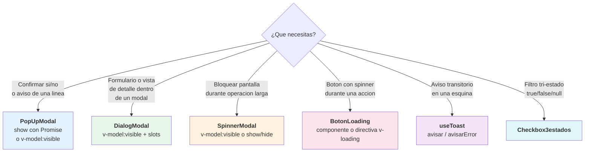

# Sesión 10: Otros componentes internos (~90 min)

<!-- [[toc]] -->

::: info CONTEXTO
En las sesiones anteriores construimos componentes y composables a mano para entender los mecanismos de Vue. Ahora vemos los componentes de **`@vueua/components`** — la libreria oficial de la UA — que cubren los patrones repetidos (modales, toasts, botones con spinner, …) ya resueltos.

**Al terminar esta sesión sabrás:**
- Elegir el componente UA correcto frente a un caso real
- Usar las dos APIs (declarativa con `v-model:visible` e imperativa con `ref + show()`) y cuándo elegir cada una
- Encajar varios componentes UA en un flujo CRUD completo
- Entender qué hace `Teleport` y por qué los modales lo usan por dentro
:::

## Plan de sesión (90 min) {#plan-90}

| Bloque | Tiempo | Contenido |
|--------|--------|-----------|
| **Teoría guiada** | 45 min | 10.1 a 10.7 (árbol de decisión + componentes uno a uno + Teleport) |
| **Práctica en aula** | 25 min | Demo integradora CRUD mock (`Sesion10CrudRecursos.vue`) |
| **Test de sesión** | 15 min | Preguntas rápidas en formato desplegable y corrección grupal |
| **Cierre** | 5 min | Dudas y enlace con sesiones de integración (11-14) |

::: tip ENFOQUE DIDÁCTICO
Cada componente se presenta junto con su demo abrible en `uareservas/sesiones-vue/sesion-10/...`. Abre el código y modifica valores: es la forma más rápida de fijar la API.
:::

## 10.1 ¿Qué componente UA elegir? {#decision}

Antes de ver la API de cada uno, fija el árbol de decisión: el alumno que se sienta frente a una pantalla nueva debe poder elegir en 10 segundos qué componente UA usa.



<!-- diagram id="s10-decision-modales" caption: "Elegir el componente UA correcto segun la necesidad" -->

::: tip CONVIVENCIA DE APIs
Desde `@vueua/components` 1.1.11, `PopUpModal` y `SpinnerModal` aceptan **dos APIs simultáneas**: la declarativa con `v-model:visible` y la imperativa con `ref + show()/hide()`. Las dos son válidas y conviven sin romper código existente. Las primeras tres secciones de esta sesión muestran ambas formas y cuándo elegir cada una.
:::

## 10.2 `PopUpModal` · confirmaciones y avisos breves {#popup-modal}

Modal pensado para decisiones cortas: "¿Eliminar?", "Operación completada", "¿Estás seguro?". No lleva formulario dentro; si tu caso lo necesita, salta a `DialogModal`.

::: code-group

```vue [Declarativo (v-model:visible)]
<script setup lang="ts">
import { ref } from 'vue';
import { PopUpModal } from '@vueua/components/ui/popup-modal';

const abierto = ref(false);

function eliminar() {
  // Llamar a la API, recargar la tabla...
  abierto.value = false;
}
</script>

<template>
  <button class="btn btn-danger" @click="abierto = true">Eliminar</button>

  <PopUpModal v-model:visible="abierto" @confirmar="eliminar">
    <template #header>Eliminar reserva</template>
    <template #body>Esta accion no se puede deshacer.</template>
  </PopUpModal>
</template>
```

```vue [Imperativo (show + Promise)]
<script setup lang="ts">
import { ref } from 'vue';
import { PopUpModal } from '@vueua/components/ui/popup-modal';

const popupRef = ref<InstanceType<typeof PopUpModal>>();

async function eliminar() {
  const ok = await popupRef.value?.show();
  if (!ok) return;
  // Llamar a la API, recargar la tabla...
}
</script>

<template>
  <button class="btn btn-danger" @click="eliminar">Eliminar</button>

  <PopUpModal ref="popupRef">
    <template #header>Eliminar reserva</template>
    <template #body>Esta accion no se puede deshacer.</template>
  </PopUpModal>
</template>
```

:::

::: tip CRITERIO DE ELECCIÓN
- **Declarativo** cuando la visibilidad forma parte del estado del componente (otros bloques de la UI también la consultan o cambian).
- **Imperativo** cuando el flujo natural es `await modal.show()` en mitad de una función `async` y solo te interesa el resultado en ese punto.
:::

[Demo abrible: `/uareservas/sesiones-vue/sesion-10/popup-modal`](/uareservas/sesiones-vue/sesion-10/popup-modal)

## 10.3 `DialogModal` · formularios y vistas de detalle {#dialog-modal}

Modal generalista con slots `#header`, `#body` y `#buttons`. Ideal cuando dentro va un formulario o una ficha de detalle. Recuerda el patrón de slots que vimos en la sesión 8: el padre decide qué HTML va en cada hueco.

```vue
<script setup lang="ts">
import { ref } from 'vue';
import { DialogModal } from '@vueua/components/ui/dialog-modal';

const editando = ref(false);
const recurso = ref({ nombre: '', tipo: 'Aula' });

async function guardar() {
  // POST/PUT a la API...
  editando.value = false;
}
</script>

<template>
  <button class="btn btn-primary" @click="editando = true">Editar recurso</button>

  <DialogModal
    v-model:visible="editando"
    titulo="Editar recurso"
    :cerrado-automatico="false"
    @confirmar="guardar"
  >
    <template #body>
      <form novalidate>
        <div class="mb-3">
          <label class="form-label">Nombre</label>
          <input v-model="recurso.nombre" class="form-control autofocus" required />
        </div>
        <div class="mb-3">
          <label class="form-label">Tipo</label>
          <select v-model="recurso.tipo" class="form-select">
            <option>Aula</option>
            <option>Sala</option>
            <option>Equipo</option>
          </select>
        </div>
      </form>
    </template>
  </DialogModal>
</template>
```

::: warning IMPORTANTE
`:cerrado-automatico="false"` evita que el modal se cierre al pulsar "Aceptar" antes de que termine la validacion / llamada a la API. Vuelve a poner `editando = false` solo cuando el `await` haya terminado correctamente.
:::

[Demo abrible: `/uareservas/sesiones-vue/sesion-10/dialog-modal`](/uareservas/sesiones-vue/sesion-10/dialog-modal)

## 10.4 `SpinnerModal` · bloquear pantalla durante operación larga {#spinner-modal}

Cuando una operación dura más de medio segundo y no se puede acompañar con un `BotonLoading` (por ejemplo, porque la disparas tú al cargar la página, no desde un botón), bloquea la pantalla con `SpinnerModal`.

```vue
<script setup lang="ts">
import { ref, onMounted } from 'vue';
import { SpinnerModal } from '@vueua/components/ui/spinner-modal';
import { useRecursos } from '@/composables/useRecursos';

const { recursos, cargando, cargar } = useRecursos();

onMounted(() => cargar());
</script>

<template>
  <SpinnerModal
    v-model:visible="cargando"
    titulo="Cargando recursos"
    mensaje="Conectando con el servidor…"
  />
  <ul v-if="!cargando">
    <li v-for="r in recursos" :key="r.id">{{ r.nombre }}</li>
  </ul>
</template>
```

Una **sola variable booleana** (`cargando`) gobierna a la vez la visibilidad del modal y el `v-if` que decide si pintar la lista. Es el caso típico de "una fuente de verdad" que vimos en la sesión 8.

[Demo abrible: `/uareservas/sesiones-vue/sesion-10/spinner-modal`](/uareservas/sesiones-vue/sesion-10/spinner-modal)

## 10.5 `BotonLoading` · botón con spinner integrado {#boton-loading}

Cuando el usuario pulsa un botón y la operación tarda, hay dos cosas que evitar:
1. Que vuelva a hacer click pensando que no ha pasado nada (doble envío).
2. Que se quede sin feedback visual.

`BotonLoading` resuelve las dos. Existe en **dos formas**:

::: code-group

```vue [Como componente]
<script setup lang="ts">
import { ref } from 'vue';
import { BotonLoading } from '@vueua/components/ui/boton-loading';

const guardando = ref(false);

async function guardar() {
  guardando.value = true;
  try {
    await guardarEnServidor();
  } finally {
    guardando.value = false;
  }
}
</script>

<template>
  <BotonLoading class="btn btn-primary" :loading="guardando" @click="guardar">
    Guardar
  </BotonLoading>
</template>
```

```vue [Como directiva v-loading]
<script setup lang="ts">
import { ref } from 'vue';
import { loadingDirective as vLoading } from '@vueua/components/ui/boton-loading';

const enviando = ref(false);
async function enviar() {
  enviando.value = true;
  try { await enviarFormulario(); } finally { enviando.value = false; }
}
</script>

<template>
  <button v-loading="enviando" :disabled="enviando" class="btn btn-success" @click="enviar">
    Enviar
  </button>
</template>
```

:::

::: tip CUANDO CADA VARIANTE
- **Componente**: cuando arrancas un botón nuevo. Más conciso.
- **Directiva**: cuando ya tienes el botón tal cual lo quieres y solo necesitas añadir el spinner.
:::

::: warning ANTIPATRON
Mientras `guardando = true`, el botón está deshabilitado. **No** olvides el `try/finally`: si el `await` lanza una excepción y no vuelves a poner `false`, el botón queda inservible hasta recargar la página.
:::

[Demo abrible: `/uareservas/sesiones-vue/sesion-10/boton-loading`](/uareservas/sesiones-vue/sesion-10/boton-loading)

## 10.6 `useToast` · avisos transitorios {#use-toast}

Notificaciones globales que aparecen en una esquina y se cierran solas. Se usan para **confirmar acciones** ("Guardado correctamente"), **avisar de errores** ("No se ha podido contactar") y **informar de procesos en curso**.

```ts
import {
  avisar,
  avisarError,
  avisarPersonalizado,
  cerrarToastsPorGrupo,
} from '@vueua/components/composables/use-toast';

avisar('Guardado', 'Los datos se han guardado correctamente');
avisarError('Error', 'No se ha podido contactar con el servidor');
avisarPersonalizado('Aviso', 'Quedan 3 plazas libres', 'aviso', 5000);

// Grupos: relacionar varios toasts y cerrarlos juntos
avisar('Recurso 1 guardado', 'Aula 12', 'es', 'reservas');
avisar('Recurso 2 guardado', 'Sala A', 'es', 'reservas');
cerrarToastsPorGrupo('reservas');
```

::: tip CUANDO USAR TOAST O MODAL
- **Toast**: información que el usuario puede ignorar y no bloquea el flujo (éxito, aviso suave).
- **Modal**: información que el usuario debe leer antes de seguir (errores graves, confirmaciones).
:::

::: warning REQUISITO DE MONTAJE
El contenedor `<ToastContainer />` debe estar en `App.vue` (o se monta solo en el primer aviso). En `uaReservas` ya está montado explícitamente.
:::

[Demo abrible: `/uareservas/sesiones-vue/sesion-9/use-toast`](/uareservas/sesiones-vue/sesion-9/use-toast) (introducido en la sesión 9)

## 10.7 `Checkbox3estados` · filtros con `boolean | null` {#checkbox3estados}

Un checkbox normal tiene dos estados: marcado / no marcado. En filtros, falta un tercero: **"da igual / no filtrar"**. `Checkbox3estados` da los tres con un único `v-model`:

```vue
<script setup lang="ts">
import { ref, computed } from 'vue';
import { Checkbox3estados } from '@vueua/components/ui/checkbox-3-estados';

const recursos = [
  { id: 1, nombre: 'Aula 12',  activo: true },
  { id: 2, nombre: 'Aula 14',  activo: false },
  { id: 3, nombre: 'Sala A',   activo: true },
];

const filtroActivo = ref<boolean | null>(null);

const filtrados = computed(() =>
  recursos.filter(r => filtroActivo.value === null || r.activo === filtroActivo.value),
);
</script>

<template>
  <Checkbox3estados v-model="filtroActivo" id="filtroActivo" />
  <label for="filtroActivo">Activo</label>

  <p>Mostrando: {{ filtroActivo === null ? 'todos' : filtroActivo ? 'solo activos' : 'solo inactivos' }}</p>
</template>
```

::: tip CONTRATO RECOMENDADO
Tipa la variable como `boolean | null`. Aunque el componente admite valores laxos, este contrato es el más estable.
:::

[Demo abrible: `/uareservas/sesiones-vue/sesion-10/checkbox-3-estados`](/uareservas/sesiones-vue/sesion-10/checkbox-3-estados)

## 10.8 `Teleport` · renderizar fuera del árbol {#teleport}

Es una directiva **de Vue, no de la UA**, pero entender qué hace ayuda a entender por qué los modales y toasts UA funcionan como funcionan.

Un modal técnicamente vive como hijo de tu componente. Pero visualmente debe aparecer **por encima de todo** y centrado en la pantalla. Si lo dejas dentro del árbol normal, el CSS del padre (un `overflow: hidden`, un `position: relative`, un `z-index` raro) te lo va a romper. `Teleport` lo mueve al DOM al elemento que tú elijas (típicamente `<body>`):

```vue
<template>
  <div class="card">
    <h3>Mi tarjeta</h3>

    <!-- Este modal aparece bajo <body>, no dentro de .card -->
    <Teleport to="body">
      <div v-if="abierto" class="mi-modal">
        Contenido del modal
      </div>
    </Teleport>
  </div>
</template>
```

::: info QUE HACE EXACTAMENTE
Vue sigue tratando el contenido teletransportado como parte del componente (reactividad, eventos, lifecycle), pero lo monta físicamente en otro punto del DOM. `PopUpModal`, `DialogModal`, `SpinnerModal` y `ToastContainer` lo usan internamente — no tienes que escribir `Teleport` tú al usarlos.
:::

::: details ¿Y `vueua-autocomplete`?

El componente `vueua-autocomplete` (búsqueda remota con selección) figura en el temario maestro pero se aplaza intencionadamente: necesita `useAxios` para mostrar su potencia, y `useAxios` se introduce en la sesión 11. Lo retomamos en la sesión 14 (DataTable + autocomplete) cuando todas las piezas estén disponibles.

:::

## 10.9 Demo integradora: CRUD completo {#integradora}

[Demo abrible: `/uareservas/sesiones-vue/sesion-10/crud-recursos`](/uareservas/sesiones-vue/sesion-10/crud-recursos)

Combina en un único flujo los componentes vistos: listar recursos, filtro triestado, crear con `DialogModal`, eliminar con `PopUpModal`, spinner global al cargar, toasts de éxito/error y `BotonLoading` en el botón guardar. Sigue funcionando con datos mock (el composable real con `useAxios` llega en la sesión 11).

## 10.10 Siguiente sesión {#siguiente}

En la sesión 11 (parte de Integración) sustituiremos el servicio mock por llamadas reales a la API con `useAxios` y veremos la autenticación CAS/JWT. El código de las demos de esta sesión **no necesitará cambios** en las capas de vista ni de composable.

## Test Sesión 10 {#test}

::: details 1. ¿Cuándo usar `PopUpModal` en lugar de `DialogModal`?
- a) Siempre que haya botones
- b) Para confirmaciones cortas o avisos de una línea
- c) Solo en formularios largos
- d) Cuando no hay backdrop
:::

::: details 2. ¿Qué API te permite usar `await modal.show()` y recibir un boolean del usuario?
- a) Declarativa con `v-model:visible`
- b) Imperativa con `ref` y `show()`
- c) Las dos a la vez
- d) Ninguna
:::

::: details 3. ¿Qué garantiza el `try/finally` en un botón con `BotonLoading`?
- a) Que la API responde antes de timeout
- b) Que el botón vuelve a estar disponible aunque la operación falle
- c) Que el spinner sea más rápido
- d) Que se evita el clic
:::

::: details 4. ¿Qué resuelve `Checkbox3estados` que un checkbox normal no?
- a) Estilos de Bootstrap
- b) Acepta `null` como "sin filtrar"
- c) Evita re-render
- d) No requiere `v-model`
:::

::: details 5. ¿Para qué sirve `Teleport`?
- a) Mover el componente a otra ruta
- b) Renderizar contenido en otro punto del DOM (típicamente `<body>`) sin perder reactividad
- c) Sustituir a `Pinia`
- d) Activar SSR
:::

::: details Ver respuestas
1. b) Confirmaciones cortas o avisos de una línea.
2. b) Imperativa con `ref` y `show()`.
3. b) Que el botón vuelve a estar disponible aunque la operación falle.
4. b) Acepta `null` como "sin filtrar".
5. b) Renderizar contenido en otro punto del DOM sin perder reactividad.
:::

## Referencias {#referencias}

- [Documentación de `@vueua/components`](https://preproddesa.campus.ua.es/ComponentesVue/) — catálogo y demos en vivo.
- [Skill `ua-validacion`](../../../profesor/) — para encadenar este bloque con la validación cross-capa de la sesión 12.
- Sesión 8 — slots, lifecycle, `defineModel` (base teórica de `DialogModal` y `SpinnerModal`).
- Sesión 9 — composables, `useToast`, `BotonLoading`, arquitectura tres capas (base de la demo integradora).
