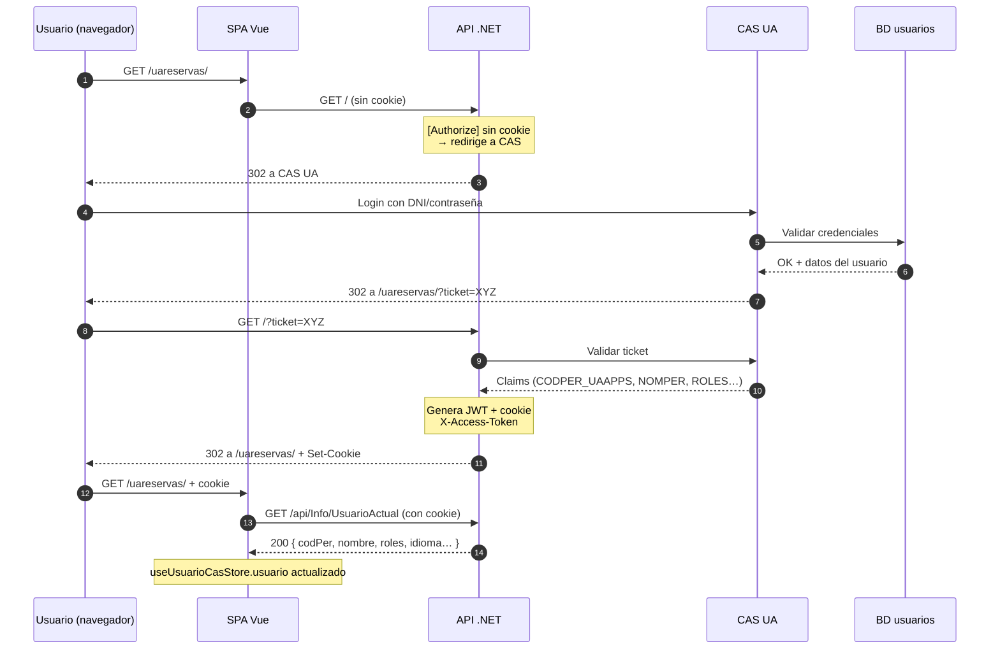
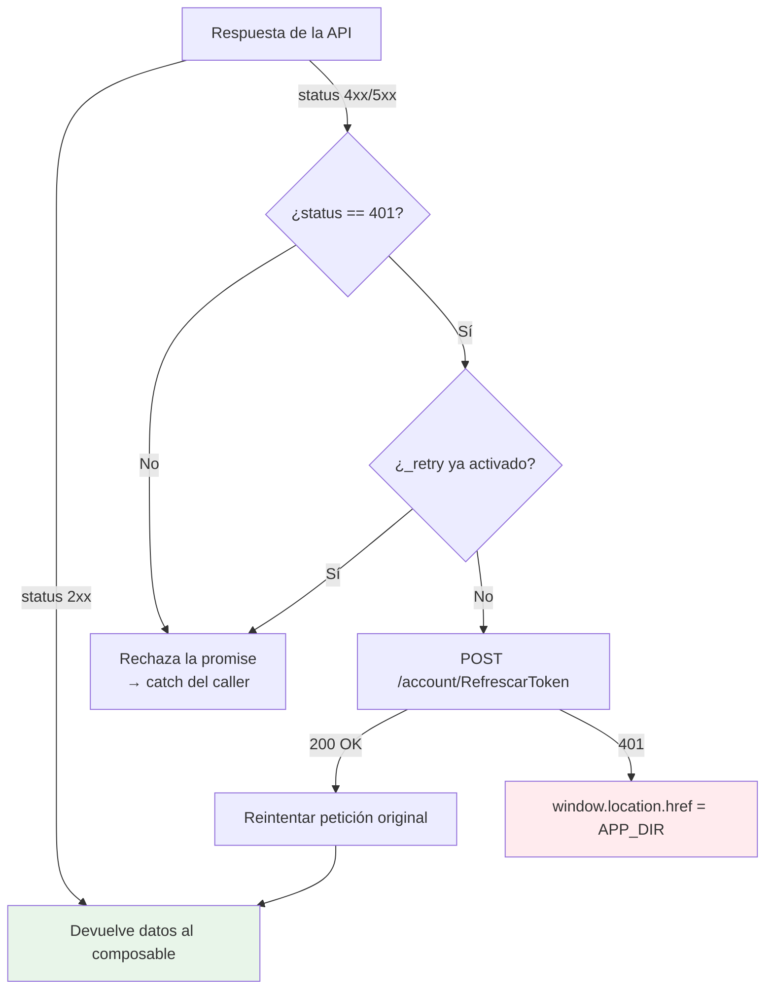
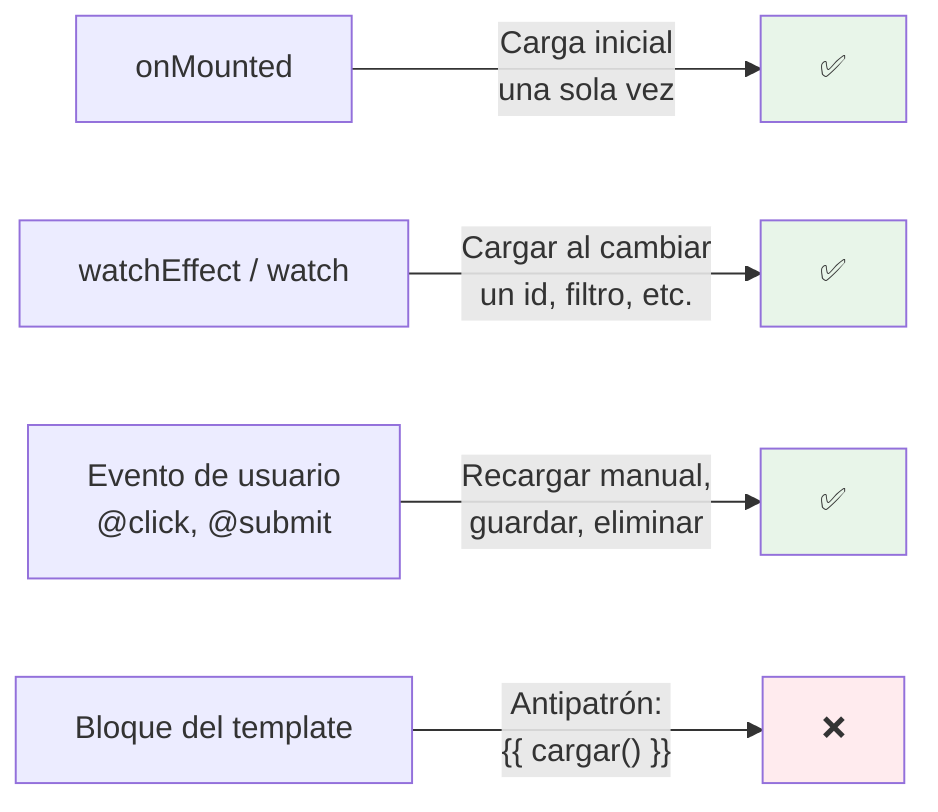
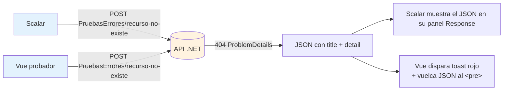

# Sesión 11: Llamadas a la API y autenticación

[[toc]]

::: info CONTEXTO
En las sesiones anteriores el bloque Vue (6-10) trabajó con servicios **mock**: `recursosServicioMock.ts` devolvía un array en memoria con un `setTimeout` que simulaba latencia. A partir de esta sesión sustituimos el mock por la API real de `uaReservas`. La vista y el composable **no cambian** — solo el servicio.

Para entender qué viaja, también necesitamos saber **quién es el usuario**: cómo el navegador prueba al servidor que estamos identificados (cookie de sesión + token JWT) y cómo `.NET` y Vue leen esos datos.
:::

## Objetivos

Al finalizar esta sesión, el alumno será capaz de:

- Explicar el flujo completo de autenticación CAS → cookie → JWT y cuándo se refresca el token.
- Leer los **claims** del usuario tanto en `.NET` (`ControladorBase`) como en Vue (`useUsuarioCasStore`).
- Elegir entre `peticion<T>` (async/await) y `useAxios` reactivo según el caso.
- Entender los dos **interceptores** de `HttpApi` y qué problema resuelve cada uno.
- Decidir entre `onMounted`, `watchEffect` y eventos de usuario para disparar cargas de datos.
- Usar `v-if` / `v-else` y spinners de la librería UA para representar los estados de carga, éxito y error.
- Explorar y probar la API desde **Scalar** sin cliente Vue.

## 11.1 Autenticación: CAS, cookies y JWT {#autenticacion}

La aplicación `uaReservas` usa el paquete `PlantillaMVCCore.Identificacion` que envuelve el flujo CAS (Central Authentication Service) de la UA. El alumno **no implementa el login**: viene resuelto. Pero hay que entender el recorrido para saber qué leer en cada capa.

### 11.1.1 Vista general del flujo



<!-- diagram id="s11-auth-flow" caption: "Recorrido de la autenticación CAS hasta que la SPA tiene cookie y conoce al usuario" -->

### 11.1.2 Las dos cabeceras que viajan en cada petición

Una vez identificado el usuario, **cada llamada** desde Vue lleva por sí sola dos piezas:

| Pieza | Quién la pone | Para qué sirve |
|-------|---------------|----------------|
| `Cookie: X-Access-Token=…` | El navegador, automáticamente | Demuestra al servidor que ya pasamos por CAS. Contiene el JWT firmado. |
| `Content-Language: es \| ca \| en` | `HttpApi` (axios) | Indica el idioma del usuario para que la API localice los `ProblemDetails`. |

::: tip POR QUÉ COOKIE Y NO `Authorization: Bearer`
La UA elige cookie `HttpOnly` por dos motivos: (1) bloquea acceso desde JavaScript (mitigación de XSS) y (2) el navegador la envía sola en todas las llamadas mismo-origen, evitando que cada `useAxios` tenga que adjuntar el token a mano. La SPA **nunca** lee el JWT directamente.
:::

### 11.1.3 Refresco automático del JWT

El JWT caduca antes que la sesión CAS. El interceptor de respuestas de `HttpApi` detecta el `401 Unauthorized`, llama a `/account/RefrescarToken` (renueva la cookie) y **reintenta la petición original** sin que el usuario se entere. Lo veremos en §11.4.

::: warning IMPORTANTE
Si el refresco también devuelve 401 (porque la sesión CAS expiró), `HttpApi` redirige a `/` y el ciclo del primer diagrama vuelve a empezar. No hace falta capturar este caso manualmente.
:::

## 11.2 Claims del usuario: leerlos en .NET y en Vue {#claims}

El JWT codifica varias **claims** (campo `nombre` → `valor`). En cada capa hay un lector idiomático.

### 11.2.1 En .NET — `ControladorBase`

`ControladorBase` (en `Controllers/Apis/ControladorBase.cs`) expone los claims más usados como **propiedades protegidas**, para que ningún controlador tenga que leer `User.FindFirstValue(...)` repetidamente:

```csharp
public abstract class ControladorBase : ApiControllerBase
{
    protected string Idioma => ObtenerIdiomaPeticion();   // "es" | "ca" | "en"
    protected int    CodPer { get { /* claim CODPER_UAAPPS */ } }
    protected string NombrePersona => User?.FindFirstValue("NOMPER") ?? string.Empty;
    protected string Correo        => User?.FindFirstValue("CORREO") ?? string.Empty;
    protected string DniConLetra   => User?.FindFirstValue("DNICONLETRA") ?? string.Empty;
    protected string PathFoto      => User?.FindFirstValue("PATHFOTO") ?? string.Empty;
    protected List<string> Roles  { get { /* claim ROLES, separa por ',' o ';' */ } }
}
```

Cualquier controlador que herede de `ControladorBase` lee al usuario actual con la sintaxis natural de C#:

```csharp
[HttpGet("Mias")]
public async Task<ActionResult> ListarMisReservasAsync() =>
    HandleResult(await _reservas.ListarPorCodPerAsync(CodPer, Idioma));
```

::: tip BUENA PRÁCTICA — claims al backend, nunca al body
Identidad y autorización **se leen del JWT**. Si una API recibe `codPer` por body o querystring, cualquier usuario podría suplantar a otro. La regla es **`Authorize` + `User.Claims`**, no parámetros de entrada.
:::

### 11.2.2 En Vue — `useUsuarioCasStore`

En el cliente, `@vueua/components` expone un store Pinia con los datos básicos del usuario. Internamente lo rellena llamando al endpoint `/api/Info/UsuarioActual` la primera vez que la app arranca:

```ts
// Forma del store (interfaz UsuarioCas)
interface UsuarioCas {
  DatosCargados: boolean
  Nombre: string
  Idioma: string         // "es" | "ca" | "en"
  Foto: string
  Roles: string[]
}
```

Uso típico en un componente:

```html
<script setup lang="ts">
import { useUsuarioCasStore } from '@vueua/components/core/plantilla-uacloud'

const store = useUsuarioCasStore()

// Helper que devuelve true si tiene cualquiera de los roles indicados.
const puedeAdministrar = () => store.estaAutorizado(['admin', 'reservas-gestion'])
</script>

<template>
  <p>Hola, {{ store.usuario.Nombre }}</p>
  <button v-if="puedeAdministrar()" class="btn btn-primary">Gestionar</button>
</template>
```

El probador del bloque .NET (botón **`GET /api/Info/UsuarioActual`**) imprime los mismos datos en bruto: ese JSON es exactamente lo que rellena el store.

::: info DOS LECTORES, MISMA FUENTE
Tanto `ControladorBase.CodPer` como `store.usuario.Nombre` salen del **mismo JWT**. La diferencia es que el servidor lo lee del header (cookie HttpOnly que axios envía sin verlo) y el cliente lo lee del JSON que la propia API devuelve. La SPA nunca decodifica el token.
:::

## 11.3 Llamadas a la API desde Vue {#llamadas-api}

El paquete `@vueua/components/composables/use-axios` ofrece **tres niveles** sobre `axios`. Elegir el correcto evita reinventar plumbing.

### 11.3.1 Tabla resumen

| Nivel | Cuándo usarlo | Devuelve |
|-------|---------------|----------|
| `peticion<T>(url, verbo, params?)` | Llamada **puntual** dentro de una función `async`. El 90 % del código. | `Promise<T>` |
| `llamadaAxios(url, verbo, params?)` | Necesitas **refs reactivas** (`data`, `isLoading`, `error`) para usar directamente en el template. | `UseAxiosReturn<T>` (refs) |
| `HttpApi` | Acceso directo a la instancia axios. Solo cuando ninguna de las anteriores encaja (config custom, requests paralelas, cancelación). | `AxiosInstance` |

::: tip REGLA PRÁCTICA
Empieza siempre con `peticion`. Si descubres que estás creando manualmente `ref(false)` para `cargando`, `ref(null)` para `error` y similares, plantea pasar a `llamadaAxios`.
:::

### 11.3.2 `peticion<T>` con `async/await`

Es la forma idiomática para cargas únicas (listas, detalles, guardados). Esta es la forma del servicio real que reemplaza al mock de la sesión 9:

```ts
// src/services/recursosServicio.ts (real, sustituye a recursosServicioMock)
import { peticion, verbosAxios } from '@vueua/components/composables/use-axios'

export interface IClaseRecursoDto {
  Id: number; Nombre: string; Tipo: string; Activo: boolean
}

export function useRecursosServicio() {
  async function listar(): Promise<IClaseRecursoDto[]> {
    return await peticion<IClaseRecursoDto[]>('Recursos', verbosAxios.GET)
  }

  async function obtenerPorId(id: number): Promise<IClaseRecursoDto | null> {
    return await peticion<IClaseRecursoDto | null>(`Recursos/${id}`, verbosAxios.GET)
  }

  async function crear(dto: Omit<IClaseRecursoDto, 'Id'>): Promise<number> {
    return await peticion<number>('Recursos', verbosAxios.POST, dto)
  }

  async function actualizar(id: number, dto: IClaseRecursoDto): Promise<void> {
    await peticion<void>(`Recursos/${id}`, verbosAxios.PUT, dto)
  }

  async function eliminar(id: number): Promise<void> {
    await peticion<void>(`Recursos/${id}`, verbosAxios.DELETE)
  }

  return { listar, obtenerPorId, crear, actualizar, eliminar }
}
```

El composable `useRecursos` de la sesión 9 solo cambia la línea del servicio:

```ts
// import { useRecursosServicioMock } from '@/services/recursosServicioMock'
import { useRecursosServicio as useRecursosServicioMock } from '@/services/recursosServicio'
```

La vista no se toca.

### 11.3.3 Mensajes integrados (`MensajesAxios`)

`peticion` admite un objeto opcional `mensajes` con cuatro slots: `pre`, `loading`, `ok`, `error`. Cada uno se traduce a un toast automáticamente:

```ts
await peticion<void>(`Reservas/${id}`, verbosAxios.DELETE, null, {
  loading: { titulo: 'Eliminando', contenido: 'Borrando la reserva…' },
  ok:      { titulo: 'Hecho',     contenido: 'Reserva eliminada.' },
  error:   { titulo: 'Error',     contenido: 'No se pudo eliminar.' },
})
```

El toast de `loading` se cierra **solo** cuando la respuesta llega (200, 400 o 500) — lo veremos al hablar de los interceptores.

### 11.3.4 `llamadaAxios` (reactivo)

Construido sobre `useAxios` de **VueUse**. Devuelve refs que ya puedes usar en el template:

```html
<script setup lang="ts">
import { llamadaAxios, verbosAxios } from '@vueua/components/composables/use-axios'

const { data: recursos, isLoading, error, execute } = llamadaAxios(
  'Recursos', verbosAxios.GET, null, null, false,
)
</script>

<template>
  <button class="btn btn-primary" :disabled="isLoading" @click="execute">Recargar</button>

  <p v-if="isLoading">Cargando…</p>
  <p v-else-if="error" class="alert alert-danger">{{ error.message }}</p>
  <ul v-else class="list-group">
    <li v-for="r in recursos" :key="r.Id" class="list-group-item">{{ r.Nombre }}</li>
  </ul>
</template>
```

::: tip CUÁNDO USAR CADA UNO
- `peticion` cuando el dato pasa por **lógica intermedia** (transformación, validación, encadenar varias llamadas) antes de pintarse.
- `llamadaAxios` cuando el flujo es **directo**: cargo y muestro. Menos código boilerplate.
:::

## 11.4 Interceptores de `HttpApi`: el secreto del 401 y los toasts {#interceptores}

`HttpApi` es la instancia única de `axios` que comparten `peticion` y `llamadaAxios`. Se crea una vez:

```ts
export const HttpApi: AxiosInstance = axios.create({
  baseURL: DEFAULT_BASE_URL,        // p.ej. /uareservas/api/
  withCredentials: true,            // adjunta automáticamente la cookie de sesión
  headers: { 'Content-Type': 'application/json' },
})
```

Dos interceptores se encargan del trabajo "invisible":

### 11.4.1 Interceptor de **request**: normaliza URLs

```ts
HttpApi.interceptors.request.use(config => {
  if (config.baseURL) config.baseURL = normalizarUrlBaseAplicacion(config.baseURL)
  if (typeof config.url === 'string') config.url = normalizarHostnameUrl(config.url)
  return config
})
```

Lo único que hace: arregla barras finales y dominios cuando la app está montada bajo un `PathBase` (`/uareservas`). Por eso podemos llamar a `peticion('Recursos', ...)` sin escribir la base.

### 11.4.2 Interceptor de **response**: 401 → refresco → reintento

Aquí está la mayor parte de la magia:



<!-- diagram id="s11-interceptor-401" caption: "Interceptor de respuesta: refresca el JWT en silencio si caduca y reintenta la llamada original" -->

Detalles importantes que se ven en el código de la librería:

| Detalle | Por qué importa |
|---------|-----------------|
| `_retry = true` en la config original | Evita un bucle infinito si el refresco también devuelve 401 con la misma petición. |
| `_refreshPromise` compartido | Si caen 401 simultáneos (10 peticiones en paralelo), solo se llama una vez a `/RefrescarToken`. Las demás esperan a esa promesa. |
| Cierre del toast `idloading` | Si la petición se hizo con `mensajes.loading`, el interceptor cierra el toast en `response`, no en el `try/finally` del caller. Por eso no hace falta limpiarlo a mano. |
| `redirigirError: true` (opcional) | Redirige a una página de error global en vez de rechazar la promise. Pensado para errores 5xx no recuperables. |

::: tip CÓMO ENCAJAN INTERCEPTORES + `gestionarError`
El **interceptor** decide si reintentar o redirigir, pero **no muestra toasts** salvo el cierre del loading. La función `gestionarError` (sesión 1 §1.8.5) sí decide qué toast lanzar según el `status` final. División de tareas: interceptor = plumbing, `gestionarError` = UX.
:::

### 11.4.3 Configurar `HttpApi` al arrancar la app

`main.ts` llama una sola vez a las funciones de configuración:

```ts
import { setRouter, setIdioma } from '@vueua/components/composables/use-axios'

setRouter(router)         // necesario para que el interceptor pueda navegar a ErrorPage
setIdioma('es')           // cabecera Content-Language por defecto
// setUrl('/uareservas/api')   // solo si la URL difiere de /api desde la raíz
```

La plantilla UA ya las invoca en su `boot`. Solo necesitas tocarlas si configuras un endpoint atípico.

## 11.5 Estados de carga: cuándo, dónde y cómo {#estados-carga}

Cargar datos sin pensar en los estados intermedios produce siempre la misma sensación: "la app está rota porque tarda". Vue ofrece varios sitios donde lanzar la carga y varias maneras de representarla.

### 11.5.1 Dónde disparar la carga



<!-- diagram id="s11-cuando-cargar" caption: "Tres sitios válidos para iniciar carga; el cuarto es un antipatrón" -->

| Disparador | Caso típico |
|------------|-------------|
| `onMounted(async () => { await cargar() })` | Cargar la lista la primera vez que se entra en la vista. |
| `watch(idRecurso, cargarDetalle)` | El usuario cambia el id en una URL `?id=…` o un select y queremos refrescar el detalle. |
| `watchEffect(async () => { await cargar(filtro.value) })` | Filtro reactivo: cualquier `ref` leído dentro dispara la recarga. Cuidado con el rebote — añadir `debounce`. |
| `@click="recargar"` | Botón "Recargar" o "Reintentar" tras error. |

::: warning EVITAR
Nunca llames a una función async desde el template (`{{ cargar() }}`). El template se reevalúa decenas de veces y dispararás peticiones repetidas y rebotes infinitos.
:::

### 11.5.2 Patrón canónico en el composable

El esqueleto que ya viste en la sesión 9 sigue valiendo. Solo hay que **mantener los tres estados** (`cargando`, `error`, datos) coherentes:

```ts
export function useRecursos() {
  const recursos = ref<IClaseRecurso[]>([])
  const cargando = ref(false)
  const error    = ref<string | null>(null)

  async function cargar() {
    cargando.value = true
    error.value = null
    try {
      const dtos = await servicio.listar()    // peticion<T> debajo
      recursos.value = dtos.map(dtoARecurso)
    } catch (e) {
      // El interceptor ya manejó 401/refresh. Aquí solo guardamos el mensaje.
      error.value = e instanceof Error ? e.message : 'Error desconocido'
    } finally {
      cargando.value = false                  // SIEMPRE: éxito o fallo
    }
  }

  return { recursos, cargando, error, cargar }
}
```

::: tip POR QUÉ SIEMPRE `try / finally`
Si el `catch` solo apaga `cargando` cuando va todo bien, en cualquier error la pantalla se queda atascada con el spinner y el botón deshabilitado. `finally` garantiza la salida correcta haya o no excepción.
:::

### 11.5.3 Representar los estados en el template

Hay un patrón de cuatro ramas que cubre todos los casos:

```html
<template>
  <!-- 1. Cargando inicial: spinner inline o SpinnerModal global -->
  <div v-if="cargando && recursos.length === 0" class="text-center my-5">
    <div class="spinner-border" role="status"></div>
    <p class="mt-2 text-muted">Cargando recursos…</p>
  </div>

  <!-- 2. Error: muestra mensaje + botón reintentar -->
  <div v-else-if="error" class="alert alert-danger">
    <p>{{ error }}</p>
    <button class="btn btn-sm btn-outline-danger" @click="cargar">Reintentar</button>
  </div>

  <!-- 3. Vacío: lista cargada pero sin elementos -->
  <p v-else-if="recursos.length === 0" class="text-muted">
    No hay recursos. Crea el primero.
  </p>

  <!-- 4. Datos: el caso "feliz" -->
  <table v-else class="table table-striped">
    <tbody>
      <tr v-for="r in recursos" :key="r.id">…</tr>
    </tbody>
  </table>

  <!-- Spinner GLOBAL solo si recargamos con datos ya en pantalla -->
  <SpinnerModal v-model:visible="cargando && recursos.length > 0"
                titulo="Actualizando" mensaje="Recargando datos…" />
</template>
```

::: tip BUENA PRÁCTICA — `v-if` y `v-else-if` se excluyen entre sí
El `v-else-if` garantiza que **solo una rama** se renderiza. Es más legible y eficiente que cuatro `v-if` independientes (que se podrían pisar). Usa `v-show` solo cuando el cambio es muy frecuente (toggles, tabs) y el bloque es ligero.
:::

### 11.5.4 Cuándo usar qué spinner

| Pieza UA | Caso |
|----------|------|
| Spinner inline (`<div class="spinner-border">`) | Carga inicial dentro de una zona acotada. |
| `BotonLoading` (sesión 9) | Operaciones disparadas desde un botón. |
| `SpinnerModal` (sesión 10) | Carga **bloqueante**: el usuario no debe interactuar mientras dura. |
| Toast `'espera'` (`mensajes.loading`) | Operación de fondo: no bloquea, solo informa. El interceptor lo cierra solo. |

## 11.6 Explorar y probar la API con OpenAPI y Scalar {#openapi-scalar}

`uaReservas` publica su contrato OpenAPI en `/uareservas/openapi/v1.json` y la UI de **Scalar** en `/uareservas/scalar`. Es el sitio natural para **probar la API sin escribir Vue**.

### 11.6.1 Para qué sirve Scalar en esta sesión

| Caso | Cómo lo aprovechas en Scalar |
|------|------------------------------|
| Construir un servicio Vue por primera vez | Copias la URL y el JSON de ejemplo desde Scalar y los pegas en `peticion<T>(...)`. |
| Reproducir un bug | Pruebas el endpoint en Scalar primero: si falla allí, el problema **no** está en Vue. |
| Verificar localización | Cambias la cabecera `Content-Language` en Scalar (`es` / `ca` / `en`) y miras cómo cambia `Detail` en los errores. |
| Ver claims | El botón **`GET /api/Info/UsuarioActual`** desde Scalar imprime el mismo JSON que rellena `useUsuarioCasStore`. |

### 11.6.2 Probar un error 400 desde Scalar y desde Vue

Tanto el probador de Vue (`Sesion1ProbadorApi.vue`) como Scalar invocan los mismos endpoints `PruebasErrores/*`. La diferencia es donde ves el resultado:



<!-- diagram id="s11-scalar-vs-vue" caption: "Mismo endpoint, dos exploradores: Scalar y el probador Vue" -->

::: tip FLUJO RECOMENDADO PARA CONSTRUIR UN SERVICIO NUEVO
1. En **Scalar**, encuentra el endpoint y prueba que devuelve el JSON esperado.
2. Copia la interface del DTO desde la sección _Schemas_.
3. Escribe `peticion<TuDto>(...)` en `src/services/`.
4. Engancha al composable y a la vista.
:::

## 11.7 Tarea progresiva del proyecto final {#tarea-pf}

::: tip MÓDULO 1 · INTEGRACIÓN REAL + MÓDULO 2 · ARRANQUE
Ya tienes lo necesario para sustituir mocks por la API real.

**Módulo 1 (`tiporecurso-<nombre>`):**

- Crea `services/tipoRecursoServicio.ts` con `peticion<T>` reemplazando el mock.
- Mantén la firma del servicio: el composable y la vista no se tocan.
- Comprueba en DevTools → Network que cada llamada lleva la cookie `X-Access-Token`.

**Módulo 2 (`recurso-<nombre>`):**

- Lee `CodPer` e `Idioma` del JWT en `RecursosController` (vía `ControladorBase`).
- En tus consultas a la vista `VRES_RECURSO`, devuelve solo la columna idiomática que corresponde al usuario.
- Bloquea por defecto los recursos cuyo `CODPER_CREADOR` no coincida con el del usuario (`Result.Validation` con `errors[""]`). La fórmula final con roles llega en la sesión 22.

Mapa completo: [Proyecto final del curso](../../../06-proyecto-final/).
:::

## 11.8 Pruébalo en el proyecto {#sandbox}

En la **sesión 1 (.NET)** ya tienes el probador con los botones que provocan errores 404/400/500. Esta sesión lo cierra con la idea contraria: **el botón hace lo mismo, lo que cambia es el sitio donde lo manejas**.

| Punto del recorrido | Demo del sandbox | Sesión |
|---------------------|------------------|--------|
| Cookie + JWT en cabecera | DevTools → Network sobre cualquier llamada de `Sesion1ProbadorApi.vue` | 1 (.NET) |
| Lectura de claims en servidor | Botón **`GET /api/Info/UsuarioActual`** | 1 (.NET) |
| Lectura de claims en cliente | `useUsuarioCasStore` en Home + `Sesion9ArquitecturaTresCapas.vue` | 1 / 9 |
| Spinner global | `Sesion10SpinnerModal.vue` | 10 |
| Patrón "ocupado" en botón | `Sesion9BotonLoading.vue` | 9 |
| Tres capas con servicio mock | `Sesion9ArquitecturaTresCapas.vue` | 9 |
| Errores Oracle → toast | Botones de "Errores Oracle" en `Sesion1ProbadorApi.vue` | 1 (.NET) §1.8.5 |

::: info LO QUE LLEGA EN SESIONES SIGUIENTES
La validación de formularios con `useGestionFormularios` y `ValidationProblemDetails` por campo se cubre en la **sesión 12**. El registro estructurado de errores con `ClaseErrores` y `Serilog` en la **sesión 13** y la **sesión 20**.
:::
