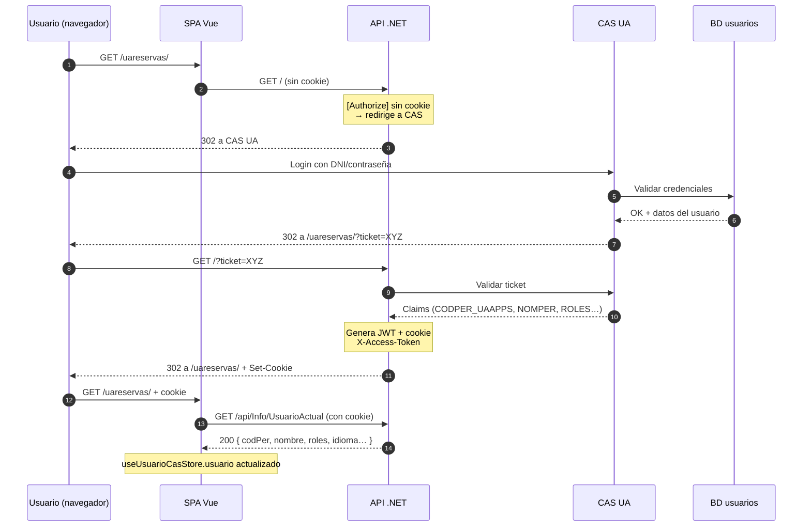
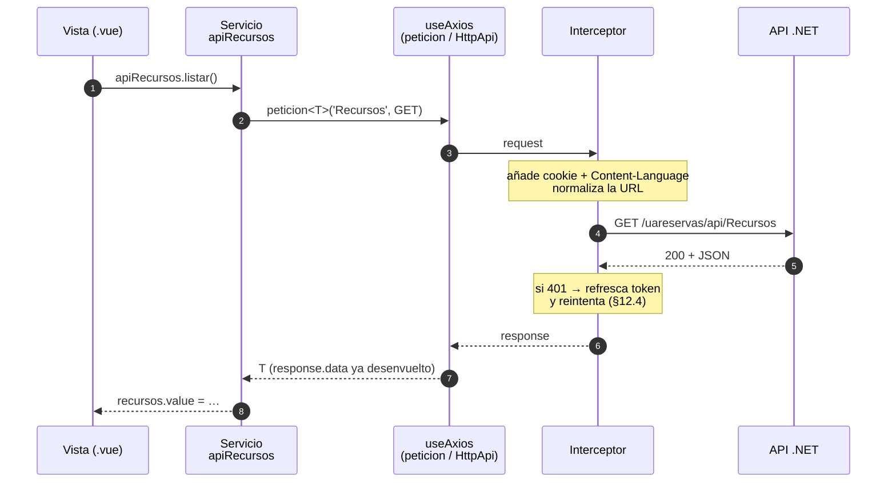
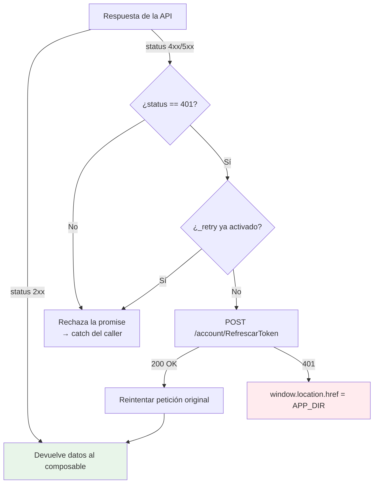
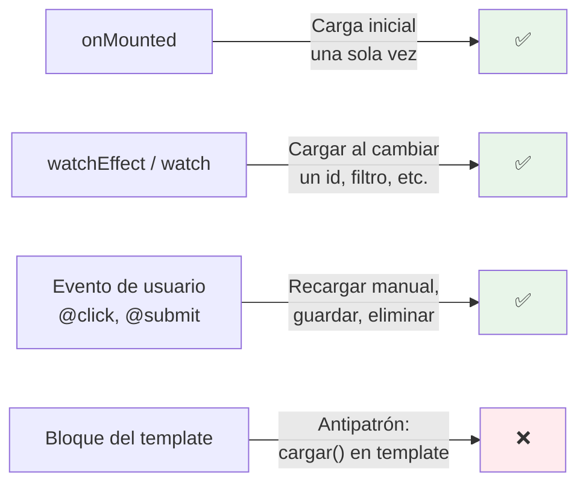
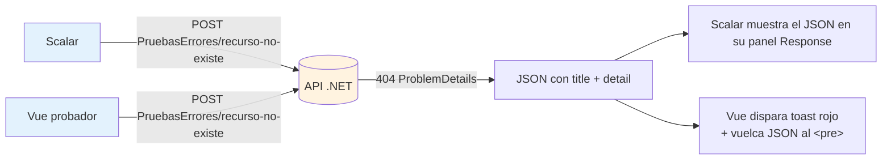

# Sesión 12: Llamadas a la API y autenticación

[[toc]]

::: info CONTEXTO
En las sesiones anteriores el bloque Vue (6-10) trabajó con servicios **mock**: `recursosServicioMock.ts` devolvía un array en memoria con un `setTimeout` que simulaba latencia. A partir de esta sesión sustituimos el mock por la API real de `uaReservas`. La vista y el composable **no cambian** — solo el servicio.

Para entender qué viaja, también necesitamos saber **quién es el usuario**: cómo el navegador prueba al servidor que estamos identificados (cookie de sesión + token JWT) y cómo `.NET` y Vue leen esos datos.
:::

## Objetivos

Al finalizar esta sesión, el alumno será capaz de:

- Explicar el flujo completo de autenticación CAS → cookie → JWT y cuándo se refresca el token.
- Leer los **claims** del usuario tanto en `.NET` (`ControladorBase`) como en Vue (`useUsuarioCasStore`).
- Elegir entre `peticion<T>` (async/await) y `useAxios` reactivo según el caso.
- Entender los dos **interceptores** de `HttpApi` y qué problema resuelve cada uno.
- Decidir entre `onMounted`, `watchEffect` y eventos de usuario para disparar cargas de datos.
- Usar `v-if` / `v-else` y spinners de la librería UA para representar los estados de carga, éxito y error.
- Explorar y probar la API desde **Scalar** sin cliente Vue.

## 12.1 Autenticación: CAS, cookies y JWT {#autenticacion}

La aplicación `uaReservas` usa el paquete `PlantillaMVCCore.Identificacion` que envuelve el flujo CAS (Central Authentication Service) de la UA. El alumno **no implementa el login**: viene resuelto. Pero hay que entender el recorrido para saber qué leer en cada capa.

### 12.1.1 Vista general del flujo



<!-- diagram id="s12-auth-flow" caption: "Recorrido de la autenticación CAS hasta que la SPA tiene cookie y conoce al usuario" -->

### 12.1.2 Las dos cabeceras que viajan en cada petición

Una vez identificado el usuario, **cada llamada** desde Vue lleva por sí sola dos piezas:

| Pieza | Quién la pone | Para qué sirve |
|-------|---------------|----------------|
| `Cookie: X-Access-Token=…` | El navegador, automáticamente | Demuestra al servidor que ya pasamos por CAS. Contiene el JWT firmado. |
| `Content-Language: es \| ca \| en` | `HttpApi` (axios) | Indica el idioma del usuario para que la API localice los `ProblemDetails`. |

::: tip POR QUÉ COOKIE Y NO `Authorization: Bearer`
La UA elige cookie `HttpOnly` por dos motivos: (1) bloquea acceso desde JavaScript (mitigación de XSS) y (2) el navegador la envía sola en todas las llamadas mismo-origen, evitando que cada `useAxios` tenga que adjuntar el token a mano. La SPA **nunca** lee el JWT directamente.
:::

### 12.1.3 Refresco automático del JWT

El JWT caduca antes que la sesión CAS. El interceptor de respuestas de `HttpApi` detecta el `401 Unauthorized`, llama a `/account/RefrescarToken` (renueva la cookie) y **reintenta la petición original** sin que el usuario se entere. Lo veremos en §12.4.

::: warning IMPORTANTE
Si el refresco también devuelve 401 (porque la sesión CAS expiró), `HttpApi` redirige a `/` y el ciclo del primer diagrama vuelve a empezar. No hace falta capturar este caso manualmente.
:::

## 12.2 Claims del usuario: leerlos en .NET y en Vue {#claims}

El JWT codifica varias **claims** (campo `nombre` → `valor`). En cada capa hay un lector idiomático.

### 12.2.1 En .NET — `ControladorBase`

`ControladorBase` (en `Controllers/Apis/ControladorBase.cs`) expone los claims más usados como **propiedades protegidas**, para que ningún controlador tenga que leer `User.FindFirstValue(...)` repetidamente:

```csharp
public abstract class ControladorBase : ApiControllerBase
{
    protected string Idioma => ObtenerIdiomaPeticion();   // "es" | "ca" | "en"
    protected int    CodPer { get { /* claim CODPER_UAAPPS */ } }
    protected string NombrePersona => User?.FindFirstValue("NOMPER") ?? string.Empty;
    protected string Correo        => User?.FindFirstValue("CORREO") ?? string.Empty;
    protected string DniConLetra   => User?.FindFirstValue("DNICONLETRA") ?? string.Empty;
    protected string PathFoto      => User?.FindFirstValue("PATHFOTO") ?? string.Empty;
    protected List<string> Roles  { get { /* claim ROLES, separa por ',' o ';' */ } }
}
```

Cualquier controlador que herede de `ControladorBase` lee al usuario actual con la sintaxis natural de C#:

```csharp
[HttpGet("Mias")]
public async Task<ActionResult> ListarMisReservasAsync() =>
    HandleResult(await _reservas.ListarPorCodPerAsync(CodPer, Idioma));
```

::: tip BUENA PRÁCTICA — claims al backend, nunca al body
Identidad y autorización **se leen del JWT**. Si una API recibe `codPer` por body o querystring, cualquier usuario podría suplantar a otro. La regla es **`Authorize` + `User.Claims`**, no parámetros de entrada.
:::

### 12.2.2 En Vue — `useUsuarioCasStore`

En el cliente, `@vueua/components` expone un store Pinia con los datos básicos del usuario. Internamente lo rellena llamando al endpoint `/api/Info/UsuarioActual` la primera vez que la app arranca:

```ts
// Forma del store (interfaz UsuarioCas)
interface UsuarioCas {
  DatosCargados: boolean
  Nombre: string
  Idioma: string         // "es" | "ca" | "en"
  Foto: string
  Roles: string[]
}
```

Uso típico en un componente:

```html
<script setup lang="ts">
import { useUsuarioCasStore } from '@vueua/components/core/plantilla-uacloud'

const store = useUsuarioCasStore()

// Helper que devuelve true si tiene cualquiera de los roles indicados.
const puedeAdministrar = () => store.estaAutorizado(['admin', 'reservas-gestion'])
</script>

<template>
  <p>Hola, {{ store.usuario.Nombre }}</p>
  <button v-if="puedeAdministrar()" class="btn btn-primary">Gestionar</button>
</template>
```

El probador del bloque .NET (botón **`GET /api/Info/UsuarioActual`**) imprime los mismos datos en bruto: ese JSON es exactamente lo que rellena el store.

::: info DOS LECTORES, MISMA FUENTE
Tanto `ControladorBase.CodPer` como `store.usuario.Nombre` salen del **mismo JWT**. La diferencia es que el servidor lo lee del header (cookie HttpOnly que axios envía sin verlo) y el cliente lo lee del JSON que la propia API devuelve. La SPA nunca decodifica el token.
:::

## 12.3 Llamadas a la API desde Vue {#llamadas-api}

El paquete `@vueua/components/composables/use-axios` ofrece **tres niveles** sobre `axios`. Elegir el correcto evita reinventar plumbing.

### 12.3.1 El recorrido completo de una petición

Una llamada no va de la vista a la API "en línea recta": pasa por el **servicio** de la vista y por el **interceptor** de `useAxios`, que adjunta la cookie, normaliza la URL y gestiona el 401. A la vuelta, lo mismo en orden inverso hasta que la vista pinta:



<!-- diagram id="s12-flujo-peticion-e2e" caption: "Vista → Servicio → useAxios → interceptor → API .NET, y de vuelta hasta la vista" -->

### 12.3.2 Instalación e importación

`useAxios` viene **dentro de `@vueua/components`** (no es un paquete aparte). Se configura una sola vez al arrancar la app — la plantilla UA ya lo hace por ti:

```ts
// main.ts — configuración única
import { setUrl, setToken, setRouter, setIdioma } from '@vueua/components/composables/use-axios'

setUrl(import.meta.env.VITE_URL_API + '/api')  // baseURL (es el valor por defecto)
setRouter(router)                               // para redirigir a ErrorPage
setToken(tokenActual)                           // Authorization / cookie
setIdioma('es')                                 // cabecera Content-Language
```

En cada servicio se importan solo las funciones que se usen:

```ts
import { peticion, llamadaAxios, HttpApi, verbosAxios } from '@vueua/components/composables/use-axios'
```

### 12.3.3 Los tres niveles

| Nivel | Cuándo usarlo | Devuelve |
|-------|---------------|----------|
| `peticion<T>(url, verbo, params?)` | Llamada **puntual** dentro de una función `async`. El 90 % del código. | `Promise<T>` (el dato directo) |
| `llamadaAxios(url, verbo, params?)` | Necesitas **refs reactivas** (`data`, `isLoading`, `error`) para el template. | `{ data, isLoading, error, execute }` (refs) |
| `HttpApi` | Instancia axios directa. Cuando necesitas el status exacto (201), cabeceras (`Location`) o config avanzada. | `Promise<AxiosResponse<T>>` |

::: tip REGLA PRÁCTICA
Empieza siempre con `peticion`. Pasa a `llamadaAxios` solo si te ves creando a mano `ref(false)` para `cargando` y `ref(null)` para `error`. Reserva `HttpApi` para cuando necesites la respuesta HTTP completa.
:::

### 12.3.4 Interfaces de lectura y de escritura (DTOs)

Antes del código, una decisión de diseño importante: **no se usa la misma interfaz para leer que para escribir**. Igual que en .NET hay un DTO por operación ([sesión 7 — DTOs y APIs](../../../02-dotnet/sesiones/sesion-07-dtos-apis/)), en Vue declaramos:

- una interfaz de **lectura** con lo que la API **devuelve** (en `camelCase`, ya resuelto al idioma del usuario);
- una o varias interfaces de **escritura (DTO)** con lo que la API **espera** al crear o actualizar (en `PascalCase`, como las propiedades del DTO en .NET).

```ts
// src/services/apiRecursos.ts — el servicio real que sustituye al mock de la sesión 10
import { peticion, verbosAxios } from '@vueua/components/composables/use-axios'

// LECTURA: lo que DEVUELVE la API (camelCase). La usa la vista para pintar.
export interface RecursoLectura {
  idRecurso:   number
  nombre:      string        // ya resuelto al idioma del usuario
  tipoNombre?: string | null
  visible:     boolean
}

// ESCRITURA (DTO de crear): lo que ESPERA la API (PascalCase, como en .NET).
export interface RecursoCrearDto {
  NombreEs:      string
  NombreCa:      string
  NombreEn:      string
  IdTipoRecurso: number | null
  Visible:       boolean
}

// Al actualizar viaja además el id.
export interface RecursoActualizarDto extends RecursoCrearDto {
  IdRecurso: number
}
```

::: tip POR QUÉ SEPARARLAS
Lo que pintas (`RecursoLectura`: un nombre ya traducido, el nombre del tipo…) **no** es lo que envías (`RecursoCrearDto`: los tres idiomas, el id del tipo…). Mezclarlas en una sola interfaz obliga a campos opcionales por todas partes y a enviar datos que el servidor ignora. Una interfaz por operación mantiene cliente y servidor sincronizados.
:::

### 12.3.5 `peticion<T>`: las operaciones CRUD

`peticion<T>` devuelve directamente `response.data` ya tipado (sin `.value`, sin `.data`). Agrupamos las operaciones de la entidad en un objeto servicio; **la vista nunca llama a `peticion` directamente, pasa por aquí**:

```ts
// continúa src/services/apiRecursos.ts
export const apiRecursos = {
  listar: () =>
    peticion<RecursoLectura[]>('Recursos', verbosAxios.GET),

  obtenerPorId: (id: number) =>
    peticion<RecursoLectura>(`Recursos/${id}`, verbosAxios.GET),

  crear: (dto: RecursoCrearDto) =>
    peticion<number>('Recursos', verbosAxios.POST, dto),         // devuelve el id nuevo

  actualizar: (id: number, dto: RecursoActualizarDto) =>
    peticion<void>(`Recursos/${id}`, verbosAxios.PUT, dto),

  eliminar: (id: number) =>
    peticion<void>(`Recursos/${id}`, verbosAxios.DELETE),
}
```

::: tip DE LA SESIÓN 9 A AQUÍ
El servicio de la sesión 10 (el del mock) solo cambia **la línea de la llamada**: donde había un `setTimeout`, ahora hay un `peticion('Recursos', GET)`. La vista no se toca.
:::

### 12.3.6 `peticion`: con `await` o con `.then().catch()`

`peticion` devuelve una **Promesa**, así que se consume de las dos formas habituales. Son equivalentes; elige la que se lea mejor:

```ts
// Forma 1 — async/await (la recomendada: se lee como código secuencial)
async function cargar(): Promise<void> {
  cargando.value = true
  try {
    recursos.value = await apiRecursos.listar()
  } catch (e) {
    console.error('No se pudo cargar', e)
  } finally {
    cargando.value = false          // baja el spinner pase lo que pase
  }
}

// Forma 2 — then().catch().finally() (mismo resultado, estilo promesa encadenada)
function cargarConThen(): void {
  cargando.value = true
  apiRecursos.listar()
    .then(lista => { recursos.value = lista })
    .catch(e => { console.error('No se pudo cargar', e) })
    .finally(() => { cargando.value = false })
}
```

::: warning `peticion` NO DEVUELVE REFS
Esto **no** funciona con `peticion`: `const { data, isLoading, error } = peticion(...)`. `peticion` devuelve el **dato** (`Promise<T>`), no refs reactivas. Ese destructuring es **exclusivo de `llamadaAxios`** (§12.3.9).
:::

### 12.3.7 Escribir con el objeto axios (`HttpApi`)

`peticion` desenvuelve la respuesta y te da solo el dato. Cuando necesites el **status exacto** (un `201 Created`) o **cabeceras** (la `Location` con la URL del recurso creado), usa el objeto axios `HttpApi`, que devuelve la `AxiosResponse` completa:

```ts
import { HttpApi } from '@vueua/components/composables/use-axios'

// POST leyendo status y cabecera Location
const res = await HttpApi.post<number>('Recursos', dto)
console.log(res.status)               // 201
console.log(res.headers['location'])  // /api/Recursos/42
const nuevoId = res.data

// PUT y DELETE con el mismo objeto
await HttpApi.put(`Recursos/${id}`, dto)
await HttpApi.delete(`Recursos/${id}`)
```

Para el CRUD de negocio normal, `peticion` es más conciso. Usa `HttpApi` solo cuando de verdad necesites la respuesta HTTP completa.

### 12.3.8 Mensajes integrados (`MensajesAxios`)

`peticion` admite un objeto opcional `mensajes` con cuatro slots: `pre`, `loading`, `ok`, `error`. Cada uno se traduce a un toast automáticamente:

```ts
await peticion<void>(`Reservas/${id}`, verbosAxios.DELETE, null, {
  loading: { titulo: 'Eliminando', contenido: 'Borrando la reserva…' },
  ok:      { titulo: 'Hecho',     contenido: 'Reserva eliminada.' },
  error:   { titulo: 'Error',     contenido: 'No se pudo eliminar.' },
})
```

El toast de `loading` se cierra **solo** cuando la respuesta llega (200, 400 o 500) — lo veremos al hablar de los interceptores.

### 12.3.9 `llamadaAxios` (reactivo)

Construido sobre `useAxios` de **VueUse**. Es el **único** de los tres niveles que devuelve refs reactivas (`data`, `isLoading`, `error`, `execute`) listas para el template, sin escribir `cargando` a mano:

```html
<script setup lang="ts">
import { llamadaAxios, verbosAxios } from '@vueua/components/composables/use-axios'
import type { RecursoLectura } from '@/services/apiRecursos'

// Aquí SÍ funciona el destructuring reactivo.
const { data: recursos, isLoading, error, execute } = llamadaAxios<RecursoLectura[]>(
  'Recursos', verbosAxios.GET,
)
</script>

<template>
  <button class="btn btn-primary" :disabled="isLoading" @click="execute()">Recargar</button>

  <p v-if="isLoading">Cargando…</p>
  <p v-else-if="error" class="alert alert-danger">{{ error.message }}</p>
  <ul v-else class="list-group">
    <li v-for="r in recursos" :key="r.idRecurso" class="list-group-item">{{ r.nombre }}</li>
  </ul>
</template>
```

::: tip CUÁNDO USAR CADA UNO
- `peticion` cuando el dato pasa por **lógica intermedia** (transformación, validación, encadenar varias llamadas) antes de pintarse. Es lo normal cuando hay un servicio de por medio.
- `llamadaAxios` cuando el flujo es **directo**: cargo y muestro. Menos código boilerplate.
- `HttpApi` cuando necesitas el status o las cabeceras de la respuesta.
:::

## 12.4 Interceptores de `HttpApi`: el secreto del 401 y los toasts {#interceptores}

`HttpApi` es la instancia única de `axios` que comparten `peticion` y `llamadaAxios`. Se crea una vez:

```ts
export const HttpApi: AxiosInstance = axios.create({
  baseURL: DEFAULT_BASE_URL,        // p.ej. /uareservas/api/
  withCredentials: true,            // adjunta automáticamente la cookie de sesión
  headers: { 'Content-Type': 'application/json' },
})
```

Dos interceptores se encargan del trabajo "invisible":

### 12.4.1 Interceptor de **request**: normaliza URLs

```ts
HttpApi.interceptors.request.use(config => {
  if (config.baseURL) config.baseURL = normalizarUrlBaseAplicacion(config.baseURL)
  if (typeof config.url === 'string') config.url = normalizarHostnameUrl(config.url)
  return config
})
```

Lo único que hace: arregla barras finales y dominios cuando la app está montada bajo un `PathBase` (`/uareservas`). Por eso podemos llamar a `peticion('Recursos', ...)` sin escribir la base.

### 12.4.2 Interceptor de **response**: 401 → refresco → reintento

Aquí está la mayor parte de la magia:



<!-- diagram id="s12-interceptor-401" caption: "Interceptor de respuesta: refresca el JWT en silencio si caduca y reintenta la llamada original" -->

Detalles importantes que se ven en el código de la librería:

| Detalle | Por qué importa |
|---------|-----------------|
| `_retry = true` en la config original | Evita un bucle infinito si el refresco también devuelve 401 con la misma petición. |
| `_refreshPromise` compartido | Si caen 401 simultáneos (10 peticiones en paralelo), solo se llama una vez a `/RefrescarToken`. Las demás esperan a esa promesa. |
| Cierre del toast `idloading` | Si la petición se hizo con `mensajes.loading`, el interceptor cierra el toast en `response`, no en el `try/finally` del caller. Por eso no hace falta limpiarlo a mano. |
| `redirigirError: true` (opcional) | Redirige a una página de error global en vez de rechazar la promise. Pensado para errores 5xx no recuperables. |

::: tip CÓMO ENCAJAN INTERCEPTORES + `gestionarError`
El **interceptor** decide si reintentar o redirigir, pero **no muestra toasts** salvo el cierre del loading. La función `gestionarError` (sesión 1 §1.8.5) sí decide qué toast lanzar según el `status` final. División de tareas: interceptor = plumbing, `gestionarError` = UX.
:::

### 12.4.3 Configurar `HttpApi` al arrancar la app

`main.ts` llama una sola vez a las funciones de configuración:

```ts
import { setRouter, setIdioma } from '@vueua/components/composables/use-axios'

setRouter(router)         // necesario para que el interceptor pueda navegar a ErrorPage
setIdioma('es')           // cabecera Content-Language por defecto
// setUrl('/uareservas/api')   // solo si la URL difiere de /api desde la raíz
```

La plantilla UA ya las invoca en su `boot`. Solo necesitas tocarlas si configuras un endpoint atípico.

## 12.5 Estados de carga: cuándo, dónde y cómo {#estados-carga}

Cargar datos sin pensar en los estados intermedios produce siempre la misma sensación: "la app está rota porque tarda". Vue ofrece varios sitios donde lanzar la carga y varias maneras de representarla.

### 12.5.1 Dónde disparar la carga



<!-- diagram id="s12-cuando-cargar" caption: "Tres sitios válidos para iniciar carga; el cuarto es un antipatrón" -->

| Disparador | Caso típico |
|------------|-------------|
| `onMounted(async () => { await cargar() })` | Cargar la lista la primera vez que se entra en la vista. |
| `watch(idRecurso, cargarDetalle)` | El usuario cambia el id en una URL `?id=…` o un select y queremos refrescar el detalle. |
| `watchEffect(async () => { await cargar(filtro.value) })` | Filtro reactivo: cualquier `ref` leído dentro dispara la recarga. Cuidado con el rebote — añadir `debounce`. |
| `@click="recargar"` | Botón "Recargar" o "Reintentar" tras error. |

::: warning EVITAR
Nunca llames a una función async desde el template (<code v-pre>{{ cargar() }}</code>). El template se reevalúa decenas de veces y dispararás peticiones repetidas y rebotes infinitos.
:::

### 12.5.2 Patrón canónico en el composable

El esqueleto que ya viste en la sesión 10 sigue valiendo. Solo hay que **mantener los tres estados** (`cargando`, `error`, datos) coherentes:

```ts
export function useRecursos() {
  const recursos = ref<IClaseRecurso[]>([])
  const cargando = ref(false)
  const error    = ref<string | null>(null)

  async function cargar() {
    cargando.value = true
    error.value = null
    try {
      const dtos = await servicio.listar()    // peticion<T> debajo
      recursos.value = dtos.map(dtoARecurso)
    } catch (e) {
      // El interceptor ya manejó 401/refresh. Aquí solo guardamos el mensaje.
      error.value = e instanceof Error ? e.message : 'Error desconocido'
    } finally {
      cargando.value = false                  // SIEMPRE: éxito o fallo
    }
  }

  return { recursos, cargando, error, cargar }
}
```

::: tip POR QUÉ SIEMPRE `try / finally`
Si el `catch` solo apaga `cargando` cuando va todo bien, en cualquier error la pantalla se queda atascada con el spinner y el botón deshabilitado. `finally` garantiza la salida correcta haya o no excepción.
:::

### 12.5.3 Representar los estados en el template

Hay un patrón de cuatro ramas que cubre todos los casos:

```html
<template>
  <!-- 1. Cargando inicial: spinner inline o SpinnerModal global -->
  <div v-if="cargando && recursos.length === 0" class="text-center my-5">
    <div class="spinner-border" role="status"></div>
    <p class="mt-2 text-muted">Cargando recursos…</p>
  </div>

  <!-- 2. Error: muestra mensaje + botón reintentar -->
  <div v-else-if="error" class="alert alert-danger">
    <p>{{ error }}</p>
    <button class="btn btn-sm btn-outline-danger" @click="cargar">Reintentar</button>
  </div>

  <!-- 3. Vacío: lista cargada pero sin elementos -->
  <p v-else-if="recursos.length === 0" class="text-muted">
    No hay recursos. Crea el primero.
  </p>

  <!-- 4. Datos: el caso "feliz" -->
  <table v-else class="table table-striped">
    <tbody>
      <tr v-for="r in recursos" :key="r.id">…</tr>
    </tbody>
  </table>

  <!-- Spinner GLOBAL solo si recargamos con datos ya en pantalla -->
  <SpinnerModal v-model:visible="cargando && recursos.length > 0"
                titulo="Actualizando" mensaje="Recargando datos…" />
</template>
```

::: tip BUENA PRÁCTICA — `v-if` y `v-else-if` se excluyen entre sí
El `v-else-if` garantiza que **solo una rama** se renderiza. Es más legible y eficiente que cuatro `v-if` independientes (que se podrían pisar). Usa `v-show` solo cuando el cambio es muy frecuente (toggles, tabs) y el bloque es ligero.
:::

### 12.5.4 Cuándo usar qué spinner

| Pieza UA | Caso |
|----------|------|
| Spinner inline (`<div class="spinner-border">`) | Carga inicial dentro de una zona acotada. |
| `BotonLoading` (sesión 10) | Operaciones disparadas desde un botón. |
| `SpinnerModal` (sesión 11) | Carga **bloqueante**: el usuario no debe interactuar mientras dura. |
| Toast `'espera'` (`mensajes.loading`) | Operación de fondo: no bloquea, solo informa. El interceptor lo cierra solo. |

## 12.6 Explorar y probar la API con OpenAPI y Scalar {#openapi-scalar}

`uaReservas` publica su contrato OpenAPI en `/uareservas/openapi/v1.json` y la UI de **Scalar** en `/uareservas/scalar`. Es el sitio natural para **probar la API sin escribir Vue**.

### 12.6.1 Para qué sirve Scalar en esta sesión

| Caso | Cómo lo aprovechas en Scalar |
|------|------------------------------|
| Construir un servicio Vue por primera vez | Copias la URL y el JSON de ejemplo desde Scalar y los pegas en `peticion<T>(...)`. |
| Reproducir un bug | Pruebas el endpoint en Scalar primero: si falla allí, el problema **no** está en Vue. |
| Verificar localización | Cambias la cabecera `Content-Language` en Scalar (`es` / `ca` / `en`) y miras cómo cambia `Detail` en los errores. |
| Ver claims | El botón **`GET /api/Info/UsuarioActual`** desde Scalar imprime el mismo JSON que rellena `useUsuarioCasStore`. |

### 12.6.2 Probar un error 400 desde Scalar y desde Vue

Tanto el probador de Vue (`Sesion1ProbadorApi.vue`) como Scalar invocan los mismos endpoints `PruebasErrores/*`. La diferencia es donde ves el resultado:



<!-- diagram id="s12-scalar-vs-vue" caption: "Mismo endpoint, dos exploradores: Scalar y el probador Vue" -->

::: tip FLUJO RECOMENDADO PARA CONSTRUIR UN SERVICIO NUEVO
1. En **Scalar**, encuentra el endpoint y prueba que devuelve el JSON esperado.
2. Copia la interface del DTO desde la sección _Schemas_.
3. Escribe `peticion<TuDto>(...)` en `src/services/`.
4. Engancha al composable y a la vista.
:::

### 12.6.3 Tres formas equivalentes de invocar la API en local {#tres-formas}

Mientras desarrollas, la **misma API** se puede invocar desde tres sitios y los tres reciben **exactamente el mismo JSON**. Tenerlas claras te ahorra tiempo cuando algo falla.

```mermaid
flowchart LR
    subgraph Navegador
        Chrome[Chrome DevTools<br/>pestaña Network]
        Scalar[/uareservas/scalar<br/>botón Try it out]
        Home["Home.vue<br/>botón GET /api/Recursos"]
    end
    subgraph Servidor
        API[ASP.NET Core<br/>RecursosController]
    end
    Chrome -.cookie X-Access-Token.-> API
    Scalar -- click Send --> API
    Home   -- "peticion<T>" --> API
    API -- 200 + JSON --> Chrome
    API -- 200 + JSON --> Scalar
    API -- 200 + JSON --> Home

    style Chrome fill:#d1ecf1,stroke:#0c5460
    style Scalar fill:#d4edda,stroke:#155724
    style Home   fill:#fff3cd,stroke:#856404
```

<!-- diagram id="s12-tres-formas-probar" caption: "DevTools, Scalar y el probador Home.vue reciben el mismo JSON." -->

| Forma                       | Cuándo te conviene                                                                                                          |
| --------------------------- | --------------------------------------------------------------------------------------------------------------------------- |
| **Chrome DevTools (Network)** | Para inspeccionar la cabecera (`Cookie: X-Access-Token`, `X-Idioma`), el status y el JSON real **mientras Vue ya llama**.   |
| **Scalar**                  | Para probar un endpoint **sin Vue**: cambiar idioma, provocar errores, copiar el JSON de ejemplo (cubierto en §12.6.1/2).   |
| **`Home.vue` (probador)**   | Para verificar que el flujo completo Vue → axios → interceptor → API → axios → Vue funciona, con `peticion<T>` + toasts.    |

### 12.6.4 El probador `Home.vue` por dentro {#probador-home}

`ClientApp/src/views/Home.vue` viene con un probador completo: varios botones que llaman a la API real con `peticion<T>` y vuelcan la respuesta a un `<pre>`. El patrón es el canónico del curso — **no hace nada distinto** de lo que harás tú al construir servicios:

```ts
// ClientApp/src/views/Home.vue (extracto reducido)
import {
  gestionarError,
  peticion,
  verbosAxios,
} from "@vueua/components/composables/use-axios";

// DTO espejo de lo que devuelve la API (solo los campos que el probador usa).
interface TipoRecursoLectura {
  idTipoRecurso: number;
  codigo: string;
  nombre: string;
}

const salida = ref("");

// Helper genérico: GET, vuelca el JSON o gestiona el error.
async function llamar<T>(url: string, etiqueta: string) {
  try {
    // peticion<T> → si status 2xx devuelve T; si no, lanza y cae al catch.
    const datos = await peticion<T>(url, verbosAxios.GET);
    salida.value = JSON.stringify(datos, null, 2);                // respuesta cruda
  } catch (error: any) {
    // gestionarError lee err.response.data (ProblemDetails si lo hay)
    // y dispara avisarError con título + detalle localizado.
    gestionarError(error, `No se pudo cargar ${etiqueta}`, "Inténtelo más tarde.");
  }
}

// Acciones de los botones — una llamada por endpoint:
const listarTiposRecurso  = () => llamar<TipoRecursoLectura[]>("TipoRecursos", "tipos de recurso");
const obtenerUsuarioActual = () => llamar<unknown>("Info/UsuarioActual",        "usuario actual");
const provocarError400     = () => llamar<unknown>("Info/MessageError",         "error de demo");
```

Tres piezas que merece la pena fijarse:

| Pieza                                      | Para qué                                                                                                            |
| ------------------------------------------ | ------------------------------------------------------------------------------------------------------------------- |
| **`peticion<T>(url, verbosAxios.GET)`**    | Hace `GET /api/{url}`, espera 2xx, devuelve directamente el `T`. Si no es 2xx, lanza excepción → cae al `catch`.    |
| **`gestionarError(err, título, detalle)`** | Mira `err.response.data` (un `ProblemDetails` / `ValidationProblemDetails` si lo hay) y dispara el toast adecuado.  |
| **<code v-pre>&lt;pre&gt;{{ salida }}&lt;/pre&gt;</code>**              | Vuelca el JSON **crudo** para que se vea exactamente lo que devuelve .NET, sin envolturas.                          |

::: tip BUENA PRÁCTICA — recorrido guiado en 5 pasos
Cuando arranques en clase (o ante un bug), el recorrido es siempre el mismo:

1. **Arrancar `dotnet watch`** (levanta también Vite).
2. **Abrir `https://localhost:44306/uareservas/`** → si no hay sesión, te manda a CAS.
3. **Abrir DevTools → Network** y dejar la pestaña visible.
4. **Pulsar un botón de `Home.vue`**: ves la entrada en Network (cookie + status + JSON) y el `<pre>` se rellena.
5. **Pulsar el botón de error de demo** (`GET /api/Info/MessageError`): status 400, `ValidationProblemDetails` en el cuerpo, toast rojo en pantalla. Si cambias el idioma, el `detail` cambia.
:::

::: info → Los botones de "Errores Oracle" del probador
`Home.vue` incluye también botones que provocan a propósito errores en paquetes PL/SQL (`-20702 → 404`, `-20703 → 400`, `error-técnico → 500`) para ver el ciclo completo Oracle → `Result<T>` → `HandleResult` → JSON → toast. El recorrido detallado se cubre en la **[sesión 14 — Gestión de errores](../../../04-integracion/sesiones/sesion-14-errores/#formatos-oracle)**.
:::

## 12.7 Tarea progresiva del proyecto final {#tarea-pf}

::: tip MÓDULO 1 · INTEGRACIÓN REAL + MÓDULO 2 · ARRANQUE
Ya tienes lo necesario para sustituir mocks por la API real.

**Módulo 1 (`tiporecurso-<nombre>`):**

- Crea `services/tipoRecursoServicio.ts` con `peticion<T>` reemplazando el mock.
- Mantén la firma del servicio: el composable y la vista no se tocan.
- Comprueba en DevTools → Network que cada llamada lleva la cookie `X-Access-Token`.

**Módulo 2 (`recurso-<nombre>`):**

- Lee `CodPer` e `Idioma` del JWT en `RecursosController` (vía `ControladorBase`).
- En tus consultas a la vista `VRES_RECURSO`, devuelve solo la columna idiomática que corresponde al usuario.
- Bloquea por defecto los recursos cuyo `CODPER_CREADOR` no coincida con el del usuario (`Result.Validation` con `errors[""]`). La fórmula final con roles llega en la sesión 17.

Mapa completo: [Proyecto final del curso](../../../06-proyecto-final/).
:::

## 12.8 Pruébalo en el proyecto {#sandbox}

En la **sesión 1 (.NET)** ya tienes el probador con los botones que provocan errores 404/400/500. Esta sesión lo cierra con la idea contraria: **el botón hace lo mismo, lo que cambia es el sitio donde lo manejas**.

| Punto del recorrido | Demo del sandbox | Sesión |
|---------------------|------------------|--------|
| Cookie + JWT en cabecera | DevTools → Network sobre cualquier llamada de `Sesion1ProbadorApi.vue` | 1 (.NET) |
| Lectura de claims en servidor | Botón **`GET /api/Info/UsuarioActual`** | 1 (.NET) |
| Lectura de claims en cliente | `useUsuarioCasStore` en Home + `Sesion10ArquitecturaTresCapas.vue` | 1 / 9 |
| Spinner global | `Sesion11SpinnerModal.vue` | 10 |
| Patrón "ocupado" en botón | `Sesion10BotonLoading.vue` | 9 |
| Tres capas con servicio mock | `Sesion10ArquitecturaTresCapas.vue` | 9 |
| Errores Oracle → toast | Botones de "Errores Oracle" en `Sesion1ProbadorApi.vue` | 1 (.NET) §1.8.5 |

::: info LO QUE LLEGA EN SESIONES SIGUIENTES
La validación de formularios con `useGestionFormularios` y `ValidationProblemDetails` por campo se cubre en la **sesión 13**. El registro estructurado de errores con `ClaseErrores` y `Serilog` en la **sesión 14** y la **sesión 21**.
:::

---

<!-- NAV:START -->
| Anterior | Inicio | Siguiente |
|---|---|---|
| [← Sesión 11: Otros componentes internos](../../../03-vue/sesiones/sesion-11-componentes-ua/) | [Índice del curso](../../../) | [Sesión 13: Validación en todas las capas →](../../../04-integracion/sesiones/sesion-13-validacion/) |
<!-- NAV:END -->
