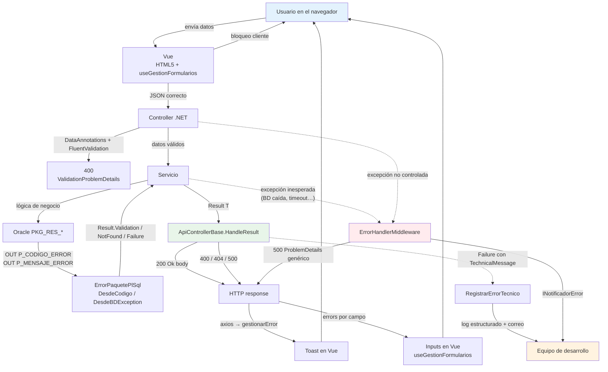
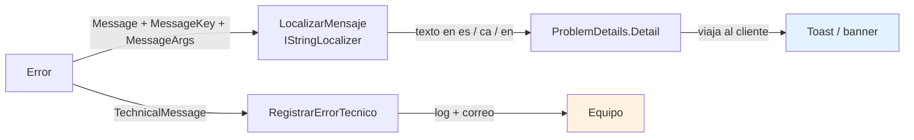

# Sesión 13: Gestión de errores de extremo a extremo

[[toc]]

::: info CONTEXTO
La sesión 12 enseñó **qué formato** usa el servidor para hablar de errores (`ValidationProblemDetails` y `ProblemDetails`) y **dónde** se vuelcan en el formulario (`useGestionFormularios`). Esta sesión cubre el resto del viaje: cómo se origina un error en cada capa, qué excepciones UA siguen teniendo sentido en el modelo nuevo, qué hace el `ErrorHandlerMiddleware` cuando uno **escapa** y cómo se enchufa el correo al equipo.

La clave: en el modelo `Result<T>` la mayoría de los errores **no son excepciones**. Las que sí lo son tienen un tratamiento muy concreto y se notifican siempre. Saber distinguir uno de otro es lo que esta sesión pretende dejar claro.
:::

## Objetivos

Al finalizar esta sesión, el alumno será capaz de:

- Trazar el viaje de un error desde Oracle hasta el toast del usuario, identificando qué pieza interviene en cada tramo.
- Leer e interpretar la anatomía del record `Error` y entender por qué transporta **dos mensajes** (técnico y de usuario).
- Reconocer los **cuatro formatos de mensaje Oracle** soportados por `ErrorPaquetePlSql`: texto plano, literal `# … #`, `# Resources.X.Y|args #` y formato externo UXXI `PKG_X#CODE#FALLBACK#args`.
- Distinguir cuándo usar `BDException`, `AppException`, `InfoException` y `MantenimientoException` en el modelo nuevo.
- Configurar `AddClaseErrores` con sus enriquecedores y enganchar la notificación por correo desde dos puntos complementarios: middleware y `RegistrarErrorTecnico`.
- Notificar al usuario con la familia `useToast` y proteger operaciones destructivas con `PopUpModal`.

## 13.1 El viaje de un error de extremo a extremo {#viaje-error}

Antes del detalle de cada pieza, conviene tener el **mapa entero** delante. Un error que arranca en Oracle puede acabar en tres sitios distintos según de qué tipo sea:



<!-- diagram id="s13-viaje-error" caption: "Viaje completo de un error: tres caminos hacia el usuario y dos hacia el equipo" -->

### 13.1.1 Las tres trayectorias

| Trayectoria | Cuándo | Qué ve el usuario | Quién avisa al equipo |
|-------------|--------|-------------------|------------------------|
| **Bloqueo en cliente** | El propio formulario detecta el error (campo vacío, formato inválido). | Mensaje bajo el input. | Nadie. Es un error normal de UX. |
| **Error esperable** | El servicio devuelve `Result.Failure(...)` con `Validation` / `NotFound` / `Failure`. | Toast rojo o banner global, con texto localizado. | Solo si lleva `TechnicalMessage` — vía `RegistrarErrorTecnico`. |
| **Excepción inesperada** | Algo se rompe de verdad: BD caída, fichero corrupto, NRE. | Mensaje genérico (`Ha ocurrido un error técnico`). | **Siempre** — vía `ErrorHandlerMiddleware`. |

::: tip LA REGLA DE DECISIÓN PARA EL DESARROLLADOR
Cuando escribas un servicio o un controlador, pregúntate por cada `try/catch`:

- ¿Sé qué responder a esto? → **No es excepción**. Devuelve `Result.Failure(Error)` con el `ErrorType` que corresponda.
- ¿Esto no debería estar ocurriendo nunca? → **Sí es excepción**. Déjala escapar para que la pille el middleware.

Si dudas, casi seguro es la primera opción. Las excepciones reales son **raras**: la BD caída, una configuración faltante, un bug.
:::

### 13.1.2 Lo que se mantiene del modelo histórico UA

Aunque el grueso del flujo es `Result<T>` + `HandleResult`, ciertas piezas del stack histórico UA siguen presentes y **siguen teniendo sentido**:

| Pieza UA | Sigue siendo necesaria | Por qué |
|----------|------------------------|---------|
| `BDException` (Usuario / Sistema) | Sí | La sigue lanzando `ClaseOracleBD3`. `ErrorPaquetePlSql.DesdeBDException` la **convierte** a `Result<T>` antes de que el controlador la vea. |
| `AppException`, `InfoException`, `MantenimientoException` | Solo si se necesitan | Para flujos MVC clásicos (vistas Razor) y para modo mantenimiento. La API casi nunca las tira. |
| `ErrorHandlerMiddleware` | Sí | Captura **lo que escape**. En el modelo nuevo escapa muy poco, pero cuando escapa hay que notificarlo. |
| `AddClaseErrores` + enriquecedores | Sí | El envío del correo y la composición del mensaje. Se enchufa **a dos sitios**: middleware (para excepciones) y `RegistrarErrorTecnico` (para `Result.Failure` con `TechnicalMessage`). |
| `ClaseErroresWebAPI.Generar(ModelState)` | **No** | Reemplazada por `ValidationProblemDetails` estándar que devuelve `[ApiController]` automáticamente. |

## 13.2 Anatomía del `Error` UA {#anatomia-error}

Todo `Result<T>.Failure(...)` lleva dentro un `Error` con esta forma (ver `Models/Errors/Error.cs`):

```csharp
public record Error(
    string  Code,
    string  Message,
    ErrorType Type,
    IDictionary<string, string[]>? ValidationErrors = null,
    string? MessageKey       = null,
    object?[]? MessageArgs   = null,
    string? TechnicalMessage = null);
```

Y los tres `ErrorType` posibles (`Models/Errors/ErrorType.cs`):

```csharp
public enum ErrorType
{
    Failure    = 0,   // → HTTP 500
    Validation = 1,   // → HTTP 400
    NotFound   = 2    // → HTTP 404
}
```

### 13.2.1 Para qué sirve cada campo

| Campo | Quién lo lee | Para qué |
|-------|--------------|----------|
| `Code` | El equipo (logs) y opcionalmente el cliente | Identificador estable del error (`"ORA-20702"`, `"TIPO_RECURSO_NO_EXISTE"`). |
| `Message` | El cliente — si no se localiza por `MessageKey` | Mensaje legible "por defecto" en el idioma del literal. |
| `Type` | `HandleResult` | Decide el código HTTP (400 / 404 / 500). |
| `ValidationErrors` | El cliente — `useGestionFormularios` | Diccionario `campo → mensajes[]`. La clave `""` se usa para errores globales. |
| `MessageKey` | `LocalizarMensaje` en `ApiControllerBase` | Clave de `Resources/SharedResource.resx` para traducir según `Content-Language`. |
| `MessageArgs` | `LocalizarMensaje` | Argumentos `{0}`, `{1}` para el `string.Format` de la traducción. |
| `TechnicalMessage` | `RegistrarErrorTecnico` y, en el futuro, Serilog y el correo | Detalle técnico (stack trace, código `ORA`, parámetros) que **no** viaja al cliente. |

### 13.2.2 Por qué dos mensajes distintos

`Message` y `TechnicalMessage` cumplen funciones complementarias y nunca se mezclan:



<!-- diagram id="s13-dos-mensajes" caption: "El Error transporta dos mensajes hacia destinos distintos: uno limpio al cliente, otro técnico al equipo" -->

::: tip POR QUÉ ESTA SEPARACIÓN ES IMPORTANTE
Mezclar las dos cosas tiene **dos consecuencias malas**:

- **De seguridad:** filtrar `ORA-12545` o nombres de paquetes en pantalla revela arquitectura a un atacante.
- **De UX:** un usuario que ve "ORA-00942: la tabla o vista no existe" no sabe qué hacer.

Mantener `Message` (lo que ve el usuario) separado de `TechnicalMessage` (lo que ve el equipo) resuelve los dos a la vez.
:::

### 13.2.3 Cómo construir un `Error` desde un servicio

Los factories del propio `Result<T>` evitan instanciar `Error` a mano:

```csharp
// Servicio
if (idRecurso <= 0)
    return Result<RecursoLectura>.Validation(
        "RECURSO_ID_INVALIDO",
        "El identificador del recurso no es válido.");

if (recurso is null)
    return Result<RecursoLectura>.NotFound(
        "RECURSO_NO_ENCONTRADO",
        "El recurso {0} no existe.",
        idRecurso);

return Result<RecursoLectura>.Success(recurso);
```

Los `params object?[] messageArgs` se quedan en `MessageArgs` y se aplican como `string.Format` cuando se localice el mensaje. Lo verás en §13.3 con los formatos Oracle.

## 13.3 Los cuatro formatos de mensaje desde Oracle {#formatos-oracle}

`ClaseOracleBD3` no conoce el idioma del usuario; lo conoce .NET. Por eso Oracle nunca devuelve un mensaje "ya traducido" — devuelve **una clave** (o un texto literal) en un formato que `ErrorPaquetePlSql.ExtraerMensajeUsuarioOracle` sabe interpretar.

Hay **cuatro formatos** soportados:

| Caso | Formato Oracle | Visible al usuario | Localizado |
|------|----------------|--------------------|------------|
| 1. Error técnico | `Texto plano sin # … #` | **No** | No |
| 2. Literal de usuario | `# Mensaje #` | Sí | No |
| 3. Resource con/sin args | `# Resources.Fichero.Clave[\|arg1\|arg2…] #` | Sí | Sí |
| 4. Externo UXXI | `PKG_X#COD_ERROR#FALLBACK#arg1\|arg2…` | Sí | Sí (si el `.resx` existe) |

::: tip RESUMEN GRÁFICO
- Sin `#` → es **técnico**. Va a `ErrorType.Failure` y el usuario solo ve un genérico.
- Con `#` → es **para el usuario**. Si el contenido empieza por `Resources.` o sigue el patrón UXXI, se traduce contra `SharedResource.{es,ca,en}.resx`.
:::

### 13.3.1 Caso 1 — Error técnico (no visible)

```sql
PROCEDURE EXCEPCION_TECNICA AS
BEGIN
  RAISE_APPLICATION_ERROR(
    -20703,
    'Error interno en UPDATE_TIPO_RECURSO, id=' || p_id);
END;
```

`ErrorPaquetePlSql` lo recibe sin delimitadores `#`. Resultado:

- `BDException.TipoExcepcion = Sistema` (lo marca `ClaseOracleBD3`).
- `ErrorPaquetePlSql.DesdeBDException` devuelve un `Error` con:
  - `Code = "ERROR_TECNICO_ORACLE"` (o `"ORA-20703"` si lo logra extraer)
  - `Message = "Ha ocurrido un error técnico al procesar la operación."` (genérico)
  - `Type = Failure`
  - `TechnicalMessage = "ORA-20703: Error interno en UPDATE_TIPO_RECURSO, id=42"` (el original)

El usuario verá el mensaje genérico. El equipo verá el detalle en `RegistrarErrorTecnico` (log + correo).

### 13.3.2 Caso 2 — Literal visible al usuario

```sql
PROCEDURE OPERACION_NO_PERMITIDA AS
BEGIN
  RAISE_APPLICATION_ERROR(
    -20703,
    '# Operación no permitida en este momento. #');
END;
```

Hay `#` delimitando un literal, sin `Resources.` ni `PKG_`. Resultado:

- `Error.Message = "Operación no permitida en este momento."`
- `Error.MessageKey = null` (no se intenta traducir).
- `Error.Type = Validation` (rango `-20703`).
- HTTP 400 → toast / banner en Vue con ese texto **tal cual**.

::: tip CUÁNDO USARLO
Cuando el texto **no necesita traducción** ni argumentos. Por ejemplo, mensajes para una aplicación interna en un solo idioma o cuando aún no has creado el `.resx`.
:::

### 13.3.3 Caso 3 — Localizado con `Resources.X.Y` (con o sin parámetros)

```sql
PROCEDURE TIPO_RECURSO_CON_ASOCIADOS(p_codigo IN VARCHAR2) AS
BEGIN
  RAISE_APPLICATION_ERROR(
    -20703,
    '# Resources.SharedResource.TIPO_RECURSO_CON_ASOCIADOS|' || p_codigo || ' #');
END;
```

Contenido entre `#`: `Resources.SharedResource.TIPO_RECURSO_CON_ASOCIADOS|SALA`.

`ErrorPaquetePlSql.ResolverMensajeUsuario` separa por `|`:

| Parte | Valor |
|-------|-------|
| Clave de recurso | `Resources.SharedResource.TIPO_RECURSO_CON_ASOCIADOS` |
| `MessageArgs[0]` | `"SALA"` |

`ApiControllerBase.LocalizarMensaje` luego pide a `IStringLocalizer<SharedResource>` la clave normalizada (`TIPO_RECURSO_CON_ASOCIADOS`) con el idioma del usuario. Si el `.resx` contiene:

```text
TIPO_RECURSO_CON_ASOCIADOS = El tipo de recurso "{0}" tiene recursos asociados y no puede eliminarse.
```

El cliente recibe:

```json
{
  "title": "ORA-20703",
  "detail": "El tipo de recurso \"SALA\" tiene recursos asociados y no puede eliminarse.",
  "status": 400,
  "errors": { "": ["El tipo de recurso \"SALA\" tiene recursos asociados y no puede eliminarse."] }
}
```

::: warning USO CORRECTO DEL SEPARADOR `|`
- El separador entre clave y argumentos es `|` (pipe).
- Los argumentos **pueden contener puntos** (`Juan.Pérez|Asignatura.2025` es válido).
- Los argumentos **no deben contener `|`** (no hay escape). Si un parámetro lo necesitara, habría que cambiar el separador en el servicio antes de mandarlo.
- Los placeholders en el `.resx` siguen el patrón `string.Format`: `{0}`, `{1}`, etc.
:::

### 13.3.4 Caso 4 — Externo UXXI (`PKG_X#COD#FALLBACK#args`)

Algunas integraciones UA generan errores en el formato histórico de UXXI:

```sql
PROCEDURE ALUMNO_DUPLICADO(p_nombre IN VARCHAR2, p_apellido IN VARCHAR2) AS
BEGIN
  RAISE_APPLICATION_ERROR(
    -20703,
    'PKG_ALUMNOS#ERR_DUPLICADO#El alumno {0} {1} ya existe#' || p_nombre || '|' || p_apellido);
END;
```

`ErrorPaquetePlSql.ResolverMensajeExterno` reconoce el prefijo `PKG_` y separa por `#`:

| Parte | Valor |
|-------|-------|
| Package | `PKG_ALUMNOS` |
| Código error | `ERR_DUPLICADO` |
| Fallback | `El alumno {0} {1} ya existe` |
| Argumentos | `["Súper", "Crispín"]` |

Intenta resolver `Resources.PKG_ALUMNOS.ERR_DUPLICADO` (clave normalizada). Si existe en el `.resx`:

```text
PKG_ALUMNOS.ERR_DUPLICADO = El alumno {0} {1} ya está registrado en la aplicación.
```

→ resultado localizado.

Si **no** existe, usa el `fallback` formateado con los argumentos:

```text
El alumno Súper Crispín ya existe
```

::: tip POR QUÉ ES ÚTIL EL FALLBACK
Las integraciones con sistemas externos (UXXI, Sigma…) generan códigos de error que están fuera del control del proyecto. El fallback dentro del propio mensaje garantiza que **siempre** verás algo razonable, incluso si nadie ha creado el `.resx`.
:::

### 13.3.5 Reglas de fallback resumidas

| Entrada Oracle | Recurso encontrado | Salida al usuario |
|----------------|---------------------|--------------------|
| `# Mensaje literal #` | — | `Mensaje literal` |
| `# Resources.X.Y #` | Sí | Texto traducido |
| `# Resources.X.Y #` | No | `Resources.X.Y` (clave bruta) |
| `# Resources.X.Y\|a\|b #` | Sí, con `{0}{1}` | Texto traducido con args |
| `# Resources.X.Y\|a\|b #` | No | `Resources.X.Y` (sin formatear) |
| `PKG_X#COD#fallback {0}#arg` | Sí | Texto traducido con args |
| `PKG_X#COD#fallback {0}#arg` | No | `fallback arg` (fallback formateado) |
| Texto plano (sin `#`) | — | Genérico técnico, mensaje real en `TechnicalMessage` |

### 13.3.6 Buenas prácticas de PL/SQL

- **Para errores técnicos:** `RAISE_APPLICATION_ERROR(-20703, 'Detalle técnico…')`. Sin `#`.
- **Para mensajes simples visibles:** `RAISE_APPLICATION_ERROR(-20703, '# Mensaje al usuario. #')`.
- **Para mensajes traducibles:** `RAISE_APPLICATION_ERROR(-20703, '# Resources.SharedResource.CLAVE #')`.
- **Con parámetros:** `RAISE_APPLICATION_ERROR(-20703, '# Resources.SharedResource.CLAVE|' || p_arg1 || '|' || p_arg2 || ' #')`.
- **Crea las claves en los `.resx` de `Resources/SharedResource.{es,ca,en}.resx`.**
- **Evita el carácter `|` dentro de parámetros.** No hay escape.
- **Usa el rango de códigos** que ya conoce `ErrorPaquetePlSql.DesdeCodigo` (`-20702` → 404, `-20703` → 400, etc.) para que el HTTP sea el esperado.

::: info DÓNDE MIRAR EL CÓDIGO
- `Models/Errors/ErrorPaquetePlSql.cs` — los métodos `ExtraerMensajeUsuarioOracle`, `ResolverMensajeUsuario`, `ResolverMensajeExterno`, `LimpiarPrefijoOracle`.
- `Resources/SharedResource.{es,ca,en}.resx` — claves que ya existen (`TIPO_RECURSO_NO_EXISTE`, `TIPO_RECURSO_CON_ASOCIADOS`, `ERROR_TECNICO`).
- `uaReservas.Tests/ErrorPaquetePlSqlTests.cs` — tests del parser para cada formato.
:::
