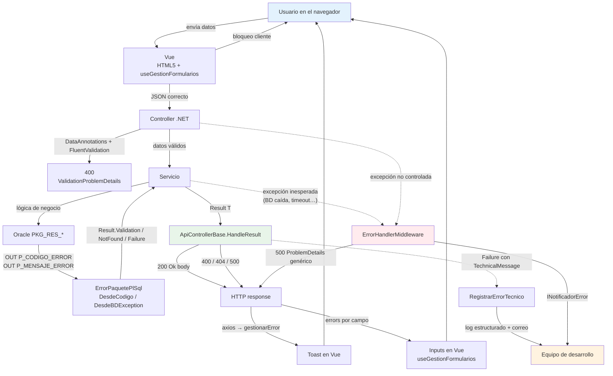
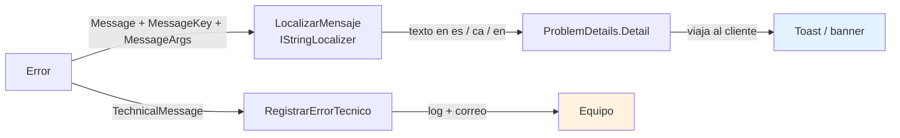
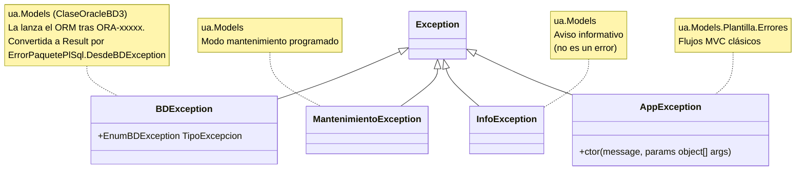
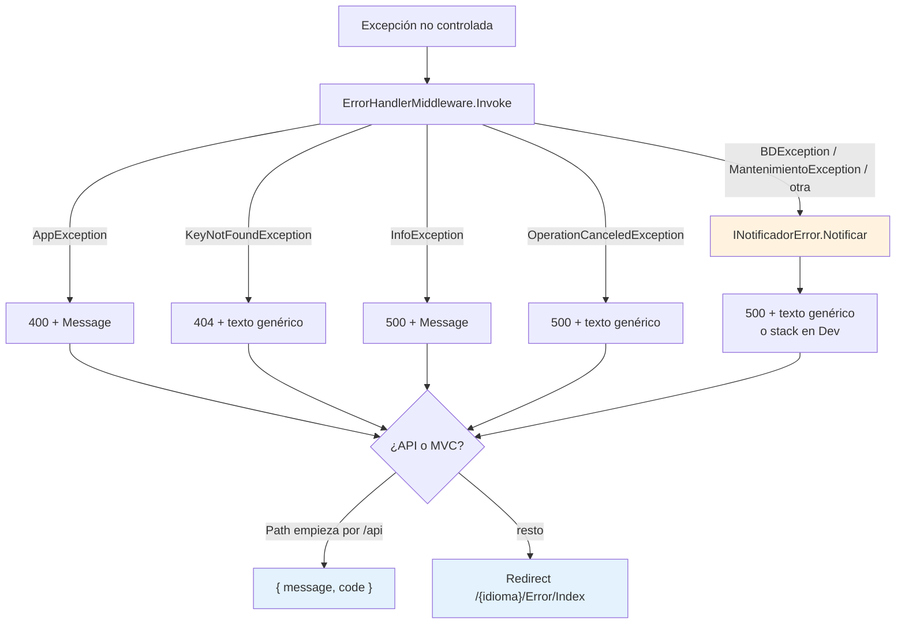
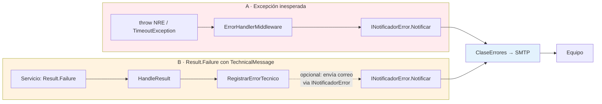
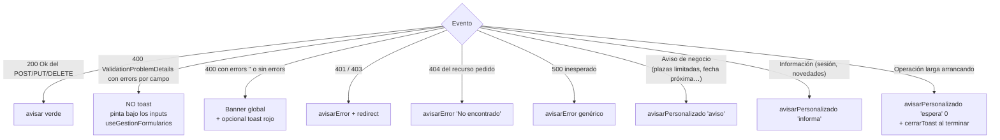
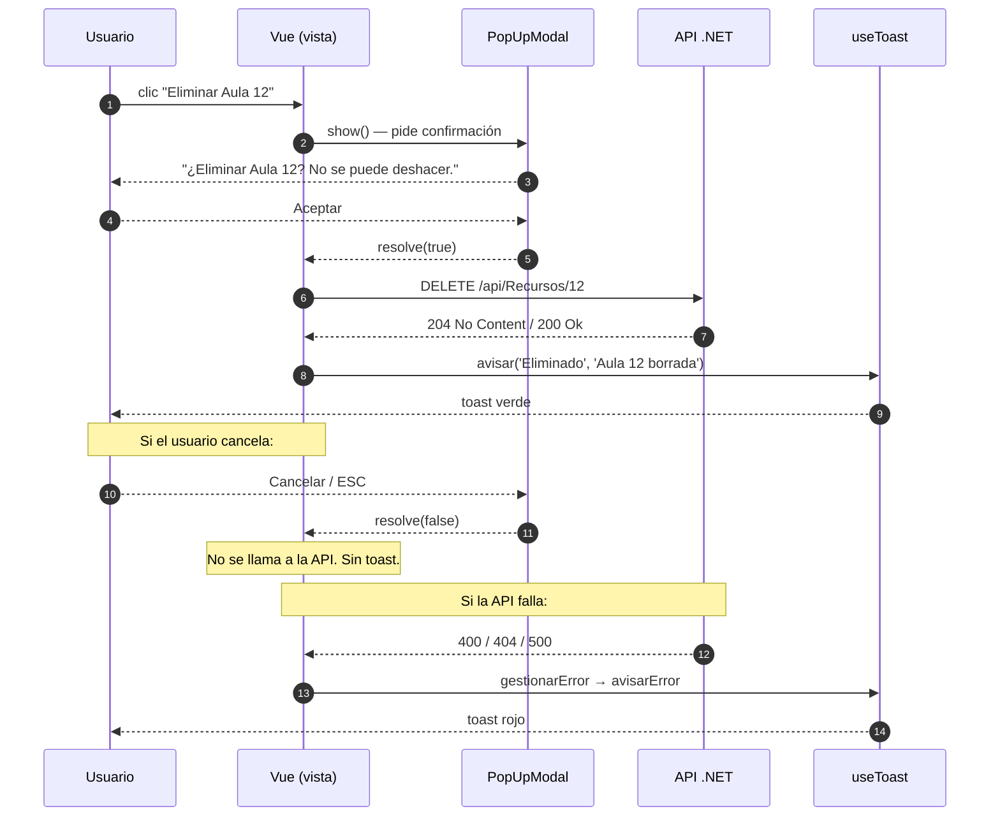

# Sesión 13: Gestión de errores de extremo a extremo

[[toc]]

::: info CONTEXTO
La sesión 12 enseñó **qué formato** usa el servidor para hablar de errores (`ValidationProblemDetails` y `ProblemDetails`) y **dónde** se vuelcan en el formulario (`useGestionFormularios`). Esta sesión cubre el resto del viaje: cómo se origina un error en cada capa, qué excepciones UA siguen teniendo sentido en el modelo nuevo, qué hace el `ErrorHandlerMiddleware` cuando uno **escapa** y cómo se enchufa el correo al equipo.

La clave: en el modelo `Result<T>` la mayoría de los errores **no son excepciones**. Las que sí lo son tienen un tratamiento muy concreto y se notifican siempre. Saber distinguir uno de otro es lo que esta sesión pretende dejar claro.
:::

## Objetivos

Al finalizar esta sesión, el alumno será capaz de:

- Trazar el viaje de un error desde Oracle hasta el toast del usuario, identificando qué pieza interviene en cada tramo.
- Leer e interpretar la anatomía del record `Error` y entender por qué transporta **dos mensajes** (técnico y de usuario).
- Reconocer los **cuatro formatos de mensaje Oracle** soportados por `ErrorPaquetePlSql`: texto plano, literal `# … #`, `# Resources.X.Y|args #` y formato externo UXXI `PKG_X#CODE#FALLBACK#args`.
- Distinguir cuándo usar `BDException`, `AppException`, `InfoException` y `MantenimientoException` en el modelo nuevo.
- Configurar `AddClaseErrores` con sus enriquecedores y enganchar la notificación por correo desde dos puntos complementarios: middleware y `RegistrarErrorTecnico`.
- Notificar al usuario con la familia `useToast` y proteger operaciones destructivas con `PopUpModal`.

## 13.1 El viaje de un error de extremo a extremo {#viaje-error}

Antes del detalle de cada pieza, conviene tener el **mapa entero** delante. Un error que arranca en Oracle puede acabar en tres sitios distintos según de qué tipo sea:



<!-- diagram id="s13-viaje-error" caption: "Viaje completo de un error: tres caminos hacia el usuario y dos hacia el equipo" -->

### 13.1.1 Las tres trayectorias

| Trayectoria | Cuándo | Qué ve el usuario | Quién avisa al equipo |
|-------------|--------|-------------------|------------------------|
| **Bloqueo en cliente** | El propio formulario detecta el error (campo vacío, formato inválido). | Mensaje bajo el input. | Nadie. Es un error normal de UX. |
| **Error esperable** | El servicio devuelve `Result.Failure(...)` con `Validation` / `NotFound` / `Failure`. | Toast rojo o banner global, con texto localizado. | Solo si lleva `TechnicalMessage` — vía `RegistrarErrorTecnico`. |
| **Excepción inesperada** | Algo se rompe de verdad: BD caída, fichero corrupto, NRE. | Mensaje genérico (`Ha ocurrido un error técnico`). | **Siempre** — vía `ErrorHandlerMiddleware`. |

::: tip LA REGLA DE DECISIÓN PARA EL DESARROLLADOR
Cuando escribas un servicio o un controlador, pregúntate por cada `try/catch`:

- ¿Sé qué responder a esto? → **No es excepción**. Devuelve `Result.Failure(Error)` con el `ErrorType` que corresponda.
- ¿Esto no debería estar ocurriendo nunca? → **Sí es excepción**. Déjala escapar para que la pille el middleware.

Si dudas, casi seguro es la primera opción. Las excepciones reales son **raras**: la BD caída, una configuración faltante, un bug.
:::

### 13.1.2 Lo que se mantiene del modelo histórico UA

Aunque el grueso del flujo es `Result<T>` + `HandleResult`, ciertas piezas del stack histórico UA siguen presentes y **siguen teniendo sentido**:

| Pieza UA | Sigue siendo necesaria | Por qué |
|----------|------------------------|---------|
| `BDException` (Usuario / Sistema) | Sí | La sigue lanzando `ClaseOracleBD3`. `ErrorPaquetePlSql.DesdeBDException` la **convierte** a `Result<T>` antes de que el controlador la vea. |
| `AppException`, `InfoException`, `MantenimientoException` | Solo si se necesitan | Para flujos MVC clásicos (vistas Razor) y para modo mantenimiento. La API casi nunca las tira. |
| `ErrorHandlerMiddleware` | Sí | Captura **lo que escape**. En el modelo nuevo escapa muy poco, pero cuando escapa hay que notificarlo. |
| `AddClaseErrores` + enriquecedores | Sí | El envío del correo y la composición del mensaje. Se enchufa **a dos sitios**: middleware (para excepciones) y `RegistrarErrorTecnico` (para `Result.Failure` con `TechnicalMessage`). |
| `ClaseErroresWebAPI.Generar(ModelState)` | **No** | Reemplazada por `ValidationProblemDetails` estándar que devuelve `[ApiController]` automáticamente. |

## 13.2 Anatomía del `Error` UA {#anatomia-error}

Todo `Result<T>.Failure(...)` lleva dentro un `Error` con esta forma (ver `Models/Errors/Error.cs`):

```csharp
public record Error(
    string  Code,
    string  Message,
    ErrorType Type,
    IDictionary<string, string[]>? ValidationErrors = null,
    string? MessageKey       = null,
    object?[]? MessageArgs   = null,
    string? TechnicalMessage = null);
```

Y los tres `ErrorType` posibles (`Models/Errors/ErrorType.cs`):

```csharp
public enum ErrorType
{
    Failure    = 0,   // → HTTP 500
    Validation = 1,   // → HTTP 400
    NotFound   = 2    // → HTTP 404
}
```

### 13.2.1 Para qué sirve cada campo

| Campo | Quién lo lee | Para qué |
|-------|--------------|----------|
| `Code` | El equipo (logs) y opcionalmente el cliente | Identificador estable del error (`"ORA-20702"`, `"TIPO_RECURSO_NO_EXISTE"`). |
| `Message` | El cliente — si no se localiza por `MessageKey` | Mensaje legible "por defecto" en el idioma del literal. |
| `Type` | `HandleResult` | Decide el código HTTP (400 / 404 / 500). |
| `ValidationErrors` | El cliente — `useGestionFormularios` | Diccionario `campo → mensajes[]`. La clave `""` se usa para errores globales. |
| `MessageKey` | `LocalizarMensaje` en `ApiControllerBase` | Clave de `Resources/SharedResource.resx` para traducir según `Content-Language`. |
| `MessageArgs` | `LocalizarMensaje` | Argumentos `{0}`, `{1}` para el `string.Format` de la traducción. |
| `TechnicalMessage` | `RegistrarErrorTecnico` y, en el futuro, Serilog y el correo | Detalle técnico (stack trace, código `ORA`, parámetros) que **no** viaja al cliente. |

### 13.2.2 Por qué dos mensajes distintos

`Message` y `TechnicalMessage` cumplen funciones complementarias y nunca se mezclan:



<!-- diagram id="s13-dos-mensajes" caption: "El Error transporta dos mensajes hacia destinos distintos: uno limpio al cliente, otro técnico al equipo" -->

::: tip POR QUÉ ESTA SEPARACIÓN ES IMPORTANTE
Mezclar las dos cosas tiene **dos consecuencias malas**:

- **De seguridad:** filtrar `ORA-12545` o nombres de paquetes en pantalla revela arquitectura a un atacante.
- **De UX:** un usuario que ve "ORA-00942: la tabla o vista no existe" no sabe qué hacer.

Mantener `Message` (lo que ve el usuario) separado de `TechnicalMessage` (lo que ve el equipo) resuelve los dos a la vez.
:::

### 13.2.3 Cómo construir un `Error` desde un servicio

Los factories del propio `Result<T>` evitan instanciar `Error` a mano:

```csharp
// Servicio
if (idRecurso <= 0)
    return Result<RecursoLectura>.Validation(
        "RECURSO_ID_INVALIDO",
        "El identificador del recurso no es válido.");

if (recurso is null)
    return Result<RecursoLectura>.NotFound(
        "RECURSO_NO_ENCONTRADO",
        "El recurso {0} no existe.",
        idRecurso);

return Result<RecursoLectura>.Success(recurso);
```

Los `params object?[] messageArgs` se quedan en `MessageArgs` y se aplican como `string.Format` cuando se localice el mensaje. Lo verás en §13.3 con los formatos Oracle.

## 13.3 Los cuatro formatos de mensaje desde Oracle {#formatos-oracle}

`ClaseOracleBD3` no conoce el idioma del usuario; lo conoce .NET. Por eso Oracle nunca devuelve un mensaje "ya traducido" — devuelve **una clave** (o un texto literal) en un formato que `ErrorPaquetePlSql.ExtraerMensajeUsuarioOracle` sabe interpretar.

Hay **cuatro formatos** soportados:

| Caso | Formato Oracle | Visible al usuario | Localizado |
|------|----------------|--------------------|------------|
| 1. Error técnico | `Texto plano sin # … #` | **No** | No |
| 2. Literal de usuario | `# Mensaje #` | Sí | No |
| 3. Resource con/sin args | `# Resources.Fichero.Clave[\|arg1\|arg2…] #` | Sí | Sí |
| 4. Externo UXXI | `PKG_X#COD_ERROR#FALLBACK#arg1\|arg2…` | Sí | Sí (si el `.resx` existe) |

::: tip RESUMEN GRÁFICO
- Sin `#` → es **técnico**. Va a `ErrorType.Failure` y el usuario solo ve un genérico.
- Con `#` → es **para el usuario**. Si el contenido empieza por `Resources.` o sigue el patrón UXXI, se traduce contra `SharedResource.{es,ca,en}.resx`.
:::

### 13.3.1 Caso 1 — Error técnico (no visible)

```sql
PROCEDURE EXCEPCION_TECNICA AS
BEGIN
  RAISE_APPLICATION_ERROR(
    -20703,
    'Error interno en UPDATE_TIPO_RECURSO, id=' || p_id);
END;
```

`ErrorPaquetePlSql` lo recibe sin delimitadores `#`. Resultado:

- `BDException.TipoExcepcion = Sistema` (lo marca `ClaseOracleBD3`).
- `ErrorPaquetePlSql.DesdeBDException` devuelve un `Error` con:
  - `Code = "ERROR_TECNICO_ORACLE"` (o `"ORA-20703"` si lo logra extraer)
  - `Message = "Ha ocurrido un error técnico al procesar la operación."` (genérico)
  - `Type = Failure`
  - `TechnicalMessage = "ORA-20703: Error interno en UPDATE_TIPO_RECURSO, id=42"` (el original)

El usuario verá el mensaje genérico. El equipo verá el detalle en `RegistrarErrorTecnico` (log + correo).

### 13.3.2 Caso 2 — Literal visible al usuario

```sql
PROCEDURE OPERACION_NO_PERMITIDA AS
BEGIN
  RAISE_APPLICATION_ERROR(
    -20703,
    '# Operación no permitida en este momento. #');
END;
```

Hay `#` delimitando un literal, sin `Resources.` ni `PKG_`. Resultado:

- `Error.Message = "Operación no permitida en este momento."`
- `Error.MessageKey = null` (no se intenta traducir).
- `Error.Type = Validation` (rango `-20703`).
- HTTP 400 → toast / banner en Vue con ese texto **tal cual**.

::: tip CUÁNDO USARLO
Cuando el texto **no necesita traducción** ni argumentos. Por ejemplo, mensajes para una aplicación interna en un solo idioma o cuando aún no has creado el `.resx`.
:::

### 13.3.3 Caso 3 — Localizado con `Resources.X.Y` (con o sin parámetros)

```sql
PROCEDURE TIPO_RECURSO_CON_ASOCIADOS(p_codigo IN VARCHAR2) AS
BEGIN
  RAISE_APPLICATION_ERROR(
    -20703,
    '# Resources.SharedResource.TIPO_RECURSO_CON_ASOCIADOS|' || p_codigo || ' #');
END;
```

Contenido entre `#`: `Resources.SharedResource.TIPO_RECURSO_CON_ASOCIADOS|SALA`.

`ErrorPaquetePlSql.ResolverMensajeUsuario` separa por `|`:

| Parte | Valor |
|-------|-------|
| Clave de recurso | `Resources.SharedResource.TIPO_RECURSO_CON_ASOCIADOS` |
| `MessageArgs[0]` | `"SALA"` |

`ApiControllerBase.LocalizarMensaje` luego pide a `IStringLocalizer<SharedResource>` la clave normalizada (`TIPO_RECURSO_CON_ASOCIADOS`) con el idioma del usuario. Si el `.resx` contiene:

```text
TIPO_RECURSO_CON_ASOCIADOS = El tipo de recurso "{0}" tiene recursos asociados y no puede eliminarse.
```

El cliente recibe:

```json
{
  "title": "ORA-20703",
  "detail": "El tipo de recurso \"SALA\" tiene recursos asociados y no puede eliminarse.",
  "status": 400,
  "errors": { "": ["El tipo de recurso \"SALA\" tiene recursos asociados y no puede eliminarse."] }
}
```

::: warning USO CORRECTO DEL SEPARADOR `|`
- El separador entre clave y argumentos es `|` (pipe).
- Los argumentos **pueden contener puntos** (`Juan.Pérez|Asignatura.2025` es válido).
- Los argumentos **no deben contener `|`** (no hay escape). Si un parámetro lo necesitara, habría que cambiar el separador en el servicio antes de mandarlo.
- Los placeholders en el `.resx` siguen el patrón `string.Format`: `{0}`, `{1}`, etc.
:::

### 13.3.4 Caso 4 — Externo UXXI (`PKG_X#COD#FALLBACK#args`)

Algunas integraciones UA generan errores en el formato histórico de UXXI:

```sql
PROCEDURE ALUMNO_DUPLICADO(p_nombre IN VARCHAR2, p_apellido IN VARCHAR2) AS
BEGIN
  RAISE_APPLICATION_ERROR(
    -20703,
    'PKG_ALUMNOS#ERR_DUPLICADO#El alumno {0} {1} ya existe#' || p_nombre || '|' || p_apellido);
END;
```

`ErrorPaquetePlSql.ResolverMensajeExterno` reconoce el prefijo `PKG_` y separa por `#`:

| Parte | Valor |
|-------|-------|
| Package | `PKG_ALUMNOS` |
| Código error | `ERR_DUPLICADO` |
| Fallback | `El alumno {0} {1} ya existe` |
| Argumentos | `["Súper", "Crispín"]` |

Intenta resolver `Resources.PKG_ALUMNOS.ERR_DUPLICADO` (clave normalizada). Si existe en el `.resx`:

```text
PKG_ALUMNOS.ERR_DUPLICADO = El alumno {0} {1} ya está registrado en la aplicación.
```

→ resultado localizado.

Si **no** existe, usa el `fallback` formateado con los argumentos:

```text
El alumno Súper Crispín ya existe
```

::: tip POR QUÉ ES ÚTIL EL FALLBACK
Las integraciones con sistemas externos (UXXI, Sigma…) generan códigos de error que están fuera del control del proyecto. El fallback dentro del propio mensaje garantiza que **siempre** verás algo razonable, incluso si nadie ha creado el `.resx`.
:::

### 13.3.5 Reglas de fallback resumidas

| Entrada Oracle | Recurso encontrado | Salida al usuario |
|----------------|---------------------|--------------------|
| `# Mensaje literal #` | — | `Mensaje literal` |
| `# Resources.X.Y #` | Sí | Texto traducido |
| `# Resources.X.Y #` | No | `Resources.X.Y` (clave bruta) |
| `# Resources.X.Y\|a\|b #` | Sí, con `{0}{1}` | Texto traducido con args |
| `# Resources.X.Y\|a\|b #` | No | `Resources.X.Y` (sin formatear) |
| `PKG_X#COD#fallback {0}#arg` | Sí | Texto traducido con args |
| `PKG_X#COD#fallback {0}#arg` | No | `fallback arg` (fallback formateado) |
| Texto plano (sin `#`) | — | Genérico técnico, mensaje real en `TechnicalMessage` |

### 13.3.6 Buenas prácticas de PL/SQL

- **Para errores técnicos:** `RAISE_APPLICATION_ERROR(-20703, 'Detalle técnico…')`. Sin `#`.
- **Para mensajes simples visibles:** `RAISE_APPLICATION_ERROR(-20703, '# Mensaje al usuario. #')`.
- **Para mensajes traducibles:** `RAISE_APPLICATION_ERROR(-20703, '# Resources.SharedResource.CLAVE #')`.
- **Con parámetros:** `RAISE_APPLICATION_ERROR(-20703, '# Resources.SharedResource.CLAVE|' || p_arg1 || '|' || p_arg2 || ' #')`.
- **Crea las claves en los `.resx` de `Resources/SharedResource.{es,ca,en}.resx`.**
- **Evita el carácter `|` dentro de parámetros.** No hay escape.
- **Usa el rango de códigos** que ya conoce `ErrorPaquetePlSql.DesdeCodigo` (`-20702` → 404, `-20703` → 400, etc.) para que el HTTP sea el esperado.

::: info DÓNDE MIRAR EL CÓDIGO
- `Models/Errors/ErrorPaquetePlSql.cs` — los métodos `ExtraerMensajeUsuarioOracle`, `ResolverMensajeUsuario`, `ResolverMensajeExterno`, `LimpiarPrefijoOracle`.
- `Resources/SharedResource.{es,ca,en}.resx` — claves que ya existen (`TIPO_RECURSO_NO_EXISTE`, `TIPO_RECURSO_CON_ASOCIADOS`, `ERROR_TECNICO`).
- `uaReservas.Tests/ErrorPaquetePlSqlTests.cs` — tests del parser para cada formato.
:::

## 13.4 Las cuatro excepciones UA y cuándo siguen teniendo sentido {#excepciones-ua}

Aunque la mayoría de errores ahora viajan en `Result<T>`, las **cuatro excepciones UA históricas** siguen existiendo en los nugets de la plantilla. La pregunta correcta no es "¿las uso?" sino "¿en qué casos concretos tienen aún sentido en el modelo nuevo?".

### 13.4.1 La jerarquía completa



<!-- diagram id="s13-jerarquia-excepciones" caption: "Las cuatro excepciones UA históricas y su namespace/uso" -->

### 13.4.2 Cuándo usar cada una

| Excepción | Lanzada por | En el modelo nuevo se usa para… | Lo que **no** se hace ya |
|-----------|-------------|---------------------------------|---------------------------|
| **`BDException`** (Usuario / Sistema) | `ClaseOracleBD3` automáticamente al recibir `ORA-`. | **No se lanza a mano**. Se atrapa en el servicio con `catch (BDException ex)` y se pasa a `ErrorPaquetePlSql.AResultFailure<T>(ex)` que la convierte en `Result.Failure(Error)`. | Devolver un `BadRequest` con `bdex.Message` directo desde el controlador (patrón antiguo). |
| **`AppException`** | El propio código del proyecto. | Solo si quedan vistas MVC clásicas (Razor) que no han migrado a `Result<T>`. En la API moderna **no se lanza**. | Convertirla en `400` desde controladores que ya devuelven `Result<T>`. |
| **`InfoException`** | El propio código. | Mostrar al usuario un **aviso** que no es realmente un error (`500` con un texto informativo). En la API, en su lugar devuelve un `Result.Success(...)` con metainfo o un `200 + body`. | Usarla como sustituto de validación. |
| **`MantenimientoException`** | El propio código durante una ventana programada. | Cortar requests cuando la app está en modo mantenimiento. Pasa al middleware con notificación. | Confundirla con error: es un corte deliberado. |

::: tip REGLA DE PULGAR PARA ESCRIBIR CÓDIGO NUEVO
- **Servicio:** captura `BDException` y devuelve `Result<T>.Failure(...)`. **No** propagues `BDException`.
- **Controlador:** **no** lances excepciones — devuelve `HandleResult(result)`.
- **`MantenimientoException`** solo si tu proyecto necesita un modo mantenimiento real. Mírate el patrón en `PlantillaMVCCore.Errores` si lo activas.
- **`AppException` / `InfoException`:** evita lanzarlas en código nuevo. Si lo haces, hazlo a sabiendas de que pasarán por el middleware.
:::

### 13.4.3 El patrón `try { } catch (BDException ex) { … }` que aún ves

Es exactamente lo que hace `TiposRecursoServicio.EjecutarPruebaErrorAsync` cuando la excepción Oracle corta la llamada antes de leer los parámetros OUT:

```csharp
try
{
    await _bd.EjecutarParamsAsync(procedimiento, p);
}
catch (BDException ex)
{
    return ErrorPaquetePlSql.AResultFailure<bool>(ex);   // ← BDException → Result.Failure(Error)
}
```

Es la única excepción que sigue cazándose explícitamente en el servicio, **y solo para convertirla en `Result`**. A partir de ese punto el flujo es el mismo que cualquier otro error: `HandleResult` decide el HTTP y `RegistrarErrorTecnico` decide si avisar al equipo.

## 13.5 `ErrorHandlerMiddleware`: el último cortafuegos {#middleware}

Cuando una excepción **no** se atrapa en el servicio y **no** la convierte ningún helper, escapa hacia arriba. El `ErrorHandlerMiddleware` de `PlantillaMVCCore.Errores` la captura en el último momento y decide qué hacer.

### 13.5.1 Qué hace y cómo decide



<!-- diagram id="s13-middleware-decision" caption: "ErrorHandlerMiddleware: clasifica la excepción, decide notificar, y responde según sea API o MVC" -->

### 13.5.2 Lo que decide la notificación

Solo se invoca a `INotificadorError.Notificar` para errores **que no son** de las cuatro excepciones "controladas":

- `AppException`, `KeyNotFoundException`, `InfoException`, `OperationCanceledException` → **no** notifican.
- Cualquier otra (`BDException`, `MantenimientoException`, `NullReferenceException`…) → **sí** notifica.

::: tip POR QUÉ ALGUNAS NO NOTIFICAN
- `AppException` se diseñó como "error de aplicación esperable" — equivalente a una validación. Era el `Result.Validation` de antes.
- `KeyNotFoundException` es el "no encontrado" en el patrón MVC clásico.
- `InfoException` no es un error: es un aviso al usuario.
- `OperationCanceledException` suele venir de que el cliente cerró la pestaña.

Llenar el correo con estos eventos era ruido. Por eso quedaron fuera.
:::

### 13.5.3 Decisión JSON vs MVC

El middleware mira la ruta:

- Si **empieza por `/api`** → responde con JSON: `{ "message": "…", "code": 500 }`.
- Si no → redirige a `/{idioma}/Error/Index` (vista Razor genérica).

::: warning EL CONTRATO JSON DEL MIDDLEWARE NO ES `ProblemDetails`
El cuerpo `{ message, code }` es el formato histórico del middleware UA. **Coexiste** con el `ProblemDetails` que devuelve `HandleResult`. En el cliente, `gestionarError` reconoce los dos (`responseData?.message` para el primero, `problemDetails?.detail` para el segundo).

Cuando la app esté completamente migrada, lo natural es que el middleware emita también `ProblemDetails`. Hasta entonces, conviven sin problema.
:::

### 13.5.4 `UseExceptionHandler("/Error")` que ya tiene el proyecto

`uaReservas/Program.cs` registra hoy el manejador estándar de ASP.NET:

```csharp
if (!app.Environment.IsDevelopment())
{
    app.UseExceptionHandler("/Error");   // redirige a HomeController.Error()
    app.UseHsts();
}
```

Esto **no** sustituye al `ErrorHandlerMiddleware` de la UA: solo da una vista de respaldo para entornos sin él. Si activas `UseErrorHandlerMiddleware()` se enchufa **antes** del routing y se ocupa de todas las excepciones; `UseExceptionHandler("/Error")` queda como red de seguridad por si el middleware UA estuviera deshabilitado.

Para activarlo cuando esté listo, basta con añadir antes de `app.UseRouting()`:

```csharp
app.UseErrorHandlerMiddleware();   // o app.UseMiddleware<ErrorHandlerMiddleware>()
```

::: tip EN ESTE PROYECTO HOY
`uaReservas` no llama a `UseErrorHandlerMiddleware()`. Los errores controlados (`Result.Failure`) generan respuestas correctas con `HandleResult` y no llegan al middleware. Las excepciones **inesperadas** caen al `UseExceptionHandler("/Error")` estándar, que devuelve la vista `Home/Error` y **no notifica** por correo.

La sesión 13 te enseña los dos modelos para que sepas cuándo merece la pena cablear el middleware UA (lo veremos en §13.6).
:::

## 13.6 `AddClaseErrores`: notificación por correo {#add-clase-errores}

`ClaseErrores` es el servicio UA que **compone y envía** el correo de error al equipo. Se registra en `Program.cs` con los enriquecedores que aportan datos útiles al mensaje.

### 13.6.1 Configuración mínima en `appsettings.json`

`uaReservas` ya tiene un esqueleto en `appsettings.json`:

```json
"GestionErrores": {
  "Activo": true,
  "EnvioA": "xx@ua.es",
  "Titulo": "[Error aplicación Plantilla UACloud]"
}
```

Las claves recomendadas para producción son las del patrón UA:

| Clave | Para qué | Sugerencia |
|-------|----------|------------|
| `GestionErrores:Activo` | Permite apagar el envío sin tocar código | `true` en preproducción y producción |
| `GestionErrores:EnvioA` | Destinatarios separados por coma | `equipo@ua.es,oncall@ua.es` |
| `GestionErrores:Remitente` | From del correo | `wwwadm@ua.es` |
| `GestionErrores:ResponderA` | Reply-To | `noresponder@ua.es` |
| `GestionErrores:Titulo` | Prefijo del asunto | `[uaReservas] Error detectado` |
| `GestionErrores:ThrottlingMinutos` | Cooldown entre dos correos del **mismo** error | `5` |
| `GestionErrores:EnvioEnDesarrollo` | Si `false`, NO envía desde `localhost` / `.campus.ua.es` | `false` |
| `App:MensajeErrorxDefecto` | Texto que verá el usuario en errores 500 | `Se ha producido un error. Inténtelo más tarde.` |

::: tip THROTTLING — POR QUÉ ES IMPORTANTE
Si un servicio se cae y mil requests reciben el mismo error en 10 segundos, el throttling evita 1000 correos idénticos al equipo. Con `ThrottlingMinutos = 5`, el segundo correo del **mismo** error tarda al menos 5 minutos en salir. La clave de igualdad es el tipo de excepción + stack trace, no el mensaje literal.
:::

### 13.6.2 Enriquecedores

`AddClaseErrores` devuelve un builder al que se le encadenan **enriquecedores** que añaden secciones al correo:

| Enriquecedor | Sección que añade al correo |
|--------------|-----------------------------|
| `ConEnriquecedorAplicacion()` | `App:NombreApp`, versión, entorno (`Development`/`Staging`/`Production`), servidor, fecha. |
| `ConEnriquecedorPeticionHttp()` | URL completa, método HTTP, IP del cliente, User-Agent, query string, cuerpo del POST (con secretos filtrados). |
| `ConEnriquecedorUsuarioCAS()` | `CodPer`, correo, nombre, roles del usuario autenticado. |
| `ExcluyendoTipos(...)` | Lista de tipos de excepción que **nunca** disparan correo (típicamente `OperationCanceledException`). |

### 13.6.3 `Program.cs` recomendado

```csharp
using ua;
using ua.Models.Plantilla.Errores;
using ua.Models.Plantilla.Errores.Enriquecedores;

var builder = WebApplication.CreateBuilder(args);

// Notificación de errores por correo
builder.Services.AddClaseErrores(builder.Configuration)
    .ConEnriquecedorAplicacion()         // App:NombreApp, versión, entorno
    .ConEnriquecedorPeticionHttp()       // URL, IP, UserAgent, body
    .ConEnriquecedorUsuarioCAS()         // CodPer, correo, roles
    .ExcluyendoTipos(typeof(OperationCanceledException));

builder.Services.AddControllersWithViews();
// … resto

var app = builder.Build();

// Middleware UA antes del routing
app.UseErrorHandlerMiddleware();

app.UseRouting();
app.UseAuthentication();
app.UseAuthorization();
app.MapControllers();
app.Run();
```

### 13.6.4 Los dos puntos de enganche del correo

Aquí está la idea clave del modelo nuevo: el correo se dispara **desde dos sitios diferentes**, y cada uno cubre la mitad de los casos.



<!-- diagram id="s13-dos-rutas-correo" caption: "Dos puntos de inyección del correo: middleware para lo que escapa, RegistrarErrorTecnico para lo controlado pero relevante" -->

#### Ruta A — Middleware (sin tocar código)

Lo que **ya está** activado al llamar a `UseErrorHandlerMiddleware()`. Cualquier excepción que no esté en la lista exenta dispara el correo. No requiere cambios en los servicios.

#### Ruta B — `RegistrarErrorTecnico` (opt-in por endpoint)

`ApiControllerBase.RegistrarErrorTecnico` se llama **siempre** que `HandleResult` recibe un `Failure`, pero hoy solo loguea. Para enviar correo en errores `Failure` (típico: el `error-tecnico` del paquete de pruebas), inyecta `INotificadorError` y notifica:

```csharp
// ApiControllerBase.cs — esbozo recomendado
private void RegistrarErrorTecnico(Error error)
{
    if (string.IsNullOrWhiteSpace(error.TechnicalMessage)) return;

    var logger = HttpContext.RequestServices.GetService<ILogger<ApiControllerBase>>();
    logger?.LogWarning(
        "Error tecnico {Code}: {TechnicalMessage}",
        error.Code, error.TechnicalMessage);

    // Notificación por correo solo para Failure (no para Validation / NotFound).
    if (error.Type != ErrorType.Failure) return;

    var notificador = HttpContext.RequestServices.GetService<INotificadorError>();
    notificador?.Notificar(
        $"Error técnico {error.Code}",
        new ErrorTecnicoControlado(error),       // wrapper que expone error.TechnicalMessage
        ctx => ctx.Operacion = error.Code);
}
```

::: tip POR QUÉ ENVIAR CORREO TAMBIÉN DESDE `RegistrarErrorTecnico`
Sin esto, un `error-tecnico` del paquete Oracle que se reproduce 100 veces al día se quedaría **solo en logs**. Con la notificación, llega al equipo igual que un `NullReferenceException`. El throttling de `ClaseErrores` evita que los 100 correos lleguen — solo llega el primero y luego se rearma cada `ThrottlingMinutos`.

A cambio, **no** notifiques `Validation` ni `NotFound` desde aquí: son errores **del cliente**, no del servidor. La regla queda en el `if (error.Type != ErrorType.Failure) return;`.
:::

### 13.6.5 Modo simple (v1.x) y compatibilidad

Si tu proyecto aún no tiene el `INotificadorError` enriquecido (versión 1.x del nuget), `ClaseErrores` se registra a mano:

```csharp
builder.Services.AddHttpContextAccessor();
builder.Services.AddScoped<ClaseCorreo>();
builder.Services.AddScoped<ClaseErrores>();
```

Y se usa directamente desde el middleware:

```csharp
context.RequestServices.GetService<ClaseErrores>()?
    .GenerarError(error?.Message + " - " + error?.StackTrace, false);
```

`AddClaseErrores(builder.Configuration)` envuelve los dos modelos: si está disponible `INotificadorError`, lo usa; si no, cae al patrón v1.x. **Migrar no requiere tocar el código de los servicios**.

## 13.7 Notificación al usuario en Vue: la familia `useToast` {#toasts}

En el lado del cliente, los errores y avisos se presentan con la familia `useToast` de `@vueua/components`. Ya la viste en la sesión 9; aquí la repasamos como **vocabulario común** del bloque de integración.

### 13.7.1 Las cuatro variantes

```ts
import {
  avisar,                 // toast verde (éxito)
  avisarError,            // toast rojo (error)
  avisarPersonalizado,    // toast custom: 'aviso' (amarillo), 'informa' (azul), 'espera' (con spinner)
  cerrarToast,
  cerrarToastsPorGrupo,
} from '@vueua/components/composables/use-toast';
```

| Función | Color / icono | Cuándo usarla |
|---------|---------------|---------------|
| `avisar(titulo, contenido)` | Verde · check | Confirmación de operación correcta (`Guardado`, `Eliminado`, `Enviado`). |
| `avisarError(titulo, contenido)` | Rojo · cruz | El servidor devolvió error y queremos que el usuario lo vea explícitamente. |
| `avisarPersonalizado(t, c, 'aviso')` | Amarillo · ⚠ | Advertencia: la operación se completó pero hay algo a revisar. |
| `avisarPersonalizado(t, c, 'informa')` | Azul · ℹ | Información sin gravedad (`Tu sesión expira en 5 minutos`). |
| `avisarPersonalizado(t, c, 'espera', 0)` | Toast con spinner, persistente | Operación larga en curso. **Hay que cerrarlo a mano** cuando termine. |

### 13.7.2 Matriz de decisión: ¿qué toast para qué situación?



<!-- diagram id="s13-matriz-toasts" caption: "Qué variante de useToast usar según el evento" -->

::: tip QUIÉN INVOCA QUÉ
- **Éxitos:** los llamas tú desde el código (`avisar('Guardado', ...)`).
- **Errores HTTP:** `gestionarError` (sesión 1 §1.8.5 y sesión 11 §11.4) los dispara automáticamente según `status`.
- **Validación de campos:** **no uses toast**. Va en el formulario con `useGestionFormularios`.

La regla de oro: **un toast por evento del usuario**. Si rellenó cinco campos mal, no muestres cinco toasts — pinta los cinco errores en el formulario y, opcionalmente, un único banner global.
:::

### 13.7.3 Toast de operación larga (patrón canónico)

Cuando arranca un trabajo de fondo (importar fichero, recalcular, etc.) que dura varios segundos, abre un toast persistente con `'espera'` y `tiempo = 0`, captura su id y ciérralo al terminar:

```ts
import { avisar, avisarError, avisarPersonalizado, cerrarToast }
  from '@vueua/components/composables/use-toast';

async function exportar() {
  const idEspera = avisarPersonalizado(
    'Procesando',
    'Estamos generando el informe. Esto puede tardar…',
    'espera',
    0   // 0 = no se cierra solo
  );

  try {
    const blob = await peticion<Blob>('Informes/exportar', verbosAxios.GET, null, null,
      { responseType: 'blob' });
    avisar('Listo', 'El informe se ha generado correctamente.');
    descargar(blob, 'informe.pdf');
  } catch (e) {
    avisarError('No se pudo exportar', 'Inténtalo de nuevo más tarde.');
  } finally {
    cerrarToast(idEspera);   // SIEMPRE: éxito o fallo
  }
}
```

::: warning EL `finally` NO ES OPCIONAL
Si el `cerrarToast` solo se llamara en el `try`, un fallo dejaría el toast "Procesando…" en pantalla para siempre. `finally` cierra el toast **siempre**, hayamos terminado bien o mal.
:::

### 13.7.4 Grupos: cerrar varios toasts a la vez

Si una pantalla dispara varios toasts relacionados con la misma operación, agrúpalos:

```ts
avisar('Recurso 1 guardado', 'Aula 12',          'es', 'reservas');
avisar('Recurso 2 guardado', 'Sala A',           'es', 'reservas');
avisar('Recurso 3 guardado', 'Proyector',        'es', 'reservas');

// En cualquier momento:
cerrarToastsPorGrupo('reservas');
```

Útil cuando una operación batch termina y queremos limpiar el "ruido" antes de mostrar el resumen final.

## 13.8 Confirmar antes de operaciones destructivas {#confirmar}

Borrar, archivar, enviar definitivo: cualquier acción que el usuario no pueda deshacer **debe** pedir confirmación. `PopUpModal` de la sesión 10 ofrece las dos APIs (declarativa e imperativa) que ya conoces; aquí las repasamos en el contexto de errores.

### 13.8.1 Patrón canónico: confirmar → operar → toast



<!-- diagram id="s13-confirmar-borrar" caption: "Patrón canónico de confirmación antes de borrar" -->

### 13.8.2 Implementación con la API imperativa

La forma más limpia cuando la confirmación está **en mitad** de una función async:

```vue
<script setup lang="ts">
import { ref } from 'vue';
import { PopUpModal } from '@vueua/components/ui/popup-modal';
import { peticion, verbosAxios, gestionarError } from '@vueua/components/composables/use-axios';
import { avisar } from '@vueua/components/composables/use-toast';

interface IRecurso { id: number; nombre: string }
const recursos = ref<IRecurso[]>([]);

// Ref imperativo al modal
const confirmEliminar = ref<InstanceType<typeof PopUpModal>>();
const aEliminar = ref<IRecurso | null>(null);

async function eliminar(recurso: IRecurso) {
  aEliminar.value = recurso;

  const confirmado = await confirmEliminar.value?.show();
  if (!confirmado) return;                              // cancelado: salir limpio

  try {
    await peticion<void>(`Recursos/${recurso.id}`, verbosAxios.DELETE);
    recursos.value = recursos.value.filter(r => r.id !== recurso.id);
    avisar('Eliminado', `${recurso.nombre} se ha eliminado.`);
  } catch (e: any) {
    gestionarError(e, 'No se pudo eliminar', `Error al borrar ${recurso.nombre}.`);
  }
}
</script>

<template>
  <ul>
    <li v-for="r in recursos" :key="r.id" class="d-flex">
      <span class="flex-grow-1">{{ r.nombre }}</span>
      <button class="btn btn-sm btn-danger" @click="eliminar(r)">Eliminar</button>
    </li>
  </ul>

  <PopUpModal ref="confirmEliminar">
    <template #header>¿Eliminar {{ aEliminar?.nombre }}?</template>
    <template #body>Esta acción no se puede deshacer.</template>
  </PopUpModal>
</template>
```

::: tip POR QUÉ LA API IMPERATIVA AQUÍ
La confirmación es un **único paso** dentro de la función `eliminar`. Con `await modal.show()` el código se lee de arriba abajo. Si usaras la API declarativa (`v-model:visible`), tendrías que partir la lógica en dos funciones (`onClickEliminar` y `onConfirmarEliminar`) y mantener un `pendienteId` en una `ref` aparte. Más código y más estado.
:::

### 13.8.3 Cuándo usar la API declarativa

Cuando el modal **no** vive solo dentro de una función async, sino que su visibilidad es **estado** de la vista (porque otros bloques también lo consultan o cambian):

```vue
<button class="btn btn-danger" @click="abrirConfirmacion = true">Eliminar</button>

<PopUpModal v-model:visible="abrirConfirmacion"
            @confirmar="onConfirmar"
            @cancelar="onCancelar">
  <template #header>¿Eliminar el recurso?</template>
  <template #body>Esta acción no se puede deshacer.</template>
</PopUpModal>
```

Si dudas, empieza por la **imperativa**. La declarativa solo gana si más de un elemento de la UI necesita saber si el modal está abierto.

### 13.8.4 Buenas prácticas de UX en confirmaciones

- **Sé específico en el `#header`.** "¿Eliminar?" obliga al usuario a leer el cuerpo; "¿Eliminar **Aula 12**?" ya se entiende.
- **Resalta lo irreversible en `#body`.** "Esta acción no se puede deshacer." o "Se perderán las reservas asociadas."
- **Etiqueta el botón principal con el verbo concreto.** `PopUpModal` lo permite vía slot `#buttons` si no quieres el "Aceptar" por defecto. "Eliminar" rojo es mejor que "Aceptar" genérico.
- **El cancelar no necesita toast.** Si el usuario cancela, no ha pasado nada; un toast sobre algo que no ocurrió es ruido.
- **No abuses.** Pedir confirmación para cada clic acaba en "Aceptar automático". Reserva la confirmación para **acciones destructivas**.

## 13.9 Sandbox y resumen final {#sandbox}

### 13.9.1 Casos que puedes disparar hoy

| Caso | Cómo dispararlo | Qué cubre de esta sesión |
|------|-----------------|---------------------------|
| Error 404 controlado | Probador → botón `recurso-no-existe` (ORA-20702) | §13.1, §13.2, §13.3 (caso 3 con args), `Result.NotFound` |
| Error 400 controlado | Probador → botón `recurso-con-asociados` (ORA-20703) | §13.1, §13.3 (caso 3), banner global en `useGestionFormularios` |
| Error 500 controlado con `TechnicalMessage` | Probador → botón `error-tecnico` | §13.1, §13.6 (la ruta B del correo desde `RegistrarErrorTecnico`) |
| Error 400 automático por DataAnnotation | Scalar → POST `/api/TipoRecursos` con `Codigo=""` | §12.3 (DataAnnotations) y §13.1 (validación bloqueada) |
| Toast de éxito | Cualquier guardado correcto desde el CRUD de la sesión 10 | §13.7 — `avisar` |
| Confirmación + borrado | "Eliminar" del CRUD integrador (`Sesion10CrudRecursos.vue`) | §13.8 — `PopUpModal` |

### 13.9.2 De Oracle a Vue, todo junto

| Dónde nace | Cómo viaja | HTTP | Qué ve el usuario | Qué ve el equipo |
|------------|-----------|------|---------------------|--------------------|
| DataAnnotation `[Required]` | `[ApiController]` → `ValidationProblemDetails` | 400 | Mensaje bajo el input (`useGestionFormularios.errorDeCampo`) | Nada (no es bug) |
| FluentValidation regla global | `[ApiController]` → `errors[""]` | 400 | Banner global (`erroresGlobales`) | Nada |
| Servicio: `Result.NotFound` | `HandleResult` → `ProblemDetails` | 404 | Toast rojo (`gestionarError`) | Nada |
| Servicio: `Result.Validation` | `HandleResult` → `ValidationProblemDetails` | 400 | Banner global o campo según `errors` | Nada |
| Servicio: `Result.Failure` con `TechnicalMessage` | `HandleResult` → `ProblemDetails` | 500 | Toast genérico | `RegistrarErrorTecnico` → log + correo (si se notifica) |
| Oracle `BDException` (Usuario, `#…#`) | `ErrorPaquetePlSql.DesdeBDException` → `Result.Validation`/`Failure` según rango | 400 / 500 | Banner global (mensaje localizado) | `RegistrarErrorTecnico` (solo si `Failure`) |
| Oracle `BDException` (Sistema, sin `#…#`) | `ErrorPaquetePlSql.DesdeBDException` → `Result.Failure` | 500 | Toast genérico | Log + correo via `RegistrarErrorTecnico` |
| Excepción inesperada (NRE, timeout) | `ErrorHandlerMiddleware` → `{ message, code }` | 500 | Toast genérico | `INotificadorError.Notificar` → correo |

### 13.9.3 Checklist para una funcionalidad lista para producción

- [ ] El servicio devuelve `Result<T>` y **no lanza excepciones** para flujos esperables.
- [ ] El controlador hereda de `ApiControllerBase` y termina con `HandleResult(result)`.
- [ ] Los mensajes Oracle visibles usan formato `# Resources.SharedResource.CLAVE|args #` (caso 3) cuando sea posible.
- [ ] Los errores técnicos Oracle (sin `#`) llegan al `TechnicalMessage` y disparan `RegistrarErrorTecnico`.
- [ ] El formulario Vue usa `useGestionFormularios({ aislado: true })` con `errorDeCampo` / `erroresDeCampo` / banner global.
- [ ] El `catch` de la llamada axios distingue `400 con errors` (a `adaptarProblemDetails`) del resto (a `gestionarError`).
- [ ] Las operaciones destructivas piden confirmación con `PopUpModal`.
- [ ] El éxito muestra un `avisar(...)`; el error muestra `avisarError(...)`; los avisos en curso usan `'espera'` con `tiempo = 0` y `cerrarToast` en `finally`.
- [ ] `Program.cs` activa `AddClaseErrores().ConEnriquecedor*()` y `UseErrorHandlerMiddleware()`.
- [ ] `appsettings.{Production,Preproduccion}.json` define `EnvioA`, `Titulo` y `ThrottlingMinutos`.
- [ ] Los `.resx` (`SharedResource.{es,ca,en}.resx`) contienen las claves referenciadas desde PL/SQL.

## 13.10 Próxima sesión {#siguiente}

En la **sesión 14 — DataTable + ClaseCrud** aplicamos todo lo visto a un listado con paginación servidor, filtros, ordenación y acciones por fila (incluyendo eliminación con confirmación). Los errores que ahora dominas vuelven a aparecer en cada acción: añadir, editar, borrar, exportar. Ya tienes los reflejos: `Result<T>` en servidor, `useGestionFormularios` y `useToast` en cliente, `PopUpModal` para lo irreversible.

En la **sesión 20 — Serilog** sustituimos el `ILogger` que aparece en `RegistrarErrorTecnico` por un pipeline estructurado con sinks Console, Oracle, File y Email. El `TechnicalMessage` deja de ser una cadena pegada y se convierte en propiedades estructuradas (`Code`, `UserCodPer`, `RequestPath`, `Operation`). El correo del equipo se compone también ahí, con plantillas y reglas de routing por severidad.


