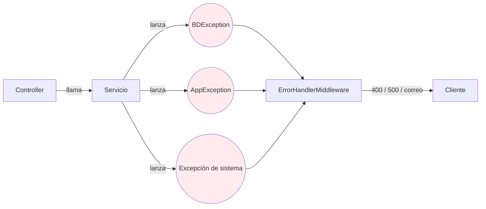
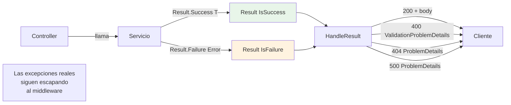
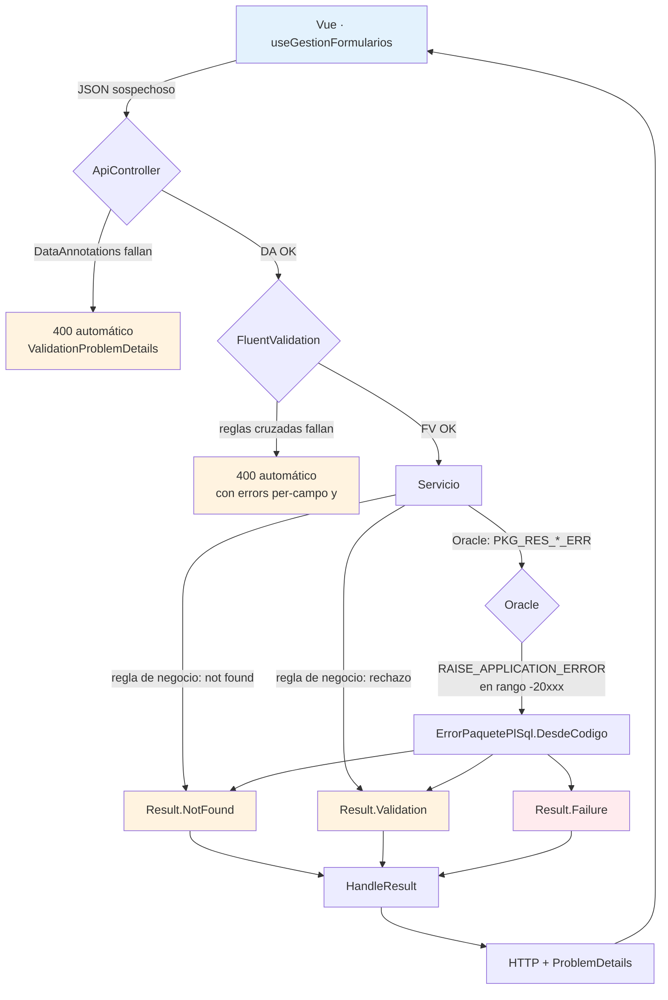
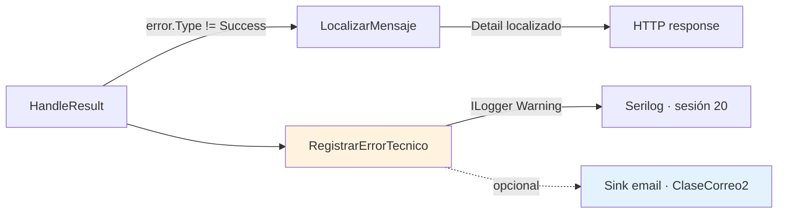
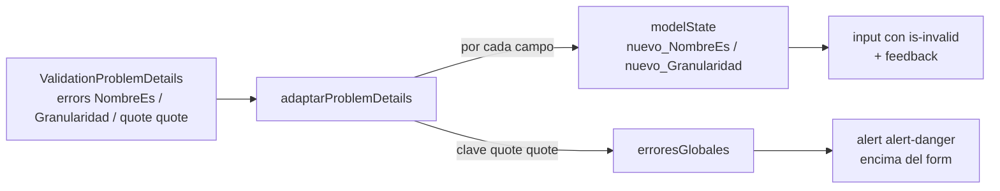

# Sesión 12: Validación en todas las capas

[[toc]]

::: info CONTEXTO
La validación recorre toda la aplicación: Oracle protege la integridad, .NET valida los datos del cliente, Vue da feedback inmediato al usuario. Ninguna capa basta por sí sola: la del cliente se puede saltar editando el navegador; la del servidor se puede saltar llamando a la API con `curl`; la de la base de datos llega tarde para el usuario. Las **tres** son necesarias, y se comunican a través de un **único formato de respuesta**: `ValidationProblemDetails`.

Esta sesión enseña ese pipeline completo. Más importante que la sintaxis es **entender qué cambia respecto del modelo anterior** del Servicio de Informática (excepciones + middleware) y por qué.
:::

## Objetivos

Al finalizar esta sesión, el alumno será capaz de:

- Distinguir **error esperable** de **error inesperado** y elegir el mecanismo adecuado para cada uno.
- Explicar el cambio del modelo "excepción + middleware" al modelo "`Result<T>` + `HandleResult`" y qué problemas resuelve.
- Aplicar **DataAnnotations** para reglas de un solo campo.
- Añadir **FluentValidation** cuando aparecen reglas cruzadas o asíncronas.
- Reconocer cómo viaja un error de Oracle (paquete `PKG_RES_*_ERR`) hasta convertirse en un `400 ValidationProblemDetails`.
- Saber dónde se centraliza el envío de correo / log estructurado del error técnico (`RegistrarErrorTecnico` en `ApiControllerBase`).
- Pintar errores por campo y errores globales en Vue con `useGestionFormularios`.

## 12.1 El cambio profundo: de excepciones a `Result<T>` {#cambio-profundo}

Antes de hablar de DataAnnotations o FluentValidation hay que entender **qué modelo de gestión de errores** usa `uaReservas`. No es el modelo histórico del Servicio de Informática, y conviene que el alumno se lo represente bien antes de tocar código.

### 12.1.1 El modelo anterior (que ya no usamos)



<!-- diagram id="s12-modelo-antiguo" caption: "Modelo anterior: cualquier problema es una excepción que el middleware captura" -->

**Idea base:** "todo error es una excepción". Si el usuario no existe → `AppException`. Si Oracle rechaza → `BDException`. Si la BD está caída → `BDException` también. El middleware atrapa **todas** y decide qué devolver.

Funciona, pero arrastra problemas:

| Problema | Consecuencia |
|----------|--------------|
| Las excepciones son **caras**: capturar pila, recorrer `catch` blocks. | Bajo rendimiento en errores frecuentes (validación). |
| Una excepción **no aparece** en la firma del método. | Un `await servicio.CrearAsync(dto)` no avisa al lector de que puede tirar `AppException`. |
| Hay que decidir el HTTP **en el middleware**. | El controlador, que conoce mejor el contexto, no participa. |
| Validación esperable y bug imprevisto **usan el mismo canal**. | El log se llena de "excepciones" que no son fallos. |
| Para añadir un campo `errors` por campo, el middleware tiene que conocer una clase ad-hoc (`ClaseErroresWebAPI`). | El formato no es el estándar `ProblemDetails`. |

### 12.1.2 El modelo actual: `Result<T>` + `HandleResult`



<!-- diagram id="s12-modelo-actual" caption: "Modelo actual: error esperable viaja en Result<T>; las excepciones siguen yendo al middleware solo para lo realmente inesperado" -->

Ahora el servicio devuelve un `Result<T>` **siempre**. No lanza excepción para "datos inválidos" o "no encontrado" — los empaqueta:

```csharp
public Task<Result<bool>> EliminarAsync(int id)
{
    // ...llamada al paquete PL/SQL...
    var failure = ErrorPaquetePlSql.AResultFailure<bool>(
        codigoError, mensajeError);
    if (failure is not null) return failure;     // Result<bool>.Failure(Error{Type=Validation|NotFound|Failure})

    return Result<bool>.Success(true);
}
```

El controlador no escribe ni un `if/else`:

```csharp
[HttpDelete("{id}")]
public async Task<ActionResult> Eliminar(int id) =>
    HandleResult(await _tiposRecurso.EliminarAsync(id));
```

`HandleResult` (en `ApiControllerBase`) hace el `switch` por `ErrorType` y devuelve **un único formato**:

| `ErrorType` | HTTP | Body |
|-------------|------|------|
| `Success`   | 200 | `result.Value` |
| `Validation` | 400 | `ValidationProblemDetails` con `errors` (puede tener clave `""` para errores globales) |
| `NotFound`  | 404 | `ProblemDetails` |
| `Failure`   | 500 | `ProblemDetails` genérico |

### 12.1.3 ¿Qué ha cambiado de verdad?

| Antes (excepciones + middleware) | Ahora (`Result<T>` + `HandleResult`) |
|----------------------------------|--------------------------------------|
| El servicio **tira** excepciones específicas (`AppException`, `BDException.Usuario`). | El servicio **devuelve** `Result<T>.Failure(Error)`. Sin excepciones para flujos esperables. |
| El controlador rara vez ve los errores: el middleware los atrapa. | El controlador tiene el `Result<T>` en la mano y lo pasa a `HandleResult`. |
| El cuerpo de la respuesta es una clase ad-hoc (`ClaseErroresWebAPI`). | El cuerpo es **estándar `ProblemDetails` / `ValidationProblemDetails`** (RFC 7807). |
| Los `try/catch` están desperdigados (en el servicio, en el controlador, en el middleware). | Solo hay **un** sitio donde se decide qué devolver: `HandleResult`. |
| El log se llena de excepciones "esperables". | Solo loguean los errores con `TechnicalMessage` no vacío (errores de verdad, no validaciones). |

::: tip LA REGLA DE ORO QUE NACE DE ESTE CAMBIO
**Lanza excepción solo cuando no sabes qué hacer.** Un dato inválido, un recurso no encontrado, un error de negocio devuelto por Oracle: todo eso es esperable y viaja en `Result<T>`. Una caída de la BD, un timeout, un fallo de configuración: eso sí es inesperado y debe escapar como excepción para que el middleware lo capture, lo registre y avise.
:::

### 12.1.4 El middleware sigue ahí, pero para menos cosas

Las excepciones que **escapan** del controlador (no porque un servicio las tire a propósito, sino porque algo se rompió de verdad) siguen las captura el `ErrorHandlerMiddleware` de la plantilla UA. Su trabajo ahora es más simple:

- Loggear con Serilog (sesión 20).
- Enviar correo al equipo si el entorno está configurado para ello (sesión 13).
- Devolver un `500 ProblemDetails` genérico al cliente.

No tiene que distinguir entre "validación", "no encontrado" y "bug": esos ya los resolvió el controlador con `HandleResult` mucho antes de llegar al middleware.

## 12.2 Las cuatro capas de validación {#pipeline}

Con el modelo claro, vamos al pipeline completo. Cada capa tiene su responsabilidad y ninguna duplica el trabajo de las otras.



<!-- diagram id="s12-pipeline-validacion" caption: "Pipeline completo: cuatro filtros sobre los datos del cliente, una sola respuesta" -->

### 12.2.1 Tabla resumen

| Capa | Qué valida | Cómo | Quién devuelve el `400` |
|------|------------|------|--------------------------|
| **Oracle** (BD) | Integridad estructural (NOT NULL, UNIQUE, FK, CHECK) | Constraints. | No llega al cliente: provocaría `BDException`. Suele ser última red de seguridad. |
| **Oracle** (paquetes) | Reglas de negocio que solo la BD conoce | `RAISE_APPLICATION_ERROR(-20xxx, '...')` | El servicio .NET, con `ErrorPaquetePlSql.AResultFailure` → `Result.Failure(...)` → `HandleResult`. |
| **.NET — DTO** | Presencia, longitud, rango, formato | DataAnnotations (`[Required]`, `[Range]`, `[StringLength]`) | `[ApiController]` automáticamente. El controlador ni se ejecuta. |
| **.NET — Validator** | Reglas cruzadas (campo A vs campo B), reglas asíncronas | FluentValidation | `AddFluentValidationAutoValidation()` automáticamente, antes del controlador. |
| **.NET — Servicio** | Reglas de negocio que requieren consultar BD pero **no** son delegables a paquetes | `Result.Validation(...)` / `Result.NotFound(...)` | `HandleResult`. |
| **Vue** | Feedback inmediato (UX) | `required`, `min`, `max` HTML5 + `useGestionFormularios.validarFormulario` | Bloquea el submit; **no** sustituye la validación del servidor. |

::: warning POR QUÉ VALIDAR EN VARIAS CAPAS NO ES DUPLICAR
Cada capa protege contra una amenaza distinta:

- **Vue** protege contra equivocaciones honestas del usuario.
- **DataAnnotations** protege el contrato del DTO frente a clientes mal escritos.
- **FluentValidation** protege reglas que requieren conocer todo el DTO.
- **Servicio + Oracle** protegen la **integridad real** de los datos: nadie puede saltárselas, ni un atacante con `curl`.

Quitar la primera capa empeora la UX; quitar las del servidor compromete los datos. No son intercambiables.
:::

### 12.2.2 El formato de respuesta es siempre el mismo

Da igual qué capa rechace los datos: el JSON que recibe Vue tiene la misma forma:

```json
{
  "type": "https://tools.ietf.org/html/rfc7807",
  "title": "ORA-20703",
  "detail": "El tipo de recurso tiene recursos asociados.",
  "status": 400,
  "errors": {
    "NombreEs": ["El nombre en español es obligatorio."],
    "Granularidad": ["La granularidad no puede superar la duración máxima."],
    "": ["El tipo de recurso tiene recursos asociados."]
  }
}
```

| Clave en `errors` | Quién la pone | Significado |
|-------------------|---------------|-------------|
| Nombre de propiedad (`NombreEs`, `Granularidad`) | DataAnnotations / FluentValidation `RuleFor(x => x.Campo)` | Error específico de **ese** campo. Vue lo pinta debajo del input. |
| Clave vacía `""` | FluentValidation `RuleFor(x => x).Custom((d, ctx) => ctx.AddFailure("", "..."))`, o paquete Oracle con error global | Error **transversal**. Vue lo pinta como banner encima del formulario. |

Esa simetría —cualquier validación rota, el mismo formato— es lo que hace que `useGestionFormularios` en Vue sea simple: no le importa **quién** rechazó, solo **qué** y **dónde**.

## 12.3 DataAnnotations: la primera línea {#data-annotations}

Las DataAnnotations son atributos en las propiedades del DTO. Como el controlador lleva `[ApiController]` (lo aporta `ControllerBase` en el proyecto), .NET ejecuta esas validaciones **antes** de entrar al método. Si fallan, devuelve 400 directamente con `ValidationProblemDetails` y el controlador **ni se ejecuta**.

Ejemplo real (`TipoRecursoCrearDto.cs`):

```csharp
using System.ComponentModel.DataAnnotations;

namespace ua.Models.Reservas
{
    public class TipoRecursoCrearDto
    {
        [Required, MaxLength(100)]
        public string Codigo   { get; set; } = string.Empty;

        [Required, MaxLength(150)]
        public string NombreEs { get; set; } = string.Empty;

        [Required, MaxLength(150)]
        public string NombreCa { get; set; } = string.Empty;

        [Required, MaxLength(150)]
        public string NombreEn { get; set; } = string.Empty;
    }
}
```

Y `ReservaCrearDto.cs` añade rangos numéricos:

```csharp
public class ReservaCrearDto
{
    [Range(1, int.MaxValue)] public int IdRecurso     { get; set; }
    [Range(0, 23)]           public int HoraInicio    { get; set; }
    [Range(0, 59)]           public int MinutoInicio  { get; set; }
    [Range(1, 24 * 60)]      public int MinutosReserva{ get; set; }
    [Required]               public DateTime FechaReserva { get; set; }
    [MaxLength(1000)]        public string? Observaciones { get; set; }
}
```

### 12.3.1 Atributos más usados

| Atributo | Cuándo usarlo |
|----------|---------------|
| `[Required]` | El campo no puede ser `null` ni cadena vacía. |
| `[MaxLength(n)]` / `[StringLength(max, MinimumLength = min)]` | Longitud de texto. `MaxLength` coincide con la columna Oracle. |
| `[Range(min, max)]` | Rangos numéricos cerrados (incluye los extremos). |
| `[EmailAddress]` | Formato de correo (no comprueba existencia). |
| `[RegularExpression(@"...")]` | Cualquier patrón (NIF, código postal, etc.). |

### 12.3.2 Lo que NO debe ir en DataAnnotations

- Reglas que comparan **dos** campos (`FechaFin > FechaInicio`).
- Reglas que requieren **consultar la BD** (¿ya existe ese código?).
- Reglas que cambian según otro campo (`if Tipo == 'X' entonces Campo Y obligatorio`).

Para todo lo anterior, ver §12.4.

::: tip MENSAJES EN ESPAÑOL POR DEFECTO
Sin configuración extra, el `title` del `ValidationProblemDetails` viene en inglés (`"One or more validation errors occurred."`). La plantilla UA lo localiza automáticamente — los mensajes individuales los puedes poner en español dentro de `ErrorMessage = "..."` si los necesitas a medida.
:::

## 12.4 FluentValidation: reglas cruzadas y asíncronas {#fluent-validation}

Cuando una regla no cabe en un atributo, FluentValidation expresa la lógica en código C# pleno.

### 12.4.1 Instalación y registro

```bash
dotnet add package FluentValidation.AspNetCore
```

```csharp
// Program.cs — antes de AddControllersWithViews / AddControllers
builder.Services.AddFluentValidationAutoValidation();
builder.Services.AddValidatorsFromAssemblyContaining<Program>();
```

Con `AddFluentValidationAutoValidation()`, el validador corre **antes** del controlador igual que las DataAnnotations. Si falla, también devuelve `400 ValidationProblemDetails` automáticamente.

### 12.4.2 Validator de campo

```csharp
public sealed class TipoRecursoCrearDtoValidator : AbstractValidator<TipoRecursoCrearDto>
{
    public TipoRecursoCrearDtoValidator()
    {
        RuleFor(x => x.Codigo)
            .NotEmpty().WithMessage("El código es obligatorio.")
            .MaximumLength(100);

        RuleFor(x => x.NombreEs)
            .NotEmpty().WithMessage("El nombre en español es obligatorio.")
            .MaximumLength(150);
    }
}
```

Esto coexiste con DataAnnotations: ambas se ejecutan; los mensajes pueden duplicarse si declaras la misma regla en los dos sitios.

::: tip CRITERIO PRÁCTICO
- **DataAnnotations** para reglas de un campo.
- **FluentValidation** cuando aparece la primera regla cruzada o asíncrona.

No mezcles los dos para el **mismo** campo: o todo en DA o todo en FV.
:::

### 12.4.3 Regla cruzada con error asignado a un campo

```csharp
RuleFor(x => x.MinutoInicio)
    .Must((dto, minuto) => (dto.HoraInicio * 60 + minuto + dto.MinutosReserva) <= 24 * 60)
    .WithMessage("La reserva se sale del día.");
```

El error aparece en `errors["MinutoInicio"]`. Vue lo pinta bajo ese input.

### 12.4.4 Regla cruzada sin campo claro (error global)

Cuando la regla no es de "un campo" sino "del DTO entero", se usa `RuleFor(x => x).Custom` y se añade el error a la clave `""`:

```csharp
RuleFor(x => x).Custom((dto, ctx) =>
{
    if (dto.FechaConfirmacion.HasValue && dto.FechaConfirmacion < dto.FechaReserva)
    {
        ctx.AddFailure("",   // ← clave vacía = error global
            "La fecha de confirmación no puede ser anterior a la fecha de la reserva.");
    }
});
```

En Vue, esto va al banner de errores globales encima del formulario (`erroresGlobales` en `useGestionFormularios`).

### 12.4.5 Regla asíncrona contra la BD

```csharp
public TipoRecursoCrearDtoValidator(ITiposRecursoServicio servicio)
{
    RuleFor(x => x.Codigo)
        .MustAsync(async (codigo, ct) => !await servicio.ExisteCodigoAsync(codigo))
        .WithMessage("Ya existe un tipo de recurso con ese código.");
}
```

Útil para unicidad ligera. Si la regla es costosa o si la BD ya tiene una constraint UNIQUE, considera dejarla en Oracle y capturar el `ORA-00001` en el servicio.

## 12.5 Errores de Oracle: el camino idiomático {#errores-oracle}

`uaReservas` incluye **paquetes de prueba** de errores precisamente para que el alumno vea, sin tocar BD, cómo viaja un error desde el `RAISE_APPLICATION_ERROR` hasta el `errors` del JSON. Son los botones rojos / amarillos del probador (`Sesion1ProbadorApi.vue`).

| Botón del probador | Llama a | Lanza `ORA-` | `ErrorType` | HTTP |
|--------------------|---------|--------------|-------------|------|
| `recurso-no-existe` | `PKG_RES_TIPO_RECURSO_ERR.PROBAR_RECURSO_NO_EXISTE` | `-20702` | `NotFound` | 404 |
| `recurso-con-asociados` | `PKG_RES_TIPO_RECURSO_ERR.PROBAR_RECURSO_CON_ASOCIADOS` | `-20703` | `Validation` | 400 |
| `error-tecnico` | `PKG_RES_TIPO_RECURSO_ERR.PROBAR_ERROR_TECNICO` | (excepción Oracle no esperada) | `Failure` | 500 |

### 12.5.1 El formato del mensaje en el paquete

Los paquetes UA escriben mensajes con un convenio: `RAISE_APPLICATION_ERROR(-20xxx, '#CLAVE|arg1|arg2#')`. El cliente Oracle (`ClaseOracleBD3`) los entrega al servicio, que llama al traductor:

```csharp
var failure = ErrorPaquetePlSql.AResultFailure<bool>(
    ErrorPaquetePlSql.LeerInt(p,   "P_CODIGO_ERROR"),
    ErrorPaquetePlSql.LeerString(p,"P_MENSAJE_ERROR"));
if (failure is not null) return failure;
```

`ErrorPaquetePlSql.DesdeCodigo`:

1. **Mapea el código** a `ErrorType` (rango → `NotFound` / `Validation` / `Failure`).
2. **Extrae la clave** entre `#` y los argumentos separados por `|`.
3. Devuelve un `Error` con `Code`, `MessageKey`, `MessageArgs` y un mensaje técnico para los logs.

`HandleResult` traduce a HTTP y, antes de devolver, llama a `LocalizarMensaje(error)` con `IStringLocalizer<SharedResource>`: por eso el `detail` viaja en el idioma del usuario.

::: tip POR QUÉ ES "IDIOMÁTICO"
- El paquete PL/SQL nunca devuelve `'Error al borrar TipoRecurso'`. Devuelve **una clave** (`TIPO_RECURSO_TIENE_RECURSOS_ASOCIADOS`) y los argumentos para componerla.
- El servidor decide el idioma del usuario en función del JWT y traduce.
- El cliente recibe ya el texto correcto.

Así, **cambiar el idioma del usuario no requiere tocar PL/SQL ni .NET**. Solo el `.resx` del `SharedResource`.
:::

### 12.5.2 Lo que ve Vue es lo mismo, venga de donde venga

Tanto si el rechazo nace en DataAnnotations, en FluentValidation o en `PKG_RES_*_ERR`, el JSON tiene la **misma forma**. Eso es lo que permite que el código de Vue sea uno solo, sin un `if` por origen del error.

## 12.6 `RegistrarErrorTecnico`: el correo y el log de los errores que pasan {#registrar-error-tecnico}

Hay errores que el usuario solo necesita ver de forma **escueta** ("Ha ocurrido un problema. Inténtalo más tarde."), pero el equipo necesita en **detalle** para diagnosticar: stack trace, código `ORA-`, valor de los parámetros, etc.

En el modelo nuevo, ese detalle **no se pierde**: viaja en `Error.TechnicalMessage`. Lo que llega al cliente es el `Detail` localizado y limpio (sin nombres de procedimientos ni `ORA-`). El detalle técnico se procesa en un único método central de `ApiControllerBase`:

```csharp
// ApiControllerBase.cs
private void RegistrarErrorTecnico(Error error)
{
    if (string.IsNullOrWhiteSpace(error.TechnicalMessage)) return;

    var logger = HttpContext.RequestServices.GetService<ILogger<ApiControllerBase>>();
    logger?.LogWarning(
        "Error tecnico asociado a respuesta funcional {Code}: {TechnicalMessage}",
        error.Code, error.TechnicalMessage);
}
```

### 12.6.1 Por qué este es el sitio del correo

Cualquier `Result.Failure(Error)` que pase por `HandleResult` invoca a `RegistrarErrorTecnico`. Tenemos en ese punto:

- El `Code` (ej. `ORA-20703`) para clasificar.
- El `TechnicalMessage` con el detalle completo.
- El `HttpContext`, que permite leer cabeceras, ruta, usuario.



<!-- diagram id="s12-registrar-error" caption: "Cada Failure pasa por RegistrarErrorTecnico antes de salir; aquí es donde enchufar log estructurado y correo" -->

::: warning DÓNDE NO METER EL CORREO
- **No** dentro del servicio (acoplaríamos negocio con notificaciones).
- **No** dentro del paquete PL/SQL (acoplaríamos BD con SMTP).
- **No** dentro del controller individual (lo haríamos N veces).

Centrado en `RegistrarErrorTecnico` aparece **una sola vez**, se aplica a **todos** los endpoints y no afecta al body que ve el usuario.
:::

### 12.6.2 ¿Y las excepciones que no son `Result`?

Las excepciones que **escapan** del controlador (caída de BD, error de configuración) siguen yendo al `ErrorHandlerMiddleware` de la plantilla UA. Su política de notificación se mantiene: log + correo + 500 genérico. La diferencia es que ahora ahí **solo** llegan errores **realmente** inesperados, no validaciones disfrazadas.

::: tip QUÉ SE PROFUNDIZA Y CUÁNDO
- **Sesión 13 — Errores**: ampliación de `ErrorHandlerMiddleware`, `ClaseErrores` (la utilidad UA para componer el mensaje del correo) y políticas de retry.
- **Sesión 20 — Serilog**: sinks Console / Oracle / File / Email. `RegistrarErrorTecnico` deja de loguear como `Warning` y emite eventos estructurados con propiedades (`Code`, `UserCodPer`, `RequestPath`).
:::

## 12.7 Vue: pintar errores con `useGestionFormularios` {#vue-gestion-formularios}

Del lado cliente, `useGestionFormularios` (en `@vueua/components/composables/use-gestion-formularios`) hace de **bisagra** entre el `ValidationProblemDetails` del servidor y los inputs del formulario.

### 12.7.1 Qué expone

```ts
const {
  modelState,            // refs: { campo -> string[] } con los errores del servidor
  erroresGlobales,       // ref<string[]>: errores con clave "" (validaciones cruzadas, Oracle)
  hayErrores,            // boolean — validación cliente
  hayErroresServidor,    // boolean — algo activo en modelState o erroresGlobales

  errorDeCampo,          // (campo) => string | undefined — primer error de ese campo
  erroresDeCampo,        // (campo) => string[] — todos los errores de ese campo

  validarFormulario,     // (formRef) => boolean — HTML5 + Bootstrap (was-validated)
  adaptarProblemDetails, // (pd, formRef, prefijo?) — vuelca el ValidationProblemDetails al modelState
  inicializarMensajeError,  // limpia todo (llamar antes de cada submit)
} = useGestionFormularios({ aislado: true });
```

::: warning SIEMPRE `{ aislado: true }`
Sin esa opción el estado del composable es compartido entre instancias. Si en la misma pantalla hay dos formularios (alta y edición, o modal sobre lista), se pisan los errores. Con `{ aislado: true }`, cada `useGestionFormularios()` tiene su estado propio.
:::

### 12.7.2 Patrón de submit canónico

```ts
async function guardar() {
  inicializarMensajeError();                          // 1. limpia errores previos
  if (!validarFormulario(formRef)) return;            // 2. valida HTML5 (cliente)

  cargando.value = true;
  try {
    await peticion<void>('TipoRecursos', verbosAxios.POST, datos.value);  // 3. servidor
    avisar('Guardado', 'Tipo de recurso creado.');
  } catch (error: any) {
    if (error.response?.status === 400) {
      adaptarProblemDetails(error.response.data, formRef, 'nuevo_');      // 4. distribuye
    } else {
      gestionarError(error, 'Error', 'No se pudo crear.');                 // 5. otros: toast
    }
  } finally {
    cargando.value = false;
  }
}
```

Lo que hace `adaptarProblemDetails`:



<!-- diagram id="s12-adaptar-problem-details" caption: "adaptarProblemDetails reparte cada clave del JSON entre modelState y erroresGlobales" -->

### 12.7.3 Template: errores globales y por campo

```vue
<template>
  <!-- Banner de errores globales -->
  <div v-if="erroresGlobales.length"
       class="alert alert-danger" role="alert" aria-live="assertive">
    <strong>No se pudo guardar:</strong>
    <ul class="mb-0 mt-1">
      <li v-for="err in erroresGlobales" :key="err">{{ err }}</li>
    </ul>
  </div>

  <form ref="formRef" novalidate @submit.prevent="guardar">
    <div class="mb-3">
      <label for="nuevo_NombreEs" class="form-label">
        Nombre (español) <span class="text-danger">*</span>
      </label>
      <input
        id="nuevo_NombreEs"
        v-model="datos.NombreEs"
        type="text"
        class="form-control"
        :class="{ 'is-invalid': errorDeCampo('nuevo_NombreEs') }"
        required maxlength="150"
      />
      <!-- HTML5 nativo: se ve cuando required falla sin haber tocado servidor -->
      <div class="invalid-feedback">El nombre en español es obligatorio.</div>

      <!-- Servidor: uno o varios mensajes (FluentValidation puede dar más de uno) -->
      <div v-if="erroresDeCampo('nuevo_NombreEs').length"
           class="invalid-feedback d-block" role="alert">
        <span v-for="err in erroresDeCampo('nuevo_NombreEs')" :key="err"
              class="d-block">{{ err }}</span>
      </div>
    </div>

    <button type="submit" class="btn btn-primary" :disabled="cargando">
      {{ cargando ? 'Guardando…' : 'Guardar' }}
    </button>
  </form>
</template>
```

### 12.7.4 Por qué el **prefijo**

El servidor devuelve `errors["NombreEs"]`. En el template, el `id` del input es `nuevo_NombreEs`. El prefijo `'nuevo_'` que pasamos a `adaptarProblemDetails` reescribe la clave: `errors["NombreEs"]` → `modelState["nuevo_NombreEs"]`.

¿Por qué molestarse?

Cuando en la **misma pantalla** hay dos formularios (alta + edición en modal), los dos tienen campos con el mismo nombre (`NombreEs`). Si no separamos las claves, los errores del POST del modal aparecerían debajo del input del alta. Con dos prefijos (`nuevo_` y `editar_`) cada formulario solo ve **sus** errores.

```ts
adaptarProblemDetails(pd, formAltaRef,  'nuevo_');    // POST  → modelState["nuevo_*"]
adaptarProblemDetails(pd, formEditRef,  'editar_');   // PUT   → modelState["editar_*"]
```

### 12.7.5 `errorDeCampo` vs `erroresDeCampo`

FluentValidation puede emitir **varios** mensajes para el mismo campo (si no usas `CascadeMode.Stop`). Si solo enseñas `errorDeCampo(campo)`, el usuario corrige el primero y, al volver a enviar, aparece el segundo. Con `erroresDeCampo(campo)` los ve todos a la vez y corrige una sola vez.

Por defecto **usa `erroresDeCampo`** en el template para los mensajes. Reserva `errorDeCampo` solo para el `:class="{ 'is-invalid': ... }"` (donde solo necesitas un booleano).

## 12.8 Tabla resumen: de Oracle a Vue {#resumen}

| Origen del error | Capa que lo emite | Clave en `errors` | Dónde aparece en Vue |
|------------------|-------------------|-------------------|----------------------|
| `[Required]` / `[Range]` en DTO | DataAnnotations + `[ApiController]` | Nombre de la propiedad | Bajo el input |
| `RuleFor(x => x.Campo)` | FluentValidation | Nombre de la propiedad | Bajo el input |
| `RuleFor(x => x).Custom(... AddFailure("", "..."))` | FluentValidation | `""` | Banner global |
| `Result.Validation(code, msg, errors)` desde el servicio | Servicio → `HandleResult` | Lo que ponga `errors` | Mixto: campos y/o `""` |
| `Result.NotFound(code, msg)` desde el servicio o paquete | Servicio → `HandleResult` | (404, sin `errors`) | Toast rojo (`gestionarError`) |
| `PKG_RES_*_ERR` con `-20703` | Oracle → `ErrorPaquetePlSql.DesdeCodigo` → `Result.Failure` | `""` (lo trata como Validation global) | Banner global |
| `PKG_RES_*_ERR` con `-20702` | Oracle → `ErrorPaquetePlSql.DesdeCodigo` → `Result.Failure` | (404) | Toast rojo |
| Excepción inesperada del servicio | `ErrorHandlerMiddleware` | (500, sin `errors`) | Toast rojo + correo al equipo |

## 12.9 Pruébalo en el proyecto {#sandbox}

| Caso | Cómo dispararlo en el sandbox | Qué verás |
|------|-------------------------------|-----------|
| DataAnnotation rota | En Scalar, POST `/api/TipoRecursos` con `Codigo: ""` | 400 con `errors["Codigo"]` y `errors["NombreEs"]…` |
| FluentValidation regla cruzada | (Cuando añadas el validator de Reserva) — POST con `HoraInicio: 23, MinutosReserva: 200` | 400 con `errors["MinutoInicio"]` |
| FluentValidation regla global | (Cuando añadas la regla) — POST con `FechaConfirmacion < FechaReserva` | 400 con `errors[""]` → banner |
| Oracle `NotFound` (`-20702`) | Probador → botón `recurso-no-existe` | 404, toast rojo |
| Oracle `Validation` (`-20703`) | Probador → botón `recurso-con-asociados` | 400 con `errors[""]` → banner |
| Oracle técnico (`Failure`) | Probador → botón `error-tecnico` | 500, toast rojo; en backend se logueará el `TechnicalMessage` |

::: tip CICLO DE TRABAJO RECOMENDADO PARA UN FORMULARIO NUEVO
1. Define el **DTO** con DataAnnotations y compruébalo en Scalar enviando datos rotos.
2. Si aparecen reglas cruzadas, escribe el **Validator** de FluentValidation.
3. Si la regla solo la conoce la BD, añade la comprobación en el **paquete PL/SQL** y devuelve `RAISE_APPLICATION_ERROR(-20xxx, '#CLAVE|args#')`.
4. En Vue, llama a `useGestionFormularios({ aislado: true })`, monta `errorDeCampo` / `erroresDeCampo` por input y un banner para `erroresGlobales`.
5. Confirma que el mismo formulario reacciona bien a los seis casos de la tabla anterior.
:::

## 12.10 Tarea progresiva del proyecto final {#tarea-pf}

::: tip MÓDULO 1 · FORMULARIO COMPLETO + MÓDULO 3 · CONFLICTOS
**Módulo 1 (`tiporecurso-<nombre>`):**

- Aplica `useGestionFormularios({ aislado: true })` al formulario de alta y edición.
- Pinta `errorDeCampo('nuevo_Codigo' / 'editar_Codigo')` bajo cada input.
- Banner global para `erroresGlobales` (caso típico: el `ORA-20703` cuando hay recursos asociados).
- Valida con DataAnnotations en los DTOs y, si quieres, añade un `TipoRecursoCrearDtoValidator` con FluentValidation para reforzar que `Codigo` cumple un patrón.

**Módulo 3 (`horario-<nombre>`):**

- Esboza el validator `HorarioSemanalDtoValidator` con la regla cruzada de **solapamiento de franjas** (clave `""`). En la sesión 23 (Pinia) le añadirás el estado compartido.

Mapa completo: [Proyecto final del curso](../../../06-proyecto-final/).
:::

## 12.11 Próxima sesión {#siguiente}

En la **sesión 13 — Errores** entramos en el `ErrorHandlerMiddleware` de la plantilla y en `ClaseErrores`: cómo se construye el correo al equipo, qué política de retry tiene la cola, y dónde se filtran los errores que no merecen notificación (cancelaciones de cliente, requests interrumpidas, etc.). En la **sesión 20 — Serilog** sustituimos el `ILogger` que aparece en `RegistrarErrorTecnico` por un pipeline estructurado con sinks Console, Oracle, File y Email.

---

<!-- NAV:START -->
| Anterior | Inicio | Siguiente |
|---|---|---|
| [← Sesión 14: Llamadas a la API y autenticación](../../../04-integracion/sesiones/sesion-14-api-autenticacion/) | [Índice del curso](../../../) | [Sesión 16: Gestión de errores de extremo a extremo →](../../../04-integracion/sesiones/sesion-16-errores/) |
<!-- NAV:END -->
