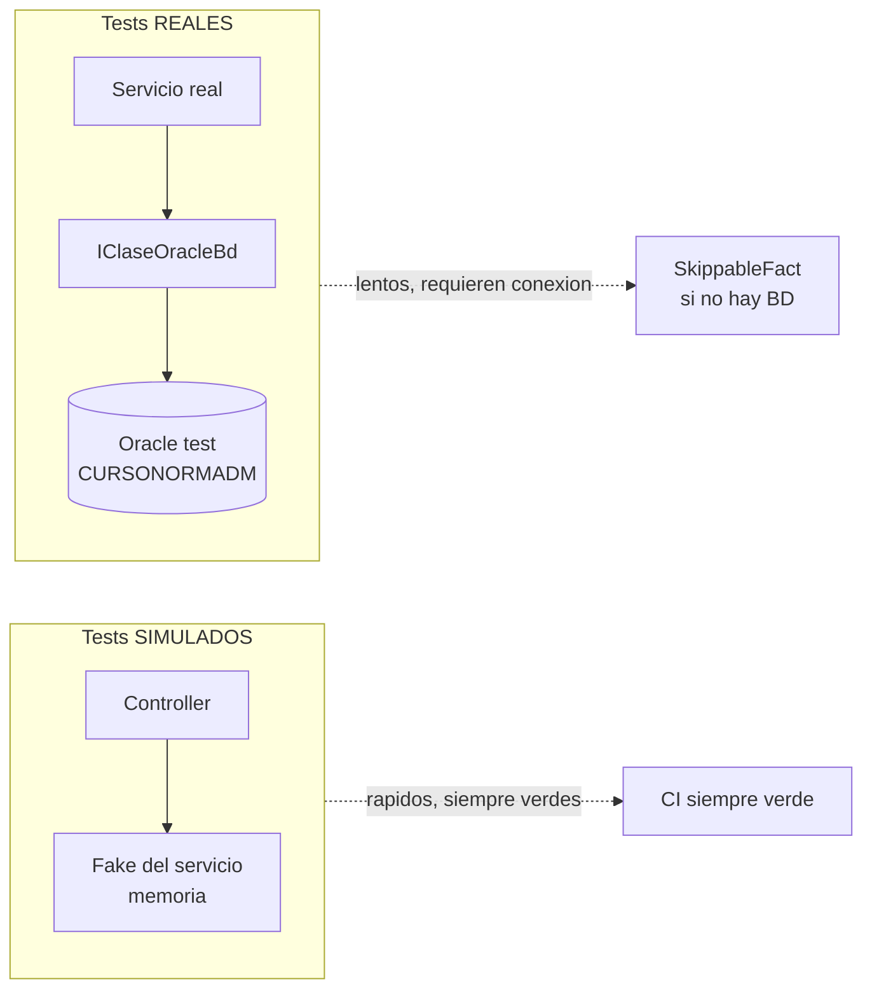

# Sesión 21: Tests y calidad de código

[[toc]]

::: info CONTEXTO
Al finalizar esta sesión, el alumno será capaz de:

- Crear tests unitarios con xUnit, distinguiendo tests **simulados** (sin BD) de tests **reales** (contra Oracle).
- Montar fakes a mano (sin librerías de mocking) y suplantar el JWT con `UsuarioFake`.
- Compartir una conexión real a Oracle entre tests con `IClassFixture<OracleTestFixture>` y `[SkippableFact]`.
- Crear tests de integración con `WebApplicationFactory`.
- Probar APIs con httpRepl.
- Entender `ActionFilters` y aplicar el naming JSON camelCase vs PascalCase.
:::

## 21.1 Tests unitarios con xUnit {#tests-unitarios-xunit}

El primer test del CRUD que ya tienes funcionando (sesión 5) se construye con dos piezas: una **simulada** que prueba el controlador en memoria, y una **real** que prueba el servicio contra Oracle.

### 21.1.1 Dos tipos de test que nos importan



<!-- diagram id="tipos-test" caption: "Simulados prueban la lógica del controlador. Reales prueban el SQL contra Oracle." -->

| Tipo         | Qué prueba                                                        | Por qué                                                                                                 |
| ------------ | ----------------------------------------------------------------- | ------------------------------------------------------------------------------------------------------- |
| **Simulado** | El controlador delega bien al servicio y traduce a HTTP correcto. | Rápido, siempre verde, no necesita BD. Va en CI.                                                        |
| **Real**     | El SQL existe, mapea bien, las restricciones de Oracle funcionan. | Detecta drift entre el código y la BD. Se marca `[SkippableFact]` para no romper CI si no hay conexión. |

### 21.1.2 Tres piezas de infraestructura compartidas entre tests

Antes de mirar los tests propiamente, hay tres clases auxiliares en `uaReservas.Tests/Infraestructura/` que todos comparten. Son **el andamiaje**, no la lógica del test:

```
uaReservas.Tests/
├── Infraestructura/
│   ├── UsuarioFake.cs                 ← simula un usuario "autenticado" con claims
│   ├── FakeTiposRecursoServicio.cs    ← implementa ITiposRecursoServicio en memoria
│   └── OracleTestFixture.cs            ← levanta una conexión REAL a Oracle (si la hay)
├── Controllers/
│   └── TipoRecursosControllerSimuladoTests.cs
└── Servicios/
    └── TiposRecursoServicioRealTests.cs
```

**`UsuarioFake`** — construye un `ControllerContext` con un `ClaimsPrincipal` a mano. En producción el JWT lo valida el middleware antes de entrar al controlador; en tests no hay middleware, así que ponemos los claims a pelo:

```csharp
// Tests/Infraestructura/UsuarioFake.cs (resumido)
public static class UsuarioFake
{
    public static ControllerContext ConClaims(
        string idiomaClaim   = "es",
        int    codPersona    = 12345,
        string nombrePersona = "Usuario de prueba",
        string? cabeceraXIdioma = null)
    {
        var claims = new[]
        {
            new Claim("LENGUA",        idiomaClaim),
            new Claim("CODPER_UAAPPS", codPersona.ToString()),
            new Claim("NOMPER",        nombrePersona),
        };
        var identity  = new ClaimsIdentity(claims, "TestAuth");
        var principal = new ClaimsPrincipal(identity);
        var httpContext = new DefaultHttpContext { User = principal };

        if (!string.IsNullOrWhiteSpace(cabeceraXIdioma))
            httpContext.Request.Headers["X-Idioma"] = cabeceraXIdioma;

        return new ControllerContext { HttpContext = httpContext };
    }
}
```

Con esto, `controller.User.FindFirstValue("CODPER_UAAPPS")` devuelve `"12345"` y `ControladorBase.Idioma` se resuelve correctamente — exactamente como con un JWT real.

**`FakeTiposRecursoServicio`** — implementa la interfaz `ITiposRecursoServicio` con datos en memoria:

```csharp
// Tests/Infraestructura/FakeTiposRecursoServicio.cs (resumido)
public class FakeTiposRecursoServicio : ITiposRecursoServicio
{
    // Lo que cada test pre-carga:
    public List<TipoRecursoLectura> ListaParaDevolver         { get; set; } = new();
    public TipoRecursoLectura?      TipoLecturaParaDevolver   { get; set; }

    // "Huella" para que el test verifique con qué se llamó al servicio:
    public List<string> IdiomasPedidos { get; } = new();
    public List<int>    IdsPedidos     { get; } = new();

    public Task<Result<List<TipoRecursoLectura>>> ObtenerTodosAsync(string idioma)
    {
        IdiomasPedidos.Add(idioma);   // ← guarda quién pidió y con qué idioma
        return Task.FromResult(Result<List<TipoRecursoLectura>>.Success(ListaParaDevolver));
    }

    public Task<Result<TipoRecursoLectura>> ObtenerPorIdAsync(int id, string idioma)
    {
        IdiomasPedidos.Add(idioma);
        IdsPedidos.Add(id);

        // Si el test no precargó nada → NotFound. Si precargó → Success.
        return Task.FromResult(TipoLecturaParaDevolver is null
            ? Result<TipoRecursoLectura>.NotFound(
                  "TIPO_RECURSO_NO_ENCONTRADO",
                  $"No existe un tipo de recurso con id {id}.")
            : Result<TipoRecursoLectura>.Success(TipoLecturaParaDevolver));
    }

    // Stubs de escritura para que el fake cumpla la interfaz completa:
    public List<TipoRecursoCrearDto> CreadosRecibidos { get; } = new();
    public Result<int>? ResultadoCrear { get; set; }

    public Task<Result<int>> CrearAsync(TipoRecursoCrearDto dto)
    {
        CreadosRecibidos.Add(dto);
        return Task.FromResult(ResultadoCrear ?? Result<int>.Success(1));
    }

    // ... resto de métodos de la interfaz ...
}
```

::: tip BUENA PRÁCTICA — fakes sin librerías de mocking
En el curso **no usamos Moq, NSubstitute ni FakeItEasy**: los fakes son clases C# normales. Cuatro razones:

1. Se entienden leyendo el código, sin sintaxis especial.
2. Si la interfaz cambia, el compilador te lo dice.
3. Las "huellas" (`IdiomasPedidos`, `CreadosRecibidos`) son `List` corrientes: el test las asserta con `Assert.Single`/`Assert.Equal`, no con `.Verify(x => x.Method())` de Moq.
4. Cero NuGets adicionales en `uaReservas.Tests.csproj`.
:::

### 21.1.3 Test simulado: `TipoRecursosControllerSimuladoTests` real

Este es el test que **existe** en el proyecto (`uaReservas.Tests/Controllers/TipoRecursosControllerSimuladoTests.cs`). Tres tests que cubren el patrón completo: que delega al servicio, que devuelve 404 con `ProblemDetails`, y que lee el idioma del claim.

```csharp
public class TipoRecursosControllerSimuladoTests
{
    private static (TipoRecursosController controller, FakeTiposRecursoServicio fake)
        CrearControlador(string idiomaClaim = "es", string? cabeceraXIdioma = null)
    {
        var fake = new FakeTiposRecursoServicio();
        var controller = new TipoRecursosController(fake)
        {
            ControllerContext = UsuarioFake.ConClaims(
                idiomaClaim:     idiomaClaim,
                cabeceraXIdioma: cabeceraXIdioma)
        };
        return (controller, fake);
    }

    [Fact]
    public async Task Listar_DevuelveOk_ConLaListaDelServicio()
    {
        // ARRANGE
        var (controller, fake) = CrearControlador(idiomaClaim: "es");
        fake.ListaParaDevolver =
        [
            new TipoRecursoLectura { IdTipoRecurso = 1, Codigo = "SALA",   Nombre = "Sala" },
            new TipoRecursoLectura { IdTipoRecurso = 2, Codigo = "EQUIPO", Nombre = "Equipo audiovisual" }
        ];

        // ACT
        var resultado = await controller.Listar();

        // ASSERT
        var ok    = Assert.IsType<OkObjectResult>(resultado);
        var lista = Assert.IsType<List<TipoRecursoLectura>>(ok.Value);
        Assert.Equal(2, lista.Count);
        Assert.Equal("SALA", lista[0].Codigo);
    }

    [Fact]
    public async Task ObtenerPorId_Devuelve404_ConProblemDetails_SiNoExiste()
    {
        // ARRANGE: el fake no tiene nada que devolver → simulará NotFound.
        var (controller, fake) = CrearControlador();
        fake.TipoLecturaParaDevolver = null;

        // ACT
        var resultado = await controller.ObtenerPorId(999);

        // ASSERT
        var notFound = Assert.IsType<NotFoundObjectResult>(resultado);
        var problem  = Assert.IsType<ProblemDetails>(notFound.Value);
        Assert.Equal(404, problem.Status);
        Assert.Contains("999", problem.Detail);
    }

    [Fact]
    public async Task Listar_UsaIdiomaDelClaim_SiNoHayCabeceraXIdioma()
    {
        // ARRANGE: claim LENGUA = "ca", sin cabecera X-Idioma.
        var (controller, fake) = CrearControlador(idiomaClaim: "ca");

        // ACT
        await controller.Listar();

        // ASSERT: el servicio recibió el idioma "ca".
        Assert.Single(fake.IdiomasPedidos);
        Assert.Equal("ca", fake.IdiomasPedidos[0]);
    }
}
```

::: tip BUENA PRÁCTICA — el patrón AAA
Todos los tests del curso siguen **Arrange / Act / Assert**:

1. **Arrange**: construir el SUT (system under test) y los datos.
2. **Act**: ejecutar la acción que pruebas.
3. **Assert**: verificar el resultado.

Si tu test no se puede partir en estos tres bloques, casi seguro que está probando demasiadas cosas.
:::

### 21.1.4 `OracleTestFixture`: una conexión REAL a Oracle, compartida

Para los tests reales no queremos abrir una conexión nueva por cada test (es lento). El `IClassFixture<T>` de xUnit permite que **una sola instancia del fixture** se comparta entre todos los tests de una clase:

```csharp
// Tests/Infraestructura/OracleTestFixture.cs (resumido)
public class OracleTestFixture : IDisposable
{
    public IServiceProvider Servicios          { get; }
    public bool             HayConexion        { get; }
    public string           MotivoSinConexion  { get; } = "";

    public OracleTestFixture()
    {
        // Lee la cadena de tres sitios (en orden): appsettings.test.json,
        // user-secrets del proyecto de tests, y variables de entorno.
        var config = new ConfigurationBuilder()
            .AddJsonFile("appsettings.test.json", optional: true)
            .AddUserSecrets<OracleTestFixture>(optional: true)
            .AddEnvironmentVariables()
            .Build();

        var cadena = config.GetConnectionString("oradb");

        var servicios = new ServiceCollection();
        servicios.AddSingleton<IConfiguration>(config);
        servicios.AddLogging(b => b.AddConsole().SetMinimumLevel(LogLevel.Warning));

        if (string.IsNullOrWhiteSpace(cadena))
        {
            HayConexion       = false;
            MotivoSinConexion = "No hay 'ConnectionStrings:oradb' en appsettings.test.json ni user-secrets.";
        }
        else
        {
            servicios.AddScoped<IClaseOracleBd, ClaseOracleBd>();
            HayConexion = true;
        }

        Servicios = servicios.BuildServiceProvider();
    }

    public IServiceScope CrearScope() => Servicios.CreateScope();
    public void Dispose() => (Servicios as IDisposable)?.Dispose();
}
```

Si no hay conexión configurada, el fixture **no falla**: marca `HayConexion = false` con un motivo, y cada test puede saltarse con `Skip.IfNot(...)`.

::: info CONTEXTO — `user-secrets` en el proyecto de tests
`uaReservas.Tests` tiene su propio `UserSecretsId`. Las credenciales son las **mismas** que usa la app (mismo esquema `CURSONORMWEB`), pero el formato del secret es distinto:

|           | App principal                                    | Proyecto de tests                                      |
| --------- | ------------------------------------------------ | ------------------------------------------------------ |
| Secret(s) | `Oracle:UserId` + `Oracle:Password` por separado | `ConnectionStrings:oradb` como cadena completa         |
| Lo lee    | La plantilla UA en `AddServicesUA()`             | `OracleTestFixture` con `GetConnectionString("oradb")` |

Para configurar el proyecto de tests:

```powershell
cd uaReservas.Tests
dotnet user-secrets set "ConnectionStrings:oradb" "User Id=CURSONORMWEB;Password=<contraseña>;Data Source=(DESCRIPTION=(ADDRESS=(PROTOCOL=TCP)(HOST=laguar-n1-vip.cpd.ua.es)(PORT=1521))(CONNECT_DATA=(SERVICE_NAME=ORACTEST.UA.ES)));Connection Lifetime=240;Pooling=false"
```

La contraseña es la misma que ya tienes en los secrets de la app (`Oracle:Password`). Si no configuras esto, los tests `[SkippableFact]` se marcan como `Skipped` y la suite sigue verde.
:::

### 21.1.5 Test real: `TiposRecursoServicioRealTests`

Y este es el test real que existe (`uaReservas.Tests/Servicios/TiposRecursoServicioRealTests.cs`). Dos casos: que la vista devuelve algo y que un id inexistente devuelve `NotFound`.

```csharp
public class TiposRecursoServicioRealTests : IClassFixture<OracleTestFixture>
{
    private readonly OracleTestFixture _fixture;
    public TiposRecursoServicioRealTests(OracleTestFixture fixture) => _fixture = fixture;

    private TiposRecursoServicio CrearServicio(out IServiceScope scope)
    {
        scope = _fixture.CrearScope();
        var bd = scope.ServiceProvider.GetRequiredService<IClaseOracleBd>();
        return new TiposRecursoServicio(bd, NullLogger<TiposRecursoServicio>.Instance);
    }

    [SkippableFact]
    public async Task ObtenerTodosAsync_DevuelveSuccess_ConAlMenosUnTipo()
    {
        // ARRANGE: si no hay BD configurada, salta el test sin fallar.
        Skip.IfNot(_fixture.HayConexion, _fixture.MotivoSinConexion);
        var servicio = CrearServicio(out var scope);
        using (scope)
        {
            // ACT
            var resultado = await servicio.ObtenerTodosAsync("es");

            // ASSERT: tiene que haber datos en CURSONORMADM.VRES_TIPO_RECURSO.
            Assert.True(resultado.IsSuccess);
            Assert.NotNull(resultado.Value);
            Assert.NotEmpty(resultado.Value!);
            var primero = resultado.Value![0];
            Assert.True(primero.IdTipoRecurso > 0);
            Assert.False(string.IsNullOrWhiteSpace(primero.Codigo));
        }
    }

    [SkippableFact]
    public async Task ObtenerPorIdAsync_DevuelveNotFound_SiElIdNoExiste()
    {
        Skip.IfNot(_fixture.HayConexion, _fixture.MotivoSinConexion);
        var servicio = CrearServicio(out var scope);
        using (scope)
        {
            var resultado = await servicio.ObtenerPorIdAsync(-9999, "es");

            // El servicio devuelve Result<T>.NotFound(...) → no es Success.
            Assert.False(resultado.IsSuccess);
            Assert.NotNull(resultado.Error);
            Assert.Equal(ErrorType.NotFound, resultado.Error!.Type);
        }
    }
}
```

::: tip BUENA PRÁCTICA — qué probar en un test real (y qué no)
Los tests reales son **lentos**. Cada uno abre una conexión a Oracle y ejecuta SQL. Tres reglas:

1. **Prueba el contrato con la BD**, no la lógica del servicio: que la vista existe, que las columnas se mapean, que el id inexistente devuelve `NotFound`. La lógica fina (¿el filtro funciona si hay 5 elementos?) va en tests simulados.
2. **No asumas datos concretos en la BD** (`Assert.Equal("Sala de reuniones", x.Nombre)`). Asserta **forma**: hay al menos un registro, el id es positivo, el nombre no es null.
3. **No escribas en la BD**. Si un test `Crear...` se ejecuta dos veces, deja basura. Para tests de escritura: o haces `Eliminar` al final, o trabajas dentro de una transacción que haces rollback.
:::

::: info → Continuación práctica del patrón
El ejercicio §5.6 de la **[sesión 5](../../../02-dotnet/sesiones/sesion-05-servicios-oracle/#_5-6-ejercicio-cerrar-observaciones-con-servicio-tests)** te pide replicar este patrón (fake + test simulado + test real con `SkippableFact`) sobre `Observaciones`. La solución completa con los siete ficheros está en [solucion-ejercicio-observaciones.md](../../../02-dotnet/sesiones/sesion-05-servicios-oracle/solucion-ejercicio-observaciones.md).
:::

## 21.2 Tests de integración con `WebApplicationFactory` {#tests-integracion}

::: warning IMPORTANTE
El contenido detallado de esta sección está pendiente de publicación.
:::

## 21.3 httpRepl {#httprepl}

::: warning IMPORTANTE
El contenido detallado de esta sección está pendiente de publicación.
:::

## 21.4 ActionFilters {#actionfilters}

::: warning IMPORTANTE
El contenido detallado de esta sección está pendiente de publicación.
:::

## 21.5 Naming JSON y patrón GET/POST {#naming-json-patron-get-post}

::: warning IMPORTANTE
El contenido detallado de esta sección está pendiente de publicación.
:::

---

<!-- NAV:START -->
| Anterior | Inicio | Siguiente |
|---|---|---|
| [← Sesión 20: Estado global y persistencia](../../../05-avanzadas/sesiones/sesion-20-estado-persistencia/) | [Índice del curso](../../../) | [Sesión 22: Trabajo con ficheros →](../../../05-avanzadas/sesiones/sesion-22-ficheros/) |
<!-- NAV:END -->
