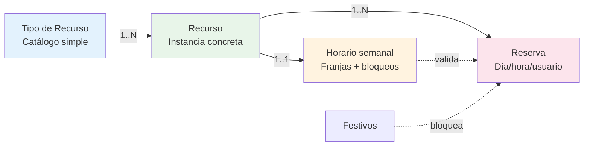

# Proyecto final del curso

[[toc]]

::: info FILOSOFÍA
El proyecto final **no es una entrega aislada** al cierre del curso. Son **cuatro módulos progresivos** que el alumno va construyendo a lo largo de las sesiones. Cada sesión añade una pieza al módulo activo y, al final, los cuatro módulos componen una aplicación de reservas de tamaño real.

Cada día comienza con **todo lo del día anterior resuelto en una rama nueva del Git**: nadie se queda descolgado, y la solución del día anterior es siempre el punto de partida del siguiente.
:::

## Visión global

La aplicación final permite a un usuario CAS:

- Consultar los **tipos de recurso** disponibles (aulas, salas, equipos…).
- Consultar los **recursos** concretos (Aula 12, Sala A, Proyector…), filtrarlos y administrarlos según rol.
- Definir el **horario semanal** de un recurso (apertura, cierre, bloqueos puntuales, franjas).
- Crear, ver y cancelar **reservas** validadas contra disponibilidad, festivos y solapamientos.

<!-- diagram id="pf-modelo-dominio" caption: "Modelo de dominio: el proyecto crece de izquierda a derecha" -->

## Los cuatro módulos

| Módulo | Modo de aprendizaje | Sesión de cierre | Rama de Git |
|--------|---------------------|------------------|-------------|
| **1. Tipo de recurso** | **Hilo conductor** — el material de las sesiones lo construye contigo en clase. | Sesión 14 | `tiporecurso-<nombre>` |
| **2. Recurso** | **Ejercicio guiado** — repites el patrón sobre una entidad con auditoría y seguridad. | Sesión 14 / 16 | `recurso-<nombre>` |
| **3. Horario** | **Ejercicio de profundización** — primer caso con objetos complejos y estado compartido. | Sesión 17 | `horario-<nombre>` |
| **4. Reserva** | **Cierre integrador** — combina todo y aplica las sesiones avanzadas. | Sesión 22 | `reserva-<nombre>` |

::: tip CÓMO LO VAS A VIVIR
- En el **Módulo 1** el material te lleva de la mano: la sesión explica y muestra; tú reproduces el mismo patrón en tu rama. Es **rodaje**.
- En el **Módulo 2** ya tienes el patrón. La sesión añade pequeñas piezas (auditoría, idioma, permisos) y tú las aplicas. Es **consolidación**.
- En los **Módulos 3 y 4** ya eres autónomo. La sesión añade conceptos avanzados (Pinia, validaciones cruzadas, router avanzado, roles) y tú decides cómo integrarlos. Es **proyecto**.
:::

## Reglas de Git y entregas

- **Una rama por módulo**, con el nombre indicado en la tabla anterior.
- **Cada día se publica en `master` la solución del día anterior** del curso. El alumno hace `git pull` y, si quiere, rebasea su rama sobre la nueva base. Si se ha quedado atrás, **descarta su trabajo del día anterior y arranca con la solución oficial**.
- **Commits frecuentes**, pequeños y con mensaje en español. Que el historial cuente la historia.
- **Tests siempre que el material los explique** (sesión 18 introduce xUnit + `WebApplicationFactory`).
- **Accesibilidad obligatoria** en cada componente nuevo (sesión 21).

::: warning POR QUÉ DESCARTAR Y NO INTENTAR ARREGLAR
Si te has quedado descolgado un día, **no inviertas la primera hora del día siguiente** en rescatar tu rama: descarta y arranca con la solución oficial. El objetivo de cada sesión es **aprender el siguiente concepto**, no debuggear el del día anterior. Tendrás otra ocasión de aplicarlo en el siguiente módulo.
:::

## Hitos por sesión

Esta es la tabla maestra que conviene revisar al inicio del curso. Indica **qué del proyecto final** trabaja cada sesión.

| # | Sesión | Módulo | Qué añades al proyecto |
|---|--------|--------|------------------------|
| 1-2 | Oracle · Fundamentos + ejercicio | 1 | Inspección del schema y tabla `TIPO_RECURSO` con `IDENTITY`, multiidioma y `CHECK` |
| 3-4 | Oracle · Tablas y vistas + ejercicio | 1 | Vista `VRES_TIPO_RECURSO` con alias para automapeo |
| 5 | Oracle · Paquetes CRUD | 1 + 3 | `PKG_RES_TIPO_RECURSO` (`LISTAR / OBTENER / CREAR / ACTUALIZAR / ELIMINAR`) **+** primer contacto con arrays de objetos para el módulo Horario |
| 6 | .NET · Introducción | — | Setup del proyecto en tu rama |
| 7 | .NET · DTOs y APIs | 1 | DTOs (`TipoRecursoLectura / CrearDto / ActualizarDto`) + controller con CRUD en memoria |
| 8 | .NET · Servicios Oracle | 1 + 2 (auditoría) | Servicio real con `ClaseOracleBD3` + introducción de campos de auditoría para el módulo Recurso |
| 9 | .NET · Validación y errores | 1 + 3 (conflictos) | DataAnnotations en los DTOs + plantilla de validación cruzada para horarios |
| 10 | .NET · DataTable + ClaseCrud | 1 + 2 (filtros) | Paginación, orden, filtros server-side de `TipoRecurso` + extensión para `Recurso` con campos extra |
| 11 | .NET · OpenAPI y Scalar | 1 | XML doc + Scalar pulido en tu rama |
| 12 | Vue · Fundamentos | 1 | Estructura del cliente, primera vista de `TipoRecurso` |
| 13 | Vue · Directivas y eventos | 1 | Tabla y filtro de `TipoRecurso` |
| 14 | Vue · Componentes y comunicación | 1 + 3 (día) + 4 (Hora/Duración) | Modal de edición de `TipoRecurso` **+** componente `BloqueDia` para Horario y `SelectorHoraDuracion` para Reserva |
| 15 | Vue · Arquitectura: composables y servicios | 1 + 2 | Composable `useTipoRecurso` + plantilla del de `Recurso` |
| 16 | Vue · Componentes internos UA | 1 | CRUD de `TipoRecurso` completo cliente (la integradora `Sesion11CrudRecursos` es la referencia visual) |
| 17 | Integración · Llamadas a la API y autenticación | 1 + 2 (idioma+codper) | Sustituir el mock por `useAxios`, lectura de claims y filtrado de listas por idioma del usuario |
| 18 | Integración · Validación en todas las capas | 1 + 3 (conflictos) | `useGestionFormularios` aplicado al formulario de `TipoRecurso` + validador cruzado de Horario |
| 19 | Integración · Gestión de errores | 1 + 2 | Toast + confirmación en eliminación de `TipoRecurso` y `Recurso`, errores Oracle traducidos |
| 20 | Integración · DataTable | 1 + 2 (cierre) + 4 (lógica) | Cierre del módulo 2: DataTable de `Recurso` con acciones por fila y filtro desplegable por tipo **+** primer endpoint de "disponibilidad" para Reserva |
| 21 | Avanzadas · i18n | 1-4 | Traducciones de los formularios a `es / ca / en` |
| 22 | Avanzadas · Seguridad (roles, políticas) | 2 + 4 | `[Authorize(Roles)]` en las APIs y `meta.roles` en el router para `Recurso` y `Reserva` |
| 23 | Avanzadas · Pinia | 3 + 4 | Estado compartido del horario en edición y filtros del calendario de reserva |
| 24 | Avanzadas · Tests | 1-4 | xUnit + `WebApplicationFactory` sobre tus controladores |
| 25 | Avanzadas · Ficheros | 4 | Adjuntar justificante a una reserva (opcional) |
| 26 | Avanzadas · Serilog | 1-4 | Sinks Console / Oracle / File / Email en tu proyecto |
| 27 | Avanzadas · Accesibilidad y ENS | 1-4 | Auditoría WCAG de tus formularios y tablas |
| 28 | Avanzadas · Copilot | 1-4 | Productividad sobre el proyecto ya construido |

::: tip CÓMO LEER LA TABLA
- "Módulo" indica **a qué módulo aporta** el trabajo de esa sesión.
- "Qué añades" es el **delta mínimo** esperado al cierre. Puedes ir más lejos.
- Si un alumno se centra en seguir el material en clase, al terminar la sesión 14 tiene el **Módulo 1 cerrado**. Las sesiones 11 a 14 lo extienden con seguridad e integración real.
:::

## Módulo 1 — Tipo de recurso

### Objetivos

- **Oracle**: tabla, vista y paquete básico (`IDENTITY`, multiidioma, `CHECK`, grants `WEB`).
- **.NET**: API CRUD completa con filtros, ordenación, validación y seguridad básica (`[Authorize]`).
- **Vue**: DataTable, modales, formularios con validación HTML y errores del servidor.
- **Accesibilidad**: tabla y formulario WCAG-AA (labels asociadas, focus visible, mensajes con `role="alert"`).
- **GIT**: rama `tiporecurso-<nombre>` por alumno.

### Cómo se aprende

El material **construye este módulo contigo en clase** sesión a sesión. Tu trabajo es **reproducir el mismo patrón en tu rama**, no descubrirlo de cero. Al cierre de la sesión 14 deberías tener:

- Tabla `TIPO_RECURSO`, vista `VRES_TIPO_RECURSO`, paquete `PKG_RES_TIPO_RECURSO`.
- Endpoints `GET / GET {id} / POST / PUT / DELETE /api/TipoRecursos`.
- Vista Vue con DataTable, modal de alta y modal de edición.
- Eliminación protegida con `PopUpModal` y toast de confirmación.
- Errores Oracle traducidos vía `Resources/SharedResource.{es,ca,en}.resx`.

### Criterios de aceptación

- Crear, editar y eliminar un `TipoRecurso` desde la UI sin recargar la página.
- Probar a eliminar un `TipoRecurso` con recursos asociados → debe mostrar **banner global** con mensaje localizado (`ORA-20703`).
- Probar a obtener un `TipoRecurso` inexistente → debe mostrar **toast** rojo (`ORA-20702`).
- El formulario debe ser accesible al teclado y leerse correctamente con lector de pantalla.

## Módulo 2 — Recurso

### Objetivos

- **Oracle**: tabla `RECURSO` con campos de auditoría (`FECHA_CREACION`, `CODPER_CREADOR`), vista `VRES_RECURSO` optimizada por idioma y paquete extendido con operaciones de **cambio de estado** (activar / desactivar / marcar mantenimiento).
- **.NET**: lectura de `CodPer` e `Idioma` desde el JWT (`ControladorBase`), optimización de consultas a una sola columna idiomática, roles y permisos (el creador es propietario).
- **Vue**: DataTable con acciones extra (checks de estado), botones que abren otras vistas (calendario), captura y presentación de errores, desplegable filtrado por `TipoRecurso`.
- **Accesibilidad**: igual que el módulo 1, más anuncios `aria-live` para los toasts.
- **GIT**: rama `recurso-<nombre>`.

### Cómo se aprende

El material te enseña los conceptos en sesiones puntuales (auditoría en .NET sesión 2, idioma/codper en sesión 11, permisos en sesión 16, filtros en sesión 14). El **ejercicio del proyecto** es aplicarlos a `Recurso` **siguiendo el patrón** del módulo 1.

### Criterios de aceptación

- Solo el creador (o un rol administrador) puede modificar o eliminar un recurso.
- Listado filtrado por tipo desde un desplegable accesible.
- Cambio de estado del recurso (`Activo` ↔ `Mantenimiento`) con confirmación y toast.
- Audit fields visibles en el detalle (fecha de creación y creador).

## Módulo 3 — Horario

### Objetivos

- **Oracle**: trabajo con arrays de objetos (`TYPE` colección) y validación de conflictos (franjas superpuestas) dentro del paquete.
- **.NET**: API que acepta objetos complejos, **acciones fuera del CRUD** (`copiar-a-toda-la-semana`, `bloquear-dia`), validación cruzada con FluentValidation.
- **Vue**: componente `BloqueDia` reutilizable por cada día de la semana, posibilidad de añadir / borrar varias franjas por día, **bloquear día** completo, **copiar un día a toda la semana**. Estado compartido del horario en edición con Pinia.
- **GIT**: rama `horario-<nombre>`.

### Cómo se aprende

Este módulo presenta **el primer caso real de un objeto complejo** que no es un simple CRUD. La sesión 5 (Oracle) introduce el array; las sesiones 8 (Vue) y 17 (Pinia) dan las piezas de cliente; la 12 cierra la validación cruzada de conflictos. El **ejercicio** es ensamblarlo en una pantalla de edición.

### Criterios de aceptación

- En la edición de un horario semanal el usuario puede añadir y eliminar franjas por día.
- Bloquear un día entero con un solo gesto.
- Copiar las franjas de un día a toda la semana con un botón.
- Al guardar, si dos franjas del mismo día se solapan, el servidor responde 400 con `errors[""]` describiendo el conflicto, y el banner global lo muestra en el idioma del usuario.

## Módulo 4 — Reserva

### Objetivos

- **Oracle**: validación de la reserva contra horario, días festivos y solapamiento con otras reservas. Tabla `FESTIVO` con la lógica de tiempo.
- **.NET**: lógica de **reservas disponibles vs bloqueadas**, endpoint `/api/Reservas/disponibilidad?recursoId=…&fecha=…`, validación de todo lo que llega.
- **Vue**: componentes `SelectorHora` y `SelectorDuracion` reutilizables, refresco automático al cambiar la fecha, opción de **ver siguiente disponible** si la fecha elegida está bloqueada, filtro avanzado por tipo de recurso con uso intensivo de `router.js` (query params + scroll restoration).
- **Seguridad**: solo usuarios con rol `RESERVAS` pueden crear; los propios usuarios pueden cancelar sus reservas.
- **GIT**: rama `reserva-<nombre>`.

### Cómo se aprende

Es el módulo **integrador**. Reutiliza todo lo construido en los módulos 1-3 y aplica las sesiones avanzadas (seguridad, Pinia, tests, accesibilidad). Conviene **cerrarlo en parejas o tríos**: el código compartido y las decisiones de UX se benefician de la discusión.

### Criterios de aceptación

- Crear una reserva válida: la disponibilidad se actualiza en vivo en la UI.
- Intentar crear una reserva con solapamiento: el servidor responde 400 con mensaje localizado y se ve en el banner global.
- Intentar crear una reserva en festivo: idem.
- Cancelar una reserva propia desde la lista: confirmación con `PopUpModal` y toast de éxito.
- Acceder sin rol `RESERVAS` a la pantalla de creación → redirección a `ExternalLoginFailure`.

## Lista de control final

Antes de la entrega, repasa este checklist por módulo:

- [ ] **Git**: una rama por módulo, historial limpio, commits en español.
- [ ] **Oracle**: tabla con `CHECK`, vista con alias para automapeo, paquete con `P_CODIGO_ERROR` / `P_MENSAJE_ERROR`.
- [ ] **.NET**: DTOs con DataAnnotations, servicio con `Result<T>`, controladores que solo hacen `HandleResult(...)`.
- [ ] **Mensajes Oracle**: usar `# Resources.SharedResource.CLAVE|args #` para que viajen localizados.
- [ ] **Vue**: vistas con `useGestionFormularios({ aislado: true })`, banner global + errores por campo, toasts en éxitos y errores reales.
- [ ] **Confirmación**: `PopUpModal` antes de cualquier eliminación.
- [ ] **Seguridad**: `[Authorize(Roles)]` donde proceda en API, `meta.roles` en las rutas Vue.
- [ ] **Accesibilidad**: cada formulario y tabla pasa la auditoría WCAG-AA (sesión 21).
- [ ] **Tests**: al menos un test por endpoint nuevo (sesión 18).
- [ ] **Serilog**: la app emite eventos estructurados con `Code` y `RequestPath` (sesión 20).

## Cómo navegar a partir de aquí

- Si estás empezando un módulo, lee primero la fila correspondiente en la **tabla de hitos** y abre las sesiones citadas.
- Si te has quedado descolgado, descarta tu rama y arranca con la solución oficial del día anterior (es lo que recomienda el equipo).
- Si tienes una duda concreta sobre **dónde** aplicar algo, busca en el sandbox: la demo equivalente está en `ClientApp/src/views/sesiones-vue/sesion-N/`.
