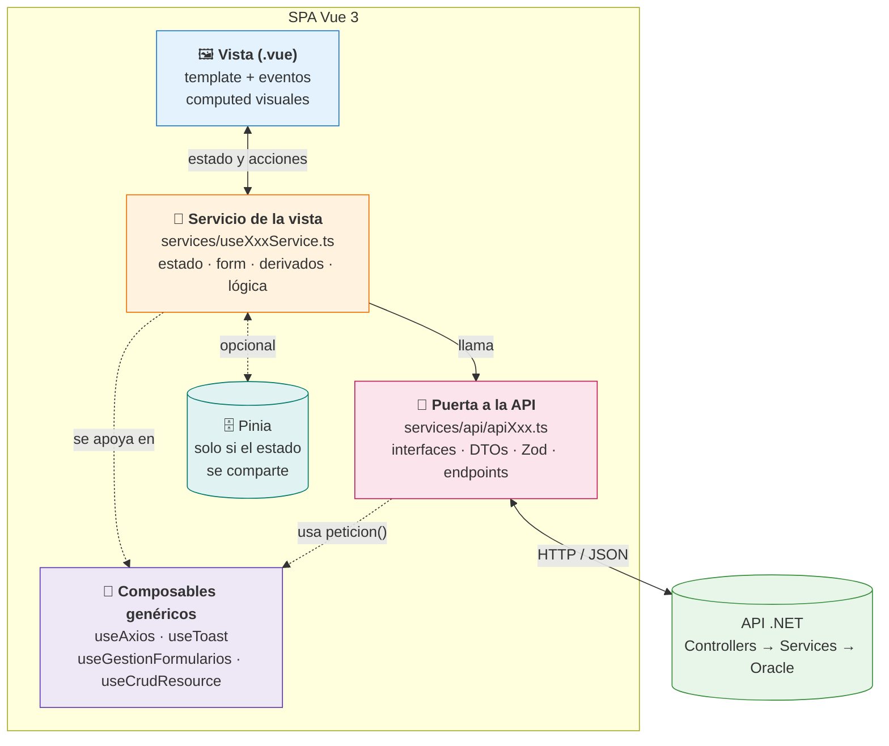
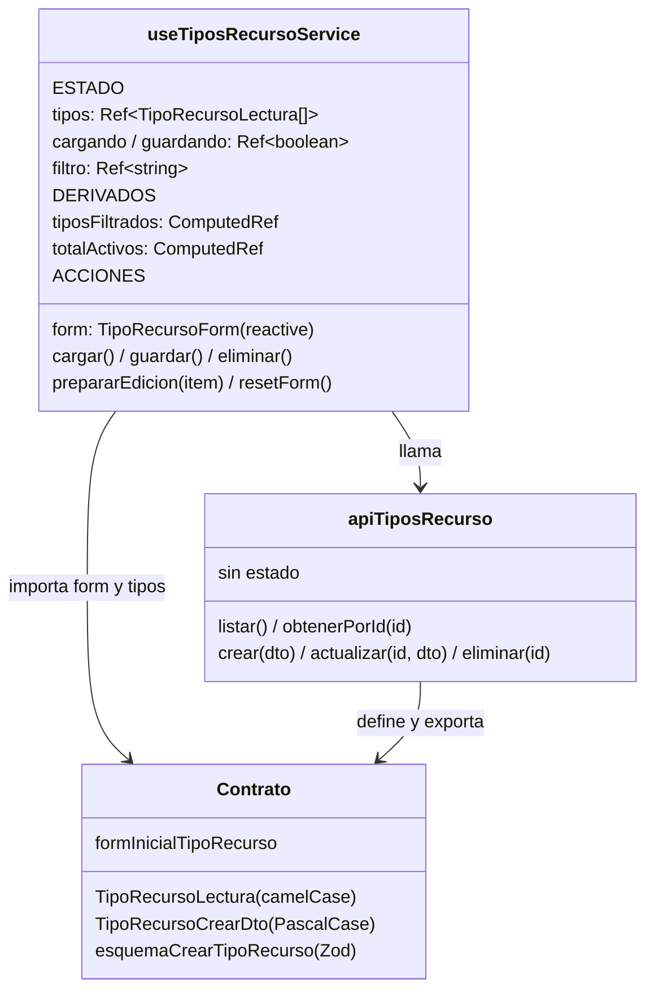
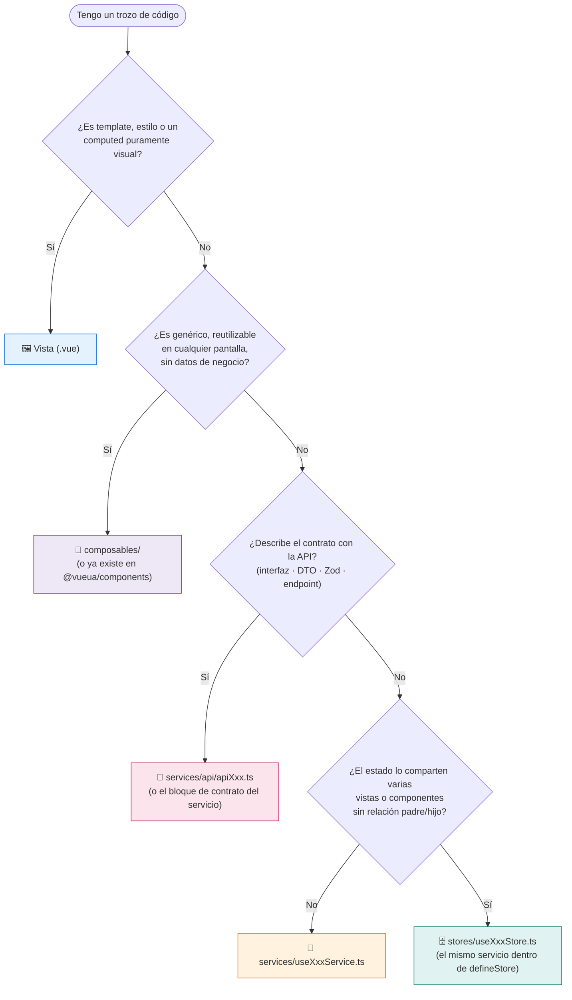
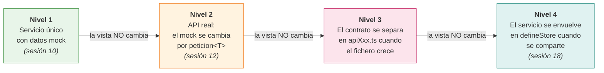
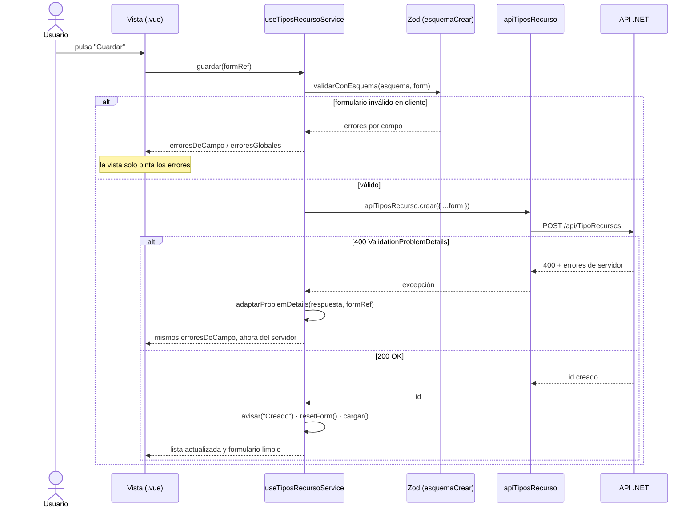

# Propuesta: arquitectura de servicios en Vue

[[toc]]

## Resumen ejecutivo (TL;DR)

Esta propuesta fija **dónde vive cada pieza de código** en el frontend de una aplicación UA
(Vue 3 + TypeScript contra una API .NET):

- La **vista** (`.vue`) solo pinta: template, eventos y, como mucho, `computed` puramente visuales.
- El **servicio de la vista** (`services/useXxxService.ts`) es el cerebro: estado, datos del
  formulario, lógica de negocio y orquestación de las llamadas a la API.
- El **contrato con la API** (interfaces de lectura, DTOs de entrada/salida y esquemas Zod) vive
  junto al acceso HTTP: dentro del propio servicio al principio, y en `services/api/apiXxx.ts`
  cuando el fichero crece.
- Lo **común a varias pantallas** se extrae a **composables genéricos** (`composables/`).
- Cuando el estado lo comparten varias vistas o componentes, el servicio se envuelve en un
  **store de Pinia** — mismo código, distinto ciclo de vida.

La regla se resume en una frase:

::: tip REGLA DE ORO
**Si quitas el template de la vista y no queda casi nada, la arquitectura está bien.**
Todo lo que no sea pintar — datos, formularios, reglas, llamadas HTTP — vive en el servicio.
:::

## 1. El problema que resolvemos {#problema}

Sin una norma, cada pantalla acaba siendo diferente: una vista con `axios` dentro, otra con la
lógica en el template, otra con un store de Pinia para datos que solo usa ella. El resultado es
código difícil de revisar, de probar y de mantener entre equipos.

Quien viene de **.NET MVC** ya sabe resolver esto, porque es el mismo problema que el patrón
**Controller → Service → Repository** resuelve en el backend. Esta propuesta traslada ese reparto
de responsabilidades al cliente Vue:

| Pieza Vue | Equivalente .NET MVC | Responsabilidad |
| --- | --- | --- |
| **Vista `.vue`** | Vista Razor | Solo presentación |
| **Servicio de la vista** (`useReservasService`) | Service (+ el ViewModel) | Estado, formulario, lógica de negocio |
| **Puerta a la API** (`apiReservas`) | Repository / clase de datos | Acceso a datos, contrato (DTOs) |
| **Composable genérico** (`useToast`, `useAxios`) | Helper / librería de utilidades | Código transversal sin dominio |
| **Store de Pinia** | Servicio registrado como *singleton* | Estado compartido entre pantallas |

::: info LA ANALOGÍA QUE LO EXPLICA TODO: el ciclo de vida de la inyección de dependencias
En .NET decides si un servicio es `Transient`, `Scoped` o `Singleton` **al registrarlo**, no al
escribirlo. Aquí igual: el **mismo servicio** puede vivir como función normal (cada vista que lo
llama recibe su propia instancia, como un `Transient`) o envuelto en `defineStore` de Pinia
(instancia única para toda la SPA, como un `Singleton`). El código de dentro **no cambia**.
:::

## 2. Mapa de capas {#mapa}



<!-- diagram id="prop-servicios-mapa-capas" caption: "Mapa de capas: la vista solo habla con su servicio; el servicio orquesta el contrato de API, los composables genéricos y, si hace falta, Pinia" -->

Las cuatro reglas que se leen del diagrama:

1. La vista **solo conoce su servicio**. Nunca importa `peticion`, `axios` ni `apiXxx`.
2. El servicio **es el único dueño del estado** de la pantalla, incluido el formulario.
3. La puerta a la API **no tiene estado**: funciones puras que llaman y devuelven datos tipados.
4. Los composables genéricos **no conocen el dominio**: sirven igual para reservas que para personas.

## 3. Qué vive en cada capa {#que-vive-donde}

### 3.1 La vista: solo lo que se ve {#vista}

La vista importa del servicio **lo que va a pintar** y nada más:

```vue
<script setup lang="ts">
import { onMounted } from 'vue';
import { useTiposRecursoService } from '@/services/useTiposRecursoService';

// Una línea: todo lo demás vive en el servicio.
const { tipos, tiposFiltrados, filtro, cargando, form, erroresDeCampo,
        cargar, guardar, eliminar } = useTiposRecursoService();

onMounted(cargar);
</script>
```

Está permitido (y es sano) que la vista tenga **`computed` puramente visuales**: la clase CSS de
un badge, un texto formateado, mostrar u ocultar una columna. La frontera es esta:

| En la vista ✅ | En el servicio 🧠 |
| --- | --- |
| `const claseBadge = computed(() => activo ? 'bg-success' : 'bg-secondary')` | `const totalActivos = computed(() => tipos.filter(t => t.activo).length)` |
| Decide **cómo se ve** un dato | Decide **qué vale** un dato |
| Si cambias el CSS, cambia esto | Si cambia la regla de negocio, cambia esto |

::: warning SEÑAL DE ALARMA
Si un `computed` de la vista filtra, suma, valida o combina datos de negocio, no es visual:
**baja al servicio**. La prueba del algodón: ¿ese cálculo seguiría existiendo si rediseñaras
la pantalla de cero? Si la respuesta es sí, es negocio.
:::

### 3.2 El servicio de la vista: el cerebro {#servicio}

Un servicio es **un composable adaptado a su pantalla** (una función `useXxxService()` que
devuelve refs y funciones). Contiene **todo lo que la vista necesita para funcionar**:



<!-- diagram id="prop-servicios-anatomia" caption: "Anatomía de un servicio de vista y su relación con la puerta a la API y el contrato de datos" -->

En concreto, el servicio es el dueño de:

- El **estado** de la pantalla: la lista, `cargando`, `guardando`, el filtro.
- El **formulario**: el objeto `reactive` que los inputs editan con `v-model`, inicializado desde
  un **`formInicial`** exportado (el equivalente al `new ViewModel()` de MVC).
- Los **derivados de negocio** (`computed`): filtrados, totales, habilitaciones.
- Las **acciones**: cargar, guardar (crear/actualizar), eliminar, preparar la edición, resetear.
- Las **funciones exclusivas de esa vista**. Si una función la necesitan dos pantallas, se
  asciende a un composable genérico — nunca se copia.

### 3.3 El contrato con la API: interfaces, DTOs y Zod {#contrato}

Cada tipo de dato de la API tiene su contrato **escrito una sola vez**, junto al código que llama
a esa API. Seguimos la convención que ya usa la app del curso
(`uaReservas/ClientApp/src/services/api/apiReservas.ts`):

| Pieza | Convención | Por qué |
| --- | --- | --- |
| **Interfaz de lectura** | `TipoRecursoLectura`, `camelCase` | Es lo que **devuelve** la API serializada; la vista pinta esto |
| **DTO de escritura** | `TipoRecursoCrearDto`, `PascalCase` | Es lo que **espera** el endpoint .NET; mismos nombres que el DTO C# |
| **Esquema Zod** | `esquemaCrearTipoRecurso` | Validación en cliente del DTO, junto a su tipo |
| **Formulario inicial** | `formInicialTipoRecurso` | Estado limpio del formulario; resetear = `Object.assign(form, formInicial)` |

::: tip POR QUÉ ZOD VIVE JUNTO AL DTO
El esquema Zod **describe el mismo contrato** que la interfaz: si el DTO cambia, cambian los dos
a la vez y en el mismo fichero. Separarlos (esquemas en una carpeta, tipos en otra) es la receta
para que se desincronicen.
:::

### 3.4 Los composables genéricos: la caja de herramientas {#composables}

En `composables/` solo entra código que **no sabe nada del dominio**: le da igual si trabaja con
reservas, personas o facturas. La mayoría ya vienen hechos en `@vueua/components`:

| Composable | Qué resuelve | Lo aporta |
| --- | --- | --- |
| `useAxios` (`peticion<T>`) | HTTP con renovación CAS/JWT | `@vueua/components` |
| `useGestionFormularios` | Errores Zod + `ValidationProblemDetails` por campo | `@vueua/components` |
| `useToast` | Avisos al usuario | `@vueua/components` |
| `useUtils` | `generateUniqueId`, `deepClone` | `@vueua/components` |
| `useCrudResource` | El esqueleto listar/crear/editar/eliminar completo | App del curso (`composables/useCrudResource.ts`) |

Solo escribimos un composable propio cuando detectamos el **mismo código en dos servicios**.

## 4. ¿Dónde pongo este código? Árbol de decisión {#decision}



<!-- diagram id="prop-servicios-decision" caption: "Árbol de decisión: dónde vive cada trozo de código del frontend" -->

Y la estructura de carpetas que resulta:

```
src/
├── views/                          ← vistas: SOLO interfaz
│   └── TiposRecurso.vue
├── services/                       ← servicios de vista (el cerebro)
│   ├── useTiposRecursoService.ts
│   ├── useReservasService.ts
│   └── api/                        ← puertas a la API (contrato + HTTP, sin estado)
│       ├── apiTiposRecurso.ts
│       └── apiReservas.ts
├── composables/                    ← genéricos propios (sin dominio)
│   └── useCrudResource.ts
└── stores/                         ← Pinia: solo estado compartido entre vistas
    └── useAuthStore.ts
```

## 5. Implementación paso a paso: los cuatro niveles {#niveles}

La propuesta se adopta **de forma progresiva**. No hay que montar las cuatro piezas el primer
día: una pantalla empieza en el nivel 1 y solo sube de nivel **cuando aparece la necesidad**.
La clave es que **cada salto de nivel no toca la vista**, porque la firma pública del servicio
no cambia.



<!-- diagram id="prop-servicios-niveles" caption: "Camino de crecimiento: cada nivel se adopta cuando aparece la necesidad, sin tocar la vista" -->

### Nivel 1 — Un servicio, datos simulados {#nivel-1}

Es el punto de partida de la sesión 10: un único fichero con el contrato, el formulario y el
estado, y los datos aún en memoria. Perfecto para construir la pantalla antes de que exista el
endpoint.

### Nivel 2 — El mismo servicio, API real {#nivel-2}

Cuando el endpoint existe, **cambia una línea dentro del servicio** (el mock pasa a ser
`peticion<T>`). Este es el ejemplo de referencia completo:

::: details Servicio completo de referencia: `useTiposRecursoService.ts` (nivel 2)

```typescript
// src/services/useTiposRecursoService.ts
import { ref, reactive, computed } from 'vue';
import { z } from 'zod';
import { peticion, verbosAxios } from '@vueua/components/composables/use-axios';
import { useGestionFormularios } from '@vueua/components/composables/use-gestion-formularios';
import { avisar, avisarError } from '@vueua/components/composables/use-toast';

// ════════════════════════════════════════════════════════════════
// 1. CONTRATO CON LA API (en el nivel 3 esto se muda a apiTiposRecurso.ts)
// ════════════════════════════════════════════════════════════════

// LECTURA: lo que DEVUELVE la API (camelCase). La vista pinta esto.
export interface TipoRecursoLectura {
  id: number;
  codigo: string;
  nombre: string;
  descripcion: string | null;
  activo: boolean;
}

// ESCRITURA: lo que ESPERA la API (PascalCase, como el DTO de .NET).
export interface TipoRecursoCrearDto {
  Codigo: string;
  Nombre: string;
  Descripcion: string | null;
  Activo: boolean;
}

export interface TipoRecursoActualizarDto extends TipoRecursoCrearDto {
  Id: number;
}

// Esquema Zod: el contrato de escritura, validable en cliente.
export const esquemaCrearTipoRecurso = z.object({
  Codigo: z.string().min(1, 'El código es obligatorio').max(10),
  Nombre: z.string().min(1, 'El nombre es obligatorio').max(100),
  Descripcion: z.string().max(500).nullable(),
  Activo: z.boolean(),
});

// ════════════════════════════════════════════════════════════════
// 2. FORMULARIO: estado limpio (el "new ViewModel()" de MVC)
// ════════════════════════════════════════════════════════════════

export const formInicialTipoRecurso: TipoRecursoCrearDto = {
  Codigo: '',
  Nombre: '',
  Descripcion: null,
  Activo: true,
};

// ════════════════════════════════════════════════════════════════
// 3. EL SERVICIO: estado + derivados + acciones
// ════════════════════════════════════════════════════════════════

export function useTiposRecursoService() {
  // ---- Estado de la pantalla --------------------------------
  const tipos = ref<TipoRecursoLectura[]>([]);
  const cargando = ref(false);
  const guardando = ref(false);
  const filtro = ref('');
  const idEditando = ref<number | null>(null);

  // El formulario VIVE AQUÍ, no en la vista.
  const form = reactive<TipoRecursoCrearDto>({ ...formInicialTipoRecurso });

  // Errores de formulario (cliente Zod + servidor ProblemDetails).
  const { erroresGlobales, erroresDeCampo, validarConEsquema,
          adaptarProblemDetails, inicializarMensajeError } = useGestionFormularios();

  // ---- Derivados de negocio ---------------------------------
  const tiposFiltrados = computed(() =>
    tipos.value.filter(t =>
      t.nombre.toLowerCase().includes(filtro.value.toLowerCase())));

  const totalActivos = computed(() =>
    tipos.value.filter(t => t.activo).length);

  const esEdicion = computed(() => idEditando.value !== null);

  // ---- Acciones ---------------------------------------------
  async function cargar(): Promise<void> {
    cargando.value = true;
    try {
      tipos.value = await peticion<TipoRecursoLectura[]>('TipoRecursos', verbosAxios.GET) ?? [];
    } catch {
      avisarError('Error', 'No se pudo obtener el listado.');
    } finally {
      cargando.value = false;
    }
  }

  function prepararEdicion(item: TipoRecursoLectura): void {
    idEditando.value = item.id;
    Object.assign(form, {
      Codigo: item.codigo,
      Nombre: item.nombre,
      Descripcion: item.descripcion,
      Activo: item.activo,
    });
  }

  function resetForm(): void {
    idEditando.value = null;
    Object.assign(form, formInicialTipoRecurso);
    inicializarMensajeError();
  }

  async function guardar(formRef?: HTMLFormElement): Promise<boolean> {
    inicializarMensajeError();
    if (!validarConEsquema(esquemaCrearTipoRecurso, form)) return false; // 1) cliente

    guardando.value = true;
    try {
      if (esEdicion.value) {
        const dto: TipoRecursoActualizarDto = { Id: idEditando.value!, ...form };
        await peticion<void>(`TipoRecursos/${dto.Id}`, verbosAxios.PUT, dto);
        avisar('Actualizado', `Se ha actualizado "${form.Nombre}".`);
      } else {
        const id = await peticion<number>('TipoRecursos', verbosAxios.POST, { ...form });
        avisar('Creado', `Creado con id ${id}.`);
      }
      resetForm();
      await cargar();
      return true;
    } catch (e: any) {
      adaptarProblemDetails(e.response?.data, formRef);                   // 2) servidor
      return false;
    } finally {
      guardando.value = false;
    }
  }

  async function eliminar(item: TipoRecursoLectura): Promise<void> {
    try {
      await peticion<void>(`TipoRecursos/${item.id}`, verbosAxios.DELETE);
      avisar('Eliminado', `Se ha eliminado "${item.nombre}".`);
      tipos.value = tipos.value.filter(t => t.id !== item.id);
    } catch (e: any) {
      avisarError('No se pudo eliminar', e.response?.data?.detail ?? 'Error desconocido.');
    }
  }

  return {
    // estado
    tipos, cargando, guardando, filtro, form, idEditando,
    // derivados
    tiposFiltrados, totalActivos, esEdicion,
    // errores de formulario
    erroresGlobales, erroresDeCampo,
    // acciones
    cargar, guardar, eliminar, prepararEdicion, resetForm,
  };
}
```

:::

Y la vista que lo consume queda **sin lógica**:

::: details Vista de referencia: `TiposRecurso.vue` (solo UI)

```vue
<script setup lang="ts">
import { onMounted, computed, useTemplateRef } from 'vue';
import { useTiposRecursoService } from '@/services/useTiposRecursoService';

const { tiposFiltrados, totalActivos, filtro, cargando, guardando, form,
        esEdicion, erroresGlobales, erroresDeCampo,
        cargar, guardar, eliminar, prepararEdicion, resetForm } = useTiposRecursoService();

const formRef = useTemplateRef<HTMLFormElement>('formRef');

// Computed VISUAL: decide cómo se ve, no qué vale. Por eso puede quedarse aquí.
const tituloFormulario = computed(() => esEdicion.value ? 'Editar tipo' : 'Nuevo tipo');

onMounted(cargar);
</script>

<template>
  <div class="container mt-4">
    <h1>Tipos de recurso <small class="text-muted">({{ totalActivos }} activos)</small></h1>

    <input v-model="filtro" class="form-control mb-3" placeholder="Buscar…" />

    <p v-if="cargando">Cargando…</p>
    <table v-else class="table table-striped">
      <tbody>
        <tr v-for="t in tiposFiltrados" :key="t.id">
          <td>{{ t.codigo }}</td>
          <td>{{ t.nombre }}</td>
          <td>
            <span :class="t.activo ? 'badge bg-success' : 'badge bg-secondary'">
              {{ t.activo ? 'Activo' : 'Inactivo' }}
            </span>
          </td>
          <td>
            <button class="btn btn-sm btn-primary me-1" @click="prepararEdicion(t)">Editar</button>
            <button class="btn btn-sm btn-danger" @click="eliminar(t)">Eliminar</button>
          </td>
        </tr>
      </tbody>
    </table>

    <h2>{{ tituloFormulario }}</h2>
    <form ref="formRef" @submit.prevent="guardar(formRef ?? undefined)">
      <input v-model="form.Codigo" name="Codigo" class="form-control"
             :class="{ 'is-invalid': erroresDeCampo('Codigo').length }" placeholder="Código" />
      <div v-for="m in erroresDeCampo('Codigo')" :key="m" class="invalid-feedback">{{ m }}</div>

      <input v-model="form.Nombre" name="Nombre" class="form-control mt-2"
             :class="{ 'is-invalid': erroresDeCampo('Nombre').length }" placeholder="Nombre" />
      <div v-for="m in erroresDeCampo('Nombre')" :key="m" class="invalid-feedback">{{ m }}</div>

      <div v-if="erroresGlobales.length" class="alert alert-danger mt-2">
        <li v-for="m in erroresGlobales" :key="m">{{ m }}</li>
      </div>

      <button class="btn btn-primary mt-3" :disabled="guardando">Guardar</button>
      <button type="button" class="btn btn-link mt-3" @click="resetForm">Cancelar</button>
    </form>
  </div>
</template>
```

:::

### Nivel 3 — Separar la puerta a la API {#nivel-3}

Cuando el servicio supera las ~200 líneas, o cuando **dos servicios necesitan el mismo
endpoint**, el bloque de contrato (interfaces + Zod + llamadas) se muda a
`services/api/apiTiposRecurso.ts`. Es exactamente el patrón de `apiReservas.ts` en la app
del curso:

::: code-group

```typescript [services/api/apiTiposRecurso.ts (contrato + HTTP, sin estado)]
import { z } from 'zod';
import { peticion, verbosAxios } from '@vueua/components/composables/use-axios';

export interface TipoRecursoLectura { /* … camelCase … */ }
export interface TipoRecursoCrearDto { /* … PascalCase … */ }
export interface TipoRecursoActualizarDto extends TipoRecursoCrearDto { Id: number }

export const esquemaCrearTipoRecurso = z.object({ /* … */ });
export const formInicialTipoRecurso: TipoRecursoCrearDto = { /* … */ };

// Objeto sin estado: cada función llama y devuelve datos tipados. Nada más.
export const apiTiposRecurso = {
  listar: () =>
    peticion<TipoRecursoLectura[]>('TipoRecursos', verbosAxios.GET).then(r => r ?? []),
  obtenerPorId: (id: number) =>
    peticion<TipoRecursoLectura>(`TipoRecursos/${id}`, verbosAxios.GET),
  crear: (dto: TipoRecursoCrearDto) =>
    peticion<number>('TipoRecursos', verbosAxios.POST, dto),
  actualizar: (id: number, dto: TipoRecursoActualizarDto) =>
    peticion<void>(`TipoRecursos/${id}`, verbosAxios.PUT, dto),
  eliminar: (id: number) =>
    peticion<void>(`TipoRecursos/${id}`, verbosAxios.DELETE),
};
```

```typescript [services/useTiposRecursoService.ts (queda solo estado + lógica)]
import { ref, reactive, computed } from 'vue';
import {
  apiTiposRecurso, esquemaCrearTipoRecurso, formInicialTipoRecurso,
  type TipoRecursoLectura, type TipoRecursoCrearDto,
} from '@/services/api/apiTiposRecurso';

export function useTiposRecursoService() {
  const tipos = ref<TipoRecursoLectura[]>([]);
  const form = reactive<TipoRecursoCrearDto>({ ...formInicialTipoRecurso });
  // … mismo estado, derivados y acciones que en el nivel 2,
  //   pero las llamadas son ahora apiTiposRecurso.listar(), .crear(dto), …
  return { tipos, form, /* … */ };
}
```

:::

::: tip CUÁNDO SEPARAR (Y CUÁNDO NO)
No separes por dogma. Un CRUD pequeño vive perfectamente en un único `useXxxService.ts`
(nivel 2). Sepáralo cuando llegue **una** de estas señales: el fichero se hace incómodo de leer,
otro servicio necesita los mismos endpoints, o quieres testear la lógica con la API simulada.
:::

### Nivel 4 — Compartir el estado con Pinia {#nivel-4}

Hasta ahora, cada vista que llama a `useTiposRecursoService()` recibe **su propia copia** del
estado (el `Transient` de .NET). Cuando varias vistas o componentes hermanos necesitan **el
mismo dato vivo** — el usuario en sesión, un carrito, el expediente que se edita en varias
pestañas — el servicio se convierte en **singleton** envolviéndolo en `defineStore`:

::: code-group

```typescript [Servicio local (una instancia por vista)]
// services/useTiposRecursoService.ts
export function useTiposRecursoService() {
  const tipos = ref<TipoRecursoLectura[]>([]);
  const form = reactive({ ...formInicialTipoRecurso });
  async function cargar() { /* … */ }
  return { tipos, form, cargar /* … */ };
}
```

```typescript [Servicio compartido (Pinia: instancia única)]
// stores/useTiposRecursoStore.ts
import { defineStore } from 'pinia';

export const useTiposRecursoStore = defineStore('tiposRecurso', () => {
  // ⬇️ EXACTAMENTE el mismo cuerpo. Solo cambia el envoltorio.
  const tipos = ref<TipoRecursoLectura[]>([]);
  const form = reactive({ ...formInicialTipoRecurso });
  async function cargar() { /* … */ }
  return { tipos, form, cargar /* … */ };
});
```

:::

::: warning UNA SOLA FUENTE DE VERDAD
Cuando el servicio pasa a Pinia, el estado vive **únicamente en el store**. Cada dato tiene un
único dueño — o el servicio local o el store compartido — y así nunca hay que sincronizar copias.
:::

## 6. El flujo completo de un formulario {#flujo-formulario}

El recorrido de un "Guardar" muestra el reparto en acción: la vista solo dispara y pinta; todas
las decisiones las toma el servicio.



<!-- diagram id="prop-servicios-flujo-guardar" caption: "Flujo de guardado: la validación de cliente (Zod) y la de servidor (ValidationProblemDetails) desembocan en los mismos erroresDeCampo; la vista no decide nada" -->

Fíjate en el detalle clave: los errores de **cliente** (Zod) y los de **servidor**
(`ValidationProblemDetails`) acaban en **la misma estructura** (`erroresDeCampo` /
`erroresGlobales`), así que la vista los pinta igual sin saber de dónde vienen.

## 7. Atajo para pantallas CRUD: `useCrudResource` {#crud-resource}

Para el caso más repetido de todos — un listado con alta, edición y borrado — la app del curso ya
incluye el composable genérico `useCrudResource<TLectura, TForm, TActualizar>`
(`uaReservas/ClientApp/src/composables/useCrudResource.ts`), que implementa el nivel 3 entero:
recibe una puerta `apiXxx`, el `formInicial`, los esquemas Zod, y devuelve estado, formulario,
errores y operaciones listos para la vista.

```typescript
// El servicio de una pantalla CRUD estándar queda en ~20 líneas:
export function useReservasService() {
  return useCrudResource({
    servicio: apiReservas,
    formInicial: formInicialReserva,
    idResolver: r => r.idReserva,
    etiquetaResolver: r => `la reserva del ${r.fechaReserva}`,
    itemAFormulario: reservaAFormulario,
    formAActualizarDto: formularioADtoActualizar,
    esquemaCrear: esquemaCrearReserva,
    esquemaActualizar: esquemaActualizarReserva,
  });
}
```

::: tip CUÁNDO USARLO
Si la pantalla es un CRUD "de libro", empieza por `useCrudResource` y añade encima lo específico.
Si la pantalla tiene un flujo singular (asistentes, ediciones parciales, varios formularios),
escribe el servicio a mano con el patrón del nivel 2/3 — el composable es un atajo, no una jaula.
:::

## 8. Buenas prácticas heredadas de otros proyectos {#lecciones}

Esta propuesta no parte de cero: recoge patrones que ya demostraron su utilidad en aplicaciones
reales de la UA y que hasta ahora no estaban escritos en ningún sitio. Aquí quedan normalizados
con nombre y ubicación fijos:

| Práctica | Origen (ejemplo real) | Cómo queda en la propuesta |
| --- | --- | --- |
| Servicio como función factory con estado reactivo | `servicioPersona()` en gestion-protocolo | `useXxxService()` — mismo concepto, nombre normalizado |
| Registro vacío para inicializar el formulario | `registroVacioPersonaDetalle` | `formInicialXxx`, exportado junto al contrato |
| Interfaces detalladas del dominio, una por tipo de dato | `IPersonaDetalle`, `IColectivoDetalle`… | Interfaces `Lectura`/`Dto` junto a su `apiXxx` |
| JSON de ejemplo de la API comentado junto a la interfaz | `models/persona.ts` | Opcional y recomendado: facilita contrastar el contrato |
| DTO de salida calculado desde el estado del formulario | el `computed datosPersonales` | `formAActualizarDto(form, item)` |
| Actualización tipada campo a campo | `updateFieldPersona<K extends keyof …>` | Mismo patrón cuando haga falta edición parcial |
| Puerta a la API sin estado, con contrato y Zod al lado | `apiReservas.ts` en la app del curso | El patrón `apiXxx` del nivel 3 |
| CRUD genérico parametrizado por contrato | `useCrudResource.ts` en la app del curso | El atajo de la sección 7 |

## 9. Checklist: cada cosa en su sitio {#checklist}

Antes de dar por buena una pantalla, basta con repasar estas cinco afirmaciones:

| ✔️ | Afirmación |
| --- | --- |
| 1 | La vista solo importa **su servicio**; las llamadas HTTP viven en el servicio o en `apiXxx` |
| 2 | El formulario y su `formInicial` están **en el servicio**, y la vista lo edita con `v-model` |
| 3 | Los `computed` de la vista son **visuales**; los de negocio están en el servicio |
| 4 | El contrato (interfaces, DTOs, Zod) está escrito **una sola vez**, junto a su API |
| 5 | El estado tiene **un único dueño**: servicio local, o store de Pinia si se comparte |

::: details Para quien revisa código de otros: las mismas cinco, en negativo
URL o `peticion` en una vista · formulario declarado en la vista · `computed` de negocio en la
vista · contrato duplicado · estado repetido en servicio y store. Cualquiera de ellas indica que
un trozo de código tiene que cambiar de capa (el árbol de la sección 4 dice a cuál).
:::

## 10. Encaje en el curso {#encaje-curso}

| Sesión | Qué aporta a este patrón |
| --- | --- |
| [Sesión 10 — Arquitectura de componentes y servicios](./03-vue/sesiones/sesion-10-arquitectura-apis/) | Introduce Vista → Servicio → API y los niveles 1–2 |
| [Sesión 12 — Llamadas a la API y autenticación](./04-integracion/sesiones/sesion-12-api-autenticacion/) | `peticion<T>` real, el patrón `apiXxx` (nivel 3) |
| [Sesión 13 — Validación en todas las capas](./04-integracion/sesiones/sesion-13-validacion/) | Zod + `useGestionFormularios` + `ValidationProblemDetails` |
| [Sesión 15 — DataTable](./04-integracion/sesiones/sesion-15-datatable/) | El CRUD industrializado sobre este mismo reparto |
| [Sesión 18 — Estado y persistencia](./05-avanzadas/sesiones/sesion-18-estado-persistencia/) | Pinia: el nivel 4 en detalle |

Referencias de código ejecutable:

- **App del curso** (`CursoNormalizacionApps/uaReservas/ClientApp/src/`):
  `services/api/apiReservas.ts` (puerta a la API con contrato y Zod),
  `composables/useCrudResource.ts` (CRUD genérico),
  `composables/useRecursos.ts` + `services/recursosServicioMock.ts` (niveles 1→2).
- **Librería**: `@vueua/components` — `useAxios`, `useGestionFormularios`, `useToast`, `DataTable`.

## Resumen y siguientes pasos

- **Vista**: template, eventos y computed visuales. Nada más.
- **Servicio** (`useXxxService`): estado, formulario (`formInicial`), derivados de negocio,
  acciones y funciones exclusivas de esa vista.
- **Contrato** (`apiXxx` cuando crece): interfaces Lectura (camelCase), DTOs (PascalCase),
  esquemas Zod y endpoints, sin estado ni efectos.
- **Composables**: solo lo genérico; primero mirar si ya existe en `@vueua/components`.
- **Pinia**: el mismo servicio envuelto en `defineStore`, solo cuando el estado se comparte.
- Se adopta **por niveles** y cada salto de nivel **no toca la vista**.

Próximos pasos sugeridos para el equipo docente:

1. Validar esta propuesta y, si procede, integrar las secciones 3–5 en la sesión 10 y la
   sección 5 (nivel 3) en la sesión 12.
2. Alinear las demos del sandbox (`sesiones-vue/sesion-10`) con la nomenclatura
   `useXxxService` / `apiXxx` / `formInicialXxx`.
3. Añadir el árbol de decisión (§4) y el checklist (§9) a los criterios de aceptación del
   proyecto final.
